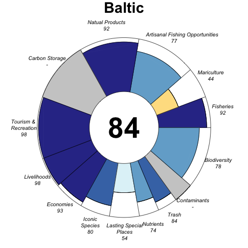
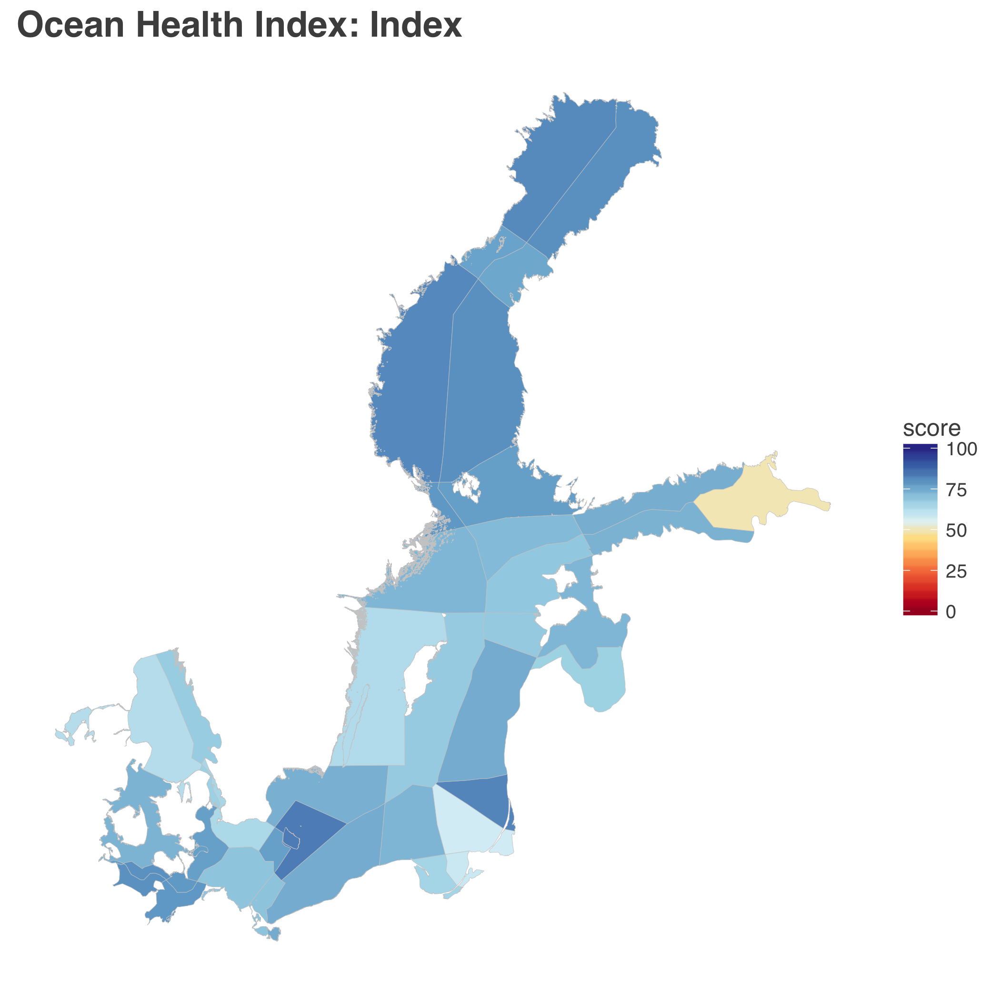
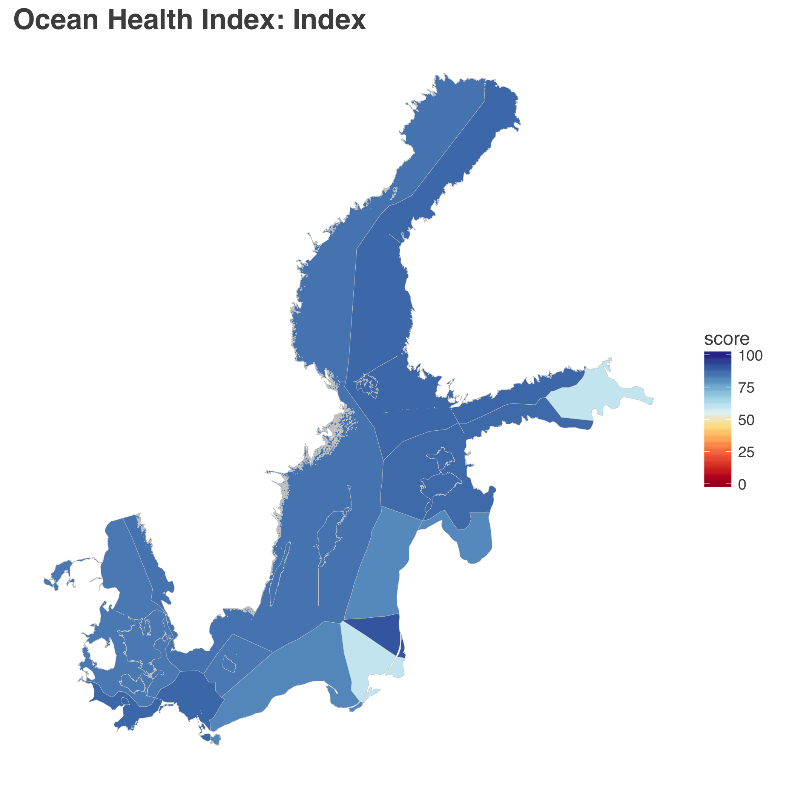
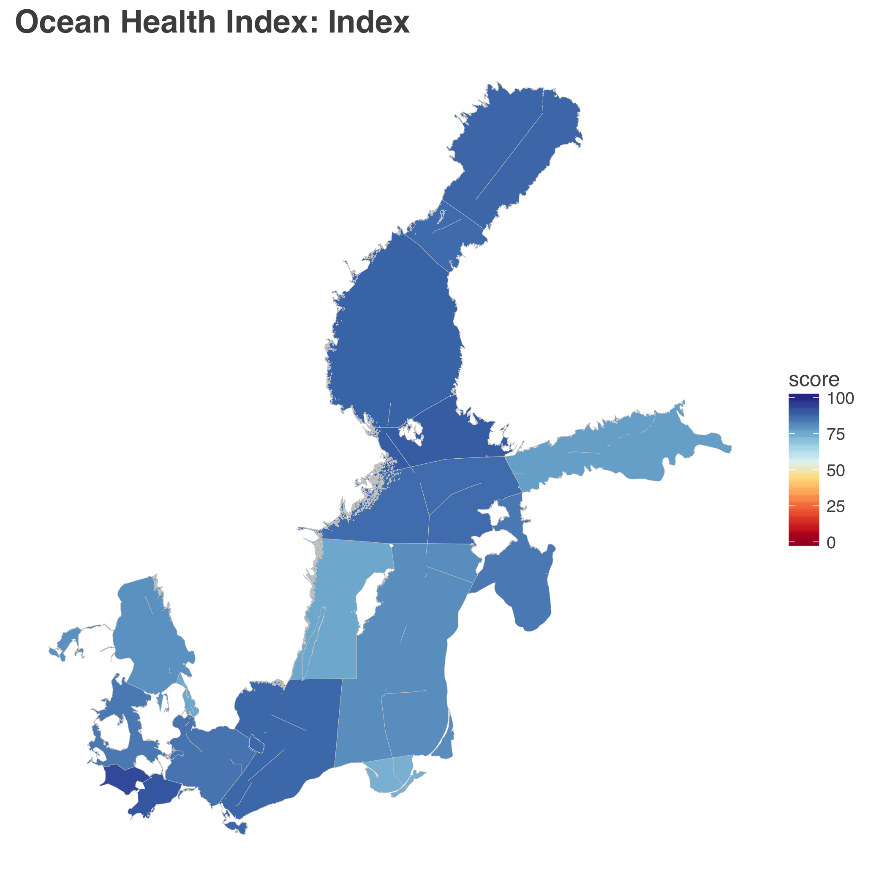

```{r setup, include=FALSE}
knitr::opts_chunk$set(echo = FALSE, message = FALSE, warning = FALSE)

library(tidyverse)
library(viridis) # install.packages('viridis')
library(cowplot)
```

## Figures {.tabset}

### Figure 1. BHI schematic

### Figure 2. Baltic Flower Plot

add figure legend text




### Figure 3. Index Score Maps

figure legend text, these will be arranged as subplots

a) 42 BHI regions


b) 9 EEZs



c) 17 Subbasins




### Figure 4: Trend *Options*

```{r scores and conf wrangle}
## scores wrangle 
scores <- readr::read_csv('scores.csv') %>%
  filter(dimension == "status" | dimension == "future") %>%
  spread(key = dimension, value = score) %>%
  mutate(goal = fct_inorder(goal), 
         lfs_minus_status = future - status, 
         ymin = if_else(lfs_minus_status >  0, future, status),
         ymax = if_else(lfs_minus_status <= 0, future, status)) %>%
  left_join(read_csv("spatial/regions_list.csv") %>%
              select(region_id = rgn_id, region_name = rgn_name), 
            by = "region_id")

## read in conf for ordering info
conf <- readr::read_csv('conf/goals.csv')
goals_supra <- na.omit(unique(conf$parent))
supra_lookup <- conf %>%
  filter(goal %in% goals_supra) %>%
  dplyr::select(parent = goal, name_supra = name)

  ## extract conf info for labeling
  conf <- conf %>%
    left_join(supra_lookup, by = 'parent') %>%
    # filter(!(goal %in% goals_supra)) %>%
    dplyr::select(goal, order_color, order_hierarchy,
           weight, name_supra, name_flower) %>%
    mutate(goal_group_color = if_else(!is.na(name_supra), name_supra, name_flower)) %>%
    arrange(order_hierarchy)

  ## join scores and conf ----
  scores <- scores %>%
    inner_join(conf, by="goal") %>%
    arrange(order_color) %>%
    mutate(goal = fct_inorder(goal), 
           goal_group_color = fct_inorder(goal_group_color))
```


#### Arrow plot

This is probably a better way of visualizing the information we want: status and trend indication for each goal, by EEZ.

Right now the line is the actual trend value...could also just represent with a line of the same length to focus attention on direction, not magnitude.

```{r plot EEZ trend}
## figured out arrow from http://sape.inf.usi.ch/quick-reference/ggplot2/geom_segment

ggplot(data = scores %>% filter(region_id > 300 & region_id < 500), 
       aes(x = fct_rev(goal), y = status, color = goal_group_color)) + 
  geom_point(size = 2) + 
  geom_segment(aes(x = goal, y = status, xend = goal, yend = status + lfs_minus_status), arrow=arrow(length = unit(0.25, "cm"), ends = "last")) +
  scale_color_viridis(discrete=TRUE) +
  facet_wrap(~region_name) +
  coord_flip() +
  theme_bw()  # use casey's theme in common.R

```

I tried create something like Fig 3 in OHI West Coast (Halpern et al. 2014):


But it is not a great visualization of what we care about... 

#### EEZ regions

```{r set shapes}
shps <- c("FIS" = 16, "MAR" = 17, "FP" = 15,
          "BD" = 15,
          "CON" = 16, "EUT" = 17, "TRA" = 18, "CW" = 15,
          "LIV" = 16, "ECO" = 17, "LE" = 15,
          "LSP" = 16, "ICO" = 17, "SP" = 15,
          "AO" = 15,
          "TR" = 15, 
          "CS" = 15, 
          "NP" = 15,
          "Index" = 15)
```


We'll probably want to do this figure for EEZs because there are too many BHI regions. This is not a great visualization. Could simplify: grey out non-interesting, simplify to goal-level. But ultimately, this visualization looks like it's going through time, so it's not a good way to plot: could do a quadrant so that it's good doing better, bad doing better, bad doing worse. 


Message here: CW not doing great and doesn't look like it will do great in the future, opposite of other goals?


```{r plot EEZ facet region_name}
## plot EEZ regions
ggplot(data = scores %>% filter(region_id > 300 & region_id < 500), 
       aes(x = status, y = lfs_minus_status, color = goal, shape = goal)) + 
  geom_point(position = "jitter", size = 3) + 
  ylim(-40, 40) +
  scale_color_viridis(discrete=TRUE) +
  scale_shape_manual(values = shps) +
  facet_wrap(~region_name) +
  theme_bw() + # use casey's theme in common.R
  geom_hline(yintercept = 0, color = "darkgray")
```

We could try flipping it by goal, with each country to have its own color. 

```{r plot EEZ facet goal}
## plot EEZ regions
ggplot(data = scores %>% filter(region_id > 300 & region_id < 500), 
       aes(x = status, y = lfs_minus_status, color = region_name)) + 
  geom_point(position = "jitter", size = 3) + 
  ylim(-40, 40) +
  scale_color_viridis(discrete=TRUE) +
  facet_wrap(~goal) +
  theme_bw() + # use casey's theme in common.R
  geom_hline(yintercept = 0, color = "darkgray") 
```


#### BHI regions

Too many regions to plot usefully. 

```{r plot BHI regions}
## plot BHI regions
ggplot(data = scores %>% filter(region_id < 300), 
       aes(x = status, y = lfs_minus_status)) + 
  geom_point() + 
  facet_wrap(~region_id)
```

#### Subbasin:

Still too many subplots, also, is this the scale the people care about? 

```{r plot subbasin}
## scores for Subbasin regions
ggplot(data = scores %>% filter(region_id > 500), 
       aes(x = status, y = lfs_minus_status)) + 
  geom_point() + 
  facet_wrap(~region_id)
```


## Tables {.tabset}

### Table 1: Goals

```{r}
read.csv('https://raw.githubusercontent.com/OHI-Science/ohi-global/draft/global_supplement/tables/ten_goals.csv') %>%
  knitr::kable()
```


### Table 2: Resilience

Combine these tables

#### resilience info

```{r resilience info}
layers_csv <- read_csv("layers.csv")

layers_csv %>%
  filter(targets == "resilience") %>%
  select(layer, description) %>%
  knitr::kable()

write_csv(layers_csv, "reports/manuscript/resil_table.csv")

```

#### resilience matrix

```{r resilience matrix}
resil <- read.csv("conf/resilience_matrix.csv")

resil <- resil %>%
  tibble::rownames_to_column() %>% 
  select(-element) %>%
  gather(goal, value, -rowname) %>%
  # select(-rowname)
  spread(rowname, value) 

## clean up table
names(resil) <- resil %>% filter(goal == "goal")


## substitute
goal_list <- names(resil)[-1]

resil <- resil %>%
  mutate(AO = str_replace_all(AO, "x", "AO"), 
         LSP = str_replace_all(LSP, "x", "LSP"),
         MAR = str_replace_all(MAR, "x", "MAR"),
         BD = str_replace_all(BD, "x", "BD"),
         TR = str_replace_all(TR, "x", "TR"),
         NP = str_replace_all(NP, "x", "NP"),
         CS = str_replace_all(CS, "x", "CS"),
         CON = str_replace_all(CON, "x", "CON"),
         EUT = str_replace_all(EUT, "x", "EUT"),
         TRA = str_replace_all(TRA, "x", "TRA"),
         ECO = str_replace_all(ECO, "x", "ECO"),
         FIS = str_replace_all(FIS, "x", "FIS"),
         ICO = str_replace_all(ICO, "x", "ICO"),
         LIV = str_replace_all(LIV, "x", "LIV")) %>%
  filter(goal != "goal")

# data_frame(resil_layer, 
# for (g in goal_list) {
#   
#   
# }

# 
# a <- glue::glue_collapse(resil, ", ")
# glue::glue_collapse(resil[2,], ", ")
# x <- glue::glue_collapse(resil[1,], ", ")
# y <- paste0(resil[1,], "")


resil %>% 
  knitr::kable()


```

