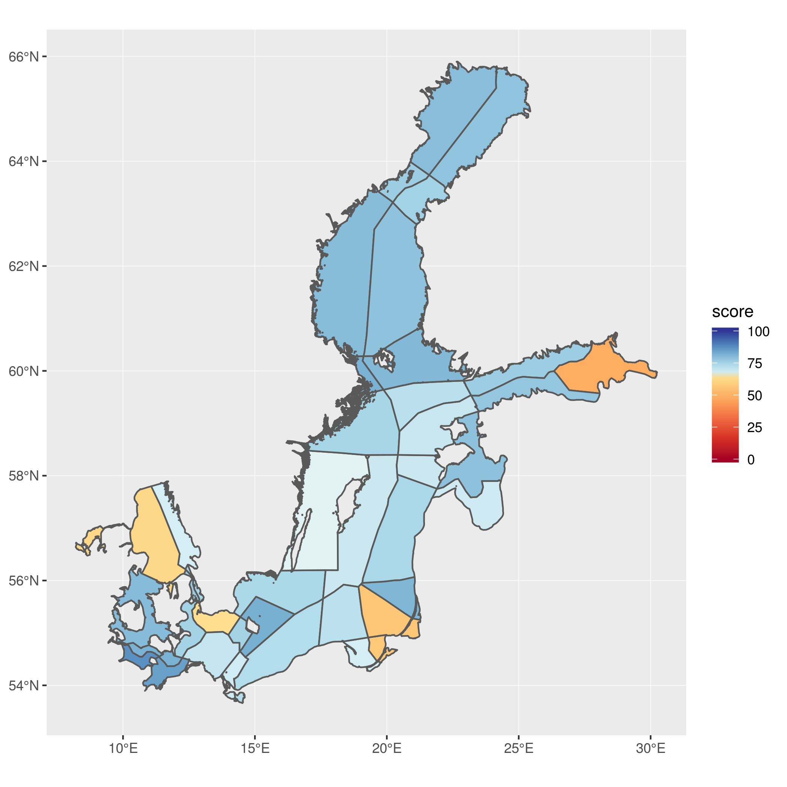

```{r setup, include=FALSE}
knitr::opts_chunk$set(echo = TRUE)


```

## Figure 2. Flower Plot for Whole Baltic

<add text here>


## Figure 3. Maps for Index at 3 different scales


a) 42 BHI regions


b) 9 EEZs


c) 17 Subbasins


## sf
st_union
st_dissolve
https://rawgit.com/jafflerbach/spatial-analysis-R/gh-pages/intro_to_sf.html


## Resilience Table or Figure

## Trend figure like Fig 3 in West Coast


