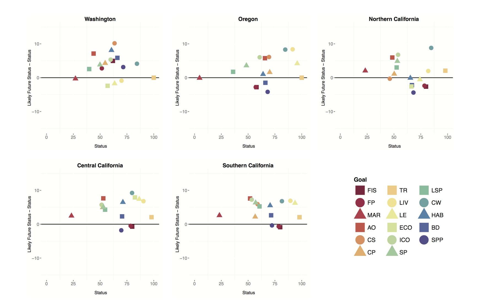

```{r setup, include=FALSE}
knitr::opts_chunk$set(echo = FALSE, message = FALSE, warning = FALSE)

library(tidyverse)
```

## Figures

### Figure 1. BHI schematic

### Figure 2. Baltic Flower Plot

add figure legend text


### Figure 3. Index Maps

figure legend text, these will be arranged as subplots

Check out Alexa's tweet, Jarrett ggmaps idea. Casey put one in BC
ohibc/calc_ohibc/ms_figures/1_flower_plot_map
cowplot for bundling plots

a) 42 BHI regions


b) 9 EEZs


c) 17 Subbasins


### Figure 4: Trend

We want to create something like Fig 3 in OHI West Coast (Halpern et al. 2014)



talk to casey and courtney: we tend to underweight resil and overweight pressure so trend isn't great


Quickly exploring potential figures: 

```{r scores wrangle}
## scores wrangle 
scores <- readr::read_csv('scores.csv') %>%
  filter(dimension == "status" | dimension == "future") %>%
  spread(key = dimension, value = score) %>%
  mutate(lfs_minus_status = future - status, 
         ymin = if_else(lfs_minus_status >  0, future, status),
         ymax = if_else(lfs_minus_status <= 0, future, status)) %>%
  left_join(read_csv("spatial/regions_list.csv") %>%
              select(region_id = rgn_id, region_name = rgn_name), 
            by = "region_id")

## manual colors
# https://ggplot2.tidyverse.org/reference/scale_manual.html#examples
cols <- c("FIS" = "red", "MAR" = "red", "FP" = "red",
          "BD" = "blue",
          "CON" = "orange", "EUT" = "orange", "TRA" = "orange", "CW" = "orange",
          "LIV" = "darkgreen", "ECO" = "darkgreen", "LE" = "darkgreen",
          "LSP" = "cyan", "ICO" = "cyan", "SP" = "cyan",
          "AO" = "yellow",
          "TR" = "pink", 
          "CS" = "darkorange", 
          "NP" = "purple",
          "Index" = "darkgray")

shps <- c("FIS" = 16, "MAR" = 17, "FP" = 15,
          "BD" = 15,
          "CON" = 16, "EUT" = 17, "TRA" = 18, "CW" = 15,
          "LIV" = 16, "ECO" = 17, "LE" = 15,
          "LSP" = 16, "ICO" = 17, "SP" = 15,
          "AO" = 15,
          "TR" = 15, 
          "CS" = 15, 
          "NP" = 15,
          "Index" = 15)
```

#### EEZ regions

We'll probably want to do this figure for EEZs because there are too many BHI regions

TODO/TODISCUSS:

- is this plot even a good idea? 
- better colors
- legend group by color
- clean up theme
- ylims?

Message here: CW not doing great and doesn't look like it will do great in the future, opposite of other goals
Could simplify: grey out non-interesting, simplify to goal-level
This plot looks like it's going through time, not a good way to plot: could do a quadrant so that it's good doing better, bad doing better, bad doing worse. 

Try flipping it by goal: do we want each country to have its own color

Try with an error bar only in one direction, with an arrow tip or a geom_linerange: make a line from status to status+10

```{r plot EEZ}
## plot EEZ regions
ggplot(data = scores %>% filter(region_id > 300 & region_id < 500), 
       aes(x = status, y = lfs_minus_status, color = goal, shape = goal)) + 
  geom_point(position = "jitter", size = 3) + 
  ylim(-40, 40) +
  scale_colour_manual(values = cols) + 
  scale_shape_manual(values = shps) +
  facet_wrap(~region_name) +
  theme_bw() + # use casey's theme in common.R
  geom_hline(yintercept = 0, color = "darkgray") + 
  scale_fill_discrete(name = "Title")
# labels = c("A", "B", "C"))
```


#### BHI regions
```{r plot BHI regions}
## plot BHI regions
ggplot(data = scores %>% filter(region_id < 300), 
       aes(x = status, y = lfs_minus_status)) + 
  geom_point() + 
  facet_wrap(~region_id)
```

This is too many. 

#### Subbasin:
```{r plot subbasin}
## scores for Subbasin regions
ggplot(data = scores %>% filter(region_id > 500), 
       aes(x = status, y = lfs_minus_status)) + 
  geom_point() + 
  facet_wrap(~region_id)
```

## Another way

```{r plot EEZ trend}
## from cheatsheet
# df <- data.frame(grp = c("A", "B"), fit = 4:5, se = 1:2)
# k <- ggplot(df, aes(grp, fit, ymin = fit-se, ymax = fit+se)) + geom_pointrange()

## plot EEZ regions


ggplot(data = scores %>% filter(region_id > 300 & region_id < 500), 
       aes(x = goal, y = status)) + 
  geom_pointrange(aes(ymin = ymin, ymax = ymax)) + 
  geom_segment(aes(x = goal, y = status, xend = goal, yend = status+lfs_minus_status), arrow=arrow(length = unit(0.25, "cm"), ends = "last")) +
  # scale_colour_manual(values = cols) + 
  # scale_shape_manual(values = shps) +
  facet_wrap(~region_name) +
  coord_flip() +
  theme_bw() + # use casey's theme in common.R
  geom_hline(yintercept = 0, color = "darkgray") + 
  scale_fill_discrete(name = "Title")
# labels = c("A", "B", "C"))

x <- scores %>% 
  # filter(region_id == 0) %>%
  mutate(#goal = fct_inorder(goal), 
         goal = fct_relevel(goal, c("FIS", "MAR", "FP", "BD", "CON", "EUT", "TRA", "CW", "LIV", "ECO", "LE",
          "LSP", "ICO", "SP", "AO", "TR", "CS", "NP", "Index")))
# (or fct_reorder)
# fct_reverse

require(grid)
d=data.frame(x=c(1,2,5,6,8), y=c(3,6,2,8,7), vx=c(1,1.5,0.8,0.5,1.3), vy=c(0.2,1.3,1.7,0.8,1.4))
ggplot() + 
geom_segment(data=d, mapping=aes(x=x, y=y, xend=x+vx, yend=y+vy), arrow=arrow(), size=2, color="blue") + 
geom_point(data=d, mapping=aes(x=x, y=y), size=4, shape=21, fill="white") 
# opts(title="geom_segment", plot.title=theme_text(size=40, vjust=1.5))

```


## Tables

### Table 1: Goals

### Table 2: Resilience

Combine these tables

#### resilience info

```{r resilience info}
layers_csv <- read_csv("layers.csv")

layers_csv %>%
  filter(targets == "resilience") %>%
  select(layer, description) %>%
  knitr::kable()
```

#### resilience matrix

```{r resilience matrix}
resil <- read.csv("conf/resilience_matrix.csv")

resil %>%
  rownames_to_column() %>% 
  select(-element) %>%
  gather(goal, value, -rowname) %>% 
  spread(rowname, value) %>%
  knitr::kable()
```

