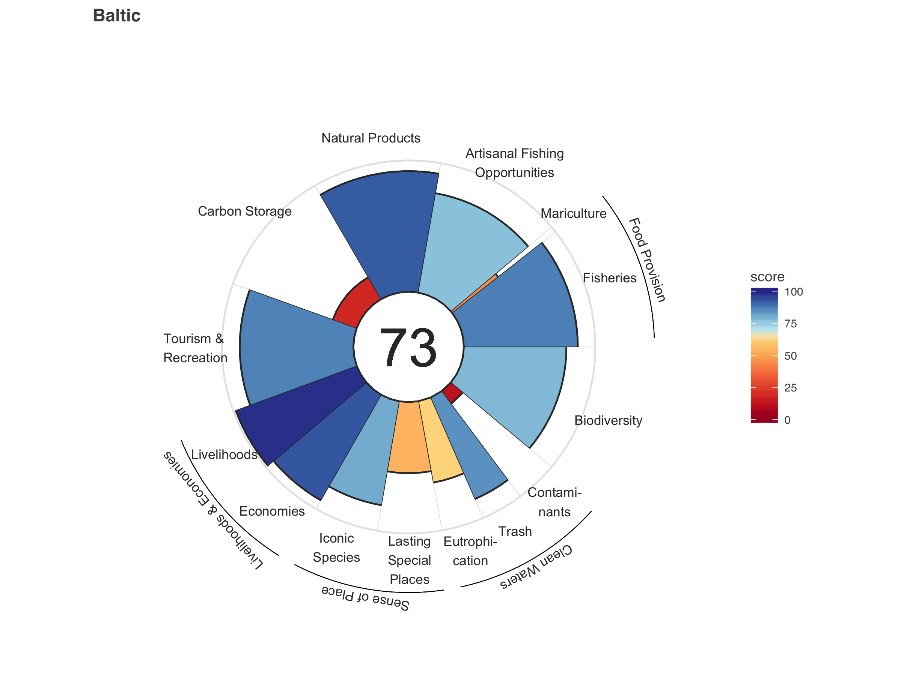
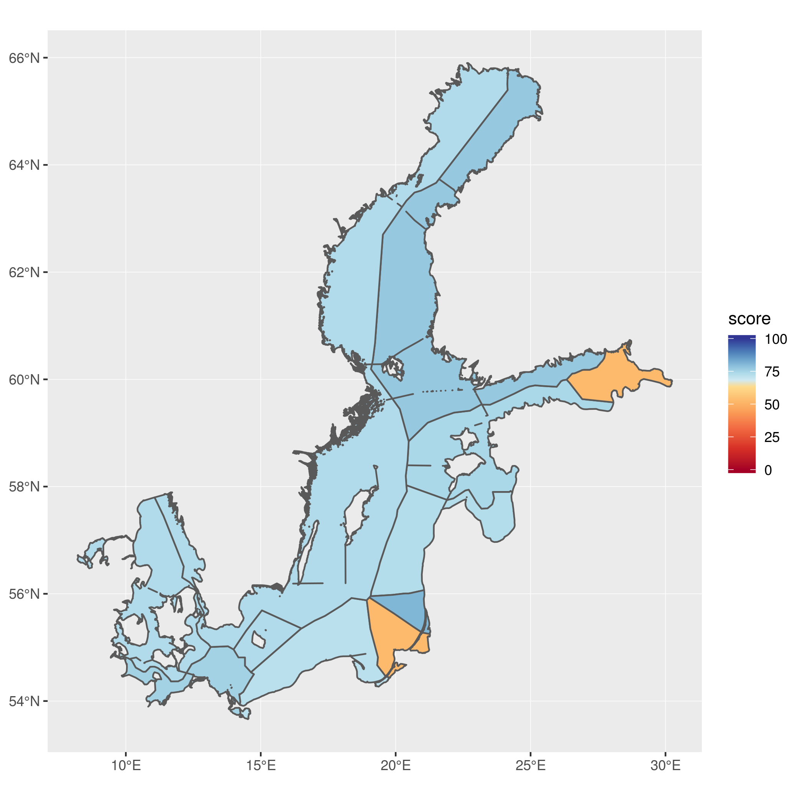
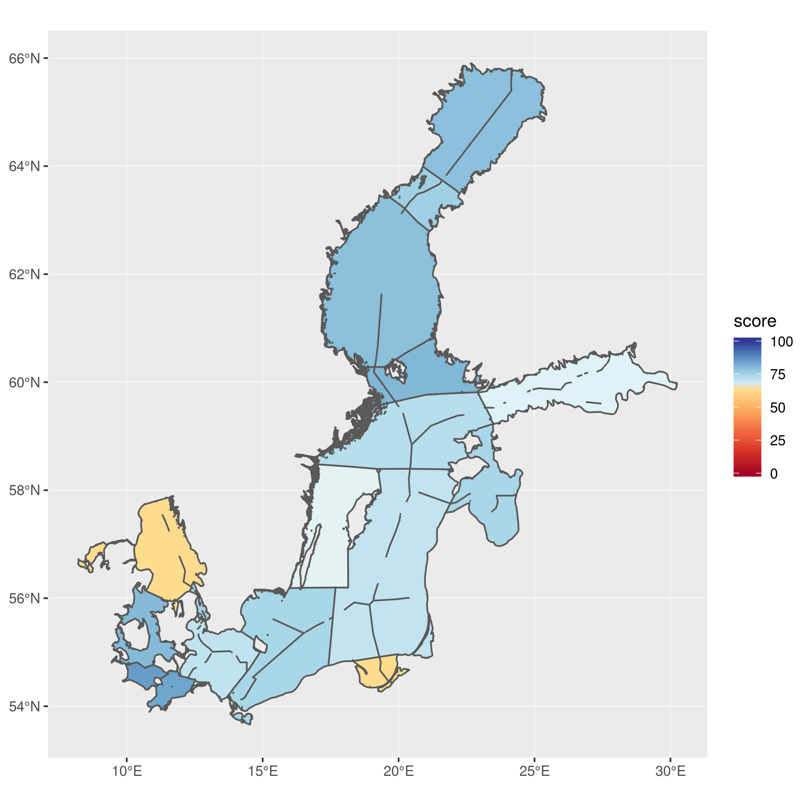

Manuscript figures
================
Julie
6/27/2018

-   [Figures](#figures)
    -   [Fig 1. BHI schematic](#fig-1.-bhi-schematic)
    -   [Fig 2. Flower Plot](#fig-2.-flower-plot)
    -   [Fig 3. Maps](#fig-3.-maps)
    -   [Fig 4: Trend *Options*](#fig-4-trend-options)
-   [Tables](#tables)
    -   [Table 1: Goals](#table-1-goals)
    -   [Table 2: Resilience](#table-2-resilience)
    -   [Table 3](#table-3)

Figures
-------

Figure drafts for the [BHI manuscript](https://docs.google.com/document/d/1b68Gur82Vpqzv9Wd1iPNvdpEg8b-isiKuGGKQIRe3p4/edit?ts=5b2babdf#heading=h.z31blqteqiqo).

### Fig 1. BHI schematic

(Thorsten is creating BHI schematic)

### Fig 2. Flower Plot

Scores by goal for the Baltic Sea, which has an overall Index score of 73. Each petal in this flower plot represents an individual goal, and the petal length and color convey the score of the goal (i.e. longer petals are closer to achieving their target).

### Fig 3. Maps

Scores by region for the Baltic Sea, on three different spatial scales. BHI regions (a) are the 42 areas resulting from the intesection of the exclusive economic zones (EEZ)s of 9 Baltic countries (b) with the 17 Baltic subbasins (c). (*these will be arranged as subplots*)

1.  42 BHI regions 

2.  9 EEZs

1.  17 Subbasins

### Fig 4: Trend *Options*

#### Arrow plot

Status and trend for each goal for every Baltic EEZ. Most goals had high scores and increasing trends. However, the clean waters goal (and subgoals) tended to have lower scores, particularly for contaminants (CON). See Table 1 for goal codes.

Notes:

-   *This is probably a better way of visualizing the information we want: status and trend indication for each goal, by EEZ. But scroll down for other options.*
-   Right now the line is the actual trend value...could also just represent with a line of the same length to focus attention on direction, not magnitude.

We can get ideas for style from this figure (Thanks Casey!)

#### Like West Coast Fig 3

I tried create something like Fig 3 in OHI West Coast (Halpern et al. 2014):

But it is not a the best way to visualize this information and piece out what is interesting...

##### EEZ regions

We'll probably want to do this figure for EEZs because there are too many BHI regions. This is not a great visualization. Could simplify: grey out non-interesting, simplify to goal-level. But ultimately, this visualization looks like it's going through time, so it's not a good way to plot: could do a quadrant so that it's good doing better, bad doing better, bad doing worse.

Message here: CW not doing great and doesn't look like it will do great in the future, opposite of other goals?

We could try flipping it by goal, with each country to have its own color.

##### BHI regions

Too many regions to plot usefully.

##### Subbasin:

Still too many subplots, also, is this the scale the people care about?

Tables
------

### Table 1: Goals

See table in the [BHI manuscript](https://docs.google.com/document/d/1b68Gur82Vpqzv9Wd1iPNvdpEg8b-isiKuGGKQIRe3p4/edit?ts=5b2babdf#heading=h.4o0ykp2rgoc3). Alternative goal description text available

### Table 2: Resilience

Combine these tables: add a 3rd column to the first table, listing the goals affected.

#### resilience info

| layer            | description                                                                                                                                                                                                                                                    |
|:-----------------|:---------------------------------------------------------------------------------------------------------------------------------------------------------------------------------------------------------------------------------------------------------------|
| res\_reg\_birds  | Directive 2009/147/EC of the European Parliament and of the Council of 30 November 2009 on the conservation of wild birds                                                                                                                                      |
| res\_reg\_bsap   | HELCOM 2007. HELCOM Baltic Sea Action Plan (BSAP). HELCOM Ministerial Meeting. Adopted in Krakow, Poland, 15 November 2007.                                                                                                                                    |
| res\_reg\_bwd    | Directive 2006/7/EC of the European Parliament and of the Council of 15 February 2006 concerning the management of bathing water quality and repealing the Directive 76/160/EC                                                                                 |
| res\_reg\_cbd    | Convention on Biodiversity                                                                                                                                                                                                                                     |
| res\_reg\_cfp    | Regulation 1380/2013/EU of the European Parliament and of the Council of 11 December 2013 on the Common Fisheries Policy, amending Council Regulations (EC) No 1954/2003 and (EC) No 1224/2009 and repealing Council Regulations (EC) No 2371/2002 and (EC) No |
| res\_reg\_cites  | Convention on International Trade in Endangered Species of Wild Fauna and Flora                                                                                                                                                                                |
| res\_reg\_cop21  | Paris Climate Agreement                                                                                                                                                                                                                                        |
| res\_reg\_hd     | Directive 1992/43/EC of 21 May 1992 on the conservation of natural habitats and of wild fauna and flora                                                                                                                                                        |
| res\_reg\_helcom | Convention on the Protection of the Marine Environment of the Baltic Sea Area 1992                                                                                                                                                                             |
| res\_reg\_ied    | Directive 2010/75/EU of the European Parliament and of the Council of 24 November 2010 on industrial emissions (integrated pollution prevention and control)                                                                                                   |
| res\_reg\_msfd   | Directive 2008/56/EC of the European Parliament and of the Council of 17 June 2008 establishing a framework for community action in the field of marine environmental policy                                                                                   |
| res\_reg\_mspd   | Directive 2014/89/EC of the European Parliament and of the Council of 23 July 2014 establishing a framework for maritime spatial planning                                                                                                                      |
| res\_reg\_nd     | Council Directive 91/676/EEC of 12 December 1991 concerning the protection of waters against pollution caused by nitrates from agricultural sources                                                                                                            |
| res\_reg\_nec    | Directive 1999/32/EC of 26 April 1999 relating to a reduction in the sulphur content of certain liquid fuels and amending Directive 93/12/EEC                                                                                                                  |
| res\_reg\_pop    | Regulation 850/2004/EC of the European Parliament and of the Council of 29 April 2004 on persistent organic pollutants and amending Directive 79/117/EEC                                                                                                       |
| res\_reg\_reach  | Regulation 1907/2006/EC of the European Parliament and of the Council of 18 December 2006 concerning the Registration, Evaluation, Authorisation and Restriction of Chemicals (REACH), establishing a European Chemicals Agency, amending Directive 1999/45/EC |
| res\_reg\_uwwtd  | Directive 1991/271/EEC Council Directive of 21 May 1991 concerning urban waste water treatment                                                                                                                                                                 |
| res\_reg\_wfd    | Directive 2000/60/EC of the European Parliament and of the Council of 23 October 2000 establishing a framework for Community action in the field of water policy                                                                                               |
| wgi\_all         | World Governance Indicators (WGI) six combined scores.                                                                                                                                                                                                         |

Data sources:

-   [Worldwide Governance Indicators (WGI)](http://info.worldbank.org/governance/wgi/index.asp)
    res\_biodiversity NA

#### resilience matrix

| goal              | AO  | LSP | MAR | BD  | TR  | NP  | CS  | CON | EUT | TRA | ECO | FIS | ICO | LIV |
|:------------------|:----|:----|:----|:----|:----|:----|:----|:----|:----|:----|:----|:----|:----|:----|
| res\_biodiversity | AO  |     |     | BD  |     | NP  |     |     |     |     |     | FIS | ICO |     |
| res\_reg\_birds   |     | LSP |     | BD  | TR  | NP  |     | CON |     |     | ECO | FIS | ICO |     |
| res\_reg\_bsap    | AO  | LSP | MAR | BD  |     | NP  | CS  | CON | EUT | TRA | ECO | FIS | ICO | LIV |
| res\_reg\_bwd     |     |     |     |     | TR  |     |     | CON | EUT | TRA |     |     |     |     |
| res\_reg\_cbd     |     |     |     | BD  |     |     |     |     |     |     |     |     | ICO |     |
| res\_reg\_cfp     | AO  | LSP | MAR | BD  | TR  | NP  |     |     |     |     |     | FIS | ICO |     |
| res\_reg\_cites   |     |     |     | BD  |     |     |     |     |     |     |     |     | ICO |     |
| res\_reg\_cop21   | AO  | LSP | MAR | BD  |     | NP  | CS  |     | EUT |     | ECO | FIS | ICO | LIV |
| res\_reg\_hd      |     | LSP |     | BD  |     | NP  |     |     |     |     |     | FIS | ICO |     |
| res\_reg\_helcom  |     |     |     | BD  |     | NP  |     | CON | EUT | TRA |     | FIS |     |     |
| res\_reg\_ied     |     |     |     |     |     |     | CS  | CON | EUT | TRA |     |     |     |     |
| res\_reg\_msfd    | AO  | LSP | MAR | BD  | TR  | NP  | CS  | CON | EUT | TRA | ECO | FIS | ICO | LIV |
| res\_reg\_mspd    |     | LSP | MAR | BD  | TR  | NP  | CS  |     |     |     | ECO | FIS | ICO | LIV |
| res\_reg\_nd      |     |     |     | BD  |     |     | CS  |     | EUT |     |     |     |     |     |
| res\_reg\_nec     |     |     |     |     |     |     |     | CON | EUT |     | ECO |     |     |     |
| res\_reg\_pop     |     |     |     |     |     |     |     | CON |     |     |     |     |     |     |
| res\_reg\_reach   |     |     | MAR | BD  | TR  |     |     | CON | EUT | TRA | ECO |     |     | LIV |
| res\_reg\_uwwtd   |     |     |     | BD  |     |     | CS  | CON | EUT |     |     |     |     |     |
| res\_reg\_wfd     | AO  | LSP |     | BD  | TR  | NP  | CS  | CON | EUT |     | ECO | FIS | ICO | LIV |
| wgi\_all          | AO  | LSP | MAR | BD  | TR  | NP  | CS  | CON | EUT | TRA | ECO | FIS | ICO | LIV |

### Table 3

Spatial overall scores from the North to the South. The lowest and highest goal scores are named. [See manuscript](https://docs.google.com/document/d/1b68Gur82Vpqzv9Wd1iPNvdpEg8b-isiKuGGKQIRe3p4/edit?ts=5b2babdf#heading=h.fcglywpdew0z)
