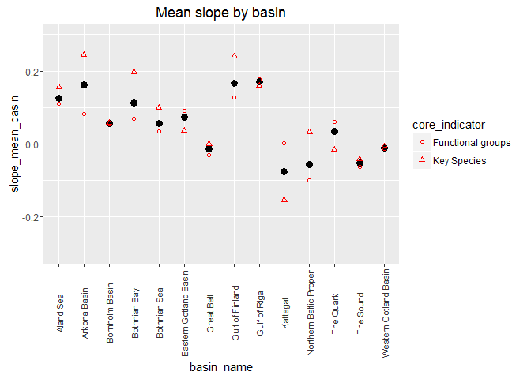

ao\_prep.rmd
================

-   [Artisanal Opportunity (AO) Goal Data Prep](#artisanal-opportunity-ao-goal-data-prep)
    -   [1. Goal Overview](#goal-overview)
        -   [1.1 Components](#components)
        -   [1.2 Goal model](#goal-model)
    -   [2. Data](#data)
        -   [2.1 Data Source](#data-source)
        -   [2.2 Data locations](#data-locations)
        -   [2.3 GES status scoring](#ges-status-scoring)
        -   [2.4 Regions with no data](#regions-with-no-data)
    -   [3.Data layer preparation](#data-layer-preparation)
        -   [3.1 Read in data](#read-in-data)
        -   [3.2 Assign scores to GES status](#assign-scores-to-ges-status)
        -   [3.3 Unique indicators per monitoring location](#unique-indicators-per-monitoring-location)
        -   [3.4 BHI score](#bhi-score)
    -   [4. AO Status](#ao-status)
        -   [4.1 Final score objects](#final-score-objects)
    -   [5. Calculate Trend of the status](#calculate-trend-of-the-status)
        -   [5.1 Read in slopes](#read-in-slopes)
        -   [5.2 Remove Ringkoebing Fjord and Nissum Fjord](#remove-ringkoebing-fjord-and-nissum-fjord)
        -   [5.3 Mean Slope group x basin](#mean-slope-group-x-basin)
        -   [5.4 Mean slope for each indicator (Functional group, Key Spp)](#mean-slope-for-each-indicator-functional-group-key-spp)
        -   [5.5 Basin mean slope](#basin-mean-slope)
        -   [5.6 Apply slopes by Basin to BHI Region](#apply-slopes-by-basin-to-bhi-region)
        -   [5.1 Final slope object](#final-slope-object)
    -   [6. Export Layers for functions.r](#export-layers-for-functions.r)

Artisanal Opportunity (AO) Goal Data Prep
=========================================

1. Goal Overview
----------------

### 1.1 Components

This goal has three sub-components: *stock, access, and need*. For BHI we focus first on the *stock* sub-component and will use this as a proxy for the entire goal initially

### 1.2 Goal model

#### 1.2.1 Status

Xao = Mean Stock Indicator Value / Reference pt
Stock indicators = two HELCOM core indicators assessed for good environemental status (each scored between 0 and 1 by BHI)
Reference pt = maximum possible good environmental status (value=1)

#### 1.2.2 Trend

**Background**
CPUE time series are available for all stations used for the HELCOM coastal fish populations core indicators. These data were provided by Jens Olsson (FISH PRO II project). To calculate GES status, full time series were used. Therefore, only one status time point and cannot calculate trend of status over time. Instead, follow approach from Bergström et al 2016, but only focus on the final time period for the slope (2004-2013).

[Bergstrom et al. 2016. Long term changes in the status of coastal fish in the Baltic Sea. Estuarin, Coast and Shelf Science. 169:74-84](http://www.sciencedirect.com/science/article/pii/S0272771415301700http://www.sciencedirect.com/science/article/pii/S0272771415301700)

**Trend Method** 1.Select final time period of trend assessment (2004-2013)
2. Use time series from both indicators, Key Species and Functional groups. For functional groups,include both cyprinid and piscivore time series.
3. For each time series: square-root transform data, z-score, fit linear regression, extract slope
4. Within each time series group (key species, cyprinid, piscivore), take the mean slope for each group within each basin
5. Within each basin take a mean functional group indicator slope (mean of cyprinid mean and piscivore mean)
6. For each basin take overall mean slope - mean of key species and functional group
7. Apply trend value for basin to all BHI regions (except in Gulf of Finland, do not apply Finnish site value to Estonia and Russian regions.)
\*Steps 1-3 done in file `AO/ao_slope_calc.r`

2. Data
-------

### 2.1 Data Source

[HELCOM Core Indicator Abundance of coastal fish key functional groups](http://helcom.fi/baltic-sea-trends/indicators/abundance-of-coastal-fish-key-functional-groups/)

[HELCOM Core Indicator Abundance of key coastal fish species](http://helcom.fi/baltic-sea-trends/indicators/abundance-of-key-coastal-fish-species)
Good Environmental Status (GES) is assessed as either *GES* or *sub-GES* based on data times series using either a baseline or a trend approach, [see explanation](http://helcom.fi/baltic-sea-trends/indicators/abundance-of-key-coastal-fish-species/good-environmental-status/). There is only a single assessment for each region.

*status qualifying comments*: for one dataset if a monitoring station receives a "sub-GES" assessment, it is given a qualifier as "low" or "high".

Environmental status assessments provided by Jens Olsson (SLU). See [HELCOM FISH-PRO II](http://www.helcom.fi/helcom-at-work/projects/fish-pro/)

CPUE data used in the GES assessment. Data provided by Jens Olsson, used in trend. Slopes from each analsysis available here, but CPUE data held internally in the BHI database.

### 2.2 Data locations

Data are from monitoring locations (described in the HELCOM core indicators). Finnish data are fisheries data from ICES assessment regions (ICES 29-32).

### 2.3 GES status scoring

Alternative methods are explored in data prep. This method was selected GES = 1, subGES = 0.2 *If value does not meet GES threshold but have data to assess status receive score of 0.2. This way, if regions are not assessed and use 0 for these regions, a distinction is made (NA in the OHI framework means "indicator not applicable", not "no data").*

### 2.4 Regions with no data

Assign value of NA to these regions. Stocks were not assessed

    ## Warning: package 'readr' was built under R version 3.2.4

    ## Warning: package 'dplyr' was built under R version 3.2.5

    ## 
    ## Attaching package: 'dplyr'

    ## The following objects are masked from 'package:stats':
    ## 
    ##     filter, lag

    ## The following objects are masked from 'package:base':
    ## 
    ##     intersect, setdiff, setequal, union

    ## Warning: package 'tidyr' was built under R version 3.2.5

    ## Warning: package 'ggplot2' was built under R version 3.2.4

    ## Warning: package 'RMySQL' was built under R version 3.2.5

    ## Loading required package: DBI

    ## Warning: package 'DBI' was built under R version 3.2.5

    ## Warning: package 'rprojroot' was built under R version 3.2.4

3.Data layer preparation
------------------------

### 3.1 Read in data

Read in status assessment, monitoring area locations, lookup table for BHI regions to HOLAS basins.

Locations for the Finnish monitoring areas are not given by specific lat-lon because are assessment areas. I have assigned a single lat-lon for each Finnish monitoring area for plotting purposes.

``` r
## read in data...
  ## data are in "ao_data_database" - currently csv loaded directly there, need to put in the database and then set up script to extract

#assessment of GES status, all 2 indicators
coastal_fish = readr::read_csv2(file.path(dir_ao, 'ao_data_database/ao_coastalfish_ges_status.csv'))

head(coastal_fish)
```

    ## Source: local data frame [6 x 11]
    ## 
    ##   Basin_HOLAS Basin_assessment country monitoring_area    period
    ##         <chr>            <chr>   <chr>           <chr>     <chr>
    ## 1   Aland Sea        Aland Sea  Sweden          Lagnoe 2002-2013
    ## 2   Aland Sea        Aland Sea  Sweden          Lagnoe 2002-2013
    ## 3   Aland Sea        Aland Sea  Sweden          Lagnoe 2002-2013
    ## 4   Aland Sea  Archipelago Sea Finland      ICES SD 29 1998-2013
    ## 5   Aland Sea  Archipelago Sea Finland           Finbo 2002-2013
    ## 6   Aland Sea  Archipelago Sea Finland        Kumlinge 2003-2013
    ## Variables not shown: coastal_water_type <chr>, core_indicator <chr>, taxa
    ##   <chr>, assessment_method <chr>, status <chr>, status_comment <chr>.

``` r
dim(coastal_fish)
```

    ## [1] 120  11

``` r
str(coastal_fish)
```

    ## Classes 'tbl_df', 'tbl' and 'data.frame':    120 obs. of  11 variables:
    ##  $ Basin_HOLAS       : chr  "Aland Sea" "Aland Sea" "Aland Sea" "Aland Sea" ...
    ##  $ Basin_assessment  : chr  "Aland Sea" "Aland Sea" "Aland Sea" "Archipelago Sea" ...
    ##  $ country           : chr  "Sweden" "Sweden" "Sweden" "Finland" ...
    ##  $ monitoring_area   : chr  "Lagnoe" "Lagnoe" "Lagnoe" "ICES SD 29" ...
    ##  $ period            : chr  "2002-2013" "2002-2013" "2002-2013" "1998-2013" ...
    ##  $ coastal_water_type: chr  "Aland Sea Swedish Coastal waters" "Aland Sea Swedish Coastal waters" "Aland Sea Swedish Coastal waters" "Archipelago Sea Coastal waters" ...
    ##  $ core_indicator    : chr  "Key species" "Functional" "Functional" "Key species" ...
    ##  $ taxa              : chr  "perch" "cyprinids" "piscivores" "perch" ...
    ##  $ assessment_method : chr  "Trend" "Trend" "Trend" "Baseline" ...
    ##  $ status            : chr  "GES" "GES" "GES" "GES" ...
    ##  $ status_comment    : chr  NA NA NA NA ...

``` r
#locations of specific monitoring stations
coastal_fish_loc = read.csv(file.path(dir_ao, 'ao_data_database/ao_coastalfish_locations.csv'),
                          sep=";") ## can't use read_csv2 because while includes sep = ";" as the default, also has the default decimal separator as a comma so does not know what to do with a period

head(coastal_fish_loc)
```

    ##                             station_cleaned
    ## 1 Area south of Zealand (Smalandsfarvandet)
    ## 2                                 Arhus Bay
    ## 3                                     Askoe
    ## 4                               Boergerende
    ## 5                           Curonian Lagoon
    ## 6                 Darss-Zingst Bodden chain
    ##                                     station LAT__DEC_D LON__DEC_D DECWGSN
    ## 1 Area south of Zealand (Smalandsfarvandet)         NA         NA 54.6457
    ## 2                                 Arhus Bay         NA         NA 56.2244
    ## 3                                     Askoe    58.8120    17.7180 58.8120
    ## 4                               Boergerende         NA         NA 54.1700
    ## 5                           Curonian Lagoon    55.5169    21.2181 55.5169
    ## 6                 Darss-Zingst Bodden chain         NA         NA 54.3501
    ##   DECWGSE Shape_STAr Shape_STLe
    ## 1 11.7323         NA         NA
    ## 2 10.4284         NA         NA
    ## 3 17.7180         NA         NA
    ## 4 11.9100         NA         NA
    ## 5 21.2181         NA         NA
    ## 6 12.4408         NA         NA

``` r
dim(coastal_fish_loc)
```

    ## [1] 49  8

``` r
str(coastal_fish_loc)        
```

    ## 'data.frame':    49 obs. of  8 variables:
    ##  $ station_cleaned: Factor w/ 49 levels "Area south of Zealand (Smalandsfarvandet)",..: 1 2 3 4 5 6 7 8 9 16 ...
    ##  $ station        : Factor w/ 49 levels "Area south of Zealand (Smalandsfarvandet)",..: 1 2 3 4 5 6 7 8 9 10 ...
    ##  $ LAT__DEC_D     : num  NA NA 58.8 NA 55.5 ...
    ##  $ LON__DEC_D     : num  NA NA 17.7 NA 21.2 ...
    ##  $ DECWGSN        : num  54.6 56.2 58.8 54.2 55.5 ...
    ##  $ DECWGSE        : num  11.7 10.4 17.7 11.9 21.2 ...
    ##  $ Shape_STAr     : num  NA NA NA NA NA ...
    ##  $ Shape_STLe     : num  NA NA NA NA NA ...

``` r
## Station cleaned is a column that I created to make the station names match those under "monitoring_area" in the status asssessment

## assign lat-lon for ICES area to allow map plotting - assign location in center of Finnish coasts for ICES areas (29-32)

##ICES 31
 ##64.207281
 ##23.511161
##ICES 30
 ##61.679815
 ##21.269112
##ICES 29
 ##59.705518
 ##21.264879
##ICES 32
 ##60.108130
 ##25.772410
##Finnish Rectangle 23 & 28 (The Quark)
 ##63.505817
 ##21.351243

coastal_fish_loc = coastal_fish_loc%>%
                    mutate(lat = DECWGSN,
                           lon = DECWGSE)%>%
                    mutate(lat = ifelse(station_cleaned== "ICES SD 31", 64.207281,
                                 ifelse(station_cleaned== "ICES SD 30", 61.679815,
                                 ifelse(station_cleaned== "ICES SD 29", 59.705518,
                                 ifelse(station_cleaned== "ICES SD 32", 60.108130,
                                 ifelse(station_cleaned== "Rectangle 23 & 28",  63.505817,lat ))))),
                           lon = ifelse(station_cleaned== "ICES SD 31", 23.511161,
                                 ifelse(station_cleaned== "ICES SD 30", 21.269112,
                                 ifelse(station_cleaned== "ICES SD 29", 21.264879,
                                 ifelse(station_cleaned== "ICES SD 32", 25.772410,
                                 ifelse(station_cleaned== "Rectangle 23 & 28",  21.351243,lon ))))))%>%
                    mutate(station_cleaned = as.character(station_cleaned),
                           station = as.character(station))
str(coastal_fish_loc)
```

    ## 'data.frame':    49 obs. of  10 variables:
    ##  $ station_cleaned: chr  "Area south of Zealand (Smalandsfarvandet)" "Arhus Bay" "Askoe" "Boergerende" ...
    ##  $ station        : chr  "Area south of Zealand (Smalandsfarvandet)" "Arhus Bay" "Askoe" "Boergerende" ...
    ##  $ LAT__DEC_D     : num  NA NA 58.8 NA 55.5 ...
    ##  $ LON__DEC_D     : num  NA NA 17.7 NA 21.2 ...
    ##  $ DECWGSN        : num  54.6 56.2 58.8 54.2 55.5 ...
    ##  $ DECWGSE        : num  11.7 10.4 17.7 11.9 21.2 ...
    ##  $ Shape_STAr     : num  NA NA NA NA NA ...
    ##  $ Shape_STLe     : num  NA NA NA NA NA ...
    ##  $ lat            : num  54.6 56.2 58.8 54.2 55.5 ...
    ##  $ lon            : num  11.7 10.4 17.7 11.9 21.2 ...

``` r
#bhi region and HOLAS basin look up
 basin_lookup = read.csv(file.path(
  dir_ao,"bhi_basin_country_lookup.csv"), sep=";", stringsAsFactors = FALSE)
basin_lookup=basin_lookup %>% select(bhi_id=BHI_ID,basin_name=Subbasin)
basin_lookup
```

    ##    bhi_id             basin_name
    ## 1       1               Kattegat
    ## 2       2               Kattegat
    ## 3       3             Great Belt
    ## 4       4             Great Belt
    ## 5       5              The Sound
    ## 6       6              The Sound
    ## 7       7               Kiel Bay
    ## 8       8               Kiel Bay
    ## 9       9     Bay of Mecklenburg
    ## 10     10     Bay of Mecklenburg
    ## 11     11           Arkona Basin
    ## 12     12           Arkona Basin
    ## 13     13           Arkona Basin
    ## 14     14         Bornholm Basin
    ## 15     15         Bornholm Basin
    ## 16     16         Bornholm Basin
    ## 17     17         Bornholm Basin
    ## 18     18           Gdansk Basin
    ## 19     19           Gdansk Basin
    ## 20     20  Eastern Gotland Basin
    ## 21     21  Eastern Gotland Basin
    ## 22     22  Eastern Gotland Basin
    ## 23     23  Eastern Gotland Basin
    ## 24     24  Eastern Gotland Basin
    ## 25     25  Eastern Gotland Basin
    ## 26     26  Western Gotland Basin
    ## 27     27           Gulf of Riga
    ## 28     28           Gulf of Riga
    ## 29     29 Northern Baltic Proper
    ## 30     30 Northern Baltic Proper
    ## 31     31 Northern Baltic Proper
    ## 32     32        Gulf of Finland
    ## 33     33        Gulf of Finland
    ## 34     34        Gulf of Finland
    ## 35     35              Aland Sea
    ## 36     36              Aland Sea
    ## 37     37           Bothnian Sea
    ## 38     38           Bothnian Sea
    ## 39     39              The Quark
    ## 40     40              The Quark
    ## 41     41           Bothnian Bay
    ## 42     42           Bothnian Bay

``` r
## THIS IS FOR VISUALIZATION OF THE FINAL PRODUCT ##
## save location for summary visualizaton
ao_space_data = coastal_fish_loc %>% 
  select(lat,lon)%>%
  distinct()%>%
  mutate(data_descrip = "coastal fish",
         goal = 'AO')

write.csv(ao_space_data,file.path(dir_baltic, 'visualize/ao_space_data.csv'),row.names=FALSE)
```

### 3.2 Assign scores to GES status

Explore the consequences of different scoring schemes.
In all cases, a score of 1 achieving highest status.

#### 3.2.1 Alternative scoring methods exploration

**score"**: GES = 1, subGES = 0 *If value does not meet GES threshold so recieves 0"* Only areas with an assessment receives a score. Areas (BHI regions) with no assessment have NA scores, these will not be included until the final scores is calculated

**score2**: GES = 1, subGES = 0.2 *If value does not meet GES threshold but have data to assess status receive score of 0.2.* Only areas with an assessment receives a score. Areas (BHI regions) with no assessment have NA scores, these will not be included until the final scores is calculated

**score3**: GES =1, subGES (low) = 0.2, subGES(high) = 0.5, subGES (no comment) = 0.2. *Distinguish between subGES levels that have been ranked low or high. Has only been done for cyprinids functional group.* Only areas with an assessment receives a score. Areas (BHI regions) with no assessment have NA scores, these will not be included until the final scores is calculated

``` r
## is status ever NA?
coastal_fish %>% filter(is.na(status)) #No
```

    ## Source: local data frame [0 x 11]
    ## 
    ## Variables not shown: Basin_HOLAS <chr>, Basin_assessment <chr>, country
    ##   <chr>, monitoring_area <chr>, period <chr>, coastal_water_type <chr>,
    ##   core_indicator <chr>, taxa <chr>, assessment_method <chr>, status <chr>,
    ##   status_comment <chr>.

``` r
## Assign three alternative 0-1 scores
  ## score 1:  GES =1, subGES = 0
  ## score 2:  GES =1, subGES = 0.2
  ## score 3:  GES =1, subGES (low)= 0.2, subGES (high)=0.5, subGES = 0.2

coastal_fish_scores = coastal_fish %>% 
                      mutate(score1 = ifelse(status== "GES",1,0),
                             score2 = ifelse(status=="GES",1,.2),
                             score3 = ifelse(status== "GES",1,
                                      ifelse(status=="subGES" & is.na(status_comment)==TRUE,.2,      
                                      ifelse(status=="subGES" & status_comment == "Low",.2,
                                      ifelse(status=="subGES" & status_comment == "High",.5,0)))))
                                     
                                     

coastal_fish_scores
```

    ## Source: local data frame [120 x 14]
    ## 
    ##    Basin_HOLAS Basin_assessment country monitoring_area    period
    ##          <chr>            <chr>   <chr>           <chr>     <chr>
    ## 1    Aland Sea        Aland Sea  Sweden          Lagnoe 2002-2013
    ## 2    Aland Sea        Aland Sea  Sweden          Lagnoe 2002-2013
    ## 3    Aland Sea        Aland Sea  Sweden          Lagnoe 2002-2013
    ## 4    Aland Sea  Archipelago Sea Finland      ICES SD 29 1998-2013
    ## 5    Aland Sea  Archipelago Sea Finland           Finbo 2002-2013
    ## 6    Aland Sea  Archipelago Sea Finland        Kumlinge 2003-2013
    ## 7    Aland Sea  Archipelago Sea Finland      ICES SD 29 1998-2013
    ## 8    Aland Sea  Archipelago Sea Finland           Finbo 2002-2013
    ## 9    Aland Sea  Archipelago Sea Finland        Kumlinge 2003-2013
    ## 10   Aland Sea  Archipelago Sea Finland      ICES SD 29 1998-2013
    ## ..         ...              ...     ...             ...       ...
    ## Variables not shown: coastal_water_type <chr>, core_indicator <chr>, taxa
    ##   <chr>, assessment_method <chr>, status <chr>, status_comment <chr>,
    ##   score1 <dbl>, score2 <dbl>, score3 <dbl>.

``` r
## THIS IS FOR VISUALIZATION OF THE FINAL PRODUCT ##
### save raw scores (score type 2) for visualization
ao_value_data = coastal_fish_scores %>%
               select(location = Basin_HOLAS,
                      core_indicator,
                      taxa,
                      value=score2)%>%
              mutate(variable = paste(core_indicator,"_",taxa,sep=""),
                     bhi_goal = "AO",
                     unit ="Good environmental status score",
                     data_descrip = "coastal fish cpue")%>%
              select(-core_indicator,-taxa)

write.csv(ao_value_data,file.path(dir_baltic, 'visualize/ao_value_data.csv'),row.names=FALSE)
```

#### 3.2.2 Plot alternative scores by location

Three separate plots for alternative scoring methods.

The difference between **score1** and **score2** / **score3** is that **score1** is binary between 0 and 1, while **score2** is binary between 0.2 and 1. **Score3** is only slightly different from **score 2** where for the functional groups (cyprinids) some receive a slightly higher score as "high" subGES stats.

``` r
# make coastal_fish_scores in long format then plot
temp_long = coastal_fish_scores %>% 
            select(monitoring_area,core_indicator,taxa, score1,score2,score3) %>%
            group_by(monitoring_area, core_indicator,taxa) %>%
            gather(score_type,score,score1,score2,score3)%>%
            ungroup()

#Score 1
ggplot(filter(temp_long, score_type=="score1")) + 
  geom_point(aes(monitoring_area, score, colour=taxa,shape=taxa))+
  facet_wrap(~core_indicator)+
   theme(axis.text.x = element_text(colour="grey20",size=7,angle=90,hjust=.5,vjust=.5,face="plain"),
        plot.margin = unit(c(1,1,1,1), "cm")) +
  ggtitle("Scoring Method 1")
```


``` r
#Score 2
ggplot(filter(temp_long, score_type=="score2")) + 
  geom_point(aes(monitoring_area, score, colour=taxa,shape=taxa))+
  facet_wrap(~core_indicator)+
   theme(axis.text.x = element_text(colour="grey20",size=7,angle=90,hjust=.5,vjust=.5,face="plain"),
        plot.margin = unit(c(1,1,1,1), "cm")) +
  ggtitle("Scoring Method 2")
```


``` r
#Score 3
ggplot(filter(temp_long, score_type=="score3")) + 
  geom_point(aes(monitoring_area, score, colour=taxa,shape=taxa))+
  facet_wrap(~core_indicator)+
   theme(axis.text.x = element_text(colour="grey20",size=7,angle=90,hjust=.5,vjust=.5,face="plain"),
        plot.margin = unit(c(1,1,1,1), "cm")) +
  ggtitle("Scoring Method 3")
```


### 3.3 Unique indicators per monitoring location

*Summary information from code below.*
1. Is more than one key species monitored at a given locations?
**NO** 2. Is more than one function group monitored?

**Depends on location, 1 or 2 groups monitored**
3. Are both key species and functional groups monitored at all locations? **No** 3 monitoring areas without Functional status: *Odense Fiord, Skive Fiord og Lovns Broad, The Great Belt *
1 monitoring area without Key\_spp status: *Hjarbaek Fjord*

``` r
coastal_fish_scores_long = coastal_fish_scores %>% 
            group_by(Basin_HOLAS,Basin_assessment, country,monitoring_area,
                     period, coastal_water_type,core_indicator,taxa, assessment_method,
                     status,status_comment) %>%
            gather(score_type,score,score1,score2,score3)%>%
            ungroup()

coastal_fish_scores_long
```

    ## Source: local data frame [360 x 13]
    ## 
    ##    Basin_HOLAS Basin_assessment country monitoring_area    period
    ##          <chr>            <chr>   <chr>           <chr>     <chr>
    ## 1    Aland Sea        Aland Sea  Sweden          Lagnoe 2002-2013
    ## 2    Aland Sea        Aland Sea  Sweden          Lagnoe 2002-2013
    ## 3    Aland Sea        Aland Sea  Sweden          Lagnoe 2002-2013
    ## 4    Aland Sea  Archipelago Sea Finland      ICES SD 29 1998-2013
    ## 5    Aland Sea  Archipelago Sea Finland           Finbo 2002-2013
    ## 6    Aland Sea  Archipelago Sea Finland        Kumlinge 2003-2013
    ## 7    Aland Sea  Archipelago Sea Finland      ICES SD 29 1998-2013
    ## 8    Aland Sea  Archipelago Sea Finland           Finbo 2002-2013
    ## 9    Aland Sea  Archipelago Sea Finland        Kumlinge 2003-2013
    ## 10   Aland Sea  Archipelago Sea Finland      ICES SD 29 1998-2013
    ## ..         ...              ...     ...             ...       ...
    ## Variables not shown: coastal_water_type <chr>, core_indicator <chr>, taxa
    ##   <chr>, assessment_method <chr>, status <chr>, status_comment <chr>,
    ##   score_type <chr>, score <dbl>.

``` r
## Number of indicators by monitoring location
## how many core indicators, how many taxa
indicator_count = coastal_fish_scores_long %>%
                  select(monitoring_area, core_indicator,taxa,score_type,score)%>%
                  group_by(monitoring_area)%>%
                  summarise(unique_indicator = length(unique(core_indicator)),
                            unique_taxa_func =  length(unique(taxa))) %>%
                ungroup()

indicator_count %>% print(n=60)
```

    ## Source: local data frame [50 x 3]
    ## 
    ##                              monitoring_area unique_indicator
    ##                                        <chr>            <int>
    ## 1  Area south of Zealand (Smalandsfarvandet)                2
    ## 2                                  Arhus Bay                2
    ## 3                                      Askoe                2
    ## 4                                Boergerende                2
    ## 5                            Curonian Lagoon                2
    ## 6                  Darss-Zingst Bodden chain                2
    ## 7                                 Daugagriva                2
    ## 8                   East of Usedom Peninsula                2
    ## 9                                      Finbo                2
    ## 10                 Fiords of Eastern Jutland                2
    ## 11                                  Forsmark                2
    ## 12                            Gaviksfjaerden                2
    ## 13                       Greifswalder Bodden                2
    ## 14                                   Hiiumaa                2
    ## 15                            Hjarbaek Fjord                1
    ## 16                                   Holmoen                2
    ## 17                                ICES SD 29                2
    ## 18                                ICES SD 30                2
    ## 19                                ICES SD 31                2
    ## 20                                ICES SD 32                2
    ## 21               Isefjord and Roskilde Fjord                2
    ## 22                                  Jurkalne                2
    ## 23                        Kinnbaecksfjaerden                2
    ## 24                                  Kumlinge                2
    ## 25                           Kvaedoefjaerden                2
    ## 26                                    Lagnoe                2
    ## 27                         Langvindsfjaerden                2
    ## 28                         Monciskes/Butinge                2
    ## 29                                   Norrbyn                2
    ## 30                North of Kuhlungsborn city                2
    ## 31                Northeast of Ruegen Island                2
    ## 32                         Northern Kattegat                2
    ## 33                         Northern Limfjord                2
    ## 34                              Odense Fiord                1
    ## 35                Peene river / Achterwasser                2
    ## 36                     Pomeranian Bay, Outer                2
    ## 37                            Praestoe Fiord                2
    ## 38                                     Ranea                2
    ## 39                         Rectangle 23 & 28                2
    ## 40                               Sejeroe Bay                2
    ## 41                Skive Fiord og Lovns Broad                1
    ## 42  Southern Little Belt and the archipelago                2
    ## 43              Stettin Lagoon (German part)                2
    ## 44                                Strelasund                2
    ## 45                            The Great Belt                1
    ## 46                                 The Sound                2
    ## 47                                   Torhamn                2
    ## 48                Venoe Bay and Nissum Broad                2
    ## 49                                     Vinoe                2
    ## 50                 Wismar Bight and Salzhaff                2
    ## Variables not shown: unique_taxa_func <int>.

``` r
##which stations have only 1 core indicator type (either have only functional or only key spp)
one_indicator =indicator_count %>% filter(unique_indicator ==1)
#              monitoring_area unique_indicator unique_taxa_func
#                        (chr)            (int)            (int)
# 1             Hjarbaek Fjord                1                1
# 2               Odense Fiord                1                1
# 3 Skive Fiord og Lovns Broad                1                1
# 4             The Great Belt                1                1


## number of taxa organized by location and core indicator type
indicator_taxa_count= coastal_fish_scores_long %>% filter (score_type=="score1") %>% #remove duplicates based on scoring alternatives
                    select(monitoring_area, core_indicator,taxa)%>%
                  group_by(monitoring_area,core_indicator)%>%
                  summarise(unique_taxa_func =length(unique(taxa)))%>%
                  ungroup()
                  
indicator_taxa_count %>% print(n=96)
```

    ## Source: local data frame [96 x 3]
    ## 
    ##                              monitoring_area core_indicator
    ##                                        <chr>          <chr>
    ## 1  Area south of Zealand (Smalandsfarvandet)     Functional
    ## 2  Area south of Zealand (Smalandsfarvandet)    Key species
    ## 3                                  Arhus Bay     Functional
    ## 4                                  Arhus Bay    Key species
    ## 5                                      Askoe     Functional
    ## 6                                      Askoe    Key species
    ## 7                                Boergerende     Functional
    ## 8                                Boergerende    Key species
    ## 9                            Curonian Lagoon     Functional
    ## 10                           Curonian Lagoon    Key species
    ## 11                 Darss-Zingst Bodden chain     Functional
    ## 12                 Darss-Zingst Bodden chain    Key species
    ## 13                                Daugagriva     Functional
    ## 14                                Daugagriva    Key species
    ## 15                  East of Usedom Peninsula     Functional
    ## 16                  East of Usedom Peninsula    Key species
    ## 17                                     Finbo     Functional
    ## 18                                     Finbo    Key species
    ## 19                 Fiords of Eastern Jutland     Functional
    ## 20                 Fiords of Eastern Jutland    Key species
    ## 21                                  Forsmark     Functional
    ## 22                                  Forsmark    Key species
    ## 23                            Gaviksfjaerden     Functional
    ## 24                            Gaviksfjaerden    Key species
    ## 25                       Greifswalder Bodden     Functional
    ## 26                       Greifswalder Bodden    Key species
    ## 27                                   Hiiumaa     Functional
    ## 28                                   Hiiumaa    Key species
    ## 29                            Hjarbaek Fjord     Functional
    ## 30                                   Holmoen     Functional
    ## 31                                   Holmoen    Key species
    ## 32                                ICES SD 29     Functional
    ## 33                                ICES SD 29    Key species
    ## 34                                ICES SD 30     Functional
    ## 35                                ICES SD 30    Key species
    ## 36                                ICES SD 31     Functional
    ## 37                                ICES SD 31    Key species
    ## 38                                ICES SD 32     Functional
    ## 39                                ICES SD 32    Key species
    ## 40               Isefjord and Roskilde Fjord     Functional
    ## 41               Isefjord and Roskilde Fjord    Key species
    ## 42                                  Jurkalne     Functional
    ## 43                                  Jurkalne    Key species
    ## 44                        Kinnbaecksfjaerden     Functional
    ## 45                        Kinnbaecksfjaerden    Key species
    ## 46                                  Kumlinge     Functional
    ## 47                                  Kumlinge    Key species
    ## 48                           Kvaedoefjaerden     Functional
    ## 49                           Kvaedoefjaerden    Key species
    ## 50                                    Lagnoe     Functional
    ## 51                                    Lagnoe    Key species
    ## 52                         Langvindsfjaerden     Functional
    ## 53                         Langvindsfjaerden    Key species
    ## 54                         Monciskes/Butinge     Functional
    ## 55                         Monciskes/Butinge    Key species
    ## 56                                   Norrbyn     Functional
    ## 57                                   Norrbyn    Key species
    ## 58                North of Kuhlungsborn city     Functional
    ## 59                North of Kuhlungsborn city    Key species
    ## 60                Northeast of Ruegen Island     Functional
    ## 61                Northeast of Ruegen Island    Key species
    ## 62                         Northern Kattegat     Functional
    ## 63                         Northern Kattegat    Key species
    ## 64                         Northern Limfjord     Functional
    ## 65                         Northern Limfjord    Key species
    ## 66                              Odense Fiord    Key species
    ## 67                Peene river / Achterwasser     Functional
    ## 68                Peene river / Achterwasser    Key species
    ## 69                     Pomeranian Bay, Outer     Functional
    ## 70                     Pomeranian Bay, Outer    Key species
    ## 71                            Praestoe Fiord     Functional
    ## 72                            Praestoe Fiord    Key species
    ## 73                                     Ranea     Functional
    ## 74                                     Ranea    Key species
    ## 75                         Rectangle 23 & 28     Functional
    ## 76                         Rectangle 23 & 28    Key species
    ## 77                               Sejeroe Bay     Functional
    ## 78                               Sejeroe Bay    Key species
    ## 79                Skive Fiord og Lovns Broad    Key species
    ## 80  Southern Little Belt and the archipelago     Functional
    ## 81  Southern Little Belt and the archipelago    Key species
    ## 82              Stettin Lagoon (German part)     Functional
    ## 83              Stettin Lagoon (German part)    Key species
    ## 84                                Strelasund     Functional
    ## 85                                Strelasund    Key species
    ## 86                            The Great Belt    Key species
    ## 87                                 The Sound     Functional
    ## 88                                 The Sound    Key species
    ## 89                                   Torhamn     Functional
    ## 90                                   Torhamn    Key species
    ## 91                Venoe Bay and Nissum Broad     Functional
    ## 92                Venoe Bay and Nissum Broad    Key species
    ## 93                                     Vinoe     Functional
    ## 94                                     Vinoe    Key species
    ## 95                 Wismar Bight and Salzhaff     Functional
    ## 96                 Wismar Bight and Salzhaff    Key species
    ## Variables not shown: unique_taxa_func <int>.

``` r
## which locations are missing an indicator type
indicator_taxa_count %>% filter(monitoring_area %in% one_indicator$monitoring_area )
```

    ## Source: local data frame [4 x 3]
    ## 
    ##              monitoring_area core_indicator unique_taxa_func
    ##                        <chr>          <chr>            <int>
    ## 1             Hjarbaek Fjord     Functional                1
    ## 2               Odense Fiord    Key species                1
    ## 3 Skive Fiord og Lovns Broad    Key species                1
    ## 4             The Great Belt    Key species                1

``` r
# 
#              monitoring_area core_indicator unique_taxa_func
#                        (chr)          (chr)            (int)
# 1             Hjarbaek Fjord     Functional                1
# 2               Odense Fiord    Key species                1
# 3 Skive Fiord og Lovns Broad    Key species                1
# 4             The Great Belt    Key species                1

ggplot(indicator_taxa_count) + geom_point(aes(monitoring_area, unique_taxa_func))+
                              facet_wrap(~core_indicator)+
                              theme(axis.text.x = element_text(colour="grey20", size=6, angle=90, 
                                                               hjust=.5, vjust=.5, face = "plain"),
                                    plot.margin = unit(c(1,1,1,1), "cm")) 
```


``` r
##Number of NAs by each indicator
indicator_taxa_count %>%  spread(core_indicator,unique_taxa_func)%>% 
                          dplyr::rename(Key_species = `Key species`)%>%
                          summarise(Func_na = sum(is.na(Functional)),                                                                               KeySpp_na = sum(is.na(Key_species)))
```

    ## Source: local data frame [1 x 2]
    ## 
    ##   Func_na KeySpp_na
    ##     <int>     <int>
    ## 1       3         1

### 3.4 BHI score

1.  Take mean score for each indicator type in each monitoring region.
2.  Take mean score for each indicator at the HOLAS basin scale.
3.  Take mean of the two indicators for each basin.
4.  Apply basin score to each BHI region

``` r
## Number of time series that will contribute to the mean score in each basin
## these are the number of GES assessments (across indicators and taxa)
basin_n_obs = coastal_fish_scores_long %>% 
                            filter(score_type=="score1") %>% ## only select 1 score type so no duplicates
                            select(Basin_HOLAS)%>%
    
                            count(Basin_HOLAS)
basin_n_obs                            
```

    ## Source: local data frame [15 x 2]
    ## 
    ##               Basin_HOLAS     n
    ##                     <chr> <int>
    ## 1               Aland Sea    12
    ## 2            Arkona Basin    10
    ## 3      Bay of Mecklenburg     8
    ## 4          Bornholm Basin    11
    ## 5            Bothnian Bay     9
    ## 6            Bothnian Sea    12
    ## 7   Eastern Gotland Basin     9
    ## 8              Great Belt    10
    ## 9         Gulf of Finland     3
    ## 10           Gulf of Riga     6
    ## 11               Kattegat    10
    ## 12 Northern Baltic Proper     3
    ## 13              The Quark     9
    ## 14              The Sound     2
    ## 15  Western Gotland Basin     6

``` r
## indicator mean by monitoring area
monitoring_indicator_mean = coastal_fish_scores_long %>% 
                            select(Basin_HOLAS, monitoring_area,core_indicator,score_type,score)%>%
                            group_by(Basin_HOLAS, monitoring_area,core_indicator,score_type)%>%
                            summarise(mean_core_monitoring_score = mean(score, na.rm=TRUE))%>%
                            ungroup()
monitoring_indicator_mean
```

    ## Source: local data frame [288 x 5]
    ## 
    ##    Basin_HOLAS monitoring_area core_indicator score_type
    ##          <chr>           <chr>          <chr>      <chr>
    ## 1    Aland Sea           Finbo     Functional     score1
    ## 2    Aland Sea           Finbo     Functional     score2
    ## 3    Aland Sea           Finbo     Functional     score3
    ## 4    Aland Sea           Finbo    Key species     score1
    ## 5    Aland Sea           Finbo    Key species     score2
    ## 6    Aland Sea           Finbo    Key species     score3
    ## 7    Aland Sea      ICES SD 29     Functional     score1
    ## 8    Aland Sea      ICES SD 29     Functional     score2
    ## 9    Aland Sea      ICES SD 29     Functional     score3
    ## 10   Aland Sea      ICES SD 29    Key species     score1
    ## ..         ...             ...            ...        ...
    ## Variables not shown: mean_core_monitoring_score <dbl>.

``` r
# indicator mean by HOLAS basin
basin_indicator_mean = monitoring_indicator_mean %>%
                        group_by(Basin_HOLAS,core_indicator, score_type)%>%
                        summarise(mean_core_basin_score = mean(mean_core_monitoring_score,na.rm=TRUE))%>%
                        ungroup()
basin_indicator_mean
```

    ## Source: local data frame [90 x 4]
    ## 
    ##     Basin_HOLAS core_indicator score_type mean_core_basin_score
    ##           <chr>          <chr>      <chr>                 <dbl>
    ## 1     Aland Sea     Functional     score1                0.8750
    ## 2     Aland Sea     Functional     score2                0.9000
    ## 3     Aland Sea     Functional     score3                0.9375
    ## 4     Aland Sea    Key species     score1                1.0000
    ## 5     Aland Sea    Key species     score2                1.0000
    ## 6     Aland Sea    Key species     score3                1.0000
    ## 7  Arkona Basin     Functional     score1                0.8000
    ## 8  Arkona Basin     Functional     score2                0.8400
    ## 9  Arkona Basin     Functional     score3                0.8400
    ## 10 Arkona Basin    Key species     score1                0.6000
    ## ..          ...            ...        ...                   ...

``` r
#HOLAS basin score (mean across the two indicators)
basin_mean_score = basin_indicator_mean %>%
                    group_by(Basin_HOLAS,score_type)%>%
                    summarise(mean_basin_score = round(mean(mean_core_basin_score,na.rm=TRUE),2))%>%
                    ungroup()
  
basin_mean_score
```

    ## Source: local data frame [45 x 3]
    ## 
    ##           Basin_HOLAS score_type mean_basin_score
    ##                 <chr>      <chr>            <dbl>
    ## 1           Aland Sea     score1             0.94
    ## 2           Aland Sea     score2             0.95
    ## 3           Aland Sea     score3             0.97
    ## 4        Arkona Basin     score1             0.70
    ## 5        Arkona Basin     score2             0.76
    ## 6        Arkona Basin     score3             0.76
    ## 7  Bay of Mecklenburg     score1             0.62
    ## 8  Bay of Mecklenburg     score2             0.70
    ## 9  Bay of Mecklenburg     score3             0.70
    ## 10     Bornholm Basin     score1             0.80
    ## ..                ...        ...              ...

``` r
## BHI score
    ## join basin lookup
  bhi_mean_score = basin_mean_score %>% full_join(.,basin_lookup, by=c("Basin_HOLAS" = "basin_name"))
  bhi_mean_score %>% print(n=45)
```

    ## Source: local data frame [118 x 4]
    ## 
    ##           Basin_HOLAS score_type mean_basin_score bhi_id
    ##                 <chr>      <chr>            <dbl>  <int>
    ## 1           Aland Sea     score1             0.94     35
    ## 2           Aland Sea     score1             0.94     36
    ## 3           Aland Sea     score2             0.95     35
    ## 4           Aland Sea     score2             0.95     36
    ## 5           Aland Sea     score3             0.97     35
    ## 6           Aland Sea     score3             0.97     36
    ## 7        Arkona Basin     score1             0.70     11
    ## 8        Arkona Basin     score1             0.70     12
    ## 9        Arkona Basin     score1             0.70     13
    ## 10       Arkona Basin     score2             0.76     11
    ## 11       Arkona Basin     score2             0.76     12
    ## 12       Arkona Basin     score2             0.76     13
    ## 13       Arkona Basin     score3             0.76     11
    ## 14       Arkona Basin     score3             0.76     12
    ## 15       Arkona Basin     score3             0.76     13
    ## 16 Bay of Mecklenburg     score1             0.62      9
    ## 17 Bay of Mecklenburg     score1             0.62     10
    ## 18 Bay of Mecklenburg     score2             0.70      9
    ## 19 Bay of Mecklenburg     score2             0.70     10
    ## 20 Bay of Mecklenburg     score3             0.70      9
    ## 21 Bay of Mecklenburg     score3             0.70     10
    ## 22     Bornholm Basin     score1             0.80     14
    ## 23     Bornholm Basin     score1             0.80     15
    ## 24     Bornholm Basin     score1             0.80     16
    ## 25     Bornholm Basin     score1             0.80     17
    ## 26     Bornholm Basin     score2             0.84     14
    ## 27     Bornholm Basin     score2             0.84     15
    ## 28     Bornholm Basin     score2             0.84     16
    ## 29     Bornholm Basin     score2             0.84     17
    ## 30     Bornholm Basin     score3             0.84     14
    ## 31     Bornholm Basin     score3             0.84     15
    ## 32     Bornholm Basin     score3             0.84     16
    ## 33     Bornholm Basin     score3             0.84     17
    ## 34       Bothnian Bay     score1             0.75     41
    ## 35       Bothnian Bay     score1             0.75     42
    ## 36       Bothnian Bay     score2             0.80     41
    ## 37       Bothnian Bay     score2             0.80     42
    ## 38       Bothnian Bay     score3             0.82     41
    ## 39       Bothnian Bay     score3             0.82     42
    ## 40       Bothnian Sea     score1             0.75     37
    ## 41       Bothnian Sea     score1             0.75     38
    ## 42       Bothnian Sea     score2             0.80     37
    ## 43       Bothnian Sea     score2             0.80     38
    ## 44       Bothnian Sea     score3             0.82     37
    ## 45       Bothnian Sea     score3             0.82     38
    ## ..                ...        ...              ...    ...

``` r
  ## Want to make sure that there are entries for each score type and basin (if not scored because no data, then only get a single NA)
      ## make a "master" list of scores and bhi_id
      score_list = basin_lookup %>% select(basin_name, bhi_id)%>% 
                                    mutate(score1 = "score1",
                                           score2 = "score2",
                                           score3 = "score3") %>%
                                    dplyr::rename(Basin_HOLAS = basin_name) %>%
                                    group_by(Basin_HOLAS,bhi_id) %>%
                                    gather(score_type,score,score1,score2,score3)%>%
                                    ungroup() %>%
                                    select(Basin_HOLAS,bhi_id,score_type)
      
      ## Join bhi_mean_score and score_list
          bhi_mean_score = bhi_mean_score %>% right_join(., score_list, by=c("Basin_HOLAS","bhi_id","score_type"))
```

#### 3.4.1 Plot scores at each level

*e.g. plot the monitoring stations, basins, BHI regions*

#### 3.4.1.1 Plot monitoring area indicator mean scores

Scoring alternatives do not seem to lead to strong differences. Clearly changing the subGES from 0 to 0.2 shifts the range of scores.

**Note that points are "jittered" in the second plot to make visible**

**Colors in the second plot are different monitoring locations**

``` r
##plot monitoring area indicator mean scores
ggplot(monitoring_indicator_mean) + 
  geom_point(aes(monitoring_area, mean_core_monitoring_score, color=core_indicator))+
  facet_wrap(~score_type)+
  theme(axis.text.x = element_text(colour="grey20", size=6, angle=90, 
                                    hjust=.5, vjust=.5, face = "plain"),
         plot.margin = unit(c(1,1,1,1), "cm"))  +
  ggtitle("Monitoring Area Indicator Mean Score")
```


``` r
##plot monitoring area indicator mean scores by HOLAS basin
ggplot(monitoring_indicator_mean) + 
  geom_jitter(aes(Basin_HOLAS, mean_core_monitoring_score, color=monitoring_area, shape=factor(core_indicator)))+
  facet_wrap(~score_type)+
  guides(colour=FALSE)+
  theme(axis.text.x = element_text(colour="grey20", size=8, angle=90, 
                                    hjust=.5, vjust=.5, face = "plain"),
         plot.margin = unit(c(1,1,1,1), "cm")) +
   ggtitle("Monitoring Area Indicator Mean Score by Basin")
```


``` r
ggplot(monitoring_indicator_mean)+
  geom_boxplot(aes(Basin_HOLAS, mean_core_monitoring_score))+
  facet_wrap(~core_indicator)+
  theme(axis.text.x = element_text(colour="grey20", size=8, angle=90,
                                   hjust=.5, vjust=.5, face = "plain"))+
ggtitle("Monitoring Area Indicator Mean Score by Basin")
```


#### 3.4.1.2 Plot the monitoring area mean scores on a map

Each of the alternative score methods plotted on a separate map.

``` r
##plot on map

## Join monitoring_indicator_mean to lat-lon
monitoring_indicator_mean_loc= monitoring_indicator_mean %>% left_join(., select(coastal_fish_loc, station_cleaned, lat, lon), by=c("monitoring_area" = "station_cleaned"))
str(monitoring_indicator_mean_loc)
```

    ## Classes 'tbl_df', 'tbl' and 'data.frame':    288 obs. of  7 variables:
    ##  $ Basin_HOLAS               : chr  "Aland Sea" "Aland Sea" "Aland Sea" "Aland Sea" ...
    ##  $ monitoring_area           : chr  "Finbo" "Finbo" "Finbo" "Finbo" ...
    ##  $ core_indicator            : chr  "Functional" "Functional" "Functional" "Key species" ...
    ##  $ score_type                : chr  "score1" "score2" "score3" "score1" ...
    ##  $ mean_core_monitoring_score: num  1 1 1 1 1 1 0.5 0.6 0.75 1 ...
    ##  $ lat                       : num  60.3 60.3 60.3 60.3 60.3 ...
    ##  $ lon                       : num  19.7 19.7 19.7 19.7 19.7 ...

``` r
## get the map
library('ggmap')
map = get_map(location = c(8.5, 53, 32, 67.5))
```

    ## Warning: bounding box given to google - spatial extent only approximate.

    ## converting bounding box to center/zoom specification. (experimental)

    ## Map from URL : http://maps.googleapis.com/maps/api/staticmap?center=60.25,20.25&zoom=5&size=640x640&scale=2&maptype=terrain&language=en-EN&sensor=false

``` r
##Plot Scoring Alternative 1
    map_data1 = monitoring_indicator_mean_loc %>% select(monitoring_area, core_indicator,score_type,mean_core_monitoring_score,lat,lon ) %>% 
      filter(score_type == "score1")
    
    ##set up the plot
    plot_map1 = ggmap(map) +
      geom_point(aes(x=lon, y=lat, colour=mean_core_monitoring_score, shape=factor(core_indicator)), data=map_data1,size = 2.5)
    
    ##plot the map
    plot_map1 + scale_color_gradientn(colours=rainbow(2), limits=c(0,1)) +
      ggtitle('Coastal Fish Stock Status, Score Type 1') +
      theme(title = element_text(size = 12))
```

    ## Warning: Removed 1 rows containing missing values (geom_point).


``` r
##Plot Scoring Alternative 2
    map_data2 = monitoring_indicator_mean_loc %>% select(monitoring_area, core_indicator,score_type,mean_core_monitoring_score,lat,lon ) %>% 
      filter(score_type == "score2")
    
    ##set up the plot
    plot_map2 = ggmap(map) +
      geom_point(aes(x=lon, y=lat, colour=mean_core_monitoring_score,shape=factor(core_indicator)), data=map_data2,size = 2.5)
    
    ##plot the map
    plot_map2 + scale_color_gradientn(colours=rainbow(2), limits=c(0,1)) +
      ggtitle('Coastal Fish Stock Status, Score Type 2') +
      theme(title = element_text(size = 12))
```

    ## Warning: Removed 1 rows containing missing values (geom_point).


``` r
##Plot Scoring Alternative 3
    map_data3 = monitoring_indicator_mean_loc %>% select(monitoring_area, core_indicator,score_type,mean_core_monitoring_score,lat,lon ) %>% 
      filter(score_type == "score3")
    
    ##set up the plot
    plot_map3 = ggmap(map) +
      geom_point(aes(x=lon, y=lat, colour=mean_core_monitoring_score,shape=factor(core_indicator)), data=map_data3,size = 2.5)
    
    ##plot the map
    plot_map3+ scale_color_gradientn(colours=rainbow(2), limits=c(0,1)) +
      ggtitle('Coastal Fish Stock Status, Score Type 3') +
      theme(title = element_text(size = 12))
```

    ## Warning: Removed 1 rows containing missing values (geom_point).


#### 3.4.1.3 Plot Basin Indicator scores

Plot the mean basin score for each indicator *(e.g. on functional score per basin and one key species score per basin).*
*Basins are currently alphabetically ordered on x-axis, not ordered geographically.*

``` r
##basin_indicator_mean

##plot monitoring area indicator mean scores
ggplot(basin_indicator_mean) + 
  geom_point(aes(Basin_HOLAS, mean_core_basin_score, color=core_indicator,shape=core_indicator), size=1.5)+
  facet_wrap(~score_type)+
  scale_shape_manual(values=c(6,19))+
  scale_colour_manual(values = c("black","turquoise"))+
  theme(axis.text.x = element_text(colour="grey20", size=8, angle=90, 
                                    hjust=.5, vjust=.5, face = "plain"),
         plot.margin = unit(c(1,1,1,1), "cm")) 
```


#### 3.4.1.4 Plot Basin mean score across indicators

The mean of the two indicator scores was taken for each basin.

``` r
##basin_mean_score

##plot monitoring area indicator mean scores
ggplot(basin_mean_score) + 
  geom_point(aes(Basin_HOLAS, mean_basin_score), size=2)+
  facet_wrap(~score_type)+
  theme(axis.text.x = element_text(colour="grey20", size=8, angle=90, 
                                    hjust=.5, vjust=.5, face = "plain"),
         plot.margin = unit(c(1,1,1,1), "cm")) 
```


#### 3.4.1.5 Plot BHI Scores

There are no scores for Kiel Bay and Gdansk Basin, there for no scores for BHI regions 7,8,18,19. For Kiel Bay, this could be because some monitoring locations should be assigned to Kiel Bay but are not. There is no Polish data which is why there is no scoring for Gdansk Basin.
**Outcome among score type** does not seem to change at the basin or BHI scale. Should other score methods be considered?

``` r
## BHI Data
library(rgdal)
```

    ## Warning: package 'rgdal' was built under R version 3.2.5

    ## Loading required package: sp

    ## Warning: package 'sp' was built under R version 3.2.5

    ## rgdal: version: 1.1-10, (SVN revision 622)
    ##  Geospatial Data Abstraction Library extensions to R successfully loaded
    ##  Loaded GDAL runtime: GDAL 2.0.1, released 2015/09/15
    ##  Path to GDAL shared files: C:/R-3.2.3/library/rgdal/gdal
    ##  GDAL does not use iconv for recoding strings.
    ##  Loaded PROJ.4 runtime: Rel. 4.9.1, 04 March 2015, [PJ_VERSION: 491]
    ##  Path to PROJ.4 shared files: C:/R-3.2.3/library/rgdal/proj
    ##  Linking to sp version: 1.2-3

``` r
BHIshp = readOGR("C:/Users/jgrif/Documents/StockholmUnivPostDoc/BalticHealthIndex/BHI_r/March2016WkshpPlots/shapefiles", "BHI_regions_plus_buffer_25km")
```

    ## OGR data source with driver: ESRI Shapefile 
    ## Source: "C:/Users/jgrif/Documents/StockholmUnivPostDoc/BalticHealthIndex/BHI_r/March2016WkshpPlots/shapefiles", layer: "BHI_regions_plus_buffer_25km"
    ## with 42 features
    ## It has 1 fields

    ## Warning in readOGR("C:/Users/jgrif/Documents/StockholmUnivPostDoc/
    ## BalticHealthIndex/BHI_r/March2016WkshpPlots/shapefiles", : Z-dimension
    ## discarded

``` r
BHIshp2 = spTransform(BHIshp, CRS("+proj=longlat +init=epsg:4326"))
print(proj4string(BHIshp2))
```

    ## [1] "+proj=longlat +init=epsg:4326 +datum=WGS84 +no_defs +ellps=WGS84 +towgs84=0,0,0"

``` r
## Assign colors to BHI ID based on score - these bins are not even, not sure how to do a gradient
## 0 - 0.19
## 0.2 - 0.49
## 0.5 - 0.74
## 0.75 - 1.0

bhi_mean_score_colors = bhi_mean_score %>% 
                        mutate(cols = ifelse(is.na(mean_basin_score) == TRUE, "grey",
                                      ifelse(mean_basin_score >= 0 & mean_basin_score < 0.2, "orange1",
                                      ifelse(mean_basin_score >= 0.2 & mean_basin_score < 0.5, "yellow2",
                                      ifelse(mean_basin_score >= 0.5 & mean_basin_score < 0.75, "light blue",
                                      ifelse(mean_basin_score >= .75 & mean_basin_score <=1.0, "blue", "grey"))))))


## Need separate shapefile for each score

shp_score1 = BHIshp2
shp_score2 = BHIshp2
shp_score3 = BHIshp2

#assign colors to shapefile data

shp_score1@data = shp_score1@data %>% full_join(., filter(bhi_mean_score_colors,score_type=="score1"), by=c("BHI_ID"= "bhi_id"))
head(shp_score1@data)
```

    ##   BHI_ID Basin_HOLAS score_type mean_basin_score    cols
    ## 1      1    Kattegat     score1             0.00 orange1
    ## 2      2    Kattegat     score1             0.00 orange1
    ## 3      3  Great Belt     score1             0.08 orange1
    ## 4      4  Great Belt     score1             0.08 orange1
    ## 5      5   The Sound     score1             0.00 orange1
    ## 6      6   The Sound     score1             0.00 orange1

``` r
shp_score2@data = shp_score2@data %>% full_join(., filter(bhi_mean_score_colors,score_type=="score2"), by=c("BHI_ID"= "bhi_id"))
head(shp_score2@data)
```

    ##   BHI_ID Basin_HOLAS score_type mean_basin_score    cols
    ## 1      1    Kattegat     score2             0.20 yellow2
    ## 2      2    Kattegat     score2             0.20 yellow2
    ## 3      3  Great Belt     score2             0.27 yellow2
    ## 4      4  Great Belt     score2             0.27 yellow2
    ## 5      5   The Sound     score2             0.20 yellow2
    ## 6      6   The Sound     score2             0.20 yellow2

``` r
shp_score3@data = shp_score3@data %>% full_join(., filter(bhi_mean_score_colors,score_type=="score3"), by=c("BHI_ID"= "bhi_id"))
head(shp_score3@data)
```

    ##   BHI_ID Basin_HOLAS score_type mean_basin_score    cols
    ## 1      1    Kattegat     score3             0.20 yellow2
    ## 2      2    Kattegat     score3             0.20 yellow2
    ## 3      3  Great Belt     score3             0.27 yellow2
    ## 4      4  Great Belt     score3             0.27 yellow2
    ## 5      5   The Sound     score3             0.20 yellow2
    ## 6      6   The Sound     score3             0.20 yellow2

``` r
## Plot BHI regions colored by score value

  ## plot each score type separately

  par(mfrow=c(2,2), mar=c(.5,.2,.5,.2), oma=c(0,0,4,0))
  
 plot(shp_score1, col=shp_score1@data$cols, main = "score 1")
 plot(shp_score1, col=shp_score1@data$cols, main = "score 2")
 plot(shp_score1, col=shp_score1@data$cols, main = "score 3")

  plot(c(1,2,3),c(1,2,3), type='n', fg="white",bg="white", xaxt='n',yaxt='n')
  legend("center", 
         legend=c("No Score","0 - 0.19", "0.2 - 0.49", "0.5 - 0.74", "0.75 -1.0"), 
         fill=c("grey","orange1","yellow2","light blue", "blue"), bty='n', cex=1.5)

    mtext("AO Score", side = 3, outer=TRUE, line=1.5)
```


#### 3.4.1.6 Status review and decisions

1.  Have Jens assess scoring options for GES status assessment - **Jens says alternative 2**

2.  Have Jens assess method for scale up from monitoring location specific indicator status assessments to BHI region score - **Jens says generally reasonable, but GF score for Finland should not be applied to Russian and Estonian waters**

3.  Check assignment of monitoring regions / assessment basins to HOLAS basins.
    **Missing BHI scores** for Kiel Bay (should something be reassigned) and Gdansk Basin (no Polish data). *Should we gap-fill with adjacent areas?*- **Jens say do not gap fill from adjacent areas, there is not data and populations too local to extrapolate**

4. AO Status
------------

**Score is calculated in Section 3.4 **

### 4.1 Final score objects

Prepare object with score by basin.
 - **Select score2**
 - Although scores is calculated by basin, Jens Olsson suggests not applying the score to regions where no sampling occurred. Therefore,13 regions have the score replaced with NA. *These regions are: 1,4,8,11,15,17,21,20,22,25,31,33,34*
 - See this map of sampling locations provided by Jens Olsson for the above justification (note that the Finnish sites are not marked but covered the entire coastline as they are ICES regions. Coloration of the coastal waters is indication HELCOM coastal water type. 
 - **Object exported in section 6**

``` r
##Object with basin scores joinded to BHI id
## bhi_mean_score_colors

bhi_score = bhi_mean_score_colors%>%
            filter(score_type == "score2") %>%
            select(bhi_id, mean_basin_score) %>%
            mutate(mean_basin_score = ifelse(bhi_id %in% c(1,4,8,11,15,17,21,20,22,25,31,33,34), NA, mean_basin_score),
                   dimension= "status")%>%  ## replace these regions with NA because no obs from these regions
            dplyr::rename(rgn_id=bhi_id,
                          score=mean_basin_score)%>%
            mutate(score = round(score*100)) %>%  ## score from 0-100
            select(rgn_id,dimension,score)

str(bhi_score)
```

    ## Classes 'tbl_df', 'tbl' and 'data.frame':    42 obs. of  3 variables:
    ##  $ rgn_id   : int  1 2 3 4 5 6 7 8 9 10 ...
    ##  $ dimension: chr  "status" "status" "status" "status" ...
    ##  $ score    : num  NA 20 27 NA 20 20 NA NA 70 70 ...

``` r
## Export this object in section 6. ~ Line 835
```

#### 4.1.1 Plot final score objects

Size the points by number of time series with GES assessment

``` r
## Number of observations
##basin_n_obs    
##Plot points
plot_score = bhi_score %>% 
             full_join(.,basin_lookup, by= c("rgn_id"= "bhi_id")) %>%
             full_join(., basin_n_obs, by=c("basin_name" ="Basin_HOLAS"))

ggplot(plot_score)+
  geom_point(aes(rgn_id, score, size= n))+
  ylim(0,100) +
  ggtitle("AO Status Score")
```

    ## Warning: Removed 16 rows containing missing values (geom_point).


``` r
## Plot map
shp_scoreFinal = BHIshp2

shp_scoreFinal@data = shp_scoreFinal@data %>%
                      full_join(., plot_score, by=c("BHI_ID"= "rgn_id"))%>%
                       mutate(cols = ifelse(is.na(score) == TRUE, "grey",
                                      ifelse(score >= 0 & score < 20, "orange1",
                                      ifelse(score >= 20 & score < 50, "yellow2",
                                      ifelse(score >= 50 & score < 75, "light blue",
                                      ifelse(score >= 75 & score <=100, "blue", "grey"))))))

head(shp_scoreFinal@data)
```

    ##   BHI_ID dimension score basin_name  n    cols
    ## 1      1    status    NA   Kattegat 10    grey
    ## 2      2    status    20   Kattegat 10 yellow2
    ## 3      3    status    27 Great Belt 10 yellow2
    ## 4      4    status    NA Great Belt 10    grey
    ## 5      5    status    20  The Sound  2 yellow2
    ## 6      6    status    20  The Sound  2 yellow2

``` r
par(mfrow=c(1,2), mar=c(.5,.2,.5,.2), oma=c(0,0,4,0))
 plot(shp_scoreFinal, col=shp_scoreFinal@data$cols)
 plot(c(1,2,3),c(1,2,3), type='n', fg="white",bg="white", xaxt='n',yaxt='n')
  legend("center", legend=c("No Score","0 - 19", "20 - 49", "50 - 74", "75 -100"), 
         fill=c("grey","orange1","yellow2","light blue", "blue"), bty='n', cex=1.5)
  mtext("AO Status", side = 3, outer=TRUE, line=1.5)
```


5. Calculate Trend of the status
--------------------------------

### 5.1 Read in slopes

These are the slopes for a linear model fit to each monitoring\_area for each indicator time series. Data are first square root transformed and zscored. Linear models were fit for the 2004-2013 time period with a minimum of 5 years of data

``` r
slope = read.csv(file.path(dir_ao, 'ao_data_database/ao_cpue_slope.csv'))
dim(slope)
```

    ## [1] 133   8

``` r
str(slope)
```

    ## 'data.frame':    133 obs. of  8 variables:
    ##  $ Basin_HOLAS    : Factor w/ 15 levels "","Aland Sea",..: 1 2 2 2 2 2 2 2 2 2 ...
    ##  $ country        : Factor w/ 7 levels "Denmark","Estonia",..: 1 3 3 3 3 3 3 3 3 3 ...
    ##  $ monitoring_area: Factor w/ 55 levels "Area south of Zealand (Smalandsfarvandet)",..: 44 9 9 9 19 19 19 26 26 26 ...
    ##  $ core_indicator : Factor w/ 2 levels "Functional groups",..: 2 1 1 2 1 1 2 1 1 2 ...
    ##  $ taxa           : Factor w/ 5 levels "Cod","Cyprinids",..: 3 2 5 4 2 5 4 2 5 4 ...
    ##  $ slope          : num  0.5099 -0.0211 0.1363 0.1433 0.2993 ...
    ##  $ r2             : num  0.90984 0.00408 0.17033 0.18821 0.82138 ...
    ##  $ nobs           : int  6 10 10 10 10 10 10 10 10 10 ...

``` r
head(slope)
```

    ##   Basin_HOLAS country                    monitoring_area    core_indicator
    ## 1             Denmark Ringkoebing Fjord and Nissum Fjord       Key Species
    ## 2   Aland Sea Finland                              Finbo Functional groups
    ## 3   Aland Sea Finland                              Finbo Functional groups
    ## 4   Aland Sea Finland                              Finbo       Key Species
    ## 5   Aland Sea Finland                         ICES SD 29 Functional groups
    ## 6   Aland Sea Finland                         ICES SD 29 Functional groups
    ##         taxa       slope          r2 nobs
    ## 1   Flounder  0.50985591 0.909835682    6
    ## 2  Cyprinids -0.02108661 0.004075913   10
    ## 3 Piscivores  0.13631216 0.170325889   10
    ## 4      Perch  0.14328938 0.188208583   10
    ## 5  Cyprinids  0.29934110 0.821380028   10
    ## 6 Piscivores  0.14276692 0.186838594   10

``` r
slope = slope %>%
        dplyr::rename(basin_name= Basin_HOLAS)
```

#### 5.1.1 Plot the slopes from all timeseries

``` r
ggplot(slope)+
geom_hline(yintercept =0) +
  geom_boxplot(aes(basin_name,slope))+
  facet_wrap(~core_indicator + taxa)+
  theme(axis.text.x = element_text(colour="grey20", size=8, angle=90,
                                   hjust=.5, vjust=.5, face = "plain"))+
  ggtitle("Time Series slope by Indicator type and Taxa")
```


``` r
## Only Functional groups
ggplot(filter(slope, core_indicator=="Functional groups"))+
geom_hline(yintercept =0) +
  geom_point(aes(basin_name,slope, colour=monitoring_area))+
  facet_wrap(~taxa)+
  theme(axis.text.x = element_text(colour="grey20", size=8, angle=90,
                                   hjust=.5, vjust=.5, face = "plain"),
        legend.text =element_text(colour="grey20", size=5),
         plot.title = element_text(colour="grey20", size=8)) +
  ggtitle("Time Series slope for Functional Group by Taxa")
```


``` r
## Only Key Species
ggplot(filter(slope, core_indicator=="Key Species"))+
geom_hline(yintercept =0) +
  geom_point(aes(basin_name,slope, colour=monitoring_area, shape=taxa))+
  theme(axis.text.x = element_text(colour="grey20", size=8, angle=90,
                                   hjust=.5, vjust=.5, face = "plain"),
        legend.text =element_text(colour="grey20", size=5),
        plot.title = element_text(colour="grey20", size=8)) +
  #guides(size=.5)+
  ggtitle("Time Series slope for Key Species by Taxa")
```


### 5.2 Remove Ringkoebing Fjord and Nissum Fjord

This monitoring area (Denmark) was included in the data but has no basin associated with it and is not included in the [GES assessment, Table 1](http://helcom.fi/baltic-sea-trends/indicators/abundance-of-key-coastal-fish-species/results-and-confidence/)

``` r
dim(slope) #133   8
```

    ## [1] 133   8

``` r
slope = slope %>%
        filter(monitoring_area != "Ringkoebing Fjord and Nissum Fjord")
dim(slope) #132   8
```

    ## [1] 132   8

### 5.3 Mean Slope group x basin

Within each time series group (key species, cyprinid, piscivore), take the mean slope for each group within each basin

``` r
## slope
slope = slope %>%
        group_by(basin_name, core_indicator, taxa) %>%
        mutate(slope_mean_basin_taxa = mean(slope)) %>%
        ungroup()

str(slope)
```

    ## Classes 'tbl_df', 'tbl' and 'data.frame':    132 obs. of  9 variables:
    ##  $ basin_name           : Factor w/ 15 levels "","Aland Sea",..: 2 2 2 2 2 2 2 2 2 2 ...
    ##  $ country              : Factor w/ 7 levels "Denmark","Estonia",..: 3 3 3 3 3 3 3 3 3 7 ...
    ##  $ monitoring_area      : Factor w/ 55 levels "Area south of Zealand (Smalandsfarvandet)",..: 9 9 9 19 19 19 26 26 26 29 ...
    ##  $ core_indicator       : Factor w/ 2 levels "Functional groups",..: 1 1 2 1 1 2 1 1 2 1 ...
    ##  $ taxa                 : Factor w/ 5 levels "Cod","Cyprinids",..: 2 5 4 2 5 4 2 5 4 2 ...
    ##  $ slope                : num  -0.0211 0.1363 0.1433 0.2993 0.1428 ...
    ##  $ r2                   : num  0.00408 0.17033 0.18821 0.82138 0.18684 ...
    ##  $ nobs                 : int  10 10 10 10 10 10 10 10 10 10 ...
    ##  $ slope_mean_basin_taxa: num  0.0915 0.129 0.1563 0.0915 0.129 ...

``` r
## number of time series for each basin
basin_n_obs_slope = slope %>%
                    select(basin_name)%>%
                    count(basin_name)
basin_n_obs_slope  ## the number of time series here are greater. This could be if more than one key species measured for a monitoring area (and were combined when GES status assigned)
```

    ## Source: local data frame [14 x 2]
    ## 
    ##                basin_name     n
    ##                    <fctr> <int>
    ## 1               Aland Sea    12
    ## 2            Arkona Basin    18
    ## 3          Bornholm Basin    11
    ## 4            Bothnian Bay     9
    ## 5            Bothnian Sea    15
    ## 6   Eastern Gotland Basin     9
    ## 7              Great Belt    10
    ## 8         Gulf of Finland     3
    ## 9            Gulf of Riga     6
    ## 10               Kattegat    10
    ## 11 Northern Baltic Proper     3
    ## 12              The Quark    15
    ## 13              The Sound     2
    ## 14  Western Gotland Basin     9

``` r
## Plot
ggplot(slope) + 
  geom_hline(yintercept =0) +
  geom_boxplot(aes(basin_name,slope))+
  geom_point(aes(basin_name, slope_mean_basin_taxa), colour="red")+
  facet_wrap(~core_indicator + taxa)+
  
  theme(axis.text.x = element_text(colour="grey20", size=8, angle=90,
                                   hjust=.5, vjust=.5, face = "plain"))+
  ggtitle("Mean slope by basin and indicator taxa")
```


``` r
## new object only mean value
slope2 = slope %>%
        select(basin_name, core_indicator, taxa, slope_mean_basin_taxa)
```

### 5.4 Mean slope for each indicator (Functional group, Key Spp)

Within each basin take a mean functional group indicator slope (mean of cyprinid mean and piscivore mean) and take mean of each Key species indicator

``` r
slope2 = slope2 %>%
        group_by(basin_name, core_indicator)%>%
        mutate(slope_mean_basin_indicator = mean(slope_mean_basin_taxa))%>%
        ungroup()
str(slope2)
```

    ## Classes 'tbl_df', 'tbl' and 'data.frame':    132 obs. of  5 variables:
    ##  $ basin_name                : Factor w/ 15 levels "","Aland Sea",..: 2 2 2 2 2 2 2 2 2 2 ...
    ##  $ core_indicator            : Factor w/ 2 levels "Functional groups",..: 1 1 2 1 1 2 1 1 2 1 ...
    ##  $ taxa                      : Factor w/ 5 levels "Cod","Cyprinids",..: 2 5 4 2 5 4 2 5 4 2 ...
    ##  $ slope_mean_basin_taxa     : num  0.0915 0.129 0.1563 0.0915 0.129 ...
    ##  $ slope_mean_basin_indicator: num  0.11 0.11 0.156 0.11 0.11 ...

``` r
ggplot(slope2) + 
  geom_hline(yintercept =0) +
  geom_point(aes(basin_name, slope_mean_basin_indicator), colour="red")+
  facet_wrap(~core_indicator)+
  theme(axis.text.x = element_text(colour="grey20", size=8, angle=90,
                                   hjust=.5, vjust=.5, face = "plain"))+
  ylim(-.3,.3)+
  ggtitle("Mean slope by basin and indicator type")
```


``` r
## new object only basin and indicator mean
slope3 = slope2 %>%
        select(basin_name, core_indicator,slope_mean_basin_indicator)
```

### 5.5 Basin mean slope

Take the mean for each basin across the indicator types (Functional groups, key species)

``` r
slope3 = slope3 %>%
          group_by(basin_name) %>%
        mutate(slope_mean_basin = mean(slope_mean_basin_indicator))%>%
        ungroup()


ggplot(slope3) + 
  geom_hline(yintercept =0) +
  geom_point(aes(basin_name, slope_mean_basin), colour="black",size=3)+
  geom_point(aes(basin_name, slope_mean_basin_indicator, shape=core_indicator), colour="red")+
  theme(axis.text.x = element_text(colour="grey20", size=8, angle=90,
                                   hjust=.5, vjust=.5, face = "plain"))+
  scale_shape_manual(values=c(1:2))+
  ylim(-.3,.3)+
  ggtitle("Mean slope by basin")
```



``` r
## new object, only basin mean
slope4 = slope3 %>%
          select(basin_name, slope_mean_basin) %>%
          distinct(.)
```

### 5.6 Apply slopes by Basin to BHI Region

Apply slopes from the Basins to their BHI regions. For Gulf of Finland do not apply values to Russian and Estonian waters because observations only from Finnish waters.

``` r
slope4 = slope4 %>%
         full_join(., basin_lookup, by="basin_name") %>%
        mutate(slope_mean_basin = ifelse(bhi_id %in% c(33,34), NA, slope_mean_basin))%>%
        arrange(bhi_id)
```

    ## Warning in full_join_impl(x, y, by$x, by$y, suffix$x, suffix$y): joining
    ## character vector and factor, coercing into character vector

#### 5.6.1 Plot slopes by BHI region

``` r
## dot plot
ggplot(slope4) + 
  geom_hline(yintercept =0) +
  geom_point(aes(bhi_id, slope_mean_basin), colour="black",size=3)+
  ylim(-.3,.3)+
  ggtitle("Mean slope by BHI Region")
```

    ## Warning: Removed 8 rows containing missing values (geom_point).


``` r
## 
bhi_mean_slope_colors = slope4 %>% 
                        mutate(cols = ifelse(is.na(slope_mean_basin) == TRUE, "grey",
                                      ifelse(slope_mean_basin >= -1 & slope_mean_basin < -0.5, "red",
                                      ifelse(slope_mean_basin >= -0.5 & slope_mean_basin < -0.2, "orange1",
                                      ifelse(slope_mean_basin >= -0.2 & slope_mean_basin < 0, "yellow2",
                                      ifelse(slope_mean_basin ==0, "yellowgreen",       
                                      ifelse(slope_mean_basin >= 0 & slope_mean_basin <0.2, "green1", 
                                      ifelse(slope_mean_basin >= 0.2 & slope_mean_basin <0.5, "light blue", 
                                      ifelse(slope_mean_basin >= 0.5 & slope_mean_basin <=1, "blue","grey")))))))))


## BHI shapefile previously read in
shp_slope = BHIshp2


shp_slope@data = shp_slope@data %>% full_join(., bhi_mean_slope_colors, by=c("BHI_ID"= "bhi_id"))
head(shp_slope@data)
```

    ##   BHI_ID basin_name slope_mean_basin    cols
    ## 1      1   Kattegat      -0.07666107 yellow2
    ## 2      2   Kattegat      -0.07666107 yellow2
    ## 3      3 Great Belt      -0.01301997 yellow2
    ## 4      4 Great Belt      -0.01301997 yellow2
    ## 5      5  The Sound      -0.05342113 yellow2
    ## 6      6  The Sound      -0.05342113 yellow2

``` r
##PLot
par(mfrow=c(1,1))
 plot(shp_slope, col=shp_slope@data$cols)

 # plot(c(1,2,3),c(1,2,3), type='n', fg="white",bg="white", xaxt='n',yaxt='n')
  legend("right", 
         legend=c("No Score","< -0.5","< -0.2","< 0","0","< 0.2","<0.5","<= 1"), 
         fill=c("grey","red","orange1","yellow2","yellowgreen","green1","light blue", "blue"), bty='n', cex=1)

    mtext("AO Slope for Trend", side = 3, outer=TRUE, line=1.5, cex=2)
```


### 5.1 Final slope object

``` r
## object slope from basin joined to bhi region
##slope4

bhi_slope = slope4 %>%
            select(bhi_id, slope_mean_basin)%>%
            dplyr::rename(rgn_id = bhi_id,
                          score = slope_mean_basin) %>%
            mutate(dimension="trend",
                  score = round(score,2)) %>% ## round to 2 decimal places
            select(rgn_id, dimension,score)
str(bhi_slope)
```

    ## Classes 'tbl_df', 'tbl' and 'data.frame':    42 obs. of  3 variables:
    ##  $ rgn_id   : int  1 2 3 4 5 6 7 8 9 10 ...
    ##  $ dimension: chr  "trend" "trend" "trend" "trend" ...
    ##  $ score    : num  -0.08 -0.08 -0.01 -0.01 -0.05 -0.05 NA NA NA NA ...

``` r
## Export this obejct in Section 6
```

#### 5.1.2 Plot final slope object

Size points by number of times series used

``` r
##object with number of observations
##basin_n_obs_slope

plot_slope = bhi_slope %>%
                   full_join(., basin_lookup, by=c("rgn_id"="bhi_id")) %>%
                   full_join(., basin_n_obs_slope, by="basin_name")
```

    ## Warning in full_join_impl(x, y, by$x, by$y, suffix$x, suffix$y): joining
    ## factor and character vector, coercing into character vector

``` r
ggplot(plot_slope)+
  geom_hline(yintercept =0) +
  geom_point(aes(rgn_id, score, size= n))+
  ylim(-1,1) +
  ggtitle("AO Slope")
```

    ## Warning: Removed 8 rows containing missing values (geom_point).


6. Export Layers for functions.r
--------------------------------

Status and trend calculations are done in the prep folder because they are done at the basin level and then applied to BHI regions (so they cannot be calculated directly in functions.r).

Here the status and slope value obejcts will be be saved as csv files in the layers folder and registerd in layers.csv

**Score Object** Created in section 4.1

``` r
## Data layers for the stock component of AO

## Status Score
write.csv(bhi_score, file.path(dir_layers, 'ao_stock_status_bhi2015.csv'),row.names=FALSE)


## Slope for Trend
write.csv(bhi_slope, file.path(dir_layers, 'ao_stock_slope_bhi2015.csv'),row.names=FALSE)
```
