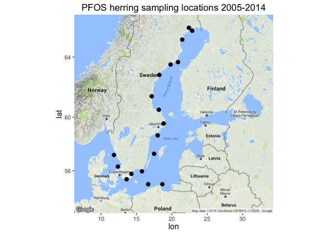

Contaminants - Clean Water Subgoal data prep
================

-   [1. Background](#background)
    -   [Goal Description](#goal-description)
    -   [Model & Data](#model-data)
    -   [Reference points](#reference-points)
    -   [Considerations for *BHI 2.0*](#considerations-for-bhi-2.0)
    -   [Other information](#other-information)
-   [1.2 Set CON status as NA for BHI assessment](#set-con-status-as-na-for-bhi-assessment)
-   [2. Data](#data)
    -   [(1) PCB concentration indicator](#pcb-concentration-indicator)
    -   [(2) TEQ value for PCBs and Dioxins](#teq-value-for-pcbs-and-dioxins)
    -   [(3) PFOS indicator](#pfos-indicator)
    -   [Additional references](#additional-references)
    -   [2.1 Data sources](#data-sources)
    -   [2.2 Data prep prior to database](#data-prep-prior-to-database)
-   [3. Other Info](#other-info)
    -   [3.1 Congers in ICES database](#congers-in-ices-database)
-   [4. Data Prep - PCB Indicator](#data-prep---pcb-indicator)
    -   [4.1 Basic data cleaning and organization](#basic-data-cleaning-and-organization)
    -   [4.2 Evaluate sites sampled](#evaluate-sites-sampled)
    -   [4.3 Data flagged for quality](#data-flagged-for-quality)
    -   [4.5 Status and Trend Evaluation](#status-and-trend-evaluation)
    -   [4.5.7 Plot linear model trends - 2 approaches](#plot-linear-model-trends---2-approaches)
    -   [4.6 Method discussion with Anna Sobek](#method-discussion-with-anna-sobek)
    -   [4.7 Final Status and Trend obejcts](#final-status-and-trend-obejcts)
-   [5. Data Prep - Dioxin Indicator](#data-prep---dioxin-indicator)
    -   [5.1 Basic data cleaning and organization](#basic-data-cleaning-and-organization-1)
    -   [5.2 Filter data for year](#filter-data-for-year)
    -   [5.3 Assess Qflagged data](#assess-qflagged-data)
    -   [5.4 Toxicity Equivalent (TEQ) values](#toxicity-equivalent-teq-values)
    -   [5.5 Assess if dioxins and pcbs share sub\_sample\_ref](#assess-if-dioxins-and-pcbs-share-sub_sample_ref)
    -   [5.6 TEQ concentration for each sub\_sample\_ref](#teq-concentration-for-each-sub_sample_ref)
    -   [5.7 Mean TEQ value by date and location](#mean-teq-value-by-date-and-location)
    -   [5.8 Join Dioxin and dioxin-like PCB obs for same date and location](#join-dioxin-and-dioxin-like-pcb-obs-for-same-date-and-location)
    -   [5.9 Join data to HOLAS basins and plot](#join-data-to-holas-basins-and-plot)
    -   [5.10 Calculate the mean TEQ value by basin 2009-2013](#calculate-the-mean-teq-value-by-basin-2009-2013)
    -   [5.11 Assign basin means to BHI regions](#assign-basin-means-to-bhi-regions)
    -   [5.12 Dioxin status value](#dioxin-status-value)
    -   [5.13 Dioxin trend value](#dioxin-trend-value)
    -   [5.14 Prepare and save layer for layers](#prepare-and-save-layer-for-layers)
-   [6. Data Prep - PFOS Indicator](#data-prep---pfos-indicator)
    -   [6.1 Read in and organize data](#read-in-and-organize-data)
    -   [6.2 Filter for data years](#filter-for-data-years)
    -   [6.3 Assess qflagged data](#assess-qflagged-data-1)
    -   [6.4 Evaluate number of samples by date and location, take mean](#evaluate-number-of-samples-by-date-and-location-take-mean)
    -   [6.5 Basin means](#basin-means)
    -   [6.6 PFOS Status calculation](#pfos-status-calculation)
    -   [6.7 PFOS trend](#pfos-trend)
    -   [6.8 Prepare and save PFOS layer for layers](#prepare-and-save-pfos-layer-for-layers)
-   [7. Compare Contaminant Indicator Status](#compare-contaminant-indicator-status)
    -   [7.1 Read in CON indicators from layers](#read-in-con-indicators-from-layers)
    -   [7.2 Join into single object](#join-into-single-object)
    -   [7.2 Plot CON indicators](#plot-con-indicators)
    -   [7.3 Number of CON indicators available per BHI region](#number-of-con-indicators-available-per-bhi-region)
    -   [7.4 Plot number of CON indicators per BHI region](#plot-number-of-con-indicators-per-bhi-region)

1. Background
-------------

### Goal Description

The Contaminant sub-goal of the Clean Water goal captures the degree to which local waters are unpolluted by contaminants. This sub-goal scores highest when the contamination level is below a threshold, which is defined by the Marine Framework Directive. For the BHI three contaminants indicators are proposed, describing different aspects of toxicity: dioxin and dioxin like compounds, polychlorinated biphenyl compounds (PCBs) and perfluorooctanesulfonic acid (PFOS).

**NOTE: Experts are discussing whether to exclude or modify this goal as it is difficult to represent with the available indicators. Currently in the BHI assessment, Contaminants scores are set to NA.**

### Model & Data

All contaminant data were downloaded from the open-accessible ICES database (see below).

-   [PCB data from ICES database](http://dome.ices.dk/views/ContaminantsBiota.aspx)
-   [Dioxins from ICES database](http://dome.ices.dk/views/ContaminantsBiota.aspx)
-   [PFOS data from ICES DOME database](http://dome.ices.dk/views/ContaminantsBiota.aspx).

### Reference points

**ICES-6 PCB**: The target for non-dioxin contaminents like PCBs is set at the threshold of 75 μg/kg ww (wet weight) fish muscle, which is the [EU threshold for fish muscle. See Section 5 Annex, 5.3](http://eur-lex.europa.eu/LexUriServ/LexUriServ.do?uri=OJ:L:2011:320:0018:0023:EN:PDF). This threshold was also agreed upon as GES indicator at the most recent meeting of the [Working Group on the State of the Environment and Nature Conservation](http://helcom.fi/helcom-at-work/groups/state-and-conservation) April 11-15, 2016.

**TEQ value for PCBs and Dioxins**: The target for dioxin and dioxin-like compounds is set at 0.0065 TEQ ug /kg ww fish, crustaceans or molluscs (source of target: EQS biota human health). Secondary GES boundary: CB-118 24 μg/kg lw fish liver or muscle (source: EAC). This threshold was agreed upon as GES indicator at the most recent meeting of the [Working Group on the State of the Environment and Nature Conservation](http://helcom.fi/helcom-at-work/groups/state-and-conservation) April 11-15, 2016. This is consistent with the [EU human health thresholds for dioxin and dioxin-like compounds - 6.5 pg/g](http://eur-lex.europa.eu/LexUriServ/LexUriServ.do?uri=OJ:L:2011:320:0018:0023:EN:PDF); TEQ values from the [World Health Organization 2005](http://www.who.int/ipcs/assessment/tef_values.pdf)

**PFOS indicator**: The target for PFOS indicators was set from the GES boundary: "9.1 μg/kg wet weight (or 9.1 ng/g ww) with the protection goal of human health"" according to [HELCOM PFOS core indicator document, p.3](http://www.helcom.fi/Core%20Indicators/PFOS_HELCOM%20core%20indicator%202016_web%20version.pdf).

### Considerations for *BHI 2.0*

### Other information

*external advisors/goalkeepers: Anna Sobek*

1.2 Set CON status as NA for BHI assessment
-------------------------------------------

Ultimately, the CON status was set to NA for the BHI assessment. Please read below for data processing and considerations for the goal model that was not ultimately not included.

``` r
# status
status = data.frame(region_id = full_seq(1:42, 1), 
                    goal = "CON",
                    score = NA,
                    dimension = "status")

write_csv(status, file.path(dir_layers, 'cw_con_status_placeholder_NA.csv'))

# trend
trend = data.frame(region_id = full_seq(1:42, 1), 
                   goal = "CON",
                   score = NA,
                   dimension = "trend")

write_csv(trend, file.path(dir_layers, 'cw_con_trend_placeholder_NA.csv'))
```

2. Data
-------

Three indicators are proposed, describing different aspects of toxicity, and then would be combined to give an overall contamimant sub-component status.

### (1) PCB concentration indicator

#### ICES-6 PCB

Non-dioxin like PCBs: sum of congeners (28, 52, 101, 138, 153, 180). Target is set at the threshold of 75 μg/kg ww (wet weight) fish muscle.

This is similar to the ICES-7 except that PCB 118 is excluded, since it is metabolized by mammals.

75 ng/g wet weight is the [EU threshold for fish muscle. See Section 5 Annex, 5.3](http://eur-lex.europa.eu/LexUriServ/LexUriServ.do?uri=OJ:L:2011:320:0018:0023:EN:PDF). This threshold was also agreed upon as GES boundary at the most recent meeting of the [Working Group on the State of the Environment and Nature Conservation](http://helcom.fi/helcom-at-work/groups/state-and-conservation) April 11-15, 2016. *Recevied the draft report from Elisabeth Nyberg*

### (2) TEQ value for PCBs and Dioxins

Dioxin and dioxin-like compounds. Target is set at 0.0065 TEQ ug /kg ww fish, crustaceans or molluscs (source of target: EQS biota human health). Secondary GES boundary: CB-118 24 μg/kg lw fish liver or muscle (source: EAC).

This threshold was agreed upon as GES indicator at the most recent meeting of the [Working Group on the State of the Environment and Nature Conservation](http://helcom.fi/helcom-at-work/groups/state-and-conservation) April 11-15, 2016. *Recevied the draft report from Elisabeth Nyberg*

This is consistent with the [EU human health thresholds for dioxin and dioxin-like compounds - 6.5 pg/g](http://eur-lex.europa.eu/LexUriServ/LexUriServ.do?uri=OJ:L:2011:320:0018:0023:EN:PDF)

TEQ values from the [World Health Organization 2005](http://www.who.int/ipcs/assessment/tef_values.pdf)

### (3) PFOS indicator

"GES boundary is set to 9.1 μg/kg wet weight (or 9.1 ng/g ww) with the protection goal of human health"" according to [HELCOM PFOS core indicator document, p.3](http://www.helcom.fi/Core%20Indicators/PFOS_HELCOM%20core%20indicator%202016_web%20version.pdf).

"The GES boundary is an environmental quality standard (EQS), derived at EU level as a substance included on the list of priority substances under the Water Framework Directive (European Commission 2000, 2013). GES, in accordance with the MSFD is defined as 'concentrations of contaminants at levels not giving rise to pollution effects'. EQS are derived from ecotoxicological studies to protect freshwater and marine ecosystems from potential adverse effects of chemicals, as well as adverse effects on human health via drinking water and food from aquatic environments. Quality Standards (QS) are derived for different protection goals, i.e.: pelagic and benthic communities, top-predators in these ecosystems, and human health. The most stringent of these QS is the basis for the EQS. The EQS boundary for PFOS is based on the QS set for biota to protect human health (9.1 μg/ kg fish ww), defined for edible parts in fish. For harmonization purposes the EC Guidance Document No. 32 on biota monitoring (the implementation of EQS biota) under the WFD was developed (European Commission 2014). This guidance document recommends that the results from the monitoring should be standardized to represent fish at a trophic level of 4, which is an estimate of the general trophic level in commercial fish in Europe. The recommendation to obtain PFOS data in fish at a trophic level of 4 is to adjust the values from monitoring in accordance with trophic magnification factors and trophic level."[HELCOM PFOS core indicator document, p.8](http://www.helcom.fi/Core%20Indicators/PFOS_HELCOM%20core%20indicator%202016_web%20version.pdf)

**HELCOM core indicator report uses liver PFOS concentrations converted to muscle equivalent values** as in [Faxneld et al. 2014b](https://www.diva-portal.org/smash/get/diva2:767385/FULLTEXT01.pdf).

### Additional references

[Faxneld et al. 2014a](http://www.diva-portal.org/smash/record.jsf?pid=diva2%3A728508&dswid=1554) Biological effects and environmental contaminants in herring and Baltic Sea top predators

[Faxneld et al. 2014b](https://www.diva-portal.org/smash/get/diva2:767385/FULLTEXT01.pdf)Distribution of PFAS in liver and muscle of herring, perch, cod, eelpout, arctic char, and pike from limnic and marine environments in Sweden.

[Bignert, A., Nyberg, E., Sundqvist, K.L., Wiberg, K., 2007. Spatial variation in concentrations and patterns of the PCDD/F and dioxin-like PCB content in herring from the northern Baltic Sea. J. Environ. Monit. 9, 550–556.](http://pubs.rsc.org/en/Content/ArticleLanding/2007/EM/b700667e#!divAbstract)

### 2.1 Data sources

#### PCB data

**ICES** [ICES database](http://dome.ices.dk/views/ContaminantsBiota.aspx)
Downloaded 22 April 2016 by Jennifer Griffiths
Data selections:
Year - 1990-2014
Purpose of monitoring = All
Country = ALL
Monitoring Program = ALL
Parameter Group = Chlorobiophenyls
Reporting Laboratory = All
Analytical laboratory = All
Geographical Areas = (HELCOM) ALL HELCOM Sub-basins

#### Dioxins

**ICES** [ICES database](http://dome.ices.dk/views/ContaminantsBiota.aspx)
Downloaded on 11 May 2016 by Jennifer Griffiths Selections:
Year - 1998-2015 (earliest allowed)
Purpose of monitoring = All
Country = ALL
MOnitoring Program = ALL
Parameter Group = Dioxins
Reporting Laboratory = All
Analytical laboratory = All
Geographical Areas = (HELCOM) ALL HELCOM Sub-basins

#### PFOS

Download from [ICES DOME database](http://dome.ices.dk/views/ContaminantsBiota.aspx) on 15 July 2016 by Jennifer Griffiths.

Database selections:
Year: 2005- 2014
Purpose of Monitoring: All
Monitoring Program: All
Parameter group = Organofluorines
Reporting Laboratory = All
Analytical laboratory = All
Geographical Areas = (HELCOM) ALL HELCOM Sub-basins

#### Other sources - Data not used

IVL (Svenska Miljönstitutet / Swedish Environmental Research Institute)
[IVL database](http://dvsb.ivl.se/)
Downloaded 2 December 2015 by Cornelia Ludwig

### 2.2 Data prep prior to database

#### PCB

Raw data from ICES were prepared in `~/github/bhi/baltic2015/prep/CW/contaminants/raw_contaminants_data_prep`
- If duplicate measurements were made from the same sample, values were averaged (all were two measurement of LIPIDWT% per sample, all from 2014, Poland).
- Data were standardized to the same unit ug/kg
- If data were presented in lipid weight, they were converted to wet weight by: (EXLIP% / 100)\*(CB-conc lipid weight).

**Note**: Detection limit (detect\_lim) and Quantification limit (quant\_lim) values are in the original units. They are not standardized to ug/kg and not converted to wet weight if originally in lipid weight

3. Other Info
-------------

### 3.1 Congers in ICES database

#### PCB Congeners

CB101 2 2' 4 5 5'-pentachlorobiphenyl
CB105 2 3 3' 4 4'-pentachlorobiphenyl
CB118 2 3' 4 4' 5-pentachlorobiphenyl
CB128 2 2' 3 3' 4 4'-hexachlorobiphenyl
CB138 2 2' 3 4 4' 5'-hexachlorobiphenyl
CB149 2 2' 3 4' 5' 6-hexachlorobiphenyl
CB153 2 2' 4 4' 5 5'-hexachlorobiphenyl
CB156 2 3 3' 4 4' 5-hexachlorobiphenyl
CB157 2 3 4 3' 4' 5'-hexachlorobiphenyl
CB167 2' 3 4 4' 5 5'-hexachlorobiphenyl
CB169 3 3' 4 4' 5 5'-hexachlorobiphenyl
CB170 2 2' 3 3' 4 4' 5-heptachlorobiphenyl
CB180 2 2' 3 4 4' 5 5'-heptachlorobiphenyl
CB28 2 4 4'-trichlorobiphenyl
CB52 2 2' 5 5'-tetrachlorobiphenyl
CB77 3 3' 4 4'-tetrachlorobiphenyl

#### Dioxin Congeners

CDD1N 1 2 3 7 8-pentachlorodibenzo-p-dioxin
CDD4X 1 2 3 4 7 8-hexachlorodibenzo-p-dioxin
CDD6P 1 2 3 4 6 7 8-heptachlorodibenzo-p-dioxin
CDD6X 1 2 3 6 7 8-hexachlorodibenzo-p-dioxin
CDD9X 1 2 3 7 8 9-hexachlorodibenzo-p-dioxin
CDDO 1 2 3 4 6 7 8 9-octachlorodibenzo-p-dioxin
CDF2N 2 3 4 7 8-pentachlorodibenzofuran
CDF2T 2 3 7 8-tetrachloro-dibenzofuran
CDF4X 2 3 4 6 7 8-hexachlorodibenzofuran
CDF6P 1 2 3 4 6 7 8-heptachlorodibenzofuran
CDF6X 1 2 3 6 7 8-hexachlorodibenzofuran
CDF9P 1 2 3 4 7 8 9-heptachlorodibenzofuran
CDF9X 1 2 3 7 8 9-hexachlorodibenzofuran
CDFDN 1 2 3 7 8/1 2 3 4 8-pentachloro-dibenzofuran
CDFO octachloro-dibenzofuran (group)
TCDD 2 3 7 8-tetrachlorodibenzo-p-dioxin

4. Data Prep - PCB Indicator
----------------------------

### 4.1 Basic data cleaning and organization

#### Data prep setup

``` r
## source common libraries, directories, functions, etc

# Libraries
library(tidyverse)
library(RMySQL)
library(tools)
library(rprojroot) # install.packages('rprojroot')

## rprojroot
root <- rprojroot::is_rstudio_project

## make_path() function to 
make_path <- function(...) rprojroot::find_root_file(..., criterion = is_rstudio_project)

dir_layers = make_path('baltic2015/layers') # replaces  file.path(dir_baltic, 'layers')

source('~/github/bhi/baltic2015/prep/common.r')
dir_cw    = file.path(dir_prep, 'CW')
dir_con    = file.path(dir_prep, 'CW/contaminants')

## add a README.md to the prep directory with the rawgit.com url for viewing on GitHub
create_readme(dir_con, 'contaminants_prep.rmd')
```

#### Read in PCB data

``` r
## read in PCB data
pcb1 = read.csv(file.path(dir_con, 'contaminants_data_database/ices_herring_pcb.csv'))
dim(pcb1)
```

    ## [1] 16732    47

``` r
## Read in lookup - BHI region to HOLAS basins
lookup_basins = read.csv(file.path(dir_con,'bhi_basin_country_lookup.csv'), sep=";", stringsAsFactors = FALSE) %>%
  select(BHI_ID, rgn_nam, Subbasin)%>%
  dplyr::rename(rgn_id = BHI_ID, 
                country = rgn_nam,
                basin = Subbasin)


## Read in station impact
lookup_impact = read_csv(file.path(dir_con, 'raw_prep/station_impact_cleaned.csv')) 
```

#### Organize

Remove and rename columns, and change column data types.

We found two stations that were not assigned BHI ID.

station lat lon 1 Lagnoe 59.56520 18.83480 2 LL3A 60.38333 26.71667

``` r
# str(pcb1)

#format date as date
pcb2 = pcb1 %>% 
      dplyr::rename(date=Date, lat=Latitude, lon= Longitude, 
                    month=Month, day=Day, doy=DoY,
                    bhi_id = BHI_ID, helcom_id=HELCOM_ID, 
                    helcom_coastal_code=HELCOM_COASTAL_CODE, ices_area = ICES_AREA,
                    agmax_y = AGMAX_y, agmea_y=AGMEA_y, agmin_y = AGMIN_y,
                    drywt_percent = DRYWT._., exlip_percent = EXLIP._.,fatwt_percent=FATWT._.,
                    lipidwt_percent = LIPIDWT._., lnmax_cm = LNMAX_cm,
                    lnmea_cm=LNMEA_cm, lnmin_cm=LNMIN_cm, wtmax_g=WTMAX_g, wtmea_g=WTMEA_g,
                    wtmin_g=WTMIN_g) %>% # rename columns
      select(-date_ices, -X) %>% #remove columns not needed
      mutate(date =as.Date(date,"%Y-%m-%d"),
             sub_samp_id= as.character(sub_samp_id)) %>%
      select(country:lon,bhi_id:ices_area,date:year,month:doy,species:value)## reorder columns

head(pcb2)
```

    ##   country monit_program monit_purpose report_institute station      lat
    ## 1 Finland          COMB                           FEIF         64.17917
    ## 2 Finland          COMB                           FEIF         64.17917
    ## 3 Finland          COMB                           FEIF         64.17917
    ## 4 Finland          COMB                           FEIF         64.17917
    ## 5 Finland          COMB                           FEIF         64.17917
    ## 6 Finland          COMB                           FEIF         64.17917
    ##       lon bhi_id helcom_id helcom_coastal_code ices_area       date
    ## 1 23.3265     42   SEA-017                   0        31 2008-08-06
    ## 2 23.3265     42   SEA-017                   0        31 2008-08-06
    ## 3 23.3265     42   SEA-017                   0        31 2008-08-06
    ## 4 23.3265     42   SEA-017                   0        31 2008-08-06
    ## 5 23.3265     42   SEA-017                   0        31 2008-08-06
    ## 6 23.3265     42   SEA-017                   0        31 2008-08-06
    ##   monit_year year month day doy         species sub_samp_ref sub_samp_id
    ## 1       2008 2008     8   6 219 Clupea harengus      3149743       34000
    ## 2       2008 2008     8   6 219 Clupea harengus      3149743       34000
    ## 3       2008 2008     8   6 219 Clupea harengus      3149743       34000
    ## 4       2008 2008     8   6 219 Clupea harengus      3149743       34000
    ## 5       2008 2008     8   6 219 Clupea harengus      3149743       34000
    ## 6       2008 2008     8   6 219 Clupea harengus      3149743       34000
    ##   samp_id num_indiv_subsample bulk_id basis_determination_originalcongener
    ## 1 1423609                   1      NA                           wet weight
    ## 2 1423609                   1      NA                           wet weight
    ## 3 1423609                   1      NA                           wet weight
    ## 4 1423609                   1      NA                           wet weight
    ## 5 1423609                   1      NA                           wet weight
    ## 6 1423609                   1      NA                           wet weight
    ##   basis_determination_converted agmax_y agmea_y agmin_y drywt_percent
    ## 1                    wet weight      NA      NA      NA            NA
    ## 2                    wet weight      NA      NA      NA            NA
    ## 3                    wet weight      NA      NA      NA            NA
    ## 4                    wet weight      NA      NA      NA            NA
    ## 5                    wet weight      NA      NA      NA            NA
    ## 6                    wet weight      NA      NA      NA            NA
    ##   exlip_percent fatwt_percent lipidwt_percent lnmax_cm lnmea_cm lnmin_cm
    ## 1            NA            NA              NA       NA       NA       NA
    ## 2            NA            NA              NA       NA       NA       NA
    ## 3            NA            NA              NA       NA       NA       NA
    ## 4            NA            NA              NA       NA       NA       NA
    ## 5            NA            NA              NA       NA       NA       NA
    ## 6            NA            NA              NA       NA       NA       NA
    ##   wtmax_g wtmea_g wtmin_g qflag detect_lim quant_lim uncert_val
    ## 1      NA      NA      NA               NA        NA         NA
    ## 2      NA      NA      NA               NA        NA         NA
    ## 3      NA      NA      NA               NA        NA         NA
    ## 4      NA      NA      NA               NA        NA         NA
    ## 5      NA      NA      NA               NA        NA         NA
    ## 6      NA      NA      NA     <         NA      0.04         NA
    ##   method_uncert    congener value
    ## 1               CB101_ug/kg  0.30
    ## 2               CB118_ug/kg  0.27
    ## 3               CB138_ug/kg  0.66
    ## 4               CB153_ug/kg  0.84
    ## 5               CB180_ug/kg  0.30
    ## 6                CB28_ug/kg  0.04

``` r
## check for missing BHI ID
pcb2 %>% 
  filter(is.na(bhi_id)) %>% 
  select(station,lat,lon) %>% 
  distinct()
```

    ##   station      lat      lon
    ## 1  Lagnoe 59.56520 18.83480
    ## 2    LL3A 60.38333 26.71667

``` r
pcb2 %>%
  mutate(bhi_id = ifelse(is.na(bhi_id) & station == "Lagnoe",29,
                      ifelse(is.na(bhi_id) & station == "LL3A",32, bhi_id))) %>% 
  filter(is.na(bhi_id)) %>% 
  select(station, lat, lon) %>% 
  distinct()
```

    ## [1] station lat     lon    
    ## <0 rows> (or 0-length row.names)

#### Plot data

Explore raw data. **Why are there unassigned BHI regions?**

``` r
ggplot(pcb2) + 
  geom_point(aes(date,value, colour=congener)) +
  facet_wrap(~bhi_id)
```


#### Filter for ICES 6 PCBs

``` r
ices6pcb = c("CB28_ug/kg", "CB52_ug/kg", "CB101_ug/kg", "CB138_ug/kg",
            "CB153_ug/kg", "CB180_ug/kg")
  
pcb3 = pcb2 %>% 
        filter(congener %in% ices6pcb)

# dim(pcb3); dim(pcb2)
```

#### Plot data -ICES 6 pcbs

``` r
ggplot(pcb3) + 
  geom_point(aes(date,value, colour=congener)) +
  facet_wrap(~bhi_id)
```


#### Join to HOLAS basins and evaluate data coverage

``` r
pcb4 = full_join(select(lookup_basins, rgn_id, basin),
                 pcb3, 
                 by= c("rgn_id"="bhi_id"))
head(pcb4)
```

    ##   rgn_id    basin country monit_program monit_purpose report_institute
    ## 1      1 Kattegat  Sweden     CEMP~COMB             T             SERI
    ## 2      1 Kattegat  Sweden     CEMP~COMB             T             SERI
    ## 3      1 Kattegat  Sweden     CEMP~COMB             T             SERI
    ## 4      1 Kattegat  Sweden     CEMP~COMB             T             SERI
    ## 5      1 Kattegat  Sweden     CEMP~COMB             T             SERI
    ## 6      1 Kattegat  Sweden     CEMP~COMB             T             SERI
    ##      station     lat    lon helcom_id helcom_coastal_code ices_area
    ## 1 E/W FLADEN 57.2247 11.828   SEA-001                   0      IIIa
    ## 2 E/W FLADEN 57.2247 11.828   SEA-001                   0      IIIa
    ## 3 E/W FLADEN 57.2247 11.828   SEA-001                   0      IIIa
    ## 4 E/W FLADEN 57.2247 11.828   SEA-001                   0      IIIa
    ## 5 E/W FLADEN 57.2247 11.828   SEA-001                   0      IIIa
    ## 6 E/W FLADEN 57.2247 11.828   SEA-001                   0      IIIa
    ##         date monit_year year month day doy         species sub_samp_ref
    ## 1 2000-12-08       2000 2000    12   8 343 Clupea harengus      3580025
    ## 2 2000-12-08       2000 2000    12   8 343 Clupea harengus      3580025
    ## 3 2000-12-08       2000 2000    12   8 343 Clupea harengus      3580025
    ## 4 2000-12-08       2000 2000    12   8 343 Clupea harengus      3580025
    ## 5 2000-12-08       2000 2000    12   8 343 Clupea harengus      3580025
    ## 6 2000-12-08       2000 2000    12   8 343 Clupea harengus      3580025
    ##   sub_samp_id samp_id num_indiv_subsample bulk_id
    ## 1        6166 1741386                   1      NA
    ## 2        6166 1741386                   1      NA
    ## 3        6166 1741386                   1      NA
    ## 4        6166 1741386                   1      NA
    ## 5        6166 1741386                   1      NA
    ## 6        6166 1741386                   1      NA
    ##   basis_determination_originalcongener basis_determination_converted
    ## 1                         lipid weight                    wet weight
    ## 2                         lipid weight                    wet weight
    ## 3                         lipid weight                    wet weight
    ## 4                         lipid weight                    wet weight
    ## 5                         lipid weight                    wet weight
    ## 6                         lipid weight                    wet weight
    ##   agmax_y agmea_y agmin_y drywt_percent exlip_percent fatwt_percent
    ## 1      NA       2      NA          26.5           3.5            NA
    ## 2      NA       2      NA          26.5           3.5            NA
    ## 3      NA       2      NA          26.5           3.5            NA
    ## 4      NA       2      NA          26.5           3.5            NA
    ## 5      NA       2      NA          26.5           3.5            NA
    ## 6      NA       2      NA          26.5           3.5            NA
    ##   lipidwt_percent lnmax_cm lnmea_cm lnmin_cm wtmax_g wtmea_g wtmin_g qflag
    ## 1              NA       NA     18.7       NA      NA    44.3      NA      
    ## 2              NA       NA     18.7       NA      NA    44.3      NA      
    ## 3              NA       NA     18.7       NA      NA    44.3      NA      
    ## 4              NA       NA     18.7       NA      NA    44.3      NA     D
    ## 5              NA       NA     18.7       NA      NA    44.3      NA     D
    ## 6              NA       NA     18.7       NA      NA    44.3      NA      
    ##   detect_lim quant_lim uncert_val method_uncert    congener  value
    ## 1        4.0        NA         NA               CB101_ug/kg 0.5775
    ## 2        6.0        NA         NA               CB138_ug/kg 1.0745
    ## 3        5.0        NA         NA               CB153_ug/kg 1.3300
    ## 4        5.1        NA         NA               CB180_ug/kg 0.1785
    ## 5        4.3        NA         NA                CB28_ug/kg 0.1505
    ## 6        4.0        NA         NA                CB52_ug/kg 0.2345

``` r
pcb4 = pcb4 %>%
       dplyr::rename(basin_name =basin)
```

#### Plot by basin

``` r
ggplot(pcb4) + 
  geom_point(aes(date,value, colour=congener)) +
  facet_wrap(~basin_name)
```

    ## Warning: Removed 25 rows containing missing values (geom_point).


### 4.2 Evaluate sites sampled

The sites are representing *baseline/reference conditions* or *local impact*.

#### Join PCB sites, station dictionary, and impact codes

Some sites have had the site type recorded in the ICES station dictionary (see below). It is important to know which sites are catagorized as:

    1. *RH* = WFD R(HZ) - Representative of general conditions in terms of hazardous substances  
    2. *B* =  WFD B - Baseline/Reference station  
    3. Any of the codes containing "I" (IH, IH-A, IH-C, IH-D, IH-E, IH-F, IH-H, IH-I, IH-M, IH-O, IH-P, IH-S, IH-W, IP, IP-B, IP-N, IP-T) which refers to a specific type of impact at the site.  

It appears that *only Swedish sites have this information entered* (see below), Most are RH (19), while B (4) and RP (1). RP = WFD R(PHY) Representative of general conditions for nutrients/organic matter.

**Sites to Include/Exclude**

Given only Swedish sites have this information recorded, it seems difficult to use this information to include or exclude sites.

From the station dictionary definitions:

-   All\_Biota\_Data: Data type (DTYPE) CF - all parameters - contaminants and biological effects of contaminants including disease in biota
-   Contaminant\_parameters\_in\_biota: Data type (DTYPE) CF - Contaminant parameter groups

``` r
pcb_sites = pcb4 %>% 
            select(country, station,basin_name,lat,lon,rgn_id) %>%
            filter(!is.na(station)) %>%  ## These are NA because when joined to BHI regions, were no station
            mutate(station2 = tolower(station)) %>% ## station name all lower case to join with station_dictionary
            distinct(.)
# pcb_sites
# dim(pcb_sites) 
#[1] 55  7 

## clean lookup table
lookup_impact = lookup_impact %>%
                mutate(Station_Name2 = as.character(Station_Name2))


## join with station dictionary
pcb_sites = pcb_sites %>% left_join(., lookup_impact, by=c("station2"="Station_Name2", "country"="Country"))
```

    ## Warning in left_join_impl(x, y, by$x, by$y, suffix$x, suffix$y): joining
    ## character vector and factor, coercing into character vector

``` r
dim(pcb_sites) # 55 26
```

    ## [1] 55 27

``` r
pcb_sites = pcb_sites %>% 
  select(country, station, basin_name, lat, lon, rgn_id,MSTAT,All_Biota_Data:impact_I) %>% 
  arrange(impact_RH, impact_B, impact_I)

## many sites do not have purpose entered in ICES
## the Finnish sites with no station name could then not be found in the impact lookup
## Many of the sites have "FALSE" under 'Contaminant_parameters_in_biota'
## These sites are also "FALSE" under All_Biota_data 
```

### 4.3 Data flagged for quality

#### Evaluate data with Qflags

Codes:

-   **&lt;** = less than

-   **&gt;** = greather than

-   **D** = reported value is less than the detection limit (detli)

-   **Q** = reported value is less than the limit of quantification (lmqnt)

-   **~** separates multiple flags

No information is given for what **&lt;** implies when is it is used alone (e.g. is it related to the detection limit?)

**Values for detect\_lim and quant\_lim**: Remember these are in the original units (not standardized to ug\_kg or to wet weight)

``` r
## what qflags are presenting
pcb4 %>% select(qflag) %>% distinct(.) 
```

    ##   qflag
    ## 1      
    ## 2     D
    ## 3  <NA>
    ## 4     <
    ## 5     Q
    ## 6   <~D

``` r
## "~"  separates multiple flags

## which entries use '<'
pcb4 %>% 
  filter(.,grepl('<', qflag)) %>% 
  select(country,station,date,sub_samp_ref,qflag,detect_lim,congener,value) %>% 
  head()
```

    ##   country station       date sub_samp_ref qflag detect_lim    congener
    ## 1  Poland    LKOL 2004-09-08      2204078     <       0.01 CB180_ug/kg
    ## 2  Poland    LKOL 2004-09-08      2204084     <       0.01 CB180_ug/kg
    ## 3  Poland    LKOL 2004-09-08      2204085     <       0.01 CB180_ug/kg
    ## 4  Poland    LKOL 2005-09-07      2204013     <       0.01 CB101_ug/kg
    ## 5  Poland    LKOL 2005-09-07      2204013     <       0.01 CB138_ug/kg
    ## 6  Poland    LKOL 2005-09-07      2204013     <       0.01 CB153_ug/kg
    ##   value
    ## 1  0.01
    ## 2  0.19
    ## 3  0.01
    ## 4  0.01
    ## 5  0.01
    ## 6  0.01

``` r
## appears to be variable usage of '<'. values are not always provided for detect_lim when used. values of detect_lim are in original units so they are not always comparable to the value column

## which entries use "D"
pcb4 %>% 
  filter(.,grepl('D', qflag)) %>%
  select(country,station,date,sub_samp_ref,qflag,detect_lim,congener,value) %>% 
  head()
```

    ##   country    station       date sub_samp_ref qflag detect_lim    congener
    ## 1  Sweden E/W FLADEN 2000-12-08      3580025     D        5.1 CB180_ug/kg
    ## 2  Sweden E/W FLADEN 2000-12-08      3580025     D        4.3  CB28_ug/kg
    ## 3  Sweden E/W FLADEN 2000-12-08      3580028     D        3.6  CB28_ug/kg
    ## 4  Sweden E/W FLADEN 2000-12-08      3580029     D        3.3  CB28_ug/kg
    ## 5  Sweden E/W FLADEN 2000-12-08      3580030     D        4.2  CB28_ug/kg
    ## 6  Sweden E/W FLADEN 2000-12-08      3580033     D        4.1  CB28_ug/kg
    ##     value
    ## 1 0.17850
    ## 2 0.15050
    ## 3 0.11088
    ## 4 0.10890
    ## 5 0.14826
    ## 6 0.14965

#### New qflag column

Create second qflag column with

-   "yes" if any symbol used to flag the data
-   "no" if not.

``` r
pcb5 = pcb4 %>%
      mutate(qflag = as.character(qflag))%>%
      mutate(qflag2 = ifelse(qflag == "", "no",
                      ifelse(qflag== "D", "yes",
                      ifelse(qflag== "<", "yes",
                      ifelse(qflag== "Q", "yes",
                      ifelse(qflag=="<~D", "yes", "")))))) %>%
      mutate(qflag2 = replace(qflag2, is.na(qflag2),"no"))
head(pcb5)
```

    ##   rgn_id basin_name country monit_program monit_purpose report_institute
    ## 1      1   Kattegat  Sweden     CEMP~COMB             T             SERI
    ## 2      1   Kattegat  Sweden     CEMP~COMB             T             SERI
    ## 3      1   Kattegat  Sweden     CEMP~COMB             T             SERI
    ## 4      1   Kattegat  Sweden     CEMP~COMB             T             SERI
    ## 5      1   Kattegat  Sweden     CEMP~COMB             T             SERI
    ## 6      1   Kattegat  Sweden     CEMP~COMB             T             SERI
    ##      station     lat    lon helcom_id helcom_coastal_code ices_area
    ## 1 E/W FLADEN 57.2247 11.828   SEA-001                   0      IIIa
    ## 2 E/W FLADEN 57.2247 11.828   SEA-001                   0      IIIa
    ## 3 E/W FLADEN 57.2247 11.828   SEA-001                   0      IIIa
    ## 4 E/W FLADEN 57.2247 11.828   SEA-001                   0      IIIa
    ## 5 E/W FLADEN 57.2247 11.828   SEA-001                   0      IIIa
    ## 6 E/W FLADEN 57.2247 11.828   SEA-001                   0      IIIa
    ##         date monit_year year month day doy         species sub_samp_ref
    ## 1 2000-12-08       2000 2000    12   8 343 Clupea harengus      3580025
    ## 2 2000-12-08       2000 2000    12   8 343 Clupea harengus      3580025
    ## 3 2000-12-08       2000 2000    12   8 343 Clupea harengus      3580025
    ## 4 2000-12-08       2000 2000    12   8 343 Clupea harengus      3580025
    ## 5 2000-12-08       2000 2000    12   8 343 Clupea harengus      3580025
    ## 6 2000-12-08       2000 2000    12   8 343 Clupea harengus      3580025
    ##   sub_samp_id samp_id num_indiv_subsample bulk_id
    ## 1        6166 1741386                   1      NA
    ## 2        6166 1741386                   1      NA
    ## 3        6166 1741386                   1      NA
    ## 4        6166 1741386                   1      NA
    ## 5        6166 1741386                   1      NA
    ## 6        6166 1741386                   1      NA
    ##   basis_determination_originalcongener basis_determination_converted
    ## 1                         lipid weight                    wet weight
    ## 2                         lipid weight                    wet weight
    ## 3                         lipid weight                    wet weight
    ## 4                         lipid weight                    wet weight
    ## 5                         lipid weight                    wet weight
    ## 6                         lipid weight                    wet weight
    ##   agmax_y agmea_y agmin_y drywt_percent exlip_percent fatwt_percent
    ## 1      NA       2      NA          26.5           3.5            NA
    ## 2      NA       2      NA          26.5           3.5            NA
    ## 3      NA       2      NA          26.5           3.5            NA
    ## 4      NA       2      NA          26.5           3.5            NA
    ## 5      NA       2      NA          26.5           3.5            NA
    ## 6      NA       2      NA          26.5           3.5            NA
    ##   lipidwt_percent lnmax_cm lnmea_cm lnmin_cm wtmax_g wtmea_g wtmin_g qflag
    ## 1              NA       NA     18.7       NA      NA    44.3      NA      
    ## 2              NA       NA     18.7       NA      NA    44.3      NA      
    ## 3              NA       NA     18.7       NA      NA    44.3      NA      
    ## 4              NA       NA     18.7       NA      NA    44.3      NA     D
    ## 5              NA       NA     18.7       NA      NA    44.3      NA     D
    ## 6              NA       NA     18.7       NA      NA    44.3      NA      
    ##   detect_lim quant_lim uncert_val method_uncert    congener  value qflag2
    ## 1        4.0        NA         NA               CB101_ug/kg 0.5775     no
    ## 2        6.0        NA         NA               CB138_ug/kg 1.0745     no
    ## 3        5.0        NA         NA               CB153_ug/kg 1.3300     no
    ## 4        5.1        NA         NA               CB180_ug/kg 0.1785    yes
    ## 5        4.3        NA         NA                CB28_ug/kg 0.1505    yes
    ## 6        4.0        NA         NA                CB52_ug/kg 0.2345     no

``` r
pcb5 %>% filter(qflag2 == "yes") %>% select(qflag,qflag2) %>% distinct(.)
```

    ##   qflag qflag2
    ## 1     D    yes
    ## 2     <    yes
    ## 3     Q    yes
    ## 4   <~D    yes

``` r
pcb5 %>% filter(qflag2 == "no") %>% select(qflag,qflag2) %>% distinct(.)
```

    ##   qflag qflag2
    ## 1           no
    ## 2  <NA>     no

``` r
pcb5 %>% filter(qflag2 == "") %>% select(qflag,qflag2) %>% distinct(.)
```

    ## [1] qflag  qflag2
    ## <0 rows> (or 0-length row.names)

``` r
pcb5 %>% filter(is.na(qflag)) %>% select(qflag,qflag2) %>% distinct(.)
```

    ##   qflag qflag2
    ## 1  <NA>     no

#### Plot data with qflag

Plot each congener separately. CB 52, and CB 28 in particular have many flagged congeners.

``` r
## congeners to plot
# 1 CB101_ug/kg
# 2 CB138_ug/kg
# 3 CB153_ug/kg
# 4 CB180_ug/kg
# 5  CB28_ug/kg
# 6  CB52_ug/kg

ggplot(filter(pcb5, congener =="CB101_ug/kg")) +
  geom_point(aes(date,value,shape=qflag2, colour= qflag2)) + 
  facet_wrap(~basin_name) +
  scale_shape_manual(values=c(1,2))+
  ggtitle("CB101_ug/kg")
```


``` r
ggplot(filter(pcb5, congener =="CB138_ug/kg")) +
  geom_point(aes(date,value,shape=qflag2, colour= qflag2)) + 
  facet_wrap(~basin_name) +
  scale_shape_manual(values=c(1,2))+
   ggtitle("CB138_ug/kg")
```


``` r
ggplot(filter(pcb5, congener =="CB153_ug/kg")) +
  geom_point(aes(date,value,shape=qflag2, colour= qflag2)) + 
  facet_wrap(~basin_name) +
  scale_shape_manual(values=c(1,2))+
   ggtitle("CB153_ug/kg")
```


``` r
ggplot(filter(pcb5, congener =="CB180_ug/kg")) +
  geom_point(aes(date,value,shape=qflag2, colour= qflag2)) + 
  facet_wrap(~basin_name) +
  scale_shape_manual(values=c(1,2))+
   ggtitle("CB180_ug/kg")
```


``` r
ggplot(filter(pcb5, congener =="CB28_ug/kg")) +
  geom_point(aes(date,value,shape=qflag2, colour= qflag2)) + 
  facet_wrap(~basin_name) +
  scale_shape_manual(values=c(1,2))+
   ggtitle("CB28_ug/kg")
```


``` r
ggplot(filter(pcb5, congener =="CB52_ug/kg")) +
  geom_point(aes(date,value,shape=qflag2, colour= qflag2)) + 
  facet_wrap(~basin_name) +
  scale_shape_manual(values=c(1,2))+
   ggtitle("CB52_ug/kg")
```


#### 4.3.4 Number of observations w/ and w/o qflag

*2123* samples (not unique sample dates) where all 6 congeners measured; only *1031* have no qflagged congeners.

``` r
## number of C153 observations
## including qflag observations
pcb5 %>% 
  filter(congener=="CB153_ug/kg") %>%
  nrow()
```

    ## [1] 2199

``` r
## w/o qflag observatons
pcb5 %>% 
  filter(congener=="CB153_ug/kg" & qflag2 =="no") %>% 
  nrow()
```

    ## [1] 2129

``` r
## number of observations with all ICES 6
ices6_obs = pcb5 %>% 
  select(rgn_id:bulk_id,congener,value) %>%
  filter(!is.na(congener)) %>% ## this is for bhi_regions with no data
  group_by(rgn_id, basin_name ,country,monit_program,monit_purpose, report_institute,station,
           lat,lon, helcom_id ,helcom_coastal_code,ices_area,date, monit_year, year, month,
            day,doy,species, sub_samp_ref,sub_samp_id,samp_id, num_indiv_subsample, bulk_id) %>%
  spread(congener, value) %>%
  ungroup() %>%
  mutate(sum_ices6 =  (`CB101_ug/kg` + `CB138_ug/kg` + `CB153_ug/kg` + `CB180_ug/kg` + `CB28_ug/kg` + `CB52_ug/kg`)) %>%  ## sum all the congeners, if any are NA, result is NA
  filter(!is.na(sum_ices6))

# ices6_obs %>% nrow() #2123

## Number of observations without qflagged data
ices6_obs_noq = pcb5 %>% 
  select(rgn_id:bulk_id,qflag2,congener,value) %>%
  filter(!is.na(congener)) %>% ## this is for bhi_regions with no data
  filter(qflag2 == "no") %>%  ## filter for only data not flagged
  select(-qflag2) %>%
  group_by(rgn_id, basin_name ,country,monit_program,monit_purpose, report_institute,station,
           lat,lon, helcom_id ,helcom_coastal_code,ices_area,date, monit_year, year, month,
            day,doy,species, sub_samp_ref,sub_samp_id,samp_id, num_indiv_subsample, bulk_id)%>%
  spread(congener, value) %>%
  ungroup() %>%
  mutate(sum_ices6 =  (`CB101_ug/kg` + `CB138_ug/kg` + `CB153_ug/kg` + `CB180_ug/kg` + `CB28_ug/kg` + `CB52_ug/kg`)) %>%  ## sum all the congeners, if any are NA, result is NA
  filter(!is.na(sum_ices6))

 # ices6_obs_noq %>% nrow()  #1031
```

#### 4.3.5 Second value column with qflag adjustment

If the data have any qflag, apply LOD/2. However, LOD (eg. detect\_lim column) value is not always provided and values are in original units. Instead, apply transformation to the reported data value.

``` r
 pcb6 = pcb5 %>%
        mutate(value2= ifelse(qflag2=="yes", value/2, value))
```

#### 4.3.5 Plot qflag adjusted values and not adjusted values

Each congener is plotted in separate plot.

**CB101**

Plot 1. Both raw values (red) and adjusted (black).

``` r
gg = ggplot(filter(pcb6, congener =="CB101_ug/kg")) +
  geom_point(aes(date,value), color="red", shape=19) + 
   geom_point(aes(date,value2), color="black", shape=1)+
  facet_wrap(~basin_name, scales="free_y") +
  ggtitle("Plot 1. CB101 concentration: raw & adjusted (2000 - 2015)") +
  labs(x = "year", 
       y = "Concentration (ug/kg)")
```

Plot 2. Only adjusted values where blue trianges are those where LOD/2 applied.

``` r
ggplot(filter(pcb6, congener =="CB101_ug/kg")) +
  geom_point(aes(date,value2, color=qflag2, shape=qflag2))+
  facet_wrap(~basin_name, scales="free_y") +
  scale_shape_manual(values=c(1, 2))+
  ggtitle("Plot 2. CB101 concentration: adjusted (2000 - 2015)") +
  labs(x = "year", 
       y = "Concentration (ug/kg)")
```


**CB138**

Plot 1. Both raw values (red) and adjusted (black).

``` r
ggplot(filter(pcb6, congener =="CB138_ug/kg")) +
  geom_point(aes(date,value), color="red", shape=19) + 
   geom_point(aes(date,value2), color="black",shape=1)+
  facet_wrap(~basin_name, scales="free_y") +
  ggtitle("Plot 2. CB138 concentration: raw & adjusted (2000 - 2015)") +
  labs(x = "year", 
       y = "Concentration (ug/kg)")
```


Plot 2. Only adjusted values where blue trianges are those where LOD/2 applied.

``` r
ggplot(filter(pcb6, congener =="CB138_ug/kg")) +
   geom_point(aes(date,value2, color=qflag2,shape=qflag2))+
  facet_wrap(~basin_name, scales="free_y") +
  scale_shape_manual(values=c(1,2))+
  ggtitle("Plot 2. CB138 concentration: adjusted (2000 - 2015)") +
  labs(x = "year", 
       y = "Concentration (ug/kg)")
```


**CB153**

Plot 1. Both raw values (red) and adjusted (black).

``` r
ggplot(filter(pcb6, congener =="CB153_ug/kg")) +
  geom_point(aes(date,value), color="red", shape=19) + 
   geom_point(aes(date,value2), color="black",shape=1)+
  facet_wrap(~basin_name, scales="free_y") +
  ggtitle("Plot 1. CB153 concentration: raw and adjusted (2000 - 2015)") +
  labs(x = "year", 
       y = "Concentration (ug/kg)")
```


Plot 2. Only adjusted values where blue trianges are those where LOD/2 applied.

``` r
ggplot(filter(pcb6, congener =="CB153_ug/kg")) +
   geom_point(aes(date,value2, color=qflag2,shape=qflag2))+
  facet_wrap(~basin_name, scales="free_y") +
  scale_shape_manual(values=c(1,2))+
  ggtitle("Plot 2. CB153 concentration: adjusted (2000 - 2015)") +
  labs(x = "year", 
       y = "Concentration (ug/kg)")
```


**CB180**

Plot 1. Both raw values (red) and adjusted (black).

``` r
ggplot(filter(pcb6, congener =="CB180_ug/kg")) +
  geom_point(aes(date,value), color="red", shape=19) + 
   geom_point(aes(date,value2), color="black",shape=1)+
  facet_wrap(~basin_name, scales="free_y") +
  ggtitle("Plot 2. CB180 concentration: raw and adjusted (2000 - 2015)") +
  labs(x = "year", 
       y = "Concentration (ug/kg)")
```


Plot 2. Only adjusted values where blue trianges are those where LOD/2 applied.

``` r
ggplot(filter(pcb6, congener =="CB180_ug/kg")) +
   geom_point(aes(date,value2, color=qflag2,shape=qflag2))+
  facet_wrap(~basin_name, scales="free_y") +
  scale_shape_manual(values=c(1,2))+
  ggtitle("Plot 2. CB180 concentration: adjusted (2000 - 2015)") +
  labs(x = "year", 
       y = "Concentration (ug/kg)")
```


**CB28**

Plot 1. Both raw values (red) and adjusted (black).

``` r
ggplot(filter(pcb6, congener =="CB28_ug/kg")) +
  geom_point(aes(date,value), color="red", shape=19) + 
   geom_point(aes(date,value2), color="black",shape=1)+
  facet_wrap(~basin_name, scales="free_y") +
  ggtitle("Plot 2. CB28 concentration: raw and adjusted (2000 - 2015)") +
  labs(x = "year", 
       y = "Concentration (ug/kg)")
```


Plot 2. Second, only adjusted values where blue trianges are those where LOD/2 applied.

``` r
ggplot(filter(pcb6, congener =="CB28_ug/kg")) +
   geom_point(aes(date,value2, color=qflag2,shape=qflag2)) +
  facet_wrap(~basin_name, scales="free_y") +
  scale_shape_manual(values=c(1,2)) +
  ggtitle("Plot 2. CB28 concentration: adjusted (2000 - 2015)") +
  labs(x = "year", 
       y = "Concentration (ug/kg)")
```


**CB52**

Plot 1. First both raw values (red) and adjusted (black).

``` r
ggplot(filter(pcb6, congener =="CB52_ug/kg")) +
  geom_point(aes(date,value), color="red", shape=19) + 
   geom_point(aes(date,value2), color="black",shape=1)+
  facet_wrap(~basin_name, scales="free_y") +
  ggtitle("Plot 2. CB52 concentration: raw and adjusted (2000 - 2015)") +
  labs(x = "year", 
       y = "Concentration (ug/kg)")
```


Plot 2. Second, only adjusted values where blue trianges are those where LOD/2 applied.

``` r
ggplot(filter(pcb6, congener =="CB52_ug/kg")) +
   geom_point(aes(date,value2, color=qflag2,shape=qflag2))+
  facet_wrap(~basin_name, scales="free_y") +
  scale_shape_manual(values=c(1,2))+
  ggtitle("Plot 2. CB52 concentration: adjusted (2000 - 2015)") +
  labs(x = "year", 
       y = "Concentration (ug/kg)")
```


#### 4.4 ICES6 PCB

#### ICES6 PCB sum

-   1.  Sum only samples with all 6 PCBs observed.
-   1.  Sum1 = sum value2 (qflag adjusted)
-   1.  Sum2 = sum only observation with no qflag values

``` r
ices6_1 =pcb6 %>%
        select(rgn_id:bulk_id,congener,value2) %>%
        filter(!is.na(congener)) %>% ## this is for bhi_regions with no data
        group_by(rgn_id, basin_name ,country,monit_program,monit_purpose, 
                 report_institute,station,lat,lon,helcom_id,helcom_coastal_code,
                 ices_area,date, monit_year, year, month,day,doy,species,sub_samp_ref,
                 sub_samp_id,samp_id, num_indiv_subsample, bulk_id) %>%
        spread(congener, value2) %>%
        ungroup() %>%
        mutate(sum_ices6_ug_kg =  (`CB101_ug/kg` + `CB138_ug/kg` + `CB153_ug/kg` + `CB180_ug/kg` + `CB28_ug/kg` + `CB52_ug/kg`)) %>%
        filter(!is.na(sum_ices6_ug_kg))%>% ## remove any observations with NA (eg not all congeners observed)
        arrange(country,station,date,sub_samp_ref)

dim(ices6_1) #[1] 2123   31
```

    ## [1] 2123   31

``` r
ices6_2 = pcb6 %>%
        select(rgn_id:bulk_id,qflag2,congener,value2) %>%
        filter(!is.na(congener)) %>% ## this is for bhi_regions with no data
        filter(qflag2 == "no") %>%  ## filter for only data not flagged
        select(-qflag2) %>%
        group_by(rgn_id, basin_name ,country,monit_program,monit_purpose, 
                 report_institute,station,lat,lon,helcom_id,helcom_coastal_code,
                 ices_area,date, monit_year, year, month,day,doy,species,sub_samp_ref,
                 sub_samp_id,samp_id, num_indiv_subsample, bulk_id)%>%
        spread(congener, value2) %>%
        ungroup() %>%
        mutate(sum_ices6_ug_kg =  (`CB101_ug/kg` + `CB138_ug/kg` + `CB153_ug/kg` + `CB180_ug/kg` + `CB28_ug/kg` + `CB52_ug/kg`)) %>%
        filter(!is.na(sum_ices6_ug_kg)) %>% ## remove any observations with NA (eg not all congeners observed)    
        arrange(country,station,date,sub_samp_ref)

dim(ices6_2)#1031   31
```

    ## [1] 1031   31

``` r
## THIS IS FOR VISUALIZATION OF THE FINAL PRODUCT ##

##time series
### save ices6_1 (sum ices6 for each sub_samp_ref) for visualization
con_pcb_time_data = ices6_1 %>%
                    select(rgn_id, basin = basin_name,
                           station,year,value = sum_ices6_ug_kg)%>%
                    mutate(bhi_goal='CON',
                           unit= "ug/kg",
                           data_descrip = "ICES6 PCB concentration unique samples")

write.csv(con_pcb_time_data, file.path(dir_baltic, 'visualize/con_pcb_time_data.csv'), row.names=FALSE)

## space
con_pcb_space_data = ices6_1 %>%
                    select(lat,lon)%>%
                    distinct()%>%
                    mutate(data_descrip = "ICES6 PCB unique locations",
                           goal="CON")
write.csv(con_pcb_space_data,file.path(dir_baltic, 'visualize/con_pcb_space_data.csv'),row.names=FALSE)
```

#### 4.4.2 Plot ICES6

``` r
ices6_1= ices6_1 %>%
              select(-`CB101_ug/kg` ,-`CB138_ug/kg` , -`CB153_ug/kg` ,
                     -`CB180_ug/kg`, -`CB28_ug/kg`,- `CB52_ug/kg`) %>% ## remove congener columns
          mutate(health_threshold=75)  ## Add EU human health threshold 75 ug/kg

ggplot(ices6_1) + 
  geom_point(aes(date,sum_ices6_ug_kg))+
  geom_line(aes(date,health_threshold))+
  facet_wrap(~basin_name, scales="free_y")+
  ggtitle("ICES6 including qflag-adjusted")+
  theme(axis.text.x = element_text(colour="grey20", size=8, angle=90, 
                                    hjust=.5, vjust=.5, face = "plain"))
```


``` r
ices6_2= ices6_2 %>%
              select(-`CB101_ug/kg` ,-`CB138_ug/kg` , -`CB153_ug/kg` ,
                     -`CB180_ug/kg`, -`CB28_ug/kg`,- `CB52_ug/kg`) %>% ## remove congener columns
          mutate(health_threshold=75)  ## Add EU human health threshold 75 ug/kg

ggplot(ices6_2) + 
  geom_point(aes(date,sum_ices6_ug_kg))+
  geom_line(aes(date,health_threshold))+
  facet_wrap(~basin_name, scales="free_y")+
  ggtitle("ICES6 excluded qflag")+
  theme(axis.text.x = element_text(colour="grey20", size=8, angle=90, 
                                    hjust=.5, vjust=.5, face = "plain"))
```


#### 4.4.3 ICES6 mean value by date and location

Take the mean value by date. Do for both qflag-adjusted and no-qflag dataset.

``` r
##including qflagged adjusted
ices6_1datemean = ices6_1 %>% 
                  select(-sub_samp_ref,-sub_samp_id,-samp_id, -num_indiv_subsample, -bulk_id) %>% ##remove unique id
                  group_by(rgn_id, basin_name ,country,monit_program,monit_purpose, 
                 report_institute,station,lat,lon,helcom_id,helcom_coastal_code,
                 ices_area,date, monit_year, year, month,day,doy,species) %>%
                summarize(ices6_datemean_ug_kg = mean(sum_ices6_ug_kg))%>%
                ungroup()

dim(ices6_1datemean) # 227  20
```

    ## [1] 227  20

``` r
## excluding qflagged
ices6_2datemean = ices6_2 %>% 
                  select(-sub_samp_ref,-sub_samp_id,-samp_id, -num_indiv_subsample, -bulk_id) %>% ##remove unique id
                  group_by(rgn_id, basin_name ,country,monit_program,monit_purpose, 
                 report_institute,station,lat,lon,helcom_id,helcom_coastal_code,
                 ices_area,date, monit_year, year, month,day,doy,species) %>%
                summarize(ices6_datemean_ug_kg = mean(sum_ices6_ug_kg))%>%
                ungroup()

dim(ices6_2datemean) #145  20
```

    ## [1] 145  20

#### 4.4.4 Plot ICES6 mean value by date and location

**Plot By Basin** Gray dots are the ices6 concentration mean by date and location including qflagg-adjusted values.
Red dots are the ices6 concentration mean by date and location excluding qflagged values.
- Including the qflag-adjusted values lowers the mean concentration by date and location, provides more observations in the Kattegat, The Quark, and W. Gotland Basin

    - Outlier in Eastern Gotland Basin is from Polish observations 2014. Have checked unit conversions etc, have found not error.

``` r
##temporily merge ices6_1datemean and ices6_2datemean to more easily compare in a plot
plotdata_temp = full_join(ices6_1datemean,ices6_2datemean,
                          by=c("rgn_id", "basin_name", "country", "monit_program", 
                               "monit_purpose", "report_institute", "station", "lat", 
                               "lon", "helcom_id", "helcom_coastal_code", "ices_area", 
                               "date", "monit_year", "year", "month", "day", "doy", "species")) %>%
                          dplyr::rename(ices6_datemean_qflag_adj=ices6_datemean_ug_kg.x,
                                        ices6_datemean_no_qflag=ices6_datemean_ug_kg.y) %>%
                          mutate(health_threshold=75)

##not showing human health threshold
# ggplot(plotdata_temp) +
#   geom_point(aes(date,ices6_datemean_qflag_adj),colour="gray")+
#   geom_point(aes(date,ices6_datemean_no_qflag),colour="red")+
#   facet_wrap(~basin_name, scales="free_y")+
#   ggtitle("Mean ICES6 concentration ug/kg by date & location")

##plot by year
ggplot(plotdata_temp) +
  geom_point(aes(year,ices6_datemean_qflag_adj),colour="gray")+
  geom_point(aes(year,ices6_datemean_no_qflag),colour="red")+
  facet_wrap(~basin_name, scales="free_y")+
  ggtitle("Mean ICES6 concentration ug/kg by date & location plot by year")
```

    ## Warning: Removed 82 rows containing missing values (geom_point).


``` r
##showing the human health threshold                    
ggplot(plotdata_temp) +
  geom_point(aes(date,ices6_datemean_qflag_adj),colour="gray")+
  geom_point(aes(date,ices6_datemean_no_qflag),colour="red")+
  geom_line(aes(date,health_threshold))+
  facet_wrap(~basin_name, scales="free_y")+
  ggtitle("Mean ICES6 concentration ug/kg by date & location w/ Human Health threshold")
```

    ## Warning: Removed 82 rows containing missing values (geom_point).


``` r
##Plot variation in the 5 year status period
ggplot(filter(plotdata_temp, year >2008 & year < 2013)) + 
  geom_boxplot(aes(basin_name, ices6_datemean_qflag_adj))+
  theme(axis.text.x = element_text(colour="grey20", size=8, angle=90, 
                                    hjust=.5, vjust=.5, face = "plain"))+
  ggtitle("Mean ICES6 concentration (ug/kg) variation by basin, 2009-2013")
```

    ## Warning: Removed 4 rows containing non-finite values (stat_boxplot).


``` r
## Plot unique sampling locations including qflag
ices6_lat_lon = ices6_1datemean%>%
                select(lat,lon)%>%
                distinct()

## get the map
library('ggmap')
map = get_map(location = c(8.5, 53, 32, 67.5))
```

    ## Warning: bounding box given to google - spatial extent only approximate.

    ## converting bounding box to center/zoom specification. (experimental)

    ## Map from URL : http://maps.googleapis.com/maps/api/staticmap?center=60.25,20.25&zoom=5&size=640x640&scale=2&maptype=terrain&language=en-EN&sensor=false

``` r
    map_data_ices6 = ices6_lat_lon

    ##set up the plot
    plot_map_ices6 = ggmap(map) +
      geom_point(aes(x=lon, y=lat), data=map_data_ices6,size = 1.5)

    ##plot the map
    plot_map_ices6  +
      ggtitle('ICES6 PCB unique herring sampling locations 2000-2014') +
      theme(title = element_text(size = 11))
```


**Plot By BHI Region** Gray dots are the ices6 concentration mean by date and location including qflagg-adjusted values.
Red dots are the ices6 concentration mean by date and location excluding qflagged values.
- More observations for Regions 1, 11,26,35,36,39,41,42 when including qflagged values.

``` r
#not showing human health threshold
ggplot(plotdata_temp) +
  geom_point(aes(date,ices6_datemean_qflag_adj),colour="gray")+
  geom_point(aes(date,ices6_datemean_no_qflag),colour="red")+
  facet_wrap(~rgn_id, scales="free_y")+
  ggtitle("Mean ICES6 concentration ug/kg by date & location")
```

    ## Warning: Removed 82 rows containing missing values (geom_point).


``` r
 #plot by year
ggplot(plotdata_temp) +
  geom_point(aes(year,ices6_datemean_qflag_adj),colour="gray")+
  geom_point(aes(year,ices6_datemean_no_qflag),colour="red")+
  facet_wrap(~rgn_id, scales="free_y")+
  ggtitle("Mean ICES6 concentration ug/kg by date & location plot by year")
```

    ## Warning: Removed 82 rows containing missing values (geom_point).


``` r
##showing the human health threshold                    
ggplot(plotdata_temp) +
  geom_point(aes(date,ices6_datemean_qflag_adj),colour="gray")+
  geom_point(aes(date,ices6_datemean_no_qflag),colour="red")+
  geom_line(aes(date,health_threshold))+
  facet_wrap(~rgn_id, scales="free_y")+
  ggtitle("Mean ICES6 concentration ug/kg by date & location w/ Human Health threshold")
```

    ## Warning: Removed 82 rows containing missing values (geom_point).


#### 4.4.5 Most recent year obs by each location

Using 2009 -2013 for status assessment is most consistent (and 2014 are from Poland and look like extreme outliers). There will be *no* status for Gulf of Finland, most recent data 2007.

``` r
ices6_1datemean %>% arrange(year) %>%group_by(basin_name) %>% summarise(last(year))%>%ungroup()
```

    ## # A tibble: 12 × 2
    ##                basin_name `last(year)`
    ##                     <chr>        <int>
    ## 1               Aland Sea         2008
    ## 2            Arkona Basin         2013
    ## 3          Bornholm Basin         2014
    ## 4            Bothnian Bay         2013
    ## 5            Bothnian Sea         2013
    ## 6   Eastern Gotland Basin         2014
    ## 7         Gulf of Finland         2007
    ## 8                Kattegat         2013
    ## 9  Northern Baltic Proper         2013
    ## 10              The Quark         2013
    ## 11  Western Gotland Basin         2013
    ## 12                   <NA>         2013

``` r
#                basin_name last(year)
#                    (fctr)      (int)
# 1               Aland Sea       2008
# 2            Arkona Basin       2013
# 3          Bornholm Basin       2014
# 4            Bothnian Bay       2013
# 5            Bothnian Sea       2013
# 6   Eastern Gotland Basin       2014
# 7         Gulf of Finland       2007
# 8                Kattegat       2013
# 9  Northern Baltic Proper       2013
# 10              The Quark       2013
# 11  Western Gotland Basin       2013

ices6_2datemean %>% arrange(year) %>% group_by(basin_name) %>% summarise(last(year))%>%ungroup()
```

    ## # A tibble: 11 × 2
    ##                basin_name `last(year)`
    ##                     <chr>        <int>
    ## 1               Aland Sea         2008
    ## 2            Arkona Basin         2013
    ## 3          Bornholm Basin         2013
    ## 4            Bothnian Bay         2013
    ## 5            Bothnian Sea         2013
    ## 6   Eastern Gotland Basin         2012
    ## 7         Gulf of Finland         2007
    ## 8                Kattegat         2013
    ## 9  Northern Baltic Proper         2013
    ## 10  Western Gotland Basin         2011
    ## 11                   <NA>         2011

``` r
#                basin_name last(year)
#                    (fctr)      (int)
# 1               Aland Sea       2008
# 2            Arkona Basin       2013
# 3          Bornholm Basin       2013
# 4            Bothnian Bay       2013
# 5            Bothnian Sea       2013
# 6   Eastern Gotland Basin       2012
# 7         Gulf of Finland       2007
# 8                Kattegat       2013
# 9  Northern Baltic Proper       2013
# 10  Western Gotland Basin       2011
```

### 4.5 Status and Trend Evaluation

**Status Alternatives** Compare calculating the status by BHI region or Basin.
Use data including qflag-adjusted (this could lower values).
Use 5 year mean ICES6 concentration.

Steps:
1. Have mean ICES conc. by date and location (our unique observations)
2. Take mean of all unique observations for 2009-2013 in either BHI region or basin
3. If done by basin, give basin score to all regions within basin
4. Compare results
5. Assess number of data points contributing

**Trend** Compare calculating trend by BHI region or basin.
Use data including qflag-adjusted (this could lower values).

Steps:
1. Linear regression of unique observations in a basin or region
2. Use a 10 year period: 2004-2013
3. Minimum of different observation years
4. Scale all observations relative to the human health threshold?
**Why Scale?** If values are all below the threshold would not want an increase trend in observed values to suggest that the future status will be worse?? 4. **Need to have mixed-effects to account for different stations?**

#### 4.5.1 Mean Basin

Calculate the 2009-2013 mean value by basin and the number of observations. Assign basin values to BHI regions.

``` r
## calculate the mean value by basin
ices6_mean_basin = ices6_1datemean %>% 
                filter(year >=2009 & year <= 2013) %>% ## select years 2009
                select(basin_name,ices6_datemean_ug_kg) %>%
                group_by(basin_name) %>%
                summarise(ices6_mean_ug_kg = round(mean(ices6_datemean_ug_kg),2))%>%
                ungroup()
                
## number of observations by basin
ices6_mean_basin_num_obs = ices6_1datemean %>%
                             filter(year >=2009 & year <= 2013) %>% ## select years 2009 
                             select(basin_name,ices6_datemean_ug_kg) %>%
                             count(basin_name)
## number of locations sampled by basin
ices6_mean_basin_num_loc = ices6_1datemean %>%
                             filter(year >=2009 & year <= 2013) %>% ## select years 2009 
                             select(basin_name,lat,lon) %>%
                             distinct(.)%>%
                             count(basin_name)

## join mean and number of observations and number of locations
ices6_mean_basin  = ices6_mean_basin %>%
                      full_join(., ices6_mean_basin_num_obs, by="basin_name") %>% 
                      dplyr::rename(num_obs=n) %>%
                      full_join(.,ices6_mean_basin_num_loc, by="basin_name" ) %>%
                      dplyr::rename(num_loc=n)
                                    
ices6_mean_basin
```

    ## # A tibble: 10 × 4
    ##                basin_name ices6_mean_ug_kg num_obs num_loc
    ##                     <chr>            <dbl>   <int>   <int>
    ## 1            Arkona Basin             9.18       7       4
    ## 2          Bornholm Basin             5.98      21       4
    ## 3            Bothnian Bay             2.89      19       4
    ## 4            Bothnian Sea             6.18      22       4
    ## 5   Eastern Gotland Basin             5.77       5       1
    ## 6                Kattegat             4.27       8       2
    ## 7  Northern Baltic Proper             3.61      10       2
    ## 8               The Quark             3.37       5       1
    ## 9   Western Gotland Basin             7.51       5       1
    ## 10                   <NA>             9.71       5       1

``` r
## assign basin values to BHI regions
ices6_mean_basin_rgn = ices6_mean_basin %>%
                         full_join(., select(lookup_basins,rgn_id,basin),by=c("basin_name"="basin"))%>%
                          mutate(mean_type="basin")
ices6_mean_basin_rgn
```

    ## # A tibble: 43 × 6
    ##        basin_name ices6_mean_ug_kg num_obs num_loc rgn_id mean_type
    ##             <chr>            <dbl>   <int>   <int>  <int>     <chr>
    ## 1    Arkona Basin             9.18       7       4     11     basin
    ## 2    Arkona Basin             9.18       7       4     12     basin
    ## 3    Arkona Basin             9.18       7       4     13     basin
    ## 4  Bornholm Basin             5.98      21       4     14     basin
    ## 5  Bornholm Basin             5.98      21       4     15     basin
    ## 6  Bornholm Basin             5.98      21       4     16     basin
    ## 7  Bornholm Basin             5.98      21       4     17     basin
    ## 8    Bothnian Bay             2.89      19       4     41     basin
    ## 9    Bothnian Bay             2.89      19       4     42     basin
    ## 10   Bothnian Sea             6.18      22       4     37     basin
    ## # ... with 33 more rows

##### 4.5.1.1 Plot Mean Basin

Symbols represent the number of unique locations sampled within the basin. Size indicates the number of observations in the basin (unique date x location)

``` r
ggplot(ices6_mean_basin_rgn) + 
  geom_point(aes(basin_name,ices6_mean_ug_kg, size=num_obs,shape=factor(num_loc)))+
  theme(axis.text.x = element_text(colour="grey20", size=8, angle=90, 
                                    hjust=.5, vjust=.5, face = "plain"))+
    ggtitle("Mean ICES6 conc calculated by basin 2009-2013")
```

    ## Warning: Removed 18 rows containing missing values (geom_point).


#### 4.5.2 Mean BHI Region

Calculate the 2009-2013 mean value by BHI region and the number of observations.

``` r
ices6_mean_region = ices6_1datemean %>% 
                filter(year >=2009 & year <= 2013) %>% ## select years 2009
                select(rgn_id,ices6_datemean_ug_kg) %>%
                group_by(rgn_id) %>%
                summarise(ices6_mean_ug_kg = round(mean(ices6_datemean_ug_kg),2))%>%
                ungroup()
                
## number of observations by region
ices6_mean_region_num_obs = ices6_1datemean %>%
                             filter(year >=2009 & year <= 2013) %>% ## select years 2009 
                             select(rgn_id,ices6_datemean_ug_kg) %>%
                             count(rgn_id)
## number of observations by region
ices6_mean_region_num_loc= ices6_1datemean %>%
                             filter(year >=2009 & year <= 2013) %>% ## select years 2009 
                             select(rgn_id,lat,lon) %>%
                             distinct(.)%>%
                             count(rgn_id)


## join mean and number of observations
ices6_mean_region  = ices6_mean_region %>%
                      full_join(., ices6_mean_region_num_obs, by="rgn_id") %>%
                      dplyr::rename(num_obs=n)%>%
                      full_join(., ices6_mean_region_num_loc, by="rgn_id")%>%
                     dplyr::rename(num_loc=n)
ices6_mean_region
```

    ## # A tibble: 15 × 4
    ##    rgn_id ices6_mean_ug_kg num_obs num_loc
    ##     <int>            <dbl>   <int>   <int>
    ## 1       1             4.27       8       2
    ## 2      11             8.41       4       1
    ## 3      13            10.21       3       3
    ## 4      14             6.31      15       2
    ## 5      17             5.16       6       2
    ## 6      21             5.77       5       1
    ## 7      26             7.51       5       1
    ## 8      29             4.07       5       1
    ## 9      30             3.14       5       1
    ## 10     37             7.09      18       3
    ## 11     38             2.07       4       1
    ## 12     39             3.37       5       1
    ## 13     41             3.22      15       3
    ## 14     42             1.67       4       1
    ## 15     NA             9.71       5       1

``` r
## join with lookup_basins so have rgns with NA
ices6_mean_region = ices6_mean_region %>%
                      full_join(., select(lookup_basins, rgn_id), by="rgn_id") %>%
                      mutate(mean_type= "region")
```

##### 4.5.2.1 Plot Mean Region

Symbols represent the number of unique locations sampled within the region. Size indicates the number of observations in the region (unique date x location)

``` r
ggplot(ices6_mean_region) + 
  geom_point(aes(rgn_id,ices6_mean_ug_kg, size=num_obs,shape=factor(num_loc)))+
  theme(axis.text.x = element_text(colour="grey20", size=8, angle=90, 
                                    hjust=.5, vjust=.5, face = "plain"))+
    ggtitle("Mean ICES6 conc calculated by BHI Region 2009-2013")
```

    ## Warning: Removed 29 rows containing missing values (geom_point).


#### 4.5.3 Mean BHI Region

Compare mean calculations using region or basin.

``` r
##join data so can plot together
ices6_mean = bind_rows(ices6_mean_region,select(ices6_mean_basin_rgn, -basin_name))

#ggplot(ices6_mean) + 
  #geom_point(aes(rgn_id,ices6_mean_ug_kg, size=num_obs))+
  #facet_wrap(~mean_type)+
  #ggtitle("Mean ICES6 conc calculated by basin or BHI region")


ggplot(ices6_mean) + 
  geom_point(aes(rgn_id,ices6_mean_ug_kg, size=num_obs, colour=mean_type,shape=mean_type))+
   scale_shape_manual(values=c(1,2))+
    ggtitle("Mean ICES6 conc calculated by basin or BHI region")
```

    ## Warning: Removed 47 rows containing missing values (geom_point).


``` r
ggplot(ices6_mean) + 
  geom_point(aes(rgn_id,ices6_mean_ug_kg, size=num_loc, colour=mean_type,shape=mean_type))+
   scale_shape_manual(values=c(1,2))+
    ggtitle("Mean ICES6 conc calculated by basin or BHI region")
```

    ## Warning: Removed 47 rows containing missing values (geom_point).


#### 4.5.4 Calculate Status

Xices6 = 1/ (Mean\_ICES6\_region / Reference\_pt ) Reference\_pt = health\_threshold= 75ug/kg

Scale between 0 and 1. If value is below 75, score = 1

``` r
health_threshold = 75

ices6_mean = ices6_mean %>%
              mutate(health_threshold = health_threshold,
              ices6_ratio = ices6_mean_ug_kg/health_threshold,
              ices6_status = 1/ ices6_ratio,
              ices6_status_adj = pmin(1,ices6_status)) ## status calculation, scaled between 0-1

## because no values exceed the human health threshold, status score is 1.      

head(select(ices6_mean, rgn_id, ices6_mean_ug_kg,health_threshold,ices6_ratio,ices6_status, ices6_status_adj))
```

    ## # A tibble: 6 × 6
    ##   rgn_id ices6_mean_ug_kg health_threshold ices6_ratio ices6_status
    ##    <int>            <dbl>            <dbl>       <dbl>        <dbl>
    ## 1      1             4.27               75  0.05693333    17.564403
    ## 2     11             8.41               75  0.11213333     8.917955
    ## 3     13            10.21               75  0.13613333     7.345739
    ## 4     14             6.31               75  0.08413333    11.885895
    ## 5     17             5.16               75  0.06880000    14.534884
    ## 6     21             5.77               75  0.07693333    12.998267
    ## # ... with 1 more variables: ices6_status_adj <dbl>

``` r
ices6_mean = ices6_mean %>%
             select(-ices6_ratio,-ices6_status) %>%
             dplyr:: rename(ices6_status = ices6_status_adj)
```

#### 4.5.5 Plot status

``` r
ggplot(ices6_mean)+ 
  geom_point(aes(rgn_id, ices6_status*100))+
  facet_wrap(~mean_type)+
  ylim(0,100)+
  ggtitle("ICE6 Status based on 2009-2013, calculated for basin or region")
```

    ## Warning: Removed 47 rows containing missing values (geom_point).


#### 4.5.6 Trend calculation by Basin

Need to think abou the interpretation of the data treatment.
1. If use raw observations, then normalize (zscore data), then fit trend, if get increase or decrease but all values are below the threshold, does it make sense to apply a change in the trend to the status? Would we really think the future status will be lower?

1.  If take all raw observations, calculate "status" as done for the mean value, then fit trend, is this more true to the idea that variation below the human health threshold should not affect the trajectory of the future status?

2.  Need to think if simple linear regression is okay, or if need to account for site?

``` r
## Key constant
lag_win = 5 ## the value of the future year we are interested in (five years in the future)


## number of years of observations ## Check to make sure all 5 or >
ices_basin_num_years=ices6_1datemean %>%
  filter(year >=2004 & year <= 2013) %>%
  select(basin_name,year)%>%
  distinct(.)%>%
  group_by(basin_name,year) %>%
  summarise(num=n())%>%
  ungroup() %>% 
  select(-num)%>%
  group_by(basin_name)%>%
  count(basin_name)%>%ungroup()

## Exclude Gulf of Finland -- 3 year (also no status)

## also exclude basins for which no status was calculated
    basin_list = ices6_mean_basin_rgn %>% 
                  filter(!is.na(ices6_mean_ug_kg)) %>%
                  select(basin_name)%>%
                  distinct()
    basin_list = as.character(basin_list$basin_name)

    

## Calculate trend with zscore of data    
ices6_basin_trend_alt1 = ices6_1datemean %>% 
                    filter(year >=2004 & year <= 2013) %>% ## select years 2004-2013
                    filter(basin_name %in%  basin_list ) %>%
                    select(basin_name,year,date,ices6_datemean_ug_kg)%>%
                    group_by(basin_name) %>%
                    mutate(mean = mean(ices6_datemean_ug_kg),
                           sd = sd(ices6_datemean_ug_kg),
                           ices6_zscore = (ices6_datemean_ug_kg - mean)/sd) %>% ## zscore values
                      select(basin_name, year,ices6_zscore) %>%
                    do(trend_mdl = lm(ices6_zscore~year, data=.)) %>%  ## regression model to get trend from raw observations
                    summarize(basin_name=basin_name,
                              trend_score = coef(trend_mdl)['year']*lag_win) %>%  ## lag_win defined above, numbe of years in the future for future status
                    ungroup()


## Calculate trend by making each observation a "status" value
ices6_basin_trend_alt2 = ices6_1datemean %>% 
                    filter(year >=2004 & year <= 2013) %>% ## select years 2004-2013
                    filter(basin_name %in%  basin_list ) %>%
                    select(basin_name,year,date,ices6_datemean_ug_kg)%>%
                    mutate(obs_status= pmin(1,1/(ices6_datemean_ug_kg/health_threshold))) %>%
                    group_by(basin_name)%>%
                    do(trend_mdl = lm(obs_status~year, data=.)) %>%  ## regression model to get trend from raw observations
                    summarize(basin_name=basin_name,
                              trend_score = coef(trend_mdl)['year']*lag_win) %>%  ## lag_win defined above, numbe of years in the future for future status
                    ungroup()
```

### 4.5.7 Plot linear model trends - 2 approaches

``` r
ices6_basin_trend_alt1 = ices6_basin_trend_alt1 %>%
                          mutate(trend_approach = "zscore")
ices6_basin_trend_alt2 = ices6_basin_trend_alt2 %>%
                          mutate(trend_approach = "status")
trend_alts = bind_rows(ices6_basin_trend_alt1,ices6_basin_trend_alt2)

ggplot(trend_alts)+
  geom_point(aes(basin_name,trend_score))+
  facet_wrap(~trend_approach)+
  theme(axis.text.x = element_text(colour="grey20", size=8, angle=90, 
                                    hjust=.5, vjust=.5, face = "plain"))+
  ggtitle("Alternative Trend Model Fitting (2004-2013)")
```

    ## Warning: Removed 2 rows containing missing values (geom_point).


#### 4.5.8 Trend calculation by Basin with mixed-effects model

IN PROGRESS.......errors
Only fitting for the z-score approach because with status approach all values are 1 and this causes model fitting problems.
Current error for fitting the zscore data seems to be an issue if there is only 1 factor (does not want fit the random effect) - so tried the if() statement. But now get error "Error: cannot modify grouping variable"

``` r
## calculate the trend on the zscored raw values, with a mixed effects model so that there is a random intercept by location.  Use lat because not all have a station name  (REML used for coefficient estimates)
# library(lme4)
# library(broom)
# ices6_basin_trend_alt1b = ices6_1datemean %>% 
#                     filter(year >=2004 & year <= 2013) %>% ## select years 2004-2013
#                     filter(basin_name %in%  basin_list ) %>%
#                     select(basin_name,year,date,lat, ices6_datemean_ug_kg)%>%
#                     group_by(basin_name) %>%
#                     mutate(mean = mean(ices6_datemean_ug_kg),
#                            sd = sd(ices6_datemean_ug_kg),
#                            ices6_zscore = (ices6_datemean_ug_kg - mean)/sd) %>% ## zscore values
#                     ungroup()%>%
#                     select(basin_name,lat, year,ices6_zscore) %>%
#                     group_by(basin_name) %>%
#                     #mutate(f_lat = factor(lat))%>% 
#                     do({if(distinct(.,lat) %>% nrow() >1)
#                       (trend_mdl = lmer(ices6_zscore ~ year + (1|lat), data =.))
#                       else
#                        (trend_mdl = lm(ices6_zscore ~ year, data =.))}) %>%  ## regression model to get trend from raw observations
#                     summarize(basin_name=basin_name,
#                               trend_score = coef(trend_mdl)['year']*lag_win) %>%  ## lag_win defined above, numbe of years in the future for future status
#                     ungroup()
```

### 4.6 Method discussion with Anna Sobek

1.  Indicator choice: *We agreed that ICES6 is the best option *
2.  Decision about use of qflagg-adjusted data: *use qflagged data with the adjustement of (congener conc/2)*
3.  Decision about spatial scale of the data: *decide best approach is to calculate for each basin*
4.  Trend decision: *best approach is first convert individual observations to a "status" relative to the human health threshold, then fit linear model by basin for 10 year period* **TREND CHECK - Does the trend value need to be rescaled to between -1 and 1? Does not exceed now but need to consider if method broadly works?)**

### 4.7 Final Status and Trend obejcts

Create final status and trend objects to export as csv to layers folder. These layers are then registered in layers.csv

``` r
## STATUS
## status calculated in 4.5.4
status_ices6 = ices6_mean %>%
              filter(mean_type=="basin")%>%  ## select status calculated by basin
              select(rgn_id, ices6_status)%>%
              dplyr::rename(score = ices6_status) %>%
              mutate(dimension = "status",
                     score = score*100) %>%
              select(rgn_id, dimension,score) %>%
              arrange(rgn_id)
  

## TREND
## Trend calculated in 4.5.6
trend_ices6 = ices6_basin_trend_alt2 %>%
              full_join(.,select(lookup_basins, rgn_id,basin), by= c("basin_name"="basin"))%>%
              select(rgn_id, trend_score)%>%
              rename(score = trend_score) %>%
              mutate(dimension = "trend")%>%
              select(rgn_id,dimension,score)%>%
              arrange(rgn_id)
              


## WRITE AS CSV

write.csv(status_ices6, file.path(dir_layers, 'cw_con_ices6_status_bhi2015.csv'), row.names=FALSE)

write.csv(trend_ices6, file.path(dir_layers, 'cw_con_ices6_trend_bhi2015.csv'), row.names=FALSE)
```

5. Data Prep - Dioxin Indicator
-------------------------------

### 5.1 Basic data cleaning and organization

#### 5.1.1 Read in Dioxin and PCB data

Also read in WHO TEF value conversion lookup

``` r
dioxin1 = read.csv(file.path(dir_con, 'contaminants_data_database/ices_herring_dioxin.csv'))
dim(dioxin1)
```

    ## [1] 3208   38

``` r
## read in PCB data (same as read in for ICES6 indicator)
pcb1 = read.csv(file.path(dir_con, 'contaminants_data_database/ices_herring_pcb.csv'))
dim(pcb1)
```

    ## [1] 16732    47

``` r
## Read in lookup - BHI region to HOLAS basins
lookup_basins = read.csv(file.path(dir_con,'bhi_basin_country_lookup.csv'), sep=";", stringsAsFactors = FALSE) %>%
  select(BHI_ID, rgn_nam, Subbasin)%>%
  dplyr::rename(rgn_id = BHI_ID, 
                country = rgn_nam,
                basin = Subbasin)

## Read in TEF conversions
lookup_tef = read.csv(file.path(dir_con,'tef_conversion_lookup.csv'),sep=';')

## read in unit conversion
lookup_units = read.csv(file.path(dir_con,'unit_conversion_lookup.csv'),sep=";")
```

#### 5.1.2 Organize

Remove and rename columns, change column data types

``` r
## Organize Dioxin data
str(dioxin1)
```

    ## 'data.frame':    3208 obs. of  38 variables:
    ##  $ country                             : Factor w/ 1 level "Sweden": 1 1 1 1 1 1 1 1 1 1 ...
    ##  $ monit_program                       : Factor w/ 2 levels "CEMP~COMB","COMB": 2 2 2 2 2 2 2 2 2 2 ...
    ##  $ monit_purpose                       : int  0 0 0 0 0 0 0 0 0 0 ...
    ##  $ report_institute                    : Factor w/ 1 level "SERI": 1 1 1 1 1 1 1 1 1 1 ...
    ##  $ station                             : Factor w/ 15 levels "Abbekas","Aengskaersklubb",..: 1 1 1 1 1 1 1 1 1 1 ...
    ##  $ Latitude                            : num  55.3 55.3 55.3 55.3 55.3 ...
    ##  $ Longitude                           : num  13.6 13.6 13.6 13.6 13.6 ...
    ##  $ Date                                : Factor w/ 97 levels "2001-09-10","2001-09-13",..: 20 20 20 20 20 20 20 20 20 20 ...
    ##  $ monit_year                          : int  2009 2009 2009 2009 2009 2009 2009 2009 2009 2009 ...
    ##  $ date_ices                           : Factor w/ 97 levels "01/09/2011","01/10/2010",..: 97 97 97 97 97 97 97 97 97 97 ...
    ##  $ year                                : int  2009 2009 2009 2009 2009 2009 2009 2009 2009 2009 ...
    ##  $ species                             : Factor w/ 1 level "Clupea harengus": 1 1 1 1 1 1 1 1 1 1 ...
    ##  $ sub_samp_ref                        : int  3686935 3686935 3686935 3686935 3686935 3686935 3686935 3686935 3686935 3686935 ...
    ##  $ sub_samp_id                         : int  912409135 912409135 912409135 912409135 912409135 912409135 912409135 912409135 912409135 912409135 ...
    ##  $ samp_id                             : int  1841609 1841609 1841609 1841609 1841609 1841609 1841609 1841609 1841609 1841609 ...
    ##  $ num_indiv_subsample                 : int  12 12 12 12 12 12 12 12 12 12 ...
    ##  $ bulk_id                             : logi  NA NA NA NA NA NA ...
    ##  $ basis_determination_originalcongener: Factor w/ 2 levels "lipid weight",..: 2 2 2 2 2 2 2 2 2 2 ...
    ##  $ basis_determination_converted       : Factor w/ 1 level "wet weight": 1 1 1 1 1 1 1 1 1 1 ...
    ##  $ AGMEA_y                             : int  4 4 4 4 4 4 4 4 4 4 ...
    ##  $ DRYWT._.                            : num  30 30 30 30 30 30 30 30 30 30 ...
    ##  $ EXLIP._.                            : num  9.93 9.93 9.93 9.93 9.93 9.93 9.93 9.93 9.93 9.93 ...
    ##  $ LNMEA_cm                            : num  23.4 23.4 23.4 23.4 23.4 23.4 23.4 23.4 23.4 23.4 ...
    ##  $ WTMEA_g                             : num  95.7 95.7 95.7 95.7 95.7 95.7 95.7 95.7 95.7 95.7 ...
    ##  $ qflag                               : Factor w/ 2 levels "","D": 1 1 1 1 1 1 1 1 1 1 ...
    ##  $ detect_lim                          : num  0.1688 0.0377 0.0745 0.1192 0.0169 ...
    ##  $ quant_lim                           : logi  NA NA NA NA NA NA ...
    ##  $ uncert_val                          : num  NA NA NA NA NA NA NA NA NA NA ...
    ##  $ method_uncert                       : Factor w/ 2 levels "","U2": 1 1 1 1 1 1 1 1 1 1 ...
    ##  $ congener                            : Factor w/ 16 levels "CDD1N_pg/g","CDD4X_pg/g",..: 1 2 3 4 5 6 7 8 9 10 ...
    ##  $ value                               : num  0.1688 0.0377 0.0745 0.1192 0.0169 ...
    ##  $ Month                               : int  11 11 11 11 11 11 11 11 11 11 ...
    ##  $ Day                                 : int  30 30 30 30 30 30 30 30 30 30 ...
    ##  $ DoY                                 : int  334 334 334 334 334 334 334 334 334 334 ...
    ##  $ BHI_ID                              : int  11 11 11 11 11 11 11 11 11 11 ...
    ##  $ HELCOM_ID                           : Factor w/ 9 levels "SEA-001","SEA-006",..: 2 2 2 2 2 2 2 2 2 2 ...
    ##  $ HELCOM_COASTAL_CODE                 : int  0 0 0 0 0 0 0 0 0 0 ...
    ##  $ ICES_AREA                           : Factor w/ 6 levels "24","25","27",..: 1 1 1 1 1 1 1 1 1 1 ...

``` r
dioxin2 = dioxin1 %>%
          dplyr::rename(date=Date, lat=Latitude, lon= Longitude, 
                    month=Month, day=Day, doy=DoY,
                    bhi_id = BHI_ID, helcom_id=HELCOM_ID,
                    helcom_coastal_code=HELCOM_COASTAL_CODE, ices_area = ICES_AREA,
                    agmea_y=AGMEA_y,
                    drywt_percent = DRYWT._., exlip_percent = EXLIP._.,
                    lnmea_cm=LNMEA_cm, wtmea_g=WTMEA_g) %>% # rename columns
      select(-date_ices) %>% #remove columns not needed
      mutate(date =as.Date(date,"%Y-%m-%d"),
             sub_samp_id= as.character(sub_samp_id)) %>%
      select(country:lon,bhi_id:ices_area,date:year,month:doy,species:value)
##reorder columns  ## will need to add columns if have additional database added columns (see those commented out above)
str(dioxin2)
```

    ## 'data.frame':    3208 obs. of  37 variables:
    ##  $ country                             : Factor w/ 1 level "Sweden": 1 1 1 1 1 1 1 1 1 1 ...
    ##  $ monit_program                       : Factor w/ 2 levels "CEMP~COMB","COMB": 2 2 2 2 2 2 2 2 2 2 ...
    ##  $ monit_purpose                       : int  0 0 0 0 0 0 0 0 0 0 ...
    ##  $ report_institute                    : Factor w/ 1 level "SERI": 1 1 1 1 1 1 1 1 1 1 ...
    ##  $ station                             : Factor w/ 15 levels "Abbekas","Aengskaersklubb",..: 1 1 1 1 1 1 1 1 1 1 ...
    ##  $ lat                                 : num  55.3 55.3 55.3 55.3 55.3 ...
    ##  $ lon                                 : num  13.6 13.6 13.6 13.6 13.6 ...
    ##  $ bhi_id                              : int  11 11 11 11 11 11 11 11 11 11 ...
    ##  $ helcom_id                           : Factor w/ 9 levels "SEA-001","SEA-006",..: 2 2 2 2 2 2 2 2 2 2 ...
    ##  $ helcom_coastal_code                 : int  0 0 0 0 0 0 0 0 0 0 ...
    ##  $ ices_area                           : Factor w/ 6 levels "24","25","27",..: 1 1 1 1 1 1 1 1 1 1 ...
    ##  $ date                                : Date, format: "2009-11-30" "2009-11-30" ...
    ##  $ monit_year                          : int  2009 2009 2009 2009 2009 2009 2009 2009 2009 2009 ...
    ##  $ year                                : int  2009 2009 2009 2009 2009 2009 2009 2009 2009 2009 ...
    ##  $ month                               : int  11 11 11 11 11 11 11 11 11 11 ...
    ##  $ day                                 : int  30 30 30 30 30 30 30 30 30 30 ...
    ##  $ doy                                 : int  334 334 334 334 334 334 334 334 334 334 ...
    ##  $ species                             : Factor w/ 1 level "Clupea harengus": 1 1 1 1 1 1 1 1 1 1 ...
    ##  $ sub_samp_ref                        : int  3686935 3686935 3686935 3686935 3686935 3686935 3686935 3686935 3686935 3686935 ...
    ##  $ sub_samp_id                         : chr  "912409135" "912409135" "912409135" "912409135" ...
    ##  $ samp_id                             : int  1841609 1841609 1841609 1841609 1841609 1841609 1841609 1841609 1841609 1841609 ...
    ##  $ num_indiv_subsample                 : int  12 12 12 12 12 12 12 12 12 12 ...
    ##  $ bulk_id                             : logi  NA NA NA NA NA NA ...
    ##  $ basis_determination_originalcongener: Factor w/ 2 levels "lipid weight",..: 2 2 2 2 2 2 2 2 2 2 ...
    ##  $ basis_determination_converted       : Factor w/ 1 level "wet weight": 1 1 1 1 1 1 1 1 1 1 ...
    ##  $ agmea_y                             : int  4 4 4 4 4 4 4 4 4 4 ...
    ##  $ drywt_percent                       : num  30 30 30 30 30 30 30 30 30 30 ...
    ##  $ exlip_percent                       : num  9.93 9.93 9.93 9.93 9.93 9.93 9.93 9.93 9.93 9.93 ...
    ##  $ lnmea_cm                            : num  23.4 23.4 23.4 23.4 23.4 23.4 23.4 23.4 23.4 23.4 ...
    ##  $ wtmea_g                             : num  95.7 95.7 95.7 95.7 95.7 95.7 95.7 95.7 95.7 95.7 ...
    ##  $ qflag                               : Factor w/ 2 levels "","D": 1 1 1 1 1 1 1 1 1 1 ...
    ##  $ detect_lim                          : num  0.1688 0.0377 0.0745 0.1192 0.0169 ...
    ##  $ quant_lim                           : logi  NA NA NA NA NA NA ...
    ##  $ uncert_val                          : num  NA NA NA NA NA NA NA NA NA NA ...
    ##  $ method_uncert                       : Factor w/ 2 levels "","U2": 1 1 1 1 1 1 1 1 1 1 ...
    ##  $ congener                            : Factor w/ 16 levels "CDD1N_pg/g","CDD4X_pg/g",..: 1 2 3 4 5 6 7 8 9 10 ...
    ##  $ value                               : num  0.1688 0.0377 0.0745 0.1192 0.0169 ...

``` r
##Check for missing BHI_ID
dioxin2 %>% filter(is.na(bhi_id)) %>% select(station, lat, lon) %>% distinct()
```

    ##   station     lat     lon
    ## 1  Lagnoe 59.5652 18.8348

``` r
## this station is in the Stockholm archipelago - BHI region 29
## manually add
dioxin2 = dioxin2 %>%
          mutate(bhi_id = ifelse(is.na(bhi_id) & station == "Lagnoe", 29, bhi_id))  

dioxin2 %>% filter(is.na(bhi_id)) %>% select(station, lat, lon) %>% distinct()
```

    ## [1] station lat     lon    
    ## <0 rows> (or 0-length row.names)

``` r
## Organize PCB data same as in 4.1.2
str(pcb1)
```

    ## 'data.frame':    16732 obs. of  47 variables:
    ##  $ X                                   : int  1 2 3 4 5 6 7 8 9 10 ...
    ##  $ country                             : Factor w/ 5 levels "Finland","Germany",..: 1 1 1 1 1 1 1 1 1 1 ...
    ##  $ monit_program                       : Factor w/ 3 levels "CEMP~COMB","COMB",..: 2 2 2 2 2 2 2 2 2 2 ...
    ##  $ monit_purpose                       : Factor w/ 5 levels "","B~T~S","H",..: 1 1 1 1 1 1 1 1 1 1 ...
    ##  $ report_institute                    : Factor w/ 7 levels "ASLR","BFGG",..: 4 4 4 4 4 4 4 4 4 4 ...
    ##  $ station                             : Factor w/ 31 levels "","Abbekas","Aengskaersklubb",..: 1 1 1 1 1 1 1 1 1 1 ...
    ##  $ Latitude                            : num  64.2 64.2 64.2 64.2 64.2 ...
    ##  $ Longitude                           : num  23.3 23.3 23.3 23.3 23.3 ...
    ##  $ Date                                : Factor w/ 208 levels "2000-05-12","2000-05-15",..: 92 92 92 92 92 92 92 92 92 92 ...
    ##  $ monit_year                          : int  2008 2008 2008 2008 2008 2008 2008 2008 2008 2008 ...
    ##  $ date_ices                           : Factor w/ 208 levels "01/09/2008","01/09/2009",..: 33 33 33 33 33 33 33 33 33 33 ...
    ##  $ year                                : int  2008 2008 2008 2008 2008 2008 2008 2008 2008 2008 ...
    ##  $ species                             : Factor w/ 1 level "Clupea harengus": 1 1 1 1 1 1 1 1 1 1 ...
    ##  $ sub_samp_ref                        : int  3149743 3149743 3149743 3149743 3149743 3149743 3149743 3149744 3149744 3149744 ...
    ##  $ sub_samp_id                         : Factor w/ 1490 levels "1","10","1001",..: 457 457 457 457 457 457 457 458 458 458 ...
    ##  $ samp_id                             : int  1423609 1423609 1423609 1423609 1423609 1423609 1423609 1423610 1423610 1423610 ...
    ##  $ num_indiv_subsample                 : int  1 1 1 1 1 1 1 1 1 1 ...
    ##  $ bulk_id                             : logi  NA NA NA NA NA NA ...
    ##  $ basis_determination_originalcongener: Factor w/ 2 levels "lipid weight",..: 2 2 2 2 2 2 2 2 2 2 ...
    ##  $ basis_determination_converted       : Factor w/ 1 level "wet weight": 1 1 1 1 1 1 1 1 1 1 ...
    ##  $ AGMAX_y                             : logi  NA NA NA NA NA NA ...
    ##  $ AGMEA_y                             : int  NA NA NA NA NA NA NA NA NA NA ...
    ##  $ AGMIN_y                             : logi  NA NA NA NA NA NA ...
    ##  $ DRYWT._.                            : num  NA NA NA NA NA NA NA NA NA NA ...
    ##  $ EXLIP._.                            : num  NA NA NA NA NA NA NA NA NA NA ...
    ##  $ FATWT._.                            : num  NA NA NA NA NA NA NA NA NA NA ...
    ##  $ LIPIDWT._.                          : num  NA NA NA NA NA NA NA NA NA NA ...
    ##  $ LNMAX_cm                            : logi  NA NA NA NA NA NA ...
    ##  $ LNMEA_cm                            : num  NA NA NA NA NA NA NA NA NA NA ...
    ##  $ LNMIN_cm                            : logi  NA NA NA NA NA NA ...
    ##  $ WTMAX_g                             : logi  NA NA NA NA NA NA ...
    ##  $ WTMEA_g                             : num  NA NA NA NA NA NA NA NA NA NA ...
    ##  $ WTMIN_g                             : logi  NA NA NA NA NA NA ...
    ##  $ qflag                               : Factor w/ 5 levels "","<","<~D","D",..: 1 1 1 1 1 2 2 1 1 1 ...
    ##  $ detect_lim                          : num  NA NA NA NA NA NA NA NA NA NA ...
    ##  $ quant_lim                           : num  NA NA NA NA NA 0.04 0.04 NA NA NA ...
    ##  $ uncert_val                          : num  NA NA NA NA NA NA NA NA NA NA ...
    ##  $ method_uncert                       : Factor w/ 3 levels "","%","U2": 1 1 1 1 1 1 1 1 1 1 ...
    ##  $ congener                            : Factor w/ 16 levels "CB101_ug/kg",..: 1 3 5 7 13 14 15 1 3 5 ...
    ##  $ value                               : num  0.3 0.27 0.66 0.84 0.3 0.04 0.04 0.18 0.25 0.61 ...
    ##  $ Month                               : int  8 8 8 8 8 8 8 8 8 8 ...
    ##  $ Day                                 : int  6 6 6 6 6 6 6 6 6 6 ...
    ##  $ DoY                                 : int  219 219 219 219 219 219 219 219 219 219 ...
    ##  $ BHI_ID                              : int  42 42 42 42 42 42 42 42 42 42 ...
    ##  $ HELCOM_ID                           : Factor w/ 12 levels "SEA-001","SEA-006",..: 12 12 12 12 12 12 12 12 12 12 ...
    ##  $ HELCOM_COASTAL_CODE                 : int  0 0 0 0 0 0 0 0 0 0 ...
    ##  $ ICES_AREA                           : Factor w/ 10 levels "24","25","26",..: 8 8 8 8 8 8 8 8 8 8 ...

``` r
##format date as date
pcb2 = pcb1 %>% 
      dplyr::rename(date=Date, lat=Latitude, lon= Longitude, 
                    month=Month, day=Day, doy=DoY,
                    bhi_id = BHI_ID, helcom_id=HELCOM_ID, 
                    helcom_coastal_code=HELCOM_COASTAL_CODE, ices_area = ICES_AREA,
                    agmax_y = AGMAX_y, agmea_y=AGMEA_y, agmin_y = AGMIN_y,
                    drywt_percent = DRYWT._., exlip_percent = EXLIP._.,fatwt_percent=FATWT._.,
                    lipidwt_percent = LIPIDWT._., lnmax_cm = LNMAX_cm,
                    lnmea_cm=LNMEA_cm, lnmin_cm=LNMIN_cm, wtmax_g=WTMAX_g, wtmea_g=WTMEA_g,
                    wtmin_g=WTMIN_g) %>% # rename columns
      select(-date_ices, -X) %>% #remove columns not needed
      mutate(date =as.Date(date,"%Y-%m-%d"),
             sub_samp_id= as.character(sub_samp_id)) %>%
      select(country:lon,bhi_id:ices_area,date:year,month:doy,species:value)## reorder columns

head(pcb2)
```

    ##   country monit_program monit_purpose report_institute station      lat
    ## 1 Finland          COMB                           FEIF         64.17917
    ## 2 Finland          COMB                           FEIF         64.17917
    ## 3 Finland          COMB                           FEIF         64.17917
    ## 4 Finland          COMB                           FEIF         64.17917
    ## 5 Finland          COMB                           FEIF         64.17917
    ## 6 Finland          COMB                           FEIF         64.17917
    ##       lon bhi_id helcom_id helcom_coastal_code ices_area       date
    ## 1 23.3265     42   SEA-017                   0        31 2008-08-06
    ## 2 23.3265     42   SEA-017                   0        31 2008-08-06
    ## 3 23.3265     42   SEA-017                   0        31 2008-08-06
    ## 4 23.3265     42   SEA-017                   0        31 2008-08-06
    ## 5 23.3265     42   SEA-017                   0        31 2008-08-06
    ## 6 23.3265     42   SEA-017                   0        31 2008-08-06
    ##   monit_year year month day doy         species sub_samp_ref sub_samp_id
    ## 1       2008 2008     8   6 219 Clupea harengus      3149743       34000
    ## 2       2008 2008     8   6 219 Clupea harengus      3149743       34000
    ## 3       2008 2008     8   6 219 Clupea harengus      3149743       34000
    ## 4       2008 2008     8   6 219 Clupea harengus      3149743       34000
    ## 5       2008 2008     8   6 219 Clupea harengus      3149743       34000
    ## 6       2008 2008     8   6 219 Clupea harengus      3149743       34000
    ##   samp_id num_indiv_subsample bulk_id basis_determination_originalcongener
    ## 1 1423609                   1      NA                           wet weight
    ## 2 1423609                   1      NA                           wet weight
    ## 3 1423609                   1      NA                           wet weight
    ## 4 1423609                   1      NA                           wet weight
    ## 5 1423609                   1      NA                           wet weight
    ## 6 1423609                   1      NA                           wet weight
    ##   basis_determination_converted agmax_y agmea_y agmin_y drywt_percent
    ## 1                    wet weight      NA      NA      NA            NA
    ## 2                    wet weight      NA      NA      NA            NA
    ## 3                    wet weight      NA      NA      NA            NA
    ## 4                    wet weight      NA      NA      NA            NA
    ## 5                    wet weight      NA      NA      NA            NA
    ## 6                    wet weight      NA      NA      NA            NA
    ##   exlip_percent fatwt_percent lipidwt_percent lnmax_cm lnmea_cm lnmin_cm
    ## 1            NA            NA              NA       NA       NA       NA
    ## 2            NA            NA              NA       NA       NA       NA
    ## 3            NA            NA              NA       NA       NA       NA
    ## 4            NA            NA              NA       NA       NA       NA
    ## 5            NA            NA              NA       NA       NA       NA
    ## 6            NA            NA              NA       NA       NA       NA
    ##   wtmax_g wtmea_g wtmin_g qflag detect_lim quant_lim uncert_val
    ## 1      NA      NA      NA               NA        NA         NA
    ## 2      NA      NA      NA               NA        NA         NA
    ## 3      NA      NA      NA               NA        NA         NA
    ## 4      NA      NA      NA               NA        NA         NA
    ## 5      NA      NA      NA               NA        NA         NA
    ## 6      NA      NA      NA     <         NA      0.04         NA
    ##   method_uncert    congener value
    ## 1               CB101_ug/kg  0.30
    ## 2               CB118_ug/kg  0.27
    ## 3               CB138_ug/kg  0.66
    ## 4               CB153_ug/kg  0.84
    ## 5               CB180_ug/kg  0.30
    ## 6                CB28_ug/kg  0.04

``` r
## check for missing BHI_ID
pcb2 %>% filter(is.na(bhi_id))%>% select(station, lat, lon)%>% distinct()
```

    ##   station      lat      lon
    ## 1  Lagnoe 59.56520 18.83480
    ## 2    LL3A 60.38333 26.71667

``` r
## two missing
#1  Lagnoe 59.56520 18.83480  - this station is in the Stockholm archipelago - BHI region 29
#2    LL3A 60.38333 26.71667 - this station is in the Gulf of Finland - BHI region 32

pcb2 = pcb2 %>%
       mutate(bhi_id = ifelse(is.na(bhi_id) & station == "Lagnoe",29,
                      ifelse(is.na(bhi_id) & station == "LL3A",32, bhi_id)))
 pcb2 %>% filter(is.na(bhi_id))%>% select(station, lat, lon)%>% distinct()
```

    ## [1] station lat     lon    
    ## <0 rows> (or 0-length row.names)

#### 5.1.3 Filter for only Dioxin-like PCBs

Use lookup\_tef to filter for PCB congeners that are dioxin-like

``` r
pcb3 = pcb2 %>%
      mutate(congener_match = str_replace(congener,"_ug/kg","")) %>%
      inner_join(., lookup_tef, by=c("congener_match"="congener")) %>%  ## retain only congeners in both objects
      filter(!is.na(TEF_2005)) %>% ## filter out congeners without a TEF conversion
      select(-congener_match,-congener_full,-WHO_Compound_Name,-congener_category)
```

    ## Warning in inner_join_impl(x, y, by$x, by$y, suffix$x, suffix$y): joining
    ## character vector and factor, coercing into character vector

``` r
dim(pcb2);dim(pcb3) 
```

    ## [1] 16732    45

    ## [1] 3524   46

``` r
head(pcb3)
```

    ##   country monit_program monit_purpose report_institute station      lat
    ## 1 Finland          COMB                           FEIF         64.17917
    ## 2 Finland          COMB                           FEIF         64.17917
    ## 3 Finland          COMB                           FEIF         64.17917
    ## 4 Finland          COMB                           FEIF         64.17917
    ## 5 Finland          COMB                           FEIF         64.17917
    ## 6 Finland          COMB                           FEIF         64.17917
    ##       lon bhi_id helcom_id helcom_coastal_code ices_area       date
    ## 1 23.3265     42   SEA-017                   0        31 2008-08-06
    ## 2 23.3265     42   SEA-017                   0        31 2008-08-06
    ## 3 23.3265     42   SEA-017                   0        31 2008-08-06
    ## 4 23.3265     42   SEA-017                   0        31 2008-08-06
    ## 5 23.3265     42   SEA-017                   0        31 2008-08-06
    ## 6 23.3265     42   SEA-017                   0        31 2008-08-06
    ##   monit_year year month day doy         species sub_samp_ref sub_samp_id
    ## 1       2008 2008     8   6 219 Clupea harengus      3149743       34000
    ## 2       2008 2008     8   6 219 Clupea harengus      3149744       34001
    ## 3       2008 2008     8   6 219 Clupea harengus      3149745       34002
    ## 4       2008 2008     8   6 219 Clupea harengus      3149746       34003
    ## 5       2008 2008     8   6 219 Clupea harengus      3149747       34004
    ## 6       2008 2008     8   6 219 Clupea harengus      3149748       34005
    ##   samp_id num_indiv_subsample bulk_id basis_determination_originalcongener
    ## 1 1423609                   1      NA                           wet weight
    ## 2 1423610                   1      NA                           wet weight
    ## 3 1423611                   1      NA                           wet weight
    ## 4 1423612                   1      NA                           wet weight
    ## 5 1423613                   1      NA                           wet weight
    ## 6 1423614                   1      NA                           wet weight
    ##   basis_determination_converted agmax_y agmea_y agmin_y drywt_percent
    ## 1                    wet weight      NA      NA      NA            NA
    ## 2                    wet weight      NA      NA      NA            NA
    ## 3                    wet weight      NA      NA      NA            NA
    ## 4                    wet weight      NA      NA      NA            NA
    ## 5                    wet weight      NA      NA      NA            NA
    ## 6                    wet weight      NA      NA      NA            NA
    ##   exlip_percent fatwt_percent lipidwt_percent lnmax_cm lnmea_cm lnmin_cm
    ## 1            NA            NA              NA       NA       NA       NA
    ## 2            NA            NA              NA       NA       NA       NA
    ## 3            NA            NA              NA       NA       NA       NA
    ## 4            NA            NA              NA       NA       NA       NA
    ## 5            NA            NA              NA       NA       NA       NA
    ## 6            NA            NA              NA       NA       NA       NA
    ##   wtmax_g wtmea_g wtmin_g qflag detect_lim quant_lim uncert_val
    ## 1      NA      NA      NA               NA        NA         NA
    ## 2      NA      NA      NA               NA        NA         NA
    ## 3      NA      NA      NA               NA        NA         NA
    ## 4      NA      NA      NA               NA        NA         NA
    ## 5      NA      NA      NA               NA        NA         NA
    ## 6      NA      NA      NA               NA        NA         NA
    ##   method_uncert    congener value TEF_2005
    ## 1               CB118_ug/kg  0.27    3e-05
    ## 2               CB118_ug/kg  0.25    3e-05
    ## 3               CB118_ug/kg  0.11    3e-05
    ## 4               CB118_ug/kg  0.29    3e-05
    ## 5               CB118_ug/kg  0.16    3e-05
    ## 6               CB118_ug/kg  0.28    3e-05

#### 5.1.4 Convert PCB from ug/kg to pg/g

``` r
ug_kg_to_pg_g = lookup_units %>% 
                filter(OriginalUnit =="ug/kg" & ConvertUnit == "pg/g")
pcb4 = pcb3 %>%
      mutate(ConvertFactor = ug_kg_to_pg_g$ConvertFactor,
            value2 = value* ConvertFactor) %>%  ## convert to pg/g
      mutate(congener = str_replace(congener, "ug/kg", "pg/g"))%>%  ## replace congener value unit
      select(-value,-ConvertFactor)%>% ##remove ug/kg value and remove conversion
      dplyr::rename(value=value2) ##
            
ggplot(pcb4) +
  geom_point(aes(year,value))+
  facet_wrap(~congener, scales = "free_y")+
  ggtitle("Dioxin-like PCB pg/g")
```


#### 5.1.5 Create a rgn\_id lookup for lat and lon

``` r
bhi_rgn_lookup = dioxin2%>%
                 select(country,lat,lon,bhi_id)%>%
                 distinct()
```

### 5.2 Filter data for year

Constrain data to between 2004-2013 (PCBs only in poland with questionable values in 2014). Dioxin-data is only from Sweden

``` r
dioxin3 = dioxin2 %>%
          arrange(year)%>%
          filter(year>=2004 & year <=2013)
dim(dioxin2);dim(dioxin3)
```

    ## [1] 3208   37

    ## [1] 2672   37

``` r
pcb5 = pcb4 %>%
        arrange(year)%>%
        filter(year>=2004 & year <=2013)

dim(pcb4);dim(pcb5)
```

    ## [1] 3524   46

    ## [1] 2906   46

### 5.3 Assess Qflagged data

#### 5.3.1 How many congeners and sub\_samp\_ref for dioxins have qflags?

``` r
dioxin3 %>% select(qflag) %>% distinct()  ## blank or D
```

    ##   qflag
    ## 1      
    ## 2     D

``` r
dioxin3 %>% filter(qflag=="D")%>%nrow()  ## 308 congener observations with qflag
```

    ## [1] 308

``` r
dioxin3 %>% filter(qflag=="D")%>%select(sub_samp_ref)%>%distinct(.)%>%nrow()  ## 152 different samples associated with 1 or more qflagged congeners
```

    ## [1] 152

#### 5.3.2 Plot qflagged dioxin values

``` r
ggplot(dioxin3)+
  geom_point(aes(year,value,shape=qflag, colour=qflag))+
  facet_wrap(~congener, scales = "free_y")+
  scale_shape_manual(values=c(2,19))+
  ggtitle("Dioxins pg/g")
```


#### 5.3.3 How many congeners and sub\_samp\_ref for dioxin-like pcbs have qflags?

``` r
pcb5 = pcb5 %>%
      mutate(qflag= as.character(qflag))

pcb5 %>% select(qflag) %>% distinct()  ## blank, <, Q ,D
```

    ##   qflag
    ## 1      
    ## 2     <
    ## 3     D
    ## 4     Q

``` r
pcb5 %>% 
  filter(qflag=="Q" | qflag=="D" | qflag =="<")%>%
  nrow()  ## 95 congener observations with qflag
```

    ## [1] 95

``` r
pcb5 %>% 
  filter(qflag=="Q" | qflag=="D" | qflag=="<") %>%
  select(sub_samp_ref)%>% 
  distinct(.) %>% 
  nrow()  ## 95 different samples associated with qflagged congeners
```

    ## [1] 95

#### 5.3.4 Plot qflagged dioxin-like pcb values

``` r
ggplot(pcb5)+
  geom_point(aes(year,value,shape=qflag, colour=qflag))+
  facet_wrap(~congener, scales = "free_y")+
  scale_shape_manual(values=c(2,19,19,19))+
  ggtitle("Dioxin-like PCB pg/g")
```


#### 5.3.5 Adjust Qflagged values

Use LOD/2 approach to adjust values. Because we do not have the LOD in all cases, use:
adjusted\_value = value / 2

``` r
## Dioxins
dioxin4= dioxin3 %>%
         mutate(value_adj = ifelse(qflag=="D",value/2,value))  

pcb6 = pcb5 %>%
      mutate(value_adj = ifelse(qflag=="Q",value/2,value)) 
```

### 5.4 Toxicity Equivalent (TEQ) values

#### 5.4.1 Use TEF conversion factor to convert to TEQ

Dioxins and dioxin-like PCBs still separate objects

``` r
## Dioxin
## Join dioxins to the TEF conversion values
dioxin5 = dioxin4 %>%
          mutate(congener_match = str_replace(congener,"_pg/g","")) %>%
          inner_join(., lookup_tef, by=c("congener_match"="congener")) %>%  ## retain only congeners in both objects
          filter(!is.na(TEF_2005)) %>% ## filter out congeners without a TEF conversion
          select(-congener_match,-congener_full,-WHO_Compound_Name,-congener_category)
```

    ## Warning in inner_join_impl(x, y, by$x, by$y, suffix$x, suffix$y): joining
    ## character vector and factor, coercing into character vector

``` r
dim(dioxin4); dim(dioxin5)  ## same number of rows, all dioxins have a TEF conversion
```

    ## [1] 2672   38

    ## [1] 2672   39

``` r
## convert to TEQ
dioxin6 = dioxin5 %>%
          mutate(value_TEQ = value_adj*TEF_2005)  ## convert concentration to TEQ from qflag adjusted value


## PCB
pcb7 = pcb6 %>%
        mutate(value_TEQ = value_adj*TEF_2005)## convert concentration to TEQ from qflag adjusted value
```

#### 5.4.2 Plot TEQ by Congener

``` r
ggplot(dioxin6) +
  geom_point(aes(year,value_TEQ))+
  facet_wrap(~congener, scales = "free_y")+
   theme(axis.text.x = element_text(colour="grey20", size=8, angle=90, 
                                    hjust=.5, vjust=.5, face = "plain"))+
  ggtitle("Dioxins pg/g TEQ")
```


``` r
ggplot(pcb7) +
  geom_point(aes(year,value_TEQ))+
  facet_wrap(~congener, scales = "free_y")+
   theme(axis.text.x = element_text(colour="grey20", size=8, angle=90, 
                                    hjust=.5, vjust=.5, face = "plain"))+
  ggtitle("Dioxin-like PCB pg/g TEQ")
```


#### 5.4.3 Plot TEQ by Country

``` r
ggplot(dioxin6) +
  geom_point(aes(year,value_TEQ, colour=congener))+
  facet_wrap(~country, scales = "free_y")+
   theme(axis.text.x = element_text(colour="grey20", size=8, angle=90, 
                                    hjust=.5, vjust=.5, face = "plain"))+
  ggtitle("Dioxins pg/g TEQ")
```


``` r
ggplot(pcb7) +
  geom_point(aes(year,value_TEQ, colour=congener))+
  facet_wrap(~country, scales = "free_y")+
   theme(axis.text.x = element_text(colour="grey20", size=8, angle=90, 
                                    hjust=.5, vjust=.5, face = "plain"))+
  ggtitle("Dioxin-like PCB pg/g TEQ")
```


### 5.5 Assess if dioxins and pcbs share sub\_sample\_ref

Were dioxins and pcbs measured from the same samples such that a total TEQ value per sample can be calculated??

#### 5.5.1 Unique and matching sub\_sample\_ref

There are no matching sub\_samp\_ref numbers between dioxins and dioxin-like pcbs.
Swedish stations and dates are shared between dioxin and pcb datasets.

``` r
## Are there shared sub_samp_ref values??
sub_samp_diox = dioxin6 %>% 
                select(sub_samp_ref)%>%
                #arrange(date)%>%
                distinct()%>%
                mutate(dioxin= "yes")
dim(sub_samp_diox)
```

    ## [1] 182   2

``` r
sub_samp_pcb = pcb7 %>% 
                select(sub_samp_ref)%>%
                #arrange(date)%>%
                distinct()%>%
                mutate(pcb= "yes")
dim(sub_samp_pcb)
```

    ## [1] 1717    2

``` r
##
sub_samp_share = full_join(sub_samp_diox,sub_samp_pcb, by=c("sub_samp_ref")) %>% arrange(sub_samp_ref)

dim(sub_samp_share)
```

    ## [1] 1899    3

``` r
 ## are any sub_samp_ref shared?
  sub_samp_share %>% filter(dioxin == "yes" & pcb == "yes")  ##NO
```

    ## [1] sub_samp_ref dioxin       pcb         
    ## <0 rows> (or 0-length row.names)

``` r
##---------------------------#
## Are there shared location and sample dates
  diox_loc = dioxin6%>%
                select(country,station,date)%>%
                distinct()%>%
                arrange(date)%>%
                mutate(dioxin= "yes")
  pcb_loc = pcb7%>%
                select(country,station,date)%>%
                distinct()%>%
                arrange(date)%>%
                mutate(pcb= "yes")
  
  loc_share= full_join(diox_loc,pcb_loc, by=c("country","station","date")) %>% arrange(date)
```

    ## Warning in full_join_impl(x, y, by$x, by$y, suffix$x, suffix$y): joining
    ## factors with different levels, coercing to character vector

    ## Warning in full_join_impl(x, y, by$x, by$y, suffix$x, suffix$y): joining
    ## factors with different levels, coercing to character vector

``` r
  ## are any dates and location hared?
      loc_share %>% filter(dioxin == "yes" & pcb == "yes")  ##YES!
```

    ##    country             station       date dioxin pcb
    ## 1   Sweden          E/W FLADEN 2004-09-13    yes yes
    ## 2   Sweden        Harufjaerden 2004-09-26    yes yes
    ## 3   Sweden     Aengskaersklubb 2009-05-11    yes yes
    ## 4   Sweden           Utlaengan 2009-05-11    yes yes
    ## 5   Sweden      Gaviksfjaerden 2009-08-07    yes yes
    ## 6   Sweden   Langvindsfjaerden 2009-08-13    yes yes
    ## 7   Sweden              Lagnoe 2009-08-25    yes yes
    ## 8   Sweden          E/W FLADEN 2009-09-07    yes yes
    ## 9   Sweden          Holmoearna 2009-09-15    yes yes
    ## 10  Sweden        Ranefjaerden 2009-09-17    yes yes
    ## 11  Sweden           Byxelkrok 2009-09-20    yes yes
    ## 12  Sweden        Harufjaerden 2009-09-28    yes yes
    ## 13  Sweden  Kinnbaecksfjaerden 2009-10-12    yes yes
    ## 14  Sweden              Kullen 2009-10-12    yes yes
    ## 15  Sweden     Aengskaersklubb 2009-10-22    yes yes
    ## 16  Sweden           Utlaengan 2009-10-27    yes yes
    ## 17  Sweden Vaestra Hanoebukten 2009-10-29    yes yes
    ## 18  Sweden            Landsort 2009-11-12    yes yes
    ## 19  Sweden             Abbekas 2009-11-30    yes yes
    ## 20  Sweden           Utlaengan 2010-01-11    yes yes
    ## 21  Sweden           Utlaengan 2010-05-24    yes yes
    ## 22  Sweden     Aengskaersklubb 2010-06-11    yes yes
    ## 23  Sweden   Langvindsfjaerden 2010-08-10    yes yes
    ## 24  Sweden              Lagnoe 2010-08-25    yes yes
    ## 25  Sweden          E/W FLADEN 2010-09-06    yes yes
    ## 26  Sweden          Holmoearna 2010-09-13    yes yes
    ## 27  Sweden        Ranefjaerden 2010-09-17    yes yes
    ## 28  Sweden        Harufjaerden 2010-09-20    yes yes
    ## 29  Sweden              Kullen 2010-09-29    yes yes
    ## 30  Sweden           Byxelkrok 2010-09-30    yes yes
    ## 31  Sweden     Aengskaersklubb 2010-10-01    yes yes
    ## 32  Sweden Vaestra Hanoebukten 2010-10-04    yes yes
    ## 33  Sweden  Kinnbaecksfjaerden 2010-10-11    yes yes
    ## 34  Sweden            Landsort 2010-10-12    yes yes
    ## 35  Sweden             Abbekas 2010-10-21    yes yes
    ## 36  Sweden           Utlaengan 2011-06-06    yes yes
    ## 37  Sweden     Aengskaersklubb 2011-07-24    yes yes
    ## 38  Sweden      Gaviksfjaerden 2011-08-03    yes yes
    ## 39  Sweden   Langvindsfjaerden 2011-08-09    yes yes
    ## 40  Sweden              Lagnoe 2011-08-23    yes yes
    ## 41  Sweden          Holmoearna 2011-09-01    yes yes
    ## 42  Sweden          E/W FLADEN 2011-09-09    yes yes
    ## 43  Sweden        Ranefjaerden 2011-09-12    yes yes
    ## 44  Sweden           Byxelkrok 2011-10-01    yes yes
    ## 45  Sweden        Harufjaerden 2011-10-02    yes yes
    ## 46  Sweden     Aengskaersklubb 2011-10-05    yes yes
    ## 47  Sweden              Kullen 2011-10-06    yes yes
    ## 48  Sweden  Kinnbaecksfjaerden 2011-10-10    yes yes
    ## 49  Sweden           Utlaengan 2011-10-17    yes yes
    ## 50  Sweden            Landsort 2011-10-25    yes yes
    ## 51  Sweden             Abbekas 2011-11-14    yes yes
    ## 52  Sweden Vaestra Hanoebukten 2011-11-29    yes yes
    ## 53  Sweden           Utlaengan 2012-06-04    yes yes
    ## 54  Sweden     Aengskaersklubb 2012-06-11    yes yes
    ## 55  Sweden   Langvindsfjaerden 2012-08-07    yes yes
    ## 56  Sweden      Gaviksfjaerden 2012-08-13    yes yes
    ## 57  Sweden          E/W FLADEN 2012-08-17    yes yes
    ## 58  Sweden              Lagnoe 2012-08-21    yes yes
    ## 59  Sweden          Holmoearna 2012-08-28    yes yes
    ## 60  Sweden        Ranefjaerden 2012-09-17    yes yes
    ## 61  Sweden              Kullen 2012-09-20    yes yes
    ## 62  Sweden        Harufjaerden 2012-09-23    yes yes
    ## 63  Sweden     Aengskaersklubb 2012-10-01    yes yes
    ## 64  Sweden           Byxelkrok 2012-10-01    yes yes
    ## 65  Sweden  Kinnbaecksfjaerden 2012-10-01    yes yes
    ## 66  Sweden Vaestra Hanoebukten 2012-10-01    yes yes
    ## 67  Sweden           Utlaengan 2012-11-26    yes yes
    ## 68  Sweden             Abbekas 2012-12-03    yes yes
    ## 69  Sweden            Landsort 2012-12-20    yes yes
    ## 70  Sweden           Utlaengan 2013-05-27    yes yes
    ## 71  Sweden      Gaviksfjaerden 2013-08-02    yes yes
    ## 72  Sweden   Langvindsfjaerden 2013-08-14    yes yes
    ## 73  Sweden              Lagnoe 2013-08-22    yes yes
    ## 74  Sweden          E/W FLADEN 2013-08-28    yes yes
    ## 75  Sweden          Holmoearna 2013-09-02    yes yes
    ## 76  Sweden        Ranefjaerden 2013-09-09    yes yes
    ## 77  Sweden        Harufjaerden 2013-09-22    yes yes
    ## 78  Sweden              Kullen 2013-09-25    yes yes
    ## 79  Sweden     Aengskaersklubb 2013-09-30    yes yes
    ## 80  Sweden  Kinnbaecksfjaerden 2013-09-30    yes yes
    ## 81  Sweden            Landsort 2013-10-06    yes yes
    ## 82  Sweden Vaestra Hanoebukten 2013-10-23    yes yes
    ## 83  Sweden           Byxelkrok 2013-10-28    yes yes
    ## 84  Sweden             Abbekas 2013-11-05    yes yes
    ## 85  Sweden           Utlaengan 2013-11-11    yes yes

``` r
  ## do these shared dates and locations represent all swedish sites and dates or a subset
      loc_share %>% filter(dioxin == "yes" & pcb == "yes") %>% nrow() #85
```

    ## [1] 85

``` r
      loc_share %>% filter(country=="Sweden") %>% nrow() #130
```

    ## [1] 130

``` r
        ##Only a subset represented
```

### 5.6 TEQ concentration for each sub\_sample\_ref

#### 5.6.1 Dioxin sum TEQ by sub\_sample\_ref

Sum dioxin TEQ values by sub\_sample\_ref.
Count the number of congeners included in that sum

``` r
###this is good summarise but not necessary to sum
dioxin6long = dioxin6 %>%
              select(-sub_samp_id,-samp_id,-bulk_id,-basis_determination_originalcongener,
                     -basis_determination_converted,-agmea_y,-drywt_percent,-exlip_percent,
                     -lnmea_cm,-wtmea_g, -qflag,-detect_lim,-quant_lim,-uncert_val,-method_uncert,
                     -value,-value_adj,-TEF_2005)%>%
               group_by(country, monit_program,monit_purpose,station,lat,lon, bhi_id, helcom_id,helcom_coastal_code,ices_area,date,monit_year,year,
                         species,sub_samp_ref) %>%
               spread(congener,value_TEQ) %>%
               ungroup()
dim(dioxin6long) ## 182  36  ## there are also 182 unique sub_sample ref
```

    ## [1] 182  36

``` r
dioxin_sumteq1 = dioxin6 %>%
                 select(-sub_samp_id,-samp_id,-bulk_id,-basis_determination_originalcongener,
                     -basis_determination_converted,-agmea_y,-drywt_percent,-exlip_percent,
                     -lnmea_cm,-wtmea_g,-qflag,-detect_lim,-quant_lim,-uncert_val,
                     -method_uncert,-value,-value_adj,-TEF_2005,-helcom_id,
                     -helcom_coastal_code,-ices_area)%>%   ## deselect extra columns
                 group_by(country, monit_program,monit_purpose,station,lat,lon, bhi_id,
                          date,monit_year,year,species,sub_samp_ref) %>% ## group by location and date indentifiers
                 summarise(sum_teq = sum(value_TEQ, na.rm=TRUE)) %>% ## sum all TEQ values for each subsample ref
                 ungroup()
str(dioxin_sumteq1)  ## sum_teq column is in pg/g
```

    ## Classes 'tbl_df', 'tbl' and 'data.frame':    182 obs. of  13 variables:
    ##  $ country      : Factor w/ 1 level "Sweden": 1 1 1 1 1 1 1 1 1 1 ...
    ##  $ monit_program: Factor w/ 2 levels "CEMP~COMB","COMB": 1 1 1 1 1 1 1 1 1 1 ...
    ##  $ monit_purpose: int  0 0 0 0 0 0 0 0 0 0 ...
    ##  $ station      : Factor w/ 15 levels "Abbekas","Aengskaersklubb",..: 4 4 4 4 4 4 4 4 4 4 ...
    ##  $ lat          : num  57.2 57.2 57.2 57.2 57.2 ...
    ##  $ lon          : num  11.8 11.8 11.8 11.8 11.8 ...
    ##  $ bhi_id       : num  1 1 1 1 1 1 1 1 1 1 ...
    ##  $ date         : Date, format: "2004-09-13" "2004-09-13" ...
    ##  $ monit_year   : int  2004 2004 2004 2004 2004 2004 2004 2004 2009 2009 ...
    ##  $ year         : int  2004 2004 2004 2004 2004 2004 2004 2004 2009 2009 ...
    ##  $ species      : Factor w/ 1 level "Clupea harengus": 1 1 1 1 1 1 1 1 1 1 ...
    ##  $ sub_samp_ref : int  3668519 3668520 3668521 3668522 3668523 3668524 3668525 3668526 3685674 3685675 ...
    ##  $ sum_teq      : num  0.102 0.084 0.096 0.102 0.087 ...

``` r
##count the number of congeners measured for each subsample,
## make sure to exlude any congeners where value_TEQ is NA (these were not measured)
dioxin_congener_count = dioxin6 %>%
                        select(sub_samp_ref,congener,value_TEQ)%>%
                        filter(!is.na(value_TEQ))%>%
                        select(-value_TEQ)%>%
                        arrange(sub_samp_ref)%>%
                        count(sub_samp_ref)


## join count to sum
dioxin_sumteq1 = dioxin_sumteq1 %>%
                  full_join(., dioxin_congener_count, by="sub_samp_ref")


#
```

#### 5.6.2 Plot Dioxin sum TEQ by sub\_sample\_ref

Points scaled by number of congeners included. All except early (2004) have 16 congeners. 2004 only has 1 congener measured.

``` r
# plot the TEQ sum by date and location. scale by number of congeners

#facet_wrap by station
ggplot(dioxin_sumteq1)+
  geom_point(aes(date,sum_teq, size=n))+
  facet_wrap(~station)+
  scale_size_area(max_size = 4)+
  theme(axis.text.x = element_text(colour="grey20", size=8, angle=90, 
                                    hjust=.5, vjust=.5, face = "plain"))+
  ggtitle("Total Dioxin TEQ pg/g")
```


``` r
## colour code station
ggplot(dioxin_sumteq1)+
  geom_point(aes(date,sum_teq, size=n, colour=station))+
  scale_size_area(max_size = 4)+
  theme(axis.text.x = element_text(colour="grey20", size=8, angle=90, 
                                    hjust=.5, vjust=.5, face = "plain"))+
  ggtitle("Total Dioxin TEQ pg/g")
```


``` r
## box plot

ggplot(dioxin_sumteq1)+
  geom_boxplot(aes(factor(year),sum_teq))+
  facet_wrap(~station, scales= "free_y")+
  theme(axis.text.x = element_text(colour="grey20", size=8, angle=90, 
                                    hjust=.5, vjust=.5, face = "plain"))+
  ggtitle("Total Dioxin TEQ pg/g")
```


#### 5.6.3 Dioxin-like PCB sum TEQ by sub\_sample\_ref

Sum dioxin-like PCB TEQ values by sub\_sample\_ref.
Count the number of congeners included in that sum

``` r
pcb_sumteq1 = pcb7 %>%
                 select(country, monit_program,monit_purpose,station,lat,lon,bhi_id,date,monit_year,year,
                         species,sub_samp_ref,value_TEQ) %>%
                arrange(sub_samp_ref)%>%
                group_by(country, monit_program,monit_purpose,station,lat,lon,bhi_id,date,monit_year,year,
                         species,sub_samp_ref)%>%## group by location and date indentifiers
                 summarise(sum_teq = sum(value_TEQ, na.rm=TRUE)) %>% ## sum all TEQ values for each subsample ref
                 ungroup()
str(pcb_sumteq1)  ## sum_teq column is in pg/g
```

    ## Classes 'tbl_df', 'tbl' and 'data.frame':    1717 obs. of  13 variables:
    ##  $ country      : Factor w/ 5 levels "Finland","Germany",..: 1 1 1 1 1 1 1 1 1 1 ...
    ##  $ monit_program: Factor w/ 3 levels "CEMP~COMB","COMB",..: 2 2 2 2 2 2 2 2 2 2 ...
    ##  $ monit_purpose: Factor w/ 5 levels "","B~T~S","H",..: 1 1 1 1 1 1 1 1 1 1 ...
    ##  $ station      : Factor w/ 31 levels "","Abbekas","Aengskaersklubb",..: 1 1 1 1 1 1 1 1 1 1 ...
    ##  $ lat          : num  59.5 59.5 59.5 59.5 59.5 ...
    ##  $ lon          : num  22.6 22.6 22.6 22.6 22.6 ...
    ##  $ bhi_id       : num  30 30 30 30 30 30 30 30 30 30 ...
    ##  $ date         : Date, format: "2008-10-07" "2008-10-07" ...
    ##  $ monit_year   : int  2008 2008 2008 2008 2008 2008 2008 2008 2009 2009 ...
    ##  $ year         : int  2008 2008 2008 2008 2008 2008 2008 2008 2009 2009 ...
    ##  $ species      : Factor w/ 1 level "Clupea harengus": 1 1 1 1 1 1 1 1 1 1 ...
    ##  $ sub_samp_ref : int  3149813 3149814 3149815 3149816 3149817 3149818 3149819 3149820 3149902 3149903 ...
    ##  $ sum_teq      : num  0.033 0.0183 0.0105 0.0096 0.0096 0.0177 0.021 0.042 0.0234 0.0123 ...

``` r
##count the number of congeners measured for each subsample,
## make sure to exlude any congeners where value_TEQ is NA (these were not measured)
pcb_congener_count = pcb7 %>%
                        select(sub_samp_ref,congener,value_TEQ)%>%
                        filter(!is.na(value_TEQ))%>%
                        select(-value_TEQ)%>%
                        arrange(sub_samp_ref)%>%
                        count(sub_samp_ref)

## join count to sum
pcb_sumteq1 = pcb_sumteq1 %>%
                  full_join(., pcb_congener_count, by="sub_samp_ref")
```

#### 5.6.4 Plot dioxin-like PCB sum TEQ by sub\_sample\_ref

Points scaled by number of congeners included.
Highly variable number of congners contributing to the total TEQ. More likely to have more congeners measured in later years.

``` r
# plot the TEQ sum by date and location. scale by number of congeners

#facet_wrap by lat (not all obs have station name)
ggplot(pcb_sumteq1)+
  geom_point(aes(date,sum_teq, size=n))+
  facet_wrap(~lat)+
  scale_size_area(max_size = 4)+
  theme(axis.text.x = element_text(colour="grey20", size=8, angle=90, 
                                    hjust=.5, vjust=.5, face = "plain"))+
  ggtitle("Total  dioxin-like PCB TEQ pg/g")
```


``` r
## colour code latitude
ggplot(pcb_sumteq1)+
  geom_point(aes(date,sum_teq, size=n, colour=factor(lat)))+
  scale_size_area(max_size = 4)+
  theme(axis.text.x = element_text(colour="grey20", size=8, angle=90, 
                                    hjust=.5, vjust=.5, face = "plain"))+
  ggtitle("Total dioxin-like PCB TEQ pg/g")
```


``` r
## box plot

ggplot(pcb_sumteq1)+
  geom_boxplot(aes(factor(year),sum_teq))+
  facet_wrap(~lat, scales= "free_y")+
  theme(axis.text.x = element_text(colour="grey20", size=5, angle=90, 
                                    hjust=.5, vjust=.5, face = "plain"))+
  ggtitle("Total Dioxin TEQ pg/g")
```


#### 5.6.5 For visualization

``` r
## THIS IS FOR VISUALIZATION OF THE FINAL PRODUCT ##

## save values with total conc. of each type


con_dioxin_time_data = bind_rows(
                            mutate(select(pcb_sumteq1,station,bhi_id,year,sum_teq),
                                   variable = "total TEQ dioxin-like pcb"),
                            mutate(select(dioxin_sumteq1,station,bhi_id,year,sum_teq),
                                   variable = "total TEQ dioxins")) %>%
                       select(station, rgn_id=bhi_id,
                              year,value =sum_teq,variable)%>%
                      full_join(., select(lookup_basins,-country), by="rgn_id")%>%
                       mutate(bhi_goal = "CON",
                     unit ="TEQ pg/g",
                     data_descrip = "unique herring samples reference ids")
```

    ## Warning in bind_rows_(x, .id): Unequal factor levels: coercing to character

``` r
write.csv(con_dioxin_time_data,file.path(dir_baltic, 'visualize/con_dioxin_time_data.csv'),row.names=FALSE)
```

### 5.7 Mean TEQ value by date and location

#### 5.7.1 dioxin mean TEQ value by date and location

Mean TEQ by date and location. For observations averaged, track the mean, min, and max number of congeners in each of the observations. Count the number of observations for each date and location

``` r
## mean total TEQ by date and location

dioxin_sumteq2 = dioxin_sumteq1%>%
                 select(-sub_samp_ref) %>%
                 arrange(station,year,date)%>%
                 group_by(country, monit_program,monit_purpose,station,lat,lon,bhi_id,date,monit_year,year,
                         species)%>%
                 summarise(mean_sumteq = sum(sum_teq),
                          mean_cong_count=mean(n),
                          max_cong_count = max(n),
                          min_cong_count = min (n)) %>%
                 ungroup()

## count number of observations for each date and location
dioxin_obs_count = dioxin_sumteq1 %>%
                        select(station,date)%>%
                        group_by(station)%>%
                        count(station,date)%>%
                        ungroup()
                        
## merge counts
dioxin_sumteq2 = dioxin_sumteq2 %>%
                 full_join(., dioxin_obs_count, by=c("station","date"))%>%
                 dplyr::rename(n_obs=n)
```

#### 5.7.2 Plot dioxin mean TEQ value by date and location

``` r
ggplot(dioxin_sumteq2)+
  geom_point(aes(year,mean_sumteq, size=n_obs, colour=factor(mean_cong_count)))+
  facet_wrap(~station, scales= "free_y")+
  scale_size_area(max_size=4)+
  theme(axis.text.x = element_text(colour="grey20", size=5, angle=90, 
                                    hjust=.5, vjust=.5, face = "plain"))+
  ggtitle("Mean Total Dioxin TEQ pg/g")
```


#### 5.7.3 dioxin-like PCB mean TEQ value by date and location

Mean TEQ by date and location. For observations averaged, track the mean, min, and max number of congeners in each of the observations. Count the number of observations for each date and location

``` r
## mean total TEQ by date and location

pcb_sumteq2 = pcb_sumteq1%>%
                 select(-sub_samp_ref) %>%
                 arrange(station,year,date)%>%
                 group_by(country, monit_program,monit_purpose,station,lat,lon,bhi_id,date,monit_year,year,
                         species)%>%
                 summarise(mean_sumteq = sum(sum_teq),
                          mean_cong_count=mean(n),
                          max_cong_count = max(n),
                          min_cong_count = min (n)) %>%
                 ungroup()

## count number of observations for each date and location
pcb_obs_count = pcb_sumteq1 %>%
                        select(station,date)%>%
                        group_by(station)%>%
                        count(station,date)%>%
                        ungroup()
                        
## merge counts
pcb_sumteq2 = pcb_sumteq2 %>%
                 full_join(., pcb_obs_count, by=c("station","date"))%>%
                 dplyr::rename(n_obs=n)
```

#### 5.7.4 Plot dioxin-like PCB mean TEQ value by date and location

``` r
ggplot(pcb_sumteq2)+
  geom_point(aes(year,mean_sumteq, size=n_obs, colour=factor(mean_cong_count)))+
  facet_wrap(~lat, scales= "free_y")+
  scale_size_area(max_size=4)+
  theme(axis.text.x = element_text(colour="grey20", size=5, angle=90, 
                                    hjust=.5, vjust=.5, face = "plain"))+
  ggtitle("Mean Total dioxin-like PCB TEQ pg/g")
```


### 5.8 Join Dioxin and dioxin-like PCB obs for same date and location

Retain only observations where both dioxin and dioxin-like PCBs were measured. This means Swedish locations only

#### 5.8.1 Merge

``` r
## add identifier column in objects, so when joined is more clear, remove a few columns
dioxin_sumteq3 = dioxin_sumteq2 %>%
                 dplyr::rename(mean_sumteq_diox = mean_sumteq,
mean_cong_count_diox= mean_cong_count,
max_cong_count_diox= max_cong_count,
min_cong_count_diox =min_cong_count,
n_obs_diox = n_obs) %>%
                 select(-monit_program,-monit_purpose,
                        -monit_year)

pcb_sumteq3 = pcb_sumteq2 %>%
              dplyr::rename(mean_sumteq_pcb = mean_sumteq,
mean_cong_count_pcb= mean_cong_count,
max_cong_count_pcb= max_cong_count,
min_cong_count_pcb =min_cong_count,
n_obs_pcb = n_obs) %>%
              select(-monit_program,-monit_purpose,
                        -monit_year)

join_teq = inner_join(dioxin_sumteq3,pcb_sumteq3)
```

    ## Joining, by = c("country", "station", "lat", "lon", "bhi_id", "date", "year", "species")

    ## Warning in inner_join_impl(x, y, by$x, by$y, suffix$x, suffix$y): joining
    ## factors with different levels, coercing to character vector

    ## Warning in inner_join_impl(x, y, by$x, by$y, suffix$x, suffix$y): joining
    ## factors with different levels, coercing to character vector

#### 5.8.2 Plot Dioxin and dioxin-like observations

Red triangles are the dioxins and black-filled circles are the dioxion-like PCBs

``` r
ggplot(join_teq)+
  geom_point(aes(date,mean_sumteq_diox), shape=2, colour="red")+
   geom_point(aes(date,mean_sumteq_pcb), shape=19)+
  ylab("TEQ pg/g")+
  ggtitle("Mean total TEQ pg/g")
```


``` r
ggplot(join_teq)+
  geom_point(aes(date,mean_sumteq_diox), shape=2, colour="red")+
   geom_point(aes(date,mean_sumteq_pcb), shape=19)+
  facet_wrap(~station)+
   ylab("TEQ pg/g")+
  ggtitle("Mean total TEQ pg/g")
```


``` r
## Plot unique Dioxin and dioxin-like pcb sampling locations
## get the map
library('ggmap')
  map = get_map(location = c(8.5, 53, 32, 67.5))
```

    ## Warning: bounding box given to google - spatial extent only approximate.

    ## converting bounding box to center/zoom specification. (experimental)

    ## Map from URL : http://maps.googleapis.com/maps/api/staticmap?center=60.25,20.25&zoom=5&size=640x640&scale=2&maptype=terrain&language=en-EN&sensor=false

``` r
    map_data_diox = join_teq %>%
                select(lat,lon)%>%
                distinct()

    ##set up the plot
    plot_map_diox = ggmap(map) +
      geom_point(aes(x=lon, y=lat), data=map_data_diox,size = 2.5)

    ##plot the map
    plot_map_diox  +
      ggtitle('Sampling locations shared for herring dioxin and dioxin-like PCB concentrations') +
      theme(title = element_text(size = 8))
```


``` r
## SAVE FOR VISUALIZE
    ##save location for summary visualizaton
con_dioxin_space_data =   map_data_diox %>%
                        mutate(data_descrip = "TEQ pg/g dioxin + dioxin-like pcb",
                        goal = 'CON')


write.csv(con_dioxin_space_data,file.path(dir_baltic, 'visualize/con_dioxin_space_data.csv'),row.names=FALSE)    
```

#### 5.8.3 Sum dioxin and dioxin-like PCB mean TEQ values by date and location

``` r
join_teq = join_teq %>%
           mutate(tot_teq =mean_sumteq_diox+mean_sumteq_pcb,
                  teq_threshold_pg_g = 6.5)  ## get total teq, add threshold value to dataset
```

#### 5.8.4 Plot Total TEQ pg/g

This is the sum of the mean dioxin and the mean dioxin-like PCB TEQ value for each date and location.
Horizontal line is the EU human health threshold (6.5 TEQ pg/g ww) (equivalent to suggested HELCOM level of 0.0065 TEQ ug/kg ww)

``` r
ggplot(join_teq)+
  geom_point(aes(date,tot_teq))+
  geom_line(aes(date,teq_threshold_pg_g))+
  facet_wrap(~station, scales="free_y")+
   ylab("TEQ pg/g")+
  theme(axis.text.x = element_text(colour="grey20", size=8, angle=90, 
                                    hjust=.5, vjust=.5, face = "plain"))+
  ggtitle("Sum Dioxin and dioxin-like PCB TEQ pg/g")
```


### 5.9 Join data to HOLAS basins and plot

#### 5.9.1 Join data to the basin lookup

``` r
join_teq_basins = full_join(join_teq, lookup_basins,
                            by=c("country", "bhi_id" = "rgn_id"))

colnames(join_teq_basins)
```

    ##  [1] "country"              "station"              "lat"                 
    ##  [4] "lon"                  "bhi_id"               "date"                
    ##  [7] "year"                 "species"              "mean_sumteq_diox"    
    ## [10] "mean_cong_count_diox" "max_cong_count_diox"  "min_cong_count_diox" 
    ## [13] "n_obs_diox"           "mean_sumteq_pcb"      "mean_cong_count_pcb" 
    ## [16] "max_cong_count_pcb"   "min_cong_count_pcb"   "n_obs_pcb"           
    ## [19] "tot_teq"              "teq_threshold_pg_g"   "basin"

``` r
dim(join_teq);dim(join_teq_basins) 
```

    ## [1] 85 20

    ## [1] 119  21

``` r
### any missing basins
join_teq_basins %>% filter(is.na(basin))
```

    ## # A tibble: 0 × 21
    ## # ... with 21 variables: country <chr>, station <chr>, lat <dbl>,
    ## #   lon <dbl>, bhi_id <dbl>, date <date>, year <int>, species <fctr>,
    ## #   mean_sumteq_diox <dbl>, mean_cong_count_diox <dbl>,
    ## #   max_cong_count_diox <int>, min_cong_count_diox <int>,
    ## #   n_obs_diox <int>, mean_sumteq_pcb <dbl>, mean_cong_count_pcb <dbl>,
    ## #   max_cong_count_pcb <int>, min_cong_count_pcb <int>, n_obs_pcb <int>,
    ## #   tot_teq <dbl>, teq_threshold_pg_g <dbl>, basin <chr>

#### 5.9.2 Plot observation by basin

``` r
ggplot(join_teq_basins)+
  geom_point(aes(year, tot_teq))+
  facet_wrap(~basin)+
 ylab("TEQ pg/g")+
  theme(axis.text.x = element_text(colour="grey20", size=8, angle=90, 
                                    hjust=.5, vjust=.5, face = "plain"))+
 ggtitle("Sum Dioxin and dioxin-like PCB TEQ pg/g")
```

    ## Warning: Removed 34 rows containing missing values (geom_point).


#### 5.9.3 Plot observations by BHI region

``` r
ggplot(join_teq_basins)+
  geom_point(aes(year, tot_teq))+
  facet_wrap(~bhi_id)+
 ylab("TEQ pg/g")+
  theme(axis.text.x = element_text(colour="grey20", size=8, angle=90, 
                                    hjust=.5, vjust=.5, face = "plain"))+
 ggtitle("Sum Dioxin and dioxin-like PCB TEQ pg/g")
```

    ## Warning: Removed 34 rows containing missing values (geom_point).


### 5.10 Calculate the mean TEQ value by basin 2009-2013

#### 5.10.1 Restrict years 2009-2013

``` r
teq_basin_mean = join_teq_basins %>%
                 filter(year >= 2009 & year < 2014)
```

#### 5.10.2 Mean value by by basin

``` r
teq_basin_mean = teq_basin_mean %>%
                 select(basin, tot_teq) %>%
                 group_by(basin)%>%
                 summarize(basin_mean_teq = mean(tot_teq,na.rm=TRUE))%>%
                 ungroup()

## add threshold back in

teq_basin_mean = teq_basin_mean  %>%
                 mutate(teq_threshold_pg_g = 6.5)
```

#### 5.10.3 Plot mean values by basin

``` r
## without threshold
ggplot(teq_basin_mean)+
  geom_point(aes(basin, basin_mean_teq), size = 2.5)+
  ylab("TEQ pg/g")+
  theme(axis.text.x = element_text(colour="grey20", size=8, angle=90, 
                                    hjust=.5, vjust=.5, face = "plain"))+
 ggtitle("Basin mean Dioxin and dioxin-like PCB TEQ")
```


``` r
## with threshold
ggplot(teq_basin_mean)+
  geom_point(aes(basin, basin_mean_teq), size = 2.5)+
  geom_hline(aes(yintercept = teq_threshold_pg_g))+
  ylab("TEQ pg/g")+
  theme(axis.text.x = element_text(colour="grey20", size=8, angle=90, 
                                    hjust=.5, vjust=.5, face = "plain"))+
 ggtitle("Basin mean Dioxin and dioxin-like PCB TEQ")
```


### 5.11 Assign basin means to BHI regions

#### 5.11.1 Join basin mean with bhi\_regions

``` r
rgn_teq_basin_mean = teq_basin_mean %>%
                     full_join(.,lookup_basins, by="basin") %>%
                     select(-country,-basin)%>%
                     select(rgn_id, basin_mean_teq,teq_threshold_pg_g )%>%
                     arrange(rgn_id)
```

#### 5.11.2 Plot mean values by BHI region

``` r
## without threshold
ggplot(rgn_teq_basin_mean)+
  geom_point(aes(rgn_id, basin_mean_teq), size = 2.5)+
  ylab("TEQ pg/g")+
  theme(axis.text.x = element_text(colour="grey20", size=8, angle=90, 
                                    hjust=.5, vjust=.5, face = "plain"))+
 ggtitle("Basin mean TEQ by BHI region")
```

    ## Warning: Removed 23 rows containing missing values (geom_point).


``` r
## with threshold
ggplot(rgn_teq_basin_mean)+
  geom_point(aes(rgn_id, basin_mean_teq), size = 2.5)+
  geom_hline(aes(yintercept = teq_threshold_pg_g))+
  ylab("TEQ pg/g")+
  theme(axis.text.x = element_text(colour="grey20", size=8, angle=90, 
                                    hjust=.5, vjust=.5, face = "plain"))+
 ggtitle("Basin mean TEQ by BHI region")
```

    ## Warning: Removed 23 rows containing missing values (geom_point).

    ## Warning: Removed 23 rows containing missing values (geom_hline).


### 5.12 Dioxin status value

#### 5.12.1 Calculate status

Xteq\_status = 1 / (dioxin + dioxin-like pcb teq value / teq threshold )

``` r
dioxin_teq_status = rgn_teq_basin_mean %>%
                    mutate(teq_ratio = basin_mean_teq/ teq_threshold_pg_g,
                           teq_status = 1 / teq_ratio,
                           teq_status_adj = pmin (1, teq_status)) ## value cannot exceed 1
dioxin_teq_status
```

    ## # A tibble: 42 × 6
    ##    rgn_id basin_mean_teq teq_threshold_pg_g teq_ratio teq_status
    ##     <int>          <dbl>              <dbl>     <dbl>      <dbl>
    ## 1       1       0.903283                6.5 0.1389666   7.195973
    ## 2       2       0.903283                6.5 0.1389666   7.195973
    ## 3       3             NA                 NA        NA         NA
    ## 4       4             NA                 NA        NA         NA
    ## 5       5             NA                 NA        NA         NA
    ## 6       6             NA                 NA        NA         NA
    ## 7       7             NA                 NA        NA         NA
    ## 8       8             NA                 NA        NA         NA
    ## 9       9             NA                 NA        NA         NA
    ## 10     10             NA                 NA        NA         NA
    ## # ... with 32 more rows, and 1 more variables: teq_status_adj <dbl>

``` r
## select final object
dioxin_teq_status = dioxin_teq_status%>%
                    select(-basin_mean_teq, -teq_threshold_pg_g, -teq_ratio, -teq_status)%>%
                    dplyr::rename(teq_status = teq_status_adj)
```

#### 5.12.2 Plot dioxin status

``` r
ggplot(dioxin_teq_status)+
  geom_point(aes(rgn_id,teq_status), size = 2.5)+
  ylab("Status score")+
  ylim(0,1)+
  theme(axis.text.x = element_text(colour="grey20", size=8, angle=90, 
                                    hjust=.5, vjust=.5, face = "plain"))+
 ggtitle("Dioxin + dioxin-like PCB status ")
```

    ## Warning: Removed 23 rows containing missing values (geom_point).


### 5.13 Dioxin trend value

Calculate, by taking the observations between 2004-2013 (those averaged for the status value),transform to a status value, and take the trend of the status on the basin scale

This is consistent with the ICES6 approach.

#### 5.13.1 Prepare data for trend calculation

``` r
teq_trend_data =join_teq_basins %>%
                 filter(year >= 2004 & year < 2014)

teq_trend_data = teq_trend_data %>%
                 select(basin,year, tot_teq, teq_threshold_pg_g)%>%
                 mutate(teq_raw_status = pmin(1, 1/ (tot_teq/teq_threshold_pg_g)))
```

#### 5.13.2 Plot data for trend transformed to status

``` r
ggplot(teq_trend_data ) + 
geom_point(aes(year, teq_raw_status))+
  facet_wrap(~basin)+
  ylab("status")+
  ggtitle("Status values for trend")
```


#### 5.13.3 Fit trend

``` r
lag_win = 5  ## number of years for future status

teq_trend =  teq_trend_data %>% 
            group_by(basin) %>% 
              do(trend_mdl = lm(teq_raw_status~year, data=.)) %>%  ## regression model to get trend from raw observations
               summarize(basin=basin,
                              trend_score = coef(trend_mdl)['year']*lag_win) %>%  ## lag_win defined above, numbe of years in the future for future status
                    ungroup()

teq_trend
```

    ## # A tibble: 8 × 2
    ##                    basin   trend_score
    ##                    <chr>         <dbl>
    ## 1           Arkona Basin  4.965068e-16
    ## 2         Bornholm Basin  2.866584e-16
    ## 3           Bothnian Bay  0.000000e+00
    ## 4           Bothnian Sea  2.009569e-02
    ## 5               Kattegat -3.630331e-16
    ## 6 Northern Baltic Proper  0.000000e+00
    ## 7              The Quark  4.965068e-16
    ## 8  Western Gotland Basin  4.965068e-16

#### 5.13.4 Plot teq trend by basin

``` r
ggplot(teq_trend)+
  geom_point(aes(basin,trend_score), size = 2.5)+
  ylab("trend score")+
  theme(axis.text.x = element_text(colour="grey20", size=8, angle=90, 
                                    hjust=.5, vjust=.5, face = "plain"))+
 ggtitle("Dioxin + dioxin-like PCB trend score by basin ")
```


#### 5.13.5 Apply basin trend values to BHI regions

``` r
rgn_teq_trend = teq_trend %>%
                full_join(., lookup_basins, by = "basin") %>%
                select(-basin, -country)%>%
                select(rgn_id, trend_score)%>%
                arrange(rgn_id)
```

#### 5.13.4 Plot teq trend by BHI region

``` r
ggplot(rgn_teq_trend)+
  geom_point(aes(rgn_id,trend_score), size = 2.5)+
  ylab("trend score")+
  theme(axis.text.x = element_text(colour="grey20", size=8, angle=90, 
                                    hjust=.5, vjust=.5, face = "plain"))+
 ggtitle("Dioxin + dioxin-like PCB trend score by BHI regions")
```

    ## Warning: Removed 23 rows containing missing values (geom_point).


### 5.14 Prepare and save layer for layers

#### 5.14.1 Prepare layers

``` r
dioxin_status_layer = dioxin_teq_status %>%
                      dplyr::rename(score = teq_status)%>%
                      mutate(score = score*100,
                             dimension = "status")%>%
                      select(rgn_id,dimension,score)%>%
                      arrange(rgn_id)

dioxin_trend_layer = rgn_teq_trend %>%
                     dplyr::rename(score = trend_score)%>%
                     mutate(dimension = "trend")%>%
                     select(rgn_id,dimension,score)%>%
                      arrange(rgn_id)
```

#### 5.14.2 Write to csv

``` r
write.csv(dioxin_status_layer, file.path(dir_layers, 'cw_con_dioxin_status_bhi2015.csv'), row.names=FALSE)

write.csv(dioxin_trend_layer, file.path(dir_layers, 'cw_con_dioxin_trend_bhi2015.csv'), row.names=FALSE)
```

6. Data Prep - PFOS Indicator
-----------------------------

### 6.1 Read in and organize data

#### 6.1.1 Read in PFOS data

``` r
## Read in PFOS data
pfos = read.csv(file.path(dir_con, 'contaminants_data_database/ices_herring_pfos.csv'), stringsAsFactors = FALSE)
str(pfos)
```

    ## 'data.frame':    237 obs. of  35 variables:
    ##  $ country                  : chr  "Sweden" "Sweden" "Sweden" "Sweden" ...
    ##  $ monit_program            : chr  "COMB" "COMB" "COMB" "COMB" ...
    ##  $ monit_purpose            : logi  TRUE TRUE TRUE TRUE TRUE TRUE ...
    ##  $ report_institute         : chr  "SERI" "SERI" "SERI" "SERI" ...
    ##  $ station                  : chr  "Abbekas" "Abbekas" "Abbekas" "Abbekas" ...
    ##  $ latitude                 : num  55.3 55.3 55.3 55.3 55.3 ...
    ##  $ longitude                : num  13.6 13.6 13.6 13.6 13.6 ...
    ##  $ BHI_ID                   : int  11 11 11 11 11 11 11 11 11 11 ...
    ##  $ date                     : chr  "2008-10-18" "2008-10-18" "2009-11-30" "2009-11-30" ...
    ##  $ monit_year               : int  2008 2008 2009 2009 2010 2010 2011 2011 2012 2012 ...
    ##  $ date_ices                : chr  "18/10/2008" "18/10/2008" "30/11/2009" "30/11/2009" ...
    ##  $ year                     : int  2008 2008 2009 2009 2010 2010 2011 2011 2012 2012 ...
    ##  $ species                  : chr  "Clupea harengus" "Clupea harengus" "Clupea harengus" "Clupea harengus" ...
    ##  $ sub_samp_ref             : int  3685568 3685569 3686935 3686936 3688014 3688015 3679444 3679445 3681240 3681241 ...
    ##  $ sub_samp_id              : int  7796 780807819 912409135 913609147 982809839 984009851 760307614 761507626 676806779 678006791 ...
    ##  $ samp_id                  : int  1841538 1841538 1841609 1841609 1841669 1841669 1841293 1841293 1841355 1841355 ...
    ##  $ num_indiv_subsample      : int  12 12 12 12 12 12 12 12 12 12 ...
    ##  $ bulk_id                  : logi  NA NA NA NA NA NA ...
    ##  $ basis_determination      : chr  "wet weight" "wet weight" "wet weight" "wet weight" ...
    ##  $ AGMEA_whole.organism_y   : int  4 3 4 4 4 6 4 4 3 3 ...
    ##  $ DRYWT._liver_.           : int  28 27 29 27 27 29 26 27 27 28 ...
    ##  $ DRYWT._muscle_.          : num  22.1 23.4 30 28.4 22.6 23.8 25.2 24.3 24.1 22.1 ...
    ##  $ EXLIP._liver_.           : num  NA NA 9.93 6.81 2.73 2.95 6.05 5.5 4.7 3.5 ...
    ##  $ EXLIP._muscle_.          : num  3 NA 9.93 6.81 2.73 2.95 7.53 7.37 4.7 4 ...
    ##  $ LIPIDWT._muscle_.        : logi  NA NA NA NA NA NA ...
    ##  $ LNMEA_whole.organism_cm  : num  20 1.7 23.4 23.6 20 20.6 22.4 21.8 15.8 17.5 ...
    ##  $ WTMEA_whole.organism_g   : num  50.5 4 95.7 105.2 47.5 ...
    ##  $ qflag                    : logi  NA NA NA NA NA NA ...
    ##  $ detect_lim               : num  0.15 0.15 0.15 0.15 0.15 0.15 0.15 0.15 0.15 0.15 ...
    ##  $ quant_lim                : num  NA NA NA NA NA NA NA NA NA NA ...
    ##  $ uncert_val               : num  NA NA NA NA NA ...
    ##  $ method_uncert            : chr  "" "" "" "" ...
    ##  $ pfos_tissue_original_type: chr  "liver" "liver" "liver" "liver" ...
    ##  $ variable                 : chr  "pfos_ug_kg_muscle_equiv_con" "pfos_ug_kg_muscle_equiv_con" "pfos_ug_kg_muscle_equiv_con" "pfos_ug_kg_muscle_equiv_con" ...
    ##  $ value                    : num  0.35 0.396 0.228 0.227 0.804 ...

``` r
dim(pfos)
```

    ## [1] 237  35

``` r
## Read in lookup - BHI region to HOLAS basins
lookup_basins = read.csv(file.path(dir_con,'bhi_basin_country_lookup.csv'), sep=";", stringsAsFactors = FALSE) %>%
  select(BHI_ID, rgn_nam, Subbasin)%>%
  dplyr::rename(rgn_id = BHI_ID, 
                country = rgn_nam,
                basin = Subbasin)
```

#### 6.1.2 Organize PFOS data

``` r
## these columns may change if data are added to database and then read into data folder first

pfos1 = pfos %>%
        dplyr::rename(lat = latitude, lon = longitude, bhi_id  = BHI_ID ,
                      agmea_y = `AGMEA_whole.organism_y`,drywt_liver= `DRYWT._liver_.` ,
                      drywt_muscle = `DRYWT._muscle_.`, exlip_liver = `EXLIP._liver_.`,
                      exlip_muscle  = `EXLIP._muscle_.`,lipidwt_muscle = `LIPIDWT._muscle_.`,
                      lnmea_cm  = `LNMEA_whole.organism_cm`  , wtmea_g  = `WTMEA_whole.organism_g`) %>%
      select(-date_ices) %>% #remove columns not needed
      mutate(date =as.Date(date,"%Y-%m-%d"))

str(pfos1)
```

    ## 'data.frame':    237 obs. of  34 variables:
    ##  $ country                  : chr  "Sweden" "Sweden" "Sweden" "Sweden" ...
    ##  $ monit_program            : chr  "COMB" "COMB" "COMB" "COMB" ...
    ##  $ monit_purpose            : logi  TRUE TRUE TRUE TRUE TRUE TRUE ...
    ##  $ report_institute         : chr  "SERI" "SERI" "SERI" "SERI" ...
    ##  $ station                  : chr  "Abbekas" "Abbekas" "Abbekas" "Abbekas" ...
    ##  $ lat                      : num  55.3 55.3 55.3 55.3 55.3 ...
    ##  $ lon                      : num  13.6 13.6 13.6 13.6 13.6 ...
    ##  $ bhi_id                   : int  11 11 11 11 11 11 11 11 11 11 ...
    ##  $ date                     : Date, format: "2008-10-18" "2008-10-18" ...
    ##  $ monit_year               : int  2008 2008 2009 2009 2010 2010 2011 2011 2012 2012 ...
    ##  $ year                     : int  2008 2008 2009 2009 2010 2010 2011 2011 2012 2012 ...
    ##  $ species                  : chr  "Clupea harengus" "Clupea harengus" "Clupea harengus" "Clupea harengus" ...
    ##  $ sub_samp_ref             : int  3685568 3685569 3686935 3686936 3688014 3688015 3679444 3679445 3681240 3681241 ...
    ##  $ sub_samp_id              : int  7796 780807819 912409135 913609147 982809839 984009851 760307614 761507626 676806779 678006791 ...
    ##  $ samp_id                  : int  1841538 1841538 1841609 1841609 1841669 1841669 1841293 1841293 1841355 1841355 ...
    ##  $ num_indiv_subsample      : int  12 12 12 12 12 12 12 12 12 12 ...
    ##  $ bulk_id                  : logi  NA NA NA NA NA NA ...
    ##  $ basis_determination      : chr  "wet weight" "wet weight" "wet weight" "wet weight" ...
    ##  $ agmea_y                  : int  4 3 4 4 4 6 4 4 3 3 ...
    ##  $ drywt_liver              : int  28 27 29 27 27 29 26 27 27 28 ...
    ##  $ drywt_muscle             : num  22.1 23.4 30 28.4 22.6 23.8 25.2 24.3 24.1 22.1 ...
    ##  $ exlip_liver              : num  NA NA 9.93 6.81 2.73 2.95 6.05 5.5 4.7 3.5 ...
    ##  $ exlip_muscle             : num  3 NA 9.93 6.81 2.73 2.95 7.53 7.37 4.7 4 ...
    ##  $ lipidwt_muscle           : logi  NA NA NA NA NA NA ...
    ##  $ lnmea_cm                 : num  20 1.7 23.4 23.6 20 20.6 22.4 21.8 15.8 17.5 ...
    ##  $ wtmea_g                  : num  50.5 4 95.7 105.2 47.5 ...
    ##  $ qflag                    : logi  NA NA NA NA NA NA ...
    ##  $ detect_lim               : num  0.15 0.15 0.15 0.15 0.15 0.15 0.15 0.15 0.15 0.15 ...
    ##  $ quant_lim                : num  NA NA NA NA NA NA NA NA NA NA ...
    ##  $ uncert_val               : num  NA NA NA NA NA ...
    ##  $ method_uncert            : chr  "" "" "" "" ...
    ##  $ pfos_tissue_original_type: chr  "liver" "liver" "liver" "liver" ...
    ##  $ variable                 : chr  "pfos_ug_kg_muscle_equiv_con" "pfos_ug_kg_muscle_equiv_con" "pfos_ug_kg_muscle_equiv_con" "pfos_ug_kg_muscle_equiv_con" ...
    ##  $ value                    : num  0.35 0.396 0.228 0.227 0.804 ...

``` r
## check for locations missing BHI ID assignment
pfos1 %>% filter(is.na(bhi_id))  ## none missing
```

    ##  [1] country                   monit_program            
    ##  [3] monit_purpose             report_institute         
    ##  [5] station                   lat                      
    ##  [7] lon                       bhi_id                   
    ##  [9] date                      monit_year               
    ## [11] year                      species                  
    ## [13] sub_samp_ref              sub_samp_id              
    ## [15] samp_id                   num_indiv_subsample      
    ## [17] bulk_id                   basis_determination      
    ## [19] agmea_y                   drywt_liver              
    ## [21] drywt_muscle              exlip_liver              
    ## [23] exlip_muscle              lipidwt_muscle           
    ## [25] lnmea_cm                  wtmea_g                  
    ## [27] qflag                     detect_lim               
    ## [29] quant_lim                 uncert_val               
    ## [31] method_uncert             pfos_tissue_original_type
    ## [33] variable                  value                    
    ## <0 rows> (or 0-length row.names)

``` r
## check for unique unit/variable
pfos1 %>% select(variable) %>% distinct()
```

    ##                      variable
    ## 1 pfos_ug_kg_muscle_equiv_con

``` r
## Join to HOLAS basins by BHI ID
pfos2 = pfos1 %>%
        full_join(., lookup_basins,
                  by=c("bhi_id"="rgn_id", "country"))
```

#### 6.1.3 Plot PFOS data

``` r
ggplot(filter(pfos2, !is.na(value)))+
  geom_point(aes(year,value, colour = pfos_tissue_original_type, shape = country))+
  facet_wrap(~basin)+
  ylab("pfos_ug_kg_muscle_equiv_con")+
  theme(axis.text.x = element_text(colour="grey20", size=8, angle=90, 
                                    hjust=.5, vjust=.5, face = "plain"),
        axis.text.y = element_text(size=6))+
  ggtitle("PFOS concentration, converted to muscle equivalent")
```


``` r
ggplot(filter(pfos2, !is.na(value)))+
  geom_boxplot(aes(factor(year),value))+
  facet_wrap(~basin)+
  ylab("pfos_ug_kg_muscle_equiv_con")+
  theme(axis.text.x = element_text(colour="grey20", size=8, angle=90, 
                                    hjust=.5, vjust=.5, face = "plain"),
        axis.text.y = element_text(size=6))+
  ggtitle("PFOS concentration, converted to muscle equivalent")
```


``` r
### SAVE FOR VISUALISE
con_pfos_time_data = pfos2 %>%
                    select(rgn_id=bhi_id, basin,
                           station,year,value)%>%
                    mutate(bhi_goal='CON',
                           unit= "pfos_ug_kg_muscle_equiv_con",
                           data_descrip = "PFOS herring conc. unique samples")

write.csv(con_pfos_time_data,file.path(dir_baltic, 'visualize/con_pfos_time_data.csv'),row.names=FALSE)
```

#### 6.1.4 Create rgn look up for lat and lon and sample info lookup

``` r
pfos_bhi_rgn_lookup = pfos2 %>%
                      select(country,lat,lon,bhi_id)%>%
                      filter(!is.na(bhi_id)) %>%
                      distinct()

pfos_sample_lookup = pfos2 ## all data associated with a sample
```

#### 6.1.5 Plot PFOS sampling locations

``` r
## get the map
library('ggmap')
map = get_map(location = c(8.5, 53, 32, 67.5))
```

    ## Warning: bounding box given to google - spatial extent only approximate.

    ## converting bounding box to center/zoom specification. (experimental)

    ## Map from URL : http://maps.googleapis.com/maps/api/staticmap?center=60.25,20.25&zoom=5&size=640x640&scale=2&maptype=terrain&language=en-EN&sensor=false

``` r
    map_data1 = pfos_bhi_rgn_lookup %>%
                filter(!is.na(lat))

    ##set up the plot
    plot_map1 = ggmap(map) +
      geom_point(aes(x=lon, y=lat), data=map_data1,size = 2.5)

    ##plot the map
    plot_map1  +
      ggtitle('PFOS herring sampling locations 2005-2014') +
      theme(title = element_text(size = 12))
```



``` r
## SAVE FOR VIZUALIZE
con_pfos_space_data = map_data1 %>%
                      select(lat,lon)%>%
                      mutate(data_descrip = "PFOS unique locations",
                           goal="CON")

write.csv(con_pfos_space_data,file.path(dir_baltic, 'visualize/con_pfos_space_data.csv'),row.names=FALSE)
```

#### 6.1.6 Assess unqiueness of IDs

``` r
pfos2 %>% select(sub_samp_ref) %>% distinct()%>%nrow() #238
```

    ## [1] 238

``` r
pfos2 %>% select(sub_samp_id) %>% distinct()%>%nrow()  #224
```

    ## [1] 224

``` r
pfos2 %>% select(samp_id) %>% distinct()%>%nrow()  #114
```

    ## [1] 114

``` r
pfos2 %>% select(bulk_id) %>% distinct()%>%nrow()  #1
```

    ## [1] 1

#### 6.1.7 How much variation in the number of individuals sampled for a subsample?

``` r
## How many individuals in a subsample
pfos2 %>% select(country,num_indiv_subsample) %>% filter(!is.na(num_indiv_subsample))%>%distinct()
```

    ##   country num_indiv_subsample
    ## 1  Sweden                  12
    ## 2  Sweden                  10
    ## 3  Sweden                  15
    ## 4  Sweden                  11
    ## 5  Poland                   1

``` r
## Sweden                  12
## Sweden                  10
## Sweden                  15
## Sweden                  11
## Poland                   1
```

### 6.2 Filter for data years

``` r
pfos2 %>% select(year) %>% min(na.rm=TRUE) ## 2005
```

    ## [1] 2005

``` r
pfos2 %>% select(year) %>% max(na.rm=TRUE) ## 2014
```

    ## [1] 2014

``` r
pfos2 %>% filter(year == 2014) %>% select(country) %>% distinct()
```

    ##   country
    ## 1  Sweden
    ## 2  Poland

### 6.3 Assess qflagged data

There is no qflagged data

``` r
pfos2 %>% filter(!is.na(qflag))
```

    ##  [1] country                   monit_program            
    ##  [3] monit_purpose             report_institute         
    ##  [5] station                   lat                      
    ##  [7] lon                       bhi_id                   
    ##  [9] date                      monit_year               
    ## [11] year                      species                  
    ## [13] sub_samp_ref              sub_samp_id              
    ## [15] samp_id                   num_indiv_subsample      
    ## [17] bulk_id                   basis_determination      
    ## [19] agmea_y                   drywt_liver              
    ## [21] drywt_muscle              exlip_liver              
    ## [23] exlip_muscle              lipidwt_muscle           
    ## [25] lnmea_cm                  wtmea_g                  
    ## [27] qflag                     detect_lim               
    ## [29] quant_lim                 uncert_val               
    ## [31] method_uncert             pfos_tissue_original_type
    ## [33] variable                  value                    
    ## [35] basin                    
    ## <0 rows> (or 0-length row.names)

``` r
pfos3 = pfos2 %>%
        select(country,station, lat, lon,basin, date, year, sub_samp_ref,pfos_tissue_original_type,
               variable,value) %>%
        filter(!is.na(value))
```

### 6.4 Evaluate number of samples by date and location, take mean

#### 6.4.1 Number of samples by data and location

``` r
pfos_sample_count_date_location = pfos3 %>%
                                  select(station,date)%>%
                                  count(station,date)
```

#### 6.4.2 Plot Number of samples by data and location

``` r
ggplot(pfos_sample_count_date_location)+
    geom_point(aes(date,n))+
    facet_wrap(~station)+
  theme(axis.text.x = element_text(colour="grey20", size=8, angle=90, 
                                    hjust=.5, vjust=.5, face = "plain"),
       axis.text.y = element_text(size=6 ))+
  ggtitle("Sample size by date and location")
```


#### 6.4.3 Mean PFOS concentration by date and sampling location

``` r
pfos4 = pfos3 %>%
        select(-sub_samp_ref)%>%
        group_by(country,station,lat,lon,basin,date,year,pfos_tissue_original_type, variable)%>%
        summarise(mean_date_loc = mean(value, na.rm =TRUE))%>%
        ungroup()

## join with sample size

pfos4 = pfos4 %>%
        full_join(.,pfos_sample_count_date_location,
                  by=c("station","date"))%>%
        dplyr::rename(n_obs = n)
```

#### 6.4.4 Plot mean PFOS value by date and location

``` r
## by station
ggplot(pfos4)+
  geom_point(aes(date,mean_date_loc, size=n_obs))+
  facet_wrap(~station)+
  ylab("pfos_ug_kg_muscle_equiv_con")+
  theme(axis.text.x = element_text(colour="grey20", size=8, angle=90, 
                                    hjust=.5, vjust=.5, face = "plain"),
       axis.text.y = element_text(size=6 ))+
  ggtitle("Mean PFOS concentration by date and location")
```


``` r
## by basin
ggplot(pfos4)+
  geom_point(aes(date,mean_date_loc, size=n_obs))+
  facet_wrap(~basin)+
  ylab("pfos_ug_kg_muscle_equiv_con")+
  theme(axis.text.x = element_text(colour="grey20", size=8, angle=90, 
                                    hjust=.5, vjust=.5, face = "plain"),
       axis.text.y = element_text(size=6 ))+
  ggtitle("Mean PFOS concentration by date and location")
```


### 6.5 Basin means

#### 6.5.1 Restrict data to most recent 5 years 2010-2014

``` r
pfos5 = pfos4 %>%
        filter(year > 2009 & year < 2015)
```

#### 6.5.2 Calculate mean basin value for 5 year period and sample size

``` r
## mean basin value

pfos6 = pfos5 %>%
        select(basin,variable,mean_date_loc) %>%
        group_by(basin,variable)%>%
        summarise(mean_basin = mean(mean_date_loc, na.rm=TRUE))%>%
        ungroup()

pfos_basin_mean_sample_size = pfos5 %>%
                              select(basin)%>%
                              count(basin)%>%
                              dplyr::rename(n_obs_basin = n)

### join sample size to basin mean
pfos6 = pfos6 %>%
        full_join(., pfos_basin_mean_sample_size,
                  by="basin")
```

#### 6.5.3 Plot mean basin value for 5 year period and sample size

``` r
##
ggplot(pfos6)+
  geom_point(aes(basin,mean_basin, size=n_obs_basin))+
  ylab("pfos_ug_kg_muscle_equiv_con")+
  theme(axis.text.x = element_text(colour="grey20", size=8, angle=90, 
                                    hjust=.5, vjust=.5, face = "plain"),
       axis.text.y = element_text(size=6 ))+
  ggtitle("Mean Basin PFOS concentration")
```


``` r
## Plot the variation in the data

ggplot(pfos5)+
  geom_boxplot(aes(factor(basin),mean_date_loc))+
  ylab("Date& location mean of pfos_ug_kg_muscle_equiv_con")+
  theme(axis.text.x = element_text(colour="grey20", size=8, angle=90, 
                                    hjust=.5, vjust=.5, face = "plain"),
        axis.text.y = element_text(size=6),
        axis.title.y = element_text (size=7))+
  ggtitle("PFOS concentration Basin variation")
```


#### 6.5.4 Assign threshold value

9.1 μg/kg wet weight

``` r
pfos7 = pfos6 %>%
        mutate(pfos_threshold = 9.1)
```

#### 6.5.5 Plot with threshold

``` r
## 
ggplot(pfos7)+
  geom_point(aes(basin,mean_basin, size=n_obs_basin))+
  geom_hline(aes(yintercept = pfos_threshold))+
  ylab("pfos_ug_kg_muscle_equiv_con")+
  theme(axis.text.x = element_text(colour="grey20", size=8, angle=90, 
                                    hjust=.5, vjust=.5, face = "plain"),
       axis.text.y = element_text(size=6 ))+
  ggtitle("Mean Basin PFOS concentration with threshold")
```


### 6.6 PFOS Status calculation

Xpfos\_status = 1 / (pfos value/ pfos threshold )

#### 6.6.1 Calculate PFOS status by basin

``` r
pfos_status_basin = pfos7 %>%
                    mutate(pfos_ratio = mean_basin /pfos_threshold,
                           pfos_status = 1 / pfos_ratio,
                           pfos_status_adj = pmin(1,pfos_status)) ## value cannot exceed 1

pfos_status_basin %>% select(basin, mean_basin,n_obs_basin,pfos_threshold,pfos_ratio,pfos_status,pfos_status_adj)
```

    ## # A tibble: 9 × 7
    ##                    basin mean_basin n_obs_basin pfos_threshold pfos_ratio
    ##                    <chr>      <dbl>       <int>          <dbl>      <dbl>
    ## 1           Arkona Basin  0.8556425           5            9.1 0.09402664
    ## 2         Bornholm Basin  0.8290904          11            9.1 0.09110884
    ## 3           Bothnian Bay  0.5632588          15            9.1 0.06189658
    ## 4           Bothnian Sea  0.3717232          13            9.1 0.04084871
    ## 5  Eastern Gotland Basin  0.6309167           1            9.1 0.06933150
    ## 6               Kattegat  0.1870670          10            9.1 0.02055682
    ## 7 Northern Baltic Proper  0.9094972          10            9.1 0.09994475
    ## 8              The Quark  0.3303911           5            9.1 0.03630671
    ## 9  Western Gotland Basin  0.7343017           5            9.1 0.08069249
    ## # ... with 2 more variables: pfos_status <dbl>, pfos_status_adj <dbl>

``` r
### final status object
pfos_status_basin = pfos_status_basin %>%
                    select(basin,pfos_status_adj)%>%
                    dplyr::rename(pfos_status = pfos_status_adj)
```

#### 6.6.2 Plot PFOS status by basin

``` r
ggplot(pfos_status_basin)+
  geom_point(aes(basin,pfos_status), size = 2.5)+
  ylab("Status score")+
  ylim(0,1)+
  theme(axis.text.x = element_text(colour="grey20", size=8, angle=90, 
                                    hjust=.5, vjust=.5, face = "plain"))+
 ggtitle("PFOS Basin status ")
```


#### 6.6.3 Join PFOS Basin status to rgn\_id

``` r
pfos_status_rgn = pfos_status_basin %>%
                  full_join(., lookup_basins,
                            by="basin") %>%
                  select(-basin,country)%>%
                  select(rgn_id, pfos_status)%>%
                  arrange(rgn_id)
```

#### 6.6.4 Plot PFOS status by rgn\_id

``` r
## with 0-1 values
ggplot(pfos_status_rgn)+
  geom_point(aes(rgn_id,pfos_status), size = 2.5)+
  ylab("Status score")+
  ylim(0,1)+
  theme(axis.text.x = element_text(colour="grey20", size=8, angle=90, 
                                    hjust=.5, vjust=.5, face = "plain"))+
 ggtitle("PFOS BHI Region status ")
```

    ## Warning: Removed 17 rows containing missing values (geom_point).


``` r
## with 0-100 values
ggplot(pfos_status_rgn)+
  geom_point(aes(rgn_id,pfos_status*100), size = 2.5)+
  ylab("Status score")+
  ylim(0,100)+
  theme(axis.text.x = element_text(colour="grey20", size=8, angle=90, 
                                    hjust=.5, vjust=.5, face = "plain"))+
 ggtitle("PFOS BHI Region status (status range 0-100) ")
```

    ## Warning: Removed 17 rows containing missing values (geom_point).


### 6.7 PFOS trend

Calculate the trend over data period 2005-2014 using unique date/location observations (mean of site samples) transformed to status values. Trend calculated per basin.

Status\_basin\_obs ~ slope x year + intercept

Trend = slope x 5

#### 6.7.1 Prepare PFOS data for trend

``` r
head(pfos4)
```

    ## # A tibble: 6 × 11
    ##   country station      lat      lon                 basin       date  year
    ##     <chr>   <chr>    <dbl>    <dbl>                 <chr>     <date> <int>
    ## 1  Poland    LKOL 54.91667 16.66667        Bornholm Basin 2014-09-15  2014
    ## 2  Poland    LWLA 54.91667 18.66667 Eastern Gotland Basin 2014-08-28  2014
    ## 3  Sweden Abbekas 55.31630 13.61100          Arkona Basin 2008-10-18  2008
    ## 4  Sweden Abbekas 55.31630 13.61100          Arkona Basin 2009-11-30  2009
    ## 5  Sweden Abbekas 55.31630 13.61100          Arkona Basin 2010-10-21  2010
    ## 6  Sweden Abbekas 55.31630 13.61100          Arkona Basin 2011-11-14  2011
    ## # ... with 4 more variables: pfos_tissue_original_type <chr>,
    ## #   variable <chr>, mean_date_loc <dbl>, n_obs <int>

``` r
pfos_trend_data = pfos4 %>%
                  select(basin,year, mean_date_loc)%>%
                  mutate(pfos_threshold = 9.1,
                         pfos_ratio = mean_date_loc/pfos_threshold,
                         pfos_obs_status = pmin(1, 1/pfos_ratio))
```

#### 6.7.2 Plot PFOS obs transformed for trend

``` r
ggplot(pfos_trend_data)+
  geom_point(aes(year, pfos_obs_status))+
  facet_wrap(~basin)+
  ylim(0,1)+
  ylab("Observation status")+
  theme(axis.text.x = element_text(colour="grey20", size=8, angle=90, 
                                    hjust=.5, vjust=.5, face = "plain"))+
 ggtitle("PFOS Observations for Trend calculation ")
```


#### 6.7.3 Fit trend to PFOS basin observations

``` r
lag_win = 5  ## number of years for future status

pfos_trend_basin =pfos_trend_data %>% 
            group_by(basin) %>% 
              do(trend_mdl = lm(pfos_obs_status~year, data=.)) %>%  ## regression model to get trend from raw observations
               summarize(basin=basin,
                              trend_score = coef(trend_mdl)['year']*lag_win) %>%  ## lag_win defined above, numbe of years in the future for future status
                    ungroup()

pfos_trend_basin
```

    ## # A tibble: 9 × 2
    ##                    basin   trend_score
    ##                    <chr>         <dbl>
    ## 1           Arkona Basin  0.000000e+00
    ## 2         Bornholm Basin  0.000000e+00
    ## 3           Bothnian Bay  6.615969e-16
    ## 4           Bothnian Sea -6.469332e-16
    ## 5  Eastern Gotland Basin            NA
    ## 6               Kattegat  0.000000e+00
    ## 7 Northern Baltic Proper  0.000000e+00
    ## 8              The Quark  0.000000e+00
    ## 9  Western Gotland Basin  0.000000e+00

#### 6.7.4 Plot PFOS basin trends

NA for Eastern Gotland basin because only one year of observations

``` r
ggplot(pfos_trend_basin)+
  geom_point(aes(basin, trend_score), size=2.5)+
  ylim(-1,1)+
  ylab("Trend score")+
  theme(axis.text.x = element_text(colour="grey20", size=8, angle=90, 
                                    hjust=.5, vjust=.5, face = "plain"))+
 ggtitle("PFOS Basin Trend score ")
```

    ## Warning: Removed 1 rows containing missing values (geom_point).


#### 6.7.5 Apply basin trend to BHI regions

``` r
pfos_trend_rgn = pfos_trend_basin %>%
                 full_join(., lookup_basins,
                           by="basin")%>%
                  select(rgn_id,trend_score)%>%
                  arrange(rgn_id)
```

#### 6.7.6 Plot PFOS BHI region trends

``` r
ggplot(pfos_trend_rgn)+
  geom_point(aes(rgn_id, trend_score), size=2.5)+
  ylim(-1,1)+
  ylab("Trend score")+
  theme(axis.text.x = element_text(colour="grey20", size=8, angle=90, 
                                    hjust=.5, vjust=.5, face = "plain"))+
 ggtitle("PFOS BHI region Trend score ")
```

    ## Warning: Removed 23 rows containing missing values (geom_point).


### 6.8 Prepare and save PFOS layer for layers

#### 6.8.1 Prepare PFOS layers

``` r
pfos_status_layer =   pfos_status_rgn %>%
                      dplyr::rename(score = pfos_status)%>%
                      mutate(score = score*100,
                             dimension = "status")%>%
                      select(rgn_id,dimension,score)%>%
                      arrange(rgn_id)
str(pfos_status_layer)
```

    ## Classes 'tbl_df', 'tbl' and 'data.frame':    42 obs. of  3 variables:
    ##  $ rgn_id   : int  1 2 3 4 5 6 7 8 9 10 ...
    ##  $ dimension: chr  "status" "status" "status" "status" ...
    ##  $ score    : num  100 100 NA NA NA NA NA NA NA NA ...

``` r
pfos_trend_layer = pfos_trend_rgn %>%
                     dplyr::rename(score = trend_score)%>%
                     mutate(dimension = "trend")%>%
                     select(rgn_id,dimension,score)%>%
                      arrange(rgn_id)

str(pfos_trend_layer)
```

    ## Classes 'tbl_df', 'tbl' and 'data.frame':    42 obs. of  3 variables:
    ##  $ rgn_id   : int  1 2 3 4 5 6 7 8 9 10 ...
    ##  $ dimension: chr  "trend" "trend" "trend" "trend" ...
    ##  $ score    : num  0 0 NA NA NA NA NA NA NA NA ...

#### 6.8.2 Write PFOS layer to csv

``` r
write.csv(pfos_status_layer, file.path(dir_layers, 'cw_con_pfos_status_bhi2015.csv'), row.names=FALSE)

write.csv(pfos_trend_layer, file.path(dir_layers, 'cw_con_pfos_trend_bhi2015.csv'), row.names=FALSE)
```

7. Compare Contaminant Indicator Status
---------------------------------------

### 7.1 Read in CON indicators from layers

``` r
con_stat_pcb = read.csv(file.path(dir_layers, 'cw_con_ices6_status_bhi2015.csv'),stringsAsFactors = FALSE)
con_stat_diox = read.csv(file.path(dir_layers, 'cw_con_dioxin_status_bhi2015.csv'),stringsAsFactors = FALSE) 
con_stat_pfos =read.csv(file.path(dir_layers, 'cw_con_pfos_status_bhi2015.csv'),stringsAsFactors = FALSE)


con_trend_pcb = read.csv(file.path(dir_layers, 'cw_con_ices6_trend_bhi2015.csv'),stringsAsFactors = FALSE)
con_trend_diox = read.csv(file.path(dir_layers, 'cw_con_dioxin_trend_bhi2015.csv'),stringsAsFactors = FALSE)
con_trend_pfos =read.csv(file.path(dir_layers, 'cw_con_pfos_trend_bhi2015.csv'),stringsAsFactors = FALSE)
```

### 7.2 Join into single object

``` r
#STATUS
con_stat = bind_rows(
                mutate(con_stat_pcb, ind= "PCB"),
                mutate(con_stat_diox, ind= "Dioxin"),
                mutate(con_stat_pfos, ind= "PFOS"))


# trend
con_trend = bind_rows(
                mutate(con_trend_pcb, ind= "PCB"),
                mutate(con_trend_diox, ind= "Dioxin"),
                mutate(con_trend_pfos, ind= "PFOS"))
```

### 7.2 Plot CON indicators

``` r
ggplot(con_stat)+
    geom_point(aes(ind, score), size=1)+
  facet_wrap(~rgn_id)+
  ylab("Indicator Status Score")+
  ylim (0,110)+
  theme(axis.text.x = element_text(colour="grey20", size=8, angle=90, 
                                    hjust=.5, vjust=.5, face = "plain"),
        axis.text.y = element_text(size=6))+
  ggtitle("CON indicator status comparision")
```

    ## Warning: Removed 57 rows containing missing values (geom_point).


``` r
ggplot(con_trend)+
    geom_point(aes(ind, score), size=1)+
  facet_wrap(~rgn_id)+
  ylab("Indicator trend Score")+
  ylim (-1,1)+
  theme(axis.text.x = element_text(colour="grey20", size=8, angle=90, 
                                    hjust=.5, vjust=.5, face = "plain"),
        axis.text.y = element_text(size=6))+
  ggtitle("CON indicator trend comparision")
```

    ## Warning: Removed 63 rows containing missing values (geom_point).


### 7.3 Number of CON indicators available per BHI region

``` r
con_stat_n = con_stat%>%
             select(rgn_id,score)%>%
             filter(!is.na(score))%>%
             group_by(rgn_id)%>%
             count()%>%
             ungroup()%>%
             full_join(.,
                       data.frame(rgn_id =seq(1,42,1)),
                       by= "rgn_id")%>%
            arrange(rgn_id) %>%
            mutate(n = ifelse(is.na(n),0,n)) ## replace NA with zero, NAs indicate zero indicators avaialable


con_trend_n =  con_trend%>%
             select(rgn_id,score)%>%
             filter(!is.na(score))%>%
             group_by(rgn_id)%>%
             count()%>%
             ungroup()%>%
             full_join(.,
                       data.frame(rgn_id =seq(1,42,1)),
                       by= "rgn_id")%>%
            arrange(rgn_id) %>%
            mutate(n = ifelse(is.na(n),0,n)) ## replace NA with zero, NAs indicate zero indicators avaialable
```

### 7.4 Plot number of CON indicators per BHI region

``` r
ggplot(con_stat_n)+
    geom_point(aes(rgn_id, n), size=2.5)+
  ylab("Count")+
  theme(axis.text.x = element_text(colour="grey20", size=8, angle=90, 
                                    hjust=.5, vjust=.5, face = "plain"),
        axis.text.y = element_text(size=6))+
  ggtitle("Number of CON Status indicators per BHI Region")
```

    ## Warning: Removed 1 rows containing missing values (geom_point).


``` r
ggplot(con_trend_n)+
    geom_point(aes(rgn_id, n), size=2.5)+
  ylab("Count")+
  theme(axis.text.x = element_text(colour="grey20", size=8, angle=90, 
                                    hjust=.5, vjust=.5, face = "plain"),
        axis.text.y = element_text(size=6))+
  ggtitle("Number of CON Trend indicators per BHI Region")
```

    ## Warning: Removed 1 rows containing missing values (geom_point).


