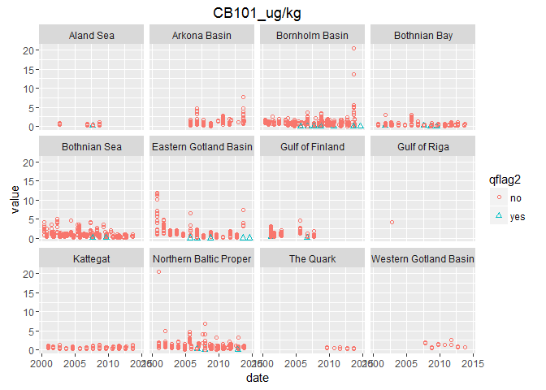
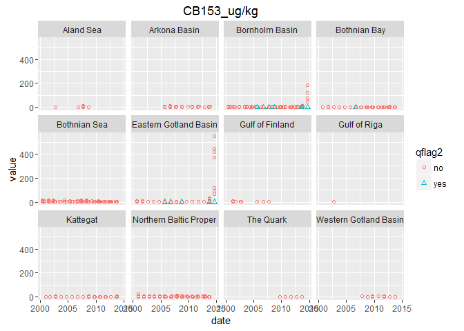
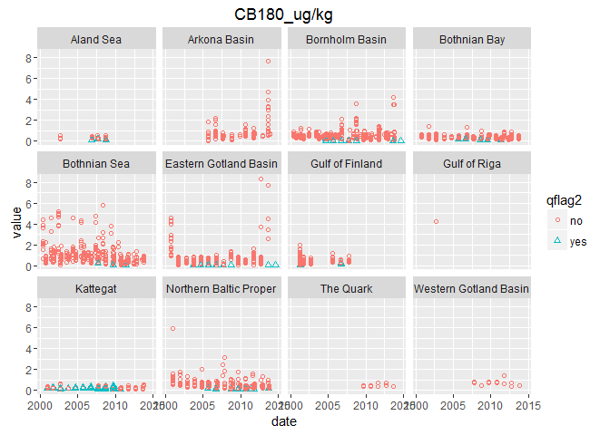

contaminants\_prep
================

``` r
## source common libraries, directories, functions, etc
# Libraries
library(readr)
```

    ## Warning: package 'readr' was built under R version 3.2.4

``` r
library(dplyr)
```

    ## 
    ## Attaching package: 'dplyr'

    ## The following objects are masked from 'package:stats':
    ## 
    ##     filter, lag

    ## The following objects are masked from 'package:base':
    ## 
    ##     intersect, setdiff, setequal, union

``` r
library(tidyr)
library(ggplot2)
```

    ## Warning: package 'ggplot2' was built under R version 3.2.4

``` r
library(RMySQL)
```

    ## Loading required package: DBI

``` r
library(stringr)
library(tools)
library(rprojroot) # install.packages('rprojroot')
```

    ## Warning: package 'rprojroot' was built under R version 3.2.4

``` r
## rprojroot
root <- rprojroot::is_rstudio_project


## make_path() function to 
make_path <- function(...) rprojroot::find_root_file(..., criterion = is_rstudio_project)

dir_layers = make_path('baltic2015/layers') # replaces  file.path(dir_baltic, 'layers')

source('~/github/bhi/baltic2015/prep/common.r')
dir_cw    = file.path(dir_prep, 'CW')
dir_con    = file.path(dir_prep, 'CW/contaminants')

## add a README.md to the prep directory with the rawgit.com url for viewing on GitHub
create_readme(dir_con, 'contaminants_prep.rmd')
```

Contaminant Data Prep
=====================

1 Indicators
------------

3 indicators are proposed, describing different aspects of toxicity, and then would be combined to give an overall contamimant sub-component status.

### 1.2 (1) PCB concentration indicator

#### 1.2.1 Original PCB indicator: ICES-6 PCB

Non-dioxin like PCBs: sum of congeners (28, 52, 101, 138, 153, 180) 75 μg/kg ww fish muscle

This is similar to the ICES-7 except that PCB 118 is excluded (since it is metabolized by mammals).

75 ng/g wet weight is the [EU threshold for fish muscle. See Section 5 Annex, 5.3](http://eur-lex.europa.eu/LexUriServ/LexUriServ.do?uri=OJ:L:2011:320:0018:0023:EN:PDF). This threshold was also agreed upon as GES boundary at the most recent meeting of the [Working Group on the State of the Environment and Nature Conservation](http://helcom.fi/helcom-at-work/groups/state-and-conservation) April 11-15, 2016. *Recevied the draft report from Elisabeth Nyberg*

#### 1.2.2 Alternatie PCB indicator: CB-153 Concentration

CB-153 concentration
 - Suggested by Anders Bignet and Elisabeth Nyberg. - This would be a good indicator because it is abundant (so almost always measured) and will have few detection / quantification limit problems.
 - They suggest using the EU threshold for human health as the reference point.

EU documents seem to only focus on the ICES6 indicator. However, OSPAR as individual CB thresholds. [OSPAR background](http://qsr2010.ospar.org/media/assessments/p00390_supplements/p00461_Background_Doc_CEMP_Assessmt_Criteria_Haz_Subs.pdf).

Table 1, p.14: Blue range = Status is acceptable. Concentrations are close to background or zero, i.e. the ultimate aim of the OSPAR Strategy for Hazardous Substances has been achieved.

Table 5c. Blue &lt; BAC = CB153 0.2 μg/kg wet weight. *(this number differs in what is summarized for this report in the HELCOM core indicator document from 2013)*

**Older documents with background**
Additional information from HELCOM on the Core Indicators:
[HELCOM Core Indicator of Hazardous Substances Polychlorinated biphenyls (PCB) and dioxins and furans 2013](http://www.helcom.fi/Core%20Indicators/HELCOM-CoreIndicator_Polychlorinated_biphenyls_and_dioxins_and_furans.pdf). *This document is now outdated*

*Determination of GES boundary* The CORESET expert group decided that, due to uncertainties in the target setting on the OSPAR and EU working groups, the seven PCBs should be monitored and concentrations analysed but the core indicator assesses primarily two congeners only: CB-118 (dioxin like) and 153 (non-dioxin like). Tentatively the OSPAR EACs for these two congeners are suggested to be used.

### 1.3 (2) TEQ value for PCBs and Dioxins

Dioxin and dioxin-like compounds:0.0065 TEQ/kg ww fish, crustaceans or molluscs (source of target:EQS biota human health). Secondary GES boundary: CB-118 24 μg/kg lw fish liver or muscle (source: EAC).

This threshold was also agreed upon as GES indicator at the most recent meeting of the [Working Group on the State of the Environment and Nature Conservation](http://helcom.fi/helcom-at-work/groups/state-and-conservation) April 11-15, 2016. *Recevied the draft report from Elisabeth Nyberg*

**Older documents with background** [HELCOM Core Indicator of Hazardous Substances Polychlorinated biphenyls (PCB) and dioxins and furans](http://www.helcom.fi/Core%20Indicators/HELCOM-CoreIndicator_Polychlorinated_biphenyls_and_dioxins_and_furans.pdf) *This document is now outdated*

Dioxins are included in several international agreements, of which the Stockholm Convention and the Convention on Long Range Transboundary Air are among the most important for the control and reduction of sources to the environment. WHO and FAO have jointly established a maximum tolerable human intake level of dioxins via food, and within the EU there are limit values for dioxins in food and feed stuff (EC 2006). Several other EU legislations regulate dioxins, e.g. the plan for integrated pollution prevention and control (IPPC) and directives on waste incineration (EC, 2000, 2008). The EU has also adopted a Community Strategy for dioxins, furans and PCBs (EC 2001).

**Determination of GES boundary** For dioxins, it was decided to use the GES boundary of 4.0 ng kg-1 ww WHO-TEQ for dioxins and 8.0 ng kg-1 ww WHO-TEQ for dioxins and dl-PCBs.

### 1.4 (3) PFOS indicator

[HELCOM PFOS core indicator document](http://www.helcom.fi/Core%20Indicators/PFOS_HELCOM%20core%20indicator%202016_web%20version.pdf)

### 1.5 Additional references

[Faxneld et al. 2014](http://www.diva-portal.org/smash/record.jsf?pid=diva2%3A728508&dswid=1554) Biological effects and environmental contaminants in herring and Baltic Sea top predators

[Bignert, A., Nyberg, E., Sundqvist, K.L., Wiberg, K., 2007. Spatial variation in concentrations and patterns of the PCDD/F and dioxin-like PCB content in herring from the northern Baltic Sea. J. Environ. Monit. 9, 550–556.](http://pubs.rsc.org/en/Content/ArticleLanding/2007/EM/b700667e#!divAbstract)

2. Data
-------

### 2.1 Data sources

#### 2.1.1 PCB data

**ICES** [ICES database](http://dome.ices.dk/views/ContaminantsBiota.aspx)
Downloaded 22 April 2016 by Jennifer Griffiths Data selections: Year - 1990-2014 Purpose of monitoring = All Country = ALL Monitoring Program = ALL Parameter Group = Chlorobiophenyls Reporting Laboratory = All Analytical laboratory = All Geographical Areas = (HELCOM) ALL HELCOM Sub-basins

#### 2.1.2 Dioxins

#### 2.1.3 PFOS

#### Other sources

IVL (Svenska Miljönstitutet / Swedish Environmental Research Institute)
[IVL database](http://dvsb.ivl.se/)
Downloaded 2 December 2015 by Cornelia Ludwig

### 2.2 Data prep prior to database

#### 2.2.1 PCB

Raw data from ICES were prepared in `~/github/bhi/baltic2015/prep/CW/contaminants/raw_contaminants_data_prep`
 - If duplicate measurements were made from the same sample, values were averaged (all were two measurement of LIPIDWT% per sample, all from 2014, Poland).
 - Data were standardized to the same unit ug/kg
 - If data were presented in lipid weight, they were converted to wet weight by: (EXLIP% / 100)\*(CB-conc lipid weight).

**Note**: Detection limit (detect\_lim) and Quantification limit (quant\_lim) values are in the original units. They are not standardized to ug/kg and not converted to wet weight if originally in lipid weight

3. Other Info
-------------

........

4. Data Prep - PCB Indicator
----------------------------

### 4.1 Basic data cleaning and organization

#### 4.1.1 Read in PCB data

    ## [1] 16732    47

#### 4.1.2 Organize

Remove and rename columns, change column data types

``` r
str(pcb1)
```

    ## 'data.frame':    16732 obs. of  47 variables:
    ##  $ X                                   : int  1 2 3 4 5 6 7 8 9 10 ...
    ##  $ country                             : Factor w/ 5 levels "Finland","Germany",..: 1 1 1 1 1 1 1 1 1 1 ...
    ##  $ monit_program                       : Factor w/ 3 levels "CEMP~COMB","COMB",..: 2 2 2 2 2 2 2 2 2 2 ...
    ##  $ monit_purpose                       : Factor w/ 5 levels "","B~T~S","H",..: 1 1 1 1 1 1 1 1 1 1 ...
    ##  $ report_institute                    : Factor w/ 7 levels "ASLR","BFGG",..: 4 4 4 4 4 4 4 4 4 4 ...
    ##  $ station                             : Factor w/ 31 levels "","Abbekas","Aengskaersklubb",..: 1 1 1 1 1 1 1 1 1 1 ...
    ##  $ Latitude                            : num  64.2 64.2 64.2 64.2 64.2 ...
    ##  $ Longitude                           : num  23.3 23.3 23.3 23.3 23.3 ...
    ##  $ Date                                : Factor w/ 208 levels "2000-05-12","2000-05-15",..: 92 92 92 92 92 92 92 92 92 92 ...
    ##  $ monit_year                          : int  2008 2008 2008 2008 2008 2008 2008 2008 2008 2008 ...
    ##  $ date_ices                           : Factor w/ 208 levels "01/09/2008","01/09/2009",..: 33 33 33 33 33 33 33 33 33 33 ...
    ##  $ year                                : int  2008 2008 2008 2008 2008 2008 2008 2008 2008 2008 ...
    ##  $ species                             : Factor w/ 1 level "Clupea harengus": 1 1 1 1 1 1 1 1 1 1 ...
    ##  $ sub_samp_ref                        : int  3149743 3149743 3149743 3149743 3149743 3149743 3149743 3149744 3149744 3149744 ...
    ##  $ sub_samp_id                         : Factor w/ 1490 levels "1","10","1001",..: 457 457 457 457 457 457 457 458 458 458 ...
    ##  $ samp_id                             : int  1423609 1423609 1423609 1423609 1423609 1423609 1423609 1423610 1423610 1423610 ...
    ##  $ num_indiv_subsample                 : int  1 1 1 1 1 1 1 1 1 1 ...
    ##  $ bulk_id                             : logi  NA NA NA NA NA NA ...
    ##  $ basis_determination_originalcongener: Factor w/ 2 levels "lipid weight",..: 2 2 2 2 2 2 2 2 2 2 ...
    ##  $ basis_determination_converted       : Factor w/ 1 level "wet weight": 1 1 1 1 1 1 1 1 1 1 ...
    ##  $ AGMAX_y                             : logi  NA NA NA NA NA NA ...
    ##  $ AGMEA_y                             : int  NA NA NA NA NA NA NA NA NA NA ...
    ##  $ AGMIN_y                             : logi  NA NA NA NA NA NA ...
    ##  $ DRYWT._.                            : num  NA NA NA NA NA NA NA NA NA NA ...
    ##  $ EXLIP._.                            : num  NA NA NA NA NA NA NA NA NA NA ...
    ##  $ FATWT._.                            : num  NA NA NA NA NA NA NA NA NA NA ...
    ##  $ LIPIDWT._.                          : num  NA NA NA NA NA NA NA NA NA NA ...
    ##  $ LNMAX_cm                            : logi  NA NA NA NA NA NA ...
    ##  $ LNMEA_cm                            : num  NA NA NA NA NA NA NA NA NA NA ...
    ##  $ LNMIN_cm                            : logi  NA NA NA NA NA NA ...
    ##  $ WTMAX_g                             : logi  NA NA NA NA NA NA ...
    ##  $ WTMEA_g                             : num  NA NA NA NA NA NA NA NA NA NA ...
    ##  $ WTMIN_g                             : logi  NA NA NA NA NA NA ...
    ##  $ qflag                               : Factor w/ 5 levels "","<","<~D","D",..: 1 1 1 1 1 2 2 1 1 1 ...
    ##  $ detect_lim                          : num  NA NA NA NA NA NA NA NA NA NA ...
    ##  $ quant_lim                           : num  NA NA NA NA NA 0.04 0.04 NA NA NA ...
    ##  $ uncert_val                          : num  NA NA NA NA NA NA NA NA NA NA ...
    ##  $ method_uncert                       : Factor w/ 3 levels "","%","U2": 1 1 1 1 1 1 1 1 1 1 ...
    ##  $ congener                            : Factor w/ 16 levels "CB101_ug/kg",..: 1 3 5 7 13 14 15 1 3 5 ...
    ##  $ value                               : num  0.3 0.27 0.66 0.84 0.3 0.04 0.04 0.18 0.25 0.61 ...
    ##  $ Month                               : int  8 8 8 8 8 8 8 8 8 8 ...
    ##  $ Day                                 : int  6 6 6 6 6 6 6 6 6 6 ...
    ##  $ DoY                                 : int  219 219 219 219 219 219 219 219 219 219 ...
    ##  $ BHI_ID                              : int  42 42 42 42 42 42 42 42 42 42 ...
    ##  $ HELCOM_ID                           : Factor w/ 12 levels "SEA-001","SEA-006",..: 12 12 12 12 12 12 12 12 12 12 ...
    ##  $ HELCOM_COASTAL_CODE                 : int  0 0 0 0 0 0 0 0 0 0 ...
    ##  $ ICES_AREA                           : Factor w/ 10 levels "24","25","26",..: 8 8 8 8 8 8 8 8 8 8 ...

``` r
#format date as date
pcb2 = pcb1 %>% 
      dplyr::rename(date=Date, lat=Latitude, lon= Longitude, 
                    month=Month, day=Day, doy=DoY,
                    bhi_id = BHI_ID, helcom_id=HELCOM_ID, 
                    helcom_coastal_code=HELCOM_COASTAL_CODE, ices_area = ICES_AREA,
                    agmax_y = AGMAX_y, agmea_y=AGMEA_y, agmin_y = AGMIN_y,
                    drywt_percent = DRYWT._., exlip_percent = EXLIP._.,fatwt_percent=FATWT._.,
                    lipidwt_percent = LIPIDWT._., lnmax_cm = LNMAX_cm,
                    lnmea_cm=LNMEA_cm, lnmin_cm=LNMIN_cm, wtmax_g=WTMAX_g, wtmea_g=WTMEA_g,
                    wtmin_g=WTMIN_g) %>% # rename columns
      select(-date_ices, -X) %>% #remove columns not needed
      mutate(date =as.Date(date,"%Y-%m-%d"),
             sub_samp_id= as.character(sub_samp_id)) %>%
      select(country:lon,bhi_id:ices_area,date:year,month:doy,species:value)## reorder columns

head(pcb2)
```

    ##   country monit_program monit_purpose report_institute station      lat
    ## 1 Finland          COMB                           FEIF         64.17917
    ## 2 Finland          COMB                           FEIF         64.17917
    ## 3 Finland          COMB                           FEIF         64.17917
    ## 4 Finland          COMB                           FEIF         64.17917
    ## 5 Finland          COMB                           FEIF         64.17917
    ## 6 Finland          COMB                           FEIF         64.17917
    ##       lon bhi_id helcom_id helcom_coastal_code ices_area       date
    ## 1 23.3265     42   SEA-017                   0        31 2008-08-06
    ## 2 23.3265     42   SEA-017                   0        31 2008-08-06
    ## 3 23.3265     42   SEA-017                   0        31 2008-08-06
    ## 4 23.3265     42   SEA-017                   0        31 2008-08-06
    ## 5 23.3265     42   SEA-017                   0        31 2008-08-06
    ## 6 23.3265     42   SEA-017                   0        31 2008-08-06
    ##   monit_year year month day doy         species sub_samp_ref sub_samp_id
    ## 1       2008 2008     8   6 219 Clupea harengus      3149743       34000
    ## 2       2008 2008     8   6 219 Clupea harengus      3149743       34000
    ## 3       2008 2008     8   6 219 Clupea harengus      3149743       34000
    ## 4       2008 2008     8   6 219 Clupea harengus      3149743       34000
    ## 5       2008 2008     8   6 219 Clupea harengus      3149743       34000
    ## 6       2008 2008     8   6 219 Clupea harengus      3149743       34000
    ##   samp_id num_indiv_subsample bulk_id basis_determination_originalcongener
    ## 1 1423609                   1      NA                           wet weight
    ## 2 1423609                   1      NA                           wet weight
    ## 3 1423609                   1      NA                           wet weight
    ## 4 1423609                   1      NA                           wet weight
    ## 5 1423609                   1      NA                           wet weight
    ## 6 1423609                   1      NA                           wet weight
    ##   basis_determination_converted agmax_y agmea_y agmin_y drywt_percent
    ## 1                    wet weight      NA      NA      NA            NA
    ## 2                    wet weight      NA      NA      NA            NA
    ## 3                    wet weight      NA      NA      NA            NA
    ## 4                    wet weight      NA      NA      NA            NA
    ## 5                    wet weight      NA      NA      NA            NA
    ## 6                    wet weight      NA      NA      NA            NA
    ##   exlip_percent fatwt_percent lipidwt_percent lnmax_cm lnmea_cm lnmin_cm
    ## 1            NA            NA              NA       NA       NA       NA
    ## 2            NA            NA              NA       NA       NA       NA
    ## 3            NA            NA              NA       NA       NA       NA
    ## 4            NA            NA              NA       NA       NA       NA
    ## 5            NA            NA              NA       NA       NA       NA
    ## 6            NA            NA              NA       NA       NA       NA
    ##   wtmax_g wtmea_g wtmin_g qflag detect_lim quant_lim uncert_val
    ## 1      NA      NA      NA               NA        NA         NA
    ## 2      NA      NA      NA               NA        NA         NA
    ## 3      NA      NA      NA               NA        NA         NA
    ## 4      NA      NA      NA               NA        NA         NA
    ## 5      NA      NA      NA               NA        NA         NA
    ## 6      NA      NA      NA     <         NA      0.04         NA
    ##   method_uncert    congener value
    ## 1               CB101_ug/kg  0.30
    ## 2               CB118_ug/kg  0.27
    ## 3               CB138_ug/kg  0.66
    ## 4               CB153_ug/kg  0.84
    ## 5               CB180_ug/kg  0.30
    ## 6                CB28_ug/kg  0.04

#### 4.1.3 Plot data

Explore raw data. **Why are there unassigned BHI regions?**

``` r
ggplot(pcb2) + geom_point(aes(date,value, colour=congener)) +
  facet_wrap(~bhi_id)
```

<!-- -->

#### 4.1.4 Filter for ICES 6 PCBs

``` r
ices6pcb = c("CB28_ug/kg", "CB52_ug/kg", "CB101_ug/kg", "CB138_ug/kg",
            "CB153_ug/kg", "CB180_ug/kg")
  
pcb3 = pcb2 %>% 
        filter(congener %in% ices6pcb)

dim(pcb3); dim(pcb2)
```

    ## [1] 13106    45

    ## [1] 16732    45

#### 4.1.5 Plot data -ICES 6 pcbs

``` r
ggplot(pcb3) + geom_point(aes(date,value, colour=congener)) +
  facet_wrap(~bhi_id)
```

<!-- -->

#### 4.1.6 Stations with No BHI ID

Why were some data not assigned a BHI ID (through script in BHI database).
Will check with Marc, might be because very near coast and BHI regions don't extend?

``` r
## which stations have no BHI ID assigned
pcb3 %>% filter(is.na(bhi_id)) %>% select(country,station, lat, lon) %>% distinct(.)
```

    ##   country            station     lat     lon
    ## 1  Sweden     Gaviksfjaerden 62.8645 18.2412
    ## 2  Sweden Kinnbaecksfjaerden 65.0568 21.4750
    ## 3  Sweden  Langvindsfjaerden 61.4554 17.1622

``` r
##country            station     lat     lon
##1  Sweden     Gaviksfjaerden 62.8645 18.2412
##2  Sweden Kinnbaecksfjaerden 65.0568 21.4750
##3  Sweden  Langvindsfjaerden 61.4554 17.1622
```

#### 4.1.7 Manually assign BHI to stations missing

``` r
##Gaviksfjaerden is BHI region 37
##Kinnbaecksfjaerden is BHI region 41
##Langvindsfjaerden is BHI region 37

pcb4 = pcb3 %>%
      mutate(bhi_id = ifelse(station=="Gaviksfjaerden",37,
                      ifelse(station=="Kinnbaecksfjaerden", 41,
                      ifelse(station=="Langvindsfjaerden",37,bhi_id))))
pcb4 %>% filter(is.na(bhi_id)) %>% select(country,station, lat, lon) %>% distinct(.)
```

    ## [1] country station lat     lon    
    ## <0 rows> (or 0-length row.names)

``` r
##plot again
ggplot(pcb4) + geom_point(aes(date,value, colour=congener)) +
  facet_wrap(~bhi_id)
```

<!-- -->

#### 4.1.8 Join to HOLAS basins and evaluate data coverage

``` r
pcb5 = full_join(select(lookup_basins, rgn_id, basin_name), pcb4, by= c("rgn_id"="bhi_id"))
head(pcb5)
```

    ##   rgn_id basin_name country monit_program monit_purpose report_institute
    ## 1      1   Kattegat  Sweden     CEMP~COMB             T             SERI
    ## 2      1   Kattegat  Sweden     CEMP~COMB             T             SERI
    ## 3      1   Kattegat  Sweden     CEMP~COMB             T             SERI
    ## 4      1   Kattegat  Sweden     CEMP~COMB             T             SERI
    ## 5      1   Kattegat  Sweden     CEMP~COMB             T             SERI
    ## 6      1   Kattegat  Sweden     CEMP~COMB             T             SERI
    ##      station     lat    lon helcom_id helcom_coastal_code ices_area
    ## 1 E/W FLADEN 57.2247 11.828   SEA-001                   0      IIIa
    ## 2 E/W FLADEN 57.2247 11.828   SEA-001                   0      IIIa
    ## 3 E/W FLADEN 57.2247 11.828   SEA-001                   0      IIIa
    ## 4 E/W FLADEN 57.2247 11.828   SEA-001                   0      IIIa
    ## 5 E/W FLADEN 57.2247 11.828   SEA-001                   0      IIIa
    ## 6 E/W FLADEN 57.2247 11.828   SEA-001                   0      IIIa
    ##         date monit_year year month day doy         species sub_samp_ref
    ## 1 2000-12-08       2000 2000    12   8 343 Clupea harengus      3580025
    ## 2 2000-12-08       2000 2000    12   8 343 Clupea harengus      3580025
    ## 3 2000-12-08       2000 2000    12   8 343 Clupea harengus      3580025
    ## 4 2000-12-08       2000 2000    12   8 343 Clupea harengus      3580025
    ## 5 2000-12-08       2000 2000    12   8 343 Clupea harengus      3580025
    ## 6 2000-12-08       2000 2000    12   8 343 Clupea harengus      3580025
    ##   sub_samp_id samp_id num_indiv_subsample bulk_id
    ## 1        6166 1741386                   1      NA
    ## 2        6166 1741386                   1      NA
    ## 3        6166 1741386                   1      NA
    ## 4        6166 1741386                   1      NA
    ## 5        6166 1741386                   1      NA
    ## 6        6166 1741386                   1      NA
    ##   basis_determination_originalcongener basis_determination_converted
    ## 1                         lipid weight                    wet weight
    ## 2                         lipid weight                    wet weight
    ## 3                         lipid weight                    wet weight
    ## 4                         lipid weight                    wet weight
    ## 5                         lipid weight                    wet weight
    ## 6                         lipid weight                    wet weight
    ##   agmax_y agmea_y agmin_y drywt_percent exlip_percent fatwt_percent
    ## 1      NA       2      NA          26.5           3.5            NA
    ## 2      NA       2      NA          26.5           3.5            NA
    ## 3      NA       2      NA          26.5           3.5            NA
    ## 4      NA       2      NA          26.5           3.5            NA
    ## 5      NA       2      NA          26.5           3.5            NA
    ## 6      NA       2      NA          26.5           3.5            NA
    ##   lipidwt_percent lnmax_cm lnmea_cm lnmin_cm wtmax_g wtmea_g wtmin_g qflag
    ## 1              NA       NA     18.7       NA      NA    44.3      NA      
    ## 2              NA       NA     18.7       NA      NA    44.3      NA      
    ## 3              NA       NA     18.7       NA      NA    44.3      NA      
    ## 4              NA       NA     18.7       NA      NA    44.3      NA     D
    ## 5              NA       NA     18.7       NA      NA    44.3      NA     D
    ## 6              NA       NA     18.7       NA      NA    44.3      NA      
    ##   detect_lim quant_lim uncert_val method_uncert    congener  value
    ## 1        4.0        NA         NA               CB101_ug/kg 0.5775
    ## 2        6.0        NA         NA               CB138_ug/kg 1.0745
    ## 3        5.0        NA         NA               CB153_ug/kg 1.3300
    ## 4        5.1        NA         NA               CB180_ug/kg 0.1785
    ## 5        4.3        NA         NA                CB28_ug/kg 0.1505
    ## 6        4.0        NA         NA                CB52_ug/kg 0.2345

#### 4.1.9 Plot by basin

``` r
ggplot(pcb5) + geom_point(aes(date,value, colour=congener)) +
  facet_wrap(~basin_name)
```

    ## Warning: Removed 24 rows containing missing values (geom_point).

<!-- -->

### 4.2 Evaluate sites sampled

What are the site representing: baseline/reference conditions or local impact.

#### 4.2.1 Join PCB sites, station dictionary, and impact codes

Some sites have had the site type recorded in the ICES station dictionary (see below). It is important to know which sites are catagorized as:
 1. *RH* = WFD R(HZ) - Representative of general conditions in terms of hazardous substances
 2. *B* = WFD B - Baseline/Reference station
 3. Any of the codes containing "I" (IH, IH-A, IH-C, IH-D, IH-E, IH-F, IH-H, IH-I, IH-M, IH-O, IH-P, IH-S, IH-W, IP, IP-B, IP-N, IP-T) which refers to a specific type of impact at the site.

It appears that *only Swedish sites have this information entered* (see below), Most are RH (19), while B (4) and RP (1). RP = WFD R(PHY) Representative of general conditions for nutrients/organic matter.

**Sites to Include/Exclude**
Given only Swedish sites have this information recorded, seems difficult to use this information to include or exclude sites.

``` r
pcb_sites = pcb5 %>% 
            select(country, station,basin_name,lat,lon,rgn_id) %>%
            filter(!is.na(station)) %>%  ## These are NA because when joined to BHI regions, were no station
            mutate(station2 = tolower(station)) %>% ## station name all lower case to join with station_dictionary
            distinct(.)
pcb_sites
```

    ##    country             station             basin_name      lat      lon
    ## 1   Sweden          E/W FLADEN               Kattegat 57.22470 11.82800
    ## 2   Sweden              Kullen               Kattegat 56.32510 12.38110
    ## 3   Sweden             Abbekas           Arkona Basin 55.31630 13.61100
    ## 4  Germany             FOE-B11           Arkona Basin 55.07967 13.25017
    ## 5  Germany             FOE-B11           Arkona Basin 55.08567 13.82617
    ## 6  Germany             FOE-B10           Arkona Basin 54.84183 14.04083
    ## 7  Germany             FOE-B11           Arkona Basin 54.76767 13.94167
    ## 8  Germany             FOE-B11           Arkona Basin 54.69133 13.81733
    ## 9  Germany             FOE-B11           Arkona Basin 54.74217 13.92283
    ## 10 Germany             FOE-BMP           Arkona Basin 54.74400 13.92583
    ## 11 Germany             FOE-BMP           Arkona Basin 54.68467 13.94917
    ## 12  Sweden           Utlaengan         Bornholm Basin 55.94910 15.78100
    ## 13  Sweden Vaestra Hanoebukten         Bornholm Basin 55.75070 14.28330
    ## 14 Germany             FOE-B11         Bornholm Basin 55.00733 17.43333
    ## 15  Poland                LKOL         Bornholm Basin 54.91667 16.66667
    ## 16  Poland                LWLA  Eastern Gotland Basin 54.91667 18.66667
    ## 17  Sweden           Byxelkrok  Western Gotland Basin 57.31670 17.50000
    ## 18  Latvia        Gulf of Riga           Gulf of Riga 57.41667 23.76667
    ## 19  Sweden            Landsort Northern Baltic Proper 58.69360 18.00430
    ## 20 Finland                     Northern Baltic Proper 59.54750 22.60533
    ## 21 Finland                LL12 Northern Baltic Proper 59.46667 22.25000
    ## 22 Finland                LL12 Northern Baltic Proper 59.58333 22.30000
    ## 23 Finland                LL11        Gulf of Finland 59.71667 23.33333
    ## 24 Finland                LL11        Gulf of Finland 59.63333 23.75000
    ## 25 Finland                LL11        Gulf of Finland 59.76667 23.86667
    ## 26 Finland                LL3A        Gulf of Finland 60.33333 26.15000
    ## 27 Finland                LL3A        Gulf of Finland 60.36667 26.81667
    ## 28 Finland                LL3A        Gulf of Finland 60.38333 26.71667
    ## 29 Finland                LL3A        Gulf of Finland 60.35000 26.75000
    ## 30 Finland                LL3A        Gulf of Finland 60.51867 27.13833
    ## 31  Sweden              Lagnoe              Aland Sea 59.56520 18.83480
    ## 32 Finland                                  Aland Sea 59.87983 19.95800
    ## 33 Finland                 F64              Aland Sea 60.18333 19.46667
    ## 34 Finland                 F67              Aland Sea 59.95000 20.11667
    ## 35 Finland                 F67              Aland Sea 59.97267 20.08617
    ## 36 Finland                LL12              Aland Sea 59.93333 22.21667
    ## 37  Sweden     Aengskaersklubb           Bothnian Sea 60.53260 18.16240
    ## 38  Sweden      Gaviksfjaerden           Bothnian Sea 62.86450 18.24120
    ## 39  Sweden   Langvindsfjaerden           Bothnian Sea 61.45540 17.16220
    ## 40 Finland                               Bothnian Sea 61.71083 20.70750
    ## 41 Finland                MS10           Bothnian Sea 61.60000 20.83333
    ## 42 Finland                MS10           Bothnian Sea 61.75000 20.50000
    ## 43 Finland                MS10           Bothnian Sea 61.86667 20.75000
    ## 44 Finland                MS10           Bothnian Sea 61.61667 20.81667
    ## 45 Finland                MS10           Bothnian Sea 61.66667 20.66667
    ## 46  Sweden          Holmoearna              The Quark 63.68080 20.87680
    ## 47  Sweden        Harufjaerden           Bothnian Bay 65.58250 22.87910
    ## 48  Sweden  Kinnbaecksfjaerden           Bothnian Bay 65.05680 21.47500
    ## 49  Sweden        Ranefjaerden           Bothnian Bay 65.75550 22.41810
    ## 50 Finland                               Bothnian Bay 64.17917 23.32650
    ## 51 Finland                  F2           Bothnian Bay 65.15000 25.16667
    ## 52 Finland                 RR8           Bothnian Bay 64.30000 23.10833
    ## 53 Finland                 RR8           Bothnian Bay 64.15000 23.25833
    ## 54 Finland                 RR8           Bothnian Bay 64.13333 23.25000
    ## 55 Finland                 RR9           Bothnian Bay 64.13333 23.25000
    ##    rgn_id            station2
    ## 1       1          e/w fladen
    ## 2       1              kullen
    ## 3      11             abbekas
    ## 4      11             foe-b11
    ## 5      11             foe-b11
    ## 6      13             foe-b10
    ## 7      13             foe-b11
    ## 8      13             foe-b11
    ## 9      13             foe-b11
    ## 10     13             foe-bmp
    ## 11     13             foe-bmp
    ## 12     14           utlaengan
    ## 13     14 vaestra hanoebukten
    ## 14     17             foe-b11
    ## 15     17                lkol
    ## 16     21                lwla
    ## 17     26           byxelkrok
    ## 18     27        gulf of riga
    ## 19     29            landsort
    ## 20     30                    
    ## 21     30                ll12
    ## 22     30                ll12
    ## 23     32                ll11
    ## 24     32                ll11
    ## 25     32                ll11
    ## 26     32                ll3a
    ## 27     32                ll3a
    ## 28     32                ll3a
    ## 29     32                ll3a
    ## 30     32                ll3a
    ## 31     35              lagnoe
    ## 32     36                    
    ## 33     36                 f64
    ## 34     36                 f67
    ## 35     36                 f67
    ## 36     36                ll12
    ## 37     37     aengskaersklubb
    ## 38     37      gaviksfjaerden
    ## 39     37   langvindsfjaerden
    ## 40     38                    
    ## 41     38                ms10
    ## 42     38                ms10
    ## 43     38                ms10
    ## 44     38                ms10
    ## 45     38                ms10
    ## 46     39          holmoearna
    ## 47     41        harufjaerden
    ## 48     41  kinnbaecksfjaerden
    ## 49     41        ranefjaerden
    ## 50     42                    
    ## 51     42                  f2
    ## 52     42                 rr8
    ## 53     42                 rr8
    ## 54     42                 rr8
    ## 55     42                 rr9

``` r
dim(pcb_sites) #[1] 55  7
```

    ## [1] 55  7

``` r
## clean lookup table
lookup_impact = lookup_impact %>%
                mutate(Station_Name2 = as.character(Station_Name2))


## join with station dictionary

pcb_sites = pcb_sites %>% left_join(., lookup_impact, by=c("station2"="Station_Name2", "country"="Country"))
```

    ## Warning in left_join_impl(x, y, by$x, by$y): joining factors with different
    ## levels, coercing to character vector

``` r
dim(pcb_sites) # 55 26
```

    ## [1] 55 27

``` r
pcb_sites %>% select(country, station, basin_name, lat, lon, rgn_id,MSTAT,All_Biota_Data:impact_I) %>% arrange(impact_RH, impact_B, impact_I)
```

    ##    country             station             basin_name      lat      lon
    ## 1   Sweden          E/W FLADEN               Kattegat 57.22470 11.82800
    ## 2  Germany             FOE-B11           Arkona Basin 55.07967 13.25017
    ## 3  Germany             FOE-B11           Arkona Basin 55.08567 13.82617
    ## 4  Germany             FOE-B10           Arkona Basin 54.84183 14.04083
    ## 5  Germany             FOE-B11           Arkona Basin 54.76767 13.94167
    ## 6  Germany             FOE-B11           Arkona Basin 54.69133 13.81733
    ## 7  Germany             FOE-B11           Arkona Basin 54.74217 13.92283
    ## 8  Germany             FOE-BMP           Arkona Basin 54.74400 13.92583
    ## 9  Germany             FOE-BMP           Arkona Basin 54.68467 13.94917
    ## 10  Sweden           Utlaengan         Bornholm Basin 55.94910 15.78100
    ## 11 Germany             FOE-B11         Bornholm Basin 55.00733 17.43333
    ## 12  Sweden            Landsort Northern Baltic Proper 58.69360 18.00430
    ## 13  Sweden              Lagnoe              Aland Sea 59.56520 18.83480
    ## 14  Sweden     Aengskaersklubb           Bothnian Sea 60.53260 18.16240
    ## 15  Sweden      Gaviksfjaerden           Bothnian Sea 62.86450 18.24120
    ## 16  Sweden   Langvindsfjaerden           Bothnian Sea 61.45540 17.16220
    ## 17  Sweden          Holmoearna              The Quark 63.68080 20.87680
    ## 18  Sweden        Harufjaerden           Bothnian Bay 65.58250 22.87910
    ## 19  Sweden        Ranefjaerden           Bothnian Bay 65.75550 22.41810
    ## 20  Sweden             Abbekas           Arkona Basin 55.31630 13.61100
    ## 21  Sweden Vaestra Hanoebukten         Bornholm Basin 55.75070 14.28330
    ## 22  Sweden           Byxelkrok  Western Gotland Basin 57.31670 17.50000
    ## 23  Sweden  Kinnbaecksfjaerden           Bothnian Bay 65.05680 21.47500
    ## 24  Sweden              Kullen               Kattegat 56.32510 12.38110
    ## 25  Poland                LKOL         Bornholm Basin 54.91667 16.66667
    ## 26  Poland                LWLA  Eastern Gotland Basin 54.91667 18.66667
    ## 27  Latvia        Gulf of Riga           Gulf of Riga 57.41667 23.76667
    ## 28 Finland                     Northern Baltic Proper 59.54750 22.60533
    ## 29 Finland                LL12 Northern Baltic Proper 59.46667 22.25000
    ## 30 Finland                LL12 Northern Baltic Proper 59.58333 22.30000
    ## 31 Finland                LL11        Gulf of Finland 59.71667 23.33333
    ## 32 Finland                LL11        Gulf of Finland 59.63333 23.75000
    ## 33 Finland                LL11        Gulf of Finland 59.76667 23.86667
    ## 34 Finland                LL3A        Gulf of Finland 60.33333 26.15000
    ## 35 Finland                LL3A        Gulf of Finland 60.36667 26.81667
    ## 36 Finland                LL3A        Gulf of Finland 60.38333 26.71667
    ## 37 Finland                LL3A        Gulf of Finland 60.35000 26.75000
    ## 38 Finland                LL3A        Gulf of Finland 60.51867 27.13833
    ## 39 Finland                                  Aland Sea 59.87983 19.95800
    ## 40 Finland                 F64              Aland Sea 60.18333 19.46667
    ## 41 Finland                 F67              Aland Sea 59.95000 20.11667
    ## 42 Finland                 F67              Aland Sea 59.97267 20.08617
    ## 43 Finland                LL12              Aland Sea 59.93333 22.21667
    ## 44 Finland                               Bothnian Sea 61.71083 20.70750
    ## 45 Finland                MS10           Bothnian Sea 61.60000 20.83333
    ## 46 Finland                MS10           Bothnian Sea 61.75000 20.50000
    ## 47 Finland                MS10           Bothnian Sea 61.86667 20.75000
    ## 48 Finland                MS10           Bothnian Sea 61.61667 20.81667
    ## 49 Finland                MS10           Bothnian Sea 61.66667 20.66667
    ## 50 Finland                               Bothnian Bay 64.17917 23.32650
    ## 51 Finland                  F2           Bothnian Bay 65.15000 25.16667
    ## 52 Finland                 RR8           Bothnian Bay 64.30000 23.10833
    ## 53 Finland                 RR8           Bothnian Bay 64.15000 23.25833
    ## 54 Finland                 RR8           Bothnian Bay 64.13333 23.25000
    ## 55 Finland                 RR9           Bothnian Bay 64.13333 23.25000
    ##    rgn_id MSTAT All_Biota_Data Contaminant_parameters_in_biota impact_RH
    ## 1       1    RH          FALSE                            TRUE         1
    ## 2      11    RH          FALSE                            TRUE         1
    ## 3      11    RH          FALSE                            TRUE         1
    ## 4      13    RH          FALSE                            TRUE         1
    ## 5      13    RH          FALSE                            TRUE         1
    ## 6      13    RH          FALSE                            TRUE         1
    ## 7      13    RH          FALSE                            TRUE         1
    ## 8      13    RH          FALSE                            TRUE         1
    ## 9      13    RH          FALSE                            TRUE         1
    ## 10     14    RH          FALSE                            TRUE         1
    ## 11     17    RH          FALSE                            TRUE         1
    ## 12     29    RH          FALSE                            TRUE         1
    ## 13     35    RH          FALSE                            TRUE         1
    ## 14     37    RH          FALSE                            TRUE         1
    ## 15     37    RH          FALSE                            TRUE         1
    ## 16     37    RH          FALSE                            TRUE         1
    ## 17     39    RH          FALSE                            TRUE         1
    ## 18     41    RH          FALSE                            TRUE         1
    ## 19     41    RH          FALSE                            TRUE         1
    ## 20     11     B          FALSE                           FALSE        NA
    ## 21     14     B          FALSE                           FALSE        NA
    ## 22     26     B          FALSE                           FALSE        NA
    ## 23     41     B          FALSE                           FALSE        NA
    ## 24      1    RP          FALSE                           FALSE        NA
    ## 25     17                FALSE                            TRUE        NA
    ## 26     21                FALSE                            TRUE        NA
    ## 27     27  <NA>             NA                              NA        NA
    ## 28     30  <NA>             NA                              NA        NA
    ## 29     30                FALSE                           FALSE        NA
    ## 30     30                FALSE                           FALSE        NA
    ## 31     32                FALSE                           FALSE        NA
    ## 32     32                FALSE                           FALSE        NA
    ## 33     32                FALSE                           FALSE        NA
    ## 34     32                FALSE                           FALSE        NA
    ## 35     32                FALSE                           FALSE        NA
    ## 36     32                FALSE                           FALSE        NA
    ## 37     32                FALSE                           FALSE        NA
    ## 38     32                FALSE                           FALSE        NA
    ## 39     36  <NA>             NA                              NA        NA
    ## 40     36                FALSE                           FALSE        NA
    ## 41     36  <NA>             NA                              NA        NA
    ## 42     36  <NA>             NA                              NA        NA
    ## 43     36                FALSE                           FALSE        NA
    ## 44     38  <NA>             NA                              NA        NA
    ## 45     38                FALSE                           FALSE        NA
    ## 46     38                FALSE                           FALSE        NA
    ## 47     38                FALSE                           FALSE        NA
    ## 48     38                FALSE                           FALSE        NA
    ## 49     38                FALSE                           FALSE        NA
    ## 50     42  <NA>             NA                              NA        NA
    ## 51     42                FALSE                           FALSE        NA
    ## 52     42                FALSE                           FALSE        NA
    ## 53     42                FALSE                           FALSE        NA
    ## 54     42                FALSE                           FALSE        NA
    ## 55     42  <NA>             NA                              NA        NA
    ##    impact_B impact_I
    ## 1        NA       NA
    ## 2        NA       NA
    ## 3        NA       NA
    ## 4        NA       NA
    ## 5        NA       NA
    ## 6        NA       NA
    ## 7        NA       NA
    ## 8        NA       NA
    ## 9        NA       NA
    ## 10       NA       NA
    ## 11       NA       NA
    ## 12       NA       NA
    ## 13       NA       NA
    ## 14       NA       NA
    ## 15       NA       NA
    ## 16       NA       NA
    ## 17       NA       NA
    ## 18       NA       NA
    ## 19       NA       NA
    ## 20        1       NA
    ## 21        1       NA
    ## 22        1       NA
    ## 23        1       NA
    ## 24       NA       NA
    ## 25       NA       NA
    ## 26       NA       NA
    ## 27       NA       NA
    ## 28       NA       NA
    ## 29       NA       NA
    ## 30       NA       NA
    ## 31       NA       NA
    ## 32       NA       NA
    ## 33       NA       NA
    ## 34       NA       NA
    ## 35       NA       NA
    ## 36       NA       NA
    ## 37       NA       NA
    ## 38       NA       NA
    ## 39       NA       NA
    ## 40       NA       NA
    ## 41       NA       NA
    ## 42       NA       NA
    ## 43       NA       NA
    ## 44       NA       NA
    ## 45       NA       NA
    ## 46       NA       NA
    ## 47       NA       NA
    ## 48       NA       NA
    ## 49       NA       NA
    ## 50       NA       NA
    ## 51       NA       NA
    ## 52       NA       NA
    ## 53       NA       NA
    ## 54       NA       NA
    ## 55       NA       NA

``` r
## many sites do not have purpose entered in ICES
## the Finnish sites with no station name could then not be found in the impact lookup
## Many of the sites have "FALSE" under 'Contaminant_parameters_in_biota'
## These sites are also "FALSE" under All_Biota_data 

## from the station dictionary definitions:
## All_Biota_Data: Data type (DTYPE) CF - all parameters - contaminants and biological effects of contaminants including disease in biota
##Contaminant_parameters_in_biota: Data type (DTYPE) CF - Contaminant parameter groups
```

### 4.3 Data flagged for quality

#### 4.3.1 Evaluate data with Qflags

Codes:
**&lt;** = less than
**&gt;** = greather than
**D** = reorted value is less than the detection limit (detli)
**Q** = reported value is less than the limit of quantification (lmqnt)
**~** separates multiple flags

No information is given for what **&lt;** implies when is it is used alone (e.g. is it related to the detection limit?) **Values for detect\_lim and quant\_lim**: Remember these are in the original units (not standardized to ug\_kg or to wet weight)

``` r
## what qflags are present
pcb5 %>% select(qflag) %>% distinct(.) 
```

    ##   qflag
    ## 1      
    ## 2     D
    ## 3  <NA>
    ## 4     <
    ## 5     Q
    ## 6   <~D

``` r
##1      
##2     D
##3  <NA>
##4     <
##5     Q
##6   <~D


## "~"  separates multiple flags

## which entries use '<'
pcb5 %>% 
  filter(.,grepl('<', qflag)) %>% select(country,station,date,sub_samp_ref,qflag,detect_lim,congener,value)
```

    ##     country station       date sub_samp_ref qflag detect_lim    congener
    ## 1    Poland    LKOL 2004-09-08      2204078     <      0.010 CB180_ug/kg
    ## 2    Poland    LKOL 2004-09-08      2204084     <      0.010 CB180_ug/kg
    ## 3    Poland    LKOL 2004-09-08      2204085     <      0.010 CB180_ug/kg
    ## 4    Poland    LKOL 2005-09-07      2204013     <      0.010 CB101_ug/kg
    ## 5    Poland    LKOL 2005-09-07      2204013     <      0.010 CB138_ug/kg
    ## 6    Poland    LKOL 2005-09-07      2204013     <      0.010 CB153_ug/kg
    ## 7    Poland    LKOL 2005-09-07      2204013     <      0.010 CB180_ug/kg
    ## 8    Poland    LKOL 2005-09-07      2204013     <      0.010  CB28_ug/kg
    ## 9    Poland    LKOL 2005-09-07      2204013     <      0.010  CB52_ug/kg
    ## 10   Poland    LKOL 2005-09-07      2204015     <      0.010 CB101_ug/kg
    ## 11   Poland    LKOL 2005-09-07      2204015     <      0.010 CB138_ug/kg
    ## 12   Poland    LKOL 2005-09-07      2204015     <      0.010 CB153_ug/kg
    ## 13   Poland    LKOL 2005-09-07      2204015     <      0.010 CB180_ug/kg
    ## 14   Poland    LKOL 2005-09-07      2204015     <      0.010  CB28_ug/kg
    ## 15   Poland    LKOL 2005-09-07      2204015     <      0.010  CB52_ug/kg
    ## 16   Poland    LKOL 2005-09-07      2204016     <      0.010 CB101_ug/kg
    ## 17   Poland    LKOL 2005-09-07      2204016     <      0.010 CB138_ug/kg
    ## 18   Poland    LKOL 2005-09-07      2204016     <      0.010 CB153_ug/kg
    ## 19   Poland    LKOL 2005-09-07      2204016     <      0.010 CB180_ug/kg
    ## 20   Poland    LKOL 2005-09-07      2204016     <      0.010  CB28_ug/kg
    ## 21   Poland    LKOL 2005-09-07      2204016     <      0.010  CB52_ug/kg
    ## 22   Poland    LKOL 2005-09-07      2204017     <      0.010  CB28_ug/kg
    ## 23   Poland    LKOL 2005-09-07      2204017     <      0.010  CB52_ug/kg
    ## 24   Poland    LKOL 2005-09-07      2204018     <      0.010 CB101_ug/kg
    ## 25   Poland    LKOL 2005-09-07      2204018     <      0.010 CB138_ug/kg
    ## 26   Poland    LKOL 2005-09-07      2204018     <      0.010 CB180_ug/kg
    ## 27   Poland    LKOL 2005-09-07      2204018     <      0.010  CB28_ug/kg
    ## 28   Poland    LKOL 2005-09-07      2204018     <      0.010  CB52_ug/kg
    ## 29   Poland    LKOL 2005-09-07      2204019     <      0.010 CB101_ug/kg
    ## 30   Poland    LKOL 2005-09-07      2204019     <      0.010 CB138_ug/kg
    ## 31   Poland    LKOL 2005-09-07      2204019     <      0.010 CB153_ug/kg
    ## 32   Poland    LKOL 2005-09-07      2204019     <      0.010 CB180_ug/kg
    ## 33   Poland    LKOL 2005-09-07      2204019     <      0.010  CB28_ug/kg
    ## 34   Poland    LKOL 2005-09-07      2204019     <      0.010  CB52_ug/kg
    ## 35   Poland    LKOL 2005-09-07      2204020     <      0.010 CB101_ug/kg
    ## 36   Poland    LKOL 2005-09-07      2204020     <      0.010 CB138_ug/kg
    ## 37   Poland    LKOL 2005-09-07      2204020     <      0.010 CB153_ug/kg
    ## 38   Poland    LKOL 2005-09-07      2204020     <      0.010 CB180_ug/kg
    ## 39   Poland    LKOL 2005-09-07      2204020     <      0.010  CB28_ug/kg
    ## 40   Poland    LKOL 2005-09-07      2204020     <      0.010  CB52_ug/kg
    ## 41   Poland    LKOL 2005-09-07      2204021     <      0.010 CB101_ug/kg
    ## 42   Poland    LKOL 2005-09-07      2204021     <      0.010 CB138_ug/kg
    ## 43   Poland    LKOL 2005-09-07      2204021     <      0.010 CB153_ug/kg
    ## 44   Poland    LKOL 2005-09-07      2204021     <      0.010 CB180_ug/kg
    ## 45   Poland    LKOL 2005-09-07      2204021     <      0.010  CB28_ug/kg
    ## 46   Poland    LKOL 2005-09-07      2204021     <      0.010  CB52_ug/kg
    ## 47   Poland    LKOL 2005-09-07      2204022     <      0.010 CB101_ug/kg
    ## 48   Poland    LKOL 2005-09-07      2204022     <      0.010 CB138_ug/kg
    ## 49   Poland    LKOL 2005-09-07      2204022     <      0.010 CB153_ug/kg
    ## 50   Poland    LKOL 2005-09-07      2204022     <      0.010 CB180_ug/kg
    ## 51   Poland    LKOL 2005-09-07      2204022     <      0.010  CB28_ug/kg
    ## 52   Poland    LKOL 2005-09-07      2204022     <      0.010  CB52_ug/kg
    ## 53   Poland    LKOL 2005-09-07      2204023     <      0.010 CB101_ug/kg
    ## 54   Poland    LKOL 2005-09-07      2204023     <      0.010 CB138_ug/kg
    ## 55   Poland    LKOL 2005-09-07      2204023     <      0.010 CB153_ug/kg
    ## 56   Poland    LKOL 2005-09-07      2204023     <      0.010 CB180_ug/kg
    ## 57   Poland    LKOL 2005-09-07      2204023     <      0.010  CB28_ug/kg
    ## 58   Poland    LKOL 2005-09-07      2204023     <      0.010  CB52_ug/kg
    ## 59   Poland    LKOL 2005-09-07      2204024     <      0.010 CB101_ug/kg
    ## 60   Poland    LKOL 2005-09-07      2204024     <      0.010 CB138_ug/kg
    ## 61   Poland    LKOL 2005-09-07      2204024     <      0.010 CB153_ug/kg
    ## 62   Poland    LKOL 2005-09-07      2204024     <      0.010 CB180_ug/kg
    ## 63   Poland    LKOL 2005-09-07      2204024     <      0.010  CB28_ug/kg
    ## 64   Poland    LKOL 2005-09-07      2204024     <      0.010  CB52_ug/kg
    ## 65   Poland    LKOL 2005-09-07      2204025     <      0.010 CB101_ug/kg
    ## 66   Poland    LKOL 2005-09-07      2204025     <      0.010 CB153_ug/kg
    ## 67   Poland    LKOL 2005-09-07      2204025     <      0.010 CB180_ug/kg
    ## 68   Poland    LKOL 2005-09-07      2204025     <      0.010  CB28_ug/kg
    ## 69   Poland    LKOL 2005-09-07      2204025     <      0.010  CB52_ug/kg
    ## 70   Poland    LKOL 2005-09-07      2204026     <      0.010 CB101_ug/kg
    ## 71   Poland    LKOL 2005-09-07      2204026     <      0.010 CB138_ug/kg
    ## 72   Poland    LKOL 2005-09-07      2204026     <      0.010 CB153_ug/kg
    ## 73   Poland    LKOL 2005-09-07      2204026     <      0.010  CB28_ug/kg
    ## 74   Poland    LKOL 2005-09-07      2204026     <      0.010  CB52_ug/kg
    ## 75   Poland    LKOL 2005-09-07      2204027     <      0.010 CB101_ug/kg
    ## 76   Poland    LKOL 2005-09-07      2204027     <      0.010 CB138_ug/kg
    ## 77   Poland    LKOL 2005-09-07      2204027     <      0.010 CB153_ug/kg
    ## 78   Poland    LKOL 2005-09-07      2204027     <      0.010 CB180_ug/kg
    ## 79   Poland    LKOL 2005-09-07      2204027     <      0.010  CB52_ug/kg
    ## 80   Poland    LKOL 2005-09-07      2204028     <      0.010 CB101_ug/kg
    ## 81   Poland    LKOL 2005-09-07      2204028     <      0.010 CB138_ug/kg
    ## 82   Poland    LKOL 2005-09-07      2204028     <      0.010 CB153_ug/kg
    ## 83   Poland    LKOL 2005-09-07      2204028     <      0.010 CB180_ug/kg
    ## 84   Poland    LKOL 2005-09-07      2204028     <      0.010  CB28_ug/kg
    ## 85   Poland    LKOL 2005-09-07      2204028     <      0.010  CB52_ug/kg
    ## 86   Poland    LKOL 2005-09-07      2204029     <      0.010 CB101_ug/kg
    ## 87   Poland    LKOL 2005-09-07      2204029     <      0.010 CB180_ug/kg
    ## 88   Poland    LKOL 2005-09-07      2204029     <      0.010  CB28_ug/kg
    ## 89   Poland    LKOL 2005-09-07      2204030     <      0.010 CB101_ug/kg
    ## 90   Poland    LKOL 2005-09-07      2204030     <      0.010 CB138_ug/kg
    ## 91   Poland    LKOL 2005-09-07      2204030     <      0.010 CB153_ug/kg
    ## 92   Poland    LKOL 2005-09-07      2204030     <      0.010  CB28_ug/kg
    ## 93   Poland    LKOL 2005-09-07      2204031     <      0.010 CB101_ug/kg
    ## 94   Poland    LKOL 2005-09-07      2204031     <      0.010 CB138_ug/kg
    ## 95   Poland    LKOL 2005-09-07      2204031     <      0.010 CB153_ug/kg
    ## 96   Poland    LKOL 2005-09-07      2204031     <      0.010 CB180_ug/kg
    ## 97   Poland    LKOL 2005-09-07      2204031     <      0.010  CB28_ug/kg
    ## 98   Poland    LKOL 2005-09-07      2204031     <      0.010  CB52_ug/kg
    ## 99   Poland    LKOL 2005-09-07      2204032     <      0.010 CB101_ug/kg
    ## 100  Poland    LKOL 2005-09-07      2204032     <      0.010 CB138_ug/kg
    ## 101  Poland    LKOL 2005-09-07      2204032     <      0.010 CB153_ug/kg
    ## 102  Poland    LKOL 2005-09-07      2204032     <      0.010 CB180_ug/kg
    ## 103  Poland    LKOL 2005-09-07      2204032     <      0.010  CB28_ug/kg
    ## 104  Poland    LKOL 2005-09-07      2204032     <      0.010  CB52_ug/kg
    ## 105  Poland    LKOL 2006-10-02      2203821     <      0.010  CB28_ug/kg
    ## 106  Poland    LKOL 2006-10-02      2203821     <      0.010  CB52_ug/kg
    ## 107  Poland    LKOL 2006-10-02      2203823     <      0.010  CB28_ug/kg
    ## 108  Poland    LKOL 2006-10-02      2203824     <      0.010 CB101_ug/kg
    ## 109  Poland    LKOL 2006-10-02      2203824     <      0.010  CB28_ug/kg
    ## 110  Poland    LKOL 2006-10-02      2203824     <      0.010  CB52_ug/kg
    ## 111  Poland    LKOL 2006-10-02      2203825     <      0.010  CB28_ug/kg
    ## 112  Poland    LKOL 2006-10-02      2203826     <      0.010 CB101_ug/kg
    ## 113  Poland    LKOL 2006-10-02      2203826     <      0.010 CB153_ug/kg
    ## 114  Poland    LKOL 2006-10-02      2203826     <      0.010 CB180_ug/kg
    ## 115  Poland    LKOL 2006-10-02      2203826     <      0.010  CB28_ug/kg
    ## 116  Poland    LKOL 2006-10-02      2203826     <      0.010  CB52_ug/kg
    ## 117  Poland    LKOL 2006-10-02      2203827     <      0.010  CB28_ug/kg
    ## 118  Poland    LKOL 2006-10-02      2203827     <      0.010  CB52_ug/kg
    ## 119  Poland    LKOL 2006-10-02      2203828     <      0.010 CB101_ug/kg
    ## 120  Poland    LKOL 2006-10-02      2203828     <      0.010 CB180_ug/kg
    ## 121  Poland    LKOL 2006-10-02      2203828     <      0.010  CB28_ug/kg
    ## 122  Poland    LKOL 2006-10-02      2203828     <      0.010  CB52_ug/kg
    ## 123  Poland    LKOL 2006-10-02      2203830     <      0.010 CB101_ug/kg
    ## 124  Poland    LKOL 2006-10-02      2203830     <      0.010 CB138_ug/kg
    ## 125  Poland    LKOL 2006-10-02      2203830     <      0.010 CB153_ug/kg
    ## 126  Poland    LKOL 2006-10-02      2203830     <      0.010 CB180_ug/kg
    ## 127  Poland    LKOL 2006-10-02      2203830     <      0.010  CB28_ug/kg
    ## 128  Poland    LKOL 2006-10-02      2203830     <      0.010  CB52_ug/kg
    ## 129  Poland    LKOL 2006-10-02      2203831     <      0.010  CB28_ug/kg
    ## 130  Poland    LKOL 2006-10-02      2203832     <      0.010 CB153_ug/kg
    ## 131  Poland    LKOL 2006-10-02      2203832     <      0.010  CB28_ug/kg
    ## 132  Poland    LKOL 2006-10-02      2203832     <      0.010  CB52_ug/kg
    ## 133  Poland    LKOL 2006-10-02      2203833     <      0.010  CB28_ug/kg
    ## 134  Poland    LKOL 2006-10-02      2203835     <      0.010  CB28_ug/kg
    ## 135  Poland    LKOL 2006-10-02      2203839     <      0.010 CB101_ug/kg
    ## 136  Poland    LKOL 2006-10-02      2203839     <      0.010 CB153_ug/kg
    ## 137  Poland    LKOL 2006-10-02      2203839     <      0.010 CB180_ug/kg
    ## 138  Poland    LKOL 2006-10-02      2203839     <      0.010  CB28_ug/kg
    ## 139  Poland    LKOL 2006-10-02      2203839     <      0.010  CB52_ug/kg
    ## 140  Poland    LKOL 2006-10-02      2203840     <      0.010  CB28_ug/kg
    ## 141  Poland    LKOL 2007-09-28      2203789     <      0.010 CB101_ug/kg
    ## 142  Poland    LKOL 2007-09-28      2203789     <      0.010 CB138_ug/kg
    ## 143  Poland    LKOL 2007-09-28      2203789     <      0.010 CB153_ug/kg
    ## 144  Poland    LKOL 2007-09-28      2203789     <      0.010 CB180_ug/kg
    ## 145  Poland    LKOL 2007-09-28      2203789     <      0.010  CB52_ug/kg
    ## 146  Poland    LKOL 2007-09-28      2203792     <      0.010 CB101_ug/kg
    ## 147  Poland    LKOL 2007-09-28      2203792     <      0.010 CB138_ug/kg
    ## 148  Poland    LKOL 2007-09-28      2203792     <      0.010 CB180_ug/kg
    ## 149  Poland    LKOL 2007-09-28      2203793     <      0.010 CB101_ug/kg
    ## 150  Poland    LKOL 2007-09-28      2203793     <      0.010 CB138_ug/kg
    ## 151  Poland    LKOL 2007-09-28      2203793     <      0.010 CB180_ug/kg
    ## 152  Poland    LKOL 2007-09-28      2203794     <      0.010 CB101_ug/kg
    ## 153  Poland    LKOL 2007-09-28      2203794     <      0.010 CB138_ug/kg
    ## 154  Poland    LKOL 2007-09-28      2203794     <      0.010 CB180_ug/kg
    ## 155  Poland    LKOL 2007-09-28      2203795     <      0.010 CB101_ug/kg
    ## 156  Poland    LKOL 2007-09-28      2203795     <      0.010 CB138_ug/kg
    ## 157  Poland    LKOL 2007-09-28      2203795     <      0.010 CB153_ug/kg
    ## 158  Poland    LKOL 2007-09-28      2203795     <      0.010 CB180_ug/kg
    ## 159  Poland    LKOL 2007-09-28      2203797     <      0.010 CB101_ug/kg
    ## 160  Poland    LKOL 2007-09-28      2203797     <      0.010 CB138_ug/kg
    ## 161  Poland    LKOL 2007-09-28      2203797     <      0.010 CB180_ug/kg
    ## 162  Poland    LKOL 2008-09-26      2203490     <      0.010 CB101_ug/kg
    ## 163  Poland    LKOL 2008-09-26      2203490     <      0.010 CB180_ug/kg
    ## 164  Poland    LKOL 2008-09-26      2203490     <      0.010  CB28_ug/kg
    ## 165  Poland    LKOL 2008-09-26      2203491     <      0.010 CB180_ug/kg
    ## 166  Poland    LKOL 2008-09-26      2203491     <      0.010  CB28_ug/kg
    ## 167  Poland    LKOL 2008-09-26      2203492     <      0.010 CB180_ug/kg
    ## 168  Poland    LKOL 2008-09-26      2203493     <      0.010 CB180_ug/kg
    ## 169  Poland    LKOL 2008-09-26      2203494     <      0.010 CB180_ug/kg
    ## 170  Poland    LKOL 2008-09-26      2203495     <      0.010 CB101_ug/kg
    ## 171  Poland    LKOL 2008-09-26      2203495     <      0.010 CB138_ug/kg
    ## 172  Poland    LKOL 2008-09-26      2203495     <      0.010 CB180_ug/kg
    ## 173  Poland    LKOL 2008-09-26      2203496     <      0.010 CB101_ug/kg
    ## 174  Poland    LKOL 2008-09-26      2203496     <      0.010 CB138_ug/kg
    ## 175  Poland    LKOL 2008-09-26      2203496     <      0.010 CB180_ug/kg
    ## 176  Poland    LKOL 2008-09-26      2203497     <      0.010 CB180_ug/kg
    ## 177  Poland    LKOL 2008-09-26      2203497     <      0.010  CB28_ug/kg
    ## 178  Poland    LKOL 2008-09-26      2203498     <      0.010 CB101_ug/kg
    ## 179  Poland    LKOL 2008-09-26      2203498     <      0.010 CB138_ug/kg
    ## 180  Poland    LKOL 2008-09-26      2203498     <      0.010 CB153_ug/kg
    ## 181  Poland    LKOL 2008-09-26      2203498     <      0.010 CB180_ug/kg
    ## 182  Poland    LKOL 2008-09-26      2203499     <      0.010 CB101_ug/kg
    ## 183  Poland    LKOL 2008-09-26      2203499     <      0.010 CB138_ug/kg
    ## 184  Poland    LKOL 2008-09-26      2203499     <      0.010 CB180_ug/kg
    ## 185  Poland    LKOL 2010-09-06      3042395     <         NA CB101_ug/kg
    ## 186  Poland    LWLA 2003-09-16      2139637     <      0.010 CB180_ug/kg
    ## 187  Poland    LWLA 2004-09-02      2204057     <      0.010 CB180_ug/kg
    ## 188  Poland    LWLA 2004-09-02      2204060     <      0.010 CB180_ug/kg
    ## 189  Poland    LWLA 2004-09-02      2204060     <      0.010  CB28_ug/kg
    ## 190  Poland    LWLA 2004-09-02      2204061     <      0.010 CB180_ug/kg
    ## 191  Poland    LWLA 2004-09-02      2204064     <      0.010 CB180_ug/kg
    ## 192  Poland    LWLA 2004-09-02      2204065     <      0.010 CB180_ug/kg
    ## 193  Poland    LWLA 2004-09-02      2204066     <      0.010  CB28_ug/kg
    ## 194  Poland    LWLA 2004-09-02      2204070     <      0.010 CB180_ug/kg
    ## 195  Poland    LWLA 2005-09-14      2203993     <      0.010 CB101_ug/kg
    ## 196  Poland    LWLA 2005-09-14      2203993     <      0.010 CB138_ug/kg
    ## 197  Poland    LWLA 2005-09-14      2203993     <      0.010  CB28_ug/kg
    ## 198  Poland    LWLA 2005-09-14      2203994     <      0.010 CB101_ug/kg
    ## 199  Poland    LWLA 2005-09-14      2203996     <      0.010 CB101_ug/kg
    ## 200  Poland    LWLA 2005-09-14      2203996     <      0.010 CB138_ug/kg
    ## 201  Poland    LWLA 2005-09-14      2203996     <      0.010 CB153_ug/kg
    ## 202  Poland    LWLA 2005-09-14      2203996     <      0.010  CB28_ug/kg
    ## 203  Poland    LWLA 2005-09-14      2203998     <      0.010 CB101_ug/kg
    ## 204  Poland    LWLA 2005-09-14      2203998     <      0.010 CB138_ug/kg
    ## 205  Poland    LWLA 2005-09-14      2203998     <      0.010 CB180_ug/kg
    ## 206  Poland    LWLA 2005-09-14      2203999     <      0.010 CB138_ug/kg
    ## 207  Poland    LWLA 2005-09-14      2204000     <      0.010 CB101_ug/kg
    ## 208  Poland    LWLA 2005-09-14      2204000     <      0.010 CB138_ug/kg
    ## 209  Poland    LWLA 2005-09-14      2204000     <      0.010 CB180_ug/kg
    ## 210  Poland    LWLA 2005-09-14      2204000     <      0.010  CB52_ug/kg
    ## 211  Poland    LWLA 2005-09-14      2204002     <      0.010 CB101_ug/kg
    ## 212  Poland    LWLA 2005-09-14      2204002     <      0.010 CB138_ug/kg
    ## 213  Poland    LWLA 2005-09-14      2204002     <      0.010 CB153_ug/kg
    ## 214  Poland    LWLA 2005-09-14      2204002     <      0.010  CB28_ug/kg
    ## 215  Poland    LWLA 2005-09-14      2204003     <      0.010 CB138_ug/kg
    ## 216  Poland    LWLA 2005-09-14      2204005     <      0.010 CB101_ug/kg
    ## 217  Poland    LWLA 2005-09-14      2204005     <      0.010 CB138_ug/kg
    ## 218  Poland    LWLA 2005-09-14      2204005     <      0.010 CB153_ug/kg
    ## 219  Poland    LWLA 2005-09-14      2204005     <      0.010 CB180_ug/kg
    ## 220  Poland    LWLA 2005-09-14      2204005     <      0.010  CB28_ug/kg
    ## 221  Poland    LWLA 2005-09-14      2204005     <      0.010  CB52_ug/kg
    ## 222  Poland    LWLA 2005-09-14      2204006     <      0.010 CB101_ug/kg
    ## 223  Poland    LWLA 2005-09-14      2204006     <      0.010 CB138_ug/kg
    ## 224  Poland    LWLA 2005-09-14      2204006     <      0.010 CB153_ug/kg
    ## 225  Poland    LWLA 2005-09-14      2204006     <      0.010 CB180_ug/kg
    ## 226  Poland    LWLA 2005-09-14      2204006     <      0.010  CB52_ug/kg
    ## 227  Poland    LWLA 2005-09-14      2204007     <      0.010 CB101_ug/kg
    ## 228  Poland    LWLA 2005-09-14      2204007     <      0.010 CB180_ug/kg
    ## 229  Poland    LWLA 2005-09-14      2204007     <      0.010  CB52_ug/kg
    ## 230  Poland    LWLA 2005-09-14      2204008     <      0.010 CB101_ug/kg
    ## 231  Poland    LWLA 2005-09-14      2204008     <      0.010  CB52_ug/kg
    ## 232  Poland    LWLA 2005-09-14      2204009     <      0.010 CB101_ug/kg
    ## 233  Poland    LWLA 2005-09-14      2204009     <      0.010 CB138_ug/kg
    ## 234  Poland    LWLA 2005-09-14      2204009     <      0.010 CB153_ug/kg
    ## 235  Poland    LWLA 2005-09-14      2204009     <      0.010 CB180_ug/kg
    ## 236  Poland    LWLA 2005-09-14      2204009     <      0.010  CB28_ug/kg
    ## 237  Poland    LWLA 2005-09-14      2204009     <      0.010  CB52_ug/kg
    ## 238  Poland    LWLA 2005-09-14      2204010     <      0.010 CB101_ug/kg
    ## 239  Poland    LWLA 2005-09-14      2204010     <      0.010 CB138_ug/kg
    ## 240  Poland    LWLA 2005-09-14      2204010     <      0.010 CB153_ug/kg
    ## 241  Poland    LWLA 2005-09-14      2204010     <      0.010 CB180_ug/kg
    ## 242  Poland    LWLA 2005-09-14      2204010     <      0.010  CB28_ug/kg
    ## 243  Poland    LWLA 2005-09-14      2204010     <      0.010  CB52_ug/kg
    ## 244  Poland    LWLA 2005-09-14      2204011     <      0.010 CB138_ug/kg
    ## 245  Poland    LWLA 2005-09-14      2204011     <      0.010 CB153_ug/kg
    ## 246  Poland    LWLA 2005-09-14      2204011     <      0.010 CB180_ug/kg
    ## 247  Poland    LWLA 2005-09-14      2204011     <      0.010  CB52_ug/kg
    ## 248  Poland    LWLA 2005-09-14      2204012     <      0.010 CB101_ug/kg
    ## 249  Poland    LWLA 2005-09-14      2204012     <      0.010 CB180_ug/kg
    ## 250  Poland    LWLA 2006-09-29      2203801     <      0.010  CB28_ug/kg
    ## 251  Poland    LWLA 2006-09-29      2203802     <      0.010 CB101_ug/kg
    ## 252  Poland    LWLA 2006-09-29      2203802     <      0.010  CB28_ug/kg
    ## 253  Poland    LWLA 2006-09-29      2203803     <      0.010  CB28_ug/kg
    ## 254  Poland    LWLA 2006-09-29      2203804     <      0.010  CB28_ug/kg
    ## 255  Poland    LWLA 2006-09-29      2203805     <      0.010 CB180_ug/kg
    ## 256  Poland    LWLA 2006-09-29      2203805     <      0.010  CB28_ug/kg
    ## 257  Poland    LWLA 2006-09-29      2203806     <      0.010  CB28_ug/kg
    ## 258  Poland    LWLA 2006-09-29      2203807     <      0.010  CB28_ug/kg
    ## 259  Poland    LWLA 2006-09-29      2203808     <      0.010 CB101_ug/kg
    ## 260  Poland    LWLA 2006-09-29      2203808     <      0.010 CB180_ug/kg
    ## 261  Poland    LWLA 2006-09-29      2203808     <      0.010  CB28_ug/kg
    ## 262  Poland    LWLA 2006-09-29      2203810     <      0.010  CB28_ug/kg
    ## 263  Poland    LWLA 2006-09-29      2203811     <      0.010  CB28_ug/kg
    ## 264  Poland    LWLA 2006-09-29      2203812     <      0.010  CB28_ug/kg
    ## 265  Poland    LWLA 2006-09-29      2203813     <      0.010 CB101_ug/kg
    ## 266  Poland    LWLA 2006-09-29      2203813     <      0.010 CB138_ug/kg
    ## 267  Poland    LWLA 2006-09-29      2203813     <      0.010 CB153_ug/kg
    ## 268  Poland    LWLA 2006-09-29      2203813     <      0.010 CB180_ug/kg
    ## 269  Poland    LWLA 2006-09-29      2203813     <      0.010  CB28_ug/kg
    ## 270  Poland    LWLA 2006-09-29      2203813     <      0.010  CB52_ug/kg
    ## 271  Poland    LWLA 2006-09-29      2203814     <      0.010 CB101_ug/kg
    ## 272  Poland    LWLA 2006-09-29      2203814     <      0.010  CB28_ug/kg
    ## 273  Poland    LWLA 2006-09-29      2203815     <      0.010  CB28_ug/kg
    ## 274  Poland    LWLA 2006-09-29      2203817     <      0.010  CB28_ug/kg
    ## 275  Poland    LWLA 2006-09-29      2203818     <      0.010 CB180_ug/kg
    ## 276  Poland    LWLA 2006-09-29      2203818     <      0.010  CB28_ug/kg
    ## 277  Poland    LWLA 2006-09-29      2203818     <      0.010  CB52_ug/kg
    ## 278  Poland    LWLA 2006-09-29      2203819     <      0.010  CB28_ug/kg
    ## 279  Poland    LWLA 2006-09-29      2203820     <      0.010  CB28_ug/kg
    ## 280  Poland    LWLA 2007-09-28      2203773     <      0.010 CB180_ug/kg
    ## 281  Poland    LWLA 2008-09-29      2203473     <      0.010  CB52_ug/kg
    ## 282  Poland    LWLA 2008-09-29      2203479     <      0.010  CB28_ug/kg
    ## 283  Poland    LWLA 2008-09-29      2203479     <      0.010  CB52_ug/kg
    ## 284  Poland    LWLA 2008-09-29      2203482     <      0.010  CB28_ug/kg
    ## 285  Poland    LWLA 2008-09-29      2203482     <      0.010  CB52_ug/kg
    ## 286  Poland    LWLA 2008-09-29      2203484     <      0.010 CB101_ug/kg
    ## 287  Poland    LWLA 2008-09-29      2203484     <      0.010 CB138_ug/kg
    ## 288  Poland    LWLA 2008-09-29      2203484     <      0.010 CB153_ug/kg
    ## 289  Poland    LWLA 2008-09-29      2203484     <      0.010 CB180_ug/kg
    ## 290  Poland    LWLA 2008-09-29      2203484     <      0.010  CB52_ug/kg
    ## 291  Poland    LWLA 2008-09-29      2203485     <      0.010 CB101_ug/kg
    ## 292  Poland    LWLA 2008-09-29      2203485     <      0.010 CB138_ug/kg
    ## 293  Poland    LWLA 2008-09-29      2203485     <      0.010 CB153_ug/kg
    ## 294  Poland    LWLA 2008-09-29      2203485     <      0.010 CB180_ug/kg
    ## 295  Poland    LWLA 2008-09-29      2203485     <      0.010  CB52_ug/kg
    ## 296  Poland    LWLA 2008-09-29      2203486     <      0.010 CB101_ug/kg
    ## 297  Poland    LWLA 2008-09-29      2203486     <      0.010 CB138_ug/kg
    ## 298  Poland    LWLA 2008-09-29      2203486     <      0.010 CB153_ug/kg
    ## 299  Poland    LWLA 2008-09-29      2203486     <      0.010 CB180_ug/kg
    ## 300  Poland    LWLA 2008-09-29      2203486     <      0.010  CB52_ug/kg
    ## 301  Poland    LWLA 2008-09-29      2203487     <      0.010 CB101_ug/kg
    ## 302  Poland    LWLA 2008-09-29      2203487     <      0.010 CB138_ug/kg
    ## 303  Poland    LWLA 2008-09-29      2203487     <      0.010 CB153_ug/kg
    ## 304  Poland    LWLA 2008-09-29      2203487     <      0.010 CB180_ug/kg
    ## 305  Poland    LWLA 2008-09-29      2203487     <      0.010  CB52_ug/kg
    ## 306  Poland    LWLA 2008-09-29      2203488     <      0.010 CB101_ug/kg
    ## 307  Poland    LWLA 2008-09-29      2203488     <      0.010 CB138_ug/kg
    ## 308  Poland    LWLA 2008-09-29      2203488     <      0.010 CB153_ug/kg
    ## 309  Poland    LWLA 2008-09-29      2203488     <      0.010 CB180_ug/kg
    ## 310  Poland    LWLA 2008-09-29      2203488     <      0.010  CB52_ug/kg
    ## 311  Poland    LWLA 2008-09-29      2203489     <      0.010 CB101_ug/kg
    ## 312  Poland    LWLA 2008-09-29      2203489     <      0.010 CB138_ug/kg
    ## 313  Poland    LWLA 2008-09-29      2203489     <      0.010 CB153_ug/kg
    ## 314  Poland    LWLA 2008-09-29      2203489     <      0.010 CB180_ug/kg
    ## 315  Poland    LWLA 2008-09-29      2203489     <      0.010  CB52_ug/kg
    ## 316  Poland    LWLA 2010-09-06      3042373     <         NA  CB52_ug/kg
    ## 317  Poland    LWLA 2010-09-06      3042386     <         NA  CB28_ug/kg
    ## 318  Poland    LWLA 2010-09-06      3042390     <         NA  CB28_ug/kg
    ## 319  Poland    LWLA 2010-09-06      3042391     <         NA  CB28_ug/kg
    ## 320  Poland    LWLA 2011-09-12      3147367     <         NA  CB28_ug/kg
    ## 321  Poland    LWLA 2011-09-12      3147369     <         NA  CB28_ug/kg
    ## 322  Poland    LWLA 2011-09-12      3147370     <         NA  CB52_ug/kg
    ## 323 Finland         2008-10-07      3149815     <         NA  CB52_ug/kg
    ## 324 Finland         2008-10-07      3149816     <         NA CB180_ug/kg
    ## 325 Finland         2008-10-07      3149816     <         NA  CB52_ug/kg
    ## 326 Finland         2008-10-07      3149817     <         NA CB180_ug/kg
    ## 327 Finland         2008-10-07      3149817     <         NA  CB28_ug/kg
    ## 328 Finland         2008-10-07      3149817     <         NA  CB52_ug/kg
    ## 329 Finland         2009-09-15      3149903     <         NA CB180_ug/kg
    ## 330 Finland         2009-09-15      3149904     <         NA  CB28_ug/kg
    ## 331 Finland         2009-09-15      3149904     <         NA  CB52_ug/kg
    ## 332 Finland         2009-09-15      3149907     <         NA CB180_ug/kg
    ## 333 Finland         2009-09-15      3149909     <         NA CB180_ug/kg
    ## 334 Finland         2009-09-15      3149909     <         NA  CB28_ug/kg
    ## 335 Finland         2009-09-15      3149909     <         NA  CB52_ug/kg
    ## 336 Finland         2009-09-15      3149913     <         NA CB180_ug/kg
    ## 337 Finland         2009-09-15      3149913     <         NA  CB52_ug/kg
    ## 338 Finland         2010-08-30      3150038     <         NA  CB28_ug/kg
    ## 339 Finland         2010-08-30      3150038     <         NA  CB52_ug/kg
    ## 340 Finland         2010-08-30      3150040     <         NA  CB28_ug/kg
    ## 341 Finland         2010-08-30      3150040     <         NA  CB52_ug/kg
    ## 342 Finland         2010-08-30      3150042     <         NA  CB28_ug/kg
    ## 343 Finland         2010-08-30      3150043     <         NA CB180_ug/kg
    ## 344 Finland         2010-08-30      3150043     <         NA  CB28_ug/kg
    ## 345 Finland         2010-08-30      3150043     <         NA  CB52_ug/kg
    ## 346 Finland         2011-05-30      3333265     <         NA CB180_ug/kg
    ## 347 Finland         2011-05-30      3333268     <         NA CB180_ug/kg
    ## 348 Finland         2011-05-30      3333269     <         NA CB180_ug/kg
    ## 349 Finland         2011-05-30      3333270     <         NA CB180_ug/kg
    ## 350 Finland         2011-10-09      3333368     <         NA CB180_ug/kg
    ## 351 Finland         2011-10-09      3333369     <         NA CB180_ug/kg
    ## 352 Finland         2011-10-09      3333370     <         NA CB180_ug/kg
    ## 353 Finland         2011-10-09      3333371     <         NA CB180_ug/kg
    ## 354 Finland         2011-10-09      3333372     <         NA CB180_ug/kg
    ## 355 Finland         2011-10-09      3333373     <         NA CB180_ug/kg
    ## 356 Finland         2011-10-09      3333374     <         NA CB180_ug/kg
    ## 357 Finland         2011-10-09      3333375     <         NA CB180_ug/kg
    ## 358 Finland         2011-10-09      3333376     <         NA CB180_ug/kg
    ## 359 Finland         2011-10-09      3333377     <         NA CB180_ug/kg
    ## 360 Finland         2011-10-09      3333379     <         NA CB180_ug/kg
    ## 361 Finland         2012-11-09      3333473     <         NA CB101_ug/kg
    ## 362 Finland    LL12 2005-09-04      2165294     <      0.200 CB180_ug/kg
    ## 363 Finland    LL12 2005-09-04      2165295     <      0.200 CB180_ug/kg
    ## 364 Finland    LL12 2005-09-04      2165297     <      0.200  CB28_ug/kg
    ## 365 Finland    LL12 2005-09-04      2165300     <      0.200 CB180_ug/kg
    ## 366 Finland    LL12 2005-09-04      2165302     <      0.200  CB28_ug/kg
    ## 367 Finland    LL12 2006-10-01      2165200   <~D      0.200  CB28_ug/kg
    ## 368 Finland    LL12 2006-10-01      2165200   <~D      0.200  CB52_ug/kg
    ## 369 Finland    LL12 2006-10-01      2165201   <~D      0.200  CB52_ug/kg
    ## 370 Finland    LL12 2006-10-01      2165202   <~D      0.200  CB28_ug/kg
    ## 371 Finland    LL12 2006-10-01      2165202   <~D      0.200  CB52_ug/kg
    ## 372 Finland    LL12 2006-10-01      2165203   <~D      0.200  CB52_ug/kg
    ## 373 Finland    LL12 2006-10-01      2165204   <~D      0.200  CB52_ug/kg
    ## 374 Finland    LL12 2006-10-01      2165205   <~D      0.200  CB52_ug/kg
    ## 375 Finland    LL12 2006-10-01      2165206   <~D      0.200  CB28_ug/kg
    ## 376 Finland    LL12 2006-10-01      2165206   <~D      0.200  CB52_ug/kg
    ## 377 Finland    LL12 2006-10-01      2165207   <~D      0.200  CB52_ug/kg
    ## 378 Finland    LL12 2006-10-01      2165208   <~D      0.200  CB28_ug/kg
    ## 379 Finland    LL12 2006-10-01      2165208   <~D      0.200  CB52_ug/kg
    ## 380 Finland    LL12 2006-10-01      2165209   <~D      0.200  CB28_ug/kg
    ## 381 Finland    LL12 2006-10-01      2165209   <~D      0.200  CB52_ug/kg
    ## 382 Finland    LL12 2006-10-01      2165210   <~D      0.200  CB52_ug/kg
    ## 383 Finland    LL12 2006-10-01      2165211   <~D      0.200  CB28_ug/kg
    ## 384 Finland    LL12 2006-10-01      2165211   <~D      0.200  CB52_ug/kg
    ## 385 Finland    LL11 2001-04-02      2165679     <      0.027  CB28_ug/kg
    ## 386 Finland    LL11 2001-04-02      2165679     <      0.110  CB52_ug/kg
    ## 387 Finland    LL11 2001-04-02      2165680     <      0.120 CB101_ug/kg
    ## 388 Finland    LL11 2001-04-02      2165680     <      0.027  CB28_ug/kg
    ## 389 Finland    LL11 2001-04-02      2165680     <      0.110  CB52_ug/kg
    ## 390 Finland    LL11 2001-04-02      2165681     <      0.027  CB28_ug/kg
    ## 391 Finland    LL11 2001-04-02      2165681   <~D      0.110  CB52_ug/kg
    ## 392 Finland    LL11 2001-04-02      2165682     <      0.110  CB52_ug/kg
    ## 393 Finland    LL11 2001-04-02      2165683     <      0.110  CB52_ug/kg
    ## 394 Finland    LL11 2001-04-02      2165684     <      0.110  CB52_ug/kg
    ## 395 Finland    LL11 2001-04-02      2165685     <      0.110  CB52_ug/kg
    ## 396 Finland    LL11 2001-04-02      2165686     <      0.110  CB52_ug/kg
    ## 397 Finland    LL11 2001-04-02      2165687     <      0.110  CB52_ug/kg
    ## 398 Finland    LL11 2001-04-02      2165688     <      0.120 CB101_ug/kg
    ## 399 Finland    LL11 2001-04-02      2165688     <      0.020 CB180_ug/kg
    ## 400 Finland    LL11 2001-04-02      2165688     <      0.027  CB28_ug/kg
    ## 401 Finland    LL11 2001-04-02      2165688     <      0.110  CB52_ug/kg
    ## 402 Finland    LL11 2001-04-02      2165689     <      0.027  CB28_ug/kg
    ## 403 Finland    LL11 2001-04-02      2165689     <      0.110  CB52_ug/kg
    ## 404 Finland    LL11 2001-04-02      2165690     <      0.027  CB28_ug/kg
    ## 405 Finland    LL11 2001-04-02      2165690     <      0.110  CB52_ug/kg
    ## 406 Finland    LL11 2001-04-02      2165717     <      0.063  CB52_ug/kg
    ## 407 Finland    LL11 2001-04-02      2165739     <      0.016  CB28_ug/kg
    ## 408 Finland    LL11 2001-04-02      2165740     <      0.016  CB28_ug/kg
    ## 409 Finland    LL11 2001-04-02      2165743     <      0.070  CB52_ug/kg
    ## 410 Finland    LL11 2001-04-02      2165744     <      0.070  CB52_ug/kg
    ## 411 Finland    LL11 2001-09-26      2165630     <      0.074  CB52_ug/kg
    ## 412 Finland    LL11 2001-09-26      2165631     <      0.074  CB52_ug/kg
    ## 413 Finland    LL11 2001-09-26      2165632     <      0.074  CB52_ug/kg
    ## 414 Finland    LL11 2001-09-26      2165634     <      0.074  CB52_ug/kg
    ## 415 Finland    LL11 2001-09-26      2165635     <      0.074  CB52_ug/kg
    ## 416 Finland    LL11 2001-09-26      2165636     <      0.074  CB52_ug/kg
    ## 417 Finland    LL11 2001-09-26      2165637     <      0.074  CB52_ug/kg
    ## 418 Finland    LL11 2001-09-26      2165638     <      0.074  CB52_ug/kg
    ## 419 Finland    LL11 2001-09-26      2165639     <      0.074  CB52_ug/kg
    ## 420 Finland    LL11 2002-09-03      2165524     <      0.040  CB28_ug/kg
    ## 421 Finland    LL11 2002-09-03      2165525     <      0.040  CB28_ug/kg
    ## 422 Finland    LL11 2002-09-03      2165525     <      0.020  CB52_ug/kg
    ## 423 Finland    LL11 2002-09-03      2165527     <      0.040  CB28_ug/kg
    ## 424 Finland    LL11 2002-09-03      2165528     <      0.040  CB28_ug/kg
    ## 425 Finland    LL11 2002-09-03      2165531     <      0.034  CB28_ug/kg
    ## 426 Finland    LL11 2002-09-03      2165532     <      0.034  CB28_ug/kg
    ## 427 Finland    LL11 2002-09-03      2165533     <      0.034  CB28_ug/kg
    ## 428 Finland    LL11 2002-09-03      2165534     <      0.034  CB28_ug/kg
    ## 429 Finland    LL11 2002-09-03      2165535     <      0.034  CB28_ug/kg
    ## 430 Finland    LL11 2002-09-03      2165536     <      0.034  CB28_ug/kg
    ## 431 Finland    LL3A 2001-09-25      2165655     <      0.018  CB28_ug/kg
    ## 432 Finland    LL3A 2001-09-25      2165655     <      0.076  CB52_ug/kg
    ## 433 Finland    LL3A 2001-09-25      2165656     <      0.018  CB28_ug/kg
    ## 434 Finland    LL3A 2001-09-25      2165656     <      0.076  CB52_ug/kg
    ## 435 Finland    LL3A 2001-09-25      2165658     <      0.076  CB52_ug/kg
    ## 436 Finland    LL3A 2001-09-25      2165659     <      0.076  CB52_ug/kg
    ## 437 Finland    LL3A 2001-09-25      2165660     <      0.076  CB52_ug/kg
    ## 438 Finland    LL3A 2001-09-25      2165661     <      0.076  CB52_ug/kg
    ## 439 Finland    LL3A 2001-09-25      2165662     <      0.076  CB52_ug/kg
    ## 440 Finland    LL3A 2001-09-25      2165665     <      0.076  CB52_ug/kg
    ## 441 Finland    LL3A 2002-09-24      2165547     <      0.043  CB28_ug/kg
    ## 442 Finland    LL3A 2002-09-24      2165548     <      0.043  CB28_ug/kg
    ## 443 Finland    LL3A 2002-09-24      2165552     <      0.031  CB28_ug/kg
    ## 444 Finland    LL3A 2002-09-24      2165555     <      0.031  CB28_ug/kg
    ## 445 Finland    LL3A 2005-08-22      2165322     <      0.200  CB28_ug/kg
    ## 446 Finland    LL3A 2005-08-22      2165328     <      0.200  CB28_ug/kg
    ## 447 Finland    LL3A 2006-09-13      2165224   <~D      0.200  CB28_ug/kg
    ## 448 Finland    LL3A 2006-09-13      2165224   <~D      0.200  CB52_ug/kg
    ## 449 Finland    LL3A 2006-09-13      2165225   <~D      0.200  CB28_ug/kg
    ## 450 Finland    LL3A 2006-09-13      2165225   <~D      0.200  CB52_ug/kg
    ## 451 Finland    LL3A 2006-09-13      2165226   <~D      0.200  CB28_ug/kg
    ## 452 Finland    LL3A 2006-09-13      2165226   <~D      0.200  CB52_ug/kg
    ## 453 Finland    LL3A 2006-09-13      2165227   <~D      0.200  CB28_ug/kg
    ## 454 Finland    LL3A 2006-09-13      2165227   <~D      0.200  CB52_ug/kg
    ## 455 Finland    LL3A 2006-09-13      2165228   <~D      0.200  CB52_ug/kg
    ## 456 Finland    LL3A 2006-09-13      2165229   <~D      0.200  CB52_ug/kg
    ## 457 Finland    LL3A 2006-09-13      2165230   <~D      0.200  CB28_ug/kg
    ## 458 Finland    LL3A 2006-09-13      2165230   <~D      0.200  CB52_ug/kg
    ## 459 Finland    LL3A 2006-09-13      2165231   <~D      0.200  CB28_ug/kg
    ## 460 Finland    LL3A 2006-09-13      2165231   <~D      0.200  CB52_ug/kg
    ## 461 Finland    LL3A 2006-09-13      2165232   <~D      0.200  CB28_ug/kg
    ## 462 Finland    LL3A 2006-09-13      2165232   <~D      0.200  CB52_ug/kg
    ## 463 Finland    LL3A 2006-09-13      2165234   <~D      0.200  CB28_ug/kg
    ## 464 Finland    LL3A 2006-09-13      2165234   <~D      0.200  CB52_ug/kg
    ## 465 Finland    LL3A 2006-09-13      2165235   <~D      0.200  CB28_ug/kg
    ## 466 Finland    LL3A 2006-09-13      2165235   <~D      0.200  CB52_ug/kg
    ## 467 Finland    LL3A 2007-09-24      2175278     <      0.200  CB52_ug/kg
    ## 468 Finland    LL3A 2007-09-24      2175279     <      0.200  CB28_ug/kg
    ## 469 Finland    LL3A 2007-09-24      2175279     <      0.200  CB52_ug/kg
    ## 470 Finland    LL3A 2007-09-24      2175280     <      0.200  CB52_ug/kg
    ## 471 Finland    LL3A 2007-09-24      2175281     <      0.200  CB28_ug/kg
    ## 472 Finland    LL3A 2007-09-24      2175281     <      0.200  CB52_ug/kg
    ## 473 Finland    LL3A 2007-09-24      2175282     <      0.200  CB28_ug/kg
    ## 474 Finland    LL3A 2007-09-24      2175282     <      0.200  CB52_ug/kg
    ## 475 Finland    LL3A 2007-09-24      2175283     <      0.200  CB28_ug/kg
    ## 476 Finland    LL3A 2007-09-24      2175283     <      0.200  CB52_ug/kg
    ## 477 Finland    LL3A 2007-09-24      2175284     <      0.200  CB28_ug/kg
    ## 478 Finland    LL3A 2007-09-24      2175284     <      0.200  CB52_ug/kg
    ## 479 Finland    LL3A 2007-09-24      2175285     <      0.200  CB28_ug/kg
    ## 480 Finland    LL3A 2007-09-24      2175285     <      0.200  CB52_ug/kg
    ## 481 Finland    LL3A 2007-09-24      2175286     <      0.200  CB28_ug/kg
    ## 482 Finland    LL3A 2007-09-24      2175286     <      0.200  CB52_ug/kg
    ## 483 Finland    LL3A 2007-09-24      2175287     <      0.200  CB28_ug/kg
    ## 484 Finland    LL3A 2007-09-24      2175287     <      0.200  CB52_ug/kg
    ## 485 Finland         2008-09-23      3149837     <         NA  CB52_ug/kg
    ## 486 Finland         2008-09-23      3149838     <         NA  CB52_ug/kg
    ## 487 Finland         2008-09-23      3149840     <         NA  CB52_ug/kg
    ## 488 Finland         2008-09-23      3149842     <         NA  CB28_ug/kg
    ## 489 Finland         2008-09-23      3149842     <         NA  CB52_ug/kg
    ## 490 Finland         2008-09-23      3149843     <         NA CB180_ug/kg
    ## 491 Finland         2008-09-23      3149843     <         NA  CB52_ug/kg
    ## 492 Finland         2008-09-23      3149844     <         NA  CB28_ug/kg
    ## 493 Finland     F64 2002-09-10      2165501     <      0.029  CB28_ug/kg
    ## 494 Finland     F64 2002-09-10      2165502     <      0.029  CB28_ug/kg
    ## 495 Finland     F64 2002-09-10      2165503     <      0.029  CB28_ug/kg
    ## 496 Finland     F64 2002-09-10      2165504     <      0.029  CB28_ug/kg
    ## 497 Finland     F64 2002-09-10      2165505     <      0.029  CB28_ug/kg
    ## 498 Finland     F64 2002-09-10      2165506     <      0.029  CB28_ug/kg
    ## 499 Finland     F64 2002-09-10      2165508     <      0.029  CB28_ug/kg
    ## 500 Finland     F64 2002-09-10      2165509     <      0.029  CB28_ug/kg
    ## 501 Finland     F64 2002-09-10      2165510     <      0.029  CB28_ug/kg
    ## 502 Finland     F64 2002-09-10      2165511     <      0.029  CB28_ug/kg
    ## 503 Finland     F67 2006-11-03      2165178   <~D      0.200  CB52_ug/kg
    ## 504 Finland     F67 2006-11-03      2165179   <~D      0.200  CB52_ug/kg
    ## 505 Finland     F67 2006-11-03      2165180   <~D      0.200  CB52_ug/kg
    ## 506 Finland     F67 2006-11-03      2165182   <~D      0.200  CB28_ug/kg
    ## 507 Finland     F67 2006-11-03      2165182   <~D      0.200  CB52_ug/kg
    ## 508 Finland     F67 2006-11-03      2165184   <~D      0.200  CB52_ug/kg
    ## 509 Finland     F67 2006-11-03      2165186   <~D      0.200  CB52_ug/kg
    ## 510 Finland     F67 2006-11-03      2165187   <~D      0.200  CB52_ug/kg
    ## 511 Finland     F67 2007-08-30      2175240     <      0.200 CB180_ug/kg
    ## 512 Finland     F67 2007-08-30      2175240     <      0.200  CB28_ug/kg
    ## 513 Finland     F67 2007-08-30      2175240     <      0.200  CB52_ug/kg
    ## 514 Finland     F67 2007-08-30      2175241     <      0.200  CB28_ug/kg
    ## 515 Finland     F67 2007-08-30      2175241     <      0.200  CB52_ug/kg
    ## 516 Finland     F67 2007-08-30      2175242     <      0.200 CB101_ug/kg
    ## 517 Finland     F67 2007-08-30      2175242     <      0.200  CB28_ug/kg
    ## 518 Finland     F67 2007-08-30      2175242     <      0.200  CB52_ug/kg
    ## 519 Finland     F67 2007-08-30      2175243     <      0.200  CB28_ug/kg
    ## 520 Finland     F67 2007-08-30      2175243     <      0.200  CB52_ug/kg
    ## 521 Finland     F67 2007-08-30      2175244     <      0.200 CB101_ug/kg
    ## 522 Finland     F67 2007-08-30      2175244     <      0.200 CB180_ug/kg
    ## 523 Finland     F67 2007-08-30      2175244     <      0.200  CB28_ug/kg
    ## 524 Finland     F67 2007-08-30      2175244     <      0.200  CB52_ug/kg
    ## 525 Finland     F67 2007-08-30      2175245     <      0.200  CB28_ug/kg
    ## 526 Finland     F67 2007-08-30      2175245     <      0.200  CB52_ug/kg
    ## 527 Finland     F67 2007-08-30      2175246     <      0.200  CB28_ug/kg
    ## 528 Finland     F67 2007-08-30      2175246     <      0.200  CB52_ug/kg
    ## 529 Finland     F67 2007-08-30      2175247     <      0.200 CB101_ug/kg
    ## 530 Finland     F67 2007-08-30      2175247     <      0.200 CB180_ug/kg
    ## 531 Finland     F67 2007-08-30      2175247     <      0.200  CB28_ug/kg
    ## 532 Finland     F67 2007-08-30      2175247     <      0.200  CB52_ug/kg
    ## 533 Finland     F67 2007-08-30      2175248     <      0.200 CB101_ug/kg
    ## 534 Finland     F67 2007-08-30      2175248     <      0.200 CB180_ug/kg
    ## 535 Finland     F67 2007-08-30      2175248     <      0.200  CB28_ug/kg
    ## 536 Finland     F67 2007-08-30      2175248     <      0.200  CB52_ug/kg
    ## 537 Finland     F67 2007-08-30      2175249     <      0.200 CB101_ug/kg
    ## 538 Finland     F67 2007-08-30      2175249     <      0.200 CB180_ug/kg
    ## 539 Finland     F67 2007-08-30      2175249     <      0.200  CB28_ug/kg
    ## 540 Finland     F67 2007-08-30      2175249     <      0.200  CB52_ug/kg
    ## 541 Finland     F67 2007-08-30      2175250     <      0.200 CB101_ug/kg
    ## 542 Finland     F67 2007-08-30      2175250     <      0.200  CB28_ug/kg
    ## 543 Finland     F67 2007-08-30      2175250     <      0.200  CB52_ug/kg
    ## 544 Finland     F67 2007-08-30      2175251     <      0.200  CB52_ug/kg
    ## 545 Finland    LL12 2007-09-11      2175258     <      0.200 CB101_ug/kg
    ## 546 Finland    LL12 2007-09-11      2175258     <      0.200 CB180_ug/kg
    ## 547 Finland    LL12 2007-09-11      2175258     <      0.200  CB28_ug/kg
    ## 548 Finland    LL12 2007-09-11      2175258     <      0.200  CB52_ug/kg
    ## 549 Finland    LL12 2007-09-11      2175259     <      0.200  CB28_ug/kg
    ## 550 Finland    LL12 2007-09-11      2175259     <      0.200  CB52_ug/kg
    ## 551 Finland    LL12 2007-09-11      2175260     <      0.200  CB28_ug/kg
    ## 552 Finland    LL12 2007-09-11      2175260     <      0.200  CB52_ug/kg
    ## 553 Finland    LL12 2007-09-11      2175261     <      0.200 CB180_ug/kg
    ## 554 Finland    LL12 2007-09-11      2175261     <      0.200  CB28_ug/kg
    ## 555 Finland    LL12 2007-09-11      2175261     <      0.200  CB52_ug/kg
    ## 556 Finland    LL12 2007-09-11      2175262     <      0.200  CB28_ug/kg
    ## 557 Finland    LL12 2007-09-11      2175262     <      0.200  CB52_ug/kg
    ## 558 Finland    LL12 2007-09-11      2175263     <      0.200  CB28_ug/kg
    ## 559 Finland    LL12 2007-09-11      2175263     <      0.200  CB52_ug/kg
    ## 560 Finland         2008-09-08      3149778     <         NA  CB28_ug/kg
    ## 561 Finland         2008-09-08      3149779     <         NA  CB52_ug/kg
    ## 562 Finland         2008-09-08      3149782     <         NA  CB28_ug/kg
    ## 563 Finland         2008-09-08      3149782     <         NA  CB52_ug/kg
    ## 564 Finland         2008-09-08      3149783     <         NA  CB52_ug/kg
    ## 565 Finland         2008-09-08      3149785     <         NA  CB28_ug/kg
    ## 566 Finland         2008-09-08      3149786     <         NA  CB28_ug/kg
    ## 567 Finland         2008-09-08      3149786     <         NA  CB52_ug/kg
    ## 568 Finland         2008-09-08      3149787     <         NA  CB52_ug/kg
    ## 569 Finland         2009-09-14      3149933     <         NA CB101_ug/kg
    ## 570 Finland         2009-09-14      3149933     <         NA CB180_ug/kg
    ## 571 Finland         2009-09-14      3149933     <         NA  CB28_ug/kg
    ## 572 Finland         2009-09-14      3149934     <         NA  CB28_ug/kg
    ## 573 Finland         2009-09-14      3149934     <         NA  CB52_ug/kg
    ## 574 Finland         2009-09-14      3149936     <         NA  CB28_ug/kg
    ## 575 Finland         2009-09-14      3149936     <         NA  CB52_ug/kg
    ## 576 Finland         2009-09-14      3149937     <         NA  CB28_ug/kg
    ## 577 Finland         2009-09-14      3149937     <         NA  CB52_ug/kg
    ## 578 Finland         2009-09-14      3149938     <         NA CB101_ug/kg
    ## 579 Finland         2009-09-14      3149938     <         NA CB180_ug/kg
    ## 580 Finland         2009-09-14      3149938     <         NA  CB28_ug/kg
    ## 581 Finland         2009-09-14      3149938     <         NA  CB52_ug/kg
    ## 582 Finland         2009-09-14      3149940     <         NA CB101_ug/kg
    ## 583 Finland         2009-09-14      3149940     <         NA CB180_ug/kg
    ## 584 Finland         2009-09-14      3149940     <         NA  CB28_ug/kg
    ## 585 Finland         2009-09-14      3149940     <         NA  CB52_ug/kg
    ## 586 Finland         2010-09-23      3150003     <         NA  CB28_ug/kg
    ## 587 Finland         2010-09-23      3150003     <         NA  CB52_ug/kg
    ## 588 Finland         2010-09-23      3150004     <         NA  CB28_ug/kg
    ## 589 Finland         2010-09-23      3150004     <         NA  CB52_ug/kg
    ## 590 Finland         2010-09-23      3150005     <         NA  CB28_ug/kg
    ## 591 Finland         2010-09-23      3150005     <         NA  CB52_ug/kg
    ## 592 Finland         2010-09-23      3150007     <         NA  CB28_ug/kg
    ## 593 Finland         2010-09-23      3150007     <         NA  CB52_ug/kg
    ## 594 Finland         2010-09-23      3150008     <         NA  CB52_ug/kg
    ## 595 Finland         2010-09-23      3150010     <         NA  CB28_ug/kg
    ## 596 Finland         2010-09-23      3150011     <         NA  CB28_ug/kg
    ## 597 Finland         2010-09-23      3150013     <         NA  CB28_ug/kg
    ## 598 Finland         2010-09-23      3150013     <         NA  CB52_ug/kg
    ## 599 Finland         2011-05-25      3333289     <         NA  CB28_ug/kg
    ## 600 Finland         2011-05-25      3333290     <         NA  CB28_ug/kg
    ## 601 Finland         2011-05-25      3333292     <         NA  CB28_ug/kg
    ## 602 Finland         2011-05-25      3333293     <         NA  CB28_ug/kg
    ## 603 Finland         2011-05-25      3333298     <         NA CB180_ug/kg
    ## 604 Finland         2011-05-25      3333298     <         NA  CB28_ug/kg
    ## 605 Finland         2011-05-25      3333299     <         NA  CB28_ug/kg
    ## 606 Finland    MS10 2001-09-26      2165592     <      0.015  CB28_ug/kg
    ## 607 Finland    MS10 2001-09-26      2165592     <      0.064  CB52_ug/kg
    ## 608 Finland    MS10 2001-09-26      2165593     <      0.064  CB52_ug/kg
    ## 609 Finland    MS10 2001-09-26      2165594     <      0.064  CB52_ug/kg
    ## 610 Finland    MS10 2001-09-26      2165595     <      0.064  CB52_ug/kg
    ## 611 Finland    MS10 2001-09-26      2165596     <      0.064  CB52_ug/kg
    ## 612 Finland    MS10 2001-09-26      2165598     <      0.064  CB52_ug/kg
    ## 613 Finland    MS10 2001-09-26      2165599     <      0.064  CB52_ug/kg
    ## 614 Finland    MS10 2001-09-26      2165600     <      0.023  CB28_ug/kg
    ## 615 Finland    MS10 2001-09-26      2165600     <      0.100  CB52_ug/kg
    ## 616 Finland    MS10 2001-09-26      2165601     <      0.023  CB28_ug/kg
    ## 617 Finland    MS10 2001-09-26      2165601     <      0.100  CB52_ug/kg
    ## 618 Finland    MS10 2001-09-26      2165602     <      0.023  CB28_ug/kg
    ## 619 Finland    MS10 2001-09-26      2165602     <      0.100  CB52_ug/kg
    ## 620 Finland    MS10 2001-09-26      2165604     <      0.023  CB28_ug/kg
    ## 621 Finland    MS10 2001-09-26      2165604     <      0.100  CB52_ug/kg
    ## 622 Finland    MS10 2001-09-26      2165605     <      0.023  CB28_ug/kg
    ## 623 Finland    MS10 2001-09-26      2165605     <      0.100  CB52_ug/kg
    ## 624 Finland    MS10 2002-08-19      2165481     <      0.036  CB28_ug/kg
    ## 625 Finland    MS10 2002-08-19      2165481     <      0.020  CB52_ug/kg
    ## 626 Finland    MS10 2002-08-19      2165482     <      0.036  CB28_ug/kg
    ## 627 Finland    MS10 2002-08-19      2165483     <      0.036  CB28_ug/kg
    ## 628 Finland    MS10 2002-08-19      2165484     <      0.036  CB28_ug/kg
    ## 629 Finland    MS10 2002-08-19      2165485     <      0.036  CB28_ug/kg
    ## 630 Finland    MS10 2002-08-19      2165486     <      0.037  CB28_ug/kg
    ## 631 Finland    MS10 2002-08-19      2165487     <      0.037  CB28_ug/kg
    ## 632 Finland    MS10 2002-08-19      2165488     <      0.037  CB28_ug/kg
    ## 633 Finland    MS10 2002-08-19      2165488     <      0.016  CB52_ug/kg
    ## 634 Finland    MS10 2002-08-19      2165489     <      0.037  CB28_ug/kg
    ## 635 Finland    MS10 2002-08-19      2165489     <      0.016  CB52_ug/kg
    ## 636 Finland    MS10 2006-09-14      2165152   <~D      0.200  CB52_ug/kg
    ## 637 Finland    MS10 2006-09-14      2165154   <~D      0.200  CB52_ug/kg
    ## 638 Finland    MS10 2006-09-14      2165155   <~D      0.200  CB52_ug/kg
    ## 639 Finland    MS10 2006-09-14      2165156   <~D      0.200  CB52_ug/kg
    ## 640 Finland    MS10 2006-09-14      2165157   <~D      0.200  CB28_ug/kg
    ## 641 Finland    MS10 2006-09-14      2165157   <~D      0.200  CB52_ug/kg
    ## 642 Finland    MS10 2006-09-14      2165159   <~D      0.200  CB52_ug/kg
    ## 643 Finland    MS10 2006-09-14      2165160   <~D      0.200  CB52_ug/kg
    ## 644 Finland    MS10 2006-09-14      2165161   <~D      0.200  CB52_ug/kg
    ## 645 Finland    MS10 2006-09-14      2165162   <~D      0.200  CB28_ug/kg
    ## 646 Finland    MS10 2006-09-14      2165162   <~D      0.200  CB52_ug/kg
    ## 647 Finland    MS10 2006-09-14      2165163   <~D      0.200  CB52_ug/kg
    ## 648 Finland    MS10 2007-09-10      2175216     <      0.200  CB28_ug/kg
    ## 649 Finland    MS10 2007-09-10      2175216     <      0.200  CB52_ug/kg
    ## 650 Finland    MS10 2007-09-10      2175217     <      0.200  CB52_ug/kg
    ## 651 Finland    MS10 2007-09-10      2175219     <      0.200 CB101_ug/kg
    ## 652 Finland    MS10 2007-09-10      2175219     <      0.200  CB28_ug/kg
    ## 653 Finland    MS10 2007-09-10      2175219     <      0.200  CB52_ug/kg
    ## 654 Finland    MS10 2007-09-10      2175220     <      0.200 CB101_ug/kg
    ## 655 Finland    MS10 2007-09-10      2175220     <      0.200 CB180_ug/kg
    ## 656 Finland    MS10 2007-09-10      2175220     <      0.200  CB28_ug/kg
    ## 657 Finland    MS10 2007-09-10      2175220     <      0.200  CB52_ug/kg
    ## 658 Finland    MS10 2007-09-10      2175221     <      0.200 CB101_ug/kg
    ## 659 Finland    MS10 2007-09-10      2175221     <      0.200 CB180_ug/kg
    ## 660 Finland    MS10 2007-09-10      2175221     <      0.200  CB28_ug/kg
    ## 661 Finland    MS10 2007-09-10      2175221     <      0.200  CB52_ug/kg
    ## 662 Finland    MS10 2007-09-10      2175222     <      0.200  CB28_ug/kg
    ## 663 Finland    MS10 2007-09-10      2175222     <      0.200  CB52_ug/kg
    ## 664 Finland    MS10 2007-09-10      2175223     <      0.200  CB28_ug/kg
    ## 665 Finland    MS10 2007-09-10      2175223     <      0.200  CB52_ug/kg
    ## 666 Finland    MS10 2007-09-10      2175224     <      0.200  CB28_ug/kg
    ## 667 Finland    MS10 2007-09-10      2175224     <      0.200  CB52_ug/kg
    ## 668 Finland    MS10 2007-09-10      2175225     <      0.200 CB101_ug/kg
    ## 669 Finland    MS10 2007-09-10      2175225     <      0.200 CB180_ug/kg
    ## 670 Finland    MS10 2007-09-10      2175225     <      0.200  CB28_ug/kg
    ## 671 Finland    MS10 2007-09-10      2175225     <      0.200  CB52_ug/kg
    ## 672 Finland    MS10 2007-09-10      2175226     <      0.200  CB52_ug/kg
    ## 673 Finland    MS10 2007-09-10      2175227     <      0.200 CB101_ug/kg
    ## 674 Finland    MS10 2007-09-10      2175227     <      0.200 CB180_ug/kg
    ## 675 Finland    MS10 2007-09-10      2175227     <      0.200  CB28_ug/kg
    ## 676 Finland    MS10 2007-09-10      2175227     <      0.200  CB52_ug/kg
    ## 677 Finland         2008-08-06      3149743     <         NA  CB28_ug/kg
    ## 678 Finland         2008-08-06      3149743     <         NA  CB52_ug/kg
    ## 679 Finland         2008-08-06      3149744     <         NA  CB28_ug/kg
    ## 680 Finland         2008-08-06      3149744     <         NA  CB52_ug/kg
    ## 681 Finland         2008-08-06      3149745     <         NA CB101_ug/kg
    ## 682 Finland         2008-08-06      3149745     <         NA CB180_ug/kg
    ## 683 Finland         2008-08-06      3149745     <         NA  CB28_ug/kg
    ## 684 Finland         2008-08-06      3149745     <         NA  CB52_ug/kg
    ## 685 Finland         2008-08-06      3149746     <         NA  CB28_ug/kg
    ## 686 Finland         2008-08-06      3149746     <         NA  CB52_ug/kg
    ## 687 Finland         2008-08-06      3149747     <         NA CB180_ug/kg
    ## 688 Finland         2008-08-06      3149747     <         NA  CB52_ug/kg
    ## 689 Finland         2008-08-06      3149748     <         NA  CB28_ug/kg
    ## 690 Finland         2008-08-06      3149748     <         NA  CB52_ug/kg
    ## 691 Finland         2008-08-06      3149749     <         NA  CB52_ug/kg
    ## 692 Finland         2008-08-06      3149750     <         NA CB180_ug/kg
    ## 693 Finland         2008-08-06      3149750     <         NA  CB28_ug/kg
    ## 694 Finland         2008-08-06      3149750     <         NA  CB52_ug/kg
    ## 695 Finland         2008-08-06      3149751     <         NA  CB52_ug/kg
    ## 696 Finland         2008-08-06      3149752     <         NA CB180_ug/kg
    ## 697 Finland         2008-08-06      3149752     <         NA  CB28_ug/kg
    ## 698 Finland         2008-08-06      3149752     <         NA  CB52_ug/kg
    ## 699 Finland         2008-08-06      3149753     <         NA CB138_ug/kg
    ## 700 Finland         2008-08-06      3149753     <         NA CB180_ug/kg
    ## 701 Finland         2008-08-06      3149753     <         NA  CB52_ug/kg
    ## 702 Finland         2008-08-06      3149754     <         NA CB180_ug/kg
    ## 703 Finland         2008-08-06      3149754     <         NA  CB52_ug/kg
    ## 704 Finland         2009-07-28      3149861     <         NA  CB28_ug/kg
    ## 705 Finland         2009-07-28      3149861     <         NA  CB52_ug/kg
    ## 706 Finland         2009-07-28      3149862     <         NA  CB28_ug/kg
    ## 707 Finland         2009-07-28      3149862     <         NA  CB52_ug/kg
    ## 708 Finland         2009-07-28      3149864     <         NA  CB28_ug/kg
    ## 709 Finland         2009-07-28      3149864     <         NA  CB52_ug/kg
    ## 710 Finland         2009-07-28      3149865     <         NA  CB52_ug/kg
    ## 711 Finland         2009-07-28      3149866     <         NA  CB28_ug/kg
    ## 712 Finland         2009-07-28      3149866     <         NA  CB52_ug/kg
    ## 713 Finland         2009-07-28      3149868     <         NA  CB28_ug/kg
    ## 714 Finland         2009-07-28      3149868     <         NA  CB52_ug/kg
    ## 715 Finland         2009-07-28      3149869     <         NA CB180_ug/kg
    ## 716 Finland         2009-07-28      3149869     <         NA  CB28_ug/kg
    ## 717 Finland         2009-07-28      3149869     <         NA  CB52_ug/kg
    ## 718 Finland         2009-07-28      3149870     <         NA CB101_ug/kg
    ## 719 Finland         2009-07-28      3149870     <         NA CB180_ug/kg
    ## 720 Finland         2009-07-28      3149870     <         NA  CB28_ug/kg
    ## 721 Finland         2009-07-28      3149872     <         NA  CB28_ug/kg
    ## 722 Finland         2010-09-06      3149988     <         NA  CB52_ug/kg
    ## 723 Finland         2010-09-06      3149989     <         NA  CB28_ug/kg
    ## 724 Finland         2010-09-06      3149989     <         NA  CB52_ug/kg
    ## 725 Finland         2010-09-06      3149990     <         NA  CB28_ug/kg
    ## 726 Finland         2010-09-06      3149990     <         NA  CB52_ug/kg
    ## 727 Finland         2010-09-06      3149991     <         NA  CB28_ug/kg
    ## 728 Finland         2010-09-06      3149991     <         NA  CB52_ug/kg
    ## 729 Finland         2011-05-18      3333324     <         NA CB180_ug/kg
    ## 730 Finland         2011-05-18      3333324     <         NA  CB28_ug/kg
    ## 731 Finland         2011-05-18      3333325     <         NA  CB28_ug/kg
    ## 732 Finland         2011-05-18      3333326     <         NA  CB28_ug/kg
    ## 733 Finland         2011-05-18      3333326     <         NA  CB52_ug/kg
    ## 734 Finland         2011-05-18      3333327     <         NA  CB28_ug/kg
    ## 735 Finland         2011-05-18      3333327     <         NA  CB52_ug/kg
    ## 736 Finland         2011-05-18      3333328     <         NA  CB28_ug/kg
    ## 737 Finland         2011-05-18      3333328     <         NA  CB52_ug/kg
    ## 738 Finland         2011-05-18      3333329     <         NA  CB28_ug/kg
    ## 739 Finland         2011-05-18      3333330     <         NA  CB28_ug/kg
    ## 740 Finland         2011-05-18      3333331     <         NA  CB28_ug/kg
    ## 741 Finland         2011-05-18      3333332     <         NA  CB28_ug/kg
    ## 742 Finland         2011-05-18      3333333     <         NA  CB28_ug/kg
    ## 743 Finland         2011-05-18      3333336     <         NA  CB28_ug/kg
    ## 744 Finland         2011-05-18      3333337     <         NA  CB28_ug/kg
    ## 745 Finland         2011-05-18      3333338     <         NA  CB28_ug/kg
    ## 746 Finland         2011-05-18      3333339     <         NA  CB28_ug/kg
    ## 747 Finland         2011-05-18      3333342     <         NA  CB28_ug/kg
    ## 748 Finland         2012-05-21      3333445     <         NA  CB28_ug/kg
    ## 749 Finland         2012-05-21      3333446     <         NA  CB28_ug/kg
    ## 750 Finland         2012-05-21      3333446     <         NA  CB52_ug/kg
    ## 751 Finland         2012-05-21      3333447     <         NA CB138_ug/kg
    ## 752 Finland         2012-05-21      3333447     <         NA  CB28_ug/kg
    ## 753 Finland         2012-05-21      3333447     <         NA  CB52_ug/kg
    ## 754 Finland         2012-05-21      3333448     <         NA  CB28_ug/kg
    ## 755 Finland         2012-05-21      3333449     <         NA  CB28_ug/kg
    ## 756 Finland         2012-05-21      3333450     <         NA  CB28_ug/kg
    ## 757 Finland         2012-05-21      3333451     <         NA  CB28_ug/kg
    ## 758 Finland         2012-05-21      3333452     <         NA  CB28_ug/kg
    ## 759 Finland      F2 2005-09-19      2165248     <      0.200 CB180_ug/kg
    ## 760 Finland      F2 2005-09-19      2165256     <      0.200  CB28_ug/kg
    ## 761 Finland     RR8 2001-10-04      2165568     <      0.064  CB52_ug/kg
    ## 762 Finland     RR8 2001-10-04      2165569     <      0.064  CB52_ug/kg
    ## 763 Finland     RR8 2001-10-04      2165570     <      0.015  CB28_ug/kg
    ## 764 Finland     RR8 2001-10-04      2165570     <      0.064  CB52_ug/kg
    ## 765 Finland     RR8 2001-10-04      2165571     <      0.015  CB28_ug/kg
    ## 766 Finland     RR8 2001-10-04      2165571     <      0.064  CB52_ug/kg
    ## 767 Finland     RR8 2001-10-04      2165572     <      0.015  CB28_ug/kg
    ## 768 Finland     RR8 2001-10-04      2165572     <      0.064  CB52_ug/kg
    ## 769 Finland     RR8 2001-10-04      2165573     <      0.069 CB101_ug/kg
    ## 770 Finland     RR8 2001-10-04      2165573     <      0.015  CB28_ug/kg
    ## 771 Finland     RR8 2001-10-04      2165573     <      0.064  CB52_ug/kg
    ## 772 Finland     RR8 2001-10-04      2165575     <      0.064  CB52_ug/kg
    ## 773 Finland     RR8 2001-10-04      2165576     <      0.015  CB28_ug/kg
    ## 774 Finland     RR8 2001-10-04      2165576     <      0.064  CB52_ug/kg
    ## 775 Finland     RR8 2001-10-04      2165577     <      0.015  CB28_ug/kg
    ## 776 Finland     RR8 2001-10-04      2165577     <      0.064  CB52_ug/kg
    ## 777 Finland     RR8 2001-10-04      2165579     <      0.064  CB52_ug/kg
    ## 778 Finland     RR8 2002-09-09      2165460     <      0.030  CB28_ug/kg
    ## 779 Finland     RR8 2002-09-09      2165460     <      0.013  CB52_ug/kg
    ## 780 Finland     RR8 2002-09-09      2165461     <      0.030  CB28_ug/kg
    ## 781 Finland     RR8 2002-09-09      2165462     <      0.030  CB28_ug/kg
    ## 782 Finland     RR8 2002-09-09      2165462     <      0.013  CB52_ug/kg
    ## 783 Finland     RR8 2002-09-09      2165463     <      0.030  CB28_ug/kg
    ## 784 Finland     RR8 2002-09-09      2165464     <      0.030  CB28_ug/kg
    ## 785 Finland     RR8 2002-09-09      2165464     <      0.013  CB52_ug/kg
    ## 786 Finland     RR8 2002-09-09      2165465     <      0.030  CB28_ug/kg
    ## 787 Finland     RR8 2002-09-09      2165466     <      0.030  CB28_ug/kg
    ## 788 Finland     RR8 2002-09-09      2165467     <      0.030  CB28_ug/kg
    ## 789 Finland     RR8 2002-09-09      2165467     <      0.013  CB52_ug/kg
    ## 790 Finland     RR8 2002-09-09      2165468     <      0.027  CB28_ug/kg
    ## 791 Finland     RR8 2002-09-09      2165469     <      0.027  CB28_ug/kg
    ## 792 Finland     RR8 2002-09-09      2165471     <      0.027  CB28_ug/kg
    ## 793 Finland     RR8 2002-09-09      2165471     <      0.012  CB52_ug/kg
    ## 794 Finland     RR8 2006-08-22      2165128   <~D      0.200  CB52_ug/kg
    ## 795 Finland     RR8 2006-08-22      2165130   <~D      0.200  CB52_ug/kg
    ## 796 Finland     RR8 2006-08-22      2165131   <~D      0.200  CB52_ug/kg
    ## 797 Finland     RR8 2006-08-22      2165132   <~D      0.200  CB52_ug/kg
    ## 798 Finland     RR8 2006-08-22      2165133   <~D      0.200  CB52_ug/kg
    ## 799 Finland     RR8 2006-08-22      2165134   <~D      0.200  CB52_ug/kg
    ## 800 Finland     RR8 2006-08-22      2165136   <~D      0.200  CB52_ug/kg
    ## 801 Finland     RR8 2006-08-22      2165139   <~D      0.200  CB52_ug/kg
    ## 802 Finland     RR9 2007-08-10      2175192     <      0.200 CB101_ug/kg
    ## 803 Finland     RR9 2007-08-10      2175192     <      0.200  CB28_ug/kg
    ## 804 Finland     RR9 2007-08-10      2175192     <      0.200  CB52_ug/kg
    ## 805 Finland     RR9 2007-08-10      2175193     <      0.200  CB28_ug/kg
    ## 806 Finland     RR9 2007-08-10      2175193     <      0.200  CB52_ug/kg
    ## 807 Finland     RR9 2007-08-10      2175194     <      0.200  CB28_ug/kg
    ## 808 Finland     RR9 2007-08-10      2175194     <      0.200  CB52_ug/kg
    ## 809 Finland     RR9 2007-08-10      2175195     <      0.200 CB101_ug/kg
    ## 810 Finland     RR9 2007-08-10      2175195     <      0.200  CB28_ug/kg
    ## 811 Finland     RR9 2007-08-10      2175195     <      0.200  CB52_ug/kg
    ## 812 Finland     RR9 2007-08-10      2175196     <      0.200  CB28_ug/kg
    ## 813 Finland     RR9 2007-08-10      2175196     <      0.200  CB52_ug/kg
    ## 814 Finland     RR9 2007-08-10      2175197     <      0.200  CB28_ug/kg
    ## 815 Finland     RR9 2007-08-10      2175197     <      0.200  CB52_ug/kg
    ## 816 Finland     RR9 2007-08-10      2175198     <      0.200  CB28_ug/kg
    ## 817 Finland     RR9 2007-08-10      2175198     <      0.200  CB52_ug/kg
    ## 818 Finland     RR9 2007-08-10      2175199     <      0.200  CB28_ug/kg
    ## 819 Finland     RR9 2007-08-10      2175199     <      0.200  CB52_ug/kg
    ## 820 Finland     RR9 2007-08-10      2175200     <      0.200  CB28_ug/kg
    ## 821 Finland     RR9 2007-08-10      2175200     <      0.200  CB52_ug/kg
    ## 822 Finland     RR9 2007-08-10      2175201     <      0.200  CB28_ug/kg
    ## 823 Finland     RR9 2007-08-10      2175201     <      0.200  CB52_ug/kg
    ## 824 Finland     RR9 2007-08-10      2175202     <      0.200  CB28_ug/kg
    ## 825 Finland     RR9 2007-08-10      2175202     <      0.200  CB52_ug/kg
    ## 826 Finland     RR9 2007-08-10      2175203     <      0.200  CB28_ug/kg
    ## 827 Finland     RR9 2007-08-10      2175203     <      0.200  CB52_ug/kg
    ##     value
    ## 1   0.010
    ## 2   0.190
    ## 3   0.010
    ## 4   0.010
    ## 5   0.010
    ## 6   0.010
    ## 7   0.010
    ## 8   0.010
    ## 9   0.010
    ## 10  0.010
    ## 11  0.010
    ## 12  0.010
    ## 13  0.010
    ## 14  0.010
    ## 15  0.010
    ## 16  0.010
    ## 17  0.010
    ## 18  0.010
    ## 19  0.010
    ## 20  0.010
    ## 21  0.010
    ## 22  0.010
    ## 23  0.010
    ## 24  0.010
    ## 25  0.010
    ## 26  0.010
    ## 27  0.010
    ## 28  0.010
    ## 29  0.010
    ## 30  0.010
    ## 31  0.010
    ## 32  0.010
    ## 33  0.010
    ## 34  0.010
    ## 35  0.010
    ## 36  0.010
    ## 37  0.010
    ## 38  0.010
    ## 39  0.010
    ## 40  0.010
    ## 41  0.010
    ## 42  0.010
    ## 43  0.010
    ## 44  0.010
    ## 45  0.010
    ## 46  0.010
    ## 47  0.010
    ## 48  0.010
    ## 49  0.010
    ## 50  0.010
    ## 51  0.010
    ## 52  0.010
    ## 53  0.010
    ## 54  0.010
    ## 55  0.010
    ## 56  0.010
    ## 57  0.010
    ## 58  0.010
    ## 59  0.010
    ## 60  0.010
    ## 61  0.010
    ## 62  0.010
    ## 63  0.010
    ## 64  0.010
    ## 65  0.010
    ## 66  0.010
    ## 67  0.010
    ## 68  0.010
    ## 69  0.010
    ## 70  0.010
    ## 71  0.010
    ## 72  0.010
    ## 73  0.010
    ## 74  0.010
    ## 75  0.010
    ## 76  0.010
    ## 77  0.010
    ## 78  0.010
    ## 79  0.010
    ## 80  0.010
    ## 81  0.010
    ## 82  0.010
    ## 83  0.010
    ## 84  0.010
    ## 85  0.010
    ## 86  0.010
    ## 87  0.010
    ## 88  0.010
    ## 89  0.010
    ## 90  0.010
    ## 91  0.010
    ## 92  0.010
    ## 93  0.010
    ## 94  0.010
    ## 95  0.010
    ## 96  0.010
    ## 97  0.010
    ## 98  0.010
    ## 99  0.010
    ## 100 0.010
    ## 101 0.010
    ## 102 0.010
    ## 103 0.010
    ## 104 0.010
    ## 105 0.010
    ## 106 0.010
    ## 107 0.010
    ## 108 0.010
    ## 109 0.010
    ## 110 0.010
    ## 111 0.010
    ## 112 0.010
    ## 113 0.010
    ## 114 0.010
    ## 115 0.010
    ## 116 0.010
    ## 117 0.010
    ## 118 0.010
    ## 119 0.010
    ## 120 0.010
    ## 121 0.010
    ## 122 0.010
    ## 123 0.010
    ## 124 0.010
    ## 125 0.010
    ## 126 0.010
    ## 127 0.010
    ## 128 0.010
    ## 129 0.010
    ## 130 0.010
    ## 131 0.010
    ## 132 0.010
    ## 133 0.010
    ## 134 0.010
    ## 135 0.010
    ## 136 0.010
    ## 137 0.010
    ## 138 0.010
    ## 139 0.010
    ## 140 0.010
    ## 141 0.010
    ## 142 0.010
    ## 143 0.010
    ## 144 0.010
    ## 145 0.010
    ## 146 0.010
    ## 147 0.010
    ## 148 0.010
    ## 149 0.010
    ## 150 0.010
    ## 151 0.010
    ## 152 0.010
    ## 153 0.010
    ## 154 0.010
    ## 155 0.010
    ## 156 0.010
    ## 157 0.010
    ## 158 0.010
    ## 159 0.010
    ## 160 0.010
    ## 161 0.010
    ## 162 0.010
    ## 163 0.010
    ## 164 0.010
    ## 165 0.010
    ## 166 0.010
    ## 167 0.010
    ## 168 0.010
    ## 169 0.010
    ## 170 0.010
    ## 171 0.010
    ## 172 0.010
    ## 173 0.010
    ## 174 0.010
    ## 175 0.010
    ## 176 0.010
    ## 177 0.010
    ## 178 0.010
    ## 179 0.010
    ## 180 0.010
    ## 181 0.010
    ## 182 0.010
    ## 183 0.010
    ## 184 0.010
    ## 185 0.080
    ## 186 0.011
    ## 187 0.010
    ## 188 0.010
    ## 189 0.010
    ## 190 0.010
    ## 191 0.010
    ## 192 0.010
    ## 193 0.010
    ## 194 0.010
    ## 195 0.010
    ## 196 0.010
    ## 197 0.010
    ## 198 0.010
    ## 199 0.010
    ## 200 0.010
    ## 201 0.010
    ## 202 0.010
    ## 203 0.010
    ## 204 0.010
    ## 205 0.010
    ## 206 0.010
    ## 207 0.010
    ## 208 0.010
    ## 209 0.010
    ## 210 0.010
    ## 211 0.010
    ## 212 0.010
    ## 213 0.010
    ## 214 0.010
    ## 215 0.010
    ## 216 0.010
    ## 217 0.010
    ## 218 0.010
    ## 219 0.010
    ## 220 0.010
    ## 221 0.010
    ## 222 0.010
    ## 223 0.010
    ## 224 0.010
    ## 225 0.010
    ## 226 0.010
    ## 227 0.010
    ## 228 0.010
    ## 229 0.010
    ## 230 0.010
    ## 231 0.010
    ## 232 0.010
    ## 233 0.010
    ## 234 0.010
    ## 235 0.010
    ## 236 0.010
    ## 237 0.010
    ## 238 0.010
    ## 239 0.010
    ## 240 0.010
    ## 241 0.010
    ## 242 0.010
    ## 243 0.010
    ## 244 0.010
    ## 245 0.010
    ## 246 0.010
    ## 247 0.010
    ## 248 0.010
    ## 249 0.010
    ## 250 0.010
    ## 251 0.010
    ## 252 0.010
    ## 253 0.010
    ## 254 0.010
    ## 255 0.010
    ## 256 0.010
    ## 257 0.010
    ## 258 0.010
    ## 259 0.010
    ## 260 0.010
    ## 261 0.010
    ## 262 0.010
    ## 263 0.010
    ## 264 0.010
    ## 265 0.010
    ## 266 0.010
    ## 267 0.010
    ## 268 0.010
    ## 269 0.010
    ## 270 0.010
    ## 271 0.010
    ## 272 0.010
    ## 273 0.010
    ## 274 0.010
    ## 275 0.010
    ## 276 0.010
    ## 277 0.010
    ## 278 0.010
    ## 279 0.010
    ## 280 0.010
    ## 281 0.010
    ## 282 0.010
    ## 283 0.010
    ## 284 0.010
    ## 285 0.010
    ## 286 0.010
    ## 287 0.010
    ## 288 0.010
    ## 289 0.010
    ## 290 0.010
    ## 291 0.010
    ## 292 0.010
    ## 293 0.010
    ## 294 0.010
    ## 295 0.010
    ## 296 0.010
    ## 297 0.010
    ## 298 0.010
    ## 299 0.010
    ## 300 0.010
    ## 301 0.010
    ## 302 0.010
    ## 303 0.010
    ## 304 0.010
    ## 305 0.010
    ## 306 0.010
    ## 307 0.010
    ## 308 0.010
    ## 309 0.010
    ## 310 0.010
    ## 311 0.010
    ## 312 0.010
    ## 313 0.010
    ## 314 0.010
    ## 315 0.010
    ## 316 0.020
    ## 317 0.120
    ## 318 0.120
    ## 319 0.120
    ## 320 0.020
    ## 321 0.020
    ## 322 0.010
    ## 323 0.040
    ## 324 0.060
    ## 325 0.040
    ## 326 0.060
    ## 327 0.040
    ## 328 0.040
    ## 329 0.060
    ## 330 0.040
    ## 331 0.040
    ## 332 0.060
    ## 333 0.060
    ## 334 0.040
    ## 335 0.040
    ## 336 0.060
    ## 337 0.040
    ## 338 0.040
    ## 339 0.040
    ## 340 0.040
    ## 341 0.040
    ## 342 0.040
    ## 343 0.060
    ## 344 0.040
    ## 345 0.040
    ## 346 0.060
    ## 347 0.060
    ## 348 0.060
    ## 349 0.060
    ## 350 0.060
    ## 351 0.060
    ## 352 0.060
    ## 353 0.060
    ## 354 0.060
    ## 355 0.060
    ## 356 0.060
    ## 357 0.060
    ## 358 0.060
    ## 359 0.060
    ## 360 0.060
    ## 361 0.040
    ## 362 0.200
    ## 363 0.200
    ## 364 0.200
    ## 365 0.200
    ## 366 0.200
    ## 367 0.100
    ## 368 0.100
    ## 369 0.100
    ## 370 0.100
    ## 371 0.100
    ## 372 0.100
    ## 373 0.100
    ## 374 0.100
    ## 375 0.100
    ## 376 0.100
    ## 377 0.100
    ## 378 0.100
    ## 379 0.100
    ## 380 0.100
    ## 381 0.100
    ## 382 0.100
    ## 383 0.100
    ## 384 0.100
    ## 385 0.080
    ## 386 0.340
    ## 387 0.430
    ## 388 0.093
    ## 389 0.400
    ## 390 0.093
    ## 391 0.040
    ## 392 0.310
    ## 393 0.390
    ## 394 0.410
    ## 395 0.380
    ## 396 0.390
    ## 397 0.380
    ## 398 0.420
    ## 399 0.068
    ## 400 0.091
    ## 401 0.390
    ## 402 0.088
    ## 403 0.380
    ## 404 0.095
    ## 405 0.410
    ## 406 0.180
    ## 407 0.058
    ## 408 0.071
    ## 409 0.220
    ## 410 0.230
    ## 411 0.240
    ## 412 0.280
    ## 413 0.220
    ## 414 0.280
    ## 415 0.220
    ## 416 0.250
    ## 417 0.240
    ## 418 0.260
    ## 419 0.240
    ## 420 0.120
    ## 421 0.180
    ## 422 0.079
    ## 423 0.120
    ## 424 0.140
    ## 425 0.120
    ## 426 0.120
    ## 427 0.100
    ## 428 0.100
    ## 429 0.110
    ## 430 0.130
    ## 431 0.073
    ## 432 0.310
    ## 433 0.069
    ## 434 0.290
    ## 435 0.220
    ## 436 0.270
    ## 437 0.300
    ## 438 0.230
    ## 439 0.250
    ## 440 0.200
    ## 441 0.150
    ## 442 0.140
    ## 443 0.110
    ## 444 0.130
    ## 445 0.200
    ## 446 0.200
    ## 447 0.100
    ## 448 0.100
    ## 449 0.100
    ## 450 0.100
    ## 451 0.100
    ## 452 0.100
    ## 453 0.100
    ## 454 0.100
    ## 455 0.100
    ## 456 0.100
    ## 457 0.100
    ## 458 0.100
    ## 459 0.100
    ## 460 0.100
    ## 461 0.100
    ## 462 0.100
    ## 463 0.100
    ## 464 0.100
    ## 465 0.100
    ## 466 0.100
    ## 467 0.200
    ## 468 0.200
    ## 469 0.200
    ## 470 0.200
    ## 471 0.200
    ## 472 0.200
    ## 473 0.200
    ## 474 0.200
    ## 475 0.200
    ## 476 0.200
    ## 477 0.200
    ## 478 0.200
    ## 479 0.200
    ## 480 0.200
    ## 481 0.200
    ## 482 0.200
    ## 483 0.200
    ## 484 0.200
    ## 485 0.040
    ## 486 0.040
    ## 487 0.040
    ## 488 0.040
    ## 489 0.040
    ## 490 0.060
    ## 491 0.040
    ## 492 0.040
    ## 493 0.084
    ## 494 0.091
    ## 495 0.087
    ## 496 0.130
    ## 497 0.098
    ## 498 0.110
    ## 499 0.110
    ## 500 0.099
    ## 501 0.100
    ## 502 0.086
    ## 503 0.100
    ## 504 0.100
    ## 505 0.100
    ## 506 0.100
    ## 507 0.100
    ## 508 0.100
    ## 509 0.100
    ## 510 0.100
    ## 511 0.200
    ## 512 0.200
    ## 513 0.200
    ## 514 0.200
    ## 515 0.200
    ## 516 0.200
    ## 517 0.200
    ## 518 0.200
    ## 519 0.200
    ## 520 0.200
    ## 521 0.200
    ## 522 0.200
    ## 523 0.200
    ## 524 0.200
    ## 525 0.200
    ## 526 0.200
    ## 527 0.200
    ## 528 0.200
    ## 529 0.200
    ## 530 0.200
    ## 531 0.200
    ## 532 0.200
    ## 533 0.200
    ## 534 0.200
    ## 535 0.200
    ## 536 0.200
    ## 537 0.200
    ## 538 0.200
    ## 539 0.200
    ## 540 0.200
    ## 541 0.200
    ## 542 0.200
    ## 543 0.200
    ## 544 0.200
    ## 545 0.200
    ## 546 0.200
    ## 547 0.200
    ## 548 0.200
    ## 549 0.200
    ## 550 0.200
    ## 551 0.200
    ## 552 0.200
    ## 553 0.200
    ## 554 0.200
    ## 555 0.200
    ## 556 0.200
    ## 557 0.200
    ## 558 0.200
    ## 559 0.200
    ## 560 0.040
    ## 561 0.040
    ## 562 0.040
    ## 563 0.040
    ## 564 0.040
    ## 565 0.040
    ## 566 0.040
    ## 567 0.040
    ## 568 0.040
    ## 569 0.040
    ## 570 0.060
    ## 571 0.040
    ## 572 0.040
    ## 573 0.040
    ## 574 0.040
    ## 575 0.040
    ## 576 0.040
    ## 577 0.040
    ## 578 0.040
    ## 579 0.060
    ## 580 0.040
    ## 581 0.040
    ## 582 0.040
    ## 583 0.060
    ## 584 0.040
    ## 585 0.040
    ## 586 0.040
    ## 587 0.040
    ## 588 0.040
    ## 589 0.040
    ## 590 0.040
    ## 591 0.040
    ## 592 0.040
    ## 593 0.040
    ## 594 0.040
    ## 595 0.040
    ## 596 0.040
    ## 597 0.040
    ## 598 0.040
    ## 599 0.040
    ## 600 0.040
    ## 601 0.040
    ## 602 0.040
    ## 603 0.060
    ## 604 0.040
    ## 605 0.040
    ## 606 0.060
    ## 607 0.260
    ## 608 0.200
    ## 609 0.290
    ## 610 0.270
    ## 611 0.180
    ## 612 0.160
    ## 613 0.190
    ## 614 0.077
    ## 615 0.330
    ## 616 0.087
    ## 617 0.370
    ## 618 0.080
    ## 619 0.340
    ## 620 0.068
    ## 621 0.290
    ## 622 0.069
    ## 623 0.300
    ## 624 0.120
    ## 625 0.054
    ## 626 0.120
    ## 627 0.130
    ## 628 0.130
    ## 629 0.093
    ## 630 0.110
    ## 631 0.130
    ## 632 0.120
    ## 633 0.054
    ## 634 0.130
    ## 635 0.057
    ## 636 0.100
    ## 637 0.100
    ## 638 0.100
    ## 639 0.100
    ## 640 0.100
    ## 641 0.100
    ## 642 0.100
    ## 643 0.100
    ## 644 0.100
    ## 645 0.100
    ## 646 0.100
    ## 647 0.100
    ## 648 0.200
    ## 649 0.200
    ## 650 0.200
    ## 651 0.200
    ## 652 0.200
    ## 653 0.200
    ## 654 0.200
    ## 655 0.200
    ## 656 0.200
    ## 657 0.200
    ## 658 0.200
    ## 659 0.200
    ## 660 0.200
    ## 661 0.200
    ## 662 0.200
    ## 663 0.200
    ## 664 0.200
    ## 665 0.200
    ## 666 0.200
    ## 667 0.200
    ## 668 0.200
    ## 669 0.200
    ## 670 0.200
    ## 671 0.200
    ## 672 0.200
    ## 673 0.200
    ## 674 0.200
    ## 675 0.200
    ## 676 0.200
    ## 677 0.040
    ## 678 0.040
    ## 679 0.040
    ## 680 0.040
    ## 681 0.040
    ## 682 0.060
    ## 683 0.040
    ## 684 0.040
    ## 685 0.040
    ## 686 0.040
    ## 687 0.060
    ## 688 0.040
    ## 689 0.040
    ## 690 0.040
    ## 691 0.040
    ## 692 0.060
    ## 693 0.040
    ## 694 0.040
    ## 695 0.040
    ## 696 0.060
    ## 697 0.040
    ## 698 0.040
    ## 699 0.060
    ## 700 0.060
    ## 701 0.040
    ## 702 0.060
    ## 703 0.040
    ## 704 0.040
    ## 705 0.040
    ## 706 0.040
    ## 707 0.040
    ## 708 0.040
    ## 709 0.040
    ## 710 0.040
    ## 711 0.040
    ## 712 0.040
    ## 713 0.040
    ## 714 0.040
    ## 715 0.060
    ## 716 0.040
    ## 717 0.040
    ## 718 0.040
    ## 719 0.060
    ## 720 0.040
    ## 721 0.040
    ## 722 0.040
    ## 723 0.040
    ## 724 0.040
    ## 725 0.040
    ## 726 0.040
    ## 727 0.040
    ## 728 0.040
    ## 729 0.060
    ## 730 0.040
    ## 731 0.040
    ## 732 0.040
    ## 733 0.040
    ## 734 0.040
    ## 735 0.040
    ## 736 0.040
    ## 737 0.040
    ## 738 0.040
    ## 739 0.040
    ## 740 0.040
    ## 741 0.040
    ## 742 0.040
    ## 743 0.040
    ## 744 0.040
    ## 745 0.040
    ## 746 0.040
    ## 747 0.040
    ## 748 0.040
    ## 749 0.040
    ## 750 0.040
    ## 751 0.060
    ## 752 0.040
    ## 753 0.040
    ## 754 0.040
    ## 755 0.040
    ## 756 0.040
    ## 757 0.040
    ## 758 0.040
    ## 759 0.200
    ## 760 0.200
    ## 761 0.210
    ## 762 0.170
    ## 763 0.057
    ## 764 0.250
    ## 765 0.053
    ## 766 0.230
    ## 767 0.059
    ## 768 0.250
    ## 769 0.280
    ## 770 0.062
    ## 771 0.260
    ## 772 0.190
    ## 773 0.045
    ## 774 0.190
    ## 775 0.053
    ## 776 0.230
    ## 777 0.210
    ## 778 0.110
    ## 779 0.047
    ## 780 0.076
    ## 781 0.100
    ## 782 0.045
    ## 783 0.093
    ## 784 0.110
    ## 785 0.048
    ## 786 0.096
    ## 787 0.095
    ## 788 0.110
    ## 789 0.047
    ## 790 0.089
    ## 791 0.077
    ## 792 0.120
    ## 793 0.053
    ## 794 0.100
    ## 795 0.100
    ## 796 0.100
    ## 797 0.100
    ## 798 0.100
    ## 799 0.100
    ## 800 0.100
    ## 801 0.100
    ## 802 0.200
    ## 803 0.200
    ## 804 0.200
    ## 805 0.200
    ## 806 0.200
    ## 807 0.200
    ## 808 0.200
    ## 809 0.200
    ## 810 0.200
    ## 811 0.200
    ## 812 0.200
    ## 813 0.200
    ## 814 0.200
    ## 815 0.200
    ## 816 0.200
    ## 817 0.200
    ## 818 0.200
    ## 819 0.200
    ## 820 0.200
    ## 821 0.200
    ## 822 0.200
    ## 823 0.200
    ## 824 0.200
    ## 825 0.200
    ## 826 0.200
    ## 827 0.200

``` r
## appears to be variable usage of '<', values are not always provided for detect_lim when used, values of detect_lim are in original units so are not always comparable to the value column

## which entries use "D"
pcb5 %>% 
  filter(.,grepl('D', qflag)) %>%
select(country,station,date,sub_samp_ref,qflag,detect_lim,congener,value)
```

    ##      country             station       date sub_samp_ref qflag detect_lim
    ## 1     Sweden          E/W FLADEN 2000-12-08      3580025     D       5.10
    ## 2     Sweden          E/W FLADEN 2000-12-08      3580025     D       4.30
    ## 3     Sweden          E/W FLADEN 2000-12-08      3580028     D       3.60
    ## 4     Sweden          E/W FLADEN 2000-12-08      3580029     D       3.30
    ## 5     Sweden          E/W FLADEN 2000-12-08      3580030     D       4.20
    ## 6     Sweden          E/W FLADEN 2000-12-08      3580033     D       4.10
    ## 7     Sweden          E/W FLADEN 2000-12-08      3580034     D       4.00
    ## 8     Sweden          E/W FLADEN 2000-12-08      3580035     D       4.00
    ## 9     Sweden          E/W FLADEN 2001-09-13      3579750     D       5.00
    ## 10    Sweden          E/W FLADEN 2001-09-13      3579750     D       3.90
    ## 11    Sweden          E/W FLADEN 2001-09-13      3579752     D       4.30
    ## 12    Sweden          E/W FLADEN 2001-09-13      3579753     D       4.90
    ## 13    Sweden          E/W FLADEN 2001-09-13      3579753     D       3.80
    ## 14    Sweden          E/W FLADEN 2001-09-13      3579758     D       5.30
    ## 15    Sweden          E/W FLADEN 2001-09-13      3579760     D       4.20
    ## 16    Sweden          E/W FLADEN 2002-09-10      3579491     D       3.50
    ## 17    Sweden          E/W FLADEN 2002-09-10      3579492     D       4.10
    ## 18    Sweden          E/W FLADEN 2002-09-10      3579492     D       3.30
    ## 19    Sweden          E/W FLADEN 2002-09-10      3579493     D       3.30
    ## 20    Sweden          E/W FLADEN 2002-09-10      3579494     D       3.40
    ## 21    Sweden          E/W FLADEN 2002-09-10      3579495     D       3.20
    ## 22    Sweden          E/W FLADEN 2002-09-10      3579496     D       5.00
    ## 23    Sweden          E/W FLADEN 2002-09-10      3579496     D       3.90
    ## 24    Sweden          E/W FLADEN 2002-09-10      3579497     D       3.10
    ## 25    Sweden          E/W FLADEN 2002-09-10      3579498     D       4.70
    ## 26    Sweden          E/W FLADEN 2002-09-10      3579498     D       3.60
    ## 27    Sweden          E/W FLADEN 2002-09-10      3579499     D       5.70
    ## 28    Sweden          E/W FLADEN 2002-09-10      3579499     D       4.50
    ## 29    Sweden          E/W FLADEN 2002-09-10      3579500     D       5.10
    ## 30    Sweden          E/W FLADEN 2002-09-10      3579500     D       4.00
    ## 31    Sweden          E/W FLADEN 2002-09-10      3579501     D       5.20
    ## 32    Sweden          E/W FLADEN 2002-09-10      3579501     D       4.10
    ## 33    Sweden          E/W FLADEN 2002-09-10      3579502     D       5.10
    ## 34    Sweden          E/W FLADEN 2002-09-10      3579502     D       5.10
    ## 35    Sweden          E/W FLADEN 2003-09-16      3578188     D       5.30
    ## 36    Sweden          E/W FLADEN 2003-09-16      3578188     D       4.20
    ## 37    Sweden          E/W FLADEN 2003-09-16      3578188     D       4.20
    ## 38    Sweden          E/W FLADEN 2003-09-16      3578189     D       4.40
    ## 39    Sweden          E/W FLADEN 2003-09-16      3578189     D       3.60
    ## 40    Sweden          E/W FLADEN 2003-09-16      3578190     D       4.20
    ## 41    Sweden          E/W FLADEN 2003-09-16      3578190     D       3.50
    ## 42    Sweden          E/W FLADEN 2003-09-16      3578191     D       4.50
    ## 43    Sweden          E/W FLADEN 2003-09-16      3578191     D       3.60
    ## 44    Sweden          E/W FLADEN 2003-09-16      3578192     D       4.50
    ## 45    Sweden          E/W FLADEN 2003-09-16      3578192     D       3.70
    ## 46    Sweden          E/W FLADEN 2003-09-16      3578193     D       4.30
    ## 47    Sweden          E/W FLADEN 2003-09-16      3578193     D       3.60
    ## 48    Sweden          E/W FLADEN 2003-09-16      3578193     D       3.40
    ## 49    Sweden          E/W FLADEN 2003-09-16      3578194     D       3.70
    ## 50    Sweden          E/W FLADEN 2003-09-16      3578195     D       3.50
    ## 51    Sweden          E/W FLADEN 2003-09-16      3578196     D       3.30
    ## 52    Sweden          E/W FLADEN 2003-09-16      3578197     D       4.30
    ## 53    Sweden          E/W FLADEN 2003-09-16      3578197     D       3.40
    ## 54    Sweden          E/W FLADEN 2003-09-16      3578197     D       3.40
    ## 55    Sweden          E/W FLADEN 2003-09-16      3578198     D       4.40
    ## 56    Sweden          E/W FLADEN 2003-09-16      3578198     D       3.60
    ## 57    Sweden          E/W FLADEN 2003-09-16      3578199     D       3.40
    ## 58    Sweden          E/W FLADEN 2004-09-13      3576852     D       4.90
    ## 59    Sweden          E/W FLADEN 2004-09-13      3576852     D       3.80
    ## 60    Sweden          E/W FLADEN 2004-09-13      3576853     D       5.00
    ## 61    Sweden          E/W FLADEN 2004-09-13      3576853     D       4.10
    ## 62    Sweden          E/W FLADEN 2004-09-13      3576853     D       3.90
    ## 63    Sweden          E/W FLADEN 2004-09-13      3576854     D       4.70
    ## 64    Sweden          E/W FLADEN 2004-09-13      3576854     D       3.70
    ## 65    Sweden          E/W FLADEN 2004-09-13      3576855     D       3.00
    ## 66    Sweden          E/W FLADEN 2004-09-13      3576856     D       4.70
    ## 67    Sweden          E/W FLADEN 2004-09-13      3576856     D       3.70
    ## 68    Sweden          E/W FLADEN 2004-09-13      3576857     D       4.20
    ## 69    Sweden          E/W FLADEN 2004-09-13      3576857     D       3.50
    ## 70    Sweden          E/W FLADEN 2004-09-13      3576857     D       3.30
    ## 71    Sweden          E/W FLADEN 2004-09-13      3576858     D       3.40
    ## 72    Sweden          E/W FLADEN 2004-09-13      3576859     D       3.40
    ## 73    Sweden          E/W FLADEN 2004-09-13      3576860     D       4.30
    ## 74    Sweden          E/W FLADEN 2004-09-13      3576860     D       3.30
    ## 75    Sweden          E/W FLADEN 2004-09-13      3576861     D       4.60
    ## 76    Sweden          E/W FLADEN 2004-09-13      3576861     D       3.70
    ## 77    Sweden          E/W FLADEN 2004-09-13      3576862     D       5.00
    ## 78    Sweden          E/W FLADEN 2004-09-13      3576862     D       3.90
    ## 79    Sweden          E/W FLADEN 2004-09-13      3576863     D       4.90
    ## 80    Sweden          E/W FLADEN 2004-09-13      3576863     D       3.80
    ## 81    Sweden          E/W FLADEN 2005-09-19      3575009     D       3.90
    ## 82    Sweden          E/W FLADEN 2005-09-19      3575009     D       3.90
    ## 83    Sweden          E/W FLADEN 2005-09-19      3575010     D       3.80
    ## 84    Sweden          E/W FLADEN 2005-09-19      3575010     D       3.00
    ## 85    Sweden          E/W FLADEN 2005-09-19      3575010     D       3.00
    ## 86    Sweden          E/W FLADEN 2005-09-19      3575011     D       4.20
    ## 87    Sweden          E/W FLADEN 2005-09-19      3575011     D       3.30
    ## 88    Sweden          E/W FLADEN 2005-09-19      3575011     D       3.30
    ## 89    Sweden          E/W FLADEN 2005-09-19      3575012     D       4.30
    ## 90    Sweden          E/W FLADEN 2005-09-19      3575012     D       4.30
    ## 91    Sweden          E/W FLADEN 2005-09-19      3575013     D       4.10
    ## 92    Sweden          E/W FLADEN 2005-09-19      3575013     D       3.20
    ## 93    Sweden          E/W FLADEN 2005-09-19      3575013     D       3.20
    ## 94    Sweden          E/W FLADEN 2005-09-19      3575014     D       3.90
    ## 95    Sweden          E/W FLADEN 2005-09-19      3575014     D       2.90
    ## 96    Sweden          E/W FLADEN 2005-09-19      3575014     D       2.90
    ## 97    Sweden          E/W FLADEN 2005-09-19      3575015     D       4.60
    ## 98    Sweden          E/W FLADEN 2005-09-19      3575015     D       3.60
    ## 99    Sweden          E/W FLADEN 2005-09-19      3575015     D       3.60
    ## 100   Sweden          E/W FLADEN 2005-09-19      3575016     D       5.10
    ## 101   Sweden          E/W FLADEN 2005-09-19      3575016     D       4.00
    ## 102   Sweden          E/W FLADEN 2005-09-19      3575016     D       4.00
    ## 103   Sweden          E/W FLADEN 2005-09-19      3575017     D       4.20
    ## 104   Sweden          E/W FLADEN 2005-09-19      3575017     D       3.30
    ## 105   Sweden          E/W FLADEN 2005-09-19      3575017     D       3.30
    ## 106   Sweden          E/W FLADEN 2005-09-19      3575018     D       4.20
    ## 107   Sweden          E/W FLADEN 2005-09-19      3575018     D       3.30
    ## 108   Sweden          E/W FLADEN 2005-09-19      3575018     D       3.30
    ## 109   Sweden          E/W FLADEN 2005-09-19      3575019     D       4.40
    ## 110   Sweden          E/W FLADEN 2005-09-19      3575019     D       3.40
    ## 111   Sweden          E/W FLADEN 2005-09-19      3575019     D       3.40
    ## 112   Sweden          E/W FLADEN 2005-09-19      3575020     D       4.20
    ## 113   Sweden          E/W FLADEN 2005-09-19      3575020     D       3.20
    ## 114   Sweden          E/W FLADEN 2005-09-19      3575020     D       3.20
    ## 115   Sweden          E/W FLADEN 2006-09-14      3598715     D       4.60
    ## 116   Sweden          E/W FLADEN 2006-09-14      3598715     D       3.60
    ## 117   Sweden          E/W FLADEN 2006-09-14      3598715     D       3.60
    ## 118   Sweden          E/W FLADEN 2006-09-14      3598716     D       4.50
    ## 119   Sweden          E/W FLADEN 2006-09-14      3598716     D       3.50
    ## 120   Sweden          E/W FLADEN 2006-09-14      3598716     D       3.50
    ## 121   Sweden          E/W FLADEN 2006-09-14      3598717     D       9.90
    ## 122   Sweden          E/W FLADEN 2006-09-14      3598717     D       7.80
    ## 123   Sweden          E/W FLADEN 2006-09-14      3598717     D       7.80
    ## 124   Sweden          E/W FLADEN 2006-09-14      3598718     D       4.40
    ## 125   Sweden          E/W FLADEN 2006-09-14      3598718     D       3.40
    ## 126   Sweden          E/W FLADEN 2006-09-14      3598718     D       3.40
    ## 127   Sweden          E/W FLADEN 2006-09-14      3598719     D       3.80
    ## 128   Sweden          E/W FLADEN 2006-09-14      3598719     D       3.80
    ## 129   Sweden          E/W FLADEN 2006-09-14      3598720     D       3.90
    ## 130   Sweden          E/W FLADEN 2006-09-14      3598720     D       3.90
    ## 131   Sweden          E/W FLADEN 2006-09-14      3598721     D       4.80
    ## 132   Sweden          E/W FLADEN 2006-09-14      3598721     D       3.70
    ## 133   Sweden          E/W FLADEN 2006-09-14      3598721     D       3.70
    ## 134   Sweden          E/W FLADEN 2006-09-14      3598722     D       5.00
    ## 135   Sweden          E/W FLADEN 2006-09-14      3598722     D       3.90
    ## 136   Sweden          E/W FLADEN 2006-09-14      3598722     D       3.90
    ## 137   Sweden          E/W FLADEN 2006-09-14      3598723     D       5.00
    ## 138   Sweden          E/W FLADEN 2006-09-14      3598723     D       3.90
    ## 139   Sweden          E/W FLADEN 2006-09-14      3598723     D       3.90
    ## 140   Sweden          E/W FLADEN 2006-09-14      3598724     D       4.50
    ## 141   Sweden          E/W FLADEN 2006-09-14      3598724     D       3.50
    ## 142   Sweden          E/W FLADEN 2006-09-14      3598724     D       3.50
    ## 143   Sweden          E/W FLADEN 2006-09-14      3598725     D       5.00
    ## 144   Sweden          E/W FLADEN 2006-09-14      3598725     D       3.90
    ## 145   Sweden          E/W FLADEN 2006-09-14      3598725     D       3.90
    ## 146   Sweden          E/W FLADEN 2006-09-14      3598726     D       4.70
    ## 147   Sweden          E/W FLADEN 2006-09-14      3598726     D       3.70
    ## 148   Sweden          E/W FLADEN 2006-09-14      3598726     D       3.70
    ## 149   Sweden          E/W FLADEN 2007-09-19      3574051     D       5.00
    ## 150   Sweden          E/W FLADEN 2007-09-19      3574051     D       4.00
    ## 151   Sweden          E/W FLADEN 2007-09-19      3574051     D       4.00
    ## 152   Sweden          E/W FLADEN 2007-09-19      3574052     D       4.00
    ## 153   Sweden          E/W FLADEN 2007-09-19      3574052     D       3.00
    ## 154   Sweden          E/W FLADEN 2007-09-19      3574052     D       3.00
    ## 155   Sweden          E/W FLADEN 2007-09-19      3574053     D       5.00
    ## 156   Sweden          E/W FLADEN 2007-09-19      3574053     D       4.00
    ## 157   Sweden          E/W FLADEN 2007-09-19      3574054     D       5.00
    ## 158   Sweden          E/W FLADEN 2007-09-19      3574054     D       4.00
    ## 159   Sweden          E/W FLADEN 2007-09-19      3574054     D       4.00
    ## 160   Sweden          E/W FLADEN 2007-09-19      3574055     D       3.00
    ## 161   Sweden          E/W FLADEN 2007-09-19      3574056     D       5.00
    ## 162   Sweden          E/W FLADEN 2007-09-19      3574056     D       4.00
    ## 163   Sweden          E/W FLADEN 2007-09-19      3574056     D       4.00
    ## 164   Sweden          E/W FLADEN 2007-09-19      3574057     D       5.00
    ## 165   Sweden          E/W FLADEN 2007-09-19      3574057     D       4.00
    ## 166   Sweden          E/W FLADEN 2007-09-19      3574058     D       5.00
    ## 167   Sweden          E/W FLADEN 2007-09-19      3574058     D       4.00
    ## 168   Sweden          E/W FLADEN 2007-09-19      3574058     D       4.00
    ## 169   Sweden          E/W FLADEN 2007-09-19      3574059     D       5.00
    ## 170   Sweden          E/W FLADEN 2007-09-19      3574059     D       4.00
    ## 171   Sweden          E/W FLADEN 2007-09-19      3574059     D       4.00
    ## 172   Sweden          E/W FLADEN 2007-09-19      3574060     D       5.00
    ## 173   Sweden          E/W FLADEN 2007-09-19      3574060     D       4.00
    ## 174   Sweden          E/W FLADEN 2007-09-19      3574060     D       4.00
    ## 175   Sweden          E/W FLADEN 2007-09-19      3574061     D       5.00
    ## 176   Sweden          E/W FLADEN 2007-09-19      3574061     D       4.00
    ## 177   Sweden          E/W FLADEN 2007-09-19      3574062     D       4.00
    ## 178   Sweden          E/W FLADEN 2007-09-19      3574062     D       3.00
    ## 179   Sweden          E/W FLADEN 2007-09-19      3574062     D       3.00
    ## 180   Sweden          E/W FLADEN 2008-09-05      3590625     D       4.50
    ## 181   Sweden          E/W FLADEN 2008-09-05      3590625     D       3.00
    ## 182   Sweden          E/W FLADEN 2008-09-05      3590625     D       3.00
    ## 183   Sweden          E/W FLADEN 2008-09-05      3590627     D       4.10
    ## 184   Sweden          E/W FLADEN 2008-09-05      3590627     D       2.80
    ## 185   Sweden          E/W FLADEN 2008-09-05      3590628     D       4.60
    ## 186   Sweden          E/W FLADEN 2008-09-05      3590628     D       2.30
    ## 187   Sweden          E/W FLADEN 2008-09-05      3590629     D       2.40
    ## 188   Sweden          E/W FLADEN 2008-09-05      3590629     D       2.40
    ## 189   Sweden          E/W FLADEN 2008-09-05      3590630     D       3.20
    ## 190   Sweden          E/W FLADEN 2008-09-05      3590630     D       3.20
    ## 191   Sweden          E/W FLADEN 2008-09-05      3590630     D       3.20
    ## 192   Sweden          E/W FLADEN 2008-09-05      3590631     D       3.40
    ## 193   Sweden          E/W FLADEN 2008-09-05      3590631     D       3.40
    ## 194   Sweden          E/W FLADEN 2008-09-05      3590632     D       3.10
    ## 195   Sweden          E/W FLADEN 2008-09-05      3590632     D       3.10
    ## 196   Sweden          E/W FLADEN 2008-09-05      3590633     D       2.80
    ## 197   Sweden          E/W FLADEN 2008-09-05      3590633     D       2.80
    ## 198   Sweden          E/W FLADEN 2008-09-05      3590634     D       2.40
    ## 199   Sweden          E/W FLADEN 2008-09-05      3590634     D       2.40
    ## 200   Sweden          E/W FLADEN 2008-09-05      3590635     D       4.70
    ## 201   Sweden          E/W FLADEN 2008-09-05      3590635     D       3.10
    ## 202   Sweden          E/W FLADEN 2008-09-05      3590636     D       2.90
    ## 203   Sweden          E/W FLADEN 2008-09-05      3590636     D       2.90
    ## 204   Sweden          E/W FLADEN 2008-09-05      3590637     D       2.50
    ## 205   Sweden          E/W FLADEN 2008-09-05      3590637     D       2.50
    ## 206   Sweden          E/W FLADEN 2009-09-07      3599875     D       4.00
    ## 207   Sweden          E/W FLADEN 2009-09-07      3599875     D       2.00
    ## 208   Sweden          E/W FLADEN 2009-09-07      3599876     D       3.30
    ## 209   Sweden          E/W FLADEN 2009-09-07      3599876     D       3.30
    ## 210   Sweden          E/W FLADEN 2009-09-07      3599877     D       2.60
    ## 211   Sweden          E/W FLADEN 2009-09-07      3599877     D       2.60
    ## 212   Sweden          E/W FLADEN 2009-09-07      3599878     D       3.90
    ## 213   Sweden          E/W FLADEN 2009-09-07      3599878     D       1.90
    ## 214   Sweden          E/W FLADEN 2009-09-07      3599879     D       3.50
    ## 215   Sweden          E/W FLADEN 2009-09-07      3599879     D       3.50
    ## 216   Sweden          E/W FLADEN 2009-09-07      3599880     D       3.90
    ## 217   Sweden          E/W FLADEN 2009-09-07      3599880     D       2.90
    ## 218   Sweden          E/W FLADEN 2009-09-07      3599881     D       3.20
    ## 219   Sweden          E/W FLADEN 2009-09-07      3599881     D       3.20
    ## 220   Sweden          E/W FLADEN 2009-09-07      3599882     D       3.60
    ## 221   Sweden          E/W FLADEN 2009-09-07      3599882     D       1.80
    ## 222   Sweden          E/W FLADEN 2009-09-07      3599883     D       3.50
    ## 223   Sweden          E/W FLADEN 2009-09-07      3599883     D       2.30
    ## 224   Sweden          E/W FLADEN 2009-09-07      3599884     D       2.40
    ## 225   Sweden          E/W FLADEN 2009-09-07      3599884     D       2.40
    ## 226   Sweden          E/W FLADEN 2009-09-07      3599885     D       3.20
    ## 227   Sweden          E/W FLADEN 2009-09-07      3599886     D       3.10
    ## 228   Sweden          E/W FLADEN 2009-09-07      3599886     D       3.10
    ## 229   Sweden          E/W FLADEN 2010-09-06      3600895     D       1.40
    ## 230   Sweden          E/W FLADEN 2010-09-06      3600898     D       1.40
    ## 231   Sweden          E/W FLADEN 2010-09-06      3600899     D       1.80
    ## 232   Sweden          E/W FLADEN 2010-09-06      3600899     D       1.80
    ## 233   Sweden          E/W FLADEN 2010-09-06      3600900     D       1.60
    ## 234   Sweden          E/W FLADEN 2010-09-06      3600900     D       1.60
    ## 235   Sweden          E/W FLADEN 2010-09-06      3600902     D       1.60
    ## 236   Sweden          E/W FLADEN 2010-09-06      3600903     D       1.50
    ## 237   Sweden          E/W FLADEN 2012-08-17      3572758     D       2.00
    ## 238   Sweden          E/W FLADEN 2013-08-28      3588351     D       1.40
    ## 239   Sweden          E/W FLADEN 2013-08-28      3588352     D       4.30
    ## 240   Sweden          E/W FLADEN 2013-08-28      3588354     D       2.20
    ## 241   Sweden              Kullen 2007-10-03      3574941     D       4.00
    ## 242   Sweden              Kullen 2007-10-03      3574941     D       4.00
    ## 243   Sweden              Kullen 2007-10-03      3574942     D       4.00
    ## 244   Sweden              Kullen 2007-10-03      3574942     D       4.00
    ## 245   Sweden              Kullen 2008-09-29      3591910     D       3.20
    ## 246   Sweden              Kullen 2008-09-29      3591911     D       3.30
    ## 247   Sweden              Kullen 2009-10-12      3600850     D       5.40
    ## 248   Sweden              Kullen 2009-10-12      3600850     D       4.20
    ## 249   Sweden              Kullen 2009-10-12      3600851     D       5.00
    ## 250   Sweden              Kullen 2009-10-12      3600851     D       3.90
    ## 251   Sweden              Kullen 2010-09-29      3601647     D       1.50
    ## 252   Sweden              Kullen 2012-09-20      3573995     D     100.00
    ## 253   Sweden              Kullen 2012-09-20      3573996     D     100.00
    ## 254   Sweden             Abbekas 2007-09-24      3574932     D       4.00
    ## 255   Sweden             Abbekas 2007-09-24      3574932     D       4.00
    ## 256   Sweden             Abbekas 2007-09-24      3574933     D       4.00
    ## 257   Sweden             Abbekas 2008-10-18      3591874     D       3.20
    ## 258   Sweden             Abbekas 2008-10-18      3591875     D       4.10
    ## 259   Sweden             Abbekas 2009-11-30      3600842     D       4.60
    ## 260   Sweden             Abbekas 2009-11-30      3600843     D       4.10
    ## 261   Sweden             Abbekas 2012-12-03      3573987     D       4.00
    ## 262   Sweden             Abbekas 2012-12-03      3573988     D       5.00
    ## 263   Sweden             Abbekas 2013-11-05      3589584     D       4.50
    ## 264   Sweden             Abbekas 2013-11-05      3589585     D       4.30
    ## 265   Sweden           Utlaengan 2000-10-11      3580003     D       3.50
    ## 266   Sweden           Utlaengan 2000-10-11      3580005     D       3.80
    ## 267   Sweden           Utlaengan 2000-10-11      3580008     D       3.40
    ## 268   Sweden           Utlaengan 2000-10-11      3580009     D       3.70
    ## 269   Sweden           Utlaengan 2000-10-11      3580010     D       4.10
    ## 270   Sweden           Utlaengan 2003-05-26      3578148     D       4.70
    ## 271   Sweden           Utlaengan 2003-10-10      3578158     D       4.20
    ## 272   Sweden           Utlaengan 2003-10-10      3578159     D       3.80
    ## 273   Sweden           Utlaengan 2003-10-10      3578160     D       3.10
    ## 274   Sweden           Utlaengan 2003-10-10      3578160     D       3.10
    ## 275   Sweden           Utlaengan 2003-10-10      3578162     D       3.40
    ## 276   Sweden           Utlaengan 2003-10-10      3578163     D       3.50
    ## 277   Sweden           Utlaengan 2003-10-10      3578167     D       3.80
    ## 278   Sweden           Utlaengan 2003-10-10      3578168     D       4.20
    ## 279   Sweden           Utlaengan 2003-10-10      3578168     D       4.20
    ## 280   Sweden           Utlaengan 2004-05-20      3576823     D       4.40
    ## 281   Sweden           Utlaengan 2004-05-20      3576824     D       4.50
    ## 282   Sweden           Utlaengan 2004-10-20      3576832     D       4.20
    ## 283   Sweden           Utlaengan 2004-10-20      3576832     D       4.20
    ## 284   Sweden           Utlaengan 2004-10-20      3576833     D       3.60
    ## 285   Sweden           Utlaengan 2004-10-20      3576833     D       3.60
    ## 286   Sweden           Utlaengan 2004-10-20      3576834     D       4.40
    ## 287   Sweden           Utlaengan 2004-10-20      3576834     D       4.40
    ## 288   Sweden           Utlaengan 2004-10-20      3576835     D       5.40
    ## 289   Sweden           Utlaengan 2004-10-20      3576837     D       4.60
    ## 290   Sweden           Utlaengan 2004-10-20      3576837     D       4.60
    ## 291   Sweden           Utlaengan 2004-10-20      3576838     D       4.30
    ## 292   Sweden           Utlaengan 2004-10-20      3576838     D       4.30
    ## 293   Sweden           Utlaengan 2004-10-20      3576839     D       2.00
    ## 294   Sweden           Utlaengan 2004-10-20      3576839     D       2.00
    ## 295   Sweden           Utlaengan 2004-10-20      3576840     D       5.20
    ## 296   Sweden           Utlaengan 2004-10-20      3576840     D       5.20
    ## 297   Sweden           Utlaengan 2004-10-20      3576841     D       3.20
    ## 298   Sweden           Utlaengan 2004-10-20      3576841     D       3.20
    ## 299   Sweden           Utlaengan 2008-05-19      3590594     D       5.20
    ## 300   Sweden           Utlaengan 2008-05-19      3590595     D       6.00
    ## 301   Sweden           Utlaengan 2008-05-19      3590597     D       5.10
    ## 302   Sweden           Utlaengan 2008-05-19      3590597     D       5.10
    ## 303   Sweden           Utlaengan 2008-05-19      3590598     D       6.20
    ## 304   Sweden           Utlaengan 2008-05-19      3590599     D       5.70
    ## 305   Sweden           Utlaengan 2008-05-19      3590600     D       4.60
    ## 306   Sweden           Utlaengan 2008-11-24      3590601     D       3.40
    ## 307   Sweden           Utlaengan 2008-11-24      3590603     D       4.00
    ## 308   Sweden           Utlaengan 2008-11-24      3590605     D       3.00
    ## 309   Sweden           Utlaengan 2008-11-24      3590606     D       3.80
    ## 310   Sweden           Utlaengan 2008-11-24      3590607     D       3.80
    ## 311   Sweden           Utlaengan 2008-11-24      3590607     D       3.80
    ## 312   Sweden           Utlaengan 2008-11-24      3590608     D       3.60
    ## 313   Sweden           Utlaengan 2009-10-27      3599864     D       3.20
    ## 314   Sweden           Utlaengan 2009-10-27      3599865     D       3.60
    ## 315   Sweden           Utlaengan 2009-10-27      3599867     D       4.70
    ## 316   Sweden           Utlaengan 2009-10-27      3599868     D       3.30
    ## 317   Sweden           Utlaengan 2009-10-27      3599869     D       3.50
    ## 318   Sweden           Utlaengan 2009-10-27      3599870     D       3.70
    ## 319   Sweden           Utlaengan 2009-10-27      3599871     D       3.20
    ## 320   Sweden           Utlaengan 2009-10-27      3599872     D       3.40
    ## 321   Sweden           Utlaengan 2010-05-24      3600892     D       4.90
    ## 322   Sweden           Utlaengan 2010-05-24      3600893     D       3.80
    ## 323   Sweden           Utlaengan 2011-06-06      3601675     D       7.00
    ## 324   Sweden           Utlaengan 2011-06-06      3601676     D       8.50
    ## 325   Sweden           Utlaengan 2011-10-17      3601677     D       2.70
    ## 326   Sweden           Utlaengan 2011-10-17      3601678     D       3.30
    ## 327   Sweden           Utlaengan 2011-10-17      3601679     D       3.30
    ## 328   Sweden           Utlaengan 2011-10-17      3601680     D       2.70
    ## 329   Sweden           Utlaengan 2011-10-17      3601681     D       4.10
    ## 330   Sweden           Utlaengan 2011-10-17      3601681     D       4.10
    ## 331   Sweden           Utlaengan 2011-10-17      3601682     D       3.10
    ## 332   Sweden           Utlaengan 2011-10-17      3601683     D       3.10
    ## 333   Sweden           Utlaengan 2011-10-17      3601684     D       3.80
    ## 334   Sweden           Utlaengan 2011-10-17      3601684     D       3.80
    ## 335   Sweden           Utlaengan 2011-10-17      3601685     D       3.10
    ## 336   Sweden           Utlaengan 2011-10-17      3601686     D       3.10
    ## 337   Sweden           Utlaengan 2011-10-17      3601687     D       3.70
    ## 338   Sweden           Utlaengan 2011-10-17      3601688     D       4.50
    ## 339   Sweden           Utlaengan 2011-10-17      3601688     D       4.50
    ## 340   Sweden           Utlaengan 2012-11-26      3572739     D       4.00
    ## 341   Sweden           Utlaengan 2012-11-26      3572740     D       4.00
    ## 342   Sweden           Utlaengan 2012-11-26      3572741     D       3.00
    ## 343   Sweden           Utlaengan 2012-11-26      3572742     D       4.00
    ## 344   Sweden           Utlaengan 2012-11-26      3572742     D       4.00
    ## 345   Sweden           Utlaengan 2012-11-26      3572744     D       4.00
    ## 346   Sweden           Utlaengan 2012-11-26      3572745     D       5.00
    ## 347   Sweden           Utlaengan 2013-11-11      3588336     D       3.20
    ## 348   Sweden           Utlaengan 2013-11-11      3588336     D       3.20
    ## 349   Sweden           Utlaengan 2013-11-11      3588337     D       3.50
    ## 350   Sweden           Utlaengan 2013-11-11      3588338     D       2.80
    ## 351   Sweden           Utlaengan 2013-11-11      3588339     D       4.20
    ## 352   Sweden           Utlaengan 2013-11-11      3588340     D       3.50
    ## 353   Sweden           Utlaengan 2013-11-11      3588340     D       3.50
    ## 354   Sweden           Utlaengan 2013-11-11      3588341     D       4.80
    ## 355   Sweden           Utlaengan 2013-11-11      3588342     D       3.30
    ## 356   Sweden           Utlaengan 2013-11-11      3588343     D       3.40
    ## 357   Sweden           Utlaengan 2013-11-11      3588343     D       3.40
    ## 358   Sweden           Utlaengan 2013-11-11      3588344     D       3.50
    ## 359   Sweden           Utlaengan 2013-11-11      3588345     D       5.00
    ## 360   Sweden           Utlaengan 2013-11-11      3588345     D       5.00
    ## 361   Sweden           Utlaengan 2013-11-11      3588346     D       4.20
    ## 362   Sweden           Utlaengan 2013-11-11      3588347     D       3.70
    ## 363   Sweden Vaestra Hanoebukten 2010-10-04      3601645     D       4.30
    ## 364   Sweden           Byxelkrok 2008-10-01      3591881     D       3.90
    ## 365   Sweden           Byxelkrok 2008-10-01      3591882     D       6.70
    ## 366   Sweden           Byxelkrok 2009-09-20      3600844     D       4.30
    ## 367   Sweden           Byxelkrok 2009-09-20      3600845     D       4.90
    ## 368   Sweden           Byxelkrok 2010-09-30      3601643     D       4.60
    ## 369   Sweden           Byxelkrok 2010-09-30      3601644     D       4.50
    ## 370   Sweden           Byxelkrok 2011-10-01      3602935     D       3.90
    ## 371   Sweden           Byxelkrok 2012-10-01      3573989     D       5.00
    ## 372   Sweden           Byxelkrok 2012-10-01      3573989     D       5.00
    ## 373   Sweden           Byxelkrok 2012-10-01      3573990     D       4.00
    ## 374   Sweden           Byxelkrok 2013-10-28      3589586     D       5.30
    ## 375   Sweden           Byxelkrok 2013-10-28      3589587     D       4.60
    ## 376   Sweden            Landsort 2000-12-19      3580187     D       4.20
    ## 377   Sweden            Landsort 2000-12-19      3580190     D       4.10
    ## 378   Sweden            Landsort 2000-12-19      3580191     D       3.20
    ## 379   Sweden            Landsort 2000-12-19      3580192     D       4.50
    ## 380   Sweden            Landsort 2001-12-10      3579959     D       3.80
    ## 381   Sweden            Landsort 2001-12-10      3579959     D       3.30
    ## 382   Sweden            Landsort 2003-11-12      3579448     D       4.80
    ## 383   Sweden            Landsort 2004-11-10      3578113     D       4.20
    ## 384   Sweden            Landsort 2004-11-10      3578113     D       4.20
    ## 385   Sweden            Landsort 2004-11-10      3578114     D       2.70
    ## 386   Sweden            Landsort 2004-11-10      3578115     D       4.40
    ## 387   Sweden            Landsort 2004-11-10      3578115     D       4.40
    ## 388   Sweden            Landsort 2004-11-10      3578116     D       4.50
    ## 389   Sweden            Landsort 2005-11-10      3576309     D       2.90
    ## 390   Sweden            Landsort 2005-11-10      3576310     D       3.90
    ## 391   Sweden            Landsort 2005-11-10      3576311     D       3.50
    ## 392   Sweden            Landsort 2005-11-10      3576313     D       3.50
    ## 393   Sweden            Landsort 2005-11-10      3576314     D       3.50
    ## 394   Sweden            Landsort 2005-11-10      3576315     D       3.70
    ## 395   Sweden            Landsort 2005-11-10      3576315     D       3.70
    ## 396   Sweden            Landsort 2005-11-10      3576320     D       3.10
    ## 397   Sweden            Landsort 2007-11-19      3574920     D       4.00
    ## 398   Sweden            Landsort 2007-11-19      3574922     D       5.00
    ## 399   Sweden            Landsort 2007-11-19      3574922     D       4.00
    ## 400   Sweden            Landsort 2007-11-19      3574925     D       3.00
    ## 401   Sweden            Landsort 2007-11-19      3574930     D       3.00
    ## 402   Sweden            Landsort 2008-11-21      3591850     D       3.50
    ## 403   Sweden            Landsort 2008-11-21      3591850     D       3.50
    ## 404   Sweden            Landsort 2008-11-21      3591851     D       3.60
    ## 405   Sweden            Landsort 2008-11-21      3591856     D       3.70
    ## 406   Sweden            Landsort 2008-11-21      3591857     D       3.80
    ## 407   Sweden            Landsort 2009-11-12      3600827     D       4.90
    ## 408   Sweden            Landsort 2009-11-12      3600828     D       4.20
    ## 409   Sweden            Landsort 2009-11-12      3600829     D       4.10
    ## 410   Sweden            Landsort 2009-11-12      3600831     D       3.80
    ## 411   Sweden            Landsort 2009-11-12      3600836     D       3.90
    ## 412   Sweden            Landsort 2010-10-12      3601626     D       4.80
    ## 413   Sweden            Landsort 2010-10-12      3601626     D       4.80
    ## 414   Sweden            Landsort 2010-10-12      3601628     D       4.10
    ## 415   Sweden            Landsort 2010-10-12      3601630     D       4.70
    ## 416   Sweden            Landsort 2010-10-12      3601633     D       4.70
    ## 417   Sweden            Landsort 2010-10-12      3601633     D       4.70
    ## 418   Sweden            Landsort 2010-10-12      3601635     D       3.30
    ## 419   Sweden            Landsort 2010-10-12      3601637     D       3.30
    ## 420   Sweden            Landsort 2011-10-25      3602918     D       3.10
    ## 421   Sweden            Landsort 2011-10-25      3602919     D       3.00
    ## 422   Sweden            Landsort 2011-10-25      3602924     D       3.50
    ## 423   Sweden            Landsort 2011-10-25      3602926     D       3.30
    ## 424   Sweden            Landsort 2011-10-25      3602927     D       3.60
    ## 425   Sweden            Landsort 2012-12-20      3573972     D       4.00
    ## 426   Sweden            Landsort 2012-12-20      3573975     D       4.00
    ## 427   Sweden            Landsort 2012-12-20      3573976     D       4.00
    ## 428   Sweden            Landsort 2012-12-20      3573977     D       5.00
    ## 429   Sweden            Landsort 2012-12-20      3573977     D       5.00
    ## 430   Sweden            Landsort 2012-12-20      3573980     D       4.00
    ## 431   Sweden            Landsort 2012-12-20      3573981     D       5.00
    ## 432   Sweden            Landsort 2012-12-20      3573982     D       3.00
    ## 433   Sweden            Landsort 2013-10-06      3589568     D       4.10
    ## 434   Sweden            Landsort 2013-10-06      3589568     D       4.10
    ## 435   Sweden            Landsort 2013-10-06      3589569     D       4.20
    ## 436  Finland                LL12 2006-10-01      2165200   <~D       0.20
    ## 437  Finland                LL12 2006-10-01      2165200   <~D       0.20
    ## 438  Finland                LL12 2006-10-01      2165201     D       0.20
    ## 439  Finland                LL12 2006-10-01      2165201   <~D       0.20
    ## 440  Finland                LL12 2006-10-01      2165202   <~D       0.20
    ## 441  Finland                LL12 2006-10-01      2165202   <~D       0.20
    ## 442  Finland                LL12 2006-10-01      2165203     D       0.20
    ## 443  Finland                LL12 2006-10-01      2165203   <~D       0.20
    ## 444  Finland                LL12 2006-10-01      2165204     D       0.20
    ## 445  Finland                LL12 2006-10-01      2165204     D       0.20
    ## 446  Finland                LL12 2006-10-01      2165204   <~D       0.20
    ## 447  Finland                LL12 2006-10-01      2165205     D       0.20
    ## 448  Finland                LL12 2006-10-01      2165205   <~D       0.20
    ## 449  Finland                LL12 2006-10-01      2165206     D       0.20
    ## 450  Finland                LL12 2006-10-01      2165206   <~D       0.20
    ## 451  Finland                LL12 2006-10-01      2165206   <~D       0.20
    ## 452  Finland                LL12 2006-10-01      2165207     D       0.20
    ## 453  Finland                LL12 2006-10-01      2165207     D       0.20
    ## 454  Finland                LL12 2006-10-01      2165207   <~D       0.20
    ## 455  Finland                LL12 2006-10-01      2165208     D       0.20
    ## 456  Finland                LL12 2006-10-01      2165208   <~D       0.20
    ## 457  Finland                LL12 2006-10-01      2165208   <~D       0.20
    ## 458  Finland                LL12 2006-10-01      2165209     D       0.20
    ## 459  Finland                LL12 2006-10-01      2165209     D       0.20
    ## 460  Finland                LL12 2006-10-01      2165209   <~D       0.20
    ## 461  Finland                LL12 2006-10-01      2165209   <~D       0.20
    ## 462  Finland                LL12 2006-10-01      2165210     D       0.20
    ## 463  Finland                LL12 2006-10-01      2165210   <~D       0.20
    ## 464  Finland                LL12 2006-10-01      2165211   <~D       0.20
    ## 465  Finland                LL12 2006-10-01      2165211   <~D       0.20
    ## 466  Finland                LL11 2001-04-02      2165681   <~D       0.11
    ## 467  Finland                LL11 2001-04-02      2165740     D       0.07
    ## 468  Finland                LL3A 2006-09-13      2165224     D       0.20
    ## 469  Finland                LL3A 2006-09-13      2165224     D       0.20
    ## 470  Finland                LL3A 2006-09-13      2165224   <~D       0.20
    ## 471  Finland                LL3A 2006-09-13      2165224   <~D       0.20
    ## 472  Finland                LL3A 2006-09-13      2165225     D       0.20
    ## 473  Finland                LL3A 2006-09-13      2165225   <~D       0.20
    ## 474  Finland                LL3A 2006-09-13      2165225   <~D       0.20
    ## 475  Finland                LL3A 2006-09-13      2165226   <~D       0.20
    ## 476  Finland                LL3A 2006-09-13      2165226   <~D       0.20
    ## 477  Finland                LL3A 2006-09-13      2165227   <~D       0.20
    ## 478  Finland                LL3A 2006-09-13      2165227   <~D       0.20
    ## 479  Finland                LL3A 2006-09-13      2165228     D       0.20
    ## 480  Finland                LL3A 2006-09-13      2165228   <~D       0.20
    ## 481  Finland                LL3A 2006-09-13      2165229     D       0.20
    ## 482  Finland                LL3A 2006-09-13      2165229     D       0.20
    ## 483  Finland                LL3A 2006-09-13      2165229     D       0.20
    ## 484  Finland                LL3A 2006-09-13      2165229   <~D       0.20
    ## 485  Finland                LL3A 2006-09-13      2165230     D       0.20
    ## 486  Finland                LL3A 2006-09-13      2165230     D       0.20
    ## 487  Finland                LL3A 2006-09-13      2165230   <~D       0.20
    ## 488  Finland                LL3A 2006-09-13      2165230   <~D       0.20
    ## 489  Finland                LL3A 2006-09-13      2165231     D       0.20
    ## 490  Finland                LL3A 2006-09-13      2165231     D       0.20
    ## 491  Finland                LL3A 2006-09-13      2165231   <~D       0.20
    ## 492  Finland                LL3A 2006-09-13      2165231   <~D       0.20
    ## 493  Finland                LL3A 2006-09-13      2165232   <~D       0.20
    ## 494  Finland                LL3A 2006-09-13      2165232   <~D       0.20
    ## 495  Finland                LL3A 2006-09-13      2165233     D       0.20
    ## 496  Finland                LL3A 2006-09-13      2165233     D       0.20
    ## 497  Finland                LL3A 2006-09-13      2165234   <~D       0.20
    ## 498  Finland                LL3A 2006-09-13      2165234   <~D       0.20
    ## 499  Finland                LL3A 2006-09-13      2165235   <~D       0.20
    ## 500  Finland                LL3A 2006-09-13      2165235   <~D       0.20
    ## 501   Sweden              Lagnoe 2007-08-21      3574945     D       4.00
    ## 502   Sweden              Lagnoe 2008-08-27      3591931     D       4.70
    ## 503   Sweden              Lagnoe 2009-08-25      3600855     D       4.00
    ## 504   Sweden              Lagnoe 2010-08-25      3601651     D       4.30
    ## 505   Sweden              Lagnoe 2010-08-25      3601652     D       4.60
    ## 506   Sweden              Lagnoe 2011-08-23      3602947     D       3.90
    ## 507   Sweden              Lagnoe 2012-08-21      3573999     D       4.00
    ## 508   Sweden              Lagnoe 2012-08-21      3574000     D       4.00
    ## 509   Sweden              Lagnoe 2013-08-22      3589596     D       4.30
    ## 510   Sweden              Lagnoe 2013-08-22      3589597     D       4.60
    ## 511  Finland                 F67 2006-11-03      2165177     D       0.20
    ## 512  Finland                 F67 2006-11-03      2165177     D       0.20
    ## 513  Finland                 F67 2006-11-03      2165178     D       0.20
    ## 514  Finland                 F67 2006-11-03      2165178   <~D       0.20
    ## 515  Finland                 F67 2006-11-03      2165179     D       0.20
    ## 516  Finland                 F67 2006-11-03      2165179   <~D       0.20
    ## 517  Finland                 F67 2006-11-03      2165180     D       0.20
    ## 518  Finland                 F67 2006-11-03      2165180   <~D       0.20
    ## 519  Finland                 F67 2006-11-03      2165181     D       0.20
    ## 520  Finland                 F67 2006-11-03      2165181     D       0.20
    ## 521  Finland                 F67 2006-11-03      2165182     D       0.20
    ## 522  Finland                 F67 2006-11-03      2165182   <~D       0.20
    ## 523  Finland                 F67 2006-11-03      2165182   <~D       0.20
    ## 524  Finland                 F67 2006-11-03      2165183     D       0.20
    ## 525  Finland                 F67 2006-11-03      2165183     D       0.20
    ## 526  Finland                 F67 2006-11-03      2165184     D       0.20
    ## 527  Finland                 F67 2006-11-03      2165184   <~D       0.20
    ## 528  Finland                 F67 2006-11-03      2165185     D       0.20
    ## 529  Finland                 F67 2006-11-03      2165186     D       0.20
    ## 530  Finland                 F67 2006-11-03      2165186   <~D       0.20
    ## 531  Finland                 F67 2006-11-03      2165187     D       0.20
    ## 532  Finland                 F67 2006-11-03      2165187   <~D       0.20
    ## 533   Sweden     Aengskaersklubb 2000-09-19      3580059     D       4.00
    ## 534   Sweden     Aengskaersklubb 2000-09-19      3580061     D       3.60
    ## 535   Sweden     Aengskaersklubb 2000-09-19      3580064     D       4.20
    ## 536   Sweden     Aengskaersklubb 2000-09-19      3580065     D       3.60
    ## 537   Sweden     Aengskaersklubb 2000-09-19      3580066     D       4.80
    ## 538   Sweden     Aengskaersklubb 2000-09-19      3580066     D       4.40
    ## 539   Sweden     Aengskaersklubb 2000-09-19      3580068     D       4.60
    ## 540   Sweden     Aengskaersklubb 2000-09-19      3580069     D       4.80
    ## 541   Sweden     Aengskaersklubb 2000-09-19      3580070     D       4.00
    ## 542   Sweden     Aengskaersklubb 2000-09-19      3580070     D       3.70
    ## 543   Sweden     Aengskaersklubb 2002-10-12      3579541     D       3.40
    ## 544   Sweden     Aengskaersklubb 2002-10-12      3579542     D       3.00
    ## 545   Sweden     Aengskaersklubb 2002-10-12      3579542     D       3.00
    ## 546   Sweden     Aengskaersklubb 2002-10-12      3579543     D       4.10
    ## 547   Sweden     Aengskaersklubb 2002-10-12      3579543     D       4.10
    ## 548   Sweden     Aengskaersklubb 2002-10-12      3579544     D       4.30
    ## 549   Sweden     Aengskaersklubb 2002-10-12      3579545     D       3.10
    ## 550   Sweden     Aengskaersklubb 2002-10-12      3579548     D       3.20
    ## 551   Sweden     Aengskaersklubb 2002-10-12      3579549     D       4.40
    ## 552   Sweden     Aengskaersklubb 2002-10-12      3579551     D       3.60
    ## 553   Sweden     Aengskaersklubb 2002-10-12      3579551     D       3.60
    ## 554   Sweden     Aengskaersklubb 2002-10-12      3579552     D       2.80
    ## 555   Sweden     Aengskaersklubb 2004-09-20      3576902     D       3.30
    ## 556   Sweden     Aengskaersklubb 2004-09-20      3576903     D       2.80
    ## 557   Sweden     Aengskaersklubb 2004-09-20      3576903     D       2.80
    ## 558   Sweden     Aengskaersklubb 2004-09-20      3576904     D       2.90
    ## 559   Sweden     Aengskaersklubb 2004-09-20      3576904     D       2.90
    ## 560   Sweden     Aengskaersklubb 2004-09-20      3576905     D       3.80
    ## 561   Sweden     Aengskaersklubb 2004-09-20      3576905     D       3.80
    ## 562   Sweden     Aengskaersklubb 2004-09-20      3576906     D       3.40
    ## 563   Sweden     Aengskaersklubb 2004-09-20      3576907     D       6.80
    ## 564   Sweden     Aengskaersklubb 2004-09-20      3576907     D       4.10
    ## 565   Sweden     Aengskaersklubb 2004-09-20      3576908     D       4.30
    ## 566   Sweden     Aengskaersklubb 2004-09-20      3576908     D       4.30
    ## 567   Sweden     Aengskaersklubb 2004-09-20      3576909     D       4.10
    ## 568   Sweden     Aengskaersklubb 2004-09-20      3576909     D       4.10
    ## 569   Sweden     Aengskaersklubb 2004-09-20      3576910     D       3.10
    ## 570   Sweden     Aengskaersklubb 2004-09-20      3576911     D       3.20
    ## 571   Sweden     Aengskaersklubb 2004-09-20      3576911     D       3.20
    ## 572   Sweden     Aengskaersklubb 2004-09-20      3576912     D       3.40
    ## 573   Sweden     Aengskaersklubb 2004-09-20      3576912     D       3.40
    ## 574   Sweden     Aengskaersklubb 2004-09-20      3576913     D       4.00
    ## 575   Sweden     Aengskaersklubb 2004-09-20      3576913     D       4.00
    ## 576   Sweden     Aengskaersklubb 2005-10-14      3575055     D       3.70
    ## 577   Sweden     Aengskaersklubb 2005-10-14      3575055     D       3.70
    ## 578   Sweden     Aengskaersklubb 2005-10-14      3575056     D       3.90
    ## 579   Sweden     Aengskaersklubb 2005-10-14      3575057     D       3.60
    ## 580   Sweden     Aengskaersklubb 2005-10-14      3575058     D       3.50
    ## 581   Sweden     Aengskaersklubb 2005-10-14      3575058     D       3.50
    ## 582   Sweden     Aengskaersklubb 2005-10-14      3575059     D       4.20
    ## 583   Sweden     Aengskaersklubb 2005-10-14      3575060     D       5.30
    ## 584   Sweden     Aengskaersklubb 2005-10-14      3575060     D       5.30
    ## 585   Sweden     Aengskaersklubb 2005-10-14      3575061     D       2.80
    ## 586   Sweden     Aengskaersklubb 2005-10-14      3575062     D       3.30
    ## 587   Sweden     Aengskaersklubb 2005-10-14      3575063     D       3.20
    ## 588   Sweden     Aengskaersklubb 2005-10-14      3575064     D       3.90
    ## 589   Sweden     Aengskaersklubb 2005-10-14      3575065     D       3.90
    ## 590   Sweden     Aengskaersklubb 2006-09-20      3598750     D       3.80
    ## 591   Sweden     Aengskaersklubb 2006-09-20      3598751     D       4.20
    ## 592   Sweden     Aengskaersklubb 2006-09-20      3598751     D       4.20
    ## 593   Sweden     Aengskaersklubb 2006-09-20      3598752     D       3.30
    ## 594   Sweden     Aengskaersklubb 2006-09-20      3598752     D       3.30
    ## 595   Sweden     Aengskaersklubb 2006-09-20      3598753     D       3.40
    ## 596   Sweden     Aengskaersklubb 2006-09-20      3598754     D       4.00
    ## 597   Sweden     Aengskaersklubb 2006-09-20      3598755     D       3.70
    ## 598   Sweden     Aengskaersklubb 2006-09-20      3598756     D       4.20
    ## 599   Sweden     Aengskaersklubb 2006-09-20      3598757     D       3.40
    ## 600   Sweden     Aengskaersklubb 2006-09-20      3598757     D       3.40
    ## 601   Sweden     Aengskaersklubb 2006-09-20      3598758     D       3.00
    ## 602   Sweden     Aengskaersklubb 2006-09-20      3598759     D       3.80
    ## 603   Sweden     Aengskaersklubb 2006-09-20      3598760     D       3.10
    ## 604   Sweden     Aengskaersklubb 2006-09-20      3598761     D       3.90
    ## 605   Sweden     Aengskaersklubb 2006-09-20      3598761     D       3.90
    ## 606   Sweden     Aengskaersklubb 2007-09-29      3574101     D       4.00
    ## 607   Sweden     Aengskaersklubb 2007-09-29      3574102     D       3.00
    ## 608   Sweden     Aengskaersklubb 2007-09-29      3574104     D       3.00
    ## 609   Sweden     Aengskaersklubb 2007-09-29      3574105     D       4.00
    ## 610   Sweden     Aengskaersklubb 2007-09-29      3574105     D       4.00
    ## 611   Sweden     Aengskaersklubb 2007-09-29      3574107     D       4.00
    ## 612   Sweden     Aengskaersklubb 2007-09-29      3574107     D       4.00
    ## 613   Sweden     Aengskaersklubb 2007-09-29      3574108     D       3.00
    ## 614   Sweden     Aengskaersklubb 2007-09-29      3574109     D       5.00
    ## 615   Sweden     Aengskaersklubb 2007-09-29      3574110     D       4.00
    ## 616   Sweden     Aengskaersklubb 2007-09-29      3574111     D       4.00
    ## 617   Sweden     Aengskaersklubb 2007-09-29      3574112     D       6.00
    ## 618   Sweden     Aengskaersklubb 2009-10-22      3599915     D       3.90
    ## 619   Sweden     Aengskaersklubb 2009-10-22      3599916     D       2.30
    ## 620   Sweden     Aengskaersklubb 2009-10-22      3599921     D       3.50
    ## 621   Sweden     Aengskaersklubb 2009-10-22      3599922     D       2.70
    ## 622   Sweden     Aengskaersklubb 2009-10-22      3599924     D       4.10
    ## 623   Sweden     Aengskaersklubb 2009-10-22      3599926     D       3.40
    ## 624   Sweden     Aengskaersklubb 2010-06-11      3600932     D       4.40
    ## 625   Sweden     Aengskaersklubb 2010-06-11      3600933     D       4.50
    ## 626   Sweden     Aengskaersklubb 2010-10-01      3600935     D       3.40
    ## 627   Sweden     Aengskaersklubb 2010-10-01      3600936     D       3.30
    ## 628   Sweden     Aengskaersklubb 2010-10-01      3600937     D       4.10
    ## 629   Sweden     Aengskaersklubb 2010-10-01      3600938     D       3.30
    ## 630   Sweden     Aengskaersklubb 2010-10-01      3600939     D       3.60
    ## 631   Sweden     Aengskaersklubb 2010-10-01      3600940     D       3.90
    ## 632   Sweden     Aengskaersklubb 2010-10-01      3600941     D       3.30
    ## 633   Sweden     Aengskaersklubb 2010-10-01      3600942     D       3.10
    ## 634   Sweden     Aengskaersklubb 2010-10-01      3600943     D       5.00
    ## 635   Sweden     Aengskaersklubb 2010-10-01      3600944     D       2.70
    ## 636   Sweden     Aengskaersklubb 2010-10-01      3600945     D       3.50
    ## 637   Sweden     Aengskaersklubb 2010-10-01      3600946     D       3.00
    ## 638   Sweden     Aengskaersklubb 2011-07-24      3601729     D       7.10
    ## 639   Sweden     Aengskaersklubb 2011-07-24      3601730     D       4.20
    ## 640   Sweden     Aengskaersklubb 2011-10-05      3601732     D       3.70
    ## 641   Sweden     Aengskaersklubb 2011-10-05      3601732     D       3.70
    ## 642   Sweden     Aengskaersklubb 2011-10-05      3601733     D       3.50
    ## 643   Sweden     Aengskaersklubb 2011-10-05      3601733     D       3.50
    ## 644   Sweden     Aengskaersklubb 2011-10-05      3601734     D       3.80
    ## 645   Sweden     Aengskaersklubb 2011-10-05      3601734     D       3.80
    ## 646   Sweden     Aengskaersklubb 2011-10-05      3601735     D       3.90
    ## 647   Sweden     Aengskaersklubb 2011-10-05      3601735     D       3.90
    ## 648   Sweden     Aengskaersklubb 2011-10-05      3601736     D       3.30
    ## 649   Sweden     Aengskaersklubb 2011-10-05      3601737     D       3.30
    ## 650   Sweden     Aengskaersklubb 2011-10-05      3601738     D       3.00
    ## 651   Sweden     Aengskaersklubb 2011-10-05      3601739     D       3.30
    ## 652   Sweden     Aengskaersklubb 2011-10-05      3601739     D       3.30
    ## 653   Sweden     Aengskaersklubb 2011-10-05      3601740     D       3.10
    ## 654   Sweden     Aengskaersklubb 2011-10-05      3601741     D       2.80
    ## 655   Sweden     Aengskaersklubb 2011-10-05      3601741     D       2.80
    ## 656   Sweden     Aengskaersklubb 2011-10-05      3601742     D       3.30
    ## 657   Sweden     Aengskaersklubb 2011-10-05      3601742     D       3.30
    ## 658   Sweden     Aengskaersklubb 2011-10-05      3601743     D       3.30
    ## 659   Sweden     Aengskaersklubb 2011-10-05      3601743     D       3.30
    ## 660   Sweden     Aengskaersklubb 2012-10-01      3572788     D       3.00
    ## 661   Sweden     Aengskaersklubb 2012-10-01      3572788     D       3.00
    ## 662   Sweden     Aengskaersklubb 2012-10-01      3572789     D       4.00
    ## 663   Sweden     Aengskaersklubb 2012-10-01      3572789     D       4.00
    ## 664   Sweden     Aengskaersklubb 2012-10-01      3572790     D       3.00
    ## 665   Sweden     Aengskaersklubb 2012-10-01      3572791     D       5.00
    ## 666   Sweden     Aengskaersklubb 2012-10-01      3572791     D       5.00
    ## 667   Sweden     Aengskaersklubb 2012-10-01      3572792     D       4.00
    ## 668   Sweden     Aengskaersklubb 2012-10-01      3572792     D       4.00
    ## 669   Sweden     Aengskaersklubb 2012-10-01      3572793     D       3.00
    ## 670   Sweden     Aengskaersklubb 2012-10-01      3572793     D       3.00
    ## 671   Sweden     Aengskaersklubb 2012-10-01      3572794     D       4.00
    ## 672   Sweden     Aengskaersklubb 2012-10-01      3572794     D       4.00
    ## 673   Sweden     Aengskaersklubb 2012-10-01      3572795     D       3.00
    ## 674   Sweden     Aengskaersklubb 2012-10-01      3572795     D       3.00
    ## 675   Sweden     Aengskaersklubb 2012-10-01      3572796     D       3.00
    ## 676   Sweden     Aengskaersklubb 2012-10-01      3572796     D       3.00
    ## 677   Sweden     Aengskaersklubb 2012-10-01      3572797     D       3.00
    ## 678   Sweden     Aengskaersklubb 2012-10-01      3572798     D       5.00
    ## 679   Sweden     Aengskaersklubb 2012-10-01      3572799     D       4.00
    ## 680   Sweden     Aengskaersklubb 2012-10-01      3572799     D       4.00
    ## 681   Sweden     Aengskaersklubb 2013-09-30      3588388     D       4.40
    ## 682   Sweden     Aengskaersklubb 2013-09-30      3588388     D       4.40
    ## 683   Sweden     Aengskaersklubb 2013-09-30      3588389     D       3.70
    ## 684   Sweden     Aengskaersklubb 2013-09-30      3588389     D       3.70
    ## 685   Sweden     Aengskaersklubb 2013-09-30      3588390     D       4.40
    ## 686   Sweden     Aengskaersklubb 2013-09-30      3588390     D       4.40
    ## 687   Sweden     Aengskaersklubb 2013-09-30      3588391     D       4.30
    ## 688   Sweden     Aengskaersklubb 2013-09-30      3588391     D       4.30
    ## 689   Sweden     Aengskaersklubb 2013-09-30      3588392     D       4.50
    ## 690   Sweden     Aengskaersklubb 2013-09-30      3588392     D       4.50
    ## 691   Sweden     Aengskaersklubb 2013-09-30      3588393     D       4.30
    ## 692   Sweden     Aengskaersklubb 2013-09-30      3588393     D       4.30
    ## 693   Sweden     Aengskaersklubb 2013-09-30      3588395     D       4.40
    ## 694   Sweden     Aengskaersklubb 2013-09-30      3588395     D       4.40
    ## 695   Sweden     Aengskaersklubb 2013-09-30      3588396     D       3.40
    ## 696   Sweden     Aengskaersklubb 2013-09-30      3588396     D       3.40
    ## 697   Sweden     Aengskaersklubb 2013-09-30      3588397     D       4.30
    ## 698   Sweden     Aengskaersklubb 2013-09-30      3588397     D       4.30
    ## 699   Sweden     Aengskaersklubb 2013-09-30      3588398     D       4.10
    ## 700   Sweden     Aengskaersklubb 2013-09-30      3588398     D       4.10
    ## 701   Sweden     Aengskaersklubb 2013-09-30      3588399     D       3.00
    ## 702   Sweden     Aengskaersklubb 2013-09-30      3588399     D       3.00
    ## 703   Sweden      Gaviksfjaerden 2008-09-01      3591890     D       4.10
    ## 704   Sweden      Gaviksfjaerden 2008-09-01      3591891     D       3.90
    ## 705   Sweden      Gaviksfjaerden 2011-08-03      3602937     D       4.00
    ## 706   Sweden      Gaviksfjaerden 2011-08-03      3602938     D       3.70
    ## 707   Sweden      Gaviksfjaerden 2012-08-13      3573992     D       4.00
    ## 708   Sweden      Gaviksfjaerden 2013-08-02      3589588     D       4.40
    ## 709   Sweden      Gaviksfjaerden 2013-08-02      3589589     D       5.00
    ## 710   Sweden   Langvindsfjaerden 2007-08-14      3574943     D       5.00
    ## 711   Sweden   Langvindsfjaerden 2007-08-14      3574943     D       5.00
    ## 712   Sweden   Langvindsfjaerden 2008-08-11      3591919     D       4.30
    ## 713   Sweden   Langvindsfjaerden 2008-08-11      3591920     D       3.90
    ## 714   Sweden   Langvindsfjaerden 2009-08-13      3600852     D       8.00
    ## 715   Sweden   Langvindsfjaerden 2009-08-13      3600853     D       4.60
    ## 716   Sweden   Langvindsfjaerden 2010-08-10      3601649     D       4.50
    ## 717   Sweden   Langvindsfjaerden 2010-08-10      3601650     D       4.30
    ## 718   Sweden   Langvindsfjaerden 2011-08-09      3602943     D       3.90
    ## 719   Sweden   Langvindsfjaerden 2011-08-09      3602944     D       4.50
    ## 720   Sweden   Langvindsfjaerden 2011-08-09      3602944     D       4.50
    ## 721   Sweden   Langvindsfjaerden 2012-08-07      3573997     D       4.00
    ## 722   Sweden   Langvindsfjaerden 2012-08-07      3573998     D       4.00
    ## 723   Sweden   Langvindsfjaerden 2013-08-14      3589594     D       4.90
    ## 724   Sweden   Langvindsfjaerden 2013-08-14      3589595     D       4.80
    ## 725  Finland                MS10 2006-09-14      2165152     D       0.20
    ## 726  Finland                MS10 2006-09-14      2165152   <~D       0.20
    ## 727  Finland                MS10 2006-09-14      2165153     D       0.20
    ## 728  Finland                MS10 2006-09-14      2165153     D       0.20
    ## 729  Finland                MS10 2006-09-14      2165154     D       0.20
    ## 730  Finland                MS10 2006-09-14      2165154   <~D       0.20
    ## 731  Finland                MS10 2006-09-14      2165155     D       0.20
    ## 732  Finland                MS10 2006-09-14      2165155   <~D       0.20
    ## 733  Finland                MS10 2006-09-14      2165156     D       0.20
    ## 734  Finland                MS10 2006-09-14      2165156   <~D       0.20
    ## 735  Finland                MS10 2006-09-14      2165157   <~D       0.20
    ## 736  Finland                MS10 2006-09-14      2165157   <~D       0.20
    ## 737  Finland                MS10 2006-09-14      2165158     D       0.20
    ## 738  Finland                MS10 2006-09-14      2165158     D       0.20
    ## 739  Finland                MS10 2006-09-14      2165159     D       0.20
    ## 740  Finland                MS10 2006-09-14      2165159   <~D       0.20
    ## 741  Finland                MS10 2006-09-14      2165160     D       0.20
    ## 742  Finland                MS10 2006-09-14      2165160   <~D       0.20
    ## 743  Finland                MS10 2006-09-14      2165161     D       0.20
    ## 744  Finland                MS10 2006-09-14      2165161   <~D       0.20
    ## 745  Finland                MS10 2006-09-14      2165162   <~D       0.20
    ## 746  Finland                MS10 2006-09-14      2165162   <~D       0.20
    ## 747  Finland                MS10 2006-09-14      2165163     D       0.20
    ## 748  Finland                MS10 2006-09-14      2165163   <~D       0.20
    ## 749   Sweden          Holmoearna 2009-09-15      3600811     D       4.10
    ## 750   Sweden          Holmoearna 2009-09-15      3600812     D       4.60
    ## 751   Sweden          Holmoearna 2010-09-13      3601595     D       4.60
    ## 752   Sweden          Holmoearna 2010-09-13      3601596     D       4.00
    ## 753   Sweden          Holmoearna 2011-09-01      3602885     D       3.40
    ## 754   Sweden          Holmoearna 2011-09-01      3602886     D       3.60
    ## 755   Sweden          Holmoearna 2012-08-28      3573940     D       4.00
    ## 756   Sweden          Holmoearna 2012-08-28      3573941     D       5.00
    ## 757   Sweden          Holmoearna 2013-09-02      3589537     D       5.50
    ## 758   Sweden          Holmoearna 2013-09-02      3589537     D       5.50
    ## 759   Sweden          Holmoearna 2013-09-02      3589538     D       4.70
    ## 760   Sweden          Holmoearna 2013-09-02      3589538     D       4.70
    ## 761   Sweden        Harufjaerden 2000-09-26      3580037     D       4.87
    ## 762   Sweden        Harufjaerden 2000-09-26      3580038     D       3.90
    ## 763   Sweden        Harufjaerden 2000-09-26      3580039     D       5.00
    ## 764   Sweden        Harufjaerden 2000-09-26      3580040     D       4.30
    ## 765   Sweden        Harufjaerden 2000-09-26      3580040     D       4.30
    ## 766   Sweden        Harufjaerden 2000-09-26      3580041     D       3.70
    ## 767   Sweden        Harufjaerden 2000-09-26      3580041     D       3.70
    ## 768   Sweden        Harufjaerden 2000-09-26      3580042     D       4.80
    ## 769   Sweden        Harufjaerden 2000-09-26      3580043     D       3.90
    ## 770   Sweden        Harufjaerden 2000-09-26      3580044     D       3.90
    ## 771   Sweden        Harufjaerden 2000-09-26      3580044     D       3.90
    ## 772   Sweden        Harufjaerden 2000-09-26      3580045     D       4.30
    ## 773   Sweden        Harufjaerden 2000-09-26      3580045     D       4.30
    ## 774   Sweden        Harufjaerden 2000-09-26      3580046     D       4.50
    ## 775   Sweden        Harufjaerden 2000-09-26      3580046     D       4.50
    ## 776   Sweden        Harufjaerden 2000-09-26      3580047     D       4.20
    ## 777   Sweden        Harufjaerden 2000-09-26      3580047     D       4.20
    ## 778   Sweden        Harufjaerden 2000-09-26      3580048     D       4.50
    ## 779   Sweden        Harufjaerden 2000-09-26      3580048     D       4.50
    ## 780   Sweden        Harufjaerden 2001-10-07      3579781     D       3.90
    ## 781   Sweden        Harufjaerden 2001-10-07      3579781     D       3.90
    ## 782   Sweden        Harufjaerden 2001-10-07      3579782     D       3.70
    ## 783   Sweden        Harufjaerden 2001-10-07      3579783     D       3.70
    ## 784   Sweden        Harufjaerden 2001-10-07      3579784     D       4.30
    ## 785   Sweden        Harufjaerden 2001-10-07      3579785     D       3.50
    ## 786   Sweden        Harufjaerden 2001-10-07      3579787     D       3.30
    ## 787   Sweden        Harufjaerden 2001-10-07      3579788     D       3.50
    ## 788   Sweden        Harufjaerden 2001-10-07      3579789     D       3.20
    ## 789   Sweden        Harufjaerden 2001-10-07      3579790     D       4.20
    ## 790   Sweden        Harufjaerden 2001-10-07      3579791     D       4.20
    ## 791   Sweden        Harufjaerden 2002-09-30      3579511     D       3.40
    ## 792   Sweden        Harufjaerden 2002-09-30      3579512     D       4.00
    ## 793   Sweden        Harufjaerden 2002-09-30      3579513     D       4.10
    ## 794   Sweden        Harufjaerden 2002-09-30      3579514     D       4.00
    ## 795   Sweden        Harufjaerden 2002-09-30      3579515     D       3.60
    ## 796   Sweden        Harufjaerden 2002-09-30      3579516     D       3.90
    ## 797   Sweden        Harufjaerden 2002-09-30      3579517     D       3.30
    ## 798   Sweden        Harufjaerden 2002-09-30      3579518     D       3.90
    ## 799   Sweden        Harufjaerden 2002-09-30      3579520     D       3.20
    ## 800   Sweden        Harufjaerden 2002-09-30      3579521     D       3.80
    ## 801   Sweden        Harufjaerden 2002-09-30      3579522     D       3.50
    ## 802   Sweden        Harufjaerden 2003-09-29      3578208     D       3.40
    ## 803   Sweden        Harufjaerden 2003-09-29      3578208     D       3.40
    ## 804   Sweden        Harufjaerden 2003-09-29      3578209     D       4.30
    ## 805   Sweden        Harufjaerden 2003-09-29      3578209     D       4.30
    ## 806   Sweden        Harufjaerden 2003-09-29      3578210     D       3.40
    ## 807   Sweden        Harufjaerden 2003-09-29      3578210     D       3.40
    ## 808   Sweden        Harufjaerden 2003-09-29      3578211     D       4.10
    ## 809   Sweden        Harufjaerden 2003-09-29      3578212     D       3.00
    ## 810   Sweden        Harufjaerden 2003-09-29      3578212     D       3.00
    ## 811   Sweden        Harufjaerden 2003-09-29      3578213     D       4.20
    ## 812   Sweden        Harufjaerden 2003-09-29      3578214     D       3.70
    ## 813   Sweden        Harufjaerden 2003-09-29      3578214     D       3.70
    ## 814   Sweden        Harufjaerden 2003-09-29      3578215     D       3.10
    ## 815   Sweden        Harufjaerden 2003-09-29      3578216     D       3.80
    ## 816   Sweden        Harufjaerden 2003-09-29      3578216     D       3.80
    ## 817   Sweden        Harufjaerden 2003-09-29      3578217     D       4.10
    ## 818   Sweden        Harufjaerden 2003-09-29      3578218     D       3.00
    ## 819   Sweden        Harufjaerden 2003-09-29      3578218     D       3.00
    ## 820   Sweden        Harufjaerden 2003-09-29      3578219     D       4.20
    ## 821   Sweden        Harufjaerden 2003-09-29      3578219     D       4.20
    ## 822   Sweden        Harufjaerden 2004-09-26      3576872     D       4.10
    ## 823   Sweden        Harufjaerden 2004-09-26      3576872     D       4.10
    ## 824   Sweden        Harufjaerden 2004-09-26      3576873     D       3.10
    ## 825   Sweden        Harufjaerden 2004-09-26      3576873     D       3.10
    ## 826   Sweden        Harufjaerden 2004-09-26      3576874     D       3.80
    ## 827   Sweden        Harufjaerden 2004-09-26      3576874     D       3.80
    ## 828   Sweden        Harufjaerden 2004-09-26      3576875     D       3.30
    ## 829   Sweden        Harufjaerden 2004-09-26      3576875     D       3.30
    ## 830   Sweden        Harufjaerden 2004-09-26      3576876     D       3.90
    ## 831   Sweden        Harufjaerden 2004-09-26      3576876     D       3.90
    ## 832   Sweden        Harufjaerden 2004-09-26      3576877     D       3.00
    ## 833   Sweden        Harufjaerden 2004-09-26      3576878     D       2.70
    ## 834   Sweden        Harufjaerden 2004-09-26      3576879     D       4.00
    ## 835   Sweden        Harufjaerden 2004-09-26      3576879     D       4.00
    ## 836   Sweden        Harufjaerden 2004-09-26      3576880     D       3.00
    ## 837   Sweden        Harufjaerden 2004-09-26      3576881     D       3.60
    ## 838   Sweden        Harufjaerden 2004-09-26      3576881     D       3.60
    ## 839   Sweden        Harufjaerden 2004-09-26      3576882     D       3.40
    ## 840   Sweden        Harufjaerden 2004-09-26      3576882     D       3.40
    ## 841   Sweden        Harufjaerden 2005-09-25      3575032     D       3.70
    ## 842   Sweden        Harufjaerden 2005-09-25      3575032     D       3.70
    ## 843   Sweden        Harufjaerden 2005-09-25      3575033     D       3.70
    ## 844   Sweden        Harufjaerden 2005-09-25      3575033     D       3.70
    ## 845   Sweden        Harufjaerden 2005-09-25      3575034     D       3.50
    ## 846   Sweden        Harufjaerden 2005-09-25      3575034     D       3.50
    ## 847   Sweden        Harufjaerden 2005-09-25      3575035     D       3.70
    ## 848   Sweden        Harufjaerden 2005-09-25      3575036     D       2.40
    ## 849   Sweden        Harufjaerden 2005-09-25      3575036     D       2.40
    ## 850   Sweden        Harufjaerden 2005-09-25      3575037     D       3.50
    ## 851   Sweden        Harufjaerden 2005-09-25      3575037     D       3.50
    ## 852   Sweden        Harufjaerden 2005-09-25      3575038     D       4.30
    ## 853   Sweden        Harufjaerden 2005-09-25      3575038     D       4.30
    ## 854   Sweden        Harufjaerden 2005-09-25      3575039     D       3.60
    ## 855   Sweden        Harufjaerden 2005-09-25      3575039     D       3.60
    ## 856   Sweden        Harufjaerden 2005-09-25      3575040     D       3.50
    ## 857   Sweden        Harufjaerden 2005-09-25      3575042     D       3.90
    ## 858   Sweden        Harufjaerden 2006-10-02      3598729     D       3.30
    ## 859   Sweden        Harufjaerden 2006-10-02      3598730     D       3.40
    ## 860   Sweden        Harufjaerden 2006-10-02      3598731     D       4.20
    ## 861   Sweden        Harufjaerden 2006-10-02      3598732     D       4.40
    ## 862   Sweden        Harufjaerden 2006-10-02      3598734     D       3.20
    ## 863   Sweden        Harufjaerden 2006-10-02      3598736     D       2.90
    ## 864   Sweden        Harufjaerden 2006-10-02      3598738     D       3.10
    ## 865   Sweden        Harufjaerden 2006-10-02      3598739     D       3.10
    ## 866   Sweden        Harufjaerden 2007-09-24      3574069     D       4.00
    ## 867   Sweden        Harufjaerden 2007-09-24      3574069     D       4.00
    ## 868   Sweden        Harufjaerden 2007-09-24      3574070     D       4.00
    ## 869   Sweden        Harufjaerden 2007-09-24      3574070     D       4.00
    ## 870   Sweden        Harufjaerden 2007-09-24      3574071     D       3.00
    ## 871   Sweden        Harufjaerden 2007-09-24      3574071     D       3.00
    ## 872   Sweden        Harufjaerden 2007-09-24      3574072     D       3.00
    ## 873   Sweden        Harufjaerden 2007-09-24      3574072     D       3.00
    ## 874   Sweden        Harufjaerden 2007-09-24      3574073     D       4.00
    ## 875   Sweden        Harufjaerden 2007-09-24      3574073     D       4.00
    ## 876   Sweden        Harufjaerden 2007-09-24      3574074     D       3.00
    ## 877   Sweden        Harufjaerden 2007-09-24      3574074     D       3.00
    ## 878   Sweden        Harufjaerden 2007-09-24      3574075     D       3.00
    ## 879   Sweden        Harufjaerden 2007-09-24      3574075     D       3.00
    ## 880   Sweden        Harufjaerden 2007-09-24      3574076     D       2.00
    ## 881   Sweden        Harufjaerden 2007-09-24      3574076     D       2.00
    ## 882   Sweden        Harufjaerden 2007-09-24      3574077     D       3.00
    ## 883   Sweden        Harufjaerden 2007-09-24      3574077     D       3.00
    ## 884   Sweden        Harufjaerden 2007-09-24      3574078     D       3.00
    ## 885   Sweden        Harufjaerden 2007-09-24      3574079     D       3.00
    ## 886   Sweden        Harufjaerden 2007-09-24      3574079     D       3.00
    ## 887   Sweden        Harufjaerden 2007-09-24      3574080     D       3.00
    ## 888   Sweden        Harufjaerden 2008-09-21      3590648     D       3.70
    ## 889   Sweden        Harufjaerden 2008-09-21      3590648     D       3.70
    ## 890   Sweden        Harufjaerden 2008-09-21      3590649     D       3.20
    ## 891   Sweden        Harufjaerden 2008-09-21      3590649     D       3.20
    ## 892   Sweden        Harufjaerden 2008-09-21      3590650     D       3.70
    ## 893   Sweden        Harufjaerden 2008-09-21      3590650     D       3.70
    ## 894   Sweden        Harufjaerden 2008-09-21      3590651     D       4.10
    ## 895   Sweden        Harufjaerden 2008-09-21      3590651     D       4.10
    ## 896   Sweden        Harufjaerden 2008-09-21      3590652     D       3.60
    ## 897   Sweden        Harufjaerden 2008-09-21      3590652     D       3.60
    ## 898   Sweden        Harufjaerden 2008-09-21      3590653     D       3.40
    ## 899   Sweden        Harufjaerden 2008-09-21      3590653     D       3.40
    ## 900   Sweden        Harufjaerden 2008-09-21      3590654     D       3.50
    ## 901   Sweden        Harufjaerden 2008-09-21      3590654     D       3.50
    ## 902   Sweden        Harufjaerden 2008-09-21      3590655     D       3.20
    ## 903   Sweden        Harufjaerden 2008-09-21      3590655     D       3.20
    ## 904   Sweden        Harufjaerden 2008-09-21      3590656     D       3.10
    ## 905   Sweden        Harufjaerden 2008-09-21      3590656     D       4.80
    ## 906   Sweden        Harufjaerden 2008-09-21      3590657     D       3.20
    ## 907   Sweden        Harufjaerden 2008-09-21      3590657     D       3.20
    ## 908   Sweden        Harufjaerden 2008-09-21      3590658     D       3.90
    ## 909   Sweden        Harufjaerden 2008-09-21      3590659     D       2.40
    ## 910   Sweden        Harufjaerden 2008-09-21      3590659     D       2.40
    ## 911   Sweden        Harufjaerden 2009-09-28      3599899     D       2.60
    ## 912   Sweden        Harufjaerden 2009-09-28      3599901     D       3.70
    ## 913   Sweden        Harufjaerden 2009-09-28      3599902     D       4.20
    ## 914   Sweden        Harufjaerden 2009-09-28      3599904     D       3.70
    ## 915   Sweden        Harufjaerden 2009-09-28      3599905     D       3.00
    ## 916   Sweden        Harufjaerden 2009-09-28      3599906     D       2.90
    ## 917   Sweden        Harufjaerden 2009-09-28      3599907     D       4.10
    ## 918   Sweden        Harufjaerden 2009-09-28      3599908     D       2.60
    ## 919   Sweden        Harufjaerden 2009-09-28      3599909     D       3.30
    ## 920   Sweden        Harufjaerden 2009-09-28      3599910     D       3.20
    ## 921   Sweden        Harufjaerden 2010-09-20      3600918     D       3.80
    ## 922   Sweden        Harufjaerden 2010-09-20      3600918     D       3.80
    ## 923   Sweden        Harufjaerden 2010-09-20      3600919     D       3.40
    ## 924   Sweden        Harufjaerden 2010-09-20      3600920     D       3.50
    ## 925   Sweden        Harufjaerden 2010-09-20      3600921     D       3.10
    ## 926   Sweden        Harufjaerden 2010-09-20      3600922     D       2.60
    ## 927   Sweden        Harufjaerden 2010-09-20      3600923     D       2.40
    ## 928   Sweden        Harufjaerden 2010-09-20      3600924     D       3.10
    ## 929   Sweden        Harufjaerden 2010-09-20      3600925     D       3.60
    ## 930   Sweden        Harufjaerden 2010-09-20      3600926     D       4.00
    ## 931   Sweden        Harufjaerden 2010-09-20      3600927     D       3.70
    ## 932   Sweden        Harufjaerden 2010-09-20      3600928     D       3.70
    ## 933   Sweden        Harufjaerden 2010-09-20      3600929     D       3.20
    ## 934   Sweden        Harufjaerden 2011-10-02      3601717     D       3.50
    ## 935   Sweden        Harufjaerden 2011-10-02      3601717     D       3.50
    ## 936   Sweden        Harufjaerden 2011-10-02      3601718     D       3.30
    ## 937   Sweden        Harufjaerden 2011-10-02      3601719     D       3.40
    ## 938   Sweden        Harufjaerden 2011-10-02      3601720     D       3.40
    ## 939   Sweden        Harufjaerden 2011-10-02      3601721     D       3.80
    ## 940   Sweden        Harufjaerden 2011-10-02      3601723     D       3.70
    ## 941   Sweden        Harufjaerden 2011-10-02      3601724     D       3.20
    ## 942   Sweden        Harufjaerden 2012-09-23      3572772     D       4.00
    ## 943   Sweden        Harufjaerden 2012-09-23      3572772     D       4.00
    ## 944   Sweden        Harufjaerden 2012-09-23      3572773     D       3.00
    ## 945   Sweden        Harufjaerden 2012-09-23      3572774     D       3.00
    ## 946   Sweden        Harufjaerden 2012-09-23      3572775     D       4.00
    ## 947   Sweden        Harufjaerden 2012-09-23      3572776     D       4.00
    ## 948   Sweden        Harufjaerden 2012-09-23      3572776     D       4.00
    ## 949   Sweden        Harufjaerden 2012-09-23      3572777     D       5.00
    ## 950   Sweden        Harufjaerden 2012-09-23      3572777     D       5.00
    ## 951   Sweden        Harufjaerden 2012-09-23      3572778     D       4.00
    ## 952   Sweden        Harufjaerden 2012-09-23      3572778     D       4.00
    ## 953   Sweden        Harufjaerden 2012-09-23      3572779     D       3.00
    ## 954   Sweden        Harufjaerden 2012-09-23      3572780     D       2.00
    ## 955   Sweden        Harufjaerden 2012-09-23      3572781     D       2.00
    ## 956   Sweden        Harufjaerden 2012-09-23      3572782     D       3.00
    ## 957   Sweden        Harufjaerden 2012-09-23      3572783     D       3.00
    ## 958   Sweden        Harufjaerden 2013-09-22      3588374     D       2.90
    ## 959   Sweden        Harufjaerden 2013-09-22      3588375     D       3.50
    ## 960   Sweden        Harufjaerden 2013-09-22      3588375     D       3.50
    ## 961   Sweden        Harufjaerden 2013-09-22      3588376     D       3.90
    ## 962   Sweden        Harufjaerden 2013-09-22      3588377     D       2.60
    ## 963   Sweden        Harufjaerden 2013-09-22      3588378     D       2.80
    ## 964   Sweden        Harufjaerden 2013-09-22      3588379     D       3.40
    ## 965   Sweden        Harufjaerden 2013-09-22      3588379     D       3.40
    ## 966   Sweden        Harufjaerden 2013-09-22      3588380     D       2.20
    ## 967   Sweden        Harufjaerden 2013-09-22      3588382     D       3.60
    ## 968   Sweden        Harufjaerden 2013-09-22      3588383     D       3.70
    ## 969   Sweden        Harufjaerden 2013-09-22      3588384     D       3.60
    ## 970   Sweden        Harufjaerden 2013-09-22      3588385     D       3.20
    ## 971   Sweden  Kinnbaecksfjaerden 2008-10-06      3591812     D       4.40
    ## 972   Sweden  Kinnbaecksfjaerden 2008-10-06      3591813     D       4.70
    ## 973   Sweden  Kinnbaecksfjaerden 2009-10-12      3600701     D       3.80
    ## 974   Sweden  Kinnbaecksfjaerden 2009-10-12      3600702     D       4.50
    ## 975   Sweden  Kinnbaecksfjaerden 2010-10-11      3601525     D       4.10
    ## 976   Sweden  Kinnbaecksfjaerden 2010-10-11      3601526     D       3.40
    ## 977   Sweden  Kinnbaecksfjaerden 2012-10-01      3573825     D       5.00
    ## 978   Sweden  Kinnbaecksfjaerden 2013-09-30      3589422     D       3.10
    ## 979   Sweden  Kinnbaecksfjaerden 2013-09-30      3589423     D       2.90
    ## 980   Sweden        Ranefjaerden 2007-09-15      3574947     D       3.00
    ## 981   Sweden        Ranefjaerden 2007-09-15      3574947     D       6.00
    ## 982   Sweden        Ranefjaerden 2007-09-15      3574948     D       7.00
    ## 983   Sweden        Ranefjaerden 2009-09-17      3600856     D       4.70
    ## 984   Sweden        Ranefjaerden 2009-09-17      3600857     D       4.60
    ## 985   Sweden        Ranefjaerden 2010-09-17      3601653     D       3.80
    ## 986   Sweden        Ranefjaerden 2010-09-17      3601654     D       5.40
    ## 987   Sweden        Ranefjaerden 2010-09-17      3601654     D       5.40
    ## 988   Sweden        Ranefjaerden 2011-09-12      3602948     D       3.60
    ## 989   Sweden        Ranefjaerden 2011-09-12      3602949     D       4.00
    ## 990   Sweden        Ranefjaerden 2011-09-12      3602949     D       4.00
    ## 991   Sweden        Ranefjaerden 2012-09-17      3574001     D       5.00
    ## 992   Sweden        Ranefjaerden 2012-09-17      3574001     D       5.00
    ## 993   Sweden        Ranefjaerden 2012-09-17      3574002     D       5.00
    ## 994   Sweden        Ranefjaerden 2012-09-17      3574002     D       5.00
    ## 995   Sweden        Ranefjaerden 2013-09-09      3589598     D       4.00
    ## 996   Sweden        Ranefjaerden 2013-09-09      3589598     D       4.00
    ## 997   Sweden        Ranefjaerden 2013-09-09      3589599     D       4.30
    ## 998   Sweden        Ranefjaerden 2013-09-09      3589599     D       4.30
    ## 999  Finland                 RR8 2006-08-22      2165128     D       0.20
    ## 1000 Finland                 RR8 2006-08-22      2165128     D       0.20
    ## 1001 Finland                 RR8 2006-08-22      2165128   <~D       0.20
    ## 1002 Finland                 RR8 2006-08-22      2165129     D       0.20
    ## 1003 Finland                 RR8 2006-08-22      2165129     D       0.20
    ## 1004 Finland                 RR8 2006-08-22      2165130     D       0.20
    ## 1005 Finland                 RR8 2006-08-22      2165130   <~D       0.20
    ## 1006 Finland                 RR8 2006-08-22      2165131     D       0.20
    ## 1007 Finland                 RR8 2006-08-22      2165131   <~D       0.20
    ## 1008 Finland                 RR8 2006-08-22      2165132     D       0.20
    ## 1009 Finland                 RR8 2006-08-22      2165132   <~D       0.20
    ## 1010 Finland                 RR8 2006-08-22      2165133     D       0.20
    ## 1011 Finland                 RR8 2006-08-22      2165133     D       0.20
    ## 1012 Finland                 RR8 2006-08-22      2165133   <~D       0.20
    ## 1013 Finland                 RR8 2006-08-22      2165134     D       0.20
    ## 1014 Finland                 RR8 2006-08-22      2165134   <~D       0.20
    ## 1015 Finland                 RR8 2006-08-22      2165135     D       0.20
    ## 1016 Finland                 RR8 2006-08-22      2165135     D       0.20
    ## 1017 Finland                 RR8 2006-08-22      2165136     D       0.20
    ## 1018 Finland                 RR8 2006-08-22      2165136   <~D       0.20
    ## 1019 Finland                 RR8 2006-08-22      2165137     D       0.20
    ## 1020 Finland                 RR8 2006-08-22      2165137     D       0.20
    ## 1021 Finland                 RR8 2006-08-22      2165138     D       0.20
    ## 1022 Finland                 RR8 2006-08-22      2165138     D       0.20
    ## 1023 Finland                 RR8 2006-08-22      2165139     D       0.20
    ## 1024 Finland                 RR8 2006-08-22      2165139     D       0.20
    ## 1025 Finland                 RR8 2006-08-22      2165139   <~D       0.20
    ##         congener     value
    ## 1    CB180_ug/kg  0.178500
    ## 2     CB28_ug/kg  0.150500
    ## 3     CB28_ug/kg  0.110880
    ## 4     CB28_ug/kg  0.108900
    ## 5     CB28_ug/kg  0.148260
    ## 6     CB28_ug/kg  0.149650
    ## 7     CB28_ug/kg  0.151600
    ## 8     CB28_ug/kg  0.111200
    ## 9    CB180_ug/kg  0.231000
    ## 10    CB52_ug/kg  0.180180
    ## 11   CB180_ug/kg  0.227470
    ## 12   CB180_ug/kg  0.179340
    ## 13    CB52_ug/kg  0.139080
    ## 14   CB180_ug/kg  0.140980
    ## 15   CB180_ug/kg  0.181440
    ## 16    CB28_ug/kg  0.138600
    ## 17   CB180_ug/kg  0.138170
    ## 18    CB28_ug/kg  0.111210
    ## 19    CB28_ug/kg  0.109560
    ## 20    CB28_ug/kg  0.139400
    ## 21    CB28_ug/kg  0.069440
    ## 22   CB180_ug/kg  0.181500
    ## 23    CB28_ug/kg  0.141570
    ## 24    CB28_ug/kg  0.069440
    ## 25   CB180_ug/kg  0.180950
    ## 26    CB28_ug/kg  0.138600
    ## 27   CB180_ug/kg  0.139650
    ## 28    CB28_ug/kg  0.110250
    ## 29   CB180_ug/kg  0.141270
    ## 30    CB28_ug/kg  0.110800
    ## 31   CB180_ug/kg  0.139880
    ## 32    CB28_ug/kg  0.110290
    ## 33    CB28_ug/kg  0.070380
    ## 34    CB52_ug/kg  0.070380
    ## 35   CB180_ug/kg  0.139920
    ## 36    CB28_ug/kg  0.110880
    ## 37    CB52_ug/kg  0.110880
    ## 38   CB180_ug/kg  0.161040
    ## 39    CB28_ug/kg  0.131760
    ## 40   CB180_ug/kg  0.179340
    ## 41    CB28_ug/kg  0.149450
    ## 42   CB180_ug/kg  0.150750
    ## 43    CB28_ug/kg  0.120600
    ## 44   CB180_ug/kg  0.180900
    ## 45    CB28_ug/kg  0.148740
    ## 46   CB180_ug/kg  0.178020
    ## 47    CB28_ug/kg  0.149040
    ## 48    CB52_ug/kg  0.140760
    ## 49    CB28_ug/kg  0.120620
    ## 50    CB28_ug/kg  0.151900
    ## 51    CB28_ug/kg  0.148500
    ## 52   CB180_ug/kg  0.150070
    ## 53    CB28_ug/kg  0.118660
    ## 54    CB52_ug/kg  0.118660
    ## 55   CB180_ug/kg  0.159720
    ## 56    CB28_ug/kg  0.130680
    ## 57    CB28_ug/kg  0.121040
    ## 58   CB180_ug/kg  0.230790
    ## 59    CB28_ug/kg  0.178980
    ## 60   CB180_ug/kg  0.267500
    ## 61    CB28_ug/kg  0.219350
    ## 62    CB52_ug/kg  0.208650
    ## 63   CB180_ug/kg  0.230770
    ## 64    CB28_ug/kg  0.181670
    ## 65    CB28_ug/kg  0.071100
    ## 66   CB180_ug/kg  0.230770
    ## 67    CB28_ug/kg  0.181670
    ## 68   CB180_ug/kg  0.267540
    ## 69    CB28_ug/kg  0.222950
    ## 70    CB52_ug/kg  0.210210
    ## 71    CB28_ug/kg  0.178160
    ## 72    CB28_ug/kg  0.180880
    ## 73   CB180_ug/kg  0.180600
    ## 74    CB28_ug/kg  0.138600
    ## 75   CB180_ug/kg  0.270480
    ## 76    CB28_ug/kg  0.217560
    ## 77   CB180_ug/kg  0.179000
    ## 78    CB28_ug/kg  0.139620
    ## 79   CB180_ug/kg  0.181300
    ## 80    CB28_ug/kg  0.140600
    ## 81    CB28_ug/kg  0.109980
    ## 82    CB52_ug/kg  0.109980
    ## 83   CB180_ug/kg  0.230280
    ## 84    CB28_ug/kg  0.181800
    ## 85    CB52_ug/kg  0.181800
    ## 86   CB180_ug/kg  0.139860
    ## 87    CB28_ug/kg  0.109890
    ## 88    CB52_ug/kg  0.109890
    ## 89    CB28_ug/kg  0.110510
    ## 90    CB52_ug/kg  0.110510
    ## 91   CB180_ug/kg  0.181630
    ## 92    CB28_ug/kg  0.141760
    ## 93    CB52_ug/kg  0.141760
    ## 94   CB180_ug/kg  0.266370
    ## 95    CB28_ug/kg  0.198070
    ## 96    CB52_ug/kg  0.198070
    ## 97   CB180_ug/kg  0.180320
    ## 98    CB28_ug/kg  0.141120
    ## 99    CB52_ug/kg  0.141120
    ## 100  CB180_ug/kg  0.139230
    ## 101   CB28_ug/kg  0.109200
    ## 102   CB52_ug/kg  0.109200
    ## 103  CB180_ug/kg  0.139860
    ## 104   CB28_ug/kg  0.109890
    ## 105   CB52_ug/kg  0.109890
    ## 106  CB180_ug/kg  0.141120
    ## 107   CB28_ug/kg  0.110880
    ## 108   CB52_ug/kg  0.110880
    ## 109  CB180_ug/kg  0.179960
    ## 110   CB28_ug/kg  0.139060
    ## 111   CB52_ug/kg  0.139060
    ## 112  CB180_ug/kg  0.181440
    ## 113   CB28_ug/kg  0.138240
    ## 114   CB52_ug/kg  0.138240
    ## 115  CB180_ug/kg  0.228160
    ## 116   CB28_ug/kg  0.178560
    ## 117   CB52_ug/kg  0.178560
    ## 118  CB180_ug/kg  0.230850
    ## 119   CB28_ug/kg  0.179550
    ## 120   CB52_ug/kg  0.179550
    ## 121  CB180_ug/kg  0.369270
    ## 122   CB28_ug/kg  0.290940
    ## 123   CB52_ug/kg  0.290940
    ## 124  CB180_ug/kg  0.231000
    ## 125   CB28_ug/kg  0.178500
    ## 126   CB52_ug/kg  0.178500
    ## 127   CB28_ug/kg  0.138700
    ## 128   CB52_ug/kg  0.138700
    ## 129   CB28_ug/kg  0.140400
    ## 130   CB52_ug/kg  0.140400
    ## 131  CB180_ug/kg  0.181440
    ## 132   CB28_ug/kg  0.139860
    ## 133   CB52_ug/kg  0.139860
    ## 134  CB180_ug/kg  0.231000
    ## 135   CB28_ug/kg  0.180180
    ## 136   CB52_ug/kg  0.180180
    ## 137  CB180_ug/kg  0.231000
    ## 138   CB28_ug/kg  0.180180
    ## 139   CB52_ug/kg  0.180180
    ## 140  CB180_ug/kg  0.228600
    ## 141   CB28_ug/kg  0.177800
    ## 142   CB52_ug/kg  0.177800
    ## 143  CB180_ug/kg  0.181500
    ## 144   CB28_ug/kg  0.141570
    ## 145   CB52_ug/kg  0.141570
    ## 146  CB180_ug/kg  0.281530
    ## 147   CB28_ug/kg  0.221630
    ## 148   CB52_ug/kg  0.221630
    ## 149  CB180_ug/kg  0.187000
    ## 150   CB28_ug/kg  0.149600
    ## 151   CB52_ug/kg  0.149600
    ## 152  CB180_ug/kg  0.160400
    ## 153   CB28_ug/kg  0.120300
    ## 154   CB52_ug/kg  0.120300
    ## 155  CB180_ug/kg  0.182000
    ## 156   CB28_ug/kg  0.145600
    ## 157  CB180_ug/kg  0.279500
    ## 158   CB28_ug/kg  0.223600
    ## 159   CB52_ug/kg  0.223600
    ## 160   CB28_ug/kg  0.096000
    ## 161  CB180_ug/kg  0.242000
    ## 162   CB28_ug/kg  0.193600
    ## 163   CB52_ug/kg  0.193600
    ## 164  CB180_ug/kg  0.128500
    ## 165   CB28_ug/kg  0.102800
    ## 166  CB180_ug/kg  0.265500
    ## 167   CB28_ug/kg  0.212400
    ## 168   CB52_ug/kg  0.212400
    ## 169  CB180_ug/kg  0.243000
    ## 170   CB28_ug/kg  0.194400
    ## 171   CB52_ug/kg  0.194400
    ## 172  CB180_ug/kg  0.237000
    ## 173   CB28_ug/kg  0.189600
    ## 174   CB52_ug/kg  0.189600
    ## 175  CB180_ug/kg  0.228000
    ## 176   CB28_ug/kg  0.182400
    ## 177  CB180_ug/kg  0.206400
    ## 178   CB28_ug/kg  0.154800
    ## 179   CB52_ug/kg  0.154800
    ## 180  CB180_ug/kg  0.337500
    ## 181   CB28_ug/kg  0.225000
    ## 182   CB52_ug/kg  0.225000
    ## 183  CB180_ug/kg  0.297250
    ## 184   CB28_ug/kg  0.203000
    ## 185  CB180_ug/kg  0.198720
    ## 186   CB28_ug/kg  0.099360
    ## 187  CB180_ug/kg  0.100560
    ## 188   CB28_ug/kg  0.100560
    ## 189  CB180_ug/kg  0.203200
    ## 190   CB28_ug/kg  0.203200
    ## 191   CB52_ug/kg  0.203200
    ## 192  CB180_ug/kg  0.200940
    ## 193   CB28_ug/kg  0.200940
    ## 194  CB180_ug/kg  0.197780
    ## 195   CB28_ug/kg  0.197780
    ## 196  CB180_ug/kg  0.099120
    ## 197   CB28_ug/kg  0.099120
    ## 198  CB180_ug/kg  0.197280
    ## 199   CB28_ug/kg  0.197280
    ## 200  CB180_ug/kg  0.302210
    ## 201   CB28_ug/kg  0.199330
    ## 202  CB180_ug/kg  0.201550
    ## 203   CB28_ug/kg  0.201550
    ## 204  CB180_ug/kg  0.199500
    ## 205   CB28_ug/kg  0.199500
    ## 206  CB180_ug/kg  0.200400
    ## 207   CB28_ug/kg  0.100200
    ## 208  CB180_ug/kg  0.203280
    ## 209   CB28_ug/kg  0.203280
    ## 210  CB180_ug/kg  0.099060
    ## 211   CB28_ug/kg  0.099060
    ## 212  CB180_ug/kg  0.200460
    ## 213   CB28_ug/kg  0.097660
    ## 214  CB180_ug/kg  0.303100
    ## 215   CB28_ug/kg  0.303100
    ## 216  CB180_ug/kg  0.398580
    ## 217   CB28_ug/kg  0.296380
    ## 218  CB180_ug/kg  0.202240
    ## 219   CB28_ug/kg  0.202240
    ## 220  CB180_ug/kg  0.200520
    ## 221   CB28_ug/kg  0.100260
    ## 222  CB180_ug/kg  0.298200
    ## 223   CB28_ug/kg  0.195960
    ## 224  CB180_ug/kg  0.099360
    ## 225   CB28_ug/kg  0.099360
    ## 226   CB28_ug/kg  0.069440
    ## 227  CB180_ug/kg  0.197470
    ## 228   CB28_ug/kg  0.197470
    ## 229   CB28_ug/kg  0.069160
    ## 230   CB28_ug/kg  0.039620
    ## 231  CB180_ug/kg  0.070380
    ## 232   CB28_ug/kg  0.070380
    ## 233  CB180_ug/kg  0.067840
    ## 234   CB28_ug/kg  0.067840
    ## 235   CB28_ug/kg  0.072160
    ## 236   CB28_ug/kg  0.070800
    ## 237   CB28_ug/kg  0.086000
    ## 238   CB28_ug/kg  0.078400
    ## 239   CB28_ug/kg  0.040420
    ## 240   CB28_ug/kg  0.079200
    ## 241   CB28_ug/kg  0.232800
    ## 242   CB52_ug/kg  0.232800
    ## 243   CB28_ug/kg  0.315600
    ## 244   CB52_ug/kg  0.315600
    ## 245   CB28_ug/kg  0.356800
    ## 246   CB28_ug/kg  0.279180
    ## 247  CB180_ug/kg  0.363420
    ## 248   CB28_ug/kg  0.282660
    ## 249  CB180_ug/kg  0.359000
    ## 250   CB28_ug/kg  0.280020
    ## 251   CB28_ug/kg  0.160500
    ## 252   CB52_ug/kg 11.600000
    ## 253   CB52_ug/kg 11.700000
    ## 254   CB28_ug/kg  0.140400
    ## 255   CB52_ug/kg  0.140400
    ## 256   CB28_ug/kg  0.208400
    ## 257   CB28_ug/kg  0.069120
    ## 258   CB28_ug/kg  0.109880
    ## 259   CB28_ug/kg  0.456780
    ## 260   CB28_ug/kg  0.279210
    ## 261   CB28_ug/kg  0.188000
    ## 262   CB28_ug/kg  0.200000
    ## 263   CB28_ug/kg  0.229500
    ## 264   CB28_ug/kg  0.223600
    ## 265   CB28_ug/kg  0.070000
    ## 266   CB28_ug/kg  0.182020
    ## 267   CB28_ug/kg  0.040460
    ## 268   CB28_ug/kg  0.109520
    ## 269   CB28_ug/kg  0.109880
    ## 270   CB28_ug/kg  0.070500
    ## 271   CB28_ug/kg  0.110040
    ## 272   CB28_ug/kg  0.108680
    ## 273   CB28_ug/kg  0.070370
    ## 274   CB52_ug/kg  0.070370
    ## 275   CB28_ug/kg  0.111520
    ## 276   CB28_ug/kg  0.109550
    ## 277   CB28_ug/kg  0.110580
    ## 278   CB28_ug/kg  0.110040
    ## 279   CB52_ug/kg  0.110040
    ## 280   CB28_ug/kg  0.069960
    ## 281   CB28_ug/kg  0.070200
    ## 282   CB28_ug/kg  0.040320
    ## 283   CB52_ug/kg  0.040320
    ## 284   CB28_ug/kg  0.040320
    ## 285   CB52_ug/kg  0.040320
    ## 286   CB28_ug/kg  0.040040
    ## 287   CB52_ug/kg  0.040040
    ## 288   CB28_ug/kg  0.039960
    ## 289   CB28_ug/kg  0.040020
    ## 290   CB52_ug/kg  0.040020
    ## 291   CB28_ug/kg  0.039990
    ## 292   CB52_ug/kg  0.039990
    ## 293   CB28_ug/kg  0.040200
    ## 294   CB52_ug/kg  0.040200
    ## 295   CB28_ug/kg  0.040040
    ## 296   CB52_ug/kg  0.040040
    ## 297   CB28_ug/kg  0.040000
    ## 298   CB52_ug/kg  0.040000
    ## 299   CB28_ug/kg  0.040040
    ## 300   CB28_ug/kg  0.040200
    ## 301   CB28_ug/kg  0.039780
    ## 302   CB52_ug/kg  0.039780
    ## 303   CB28_ug/kg  0.039680
    ## 304   CB28_ug/kg  0.039900
    ## 305   CB28_ug/kg  0.040020
    ## 306   CB28_ug/kg  0.039440
    ## 307   CB28_ug/kg  0.070400
    ## 308   CB28_ug/kg  0.039900
    ## 309   CB28_ug/kg  0.069540
    ## 310   CB28_ug/kg  0.069540
    ## 311   CB52_ug/kg  0.069540
    ## 312   CB28_ug/kg  0.109800
    ## 313   CB28_ug/kg  0.070720
    ## 314   CB28_ug/kg  0.069480
    ## 315   CB28_ug/kg  0.039950
    ## 316   CB28_ug/kg  0.070290
    ## 317   CB28_ug/kg  0.039550
    ## 318   CB28_ug/kg  0.040330
    ## 319   CB28_ug/kg  0.070080
    ## 320   CB28_ug/kg  0.040120
    ## 321   CB28_ug/kg  0.044100
    ## 322   CB28_ug/kg  0.034200
    ## 323   CB28_ug/kg  0.174300
    ## 324   CB28_ug/kg  0.181050
    ## 325   CB28_ug/kg  0.040230
    ## 326   CB28_ug/kg  0.111210
    ## 327   CB28_ug/kg  0.069960
    ## 328   CB28_ug/kg  0.039960
    ## 329   CB28_ug/kg  0.070520
    ## 330   CB52_ug/kg  0.070520
    ## 331   CB28_ug/kg  0.070370
    ## 332   CB28_ug/kg  0.141980
    ## 333   CB28_ug/kg  0.069920
    ## 334   CB52_ug/kg  0.069920
    ## 335   CB28_ug/kg  0.070680
    ## 336   CB28_ug/kg  0.070370
    ## 337   CB28_ug/kg  0.139490
    ## 338   CB28_ug/kg  0.070650
    ## 339   CB52_ug/kg  0.070650
    ## 340   CB28_ug/kg  0.144000
    ## 341   CB28_ug/kg  0.088000
    ## 342   CB28_ug/kg  0.042000
    ## 343   CB28_ug/kg  0.076000
    ## 344   CB52_ug/kg  0.076000
    ## 345   CB28_ug/kg  0.164000
    ## 346   CB28_ug/kg  0.090000
    ## 347   CB28_ug/kg  0.038400
    ## 348   CB52_ug/kg  0.038400
    ## 349   CB28_ug/kg  0.080500
    ## 350   CB28_ug/kg  0.039200
    ## 351   CB28_ug/kg  0.079800
    ## 352   CB28_ug/kg  0.042000
    ## 353   CB52_ug/kg  0.042000
    ## 354   CB28_ug/kg  0.038400
    ## 355   CB28_ug/kg  0.079200
    ## 356   CB28_ug/kg  0.040800
    ## 357   CB52_ug/kg  0.040800
    ## 358   CB28_ug/kg  0.038500
    ## 359   CB28_ug/kg  0.080000
    ## 360   CB52_ug/kg  0.080000
    ## 361   CB28_ug/kg  0.079800
    ## 362   CB28_ug/kg  0.118400
    ## 363   CB28_ug/kg  0.141900
    ## 364   CB28_ug/kg  0.074100
    ## 365   CB28_ug/kg  0.134000
    ## 366   CB28_ug/kg  0.181030
    ## 367   CB28_ug/kg  0.249410
    ## 368   CB28_ug/kg  0.188600
    ## 369   CB28_ug/kg  0.184500
    ## 370   CB28_ug/kg  0.264810
    ## 371   CB28_ug/kg  0.210000
    ## 372   CB52_ug/kg  0.210000
    ## 373   CB28_ug/kg  0.204000
    ## 374   CB28_ug/kg  0.137800
    ## 375   CB28_ug/kg  0.133400
    ## 376   CB28_ug/kg  0.148260
    ## 377   CB28_ug/kg  0.109470
    ## 378   CB28_ug/kg  0.070720
    ## 379   CB28_ug/kg  0.151200
    ## 380   CB28_ug/kg  0.139840
    ## 381   CB52_ug/kg  0.121440
    ## 382   CB28_ug/kg  0.060480
    ## 383   CB28_ug/kg  0.069720
    ## 384   CB52_ug/kg  0.069720
    ## 385   CB28_ug/kg  0.039690
    ## 386   CB28_ug/kg  0.040040
    ## 387   CB52_ug/kg  0.040040
    ## 388   CB28_ug/kg  0.069750
    ## 389   CB28_ug/kg  0.182700
    ## 390   CB28_ug/kg  0.109590
    ## 391   CB28_ug/kg  0.139650
    ## 392   CB28_ug/kg  0.140700
    ## 393   CB28_ug/kg  0.141050
    ## 394   CB28_ug/kg  0.109150
    ## 395   CB52_ug/kg  0.109150
    ## 396   CB28_ug/kg  0.110050
    ## 397   CB28_ug/kg  0.107200
    ## 398  CB101_ug/kg  0.133000
    ## 399   CB28_ug/kg  0.106400
    ## 400   CB28_ug/kg  0.096000
    ## 401   CB28_ug/kg  0.042300
    ## 402   CB28_ug/kg  0.069300
    ## 403   CB52_ug/kg  0.069300
    ## 404   CB28_ug/kg  0.110880
    ## 405   CB28_ug/kg  0.109520
    ## 406   CB28_ug/kg  0.138320
    ## 407   CB28_ug/kg  0.140630
    ## 408   CB28_ug/kg  0.141120
    ## 409   CB28_ug/kg  0.039770
    ## 410   CB28_ug/kg  0.108680
    ## 411   CB28_ug/kg  0.109200
    ## 412   CB28_ug/kg  0.141120
    ## 413   CB52_ug/kg  0.141120
    ## 414   CB28_ug/kg  0.140220
    ## 415   CB28_ug/kg  0.069560
    ## 416   CB28_ug/kg  0.140060
    ## 417   CB52_ug/kg  0.140060
    ## 418   CB28_ug/kg  0.068970
    ## 419   CB28_ug/kg  0.069300
    ## 420   CB28_ug/kg  0.217620
    ## 421   CB28_ug/kg  0.139200
    ## 422   CB28_ug/kg  0.222950
    ## 423   CB28_ug/kg  0.137940
    ## 424   CB28_ug/kg  0.181080
    ## 425   CB28_ug/kg  0.148000
    ## 426   CB28_ug/kg  0.192000
    ## 427   CB28_ug/kg  0.180000
    ## 428   CB28_ug/kg  0.130000
    ## 429   CB52_ug/kg  0.130000
    ## 430   CB28_ug/kg  0.164000
    ## 431   CB28_ug/kg  0.130000
    ## 432   CB28_ug/kg  0.072000
    ## 433  CB180_ug/kg  0.159900
    ## 434   CB28_ug/kg  0.159900
    ## 435   CB28_ug/kg  0.121800
    ## 436   CB28_ug/kg  0.100000
    ## 437   CB52_ug/kg  0.100000
    ## 438   CB28_ug/kg  0.120000
    ## 439   CB52_ug/kg  0.100000
    ## 440   CB28_ug/kg  0.100000
    ## 441   CB52_ug/kg  0.100000
    ## 442   CB28_ug/kg  0.100000
    ## 443   CB52_ug/kg  0.100000
    ## 444  CB180_ug/kg  0.160000
    ## 445   CB28_ug/kg  0.100000
    ## 446   CB52_ug/kg  0.100000
    ## 447   CB28_ug/kg  0.100000
    ## 448   CB52_ug/kg  0.100000
    ## 449  CB101_ug/kg  0.190000
    ## 450   CB28_ug/kg  0.100000
    ## 451   CB52_ug/kg  0.100000
    ## 452  CB180_ug/kg  0.160000
    ## 453   CB28_ug/kg  0.120000
    ## 454   CB52_ug/kg  0.100000
    ## 455  CB180_ug/kg  0.130000
    ## 456   CB28_ug/kg  0.100000
    ## 457   CB52_ug/kg  0.100000
    ## 458  CB101_ug/kg  0.170000
    ## 459  CB180_ug/kg  0.150000
    ## 460   CB28_ug/kg  0.100000
    ## 461   CB52_ug/kg  0.100000
    ## 462   CB28_ug/kg  0.100000
    ## 463   CB52_ug/kg  0.100000
    ## 464   CB28_ug/kg  0.100000
    ## 465   CB52_ug/kg  0.100000
    ## 466   CB52_ug/kg  0.040000
    ## 467   CB52_ug/kg  0.053000
    ## 468  CB101_ug/kg  0.160000
    ## 469  CB180_ug/kg  0.120000
    ## 470   CB28_ug/kg  0.100000
    ## 471   CB52_ug/kg  0.100000
    ## 472  CB101_ug/kg  0.170000
    ## 473   CB28_ug/kg  0.100000
    ## 474   CB52_ug/kg  0.100000
    ## 475   CB28_ug/kg  0.100000
    ## 476   CB52_ug/kg  0.100000
    ## 477   CB28_ug/kg  0.100000
    ## 478   CB52_ug/kg  0.100000
    ## 479   CB28_ug/kg  0.110000
    ## 480   CB52_ug/kg  0.100000
    ## 481  CB101_ug/kg  0.160000
    ## 482  CB180_ug/kg  0.120000
    ## 483   CB28_ug/kg  0.100000
    ## 484   CB52_ug/kg  0.100000
    ## 485  CB101_ug/kg  0.160000
    ## 486  CB180_ug/kg  0.180000
    ## 487   CB28_ug/kg  0.100000
    ## 488   CB52_ug/kg  0.100000
    ## 489  CB101_ug/kg  0.190000
    ## 490  CB180_ug/kg  0.150000
    ## 491   CB28_ug/kg  0.100000
    ## 492   CB52_ug/kg  0.100000
    ## 493   CB28_ug/kg  0.100000
    ## 494   CB52_ug/kg  0.100000
    ## 495   CB28_ug/kg  0.140000
    ## 496   CB52_ug/kg  0.140000
    ## 497   CB28_ug/kg  0.100000
    ## 498   CB52_ug/kg  0.100000
    ## 499   CB28_ug/kg  0.100000
    ## 500   CB52_ug/kg  0.100000
    ## 501   CB28_ug/kg  0.139600
    ## 502   CB28_ug/kg  0.155100
    ## 503   CB28_ug/kg  0.070400
    ## 504   CB28_ug/kg  0.116100
    ## 505   CB28_ug/kg  0.151800
    ## 506   CB28_ug/kg  0.138060
    ## 507   CB28_ug/kg  0.088000
    ## 508   CB28_ug/kg  0.092000
    ## 509   CB28_ug/kg  0.051600
    ## 510   CB28_ug/kg  0.092000
    ## 511   CB28_ug/kg  0.150000
    ## 512   CB52_ug/kg  0.130000
    ## 513   CB28_ug/kg  0.120000
    ## 514   CB52_ug/kg  0.100000
    ## 515   CB28_ug/kg  0.120000
    ## 516   CB52_ug/kg  0.100000
    ## 517   CB28_ug/kg  0.150000
    ## 518   CB52_ug/kg  0.100000
    ## 519  CB180_ug/kg  0.110000
    ## 520   CB52_ug/kg  0.190000
    ## 521  CB180_ug/kg  0.130000
    ## 522   CB28_ug/kg  0.100000
    ## 523   CB52_ug/kg  0.100000
    ## 524   CB28_ug/kg  0.150000
    ## 525   CB52_ug/kg  0.170000
    ## 526   CB28_ug/kg  0.180000
    ## 527   CB52_ug/kg  0.100000
    ## 528   CB52_ug/kg  0.160000
    ## 529   CB28_ug/kg  0.180000
    ## 530   CB52_ug/kg  0.100000
    ## 531   CB28_ug/kg  0.170000
    ## 532   CB52_ug/kg  0.100000
    ## 533   CB28_ug/kg  0.079200
    ## 534   CB28_ug/kg  0.118440
    ## 535   CB28_ug/kg  0.080640
    ## 536   CB28_ug/kg  0.159840
    ## 537   CB28_ug/kg  0.120480
    ## 538   CB52_ug/kg  0.110440
    ## 539   CB28_ug/kg  0.080040
    ## 540   CB28_ug/kg  0.120480
    ## 541   CB28_ug/kg  0.120400
    ## 542   CB52_ug/kg  0.111370
    ## 543   CB28_ug/kg  0.109820
    ## 544   CB28_ug/kg  0.040200
    ## 545   CB52_ug/kg  0.040200
    ## 546   CB28_ug/kg  0.109880
    ## 547   CB52_ug/kg  0.109880
    ## 548   CB28_ug/kg  0.110510
    ## 549   CB28_ug/kg  0.040610
    ## 550   CB28_ug/kg  0.158400
    ## 551   CB28_ug/kg  0.111320
    ## 552   CB28_ug/kg  0.109080
    ## 553   CB52_ug/kg  0.109080
    ## 554   CB28_ug/kg  0.040040
    ## 555   CB28_ug/kg  0.069630
    ## 556   CB28_ug/kg  0.039480
    ## 557   CB52_ug/kg  0.039480
    ## 558   CB28_ug/kg  0.070760
    ## 559   CB52_ug/kg  0.070760
    ## 560   CB28_ug/kg  0.179740
    ## 561   CB52_ug/kg  0.179740
    ## 562   CB28_ug/kg  0.070040
    ## 563   CB28_ug/kg  0.180200
    ## 564   CB52_ug/kg  0.108650
    ## 565   CB28_ug/kg  0.070090
    ## 566   CB52_ug/kg  0.070090
    ## 567   CB28_ug/kg  0.069700
    ## 568   CB52_ug/kg  0.069700
    ## 569   CB28_ug/kg  0.040300
    ## 570   CB28_ug/kg  0.070080
    ## 571   CB52_ug/kg  0.070080
    ## 572   CB28_ug/kg  0.110160
    ## 573   CB52_ug/kg  0.110160
    ## 574   CB28_ug/kg  0.040000
    ## 575   CB52_ug/kg  0.040000
    ## 576   CB28_ug/kg  0.138380
    ## 577   CB52_ug/kg  0.138380
    ## 578   CB28_ug/kg  0.069030
    ## 579   CB28_ug/kg  0.249480
    ## 580   CB28_ug/kg  0.177800
    ## 581   CB52_ug/kg  0.177800
    ## 582   CB28_ug/kg  0.109200
    ## 583   CB28_ug/kg  0.039750
    ## 584   CB52_ug/kg  0.039750
    ## 585   CB28_ug/kg  0.040320
    ## 586   CB28_ug/kg  0.223410
    ## 587   CB28_ug/kg  0.140800
    ## 588   CB28_ug/kg  0.110370
    ## 589   CB28_ug/kg  0.109200
    ## 590   CB28_ug/kg  0.069540
    ## 591   CB28_ug/kg  0.141120
    ## 592   CB52_ug/kg  0.141120
    ## 593   CB28_ug/kg  0.139920
    ## 594   CB52_ug/kg  0.139920
    ## 595   CB28_ug/kg  0.040120
    ## 596   CB28_ug/kg  0.069200
    ## 597   CB28_ug/kg  0.069190
    ## 598   CB28_ug/kg  0.109200
    ## 599   CB28_ug/kg  0.110160
    ## 600   CB52_ug/kg  0.110160
    ## 601   CB28_ug/kg  0.069600
    ## 602   CB28_ug/kg  0.141360
    ## 603   CB28_ug/kg  0.070370
    ## 604   CB28_ug/kg  0.111150
    ## 605   CB52_ug/kg  0.111150
    ## 606   CB28_ug/kg  0.113200
    ## 607   CB28_ug/kg  0.097500
    ## 608   CB28_ug/kg  0.067500
    ## 609   CB28_ug/kg  0.124800
    ## 610   CB52_ug/kg  0.124800
    ## 611   CB28_ug/kg  0.184400
    ## 612   CB52_ug/kg  0.184400
    ## 613   CB28_ug/kg  0.039000
    ## 614   CB28_ug/kg  0.038500
    ## 615   CB28_ug/kg  0.071200
    ## 616   CB28_ug/kg  0.068800
    ## 617   CB28_ug/kg  0.037800
    ## 618   CB28_ug/kg  0.140400
    ## 619   CB28_ug/kg  0.040020
    ## 620   CB28_ug/kg  0.181650
    ## 621   CB28_ug/kg  0.039960
    ## 622   CB28_ug/kg  0.110290
    ## 623   CB28_ug/kg  0.140760
    ## 624   CB28_ug/kg  0.145200
    ## 625   CB28_ug/kg  0.141300
    ## 626   CB28_ug/kg  0.071060
    ## 627   CB28_ug/kg  0.069630
    ## 628   CB28_ug/kg  0.069700
    ## 629   CB28_ug/kg  0.108900
    ## 630   CB28_ug/kg  0.110160
    ## 631   CB28_ug/kg  0.069810
    ## 632   CB28_ug/kg  0.070290
    ## 633   CB28_ug/kg  0.070680
    ## 634   CB28_ug/kg  0.040000
    ## 635   CB28_ug/kg  0.068850
    ## 636   CB28_ug/kg  0.068950
    ## 637   CB28_ug/kg  0.040500
    ## 638   CB28_ug/kg  0.178920
    ## 639   CB28_ug/kg  0.149100
    ## 640   CB28_ug/kg  0.181300
    ## 641   CB52_ug/kg  0.181300
    ## 642   CB28_ug/kg  0.109550
    ## 643   CB52_ug/kg  0.109550
    ## 644   CB28_ug/kg  0.109820
    ## 645   CB52_ug/kg  0.109820
    ## 646   CB28_ug/kg  0.109200
    ## 647   CB52_ug/kg  0.109200
    ## 648   CB28_ug/kg  0.110880
    ## 649   CB28_ug/kg  0.137940
    ## 650   CB28_ug/kg  0.069900
    ## 651   CB28_ug/kg  0.138600
    ## 652   CB52_ug/kg  0.138600
    ## 653   CB28_ug/kg  0.039990
    ## 654   CB28_ug/kg  0.071120
    ## 655   CB52_ug/kg  0.071120
    ## 656   CB28_ug/kg  0.108240
    ## 657   CB52_ug/kg  0.108240
    ## 658   CB28_ug/kg  0.108900
    ## 659   CB52_ug/kg  0.108900
    ## 660   CB28_ug/kg  0.072000
    ## 661   CB52_ug/kg  0.072000
    ## 662   CB28_ug/kg  0.076000
    ## 663   CB52_ug/kg  0.076000
    ## 664   CB28_ug/kg  0.108000
    ## 665   CB28_ug/kg  0.085000
    ## 666   CB52_ug/kg  0.085000
    ## 667   CB28_ug/kg  0.180000
    ## 668   CB52_ug/kg  0.180000
    ## 669   CB28_ug/kg  0.105000
    ## 670   CB52_ug/kg  0.105000
    ## 671   CB28_ug/kg  0.136000
    ## 672   CB52_ug/kg  0.136000
    ## 673   CB28_ug/kg  0.105000
    ## 674   CB52_ug/kg  0.105000
    ## 675   CB28_ug/kg  0.075000
    ## 676   CB52_ug/kg  0.075000
    ## 677   CB28_ug/kg  0.045000
    ## 678   CB28_ug/kg  0.085000
    ## 679   CB28_ug/kg  0.080000
    ## 680   CB52_ug/kg  0.080000
    ## 681   CB28_ug/kg  0.158400
    ## 682   CB52_ug/kg  0.158400
    ## 683   CB28_ug/kg  0.118400
    ## 684   CB52_ug/kg  0.118400
    ## 685   CB28_ug/kg  0.162800
    ## 686   CB52_ug/kg  0.162800
    ## 687   CB28_ug/kg  0.120400
    ## 688   CB52_ug/kg  0.120400
    ## 689   CB28_ug/kg  0.121500
    ## 690   CB52_ug/kg  0.121500
    ## 691   CB28_ug/kg  0.159100
    ## 692   CB52_ug/kg  0.159100
    ## 693   CB28_ug/kg  0.162800
    ## 694   CB52_ug/kg  0.162800
    ## 695   CB28_ug/kg  0.081600
    ## 696   CB52_ug/kg  0.081600
    ## 697   CB28_ug/kg  0.159100
    ## 698   CB52_ug/kg  0.159100
    ## 699   CB28_ug/kg  0.118900
    ## 700   CB52_ug/kg  0.118900
    ## 701   CB28_ug/kg  0.081000
    ## 702   CB52_ug/kg  0.081000
    ## 703   CB28_ug/kg  0.164000
    ## 704   CB28_ug/kg  0.136500
    ## 705   CB28_ug/kg  0.120800
    ## 706   CB28_ug/kg  0.180930
    ## 707   CB28_ug/kg  0.160000
    ## 708   CB28_ug/kg  0.167200
    ## 709   CB28_ug/kg  0.165000
    ## 710   CB28_ug/kg  0.069000
    ## 711   CB52_ug/kg  0.069000
    ## 712   CB28_ug/kg  0.107500
    ## 713   CB28_ug/kg  0.120900
    ## 714   CB28_ug/kg  0.140000
    ## 715   CB28_ug/kg  0.111320
    ## 716   CB28_ug/kg  0.112500
    ## 717   CB28_ug/kg  0.172000
    ## 718   CB28_ug/kg  0.101790
    ## 719   CB28_ug/kg  0.180900
    ## 720   CB52_ug/kg  0.180900
    ## 721   CB28_ug/kg  0.156000
    ## 722   CB28_ug/kg  0.176000
    ## 723   CB28_ug/kg  0.151900
    ## 724   CB28_ug/kg  0.115200
    ## 725   CB28_ug/kg  0.170000
    ## 726   CB52_ug/kg  0.100000
    ## 727   CB28_ug/kg  0.170000
    ## 728   CB52_ug/kg  0.110000
    ## 729   CB28_ug/kg  0.120000
    ## 730   CB52_ug/kg  0.100000
    ## 731   CB28_ug/kg  0.100000
    ## 732   CB52_ug/kg  0.100000
    ## 733   CB28_ug/kg  0.100000
    ## 734   CB52_ug/kg  0.100000
    ## 735   CB28_ug/kg  0.100000
    ## 736   CB52_ug/kg  0.100000
    ## 737   CB28_ug/kg  0.160000
    ## 738   CB52_ug/kg  0.160000
    ## 739   CB28_ug/kg  0.140000
    ## 740   CB52_ug/kg  0.100000
    ## 741   CB28_ug/kg  0.150000
    ## 742   CB52_ug/kg  0.100000
    ## 743   CB28_ug/kg  0.140000
    ## 744   CB52_ug/kg  0.100000
    ## 745   CB28_ug/kg  0.100000
    ## 746   CB52_ug/kg  0.100000
    ## 747   CB28_ug/kg  0.120000
    ## 748   CB52_ug/kg  0.100000
    ## 749   CB28_ug/kg  0.110290
    ## 750   CB28_ug/kg  0.110860
    ## 751   CB28_ug/kg  0.105800
    ## 752   CB28_ug/kg  0.132000
    ## 753   CB28_ug/kg  0.075480
    ## 754   CB28_ug/kg  0.084240
    ## 755   CB28_ug/kg  0.088000
    ## 756   CB28_ug/kg  0.110000
    ## 757   CB28_ug/kg  0.187000
    ## 758   CB52_ug/kg  0.187000
    ## 759   CB28_ug/kg  0.183300
    ## 760   CB52_ug/kg  0.183300
    ## 761   CB28_ug/kg  0.149996
    ## 762   CB28_ug/kg  0.110760
    ## 763   CB28_ug/kg  0.070500
    ## 764   CB28_ug/kg  0.110080
    ## 765   CB52_ug/kg  0.110080
    ## 766   CB28_ug/kg  0.069190
    ## 767   CB52_ug/kg  0.069190
    ## 768   CB28_ug/kg  0.070560
    ## 769   CB28_ug/kg  0.109590
    ## 770   CB28_ug/kg  0.110370
    ## 771   CB52_ug/kg  0.110370
    ## 772   CB28_ug/kg  0.110080
    ## 773   CB52_ug/kg  0.110080
    ## 774   CB28_ug/kg  0.070200
    ## 775   CB52_ug/kg  0.070200
    ## 776   CB28_ug/kg  0.070560
    ## 777   CB52_ug/kg  0.070560
    ## 778   CB28_ug/kg  0.109800
    ## 779   CB52_ug/kg  0.109800
    ## 780   CB28_ug/kg  0.140790
    ## 781   CB52_ug/kg  0.140790
    ## 782   CB28_ug/kg  0.178340
    ## 783   CB28_ug/kg  0.109150
    ## 784   CB28_ug/kg  0.110940
    ## 785   CB28_ug/kg  0.140000
    ## 786   CB28_ug/kg  0.068970
    ## 787   CB28_ug/kg  0.140700
    ## 788   CB28_ug/kg  0.139200
    ## 789   CB28_ug/kg  0.070140
    ## 790   CB28_ug/kg  0.070560
    ## 791   CB28_ug/kg  0.039440
    ## 792   CB28_ug/kg  0.070400
    ## 793   CB28_ug/kg  0.109060
    ## 794   CB28_ug/kg  0.040000
    ## 795   CB28_ug/kg  0.040320
    ## 796   CB28_ug/kg  0.109200
    ## 797   CB28_ug/kg  0.110550
    ## 798   CB28_ug/kg  0.139620
    ## 799   CB28_ug/kg  0.109120
    ## 800   CB28_ug/kg  0.070300
    ## 801   CB28_ug/kg  0.110250
    ## 802   CB28_ug/kg  0.139060
    ## 803   CB52_ug/kg  0.139060
    ## 804   CB28_ug/kg  0.110080
    ## 805   CB52_ug/kg  0.110080
    ## 806   CB28_ug/kg  0.111180
    ## 807   CB52_ug/kg  0.111180
    ## 808   CB28_ug/kg  0.109470
    ## 809   CB28_ug/kg  0.069000
    ## 810   CB52_ug/kg  0.069000
    ## 811   CB28_ug/kg  0.110880
    ## 812   CB28_ug/kg  0.039590
    ## 813   CB52_ug/kg  0.039590
    ## 814   CB28_ug/kg  0.039990
    ## 815   CB28_ug/kg  0.071060
    ## 816   CB52_ug/kg  0.071060
    ## 817   CB28_ug/kg  0.070930
    ## 818   CB28_ug/kg  0.070500
    ## 819   CB52_ug/kg  0.070500
    ## 820   CB28_ug/kg  0.070560
    ## 821   CB52_ug/kg  0.070560
    ## 822   CB28_ug/kg  0.110290
    ## 823   CB52_ug/kg  0.110290
    ## 824   CB28_ug/kg  0.110050
    ## 825   CB52_ug/kg  0.110050
    ## 826   CB28_ug/kg  0.110960
    ## 827   CB52_ug/kg  0.110960
    ## 828   CB28_ug/kg  0.139920
    ## 829   CB52_ug/kg  0.139920
    ## 830   CB28_ug/kg  0.139620
    ## 831   CB52_ug/kg  0.139620
    ## 832   CB28_ug/kg  0.071100
    ## 833   CB28_ug/kg  0.069660
    ## 834   CB28_ug/kg  0.109200
    ## 835   CB52_ug/kg  0.109200
    ## 836   CB52_ug/kg  0.069300
    ## 837   CB28_ug/kg  0.139680
    ## 838   CB52_ug/kg  0.139680
    ## 839   CB28_ug/kg  0.110840
    ## 840   CB52_ug/kg  0.110840
    ## 841   CB28_ug/kg  0.070670
    ## 842   CB52_ug/kg  0.070670
    ## 843   CB28_ug/kg  0.070300
    ## 844   CB52_ug/kg  0.070300
    ## 845   CB28_ug/kg  0.109550
    ## 846   CB52_ug/kg  0.109550
    ## 847   CB28_ug/kg  0.069190
    ## 848   CB28_ug/kg  0.068880
    ## 849   CB52_ug/kg  0.068880
    ## 850   CB28_ug/kg  0.111300
    ## 851   CB52_ug/kg  0.111300
    ## 852   CB28_ug/kg  0.070090
    ## 853   CB52_ug/kg  0.070090
    ## 854   CB28_ug/kg  0.070560
    ## 855   CB52_ug/kg  0.070560
    ## 856   CB28_ug/kg  0.070700
    ## 857   CB28_ug/kg  0.109200
    ## 858   CB28_ug/kg  0.068970
    ## 859   CB28_ug/kg  0.070720
    ## 860   CB28_ug/kg  0.069300
    ## 861   CB28_ug/kg  0.069520
    ## 862   CB28_ug/kg  0.071040
    ## 863   CB28_ug/kg  0.071050
    ## 864   CB28_ug/kg  0.069130
    ## 865   CB28_ug/kg  0.040300
    ## 866   CB28_ug/kg  0.044000
    ## 867   CB52_ug/kg  0.044000
    ## 868   CB28_ug/kg  0.142400
    ## 869   CB52_ug/kg  0.142400
    ## 870   CB28_ug/kg  0.065700
    ## 871   CB52_ug/kg  0.065700
    ## 872   CB28_ug/kg  0.073500
    ## 873   CB52_ug/kg  0.073500
    ## 874   CB28_ug/kg  0.109200
    ## 875   CB52_ug/kg  0.109200
    ## 876   CB28_ug/kg  0.082200
    ## 877   CB52_ug/kg  0.082200
    ## 878   CB28_ug/kg  0.083700
    ## 879   CB52_ug/kg  0.083700
    ## 880   CB28_ug/kg  0.056200
    ## 881   CB52_ug/kg  0.056200
    ## 882   CB28_ug/kg  0.099600
    ## 883   CB52_ug/kg  0.099600
    ## 884   CB28_ug/kg  0.064500
    ## 885   CB28_ug/kg  0.083400
    ## 886   CB52_ug/kg  0.083400
    ## 887   CB28_ug/kg  0.073200
    ## 888   CB28_ug/kg  0.111000
    ## 889   CB52_ug/kg  0.111000
    ## 890   CB28_ug/kg  0.069440
    ## 891   CB52_ug/kg  0.069440
    ## 892   CB28_ug/kg  0.140600
    ## 893   CB52_ug/kg  0.140600
    ## 894   CB28_ug/kg  0.109060
    ## 895   CB52_ug/kg  0.109060
    ## 896   CB28_ug/kg  0.111240
    ## 897   CB52_ug/kg  0.111240
    ## 898   CB28_ug/kg  0.069020
    ## 899   CB52_ug/kg  0.069020
    ## 900   CB28_ug/kg  0.070000
    ## 901   CB52_ug/kg  0.070000
    ## 902   CB28_ug/kg  0.111680
    ## 903   CB52_ug/kg  0.111680
    ## 904   CB28_ug/kg  0.070370
    ## 905   CB52_ug/kg  0.108960
    ## 906   CB28_ug/kg  0.109760
    ## 907   CB52_ug/kg  0.109760
    ## 908   CB28_ug/kg  0.109590
    ## 909   CB28_ug/kg  0.069840
    ## 910   CB52_ug/kg  0.069840
    ## 911   CB28_ug/kg  0.070720
    ## 912   CB28_ug/kg  0.109150
    ## 913   CB28_ug/kg  0.070140
    ## 914   CB28_ug/kg  0.070300
    ## 915   CB28_ug/kg  0.069000
    ## 916   CB28_ug/kg  0.069890
    ## 917   CB28_ug/kg  0.111520
    ## 918   CB28_ug/kg  0.070200
    ## 919   CB28_ug/kg  0.070290
    ## 920   CB28_ug/kg  0.040000
    ## 921   CB28_ug/kg  0.069920
    ## 922   CB52_ug/kg  0.069920
    ## 923   CB28_ug/kg  0.069700
    ## 924   CB28_ug/kg  0.070350
    ## 925   CB28_ug/kg  0.070680
    ## 926   CB28_ug/kg  0.040820
    ## 927   CB28_ug/kg  0.071040
    ## 928   CB28_ug/kg  0.069440
    ## 929   CB28_ug/kg  0.069840
    ## 930   CB28_ug/kg  0.070000
    ## 931   CB28_ug/kg  0.110630
    ## 932   CB28_ug/kg  0.071040
    ## 933   CB28_ug/kg  0.111040
    ## 934   CB28_ug/kg  0.069300
    ## 935   CB52_ug/kg  0.069300
    ## 936   CB28_ug/kg  0.109890
    ## 937   CB28_ug/kg  0.110840
    ## 938   CB28_ug/kg  0.039780
    ## 939   CB28_ug/kg  0.110960
    ## 940   CB28_ug/kg  0.070670
    ## 941   CB28_ug/kg  0.040320
    ## 942   CB28_ug/kg  0.038400
    ## 943   CB52_ug/kg  0.038400
    ## 944   CB28_ug/kg  0.048000
    ## 945   CB28_ug/kg  0.042000
    ## 946   CB28_ug/kg  0.076000
    ## 947   CB28_ug/kg  0.088000
    ## 948   CB52_ug/kg  0.088000
    ## 949   CB28_ug/kg  0.085000
    ## 950   CB52_ug/kg  0.085000
    ## 951   CB28_ug/kg  0.108000
    ## 952   CB52_ug/kg  0.108000
    ## 953   CB28_ug/kg  0.042000
    ## 954   CB28_ug/kg  0.036000
    ## 955   CB28_ug/kg  0.034000
    ## 956   CB28_ug/kg  0.045000
    ## 957   CB28_ug/kg  0.039000
    ## 958   CB28_ug/kg  0.081200
    ## 959   CB28_ug/kg  0.119000
    ## 960   CB52_ug/kg  0.119000
    ## 961   CB28_ug/kg  0.078000
    ## 962   CB28_ug/kg  0.119600
    ## 963   CB28_ug/kg  0.039200
    ## 964   CB28_ug/kg  0.159800
    ## 965   CB52_ug/kg  0.159800
    ## 966   CB28_ug/kg  0.039600
    ## 967   CB28_ug/kg  0.039600
    ## 968   CB28_ug/kg  0.081400
    ## 969   CB28_ug/kg  0.039600
    ## 970   CB28_ug/kg  0.118400
    ## 971   CB28_ug/kg  0.083600
    ## 972   CB28_ug/kg  0.155100
    ## 973   CB28_ug/kg  0.140600
    ## 974   CB28_ug/kg  0.140400
    ## 975   CB28_ug/kg  0.102500
    ## 976   CB28_ug/kg  0.044200
    ## 977   CB28_ug/kg  0.105000
    ## 978   CB28_ug/kg  0.111600
    ## 979   CB28_ug/kg  0.104400
    ## 980   CB28_ug/kg  0.037500
    ## 981   CB52_ug/kg  0.075000
    ## 982   CB28_ug/kg  0.070700
    ## 983   CB28_ug/kg  0.110920
    ## 984   CB28_ug/kg  0.109020
    ## 985   CB28_ug/kg  0.076000
    ## 986   CB28_ug/kg  0.091800
    ## 987   CB52_ug/kg  0.091800
    ## 988   CB28_ug/kg  0.069120
    ## 989   CB28_ug/kg  0.092000
    ## 990   CB52_ug/kg  0.092000
    ## 991   CB28_ug/kg  0.090000
    ## 992   CB52_ug/kg  0.090000
    ## 993   CB28_ug/kg  0.090000
    ## 994   CB52_ug/kg  0.090000
    ## 995   CB28_ug/kg  0.104000
    ## 996   CB52_ug/kg  0.104000
    ## 997   CB28_ug/kg  0.150500
    ## 998   CB52_ug/kg  0.150500
    ## 999  CB153_ug/kg  0.117000
    ## 1000  CB28_ug/kg  0.130000
    ## 1001  CB52_ug/kg  0.100000
    ## 1002  CB28_ug/kg  0.190000
    ## 1003  CB52_ug/kg  0.150000
    ## 1004  CB28_ug/kg  0.170000
    ## 1005  CB52_ug/kg  0.100000
    ## 1006  CB28_ug/kg  0.120000
    ## 1007  CB52_ug/kg  0.100000
    ## 1008  CB28_ug/kg  0.130000
    ## 1009  CB52_ug/kg  0.100000
    ## 1010 CB180_ug/kg  0.160000
    ## 1011  CB28_ug/kg  0.100000
    ## 1012  CB52_ug/kg  0.100000
    ## 1013  CB28_ug/kg  0.130000
    ## 1014  CB52_ug/kg  0.100000
    ## 1015  CB28_ug/kg  0.150000
    ## 1016  CB52_ug/kg  0.150000
    ## 1017  CB28_ug/kg  0.100000
    ## 1018  CB52_ug/kg  0.100000
    ## 1019  CB28_ug/kg  0.130000
    ## 1020  CB52_ug/kg  0.110000
    ## 1021  CB28_ug/kg  0.180000
    ## 1022  CB52_ug/kg  0.160000
    ## 1023 CB180_ug/kg  0.190000
    ## 1024  CB28_ug/kg  0.170000
    ## 1025  CB52_ug/kg  0.100000

#### 4.3.2 New qflag column

Create second qflag column with "yes" if any symbol used to flag the data, and "no" if not

``` r
pcb6 = pcb5 %>%
      mutate(qflag = as.character(qflag))%>%
      mutate(qflag2 = ifelse(qflag == "", "no",
                      ifelse(qflag== "D", "yes",
                      ifelse(qflag== "<", "yes",
                      ifelse(qflag== "Q", "yes",
                      ifelse(qflag=="<~D", "yes", "")))))) %>%
      mutate(qflag2 = replace(qflag2, is.na(qflag2),"no"))
head(pcb6)
```

    ##   rgn_id basin_name country monit_program monit_purpose report_institute
    ## 1      1   Kattegat  Sweden     CEMP~COMB             T             SERI
    ## 2      1   Kattegat  Sweden     CEMP~COMB             T             SERI
    ## 3      1   Kattegat  Sweden     CEMP~COMB             T             SERI
    ## 4      1   Kattegat  Sweden     CEMP~COMB             T             SERI
    ## 5      1   Kattegat  Sweden     CEMP~COMB             T             SERI
    ## 6      1   Kattegat  Sweden     CEMP~COMB             T             SERI
    ##      station     lat    lon helcom_id helcom_coastal_code ices_area
    ## 1 E/W FLADEN 57.2247 11.828   SEA-001                   0      IIIa
    ## 2 E/W FLADEN 57.2247 11.828   SEA-001                   0      IIIa
    ## 3 E/W FLADEN 57.2247 11.828   SEA-001                   0      IIIa
    ## 4 E/W FLADEN 57.2247 11.828   SEA-001                   0      IIIa
    ## 5 E/W FLADEN 57.2247 11.828   SEA-001                   0      IIIa
    ## 6 E/W FLADEN 57.2247 11.828   SEA-001                   0      IIIa
    ##         date monit_year year month day doy         species sub_samp_ref
    ## 1 2000-12-08       2000 2000    12   8 343 Clupea harengus      3580025
    ## 2 2000-12-08       2000 2000    12   8 343 Clupea harengus      3580025
    ## 3 2000-12-08       2000 2000    12   8 343 Clupea harengus      3580025
    ## 4 2000-12-08       2000 2000    12   8 343 Clupea harengus      3580025
    ## 5 2000-12-08       2000 2000    12   8 343 Clupea harengus      3580025
    ## 6 2000-12-08       2000 2000    12   8 343 Clupea harengus      3580025
    ##   sub_samp_id samp_id num_indiv_subsample bulk_id
    ## 1        6166 1741386                   1      NA
    ## 2        6166 1741386                   1      NA
    ## 3        6166 1741386                   1      NA
    ## 4        6166 1741386                   1      NA
    ## 5        6166 1741386                   1      NA
    ## 6        6166 1741386                   1      NA
    ##   basis_determination_originalcongener basis_determination_converted
    ## 1                         lipid weight                    wet weight
    ## 2                         lipid weight                    wet weight
    ## 3                         lipid weight                    wet weight
    ## 4                         lipid weight                    wet weight
    ## 5                         lipid weight                    wet weight
    ## 6                         lipid weight                    wet weight
    ##   agmax_y agmea_y agmin_y drywt_percent exlip_percent fatwt_percent
    ## 1      NA       2      NA          26.5           3.5            NA
    ## 2      NA       2      NA          26.5           3.5            NA
    ## 3      NA       2      NA          26.5           3.5            NA
    ## 4      NA       2      NA          26.5           3.5            NA
    ## 5      NA       2      NA          26.5           3.5            NA
    ## 6      NA       2      NA          26.5           3.5            NA
    ##   lipidwt_percent lnmax_cm lnmea_cm lnmin_cm wtmax_g wtmea_g wtmin_g qflag
    ## 1              NA       NA     18.7       NA      NA    44.3      NA      
    ## 2              NA       NA     18.7       NA      NA    44.3      NA      
    ## 3              NA       NA     18.7       NA      NA    44.3      NA      
    ## 4              NA       NA     18.7       NA      NA    44.3      NA     D
    ## 5              NA       NA     18.7       NA      NA    44.3      NA     D
    ## 6              NA       NA     18.7       NA      NA    44.3      NA      
    ##   detect_lim quant_lim uncert_val method_uncert    congener  value qflag2
    ## 1        4.0        NA         NA               CB101_ug/kg 0.5775     no
    ## 2        6.0        NA         NA               CB138_ug/kg 1.0745     no
    ## 3        5.0        NA         NA               CB153_ug/kg 1.3300     no
    ## 4        5.1        NA         NA               CB180_ug/kg 0.1785    yes
    ## 5        4.3        NA         NA                CB28_ug/kg 0.1505    yes
    ## 6        4.0        NA         NA                CB52_ug/kg 0.2345     no

``` r
pcb6 %>% filter(qflag2 == "yes") %>% select(qflag,qflag2) %>% distinct(.)
```

    ##   qflag qflag2
    ## 1     D    yes
    ## 2     <    yes
    ## 3     Q    yes
    ## 4   <~D    yes

``` r
pcb6 %>% filter(qflag2 == "no") %>% select(qflag,qflag2) %>% distinct(.)
```

    ##   qflag qflag2
    ## 1           no
    ## 2  <NA>     no

``` r
pcb6 %>% filter(qflag2 == "") %>% select(qflag,qflag2) %>% distinct(.)
```

    ## [1] qflag  qflag2
    ## <0 rows> (or 0-length row.names)

``` r
pcb6 %>% filter(is.na(qflag)) %>% select(qflag,qflag2) %>% distinct(.)
```

    ##   qflag qflag2
    ## 1  <NA>     no

#### 4.3.3 Plot data with qflag

Plot each congener separately. CB 52, and CB 28 in particular have many flagged congeners.

``` r
## congeners to plot
# 1 CB101_ug/kg
# 2 CB138_ug/kg
# 3 CB153_ug/kg
# 4 CB180_ug/kg
# 5  CB28_ug/kg
# 6  CB52_ug/kg

ggplot(filter(pcb6, congener =="CB101_ug/kg")) +
  geom_point(aes(date,value,shape=qflag2, colour= qflag2)) + 
  facet_wrap(~basin_name) +
  scale_shape_manual(values=c(1,2))+
  ggtitle("CB101_ug/kg")
```

<!-- -->

``` r
ggplot(filter(pcb6, congener =="CB138_ug/kg")) +
  geom_point(aes(date,value,shape=qflag2, colour= qflag2)) + 
  facet_wrap(~basin_name) +
  scale_shape_manual(values=c(1,2))+
   ggtitle("CB138_ug/kg")
```

<!-- -->

``` r
ggplot(filter(pcb6, congener =="CB153_ug/kg")) +
  geom_point(aes(date,value,shape=qflag2, colour= qflag2)) + 
  facet_wrap(~basin_name) +
  scale_shape_manual(values=c(1,2))+
   ggtitle("CB153_ug/kg")
```

<!-- -->

``` r
ggplot(filter(pcb6, congener =="CB180_ug/kg")) +
  geom_point(aes(date,value,shape=qflag2, colour= qflag2)) + 
  facet_wrap(~basin_name) +
  scale_shape_manual(values=c(1,2))+
   ggtitle("CB180_ug/kg")
```

<!-- -->

``` r
ggplot(filter(pcb6, congener =="CB28_ug/kg")) +
  geom_point(aes(date,value,shape=qflag2, colour= qflag2)) + 
  facet_wrap(~basin_name) +
  scale_shape_manual(values=c(1,2))+
   ggtitle("CB28_ug/kg")
```

<!-- -->

``` r
ggplot(filter(pcb6, congener =="CB52_ug/kg")) +
  geom_point(aes(date,value,shape=qflag2, colour= qflag2)) + 
  facet_wrap(~basin_name) +
  scale_shape_manual(values=c(1,2))+
   ggtitle("CB52_ug/kg")
```

<!-- -->

#### 4.3.4 Number of observations w/ and w/o qflag

*2123* samples (not unique sample dates) where all 6 congeners measured; only *1031* have no qflagged congeners.

``` r
## number of C153 observations
## including qflag observations
pcb6 %>% filter(congener=="CB153_ug/kg")%>%nrow()
```

    ## [1] 2199

``` r
##2199

## w/o qflag observatons
pcb6 %>% filter(congener=="CB153_ug/kg" & qflag2 =="no")%>%nrow()
```

    ## [1] 2129

``` r
##2129


## number of observations with all ICES 6
ices6_obs = pcb6 %>% 
  select(rgn_id:bulk_id,congener,value) %>%
  filter(!is.na(congener)) %>% ## this is for bhi_regions with no data
  group_by(rgn_id, basin_name ,country,monit_program,monit_purpose, report_institute,station,
           lat,lon, helcom_id ,helcom_coastal_code,ices_area,date, monit_year, year, month,
            day,doy,species, sub_samp_ref,sub_samp_id,samp_id, num_indiv_subsample, bulk_id)%>%
  spread(congener, value) %>%
  ungroup() %>%
  mutate(sum_ices6 =  (`CB101_ug/kg` + `CB138_ug/kg` + `CB153_ug/kg` + `CB180_ug/kg` + `CB28_ug/kg` + `CB52_ug/kg`)) %>%  ## sum all the congeners, if any are NA, result is NA
  filter(!is.na(sum_ices6))
ices6_obs %>% nrow() #2123
```

    ## [1] 2123

``` r
## Number of observations without qflagged data
ices6_obs_noq = pcb6 %>% 
  select(rgn_id:bulk_id,qflag2,congener,value) %>%
  filter(!is.na(congener)) %>% ## this is for bhi_regions with no data
  filter(qflag2 == "no") %>%  ## filter for only data not flagged
  select(-qflag2) %>%
  group_by(rgn_id, basin_name ,country,monit_program,monit_purpose, report_institute,station,
           lat,lon, helcom_id ,helcom_coastal_code,ices_area,date, monit_year, year, month,
            day,doy,species, sub_samp_ref,sub_samp_id,samp_id, num_indiv_subsample, bulk_id)%>%
  spread(congener, value) %>%
  ungroup() %>%
  mutate(sum_ices6 =  (`CB101_ug/kg` + `CB138_ug/kg` + `CB153_ug/kg` + `CB180_ug/kg` + `CB28_ug/kg` + `CB52_ug/kg`)) %>%  ## sum all the congeners, if any are NA, result is NA
  filter(!is.na(sum_ices6))

  ices6_obs_noq %>% nrow()  #1031
```

    ## [1] 1031

#### 4.3.5 Second value column with qflag adjustment

If the data have any qflag, apply LOD/2. However, LOD (eg. detect\_lim column) value is not always provided and values are in original units. Instead, apply transformation to the reported data value.

``` r
 pcb7 = pcb6 %>%
        mutate(value2= ifelse(qflag2=="yes", value/2, value))
```

#### 4.3.5 Plot qflag adjusted values and not adjusted values

Each congener plotted in separate plot.

**CB101** First both raw values (red) and adjusted (black). Second, only adjusted values where blue trianges are those where LOD/2 applied.

``` r
ggplot(filter(pcb7, congener =="CB101_ug/kg")) +
  geom_point(aes(date,value), color="red", shape=19) + 
   geom_point(aes(date,value2), color="black",shape=1)+
  facet_wrap(~basin_name, scales="free_y") +
  ggtitle("CB101_ug/kg")
```

<!-- -->

``` r
ggplot(filter(pcb7, congener =="CB101_ug/kg")) +
   geom_point(aes(date,value2, color=qflag2,shape=qflag2))+
  facet_wrap(~basin_name, scales="free_y") +
  scale_shape_manual(values=c(1,2))+
  ggtitle("CB101_ug/kg")
```

<!-- -->

**CB138** First both raw values (red) and adjusted (black). Second, only adjusted values where blue trianges are those where LOD/2 applied.

``` r
ggplot(filter(pcb7, congener =="CB138_ug/kg")) +
  geom_point(aes(date,value), color="red", shape=19) + 
   geom_point(aes(date,value2), color="black",shape=1)+
  facet_wrap(~basin_name, scales="free_y") +
  ggtitle("CB138_ug/kg")
```

<!-- -->

``` r
ggplot(filter(pcb7, congener =="CB138_ug/kg")) +
   geom_point(aes(date,value2, color=qflag2,shape=qflag2))+
  facet_wrap(~basin_name, scales="free_y") +
  scale_shape_manual(values=c(1,2))+
  ggtitle("CB138_ug/kg")
```

<!-- -->

**CB153** First both raw values (red) and adjusted (black). Second, only adjusted values where blue trianges are those where LOD/2 applied.

``` r
ggplot(filter(pcb7, congener =="CB153_ug/kg")) +
  geom_point(aes(date,value), color="red", shape=19) + 
   geom_point(aes(date,value2), color="black",shape=1)+
  facet_wrap(~basin_name, scales="free_y") +
  ggtitle("CB153_ug/kg")
```

<!-- -->

``` r
ggplot(filter(pcb7, congener =="CB153_ug/kg")) +
   geom_point(aes(date,value2, color=qflag2,shape=qflag2))+
  facet_wrap(~basin_name, scales="free_y") +
  scale_shape_manual(values=c(1,2))+
  ggtitle("CB153_ug/kg")
```

<!-- -->

**CB180** First both raw values (red) and adjusted (black). Second, only adjusted values where blue trianges are those where LOD/2 applied.

``` r
ggplot(filter(pcb7, congener =="CB180_ug/kg")) +
  geom_point(aes(date,value), color="red", shape=19) + 
   geom_point(aes(date,value2), color="black",shape=1)+
  facet_wrap(~basin_name, scales="free_y") +
  ggtitle("CB180_ug/kg")
```

<!-- -->

``` r
ggplot(filter(pcb7, congener =="CB180_ug/kg")) +
   geom_point(aes(date,value2, color=qflag2,shape=qflag2))+
  facet_wrap(~basin_name, scales="free_y") +
  scale_shape_manual(values=c(1,2))+
  ggtitle("CB180_ug/kg")
```

<!-- -->

**CB28** First both raw values (red) and adjusted (black). Second, only adjusted values where blue trianges are those where LOD/2 applied.

``` r
ggplot(filter(pcb7, congener =="CB28_ug/kg")) +
  geom_point(aes(date,value), color="red", shape=19) + 
   geom_point(aes(date,value2), color="black",shape=1)+
  facet_wrap(~basin_name, scales="free_y") +
  ggtitle("CB28_ug/kg")
```

<!-- -->

``` r
ggplot(filter(pcb7, congener =="CB28_ug/kg")) +
   geom_point(aes(date,value2, color=qflag2,shape=qflag2))+
  facet_wrap(~basin_name, scales="free_y") +
  scale_shape_manual(values=c(1,2))+
  ggtitle("CB28_ug/kg")
```

<!-- -->

**CB52** First both raw values (red) and adjusted (black). Second, only adjusted values where blue trianges are those where LOD/2 applied.

``` r
ggplot(filter(pcb7, congener =="CB52_ug/kg")) +
  geom_point(aes(date,value), color="red", shape=19) + 
   geom_point(aes(date,value2), color="black",shape=1)+
  facet_wrap(~basin_name, scales="free_y") +
  ggtitle("CB52_ug/kg")
```

<!-- -->

``` r
ggplot(filter(pcb7, congener =="CB52_ug/kg")) +
   geom_point(aes(date,value2, color=qflag2,shape=qflag2))+
  facet_wrap(~basin_name, scales="free_y") +
  scale_shape_manual(values=c(1,2))+
  ggtitle("CB52_ug/kg")
```

<!-- -->

#### 4.4 ICES6 PCB

#### 4.4.1 ICES6 PCB sum

1.  Sum only samples with all 6 PCBs observed.
2.  Sum1 = sum value2 (qflag adjusted)
3.  Sum2 = sum only observation with no qflag values

``` r
ices6_1 =pcb7 %>%
        select(rgn_id:bulk_id,congener,value2) %>%
        filter(!is.na(congener)) %>% ## this is for bhi_regions with no data
        group_by(rgn_id, basin_name ,country,monit_program,monit_purpose, 
                 report_institute,station,lat,lon,helcom_id,helcom_coastal_code,
                 ices_area,date, monit_year, year, month,day,doy,species,sub_samp_ref,
                 sub_samp_id,samp_id, num_indiv_subsample, bulk_id)%>%
        spread(congener, value2) %>%
        ungroup() %>%
        mutate(sum_ices6_ug_kg =  (`CB101_ug/kg` + `CB138_ug/kg` + `CB153_ug/kg` + `CB180_ug/kg` + `CB28_ug/kg` + `CB52_ug/kg`)) %>%
        filter(!is.na(sum_ices6_ug_kg))%>% ## remove any observations with NA (eg not all congeners observed)
        arrange(country,station,date,sub_samp_ref)

dim(ices6_1) #[1] 2123   31
```

    ## [1] 2123   31

``` r
ices6_2 =pcb7 %>%
        select(rgn_id:bulk_id,qflag2,congener,value2) %>%
        filter(!is.na(congener)) %>% ## this is for bhi_regions with no data
        filter(qflag2 == "no") %>%  ## filter for only data not flagged
        select(-qflag2) %>%
        group_by(rgn_id, basin_name ,country,monit_program,monit_purpose, 
                 report_institute,station,lat,lon,helcom_id,helcom_coastal_code,
                 ices_area,date, monit_year, year, month,day,doy,species,sub_samp_ref,
                 sub_samp_id,samp_id, num_indiv_subsample, bulk_id)%>%
        spread(congener, value2) %>%
        ungroup() %>%
        mutate(sum_ices6_ug_kg =  (`CB101_ug/kg` + `CB138_ug/kg` + `CB153_ug/kg` + `CB180_ug/kg` + `CB28_ug/kg` + `CB52_ug/kg`))    %>%
        filter(!is.na(sum_ices6_ug_kg)) %>% ## remove any observations with NA (eg not all congeners observed)            
        arrange(country,station,date,sub_samp_ref)

dim(ices6_2)#1031   31
```

    ## [1] 1031   31

#### 4.4.2 Plot ICES6

``` r
ices6_1= ices6_1 %>%
              select(-`CB101_ug/kg` ,-`CB138_ug/kg` , -`CB153_ug/kg` ,
                     -`CB180_ug/kg`, -`CB28_ug/kg`,- `CB52_ug/kg`) %>% ## remove congener columns
          mutate(health_threshold=75)  ## Add EU human health threshold 75 ug/kg

ggplot(ices6_1) + 
  geom_point(aes(date,sum_ices6_ug_kg))+
  geom_line(aes(date,health_threshold))+
  facet_wrap(~basin_name, scales="free_y")+
  ggtitle("ICES6 including qflag-adjusted")+
  theme(axis.text.x = element_text(colour="grey20", size=8, angle=90, 
                                    hjust=.5, vjust=.5, face = "plain"))
```

<!-- -->

``` r
ices6_2= ices6_2 %>%
              select(-`CB101_ug/kg` ,-`CB138_ug/kg` , -`CB153_ug/kg` ,
                     -`CB180_ug/kg`, -`CB28_ug/kg`,- `CB52_ug/kg`) %>% ## remove congener columns
          mutate(health_threshold=75)  ## Add EU human health threshold 75 ug/kg

ggplot(ices6_2) + 
  geom_point(aes(date,sum_ices6_ug_kg))+
  geom_line(aes(date,health_threshold))+
  facet_wrap(~basin_name, scales="free_y")+
  ggtitle("ICES6 excluded qflag")+
  theme(axis.text.x = element_text(colour="grey20", size=8, angle=90, 
                                    hjust=.5, vjust=.5, face = "plain"))
```

<!-- -->

#### 4.4.3 ICES6 mean value by date and location

Take the mean value by date, do for both qflag-adjusted and no-qflag dataset

``` r
##including qflagged adjusted
ices6_1datemean = ices6_1 %>% 
                  select(-sub_samp_ref,-sub_samp_id,-samp_id, -num_indiv_subsample, -bulk_id) %>% ##remove unique id
                  group_by(rgn_id, basin_name ,country,monit_program,monit_purpose, 
                 report_institute,station,lat,lon,helcom_id,helcom_coastal_code,
                 ices_area,date, monit_year, year, month,day,doy,species) %>%
                summarize(ices6_datemean_ug_kg = mean(sum_ices6_ug_kg))%>%
                ungroup()

dim(ices6_1datemean) # 227  20
```

    ## [1] 227  20

``` r
## excluding qflagged
ices6_2datemean = ices6_2 %>% 
                  select(-sub_samp_ref,-sub_samp_id,-samp_id, -num_indiv_subsample, -bulk_id) %>% ##remove unique id
                  group_by(rgn_id, basin_name ,country,monit_program,monit_purpose, 
                 report_institute,station,lat,lon,helcom_id,helcom_coastal_code,
                 ices_area,date, monit_year, year, month,day,doy,species) %>%
                summarize(ices6_datemean_ug_kg = mean(sum_ices6_ug_kg))%>%
                ungroup()

dim(ices6_2datemean) #145  20
```

    ## [1] 145  20

#### 4.4.4 Plot ICES6 mean value by date and location

**Plot By Basin** Gray dots are the ices6 concentration mean by date and location including qflagg-adjusted values.
Red dots are the ices6 concentration mean by date and location excluding qflagged values.
 - Including the qflag-adjusted values lowers the mean concentration by date and location, provides more observations in the Kattegat, The Quark, and W. Gotland Basin

``` r
##temporily merge ices6_1datemean and ices6_2datemean to more easily compare in a plot

plotdata_temp = full_join(ices6_1datemean,ices6_2datemean,
                          by=c("rgn_id", "basin_name", "country", "monit_program", 
                               "monit_purpose", "report_institute", "station", "lat", 
                               "lon", "helcom_id", "helcom_coastal_code", "ices_area", 
                               "date", "monit_year", "year", "month", "day", "doy", "species")) %>%
                          dplyr::rename(ices6_datemean_qflag_adj=ices6_datemean_ug_kg.x,
                                        ices6_datemean_no_qflag=ices6_datemean_ug_kg.y) %>%
                          mutate(health_threshold=75)

##not showing human health threshold
ggplot(plotdata_temp) +
  geom_point(aes(date,ices6_datemean_qflag_adj),colour="gray")+
  geom_point(aes(date,ices6_datemean_no_qflag),colour="red")+
  facet_wrap(~basin_name, scales="free_y")+
  ggtitle("Mean ICES6 concentration ug/kg by date & location")
```

    ## Warning: Removed 82 rows containing missing values (geom_point).

<!-- -->

``` r
##showing the human health threshold                    
ggplot(plotdata_temp) +
  geom_point(aes(date,ices6_datemean_qflag_adj),colour="gray")+
  geom_point(aes(date,ices6_datemean_no_qflag),colour="red")+
  geom_line(aes(date,health_threshold))+
  facet_wrap(~basin_name, scales="free_y")+
  ggtitle("Mean ICES6 concentration ug/kg by date & location w/ Human Health threshold")
```

    ## Warning: Removed 82 rows containing missing values (geom_point).

<!-- -->

**Plot By BHI Region** Gray dots are the ices6 concentration mean by date and location including qflagg-adjusted values.
Red dots are the ices6 concentration mean by date and location excluding qflagged values.
 - More observations for Regions 1, 11,26,35,36,39,41,42 when including qflagged values.

``` r
#not showing human health threshold
ggplot(plotdata_temp) +
  geom_point(aes(date,ices6_datemean_qflag_adj),colour="gray")+
  geom_point(aes(date,ices6_datemean_no_qflag),colour="red")+
  facet_wrap(~rgn_id, scales="free_y")+
  ggtitle("Mean ICES6 concentration ug/kg by date & location")
```

    ## Warning: Removed 82 rows containing missing values (geom_point).

<!-- -->

``` r
##showing the human health threshold                    
ggplot(plotdata_temp) +
  geom_point(aes(date,ices6_datemean_qflag_adj),colour="gray")+
  geom_point(aes(date,ices6_datemean_no_qflag),colour="red")+
  geom_line(aes(date,health_threshold))+
  facet_wrap(~rgn_id, scales="free_y")+
  ggtitle("Mean ICES6 concentration ug/kg by date & location w/ Human Health threshold")
```

    ## Warning: Removed 82 rows containing missing values (geom_point).

<!-- -->

TO DO
-----

1.  Indicator choice - *I think that the ICES6 is the most justifiable even if that reduces sample size*
2.  Decision about use of qflagg-adjusted data
3.  Decision about spatial scale of the data - [Bignert et al. 2007](http://pubs.rsc.org/en/Content/ArticleLanding/2007/EM/b700667e#!divAbstract) shows spatial autocorrelation up to 100 km.
    -   Do we want to average for BHI regions (will be large distances than 100 but only one coastline included). Have data in 17 regions (poor coverage in some of these).
    -   Could average at the basin scale - much larger spatial area, inferring similarity over much greater distances. Have data for 11 basin (out of 17)
