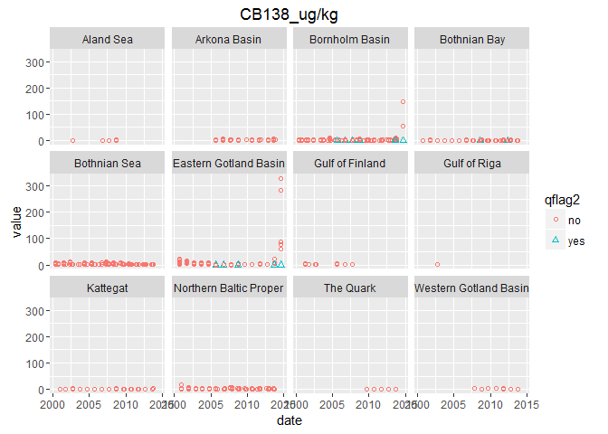

contaminants\_prep
================

``` r
## source common libraries, directories, functions, etc
# Libraries
library(readr)
```

    ## Warning: package 'readr' was built under R version 3.2.4

``` r
library(dplyr)
```

    ## 
    ## Attaching package: 'dplyr'

    ## The following objects are masked from 'package:stats':
    ## 
    ##     filter, lag

    ## The following objects are masked from 'package:base':
    ## 
    ##     intersect, setdiff, setequal, union

``` r
library(tidyr)
library(ggplot2)
```

    ## Warning: package 'ggplot2' was built under R version 3.2.4

``` r
library(RMySQL)
```

    ## Loading required package: DBI

``` r
library(stringr)
library(tools)
library(rprojroot) # install.packages('rprojroot')
```

    ## Warning: package 'rprojroot' was built under R version 3.2.4

``` r
## rprojroot
root <- rprojroot::is_rstudio_project


## make_path() function to 
make_path <- function(...) rprojroot::find_root_file(..., criterion = is_rstudio_project)

dir_layers = make_path('baltic2015/layers') # replaces  file.path(dir_baltic, 'layers')

source('~/github/bhi/baltic2015/prep/common.r')
dir_cw    = file.path(dir_prep, 'CW')
dir_con    = file.path(dir_prep, 'CW/contaminants')

## add a README.md to the prep directory with the rawgit.com url for viewing on GitHub
create_readme(dir_con, 'contaminants_prep.rmd')
```

Contaminant Data Prep
=====================

TABLE OF CONTENTS
-----------------

Section 1.......................Indicator Overview

Section 2.......................Data Overview

Section 3.......................Other Info

Section 4.......................ICES6 Indicator prep

Section 5.......................Dioxin Indicator prep

Section 6.......................PFOS Indicator prep

1 Indicators
------------

3 indicators are proposed, describing different aspects of toxicity, and then would be combined to give an overall contamimant sub-component status.

### 1.2 (1) PCB concentration indicator

#### 1.2.1 ICES-6 PCB

Non-dioxin like PCBs: sum of congeners (28, 52, 101, 138, 153, 180) 75 μg/kg ww fish muscle

This is similar to the ICES-7 except that PCB 118 is excluded (since it is metabolized by mammals).

75 ng/g wet weight is the [EU threshold for fish muscle. See Section 5 Annex, 5.3](http://eur-lex.europa.eu/LexUriServ/LexUriServ.do?uri=OJ:L:2011:320:0018:0023:EN:PDF). This threshold was also agreed upon as GES boundary at the most recent meeting of the [Working Group on the State of the Environment and Nature Conservation](http://helcom.fi/helcom-at-work/groups/state-and-conservation) April 11-15, 2016. *Recevied the draft report from Elisabeth Nyberg*

### 1.3 (2) TEQ value for PCBs and Dioxins

Dioxin and dioxin-like compounds:0.0065 TEQ ug /kg ww fish, crustaceans or molluscs (source of target:EQS biota human health). Secondary GES boundary: CB-118 24 μg/kg lw fish liver or muscle (source: EAC).

This threshold was agreed upon as GES indicator at the most recent meeting of the [Working Group on the State of the Environment and Nature Conservation](http://helcom.fi/helcom-at-work/groups/state-and-conservation) April 11-15, 2016. *Recevied the draft report from Elisabeth Nyberg*

Thisis consistent with the [EU human health thresholds for dioxin and dioxin-like compounds - 6.5 pg/g](http://eur-lex.europa.eu/LexUriServ/LexUriServ.do?uri=OJ:L:2011:320:0018:0023:EN:PDF)

TEQ values from the [World Health Organization 2005](http://www.who.int/ipcs/assessment/tef_values.pdf)

### 1.4 (3) PFOS indicator

[HELCOM PFOS core indicator document](http://www.helcom.fi/Core%20Indicators/PFOS_HELCOM%20core%20indicator%202016_web%20version.pdf)

### 1.5 Additional references

[Faxneld et al. 2014](http://www.diva-portal.org/smash/record.jsf?pid=diva2%3A728508&dswid=1554) Biological effects and environmental contaminants in herring and Baltic Sea top predators

[Bignert, A., Nyberg, E., Sundqvist, K.L., Wiberg, K., 2007. Spatial variation in concentrations and patterns of the PCDD/F and dioxin-like PCB content in herring from the northern Baltic Sea. J. Environ. Monit. 9, 550–556.](http://pubs.rsc.org/en/Content/ArticleLanding/2007/EM/b700667e#!divAbstract)

2. Data
-------

### 2.1 Data sources

#### 2.1.1 PCB data

**ICES** [ICES database](http://dome.ices.dk/views/ContaminantsBiota.aspx)
Downloaded 22 April 2016 by Jennifer Griffiths
Data selections:
Year - 1990-2014
Purpose of monitoring = All
Country = ALL
Monitoring Program = ALL
Parameter Group = Chlorobiophenyls
Reporting Laboratory = All
Analytical laboratory = All
Geographical Areas = (HELCOM) ALL HELCOM Sub-basins

#### 2.1.2 Dioxins

**ICES** [ICES database](http://dome.ices.dk/views/ContaminantsBiota.aspx)
Downloaded on 11 May 2016 by Jennifer Griffiths Selections:
Year - 1998-2015 (earliest allowed)
Purpose of monitoring = All
Country = ALL
MOnitoring Program = ALL
Parameter Group = Dioxins
Reporting Laboratory = All
Analytical laboratory = All
Geographical Areas = (HELCOM) ALL HELCOM Sub-basins

#### 2.1.3 PFOS

#### Other sources

IVL (Svenska Miljönstitutet / Swedish Environmental Research Institute)
[IVL database](http://dvsb.ivl.se/)
Downloaded 2 December 2015 by Cornelia Ludwig

### 2.2 Data prep prior to database

#### 2.2.1 PCB

Raw data from ICES were prepared in `~/github/bhi/baltic2015/prep/CW/contaminants/raw_contaminants_data_prep`
 - If duplicate measurements were made from the same sample, values were averaged (all were two measurement of LIPIDWT% per sample, all from 2014, Poland).
 - Data were standardized to the same unit ug/kg
 - If data were presented in lipid weight, they were converted to wet weight by: (EXLIP% / 100)\*(CB-conc lipid weight).

**Note**: Detection limit (detect\_lim) and Quantification limit (quant\_lim) values are in the original units. They are not standardized to ug/kg and not converted to wet weight if originally in lipid weight

3. Other Info
-------------

### 3.1 Congers in ICES database

#### 3.1.1 PCB Congeners

CB101 2 2' 4 5 5'-pentachlorobiphenyl
CB105 2 3 3' 4 4'-pentachlorobiphenyl
CB118 2 3' 4 4' 5-pentachlorobiphenyl
CB128 2 2' 3 3' 4 4'-hexachlorobiphenyl
CB138 2 2' 3 4 4' 5'-hexachlorobiphenyl
CB149 2 2' 3 4' 5' 6-hexachlorobiphenyl
CB153 2 2' 4 4' 5 5'-hexachlorobiphenyl
CB156 2 3 3' 4 4' 5-hexachlorobiphenyl
CB157 2 3 4 3' 4' 5'-hexachlorobiphenyl
CB167 2' 3 4 4' 5 5'-hexachlorobiphenyl
CB169 3 3' 4 4' 5 5'-hexachlorobiphenyl
CB170 2 2' 3 3' 4 4' 5-heptachlorobiphenyl
CB180 2 2' 3 4 4' 5 5'-heptachlorobiphenyl
CB28 2 4 4'-trichlorobiphenyl
CB52 2 2' 5 5'-tetrachlorobiphenyl
CB77 3 3' 4 4'-tetrachlorobiphenyl

#### 3.1.2 Dioxin Congeners

CDD1N 1 2 3 7 8-pentachlorodibenzo-p-dioxin
CDD4X 1 2 3 4 7 8-hexachlorodibenzo-p-dioxin
CDD6P 1 2 3 4 6 7 8-heptachlorodibenzo-p-dioxin
CDD6X 1 2 3 6 7 8-hexachlorodibenzo-p-dioxin
CDD9X 1 2 3 7 8 9-hexachlorodibenzo-p-dioxin
CDDO 1 2 3 4 6 7 8 9-octachlorodibenzo-p-dioxin
CDF2N 2 3 4 7 8-pentachlorodibenzofuran
CDF2T 2 3 7 8-tetrachloro-dibenzofuran
CDF4X 2 3 4 6 7 8-hexachlorodibenzofuran
CDF6P 1 2 3 4 6 7 8-heptachlorodibenzofuran
CDF6X 1 2 3 6 7 8-hexachlorodibenzofuran
CDF9P 1 2 3 4 7 8 9-heptachlorodibenzofuran
CDF9X 1 2 3 7 8 9-hexachlorodibenzofuran
CDFDN 1 2 3 7 8/1 2 3 4 8-pentachloro-dibenzofuran
CDFO octachloro-dibenzofuran (group)
TCDD 2 3 7 8-tetrachlorodibenzo-p-dioxin

4. Data Prep - PCB Indicator
----------------------------

### 4.1 Basic data cleaning and organization

#### 4.1.1 Read in PCB data

    ## [1] 16732    47

#### 4.1.2 Organize

Remove and rename columns, change column data types

``` r
str(pcb1)
```

    ## 'data.frame':    16732 obs. of  47 variables:
    ##  $ X                                   : int  1 2 3 4 5 6 7 8 9 10 ...
    ##  $ country                             : Factor w/ 5 levels "Finland","Germany",..: 1 1 1 1 1 1 1 1 1 1 ...
    ##  $ monit_program                       : Factor w/ 3 levels "CEMP~COMB","COMB",..: 2 2 2 2 2 2 2 2 2 2 ...
    ##  $ monit_purpose                       : Factor w/ 5 levels "","B~T~S","H",..: 1 1 1 1 1 1 1 1 1 1 ...
    ##  $ report_institute                    : Factor w/ 7 levels "ASLR","BFGG",..: 4 4 4 4 4 4 4 4 4 4 ...
    ##  $ station                             : Factor w/ 31 levels "","Abbekas","Aengskaersklubb",..: 1 1 1 1 1 1 1 1 1 1 ...
    ##  $ Latitude                            : num  64.2 64.2 64.2 64.2 64.2 ...
    ##  $ Longitude                           : num  23.3 23.3 23.3 23.3 23.3 ...
    ##  $ Date                                : Factor w/ 208 levels "2000-05-12","2000-05-15",..: 92 92 92 92 92 92 92 92 92 92 ...
    ##  $ monit_year                          : int  2008 2008 2008 2008 2008 2008 2008 2008 2008 2008 ...
    ##  $ date_ices                           : Factor w/ 208 levels "01/09/2008","01/09/2009",..: 33 33 33 33 33 33 33 33 33 33 ...
    ##  $ year                                : int  2008 2008 2008 2008 2008 2008 2008 2008 2008 2008 ...
    ##  $ species                             : Factor w/ 1 level "Clupea harengus": 1 1 1 1 1 1 1 1 1 1 ...
    ##  $ sub_samp_ref                        : int  3149743 3149743 3149743 3149743 3149743 3149743 3149743 3149744 3149744 3149744 ...
    ##  $ sub_samp_id                         : Factor w/ 1490 levels "1","10","1001",..: 457 457 457 457 457 457 457 458 458 458 ...
    ##  $ samp_id                             : int  1423609 1423609 1423609 1423609 1423609 1423609 1423609 1423610 1423610 1423610 ...
    ##  $ num_indiv_subsample                 : int  1 1 1 1 1 1 1 1 1 1 ...
    ##  $ bulk_id                             : logi  NA NA NA NA NA NA ...
    ##  $ basis_determination_originalcongener: Factor w/ 2 levels "lipid weight",..: 2 2 2 2 2 2 2 2 2 2 ...
    ##  $ basis_determination_converted       : Factor w/ 1 level "wet weight": 1 1 1 1 1 1 1 1 1 1 ...
    ##  $ AGMAX_y                             : logi  NA NA NA NA NA NA ...
    ##  $ AGMEA_y                             : int  NA NA NA NA NA NA NA NA NA NA ...
    ##  $ AGMIN_y                             : logi  NA NA NA NA NA NA ...
    ##  $ DRYWT._.                            : num  NA NA NA NA NA NA NA NA NA NA ...
    ##  $ EXLIP._.                            : num  NA NA NA NA NA NA NA NA NA NA ...
    ##  $ FATWT._.                            : num  NA NA NA NA NA NA NA NA NA NA ...
    ##  $ LIPIDWT._.                          : num  NA NA NA NA NA NA NA NA NA NA ...
    ##  $ LNMAX_cm                            : logi  NA NA NA NA NA NA ...
    ##  $ LNMEA_cm                            : num  NA NA NA NA NA NA NA NA NA NA ...
    ##  $ LNMIN_cm                            : logi  NA NA NA NA NA NA ...
    ##  $ WTMAX_g                             : logi  NA NA NA NA NA NA ...
    ##  $ WTMEA_g                             : num  NA NA NA NA NA NA NA NA NA NA ...
    ##  $ WTMIN_g                             : logi  NA NA NA NA NA NA ...
    ##  $ qflag                               : Factor w/ 5 levels "","<","<~D","D",..: 1 1 1 1 1 2 2 1 1 1 ...
    ##  $ detect_lim                          : num  NA NA NA NA NA NA NA NA NA NA ...
    ##  $ quant_lim                           : num  NA NA NA NA NA 0.04 0.04 NA NA NA ...
    ##  $ uncert_val                          : num  NA NA NA NA NA NA NA NA NA NA ...
    ##  $ method_uncert                       : Factor w/ 3 levels "","%","U2": 1 1 1 1 1 1 1 1 1 1 ...
    ##  $ congener                            : Factor w/ 16 levels "CB101_ug/kg",..: 1 3 5 7 13 14 15 1 3 5 ...
    ##  $ value                               : num  0.3 0.27 0.66 0.84 0.3 0.04 0.04 0.18 0.25 0.61 ...
    ##  $ Month                               : int  8 8 8 8 8 8 8 8 8 8 ...
    ##  $ Day                                 : int  6 6 6 6 6 6 6 6 6 6 ...
    ##  $ DoY                                 : int  219 219 219 219 219 219 219 219 219 219 ...
    ##  $ BHI_ID                              : int  42 42 42 42 42 42 42 42 42 42 ...
    ##  $ HELCOM_ID                           : Factor w/ 12 levels "SEA-001","SEA-006",..: 12 12 12 12 12 12 12 12 12 12 ...
    ##  $ HELCOM_COASTAL_CODE                 : int  0 0 0 0 0 0 0 0 0 0 ...
    ##  $ ICES_AREA                           : Factor w/ 10 levels "24","25","26",..: 8 8 8 8 8 8 8 8 8 8 ...

``` r
#format date as date
pcb2 = pcb1 %>% 
      dplyr::rename(date=Date, lat=Latitude, lon= Longitude, 
                    month=Month, day=Day, doy=DoY,
                    bhi_id = BHI_ID, helcom_id=HELCOM_ID, 
                    helcom_coastal_code=HELCOM_COASTAL_CODE, ices_area = ICES_AREA,
                    agmax_y = AGMAX_y, agmea_y=AGMEA_y, agmin_y = AGMIN_y,
                    drywt_percent = DRYWT._., exlip_percent = EXLIP._.,fatwt_percent=FATWT._.,
                    lipidwt_percent = LIPIDWT._., lnmax_cm = LNMAX_cm,
                    lnmea_cm=LNMEA_cm, lnmin_cm=LNMIN_cm, wtmax_g=WTMAX_g, wtmea_g=WTMEA_g,
                    wtmin_g=WTMIN_g) %>% # rename columns
      select(-date_ices, -X) %>% #remove columns not needed
      mutate(date =as.Date(date,"%Y-%m-%d"),
             sub_samp_id= as.character(sub_samp_id)) %>%
      select(country:lon,bhi_id:ices_area,date:year,month:doy,species:value)## reorder columns

head(pcb2)
```

    ##   country monit_program monit_purpose report_institute station      lat
    ## 1 Finland          COMB                           FEIF         64.17917
    ## 2 Finland          COMB                           FEIF         64.17917
    ## 3 Finland          COMB                           FEIF         64.17917
    ## 4 Finland          COMB                           FEIF         64.17917
    ## 5 Finland          COMB                           FEIF         64.17917
    ## 6 Finland          COMB                           FEIF         64.17917
    ##       lon bhi_id helcom_id helcom_coastal_code ices_area       date
    ## 1 23.3265     42   SEA-017                   0        31 2008-08-06
    ## 2 23.3265     42   SEA-017                   0        31 2008-08-06
    ## 3 23.3265     42   SEA-017                   0        31 2008-08-06
    ## 4 23.3265     42   SEA-017                   0        31 2008-08-06
    ## 5 23.3265     42   SEA-017                   0        31 2008-08-06
    ## 6 23.3265     42   SEA-017                   0        31 2008-08-06
    ##   monit_year year month day doy         species sub_samp_ref sub_samp_id
    ## 1       2008 2008     8   6 219 Clupea harengus      3149743       34000
    ## 2       2008 2008     8   6 219 Clupea harengus      3149743       34000
    ## 3       2008 2008     8   6 219 Clupea harengus      3149743       34000
    ## 4       2008 2008     8   6 219 Clupea harengus      3149743       34000
    ## 5       2008 2008     8   6 219 Clupea harengus      3149743       34000
    ## 6       2008 2008     8   6 219 Clupea harengus      3149743       34000
    ##   samp_id num_indiv_subsample bulk_id basis_determination_originalcongener
    ## 1 1423609                   1      NA                           wet weight
    ## 2 1423609                   1      NA                           wet weight
    ## 3 1423609                   1      NA                           wet weight
    ## 4 1423609                   1      NA                           wet weight
    ## 5 1423609                   1      NA                           wet weight
    ## 6 1423609                   1      NA                           wet weight
    ##   basis_determination_converted agmax_y agmea_y agmin_y drywt_percent
    ## 1                    wet weight      NA      NA      NA            NA
    ## 2                    wet weight      NA      NA      NA            NA
    ## 3                    wet weight      NA      NA      NA            NA
    ## 4                    wet weight      NA      NA      NA            NA
    ## 5                    wet weight      NA      NA      NA            NA
    ## 6                    wet weight      NA      NA      NA            NA
    ##   exlip_percent fatwt_percent lipidwt_percent lnmax_cm lnmea_cm lnmin_cm
    ## 1            NA            NA              NA       NA       NA       NA
    ## 2            NA            NA              NA       NA       NA       NA
    ## 3            NA            NA              NA       NA       NA       NA
    ## 4            NA            NA              NA       NA       NA       NA
    ## 5            NA            NA              NA       NA       NA       NA
    ## 6            NA            NA              NA       NA       NA       NA
    ##   wtmax_g wtmea_g wtmin_g qflag detect_lim quant_lim uncert_val
    ## 1      NA      NA      NA               NA        NA         NA
    ## 2      NA      NA      NA               NA        NA         NA
    ## 3      NA      NA      NA               NA        NA         NA
    ## 4      NA      NA      NA               NA        NA         NA
    ## 5      NA      NA      NA               NA        NA         NA
    ## 6      NA      NA      NA     <         NA      0.04         NA
    ##   method_uncert    congener value
    ## 1               CB101_ug/kg  0.30
    ## 2               CB118_ug/kg  0.27
    ## 3               CB138_ug/kg  0.66
    ## 4               CB153_ug/kg  0.84
    ## 5               CB180_ug/kg  0.30
    ## 6                CB28_ug/kg  0.04

#### 4.1.3 Plot data

Explore raw data. **Why are there unassigned BHI regions?**

``` r
ggplot(pcb2) + geom_point(aes(date,value, colour=congener)) +
  facet_wrap(~bhi_id)
```

<!-- -->

#### 4.1.4 Filter for ICES 6 PCBs

``` r
ices6pcb = c("CB28_ug/kg", "CB52_ug/kg", "CB101_ug/kg", "CB138_ug/kg",
            "CB153_ug/kg", "CB180_ug/kg")
  
pcb3 = pcb2 %>% 
        filter(congener %in% ices6pcb)

dim(pcb3); dim(pcb2)
```

    ## [1] 13106    45

    ## [1] 16732    45

#### 4.1.5 Plot data -ICES 6 pcbs

``` r
ggplot(pcb3) + geom_point(aes(date,value, colour=congener)) +
  facet_wrap(~bhi_id)
```

<!-- -->

#### 4.1.6 Stations with No BHI ID

Why were some data not assigned a BHI ID (through script in BHI database).
Will check with Marc, might be because very near coast and BHI regions don't extend?

``` r
## which stations have no BHI ID assigned
pcb3 %>% filter(is.na(bhi_id)) %>% select(country,station, lat, lon) %>% distinct(.)
```

    ##   country            station     lat     lon
    ## 1  Sweden     Gaviksfjaerden 62.8645 18.2412
    ## 2  Sweden Kinnbaecksfjaerden 65.0568 21.4750
    ## 3  Sweden  Langvindsfjaerden 61.4554 17.1622

``` r
##country            station     lat     lon
##1  Sweden     Gaviksfjaerden 62.8645 18.2412
##2  Sweden Kinnbaecksfjaerden 65.0568 21.4750
##3  Sweden  Langvindsfjaerden 61.4554 17.1622
```

#### 4.1.7 Manually assign BHI to stations missing

``` r
##Gaviksfjaerden is BHI region 37
##Kinnbaecksfjaerden is BHI region 41
##Langvindsfjaerden is BHI region 37

pcb4 = pcb3 %>%
      mutate(bhi_id = ifelse(station=="Gaviksfjaerden",37,
                      ifelse(station=="Kinnbaecksfjaerden", 41,
                      ifelse(station=="Langvindsfjaerden",37,bhi_id))))
pcb4 %>% filter(is.na(bhi_id)) %>% select(country,station, lat, lon) %>% distinct(.)
```

    ## [1] country station lat     lon    
    ## <0 rows> (or 0-length row.names)

``` r
##plot again
ggplot(pcb4) + geom_point(aes(date,value, colour=congener)) +
  facet_wrap(~bhi_id)
```

<!-- -->

#### 4.1.8 Join to HOLAS basins and evaluate data coverage

``` r
pcb5 = full_join(select(lookup_basins, rgn_id, basin_name), pcb4, by= c("rgn_id"="bhi_id"))
head(pcb5)
```

    ##   rgn_id basin_name country monit_program monit_purpose report_institute
    ## 1      1   Kattegat  Sweden     CEMP~COMB             T             SERI
    ## 2      1   Kattegat  Sweden     CEMP~COMB             T             SERI
    ## 3      1   Kattegat  Sweden     CEMP~COMB             T             SERI
    ## 4      1   Kattegat  Sweden     CEMP~COMB             T             SERI
    ## 5      1   Kattegat  Sweden     CEMP~COMB             T             SERI
    ## 6      1   Kattegat  Sweden     CEMP~COMB             T             SERI
    ##      station     lat    lon helcom_id helcom_coastal_code ices_area
    ## 1 E/W FLADEN 57.2247 11.828   SEA-001                   0      IIIa
    ## 2 E/W FLADEN 57.2247 11.828   SEA-001                   0      IIIa
    ## 3 E/W FLADEN 57.2247 11.828   SEA-001                   0      IIIa
    ## 4 E/W FLADEN 57.2247 11.828   SEA-001                   0      IIIa
    ## 5 E/W FLADEN 57.2247 11.828   SEA-001                   0      IIIa
    ## 6 E/W FLADEN 57.2247 11.828   SEA-001                   0      IIIa
    ##         date monit_year year month day doy         species sub_samp_ref
    ## 1 2000-12-08       2000 2000    12   8 343 Clupea harengus      3580025
    ## 2 2000-12-08       2000 2000    12   8 343 Clupea harengus      3580025
    ## 3 2000-12-08       2000 2000    12   8 343 Clupea harengus      3580025
    ## 4 2000-12-08       2000 2000    12   8 343 Clupea harengus      3580025
    ## 5 2000-12-08       2000 2000    12   8 343 Clupea harengus      3580025
    ## 6 2000-12-08       2000 2000    12   8 343 Clupea harengus      3580025
    ##   sub_samp_id samp_id num_indiv_subsample bulk_id
    ## 1        6166 1741386                   1      NA
    ## 2        6166 1741386                   1      NA
    ## 3        6166 1741386                   1      NA
    ## 4        6166 1741386                   1      NA
    ## 5        6166 1741386                   1      NA
    ## 6        6166 1741386                   1      NA
    ##   basis_determination_originalcongener basis_determination_converted
    ## 1                         lipid weight                    wet weight
    ## 2                         lipid weight                    wet weight
    ## 3                         lipid weight                    wet weight
    ## 4                         lipid weight                    wet weight
    ## 5                         lipid weight                    wet weight
    ## 6                         lipid weight                    wet weight
    ##   agmax_y agmea_y agmin_y drywt_percent exlip_percent fatwt_percent
    ## 1      NA       2      NA          26.5           3.5            NA
    ## 2      NA       2      NA          26.5           3.5            NA
    ## 3      NA       2      NA          26.5           3.5            NA
    ## 4      NA       2      NA          26.5           3.5            NA
    ## 5      NA       2      NA          26.5           3.5            NA
    ## 6      NA       2      NA          26.5           3.5            NA
    ##   lipidwt_percent lnmax_cm lnmea_cm lnmin_cm wtmax_g wtmea_g wtmin_g qflag
    ## 1              NA       NA     18.7       NA      NA    44.3      NA      
    ## 2              NA       NA     18.7       NA      NA    44.3      NA      
    ## 3              NA       NA     18.7       NA      NA    44.3      NA      
    ## 4              NA       NA     18.7       NA      NA    44.3      NA     D
    ## 5              NA       NA     18.7       NA      NA    44.3      NA     D
    ## 6              NA       NA     18.7       NA      NA    44.3      NA      
    ##   detect_lim quant_lim uncert_val method_uncert    congener  value
    ## 1        4.0        NA         NA               CB101_ug/kg 0.5775
    ## 2        6.0        NA         NA               CB138_ug/kg 1.0745
    ## 3        5.0        NA         NA               CB153_ug/kg 1.3300
    ## 4        5.1        NA         NA               CB180_ug/kg 0.1785
    ## 5        4.3        NA         NA                CB28_ug/kg 0.1505
    ## 6        4.0        NA         NA                CB52_ug/kg 0.2345

#### 4.1.9 Plot by basin

``` r
ggplot(pcb5) + geom_point(aes(date,value, colour=congener)) +
  facet_wrap(~basin_name)
```

    ## Warning: Removed 24 rows containing missing values (geom_point).

<!-- -->

### 4.2 Evaluate sites sampled

What are the site representing: baseline/reference conditions or local impact.

#### 4.2.1 Join PCB sites, station dictionary, and impact codes

Some sites have had the site type recorded in the ICES station dictionary (see below). It is important to know which sites are catagorized as:
 1. *RH* = WFD R(HZ) - Representative of general conditions in terms of hazardous substances
 2. *B* = WFD B - Baseline/Reference station
 3. Any of the codes containing "I" (IH, IH-A, IH-C, IH-D, IH-E, IH-F, IH-H, IH-I, IH-M, IH-O, IH-P, IH-S, IH-W, IP, IP-B, IP-N, IP-T) which refers to a specific type of impact at the site.

It appears that *only Swedish sites have this information entered* (see below), Most are RH (19), while B (4) and RP (1). RP = WFD R(PHY) Representative of general conditions for nutrients/organic matter.

**Sites to Include/Exclude**
Given only Swedish sites have this information recorded, seems difficult to use this information to include or exclude sites.

``` r
pcb_sites = pcb5 %>% 
            select(country, station,basin_name,lat,lon,rgn_id) %>%
            filter(!is.na(station)) %>%  ## These are NA because when joined to BHI regions, were no station
            mutate(station2 = tolower(station)) %>% ## station name all lower case to join with station_dictionary
            distinct(.)
pcb_sites
```

    ##    country             station             basin_name      lat      lon
    ## 1   Sweden          E/W FLADEN               Kattegat 57.22470 11.82800
    ## 2   Sweden              Kullen               Kattegat 56.32510 12.38110
    ## 3   Sweden             Abbekas           Arkona Basin 55.31630 13.61100
    ## 4  Germany             FOE-B11           Arkona Basin 55.07967 13.25017
    ## 5  Germany             FOE-B11           Arkona Basin 55.08567 13.82617
    ## 6  Germany             FOE-B10           Arkona Basin 54.84183 14.04083
    ## 7  Germany             FOE-B11           Arkona Basin 54.76767 13.94167
    ## 8  Germany             FOE-B11           Arkona Basin 54.69133 13.81733
    ## 9  Germany             FOE-B11           Arkona Basin 54.74217 13.92283
    ## 10 Germany             FOE-BMP           Arkona Basin 54.74400 13.92583
    ## 11 Germany             FOE-BMP           Arkona Basin 54.68467 13.94917
    ## 12  Sweden           Utlaengan         Bornholm Basin 55.94910 15.78100
    ## 13  Sweden Vaestra Hanoebukten         Bornholm Basin 55.75070 14.28330
    ## 14 Germany             FOE-B11         Bornholm Basin 55.00733 17.43333
    ## 15  Poland                LKOL         Bornholm Basin 54.91667 16.66667
    ## 16  Poland                LWLA  Eastern Gotland Basin 54.91667 18.66667
    ## 17  Sweden           Byxelkrok  Western Gotland Basin 57.31670 17.50000
    ## 18  Latvia        Gulf of Riga           Gulf of Riga 57.41667 23.76667
    ## 19  Sweden            Landsort Northern Baltic Proper 58.69360 18.00430
    ## 20 Finland                     Northern Baltic Proper 59.54750 22.60533
    ## 21 Finland                LL12 Northern Baltic Proper 59.46667 22.25000
    ## 22 Finland                LL12 Northern Baltic Proper 59.58333 22.30000
    ## 23 Finland                LL11        Gulf of Finland 59.71667 23.33333
    ## 24 Finland                LL11        Gulf of Finland 59.63333 23.75000
    ## 25 Finland                LL11        Gulf of Finland 59.76667 23.86667
    ## 26 Finland                LL3A        Gulf of Finland 60.33333 26.15000
    ## 27 Finland                LL3A        Gulf of Finland 60.36667 26.81667
    ## 28 Finland                LL3A        Gulf of Finland 60.38333 26.71667
    ## 29 Finland                LL3A        Gulf of Finland 60.35000 26.75000
    ## 30 Finland                LL3A        Gulf of Finland 60.51867 27.13833
    ## 31  Sweden              Lagnoe              Aland Sea 59.56520 18.83480
    ## 32 Finland                                  Aland Sea 59.87983 19.95800
    ## 33 Finland                 F64              Aland Sea 60.18333 19.46667
    ## 34 Finland                 F67              Aland Sea 59.95000 20.11667
    ## 35 Finland                 F67              Aland Sea 59.97267 20.08617
    ## 36 Finland                LL12              Aland Sea 59.93333 22.21667
    ## 37  Sweden     Aengskaersklubb           Bothnian Sea 60.53260 18.16240
    ## 38  Sweden      Gaviksfjaerden           Bothnian Sea 62.86450 18.24120
    ## 39  Sweden   Langvindsfjaerden           Bothnian Sea 61.45540 17.16220
    ## 40 Finland                               Bothnian Sea 61.71083 20.70750
    ## 41 Finland                MS10           Bothnian Sea 61.60000 20.83333
    ## 42 Finland                MS10           Bothnian Sea 61.75000 20.50000
    ## 43 Finland                MS10           Bothnian Sea 61.86667 20.75000
    ## 44 Finland                MS10           Bothnian Sea 61.61667 20.81667
    ## 45 Finland                MS10           Bothnian Sea 61.66667 20.66667
    ## 46  Sweden          Holmoearna              The Quark 63.68080 20.87680
    ## 47  Sweden        Harufjaerden           Bothnian Bay 65.58250 22.87910
    ## 48  Sweden  Kinnbaecksfjaerden           Bothnian Bay 65.05680 21.47500
    ## 49  Sweden        Ranefjaerden           Bothnian Bay 65.75550 22.41810
    ## 50 Finland                               Bothnian Bay 64.17917 23.32650
    ## 51 Finland                  F2           Bothnian Bay 65.15000 25.16667
    ## 52 Finland                 RR8           Bothnian Bay 64.30000 23.10833
    ## 53 Finland                 RR8           Bothnian Bay 64.15000 23.25833
    ## 54 Finland                 RR8           Bothnian Bay 64.13333 23.25000
    ## 55 Finland                 RR9           Bothnian Bay 64.13333 23.25000
    ##    rgn_id            station2
    ## 1       1          e/w fladen
    ## 2       1              kullen
    ## 3      11             abbekas
    ## 4      11             foe-b11
    ## 5      11             foe-b11
    ## 6      13             foe-b10
    ## 7      13             foe-b11
    ## 8      13             foe-b11
    ## 9      13             foe-b11
    ## 10     13             foe-bmp
    ## 11     13             foe-bmp
    ## 12     14           utlaengan
    ## 13     14 vaestra hanoebukten
    ## 14     17             foe-b11
    ## 15     17                lkol
    ## 16     21                lwla
    ## 17     26           byxelkrok
    ## 18     27        gulf of riga
    ## 19     29            landsort
    ## 20     30                    
    ## 21     30                ll12
    ## 22     30                ll12
    ## 23     32                ll11
    ## 24     32                ll11
    ## 25     32                ll11
    ## 26     32                ll3a
    ## 27     32                ll3a
    ## 28     32                ll3a
    ## 29     32                ll3a
    ## 30     32                ll3a
    ## 31     35              lagnoe
    ## 32     36                    
    ## 33     36                 f64
    ## 34     36                 f67
    ## 35     36                 f67
    ## 36     36                ll12
    ## 37     37     aengskaersklubb
    ## 38     37      gaviksfjaerden
    ## 39     37   langvindsfjaerden
    ## 40     38                    
    ## 41     38                ms10
    ## 42     38                ms10
    ## 43     38                ms10
    ## 44     38                ms10
    ## 45     38                ms10
    ## 46     39          holmoearna
    ## 47     41        harufjaerden
    ## 48     41  kinnbaecksfjaerden
    ## 49     41        ranefjaerden
    ## 50     42                    
    ## 51     42                  f2
    ## 52     42                 rr8
    ## 53     42                 rr8
    ## 54     42                 rr8
    ## 55     42                 rr9

``` r
dim(pcb_sites) #[1] 55  7
```

    ## [1] 55  7

``` r
## clean lookup table
lookup_impact = lookup_impact %>%
                mutate(Station_Name2 = as.character(Station_Name2))


## join with station dictionary

pcb_sites = pcb_sites %>% left_join(., lookup_impact, by=c("station2"="Station_Name2", "country"="Country"))
```

    ## Warning in left_join_impl(x, y, by$x, by$y): joining factors with different
    ## levels, coercing to character vector

``` r
dim(pcb_sites) # 55 26
```

    ## [1] 55 27

``` r
pcb_sites %>% select(country, station, basin_name, lat, lon, rgn_id,MSTAT,All_Biota_Data:impact_I) %>% arrange(impact_RH, impact_B, impact_I)
```

    ##    country             station             basin_name      lat      lon
    ## 1   Sweden          E/W FLADEN               Kattegat 57.22470 11.82800
    ## 2  Germany             FOE-B11           Arkona Basin 55.07967 13.25017
    ## 3  Germany             FOE-B11           Arkona Basin 55.08567 13.82617
    ## 4  Germany             FOE-B10           Arkona Basin 54.84183 14.04083
    ## 5  Germany             FOE-B11           Arkona Basin 54.76767 13.94167
    ## 6  Germany             FOE-B11           Arkona Basin 54.69133 13.81733
    ## 7  Germany             FOE-B11           Arkona Basin 54.74217 13.92283
    ## 8  Germany             FOE-BMP           Arkona Basin 54.74400 13.92583
    ## 9  Germany             FOE-BMP           Arkona Basin 54.68467 13.94917
    ## 10  Sweden           Utlaengan         Bornholm Basin 55.94910 15.78100
    ## 11 Germany             FOE-B11         Bornholm Basin 55.00733 17.43333
    ## 12  Sweden            Landsort Northern Baltic Proper 58.69360 18.00430
    ## 13  Sweden              Lagnoe              Aland Sea 59.56520 18.83480
    ## 14  Sweden     Aengskaersklubb           Bothnian Sea 60.53260 18.16240
    ## 15  Sweden      Gaviksfjaerden           Bothnian Sea 62.86450 18.24120
    ## 16  Sweden   Langvindsfjaerden           Bothnian Sea 61.45540 17.16220
    ## 17  Sweden          Holmoearna              The Quark 63.68080 20.87680
    ## 18  Sweden        Harufjaerden           Bothnian Bay 65.58250 22.87910
    ## 19  Sweden        Ranefjaerden           Bothnian Bay 65.75550 22.41810
    ## 20  Sweden             Abbekas           Arkona Basin 55.31630 13.61100
    ## 21  Sweden Vaestra Hanoebukten         Bornholm Basin 55.75070 14.28330
    ## 22  Sweden           Byxelkrok  Western Gotland Basin 57.31670 17.50000
    ## 23  Sweden  Kinnbaecksfjaerden           Bothnian Bay 65.05680 21.47500
    ## 24  Sweden              Kullen               Kattegat 56.32510 12.38110
    ## 25  Poland                LKOL         Bornholm Basin 54.91667 16.66667
    ## 26  Poland                LWLA  Eastern Gotland Basin 54.91667 18.66667
    ## 27  Latvia        Gulf of Riga           Gulf of Riga 57.41667 23.76667
    ## 28 Finland                     Northern Baltic Proper 59.54750 22.60533
    ## 29 Finland                LL12 Northern Baltic Proper 59.46667 22.25000
    ## 30 Finland                LL12 Northern Baltic Proper 59.58333 22.30000
    ## 31 Finland                LL11        Gulf of Finland 59.71667 23.33333
    ## 32 Finland                LL11        Gulf of Finland 59.63333 23.75000
    ## 33 Finland                LL11        Gulf of Finland 59.76667 23.86667
    ## 34 Finland                LL3A        Gulf of Finland 60.33333 26.15000
    ## 35 Finland                LL3A        Gulf of Finland 60.36667 26.81667
    ## 36 Finland                LL3A        Gulf of Finland 60.38333 26.71667
    ## 37 Finland                LL3A        Gulf of Finland 60.35000 26.75000
    ## 38 Finland                LL3A        Gulf of Finland 60.51867 27.13833
    ## 39 Finland                                  Aland Sea 59.87983 19.95800
    ## 40 Finland                 F64              Aland Sea 60.18333 19.46667
    ## 41 Finland                 F67              Aland Sea 59.95000 20.11667
    ## 42 Finland                 F67              Aland Sea 59.97267 20.08617
    ## 43 Finland                LL12              Aland Sea 59.93333 22.21667
    ## 44 Finland                               Bothnian Sea 61.71083 20.70750
    ## 45 Finland                MS10           Bothnian Sea 61.60000 20.83333
    ## 46 Finland                MS10           Bothnian Sea 61.75000 20.50000
    ## 47 Finland                MS10           Bothnian Sea 61.86667 20.75000
    ## 48 Finland                MS10           Bothnian Sea 61.61667 20.81667
    ## 49 Finland                MS10           Bothnian Sea 61.66667 20.66667
    ## 50 Finland                               Bothnian Bay 64.17917 23.32650
    ## 51 Finland                  F2           Bothnian Bay 65.15000 25.16667
    ## 52 Finland                 RR8           Bothnian Bay 64.30000 23.10833
    ## 53 Finland                 RR8           Bothnian Bay 64.15000 23.25833
    ## 54 Finland                 RR8           Bothnian Bay 64.13333 23.25000
    ## 55 Finland                 RR9           Bothnian Bay 64.13333 23.25000
    ##    rgn_id MSTAT All_Biota_Data Contaminant_parameters_in_biota impact_RH
    ## 1       1    RH          FALSE                            TRUE         1
    ## 2      11    RH          FALSE                            TRUE         1
    ## 3      11    RH          FALSE                            TRUE         1
    ## 4      13    RH          FALSE                            TRUE         1
    ## 5      13    RH          FALSE                            TRUE         1
    ## 6      13    RH          FALSE                            TRUE         1
    ## 7      13    RH          FALSE                            TRUE         1
    ## 8      13    RH          FALSE                            TRUE         1
    ## 9      13    RH          FALSE                            TRUE         1
    ## 10     14    RH          FALSE                            TRUE         1
    ## 11     17    RH          FALSE                            TRUE         1
    ## 12     29    RH          FALSE                            TRUE         1
    ## 13     35    RH          FALSE                            TRUE         1
    ## 14     37    RH          FALSE                            TRUE         1
    ## 15     37    RH          FALSE                            TRUE         1
    ## 16     37    RH          FALSE                            TRUE         1
    ## 17     39    RH          FALSE                            TRUE         1
    ## 18     41    RH          FALSE                            TRUE         1
    ## 19     41    RH          FALSE                            TRUE         1
    ## 20     11     B          FALSE                           FALSE        NA
    ## 21     14     B          FALSE                           FALSE        NA
    ## 22     26     B          FALSE                           FALSE        NA
    ## 23     41     B          FALSE                           FALSE        NA
    ## 24      1    RP          FALSE                           FALSE        NA
    ## 25     17                FALSE                            TRUE        NA
    ## 26     21                FALSE                            TRUE        NA
    ## 27     27  <NA>             NA                              NA        NA
    ## 28     30  <NA>             NA                              NA        NA
    ## 29     30                FALSE                           FALSE        NA
    ## 30     30                FALSE                           FALSE        NA
    ## 31     32                FALSE                           FALSE        NA
    ## 32     32                FALSE                           FALSE        NA
    ## 33     32                FALSE                           FALSE        NA
    ## 34     32                FALSE                           FALSE        NA
    ## 35     32                FALSE                           FALSE        NA
    ## 36     32                FALSE                           FALSE        NA
    ## 37     32                FALSE                           FALSE        NA
    ## 38     32                FALSE                           FALSE        NA
    ## 39     36  <NA>             NA                              NA        NA
    ## 40     36                FALSE                           FALSE        NA
    ## 41     36  <NA>             NA                              NA        NA
    ## 42     36  <NA>             NA                              NA        NA
    ## 43     36                FALSE                           FALSE        NA
    ## 44     38  <NA>             NA                              NA        NA
    ## 45     38                FALSE                           FALSE        NA
    ## 46     38                FALSE                           FALSE        NA
    ## 47     38                FALSE                           FALSE        NA
    ## 48     38                FALSE                           FALSE        NA
    ## 49     38                FALSE                           FALSE        NA
    ## 50     42  <NA>             NA                              NA        NA
    ## 51     42                FALSE                           FALSE        NA
    ## 52     42                FALSE                           FALSE        NA
    ## 53     42                FALSE                           FALSE        NA
    ## 54     42                FALSE                           FALSE        NA
    ## 55     42  <NA>             NA                              NA        NA
    ##    impact_B impact_I
    ## 1        NA       NA
    ## 2        NA       NA
    ## 3        NA       NA
    ## 4        NA       NA
    ## 5        NA       NA
    ## 6        NA       NA
    ## 7        NA       NA
    ## 8        NA       NA
    ## 9        NA       NA
    ## 10       NA       NA
    ## 11       NA       NA
    ## 12       NA       NA
    ## 13       NA       NA
    ## 14       NA       NA
    ## 15       NA       NA
    ## 16       NA       NA
    ## 17       NA       NA
    ## 18       NA       NA
    ## 19       NA       NA
    ## 20        1       NA
    ## 21        1       NA
    ## 22        1       NA
    ## 23        1       NA
    ## 24       NA       NA
    ## 25       NA       NA
    ## 26       NA       NA
    ## 27       NA       NA
    ## 28       NA       NA
    ## 29       NA       NA
    ## 30       NA       NA
    ## 31       NA       NA
    ## 32       NA       NA
    ## 33       NA       NA
    ## 34       NA       NA
    ## 35       NA       NA
    ## 36       NA       NA
    ## 37       NA       NA
    ## 38       NA       NA
    ## 39       NA       NA
    ## 40       NA       NA
    ## 41       NA       NA
    ## 42       NA       NA
    ## 43       NA       NA
    ## 44       NA       NA
    ## 45       NA       NA
    ## 46       NA       NA
    ## 47       NA       NA
    ## 48       NA       NA
    ## 49       NA       NA
    ## 50       NA       NA
    ## 51       NA       NA
    ## 52       NA       NA
    ## 53       NA       NA
    ## 54       NA       NA
    ## 55       NA       NA

``` r
## many sites do not have purpose entered in ICES
## the Finnish sites with no station name could then not be found in the impact lookup
## Many of the sites have "FALSE" under 'Contaminant_parameters_in_biota'
## These sites are also "FALSE" under All_Biota_data 

## from the station dictionary definitions:
## All_Biota_Data: Data type (DTYPE) CF - all parameters - contaminants and biological effects of contaminants including disease in biota
##Contaminant_parameters_in_biota: Data type (DTYPE) CF - Contaminant parameter groups
```

### 4.3 Data flagged for quality

#### 4.3.1 Evaluate data with Qflags

Codes:
**&lt;** = less than

**&gt;** = greather than

**D** = reported value is less than the detection limit (detli)

**Q** = reported value is less than the limit of quantification (lmqnt)

**~** separates multiple flags

No information is given for what **&lt;** implies when is it is used alone (e.g. is it related to the detection limit?) **Values for detect\_lim and quant\_lim**: Remember these are in the original units (not standardized to ug\_kg or to wet weight)

``` r
## what qflags are present
pcb5 %>% select(qflag) %>% distinct(.) 
```

    ##   qflag
    ## 1      
    ## 2     D
    ## 3  <NA>
    ## 4     <
    ## 5     Q
    ## 6   <~D

``` r
##1      
##2     D
##3  <NA>
##4     <
##5     Q
##6   <~D


## "~"  separates multiple flags

## which entries use '<'
pcb5 %>% 
  filter(.,grepl('<', qflag)) %>% select(country,station,date,sub_samp_ref,qflag,detect_lim,congener,value) %>% head()
```

    ##   country station       date sub_samp_ref qflag detect_lim    congener
    ## 1  Poland    LKOL 2004-09-08      2204078     <       0.01 CB180_ug/kg
    ## 2  Poland    LKOL 2004-09-08      2204084     <       0.01 CB180_ug/kg
    ## 3  Poland    LKOL 2004-09-08      2204085     <       0.01 CB180_ug/kg
    ## 4  Poland    LKOL 2005-09-07      2204013     <       0.01 CB101_ug/kg
    ## 5  Poland    LKOL 2005-09-07      2204013     <       0.01 CB138_ug/kg
    ## 6  Poland    LKOL 2005-09-07      2204013     <       0.01 CB153_ug/kg
    ##   value
    ## 1  0.01
    ## 2  0.19
    ## 3  0.01
    ## 4  0.01
    ## 5  0.01
    ## 6  0.01

``` r
## appears to be variable usage of '<', values are not always provided for detect_lim when used, values of detect_lim are in original units so are not always comparable to the value column

## which entries use "D"
pcb5 %>% 
  filter(.,grepl('D', qflag)) %>%
select(country,station,date,sub_samp_ref,qflag,detect_lim,congener,value) %>% head()
```

    ##   country    station       date sub_samp_ref qflag detect_lim    congener
    ## 1  Sweden E/W FLADEN 2000-12-08      3580025     D        5.1 CB180_ug/kg
    ## 2  Sweden E/W FLADEN 2000-12-08      3580025     D        4.3  CB28_ug/kg
    ## 3  Sweden E/W FLADEN 2000-12-08      3580028     D        3.6  CB28_ug/kg
    ## 4  Sweden E/W FLADEN 2000-12-08      3580029     D        3.3  CB28_ug/kg
    ## 5  Sweden E/W FLADEN 2000-12-08      3580030     D        4.2  CB28_ug/kg
    ## 6  Sweden E/W FLADEN 2000-12-08      3580033     D        4.1  CB28_ug/kg
    ##     value
    ## 1 0.17850
    ## 2 0.15050
    ## 3 0.11088
    ## 4 0.10890
    ## 5 0.14826
    ## 6 0.14965

#### 4.3.2 New qflag column

Create second qflag column with "yes" if any symbol used to flag the data, and "no" if not

``` r
pcb6 = pcb5 %>%
      mutate(qflag = as.character(qflag))%>%
      mutate(qflag2 = ifelse(qflag == "", "no",
                      ifelse(qflag== "D", "yes",
                      ifelse(qflag== "<", "yes",
                      ifelse(qflag== "Q", "yes",
                      ifelse(qflag=="<~D", "yes", "")))))) %>%
      mutate(qflag2 = replace(qflag2, is.na(qflag2),"no"))
head(pcb6)
```

    ##   rgn_id basin_name country monit_program monit_purpose report_institute
    ## 1      1   Kattegat  Sweden     CEMP~COMB             T             SERI
    ## 2      1   Kattegat  Sweden     CEMP~COMB             T             SERI
    ## 3      1   Kattegat  Sweden     CEMP~COMB             T             SERI
    ## 4      1   Kattegat  Sweden     CEMP~COMB             T             SERI
    ## 5      1   Kattegat  Sweden     CEMP~COMB             T             SERI
    ## 6      1   Kattegat  Sweden     CEMP~COMB             T             SERI
    ##      station     lat    lon helcom_id helcom_coastal_code ices_area
    ## 1 E/W FLADEN 57.2247 11.828   SEA-001                   0      IIIa
    ## 2 E/W FLADEN 57.2247 11.828   SEA-001                   0      IIIa
    ## 3 E/W FLADEN 57.2247 11.828   SEA-001                   0      IIIa
    ## 4 E/W FLADEN 57.2247 11.828   SEA-001                   0      IIIa
    ## 5 E/W FLADEN 57.2247 11.828   SEA-001                   0      IIIa
    ## 6 E/W FLADEN 57.2247 11.828   SEA-001                   0      IIIa
    ##         date monit_year year month day doy         species sub_samp_ref
    ## 1 2000-12-08       2000 2000    12   8 343 Clupea harengus      3580025
    ## 2 2000-12-08       2000 2000    12   8 343 Clupea harengus      3580025
    ## 3 2000-12-08       2000 2000    12   8 343 Clupea harengus      3580025
    ## 4 2000-12-08       2000 2000    12   8 343 Clupea harengus      3580025
    ## 5 2000-12-08       2000 2000    12   8 343 Clupea harengus      3580025
    ## 6 2000-12-08       2000 2000    12   8 343 Clupea harengus      3580025
    ##   sub_samp_id samp_id num_indiv_subsample bulk_id
    ## 1        6166 1741386                   1      NA
    ## 2        6166 1741386                   1      NA
    ## 3        6166 1741386                   1      NA
    ## 4        6166 1741386                   1      NA
    ## 5        6166 1741386                   1      NA
    ## 6        6166 1741386                   1      NA
    ##   basis_determination_originalcongener basis_determination_converted
    ## 1                         lipid weight                    wet weight
    ## 2                         lipid weight                    wet weight
    ## 3                         lipid weight                    wet weight
    ## 4                         lipid weight                    wet weight
    ## 5                         lipid weight                    wet weight
    ## 6                         lipid weight                    wet weight
    ##   agmax_y agmea_y agmin_y drywt_percent exlip_percent fatwt_percent
    ## 1      NA       2      NA          26.5           3.5            NA
    ## 2      NA       2      NA          26.5           3.5            NA
    ## 3      NA       2      NA          26.5           3.5            NA
    ## 4      NA       2      NA          26.5           3.5            NA
    ## 5      NA       2      NA          26.5           3.5            NA
    ## 6      NA       2      NA          26.5           3.5            NA
    ##   lipidwt_percent lnmax_cm lnmea_cm lnmin_cm wtmax_g wtmea_g wtmin_g qflag
    ## 1              NA       NA     18.7       NA      NA    44.3      NA      
    ## 2              NA       NA     18.7       NA      NA    44.3      NA      
    ## 3              NA       NA     18.7       NA      NA    44.3      NA      
    ## 4              NA       NA     18.7       NA      NA    44.3      NA     D
    ## 5              NA       NA     18.7       NA      NA    44.3      NA     D
    ## 6              NA       NA     18.7       NA      NA    44.3      NA      
    ##   detect_lim quant_lim uncert_val method_uncert    congener  value qflag2
    ## 1        4.0        NA         NA               CB101_ug/kg 0.5775     no
    ## 2        6.0        NA         NA               CB138_ug/kg 1.0745     no
    ## 3        5.0        NA         NA               CB153_ug/kg 1.3300     no
    ## 4        5.1        NA         NA               CB180_ug/kg 0.1785    yes
    ## 5        4.3        NA         NA                CB28_ug/kg 0.1505    yes
    ## 6        4.0        NA         NA                CB52_ug/kg 0.2345     no

``` r
pcb6 %>% filter(qflag2 == "yes") %>% select(qflag,qflag2) %>% distinct(.)
```

    ##   qflag qflag2
    ## 1     D    yes
    ## 2     <    yes
    ## 3     Q    yes
    ## 4   <~D    yes

``` r
pcb6 %>% filter(qflag2 == "no") %>% select(qflag,qflag2) %>% distinct(.)
```

    ##   qflag qflag2
    ## 1           no
    ## 2  <NA>     no

``` r
pcb6 %>% filter(qflag2 == "") %>% select(qflag,qflag2) %>% distinct(.)
```

    ## [1] qflag  qflag2
    ## <0 rows> (or 0-length row.names)

``` r
pcb6 %>% filter(is.na(qflag)) %>% select(qflag,qflag2) %>% distinct(.)
```

    ##   qflag qflag2
    ## 1  <NA>     no

#### 4.3.3 Plot data with qflag

Plot each congener separately. CB 52, and CB 28 in particular have many flagged congeners.

``` r
## congeners to plot
# 1 CB101_ug/kg
# 2 CB138_ug/kg
# 3 CB153_ug/kg
# 4 CB180_ug/kg
# 5  CB28_ug/kg
# 6  CB52_ug/kg

ggplot(filter(pcb6, congener =="CB101_ug/kg")) +
  geom_point(aes(date,value,shape=qflag2, colour= qflag2)) + 
  facet_wrap(~basin_name) +
  scale_shape_manual(values=c(1,2))+
  ggtitle("CB101_ug/kg")
```

<!-- -->

``` r
ggplot(filter(pcb6, congener =="CB138_ug/kg")) +
  geom_point(aes(date,value,shape=qflag2, colour= qflag2)) + 
  facet_wrap(~basin_name) +
  scale_shape_manual(values=c(1,2))+
   ggtitle("CB138_ug/kg")
```

<!-- -->

``` r
ggplot(filter(pcb6, congener =="CB153_ug/kg")) +
  geom_point(aes(date,value,shape=qflag2, colour= qflag2)) + 
  facet_wrap(~basin_name) +
  scale_shape_manual(values=c(1,2))+
   ggtitle("CB153_ug/kg")
```

<!-- -->

``` r
ggplot(filter(pcb6, congener =="CB180_ug/kg")) +
  geom_point(aes(date,value,shape=qflag2, colour= qflag2)) + 
  facet_wrap(~basin_name) +
  scale_shape_manual(values=c(1,2))+
   ggtitle("CB180_ug/kg")
```

<!-- -->

``` r
ggplot(filter(pcb6, congener =="CB28_ug/kg")) +
  geom_point(aes(date,value,shape=qflag2, colour= qflag2)) + 
  facet_wrap(~basin_name) +
  scale_shape_manual(values=c(1,2))+
   ggtitle("CB28_ug/kg")
```

<!-- -->

``` r
ggplot(filter(pcb6, congener =="CB52_ug/kg")) +
  geom_point(aes(date,value,shape=qflag2, colour= qflag2)) + 
  facet_wrap(~basin_name) +
  scale_shape_manual(values=c(1,2))+
   ggtitle("CB52_ug/kg")
```

<!-- -->

#### 4.3.4 Number of observations w/ and w/o qflag

*2123* samples (not unique sample dates) where all 6 congeners measured; only *1031* have no qflagged congeners.

``` r
## number of C153 observations
## including qflag observations
pcb6 %>% filter(congener=="CB153_ug/kg")%>%nrow()
```

    ## [1] 2199

``` r
##2199

## w/o qflag observatons
pcb6 %>% filter(congener=="CB153_ug/kg" & qflag2 =="no")%>%nrow()
```

    ## [1] 2129

``` r
##2129


## number of observations with all ICES 6
ices6_obs = pcb6 %>% 
  select(rgn_id:bulk_id,congener,value) %>%
  filter(!is.na(congener)) %>% ## this is for bhi_regions with no data
  group_by(rgn_id, basin_name ,country,monit_program,monit_purpose, report_institute,station,
           lat,lon, helcom_id ,helcom_coastal_code,ices_area,date, monit_year, year, month,
            day,doy,species, sub_samp_ref,sub_samp_id,samp_id, num_indiv_subsample, bulk_id)%>%
  spread(congener, value) %>%
  ungroup() %>%
  mutate(sum_ices6 =  (`CB101_ug/kg` + `CB138_ug/kg` + `CB153_ug/kg` + `CB180_ug/kg` + `CB28_ug/kg` + `CB52_ug/kg`)) %>%  ## sum all the congeners, if any are NA, result is NA
  filter(!is.na(sum_ices6))
ices6_obs %>% nrow() #2123
```

    ## [1] 2123

``` r
## Number of observations without qflagged data
ices6_obs_noq = pcb6 %>% 
  select(rgn_id:bulk_id,qflag2,congener,value) %>%
  filter(!is.na(congener)) %>% ## this is for bhi_regions with no data
  filter(qflag2 == "no") %>%  ## filter for only data not flagged
  select(-qflag2) %>%
  group_by(rgn_id, basin_name ,country,monit_program,monit_purpose, report_institute,station,
           lat,lon, helcom_id ,helcom_coastal_code,ices_area,date, monit_year, year, month,
            day,doy,species, sub_samp_ref,sub_samp_id,samp_id, num_indiv_subsample, bulk_id)%>%
  spread(congener, value) %>%
  ungroup() %>%
  mutate(sum_ices6 =  (`CB101_ug/kg` + `CB138_ug/kg` + `CB153_ug/kg` + `CB180_ug/kg` + `CB28_ug/kg` + `CB52_ug/kg`)) %>%  ## sum all the congeners, if any are NA, result is NA
  filter(!is.na(sum_ices6))

  ices6_obs_noq %>% nrow()  #1031
```

    ## [1] 1031

#### 4.3.5 Second value column with qflag adjustment

If the data have any qflag, apply LOD/2. However, LOD (eg. detect\_lim column) value is not always provided and values are in original units. Instead, apply transformation to the reported data value.

``` r
 pcb7 = pcb6 %>%
        mutate(value2= ifelse(qflag2=="yes", value/2, value))
```

#### 4.3.5 Plot qflag adjusted values and not adjusted values

Each congener plotted in separate plot.

**CB101**
Plot 1. First both raw values (red) and adjusted (black).
Plot 2 .Second, only adjusted values where blue trianges are those where LOD/2 applied.

``` r
ggplot(filter(pcb7, congener =="CB101_ug/kg")) +
  geom_point(aes(date,value), color="red", shape=19) + 
   geom_point(aes(date,value2), color="black",shape=1)+
  facet_wrap(~basin_name, scales="free_y") +
  ggtitle("Plot 1. CB101_ug/kg")
```

<!-- -->

``` r
ggplot(filter(pcb7, congener =="CB101_ug/kg")) +
   geom_point(aes(date,value2, color=qflag2,shape=qflag2))+
  facet_wrap(~basin_name, scales="free_y") +
  scale_shape_manual(values=c(1,2))+
  ggtitle("Plot 2. CB101_ug/kg")
```

<!-- -->

**CB138**
Plot 1.First both raw values (red) and adjusted (black).
Plot 2.Second, only adjusted values where blue trianges are those where LOD/2 applied.

``` r
ggplot(filter(pcb7, congener =="CB138_ug/kg")) +
  geom_point(aes(date,value), color="red", shape=19) + 
   geom_point(aes(date,value2), color="black",shape=1)+
  facet_wrap(~basin_name, scales="free_y") +
  ggtitle("Plot 1. CB138_ug/kg")
```

<!-- -->

``` r
ggplot(filter(pcb7, congener =="CB138_ug/kg")) +
   geom_point(aes(date,value2, color=qflag2,shape=qflag2))+
  facet_wrap(~basin_name, scales="free_y") +
  scale_shape_manual(values=c(1,2))+
  ggtitle("Plot 2. CB138_ug/kg")
```

<!-- -->

**CB153**
Plot 1.First both raw values (red) and adjusted (black).
Plot 2.Second, only adjusted values where blue trianges are those where LOD/2 applied.

``` r
ggplot(filter(pcb7, congener =="CB153_ug/kg")) +
  geom_point(aes(date,value), color="red", shape=19) + 
   geom_point(aes(date,value2), color="black",shape=1)+
  facet_wrap(~basin_name, scales="free_y") +
  ggtitle("Plot 1. CB153_ug/kg")
```

<!-- -->

``` r
ggplot(filter(pcb7, congener =="CB153_ug/kg")) +
   geom_point(aes(date,value2, color=qflag2,shape=qflag2))+
  facet_wrap(~basin_name, scales="free_y") +
  scale_shape_manual(values=c(1,2))+
  ggtitle("Plot 2.CB153_ug/kg")
```

<!-- -->

**CB180**
Plot 1.First both raw values (red) and adjusted (black).
Plot 2.Second, only adjusted values where blue trianges are those where LOD/2 applied.

``` r
ggplot(filter(pcb7, congener =="CB180_ug/kg")) +
  geom_point(aes(date,value), color="red", shape=19) + 
   geom_point(aes(date,value2), color="black",shape=1)+
  facet_wrap(~basin_name, scales="free_y") +
  ggtitle("Plot 1. CB180_ug/kg")
```

<!-- -->

``` r
ggplot(filter(pcb7, congener =="CB180_ug/kg")) +
   geom_point(aes(date,value2, color=qflag2,shape=qflag2))+
  facet_wrap(~basin_name, scales="free_y") +
  scale_shape_manual(values=c(1,2))+
  ggtitle("Plot 2. CB180_ug/kg")
```

<!-- -->

**CB28**
Plot 1. First both raw values (red) and adjusted (black).
Plot 2. Second, only adjusted values where blue trianges are those where LOD/2 applied.

``` r
ggplot(filter(pcb7, congener =="CB28_ug/kg")) +
  geom_point(aes(date,value), color="red", shape=19) + 
   geom_point(aes(date,value2), color="black",shape=1)+
  facet_wrap(~basin_name, scales="free_y") +
  ggtitle("Plot 1. CB28_ug/kg")
```

<!-- -->

``` r
ggplot(filter(pcb7, congener =="CB28_ug/kg")) +
   geom_point(aes(date,value2, color=qflag2,shape=qflag2))+
  facet_wrap(~basin_name, scales="free_y") +
  scale_shape_manual(values=c(1,2))+
  ggtitle("Plot 2. CB28_ug/kg")
```

<!-- -->

**CB52**
Plot 1. First both raw values (red) and adjusted (black).
Plot 2. Second, only adjusted values where blue trianges are those where LOD/2 applied.

``` r
ggplot(filter(pcb7, congener =="CB52_ug/kg")) +
  geom_point(aes(date,value), color="red", shape=19) + 
   geom_point(aes(date,value2), color="black",shape=1)+
  facet_wrap(~basin_name, scales="free_y") +
  ggtitle("Plot 1. CB52_ug/kg")
```

<!-- -->

``` r
ggplot(filter(pcb7, congener =="CB52_ug/kg")) +
   geom_point(aes(date,value2, color=qflag2,shape=qflag2))+
  facet_wrap(~basin_name, scales="free_y") +
  scale_shape_manual(values=c(1,2))+
  ggtitle("Plot 2. CB52_ug/kg")
```

<!-- -->

#### 4.4 ICES6 PCB

#### 4.4.1 ICES6 PCB sum

1.  Sum only samples with all 6 PCBs observed.
2.  Sum1 = sum value2 (qflag adjusted)
3.  Sum2 = sum only observation with no qflag values

``` r
ices6_1 =pcb7 %>%
        select(rgn_id:bulk_id,congener,value2) %>%
        filter(!is.na(congener)) %>% ## this is for bhi_regions with no data
        group_by(rgn_id, basin_name ,country,monit_program,monit_purpose, 
                 report_institute,station,lat,lon,helcom_id,helcom_coastal_code,
                 ices_area,date, monit_year, year, month,day,doy,species,sub_samp_ref,
                 sub_samp_id,samp_id, num_indiv_subsample, bulk_id)%>%
        spread(congener, value2) %>%
        ungroup() %>%
        mutate(sum_ices6_ug_kg =  (`CB101_ug/kg` + `CB138_ug/kg` + `CB153_ug/kg` + `CB180_ug/kg` + `CB28_ug/kg` + `CB52_ug/kg`)) %>%
        filter(!is.na(sum_ices6_ug_kg))%>% ## remove any observations with NA (eg not all congeners observed)
        arrange(country,station,date,sub_samp_ref)

dim(ices6_1) #[1] 2123   31
```

    ## [1] 2123   31

``` r
ices6_2 =pcb7 %>%
        select(rgn_id:bulk_id,qflag2,congener,value2) %>%
        filter(!is.na(congener)) %>% ## this is for bhi_regions with no data
        filter(qflag2 == "no") %>%  ## filter for only data not flagged
        select(-qflag2) %>%
        group_by(rgn_id, basin_name ,country,monit_program,monit_purpose, 
                 report_institute,station,lat,lon,helcom_id,helcom_coastal_code,
                 ices_area,date, monit_year, year, month,day,doy,species,sub_samp_ref,
                 sub_samp_id,samp_id, num_indiv_subsample, bulk_id)%>%
        spread(congener, value2) %>%
        ungroup() %>%
        mutate(sum_ices6_ug_kg =  (`CB101_ug/kg` + `CB138_ug/kg` + `CB153_ug/kg` + `CB180_ug/kg` + `CB28_ug/kg` + `CB52_ug/kg`))    %>%
        filter(!is.na(sum_ices6_ug_kg)) %>% ## remove any observations with NA (eg not all congeners observed)            
        arrange(country,station,date,sub_samp_ref)

dim(ices6_2)#1031   31
```

    ## [1] 1031   31

#### 4.4.2 Plot ICES6

``` r
ices6_1= ices6_1 %>%
              select(-`CB101_ug/kg` ,-`CB138_ug/kg` , -`CB153_ug/kg` ,
                     -`CB180_ug/kg`, -`CB28_ug/kg`,- `CB52_ug/kg`) %>% ## remove congener columns
          mutate(health_threshold=75)  ## Add EU human health threshold 75 ug/kg

ggplot(ices6_1) + 
  geom_point(aes(date,sum_ices6_ug_kg))+
  geom_line(aes(date,health_threshold))+
  facet_wrap(~basin_name, scales="free_y")+
  ggtitle("ICES6 including qflag-adjusted")+
  theme(axis.text.x = element_text(colour="grey20", size=8, angle=90, 
                                    hjust=.5, vjust=.5, face = "plain"))
```

<!-- -->

``` r
ices6_2= ices6_2 %>%
              select(-`CB101_ug/kg` ,-`CB138_ug/kg` , -`CB153_ug/kg` ,
                     -`CB180_ug/kg`, -`CB28_ug/kg`,- `CB52_ug/kg`) %>% ## remove congener columns
          mutate(health_threshold=75)  ## Add EU human health threshold 75 ug/kg

ggplot(ices6_2) + 
  geom_point(aes(date,sum_ices6_ug_kg))+
  geom_line(aes(date,health_threshold))+
  facet_wrap(~basin_name, scales="free_y")+
  ggtitle("ICES6 excluded qflag")+
  theme(axis.text.x = element_text(colour="grey20", size=8, angle=90, 
                                    hjust=.5, vjust=.5, face = "plain"))
```

<!-- -->

#### 4.4.3 ICES6 mean value by date and location

Take the mean value by date, do for both qflag-adjusted and no-qflag dataset

``` r
##including qflagged adjusted
ices6_1datemean = ices6_1 %>% 
                  select(-sub_samp_ref,-sub_samp_id,-samp_id, -num_indiv_subsample, -bulk_id) %>% ##remove unique id
                  group_by(rgn_id, basin_name ,country,monit_program,monit_purpose, 
                 report_institute,station,lat,lon,helcom_id,helcom_coastal_code,
                 ices_area,date, monit_year, year, month,day,doy,species) %>%
                summarize(ices6_datemean_ug_kg = mean(sum_ices6_ug_kg))%>%
                ungroup()

dim(ices6_1datemean) # 227  20
```

    ## [1] 227  20

``` r
## excluding qflagged
ices6_2datemean = ices6_2 %>% 
                  select(-sub_samp_ref,-sub_samp_id,-samp_id, -num_indiv_subsample, -bulk_id) %>% ##remove unique id
                  group_by(rgn_id, basin_name ,country,monit_program,monit_purpose, 
                 report_institute,station,lat,lon,helcom_id,helcom_coastal_code,
                 ices_area,date, monit_year, year, month,day,doy,species) %>%
                summarize(ices6_datemean_ug_kg = mean(sum_ices6_ug_kg))%>%
                ungroup()

dim(ices6_2datemean) #145  20
```

    ## [1] 145  20

#### 4.4.4 Plot ICES6 mean value by date and location

**Plot By Basin** Gray dots are the ices6 concentration mean by date and location including qflagg-adjusted values.
Red dots are the ices6 concentration mean by date and location excluding qflagged values.
 - Including the qflag-adjusted values lowers the mean concentration by date and location, provides more observations in the Kattegat, The Quark, and W. Gotland Basin

    - Outlier in Eastern Gotland Basin is from Polish observations 2014. Have checked unit conversions etc, have found not error.

``` r
##temporily merge ices6_1datemean and ices6_2datemean to more easily compare in a plot
plotdata_temp = full_join(ices6_1datemean,ices6_2datemean,
                          by=c("rgn_id", "basin_name", "country", "monit_program", 
                               "monit_purpose", "report_institute", "station", "lat", 
                               "lon", "helcom_id", "helcom_coastal_code", "ices_area", 
                               "date", "monit_year", "year", "month", "day", "doy", "species")) %>%
                          dplyr::rename(ices6_datemean_qflag_adj=ices6_datemean_ug_kg.x,
                                        ices6_datemean_no_qflag=ices6_datemean_ug_kg.y) %>%
                          mutate(health_threshold=75)

##not showing human health threshold
# ggplot(plotdata_temp) +
#   geom_point(aes(date,ices6_datemean_qflag_adj),colour="gray")+
#   geom_point(aes(date,ices6_datemean_no_qflag),colour="red")+
#   facet_wrap(~basin_name, scales="free_y")+
#   ggtitle("Mean ICES6 concentration ug/kg by date & location")

##plot by year
ggplot(plotdata_temp) +
  geom_point(aes(year,ices6_datemean_qflag_adj),colour="gray")+
  geom_point(aes(year,ices6_datemean_no_qflag),colour="red")+
  facet_wrap(~basin_name, scales="free_y")+
  ggtitle("Mean ICES6 concentration ug/kg by date & location plot by year")
```

    ## Warning: Removed 82 rows containing missing values (geom_point).

<!-- -->

``` r
##showing the human health threshold                    
ggplot(plotdata_temp) +
  geom_point(aes(date,ices6_datemean_qflag_adj),colour="gray")+
  geom_point(aes(date,ices6_datemean_no_qflag),colour="red")+
  geom_line(aes(date,health_threshold))+
  facet_wrap(~basin_name, scales="free_y")+
  ggtitle("Mean ICES6 concentration ug/kg by date & location w/ Human Health threshold")
```

    ## Warning: Removed 82 rows containing missing values (geom_point).

<!-- -->

``` r
##Plot variation in the 5 year status period
ggplot(filter(plotdata_temp, year >2008 & year < 2013)) + 
  geom_boxplot(aes(basin_name, ices6_datemean_qflag_adj))+
  theme(axis.text.x = element_text(colour="grey20", size=8, angle=90, 
                                    hjust=.5, vjust=.5, face = "plain"))+
  ggtitle("Mean ICES6 concentration (ug/kg) variation by basin, 2009-2013")
```

<!-- -->

**Plot By BHI Region** Gray dots are the ices6 concentration mean by date and location including qflagg-adjusted values.
Red dots are the ices6 concentration mean by date and location excluding qflagged values.
 - More observations for Regions 1, 11,26,35,36,39,41,42 when including qflagged values.

``` r
#not showing human health threshold
ggplot(plotdata_temp) +
  geom_point(aes(date,ices6_datemean_qflag_adj),colour="gray")+
  geom_point(aes(date,ices6_datemean_no_qflag),colour="red")+
  facet_wrap(~rgn_id, scales="free_y")+
  ggtitle("Mean ICES6 concentration ug/kg by date & location")
```

    ## Warning: Removed 82 rows containing missing values (geom_point).

<!-- -->

``` r
 #plot by year
ggplot(plotdata_temp) +
  geom_point(aes(year,ices6_datemean_qflag_adj),colour="gray")+
  geom_point(aes(year,ices6_datemean_no_qflag),colour="red")+
  facet_wrap(~rgn_id, scales="free_y")+
  ggtitle("Mean ICES6 concentration ug/kg by date & location plot by year")
```

    ## Warning: Removed 82 rows containing missing values (geom_point).

<!-- -->

``` r
##showing the human health threshold                    
ggplot(plotdata_temp) +
  geom_point(aes(date,ices6_datemean_qflag_adj),colour="gray")+
  geom_point(aes(date,ices6_datemean_no_qflag),colour="red")+
  geom_line(aes(date,health_threshold))+
  facet_wrap(~rgn_id, scales="free_y")+
  ggtitle("Mean ICES6 concentration ug/kg by date & location w/ Human Health threshold")
```

    ## Warning: Removed 82 rows containing missing values (geom_point).

<!-- -->

#### 4.4.5 Most recent year obs by each location

Using 2009 -2013 for status assessment is most consistent (and 2014 are from Poland and look like extreme outliers). There will be *no* status for Gulf of Finland, most recent data 2007.

``` r
ices6_1datemean %>% arrange(year) %>%group_by(basin_name) %>% summarise(last(year))%>%ungroup()
```

    ## Source: local data frame [11 x 2]
    ## 
    ##                basin_name last(year)
    ##                    (fctr)      (int)
    ## 1               Aland Sea       2013
    ## 2            Arkona Basin       2013
    ## 3          Bornholm Basin       2014
    ## 4            Bothnian Bay       2013
    ## 5            Bothnian Sea       2013
    ## 6   Eastern Gotland Basin       2014
    ## 7         Gulf of Finland       2007
    ## 8                Kattegat       2013
    ## 9  Northern Baltic Proper       2013
    ## 10              The Quark       2013
    ## 11  Western Gotland Basin       2013

``` r
#                basin_name last(year)
#                    (fctr)      (int)
# 1               Aland Sea       2013
# 2            Arkona Basin       2013
# 3          Bornholm Basin       2014
# 4            Bothnian Bay       2013
# 5            Bothnian Sea       2013
# 6   Eastern Gotland Basin       2014
# 7         Gulf of Finland       2007
# 8                Kattegat       2013
# 9  Northern Baltic Proper       2013
# 10              The Quark       2013
# 11  Western Gotland Basin       2013

ices6_2datemean %>% arrange(year) %>% group_by(basin_name) %>% summarise(last(year))%>%ungroup()
```

    ## Source: local data frame [10 x 2]
    ## 
    ##                basin_name last(year)
    ##                    (fctr)      (int)
    ## 1               Aland Sea       2011
    ## 2            Arkona Basin       2013
    ## 3          Bornholm Basin       2013
    ## 4            Bothnian Bay       2013
    ## 5            Bothnian Sea       2013
    ## 6   Eastern Gotland Basin       2012
    ## 7         Gulf of Finland       2007
    ## 8                Kattegat       2013
    ## 9  Northern Baltic Proper       2013
    ## 10  Western Gotland Basin       2011

``` r
#                basin_name last(year)
#                    (fctr)      (int)
# 1               Aland Sea       2011
# 2            Arkona Basin       2013
# 3          Bornholm Basin       2013
# 4            Bothnian Bay       2013
# 5            Bothnian Sea       2013
# 6   Eastern Gotland Basin       2012
# 7         Gulf of Finland       2007
# 8                Kattegat       2013
# 9  Northern Baltic Proper       2013
# 10  Western Gotland Basin       2011
```

### 4.5 Status and Trend Evaluation

**Status Alternatives** Compare calculating the status by BHI region or Basin.
Use data including qflag-adjusted (this could lower values).
Use 5 year mean ICES6 concentration.

Steps:
1. Have mean ICES conc. by date and location (our unique observations)
2. Take mean of all unique observations for 2009-2013 in either BHI region or basin
3. If done by basin, give basin score to all regions within basin
4. Compare results
5. Assess number of data points contributing

**Trend** Compare calculating trend by BHI region or basin.
Use data including qflag-adjusted (this could lower values).

Steps:
1. Linear regression of unique observations in a basin or region
2. Use a 10 year period: 2004-2013
3. Minimum of different observation years
4. Scale all observations relative to the human health threshold?
**Why Scale?** If values are all below the threshold would not want an increase trend in observed values to suggest that the future status will be worse?? 4. **Need to have mixed-effects to account for different stations?**

#### 4.5.1 Mean Basin

Calculate the 2009-2013 mean value by basin and the number of observations. Assign basin values to BHI regions.

``` r
## calculate the mean value by basin
ices6_mean_basin = ices6_1datemean %>% 
                filter(year >=2009 & year <= 2013) %>% ## select years 2009
                select(basin_name,ices6_datemean_ug_kg) %>%
                group_by(basin_name) %>%
                summarise(ices6_mean_ug_kg = round(mean(ices6_datemean_ug_kg),2))%>%
                ungroup()
                
## number of observations by basin
ices6_mean_basin_num_obs = ices6_1datemean %>%
                             filter(year >=2009 & year <= 2013) %>% ## select years 2009 
                             select(basin_name,ices6_datemean_ug_kg) %>%
                             count(basin_name)
## number of locations sampled by basin
ices6_mean_basin_num_loc = ices6_1datemean %>%
                             filter(year >=2009 & year <= 2013) %>% ## select years 2009 
                             select(basin_name,lat,lon) %>%
                             distinct(.)%>%
                             count(basin_name)

## join mean and number of observations and number of locations
ices6_mean_basin  = ices6_mean_basin %>%
                      full_join(., ices6_mean_basin_num_obs, by="basin_name") %>% 
                      dplyr::rename(num_obs=n) %>%
                      full_join(.,ices6_mean_basin_num_loc, by="basin_name" ) %>%
                      dplyr::rename(num_loc=n)
                                    
ices6_mean_basin
```

    ## Source: local data frame [10 x 4]
    ## 
    ##                basin_name ices6_mean_ug_kg num_obs num_loc
    ##                    (fctr)            (dbl)   (int)   (int)
    ## 1               Aland Sea             9.71       5       1
    ## 2            Arkona Basin             9.18       7       4
    ## 3          Bornholm Basin             5.98      21       4
    ## 4            Bothnian Bay             2.89      19       4
    ## 5            Bothnian Sea             6.18      22       4
    ## 6   Eastern Gotland Basin             5.77       5       1
    ## 7                Kattegat             4.27       8       2
    ## 8  Northern Baltic Proper             3.61      10       2
    ## 9               The Quark             3.37       5       1
    ## 10  Western Gotland Basin             7.51       5       1

``` r
## assign basin values to BHI regions
ices6_mean_basin_rgn = ices6_mean_basin %>%
                         full_join(., select(lookup_basins,rgn_id,basin_name),by="basin_name")%>%
                          mutate(mean_type="basin")
ices6_mean_basin_rgn
```

    ## Source: local data frame [42 x 6]
    ## 
    ##        basin_name ices6_mean_ug_kg num_obs num_loc rgn_id mean_type
    ##            (fctr)            (dbl)   (int)   (int)  (int)     (chr)
    ## 1       Aland Sea             9.71       5       1     35     basin
    ## 2       Aland Sea             9.71       5       1     36     basin
    ## 3    Arkona Basin             9.18       7       4     11     basin
    ## 4    Arkona Basin             9.18       7       4     12     basin
    ## 5    Arkona Basin             9.18       7       4     13     basin
    ## 6  Bornholm Basin             5.98      21       4     14     basin
    ## 7  Bornholm Basin             5.98      21       4     15     basin
    ## 8  Bornholm Basin             5.98      21       4     16     basin
    ## 9  Bornholm Basin             5.98      21       4     17     basin
    ## 10   Bothnian Bay             2.89      19       4     41     basin
    ## ..            ...              ...     ...     ...    ...       ...

##### 4.5.1.1 Plot Mean Basin

Symbols represent the number of unique locations sampled within the basin. Size indicates the number of observations in the basin (unique date x location)

``` r
ggplot(ices6_mean_basin_rgn) + 
  geom_point(aes(basin_name,ices6_mean_ug_kg, size=num_obs,shape=factor(num_loc)))+
  theme(axis.text.x = element_text(colour="grey20", size=8, angle=90, 
                                    hjust=.5, vjust=.5, face = "plain"))+
    ggtitle("Mean ICES6 conc calculated by basin 2009-2013")
```

    ## Warning: Removed 15 rows containing missing values (geom_point).

<!-- -->

#### 4.5.2 Mean BHI Region

Calculate the 2009-2013 mean value by BHI region and the number of observations.

``` r
ices6_mean_region = ices6_1datemean %>% 
                filter(year >=2009 & year <= 2013) %>% ## select years 2009
                select(rgn_id,ices6_datemean_ug_kg) %>%
                group_by(rgn_id) %>%
                summarise(ices6_mean_ug_kg = round(mean(ices6_datemean_ug_kg),2))%>%
                ungroup()
                
## number of observations by region
ices6_mean_region_num_obs = ices6_1datemean %>%
                             filter(year >=2009 & year <= 2013) %>% ## select years 2009 
                             select(rgn_id,ices6_datemean_ug_kg) %>%
                             count(rgn_id)
## number of observations by region
ices6_mean_region_num_loc= ices6_1datemean %>%
                             filter(year >=2009 & year <= 2013) %>% ## select years 2009 
                             select(rgn_id,lat,lon) %>%
                             distinct(.)%>%
                             count(rgn_id)


## join mean and number of observations
ices6_mean_region  = ices6_mean_region %>%
                      full_join(., ices6_mean_region_num_obs, by="rgn_id") %>%
                      dplyr::rename(num_obs=n)%>%
                      full_join(., ices6_mean_region_num_loc, by="rgn_id")%>%
                     dplyr::rename(num_loc=n)
ices6_mean_region
```

    ## Source: local data frame [15 x 4]
    ## 
    ##    rgn_id ices6_mean_ug_kg num_obs num_loc
    ##     (dbl)            (dbl)   (int)   (int)
    ## 1       1             4.27       8       2
    ## 2      11             8.41       4       1
    ## 3      13            10.21       3       3
    ## 4      14             6.31      15       2
    ## 5      17             5.16       6       2
    ## 6      21             5.77       5       1
    ## 7      26             7.51       5       1
    ## 8      29             4.07       5       1
    ## 9      30             3.14       5       1
    ## 10     35             9.71       5       1
    ## 11     37             7.09      18       3
    ## 12     38             2.07       4       1
    ## 13     39             3.37       5       1
    ## 14     41             3.22      15       3
    ## 15     42             1.67       4       1

``` r
## join with lookup_basins so have rgns with NA
ices6_mean_region = ices6_mean_region %>%
                      full_join(., select(lookup_basins, rgn_id), by="rgn_id") %>%
                      mutate(mean_type= "region")
```

##### 4.5.2.1 Plot Mean Region

Symbols represent the number of unique locations sampled within the region. Size indicates the number of observations in the region (unique date x location)

``` r
ggplot(ices6_mean_region) + 
  geom_point(aes(rgn_id,ices6_mean_ug_kg, size=num_obs,shape=factor(num_loc)))+
  theme(axis.text.x = element_text(colour="grey20", size=8, angle=90, 
                                    hjust=.5, vjust=.5, face = "plain"))+
    ggtitle("Mean ICES6 conc calculated by BHI Region 2009-2013")
```

    ## Warning: Removed 27 rows containing missing values (geom_point).

<!-- -->

#### 4.5.3 Mean BHI Region

Compare mean calculations using region or basin.

``` r
##join data so can plot together
ices6_mean = bind_rows(ices6_mean_region,select(ices6_mean_basin_rgn, -basin_name))

#ggplot(ices6_mean) + 
  #geom_point(aes(rgn_id,ices6_mean_ug_kg, size=num_obs))+
  #facet_wrap(~mean_type)+
  #ggtitle("Mean ICES6 conc calculated by basin or BHI region")


ggplot(ices6_mean) + 
  geom_point(aes(rgn_id,ices6_mean_ug_kg, size=num_obs, colour=mean_type,shape=mean_type))+
   scale_shape_manual(values=c(1,2))+
    ggtitle("Mean ICES6 conc calculated by basin or BHI region")
```

    ## Warning: Removed 42 rows containing missing values (geom_point).

<!-- -->

``` r
ggplot(ices6_mean) + 
  geom_point(aes(rgn_id,ices6_mean_ug_kg, size=num_loc, colour=mean_type,shape=mean_type))+
   scale_shape_manual(values=c(1,2))+
    ggtitle("Mean ICES6 conc calculated by basin or BHI region")
```

    ## Warning: Removed 42 rows containing missing values (geom_point).

<!-- -->

#### 4.5.4 Calculate Status

Xices6 = 1/ (Mean\_ICES6\_region / Reference\_pt ) Reference\_pt = health\_threshold= 75ug/kg

Scale between 0 and 1. If value is below 75, score = 1

``` r
health_threshold = 75

ices6_mean = ices6_mean %>%
              mutate(ices6_status = pmin(1,1/(ices6_mean_ug_kg/health_threshold))) ## status calculation, scaled between 0-1

## because no values exceed the human health threshold, status score is 1.      
```

#### 4.5.5 Plot status

``` r
ggplot(ices6_mean)+ 
  geom_point(aes(rgn_id, ices6_status*100))+
  facet_wrap(~mean_type)+
  ylim(0,100)+
  ggtitle("ICE6 Status based on 2009-2013, calculated for basin or region")
```

    ## Warning: Removed 42 rows containing missing values (geom_point).

<!-- -->

#### 4.5.6 Trend calculation by Basin

Need to think abou the interpretation of the data treatment.
1. If use raw observations, then normalize (zscore data), then fit trend, if get increase or decrease but all values are below the threshold, does it make sense to apply a change in the trend to the status? Would we really think the future status will be lower?

1.  If take all raw observations, calculate "status" as done for the mean value, then fit trend, is this more true to the idea that variation below the human health threshold should not affect the trajectory of the future status?

2.  Need to think if simple linear regression is okay, or if need to account for site?

``` r
## Key constant
lag_win = 5 ## the value of the future year we are interested in (five years in the future)


## number of years of observations ## Check to make sure all 5 or >
ices_basin_num_years=ices6_1datemean %>%
  filter(year >=2004 & year <= 2013) %>%
  select(basin_name,year)%>%
  distinct(.)%>%
  group_by(basin_name,year) %>%
  summarise(num=n())%>%
  ungroup() %>% 
  select(-num)%>%
  group_by(basin_name)%>%
  count(basin_name)%>%ungroup()

## Exclude Gulf of Finland -- 3 year (also no status)

## also exclude basins for which no status was calculated
    basin_list = ices6_mean_basin_rgn %>% 
                  filter(!is.na(ices6_mean_ug_kg)) %>%
                  select(basin_name)%>%
                  distinct()
    basin_list = as.character(basin_list$basin_name)

    

## Calculate trend with zscore of data    
ices6_basin_trend_alt1 = ices6_1datemean %>% 
                    filter(year >=2004 & year <= 2013) %>% ## select years 2004-2013
                    filter(basin_name %in%  basin_list ) %>%
                    select(basin_name,year,date,ices6_datemean_ug_kg)%>%
                    group_by(basin_name) %>%
                    mutate(mean = mean(ices6_datemean_ug_kg),
                           sd = sd(ices6_datemean_ug_kg),
                           ices6_zscore = (ices6_datemean_ug_kg - mean)/sd) %>% ## zscore values
                      select(basin_name, year,ices6_zscore) %>%
                    do(trend_mdl = lm(ices6_zscore~year, data=.)) %>%  ## regression model to get trend from raw observations
                    summarize(basin_name=basin_name,
                              trend_score = coef(trend_mdl)['year']*lag_win) %>%  ## lag_win defined above, numbe of years in the future for future status
                    ungroup()


## Calculate trend by making each observation a "status" value
ices6_basin_trend_alt2 = ices6_1datemean %>% 
                    filter(year >=2004 & year <= 2013) %>% ## select years 2004-2013
                    filter(basin_name %in%  basin_list ) %>%
                    select(basin_name,year,date,ices6_datemean_ug_kg)%>%
                    mutate(obs_status= pmin(1,1/(ices6_datemean_ug_kg/health_threshold))) %>%
                    group_by(basin_name)%>%
                    do(trend_mdl = lm(obs_status~year, data=.)) %>%  ## regression model to get trend from raw observations
                    summarize(basin_name=basin_name,
                              trend_score = coef(trend_mdl)['year']*lag_win) %>%  ## lag_win defined above, numbe of years in the future for future status
                    ungroup()
```

### 4.5.7 Plot linear model trends - 2 approaches

``` r
ices6_basin_trend_alt1 = ices6_basin_trend_alt1 %>%
                          mutate(trend_approach = "zscore")
ices6_basin_trend_alt2 = ices6_basin_trend_alt2 %>%
                          mutate(trend_approach = "status")
trend_alts = bind_rows(ices6_basin_trend_alt1,ices6_basin_trend_alt2)

ggplot(trend_alts)+
  geom_point(aes(basin_name,trend_score))+
  facet_wrap(~trend_approach)+
  theme(axis.text.x = element_text(colour="grey20", size=8, angle=90, 
                                    hjust=.5, vjust=.5, face = "plain"))+
  ggtitle("Alternative Trend Model Fitting (2004-2013)")
```

<!-- -->

#### 4.5.8 Trend calculation by Basin with mixed-effects model

IN PROGRESS.......errors
Only fitting for the z-score approach because with status approach all values are 1 and this causes model fitting problems.
Current error for fitting the zscore data seems to be an issue if there is only 1 factor (does not want fit the random effect) - so tried the if() statement. But now get error "Error: cannot modify grouping variable"

``` r
## calculate the trend on the zscored raw values, with a mixed effects model so that there is a random intercept by location.  Use lat because not all have a station name  (REML used for coefficient estimates)
# library(lme4)
# library(broom)
# ices6_basin_trend_alt1b = ices6_1datemean %>% 
#                     filter(year >=2004 & year <= 2013) %>% ## select years 2004-2013
#                     filter(basin_name %in%  basin_list ) %>%
#                     select(basin_name,year,date,lat, ices6_datemean_ug_kg)%>%
#                     group_by(basin_name) %>%
#                     mutate(mean = mean(ices6_datemean_ug_kg),
#                            sd = sd(ices6_datemean_ug_kg),
#                            ices6_zscore = (ices6_datemean_ug_kg - mean)/sd) %>% ## zscore values
#                     ungroup()%>%
#                     select(basin_name,lat, year,ices6_zscore) %>%
#                     group_by(basin_name) %>%
#                     #mutate(f_lat = factor(lat))%>% 
#                     do({if(distinct(.,lat) %>% nrow() >1)
#                       (trend_mdl = lmer(ices6_zscore ~ year + (1|lat), data =.))
#                       else
#                        (trend_mdl = lm(ices6_zscore ~ year, data =.))}) %>%  ## regression model to get trend from raw observations
#                     summarize(basin_name=basin_name,
#                               trend_score = coef(trend_mdl)['year']*lag_win) %>%  ## lag_win defined above, numbe of years in the future for future status
#                     ungroup()
```

### 4.6 Method discussion with Anna Sobek

1.  Indicator choice: *We agreed that ICES6 is the best option *
2.  Decision about use of qflagg-adjusted data: *use qflagged data with the adjustement of (congener conc/2)*
3.  Decision about spatial scale of the data: *decide best approach is to calculate for each basin*
4.  Trend decision: *best approach is first convert individual observations to a "status" relative to the human health threshold, then fit linear model by basin for 10 year period* **TREND CHECK - Does the trend value need to be rescaled to between -1 and 1? Does not exceed now but need to consider if method broadly works?)**

### 4.7 Final Status and Trend obejcts

Create final status and trend objects to export as csv to layers folder. These layers are then registered in layers.csv

``` r
## STATUS
## status calculated in 4.5.4
status_ices6 = ices6_mean %>%
              filter(mean_type=="basin")%>%  ## select status calculated by basin
              select(rgn_id, ices6_status)%>%
              dplyr::rename(score = ices6_status) %>%
              mutate(dimension = "status",
                     score = score*100) %>%
              select(rgn_id, dimension,score) %>%
              arrange(rgn_id)
  

## TREND
## Trend calculated iin 4.5.6
trend_ices6 = ices6_basin_trend_alt2 %>%
              full_join(.,select(lookup_basins, rgn_id,basin_name), by= "basin_name")%>%
              select(rgn_id, trend_score)%>%
              rename(score = trend_score) %>%
              mutate(dimension = "trend",
                     score = round(score,2))%>%
              select(rgn_id,dimension,score)%>%
              arrange(rgn_id)
              


## WRITE AS CSV

write.csv(status_ices6, file.path(dir_layers, 'cw_con_ices6_status_bhi2015.csv'), row.names=FALSE)

write.csv(trend_ices6, file.path(dir_layers, 'cw_con_ices6_trend_bhi2015.csv'), row.names=FALSE)
```

5. Data Prep - Dioxin Indicator
-------------------------------

### TO DO

read in dioxin and pcb data
read in congener TEF values
select only dioxin-like pcbs
can I align sub samp ref for pcb data and dioxins
how many congeners measured by sample?
methods for how to sum up (fixed set of congeners or anything measured)?

6. Data Prep - PFOS Indicator
-----------------------------
