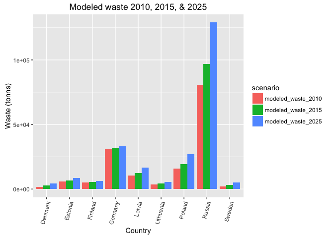

Trash (TRA) Subgoal Data Preparation
================

-   [1. Background](#background)
    -   [Goal Description](#goal-description)
    -   [Model & Data](#model-data)
    -   [Reference points](#reference-points)
    -   [Considerations for *BHI 2.0*](#considerations-for-bhi-2.0)
    -   [Other information](#other-information)
-   [2. Data](#data)
    -   [2.1 Data storage](#data-storage)
    -   [2.2 Data Info](#data-info)
-   [3. Goal model Potential path forward:](#goal-model-potential-path-forward)
-   [4. Data layer preparation](#data-layer-preparation)
    -   [4.1 Read in data](#read-in-data)
    -   [4.3 Downweight for Germany, Denmark, Sweden](#downweight-for-germany-denmark-sweden)
    -   [4.3 Calculate Mismanaged plastic waste 2015](#calculate-mismanaged-plastic-waste-2015)
    -   [4.3 Plot Modeled Mismanaged plastic waste 2010, 2015, and 2025](#plot-modeled-mismanaged-plastic-waste-2010-2015-and-2025)
    -   [4.5 Prepare data layer for Toolbox](#prepare-data-layer-for-toolbox)
    -   [4.7 Explore status score 2010 and 2015](#explore-status-score-2010-and-2015)
-   [4.8 Trend calculation](#trend-calculation)
-   [5. Save as Pollution Pressures layer](#save-as-pollution-pressures-layer)

1. Background
-------------

### Goal Description

The Trash sub-goal assesses a region's ability to manage litter to prevent them from entering the ocean to cause harm to the coastal and marine environment. Marine litter is a large global concern, impacting all marine environments of the world.

### Model & Data

The status is calculated by a country's amount of mismanaged plastic litter that has the potential to enter the ocean

-   [Modelled data by *Jambeck et al. 2015*: Plastic waste inputs from land into the ocean](http://science.sciencemag.org/content/347/6223/768.full.pdf+html).

The modelled data have been downweighted for Russia, Germany, Denmark and Sweden (proportion of coastal pop/national pop) to include only the litter that reaches the the Baltic Sea from these countries.

### Reference points

The official good environmental status (reference point) from the Marine Strategy Framework Directive is "Properties and quantities of marine litter do not cause harm to the coastal and marine environment". Currently, there is no offical quantitative reference point set. Therefore we set reference points based on modeled data from *Jambeck et al. 2015* to rescale the litter data and make them comparable across BHI regions. The upper reference point is the maximum amount of litter among all Baltic surrounding countries in 2010 - this will be used until an offical reference point is set. The lower reference point is zero litter in the Baltic Sea.

### Considerations for *BHI 2.0*

### Other information

2. Data
-------

Data for litter/trash from [**Jambeck et al 2015: Plastic waste inputs from land into the ocean**](http://science.sciencemag.org/content/347/6223/768.full.pdf+html)

**the Jambeck et al method includes:**

1.  the mass of waste generated per capita annually;
2.  the percentage of waste that is plastic; and
3.  the percentage of plastic waste that is mismanaged and, therefore, has the potential to enter the ocean as marine debris (12) (data S1). By applying a range of conversion rates from mismanaged waste to marine debris, we estimated the mass of plastic waste entering the ocean from each country in 2010, used population growth data (13) to project the increase in mass to 2025, and predicted growth in the percentage of waste that is plastic.

### 2.1 Data storage

Raw data are stored in `prep/CW/trash/raw`.

`trash_prep.rmd` renames headers and filters for Baltic countries; saves as `prep/CW/trash/intermediate/trash_jambeck_baltic.csv`

### 2.2 Data Info

Jambeck et al 2015: Plastic waste inputs from land into the ocean <http://science.sciencemag.org/content/347/6223/768.full.pdf+html>

[rendered html methods](https://cdn.rawgit.com/OHI-Science/bhi/draft/baltic2015/prep/CW/trash/trash_prep.html)

raw data stored: '~/github/bhi/baltic2015/prep/CW/raw/trash/1260352\_SupportingFile\_Suppl.\_Excel\_seq1\_v1.xlsx'

"the framework includes: (i) the mass of waste generated per capita annually; (ii) the percentage of waste that is plastic; and (iii) the percentage of plastic waste that is mismanaged and, therefore, has the potential to enter the ocean as marine debris (12) (data S1). By applying a range of conversion rates from mismanaged waste to marine debris, we estimated the mass of plastic waste entering the ocean from each country in 2010, used population growth data (13) to project the increase in mass to 2025, and predicted growth in the percentage of waste that is plastic."

Footnotes from .xls file column headers 1 - Based upon 2010 Gross National Income 2 - Based upon a 50 km coastal buffer created in GIS with global population densities 3 - Bold data were taken directly from World Bank estimates 4 - Bold data were taken directly from World Bank estimates 5 - Using a model developed for this study (see Supplemental Information) 6 - From U.S. national litter study 7 - Calculated values 8 - Economic status changed from 2005 to 2010; waste generation rate and %plastic were assigned using average values for the 2010 economic category

3. Goal model Potential path forward:
-------------------------------------

**Status**: 2015 modeled values / ref point 2010
**Trend**: 5 year liear trend 2010-2015

``` r
knitr::opts_chunk$set(message = FALSE, warning = FALSE, results = "hide")

library(readxl) # install.packages('readxl')
```

    ## Warning: package 'readxl' was built under R version 3.4.4

``` r
source('~/github/bhi/baltic2015/prep/common.r')
```

    ## Warning: package 'tidyverse' was built under R version 3.4.2

    ## Warning: package 'tibble' was built under R version 3.4.3

    ## Warning: package 'purrr' was built under R version 3.4.2

    ## Warning: package 'dplyr' was built under R version 3.4.2

    ## Warning: package 'stringr' was built under R version 3.4.4

    ## Warning: package 'forcats' was built under R version 3.4.3

    ## Warning: package 'RMySQL' was built under R version 3.4.4

    ## Warning: package 'DBI' was built under R version 3.4.4

``` r
dir_tra    = file.path(dir_prep, 'CW/trash')

## add a README.md to the prep directory
create_readme(dir_tra, 'tra_prep.rmd')
```

4. Data layer preparation
-------------------------

### 4.1 Read in data

``` r
## packages, directories
dir_prep   = '~/github/bhi/baltic2015/prep'
dir_raw    = file.path(dir_prep, 'CW/trash/raw')
trash_file = '1260352_SupportingFile_Suppl._Excel_seq1_v1.xlsx'

## lookup table
baltic_lookup = read_csv(file.path(dir_prep, 'country_id.csv'))

## read in data, remove Total and footnotes (NAs in Country column)
data_raw = read_excel(file.path(dir_raw, trash_file)) %>%
  filter(!is.na(Country));  #head(data_raw); summary(data_raw)

## filter and rename
data_clean = data_raw %>%
  dplyr::select(
    country                      = Country,
    coastal_pop                  = `Coastal population2`,
    modeled_waste_2010_orig      = `Mismanaged plastic waste in 2010\r\n [tonnes]7`,
    modeled_waste_2025_orig      = `Mismanaged plastic waste in 2025\r\n [tonnes]7`) %>%
  mutate(country = str_replace_all(country, '8', '')) # remove footnotes from country names

## filter Baltic data, excluding Russia, save intermediate
baltic_all = data_clean %>%
  filter(country %in% baltic_lookup$country_name) %>% 
  filter(!country == "Russia")
#  write.csv(baltic, '~/github/bhi/baltic2015/prep/CW/trash/intermediate/trash_jambeck_baltic.csv')
```

### 4.3 Downweight for Germany, Denmark, Sweden

Amount of trash proportional of coastal pop/national pop

``` r
## BHI regional pop
bhi_pop = read_csv(file.path(dir_prep, 'LIV', 'liv_data_database/NUTS2_BHI_ID_Pop_density_in_buffer.csv')) %>% 
  dplyr::select(country = rgn_nam, 
                pop_rgn = PopTot) %>% 
  filter(!country == "Russia") %>% 
  group_by(country) %>% 
  summarize(bhi_pop = round(sum(pop_rgn), 0)) 
  

##combine coastal and bhi pop & downweight for Germany, Denmark, Sweden 
baltic_data = full_join(bhi_pop, baltic_all, by = "country") %>% 
  mutate(proportion = bhi_pop/coastal_pop,
         ## only downweight for Germany, Denmark, and Sweden
         proportion = ifelse(country == "Germany" | country == "Denmark" | country == "Sweden", proportion, 1), 
         modeled_waste_2010 = modeled_waste_2010_orig * proportion, 
         modeled_waste_2025 = modeled_waste_2025_orig * proportion) %>% 
  dplyr::select(country, modeled_waste_2010, modeled_waste_2025)

# baltic_pop_proportion = full_join(bhi_pop, baltic_all, by = "country") %>%
#   mutate(proportion = bhi_pop/coastal_pop) %>%
#   dplyr::select(country, bhi_pop, coastal_pop, proportion)
```

Note: Because Russia is reported as a whole country, we used the proportion of population in Kaliningrad+St Petersburg to the coastal population reported by Jambeck et al. See figure below.

#### 4.5.1 downweight Russia Coastal Trash

It made sense to downweight Kaliningrad and St Petersburg by coastal population density instead of total Russia population density because of the distribution along the coasts:


<!-- Then find ref point as the max of Europe, but compare 2010 v. 2025 to determine whether it's worth trying to interpolate/model to find a reference point in ~2015. Conclusion, probably not worth it, so we could just pick either 2010 or 2025 since those data are already modeled/reported by Jambeck et al.  -->
``` r
## havea another look at the data
# baltic = read.csv('~/github/bhi/baltic2015/prep/CW/trash/intermediate/trash_jambeck_baltic.csv')
# summary(baltic) 
# summary(data_clean)

# ###### NOT NEEDED? ###############
# ## read in lookup table for European countries
# lookup = read.csv('~/github/bhi/baltic2015/prep/EUcountrynames.csv', sep=';') %>%
#   mutate(country_abb = as.character(country_abb),
#          country     = as.character(country)); # head(lookup)
# 
# ## join lookup table to trash data; remove inland NAs and Kosovo, Macedonia, Serbia (no trash data)
# europe = lookup %>%
#   left_join(data_clean, by = 'country') %>%
#   filter(!is.na(coastal_pop)) %>%
#   dplyr::select(-country_abb); # head(europe)

## downweight russia **very hacky for now**
#  4597600 # St Petersbergy: from Wikipedia https://en.wikipedia.org/wiki/Demographics_of_Saint_Petersburg
#  431902  # Kaliningrad https://en.wikipedia.org/wiki/Kaliningrad
rus_trash_pop = data_clean %>%
  filter(country == 'Russia') %>%
  dplyr::select(coastal_pop)

rus_coastal_pop_proportion = as.numeric((4597600+431902) / rus_trash_pop); rus_coastal_pop_proportion

rus = data_clean %>%
  filter(country == 'Russia') %>%
  mutate(modeled_waste_2010 = modeled_waste_2010_orig * rus_coastal_pop_proportion, 
         modeled_waste_2025 = modeled_waste_2025_orig * rus_coastal_pop_proportion) %>% 
  dplyr::select(country, modeled_waste_2010, modeled_waste_2025)

## create dataframe of europe + russia
eur_rus = rbind(
  baltic_data,
  rus) 
```

### 4.3 Calculate Mismanaged plastic waste 2015

Assuming it's a linear trend between 2010 and 2025, 2015 values are the 1/3-point between 2010 and 2025.

### 4.3 Plot Modeled Mismanaged plastic waste 2010, 2015, and 2025

``` r
modeled_waste_plot = modeled_waste %>% 
  gather(scenario, waste, 2:4) 

ggplot(modeled_waste_plot, aes(x = country, y = waste, fill = scenario)) +
  geom_bar(stat = 'identity', position = 'dodge') +
  theme(axis.text.x = element_text(angle = 75, hjust = 1)) + 
  labs(title = 'Modeled waste 2010, 2015, & 2025',
      x = 'Country', 
      y = 'Waste (tonns)')
```



``` r
## SAVE 2015 DATA for VISUALIZE

tra_value_data= modeled_waste%>%
                dplyr::select(value=modeled_waste_2015,
                       location =country)%>%
                mutate(unit= "tonnes",
                       bhi_goal = "TRA",
                       data_descrip="modeled mismanaged plastic waste 2015" )

write.csv(tra_value_data, file.path(dir_baltic,'visualize/tra_value_data.csv'), row.names=TRUE)
```

### 4.5 Prepare data layer for Toolbox

**Plan:**

We will create scores for each country for 2015 related to the reference point, and then apply to all of that country's BHI regions under the assumption that the management for the country is probably equal.

Modeled Mismanaged plastic waste data (tonnes) are reported for each country. We will make a linear model between 2010 and 2025 and choose 2015.

Note: for BHI 2.0, would be better to recalculate their model using coastal population for each BHI region.

**Reference points**

Need a min and a max reference point (they will ultimately be inverted for CW but not as a pressure)

-   **Minimum modeled trash entering the ocean = 0** (we want no trash entering the ocean)
-   **Maximum modeled trash entering the ocean = highest BHI country in 2010**

#### 4.5.2 find ref point

``` r
## set min and max reference points ----
## rescale to reference point -- whole European

ref_point_min = 0

## 2010 ref point
ref_point_max_2010 = eur_rus %>%
 filter(modeled_waste_2010 == max(modeled_waste_2010))
sprintf('max trash for 2010 is %s (%s)', 
        round(ref_point_max_2010$modeled_waste_2010),
        ref_point_max_2010$country)
ref_point_max_2010 = ref_point_max_2010$modeled_waste_2010
# "max trash for 2010 is 37566 (Russia)"
```

<!-- ### 4.6 Plot exploring ref point as max of Europe (including Russia) in 2010 v. 2025 -->
<!-- ```{r plot and save layer} -->
<!-- # compare reference points - makes minimal differences in scores, country order does not change.  Larger differences for Germany & Russia (lesser degree Poland) -->
<!-- baltic_explore2 = baltic_explore %>%  -->
<!--   dplyr::select(country, trash_score_2010, trash_score_2025) %>%  -->
<!--   gather(key = ref_point, value = score, 2:3) %>%  -->
<!--   mutate(status_score = (1-score)*100) -->
<!-- ggplot(baltic_explore2, aes(x = country, y = status_score, fill = ref_point)) + -->
<!--   geom_point(aes(color = ref_point)) +  -->
<!--   theme(axis.text.x = element_text(angle = 75, hjust = 1)) + -->
<!--   labs(title = "Trash scores comparison: \n max(2010) vs. max(2025) as reference point") -->
<!-- ## assign to BHI regions ---- -->
<!-- lookup_bhi = read.csv('~/github/bhi/baltic2015/prep/CW/trash/bhi_basin_country_lookup.csv',sep=";", stringsAsFactors = FALSE) %>% -->
<!--   dplyr::select(rgn_id =BHI_ID, -->
<!--          country = rgn_nam) %>% -->
<!--   mutate(country = as.character(country)) -->
<!-- ## join baltic_explore (baltic countries) to bhi regions, repeating the trash score for each baltic region. -->
<!-- baltic_layer = lookup_bhi %>% -->
<!--   left_join(baltic_explore, -->
<!--             by = 'country') %>% -->
<!--   dplyr::select(rgn_id, -->
<!--          score = trash_score_2010); # baltic_layer -->
<!-- ## save layer to layers folder, and register layer in layers.csv by hand -->
<!-- # write.csv(baltic_layer, '~/github/bhi/baltic2015/layers/po_trash_bhi2015.csv',row.names=FALSE) -->
<!-- ## calculate trend; maybe make a linear model between 2010 and 2025, take trend as 5 years out? -->
<!-- ``` -->
### 4.7 Explore status score 2010 and 2015

2015: Using modeled 2015 data for status but use max 2010 as a reference point. This approach was used as the final candidate for status calculation.

``` r
## scores by country
scores_by_country = modeled_waste %>% 
    mutate(ref_point = 37566,  # "max trash for 2010 is 37566 (Russia)"
           score_2010 = (1 - pmin(1, modeled_waste_2010/ref_point))*100, 
           score_2015 = (1 - pmin(1, modeled_waste_2015/ref_point))*100 ) %>% 
    dplyr::select(country, score_2010, score_2015)

scores_by_country_plot = scores_by_country %>% 
  gather(year, score, 2:3)

# plot by country
ggplot(scores_by_country_plot, aes(x = country, y = score, fill = year)) +
  geom_bar(stat = "identity", position = "dodge") +
  theme(axis.text.x = element_text(angle = 75, hjust = 1)) +
  ggtitle("Trash scores by country: 2010 & 2015")
```


``` r
## scores by bhi region
## join baltic_explore (baltic countries) to bhi regions, repeating the trash score for each baltic region.
lookup_bhi = read.csv('~/github/bhi/baltic2015/prep/CW/trash/bhi_basin_country_lookup.csv',sep=";", stringsAsFactors = FALSE) %>% 
 dplyr::select(rgn_id =BHI_ID, 
      country = rgn_nam) %>%
      mutate(country = as.character(country)) 

scores_by_bhi = lookup_bhi %>%
  left_join(scores_by_country, 
            by = 'country') %>%
  dplyr::select(-country) 

scores_by_bhi_plot = scores_by_bhi %>% 
  gather(year, score, 2:3)
  
ggplot(scores_by_bhi_plot, aes(x = rgn_id, y = score, fill = year)) +
  geom_bar(stat = "identity", position = "dodge") +
  theme(axis.text.x = element_text(angle = 75, hjust = 1)) +
  ggtitle("Trash scores by BHI region: 2010 & 2015")
```


``` r
# save as CW-TRA data layer
TRA_status = scores_by_bhi %>% 
  dplyr::select(rgn_id, score = score_2015)

write.csv(TRA_status, '~/github/bhi/baltic2015/layers/cw_trash_status_scores_bhi2015.csv', row.names=FALSE)
```

4.8 Trend calculation
---------------------

Based on linear model of status scores in 2010 and 2015.

``` r
TRA_trend = scores_by_bhi %>% 
  gather(year, score, 2:3) %>% 
  mutate(year = substr(year, 7, 10)) %>% 
  group_by(rgn_id) %>% 
  summarize(trend_score = round((score[year == 2015] - score[year == 2010])/5 * 0.05, 2)) %>% 
  # NOT used: could not select coefficient of year from linear model 
  # do(lmd = lm(score ~ year, data = .)) %>% 
  # mutate(trend_score = coef(lmd)[['year']])
  dplyr::select(rgn_id, score = trend_score)

write_csv(TRA_trend, file.path(dir_layers, 'cw_tra_trend_scores_bhi2015.csv'))
```

5. Save as Pollution Pressures layer
------------------------------------

``` r
press_scores = TRA_status %>% 
  mutate(pressure_score = 1 - score/100) %>% 
  dplyr::select(rgn_id, pressure_score)

write_csv(press_scores, file.path(dir_layers, "po_trash_bhi2015.csv"))
```
