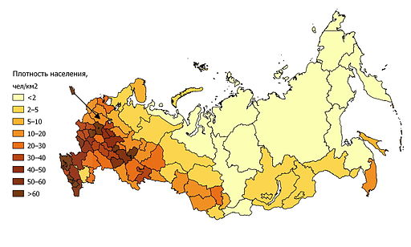

trash\_prep.rmd
================

-   [Preparation of TRA (trash) data layer](#preparation-of-tra-trash-data-layer)
    -   [1. Background](#background)
    -   [2. Data](#data)
        -   [2.1 Data storage](#data-storage)
        -   [2.2 Data Info](#data-info)
    -   [3. Goal model Potential path forward:](#goal-model-potential-path-forward)
    -   [4. Data layer preparation](#data-layer-preparation)
        -   [4.1 Read in data](#read-in-data)
        -   [4.2 Filter Baltic data](#filter-baltic-data)
        -   [4.3 Modeled Mismanaged plastic waste 2010](#modeled-mismanaged-plastic-waste-2010)
        -   [4.4 Modeled Mismanaged plastic waste 2025](#modeled-mismanaged-plastic-waste-2025)
        -   [4.5 Prepare data layer for Toolbox](#prepare-data-layer-for-toolbox)
        -   [4.6 Plot exploring ref point as max of Europe (including Russia) in 2010 v. 2025](#plot-exploring-ref-point-as-max-of-europe-including-russia-in-2010-v.-2025)

Preparation of TRA (trash) data layer
=====================================

1. Background
-------------

2. Data
-------

Proposed data for trash from [**Jambeck et al 2015: Plastic waste inputs from land into the ocean**](http://science.sciencemag.org/content/347/6223/768.full.pdf+html)

**the Jambeck et al method includes:**

-   1.  the mass of waste generated per capita annually;
-   1.  the percentage of waste that is plastic; and
-   1.  the percentage of plastic waste that is mismanaged and, therefore, has the potential to enter the ocean as marine debris (12) (data S1). By applying a range of conversion rates from mismanaged waste to marine debris, we estimated the mass of plastic waste entering the ocean from each country in 2010, used population growth data (13) to project the increase in mass to 2025, and predicted growth in the percentage of waste that is plastic.

### 2.1 Data storage

Raw data are stored in `prep/CW/trash/raw`.

`trash_prep.rmd` renames headers and filters for Baltic countries; saves as `prep/CW/trash/intermediate/trash_jambeck_baltic.csv`

### 2.2 Data Info

Jambeck et al 2015: Plastic waste inputs from land into the ocean <http://science.sciencemag.org/content/347/6223/768.full.pdf+html>

[rendered html methods](https://cdn.rawgit.com/OHI-Science/bhi/draft/baltic2015/prep/CW/trash/trash_prep.html)

raw data stored: '~/github/bhi/baltic2015/prep/CW/raw/trash/1260352\_SupportingFile\_Suppl.\_Excel\_seq1\_v1.xlsx'

"the framework includes: (i) the mass of waste generated per capita annually; (ii) the percentage of waste that is plastic; and (iii) the percentage of plastic waste that is mismanaged and, therefore, has the potential to enter the ocean as marine debris (12) (data S1). By applying a range of conversion rates from mismanaged waste to marine debris, we estimated the mass of plastic waste entering the ocean from each country in 2010, used population growth data (13) to project the increase in mass to 2025, and predicted growth in the percentage of waste that is plastic."

Footnotes from .xls file column headers 1 - Based upon 2010 Gross National Income 2 - Based upon a 50 km coastal buffer created in GIS with global population densities 3 - Bold data were taken directly from World Bank estimates 4 - Bold data were taken directly from World Bank estimates 5 - Using a model developed for this study (see Supplemental Information) 6 - From U.S. national litter study 7 - Calculated values 8 - Economic status changed from 2005 to 2010; waste generation rate and %plastic were assigned using average values for the 2010 economic category

3. Goal model Potential path forward:
-------------------------------------

**Status**: 2010 modeled values / ref point
**Ref pt**: maximum for Europe in 2010 or 2025 (explored below)
**Trend**: use projected 2025 data to get 5-year trend? Or just use trend for a different CW component as the trend of the whole goal.

``` r
## Libraries
library(readr)
```

    ## Warning: package 'readr' was built under R version 3.2.4

``` r
library(dplyr)
```

    ## Warning: package 'dplyr' was built under R version 3.2.5

    ## 
    ## Attaching package: 'dplyr'

    ## The following objects are masked from 'package:stats':
    ## 
    ##     filter, lag

    ## The following objects are masked from 'package:base':
    ## 
    ##     intersect, setdiff, setequal, union

``` r
library(tidyr)
```

    ## Warning: package 'tidyr' was built under R version 3.2.5

``` r
library(ggplot2)
```

    ## Warning: package 'ggplot2' was built under R version 3.2.4

``` r
library(RMySQL)
```

    ## Warning: package 'RMySQL' was built under R version 3.2.5

    ## Loading required package: DBI

    ## Warning: package 'DBI' was built under R version 3.2.5

``` r
library(stringr)
library(tools)
library(rprojroot) # install.packages('rprojroot')
```

    ## Warning: package 'rprojroot' was built under R version 3.2.4

``` r
library(readxl) # install.packages('readxl')
```

    ## Warning: package 'readxl' was built under R version 3.2.5

``` r
source('~/github/bhi/baltic2015/prep/common.r')


## rprojroot
root <- rprojroot::is_rstudio_project


## make_path() function to 
make_path <- function(...) rprojroot::find_root_file(..., criterion = is_rstudio_project)

dir_layers = make_path('baltic2015/layers') # replaces  file.path(dir_baltic, 'layers')


# root$find_file("README.md")
# 
# root$find_file("ao_need_gl2014.csv")
# 
# root <- find_root_file("install_ohicore.r", 
# 
# withr::with_dir(
#   root_file("DESCRIPTION"))


dir_tra    = file.path(dir_prep, 'CW/trash')

## add a README.md to the prep directory with the rawgit.com url for viewing on GitHub
create_readme(dir_tra, 'tra_prep.rmd')
```

4. Data layer preparation
-------------------------

### 4.1 Read in data

``` r
## packages, directories
dir_prep   = '~/github/bhi/baltic2015/prep'
dir_raw    = file.path(dir_prep, 'CW/trash/raw')
trash_file = '1260352_SupportingFile_Suppl._Excel_seq1_v1.xlsx'

## lookup table
baltic_lookup = read_csv(file.path(dir_prep, 'country_id.csv'))

## read in data, remove Total and footnotes (NAs in Country column)
data_raw = read_excel(file.path(dir_raw, trash_file)) %>%
  filter(!is.na(Country));  #head(data_raw); summary(data_raw)
```

    ## Warning in read_xlsx_(path, sheet, col_names = col_names, col_types =
    ## col_types, : [194, 12]: expecting numeric: got 'Total'

``` r
## filter and rename
data_clean = data_raw %>%
  dplyr::rename(
    country                      = Country,
    econ_status                  = `Economic status1`,
    coastal_pop                  = `Coastal population2`,
    waste_gen_rate_kg_person_day = `Waste generation rate [kg/person/day]3`,
    perc_plastic_waste_stream    = `% Plastic in waste stream4`,
    perc_inadq_managed_waste     = `% Inadequately managed waste5`,
    perc_littered_waste          = `% Littered waste6`,
    waste_gen_kg_day             = `Waste generation [kg/day]7`,
    plastic_waste_gen_kg_day     = `Plastic waste generation [kg/day]7`,
    inadq_managed_plastic_kg_day = `Inadequately managed plastic waste [kg/day]7`,
    plastic_waste_littered       = `Plastic waste littered\r\n [kg/day]7`,
    modeled_waste_percap         = `Mismanaged plastic waste [kg/person/day]7`,
    modeled_waste_2010           = `Mismanaged plastic waste in 2010\r\n [tonnes]7`,
    modeled_waste_2025           = `Mismanaged plastic waste in 2025\r\n [tonnes]7`) %>%
  mutate(country = str_replace_all(country, '8', '')) # remove footnotes from country names
```

### 4.2 Filter Baltic data

Note: these data are for all of these countries, so do fraction of coastline or something to downweight

``` r
## filter Baltic data, save intermediate
baltic = data_clean %>%
  filter(country %in% baltic_lookup$country_name)
#write.csv(baltic, '~/github/bhi/baltic2015/prep/CW/trash/intermediate/trash_jambeck_baltic.csv')
```

### 4.3 Modeled Mismanaged plastic waste 2010


### 4.4 Modeled Mismanaged plastic waste 2025


### 4.5 Prepare data layer for Toolbox

**Plan:**

Modeled Mismanaged plastic waste data (tonnes) are reported for each country. We will create scores for each country related to the reference point, and then apply to all of that country's BHI regions under the assumption that the management for the country is probably equal. Note: for BHI 2.0, would be better to recalcuate their model using coastal population for each BHI region.

**Reference points**

Need a min and a max reference point (they will ultimately be inverted for CW but not as a pressure)

-   **Minimum modeled trash entering the ocean = 0** (we want no trash entering the ocean)
-   **Maximum modeled trash entering the ocean = highest Eurpean country in 2025** (we have 2025 modeled data. Is this reasonable, ie do we think that the maximum trash we see in Europe, or is that too high because it's based on a larger population that we don't have now? Another option would be to make a linear model between 2010 and 2025 and choose a year more like 2015?)

Note: Because Russia is reported as a whole country, we used the proportion of population in Kaliningrad+St Petersburg to the coastal popultion reported by Jambeck et al. See figure below.

#### To find reference point, combine Europe with Russia, downweight Russia

It made sense to downweight Kaliningrad and St Petersburg by coastal population density instead of total Russia population density because of the distribution along the coasts:



Then find ref point as the max of Europe, but compare 2010 v. 2025 to determine whether it's worth trying to interpolate/model to find a reference point in ~2015. Conclusion, probably not worth it, so we could just pick either 2010 or 2025 since those data are already modeled/reported by Jambeck et al.

    ## [1] 0.4651547

    ## [1] "max trash for 2010 is 67549 (United Kingdom)"

    ## [1] "max trash for 2025 is 94165 (United Kingdom)"

### 4.6 Plot exploring ref point as max of Europe (including Russia) in 2010 v. 2025


