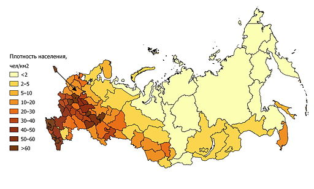

Proposed data for trash from [**Jambeck et al 2015: Plastic waste inputs from land into the ocean**](http://science.sciencemag.org/content/347/6223/768.full.pdf+html)

**the Jambeck et al method includes:** 

- (i) the mass of waste generated per capita annually; 
- (ii) the percentage of waste that is plastic; and 
- (iii) the percentage of plastic waste that is mismanaged and, therefore, has the potential to enter the ocean as marine debris (12) (data S1). By applying a range of conversion rates from mismanaged waste to marine debris, we estimated the mass of plastic waste entering the ocean from each country in 2010, used population growth data (13) to project the increase in mass to 2025, and predicted growth in the percentage of waste that is plastic.

## Potential path forward:

**Status**: 2010 modeled values / ref point  
**Ref pt**: maximum for Europe in 2010 or 2025 (explored below)  
**Trend**: use projected 2025 data to get 5-year trend? Or just use trend for a different CW component as the trend of the whole goal.

```{r setup and load data, echo = FALSE, message = FALSE, warning = FALSE}

## packages, directories
library(dplyr)
library(readr)  # install.packages('readr')
library(readxl) # install.packages('readxl')
library(ggplot2)
library(stringr)

dir_prep   = '~/github/bhi/baltic2015/prep'
dir_raw    = file.path(dir_prep, 'CW/trash/raw')
trash_file = '1260352_SupportingFile_Suppl._Excel_seq1_v1.xlsx'

## lookup table
baltic_lookup = read_csv(file.path(dir_prep, 'country_id.csv'))

## read in data, remove Total and footnotes (NAs in Country column)
data_raw = read_excel(file.path(dir_raw, trash_file)) %>%
  filter(!is.na(Country));  #head(data_raw); summary(data_raw)

## filter and rename
data_clean = data_raw %>%
  dplyr::rename(
    country                      = Country,
    econ_status                  = `Economic status1`,
    coastal_pop                  = `Coastal population2`,
    waste_gen_rate_kg_person_day = `Waste generation rate [kg/person/day]3`,
    perc_plastic_waste_stream    = `% Plastic in waste stream4`,
    perc_inadq_managed_waste     = `% Inadequately managed waste5`,
    perc_littered_waste          = `% Littered waste6`,
    waste_gen_kg_day             = `Waste generation [kg/day]7`,
    plastic_waste_gen_kg_day     = `Plastic waste generation [kg/day]7`,
    inadq_managed_plastic_kg_day = `Inadequately managed plastic waste [kg/day]7`,
    plastic_waste_littered       = `Plastic waste littered\r\n [kg/day]7`,
    modeled_waste_percap         = `Mismanaged plastic waste [kg/person/day]7`,
    modeled_waste_2010           = `Mismanaged plastic waste in 2010\r\n [tonnes]7`,
    modeled_waste_2025           = `Mismanaged plastic waste in 2025\r\n [tonnes]7`) %>%
  mutate(country = str_replace_all(country, '8', '')) # remove footnotes from country names

```

## Filter Baltic data 
Note: these data are for all of these countries, so do fraction of coastline or something to downweight
```{r filter baltic data, echo = TRUE, message = FALSE, warning = FALSE}

## filter Baltic data, save intermediate
baltic = data_clean %>%
  filter(country %in% baltic_lookup$country_name)
#write.csv(baltic, '~/github/bhi/baltic2015/prep/CW/trash/intermediate/trash_jambeck_baltic.csv')
```

## Modeled Mismanaged plastic waste 2010 

```{r baltic data explore, echo = FALSE, message = FALSE, warning = FALSE}
## plot 2010
ggplot(baltic, aes(country, modeled_waste_2010)) +
  geom_bar(stat='identity')

```


## Modeled Mismanaged plastic waste 2025

```{r data explore 2025, echo = FALSE, message = FALSE, warning = FALSE}

## plot 2025
ggplot(baltic, aes(country, modeled_waste_2025)) +
  geom_bar(stat='identity')

```


## Prepare data layer for Toolbox 

**Plan:** 

Modeled Mismanaged plastic waste data (tonnes) are reported for each country. We will create scores for each country related to the reference point, and then apply to all of that country's BHI regions under the assumption that the management for the country is probably equal.  Note: for BHI 2.0, would be better to recalcuate their model using coastal population for each BHI region. 

**Reference points**

Need a min and a max reference point (they will ultimately be inverted for CW but not as a pressure)

- **Minimum modeled trash entering the ocean = 0** (we want no trash entering the ocean)
- **Maximum modeled trash entering the ocean = highest Eurpean country in 2025** (we have 2025 modeled data. Is this reasonable, ie do we think that the maximum trash we see in Europe, or is that too high because it's based on a larger population that we don't have now? Another option would be to make a linear model between 2010 and 2025 and choose a year more like 2015?)

Note: Because Russia is reported as a whole country, we used the proportion of population in Kaliningrad+St Petersburg to the coastal popultion reported by Jambeck et al. See figure below. 


## To find reference point, combine Europe with Russia, downweight Russia
It made sense to downweight Kaliningrad and St Petersburg by coastal population density instead of total Russia population density because of the distribution along the coasts:



Then find ref point as the max of Europe, but compare 2010 v. 2025 to determine whether it's worth trying to interpolate/model to find a reference point in ~2015. Conclusion, probably not worth it, so we could just pick either 2010 or 2025 since those data are already modeled/reported by Jambeck et al. 

```{r data explore and prep, echo = FALSE, message = FALSE, warning = FALSE}

## havea another look at the data
# baltic = read.csv('~/github/bhi/baltic2015/prep/CW/trash/intermediate/trash_jambeck_baltic.csv')
# summary(baltic) 
# summary(data_clean)


## select desired columns
data_clean_select = data_clean %>%
  select(country, coastal_pop, modeled_waste_2010, modeled_waste_2025)

## read in lookup table for European countries
lookup = read.csv('~/github/bhi/baltic2015/prep/EUcountrynames.csv', sep=';') %>%
  mutate(country_abb = as.character(country_abb),
         country     = as.character(country)); # head(lookup)

## join lookup table to trash data; remove inland NAs and Kosovo, Macedonia, Serbia (no trash data)
europe = lookup %>%
  left_join(data_clean_select, by = 'country') %>%
  filter(!is.na(coastal_pop)) %>%
  select(-country_abb); # head(europe)

## downweight russia **very hacky for now**
#  4597600 # St Petersbergy: from Wikipedia https://en.wikipedia.org/wiki/Demographics_of_Saint_Petersburg
#  431902  # Kaliningrad https://en.wikipedia.org/wiki/Kaliningrad
rus_trash_pop = data_clean_select %>%
  filter(country == 'Russia') %>%
  select(coastal_pop)

rus_coastal_pop_proportion = as.numeric((4597600+431902) / rus_trash_pop); rus_coastal_pop_proportion

rus = data_clean_select %>%
  filter(country == 'Russia') %>%
  mutate(modeled_waste_2010 = modeled_waste_2010 * rus_coastal_pop_proportion, 
         modeled_waste_2025 = modeled_waste_2025 * rus_coastal_pop_proportion); # rus
  
## consider also downweighting Germany, Denmark, Sweden?


## create dataframe of europe + russia
eur_rus = rbind(
  europe,
  rus) %>%
  arrange(desc(modeled_waste_2010)); # eur_rus # view high to low 


## set min and max reference points ----
## rescale to reference point -- whole European

ref_point_min = 0

##2010
ref_point_max_2010 = eur_rus %>%
  filter(modeled_waste_2010 == max(modeled_waste_2010))
sprintf('max trash for 2010 is %s (%s)', 
        round(ref_point_max_2010$modeled_waste_2010),
        ref_point_max_2010$country)
ref_point_max_2010 = ref_point_max_2010$modeled_waste_2010

## 2025
ref_point_max_2025 = eur_rus %>%
  filter(modeled_waste_2025 == max(modeled_waste_2025))
sprintf('max trash for 2025 is %s (%s)', 
        round(ref_point_max_2025$modeled_waste_2025),
        ref_point_max_2025$country)
ref_point_max_2025 = ref_point_max_2025$modeled_waste_2025


## calculate ref point
## to normalize data: normalized = (x-min(x))/(max(x)-min(x))
baltic_explore = eur_rus %>%
  filter(country %in% baltic$country) %>%
  mutate(
    trash_score_2010   = (
      (modeled_waste_2010 - ref_point_min) /
      (ref_point_max_2010 - ref_point_min)),
    trash_score_2025   = (
      (modeled_waste_2025 - ref_point_min) /
      (ref_point_max_2025 - ref_point_min))); # baltic_explore; summary(baltic_explore)
```


### Plot exploring ref point as max of Europe (including Russia) in 2010 v. 2025

```{r plot and save layer, echo = FALSE, message = FALSE, warning = FALSE}


#compare reference points - makes minimal differences in scores, country order does not change.  Larger differences for Germany & Russia (lesser degree Poland)
ggplot(baltic_explore)+
  geom_point(aes(country,trash_score_2010, colour="red"))+
  geom_point(aes(country,trash_score_2025))+
  ggtitle('Country Trash Score')


## assign to BHI regions ----
lookup_bhi = read.csv('~/github/bhi/baltic2015/prep/CW/trash/baltic_rgns_to_bhi_rgns_lookup_holas.csv') %>%
  select(rgn_id,
         country = cntry_name) %>%
  mutate(country = as.character(country))

## join baltic_explore (baltic countries) to bhi regions, repeating the trash score for each baltic region.
baltic_layer = lookup_bhi %>%
  left_join(baltic_explore, 
            by = 'country') %>%
  select(rgn_id, 
         score = trash_score_2010); # baltic_layer
  
## save layer to layers folder, and register layer in layers.csv by hand
write.csv(baltic_layer, '~/github/bhi/baltic2015/layers/po_trash_bhi2015.csv')

  
## calculate trend; maybe make a linear model between 2010 and 2025, take trend as 5 years out?


```


