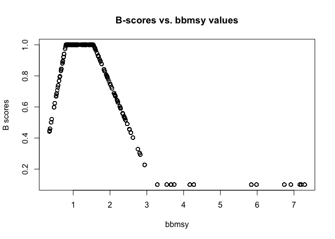

Food Provision (FP) - Fisheries (FIS) subgoal & Natural Products (NP) Goal Data Prep
================

-   [1. Background](#background)
    -   [Goal Description](#goal-description)
    -   [Model & Data](#model-data)
    -   [Reference points](#reference-points)
    -   [Considerations for *BHI 2.0*](#considerations-for-bhi-2.0)
    -   [Other information](#other-information)
-   [2. Data](#data)
    -   [2.1 Raw and Prepared data](#raw-and-prepared-data)
    -   [2.3 B/Bmsy and F/msy](#bbmsy-and-fmsy)
-   [3. Data layer preparation](#data-layer-preparation)
-   [3. Status Calculation](#status-calculation)
-   [4. Trend calculations](#trend-calculations)
-   [5. Plot results](#plot-results)
-   [6. Explore and compare FIS status and trend with and without sprat](#explore-and-compare-fis-status-and-trend-with-and-without-sprat)

1. Background
-------------

### Goal Description

The Fisheries sub-goal of Food Provision describes a country's ability to maximize the sustainable yield of wild-caught seafood for human consumption. **For the BHI cod and herring stocks in the Baltic Sea were included as wild-caught fisheries**.

### Model & Data

The data used for this goal are composed of cod and herring spawning biomass (SSB) and fishing mortality (F) data. The current status is calculated as a function of the ratio (B’) between the single species current biomass at sea (B) and the reference biomass at maximum sustainable yield (BMSY), as well as the ratio (F’) between the single species current fishing mortality (F) and the fishing mortality at maximum sustainable yield (FMSY). B/Bmsy and F/Fmsy data are converted to scores between 0 and 1 using this [general relationship](https://github.com/OHI-Science/bhi/blob/draft/baltic2015/prep/FIS/ffms%3By_bbmsy_2_score.png).

-   [Cod and herring data accessed from the ICES homepage](http://www.ices.dk/marine-data/tools/Pages/stock-assessment-graphs.aspx) &gt; search for 'cod' or 'herring' &gt; specify the ecoregion as Baltic Sea &gt; search for the 2013 assessment.

### Reference points

The reference point used for the computation are based on the MSY principle and are described as a functional relationship. MSY means the highest theoretical equilibrium yield that can be continuously taken on average from a stock under existing average environmental conditions without significantly affecting the reproduction process *(European Union 2013, World Ocean Review 2013).*

### Considerations for *BHI 2.0*

### Other information

*external advisors/goalkeepers are Christian Möllmann & Stefan Neuenfeldt*

2. Data
-------

The **Fisheries** subgoal of Food Provision describes the ability to maximize the sustainable yield of *wild-caught seafood for human consumption*, while the **Natural Products** goal focuses on *non-food* natural products.

The same model was used for both Fisheries and Natural Products, which compares landings with Maximum Sustainable Yield. A score of 100 means the country or region is harvesting seafood to the ecosystem’s production potential in an sustainable manner.

This document prepares data for both Natural Products (NP) and Fisheries (FIS). For Baltic regions, commercially fished stocks are used in these two goals, but different stocks were considered for each goal:

-   FIS stocks: Cod & Herring, mainly for human consumption
-   cod\_2224, cod\_2532, her\_3a22, her\_2532, her\_riga, her\_30
-   NP stocks: Sprat, not for human consumption
-   spr\_2232

### 2.1 Raw and Prepared data

-   Landings [raw data](https://github.com/OHI-Science/bhi/blob/draft/baltic2015/prep/FIS/raw/BalticLandings.csv)
-   [FIS Landings](https://github.com/OHI-Science/bhi/blob/draft/baltic2015/prep/FIS/data/FIS_landings.csv)
-   This [script](https://github.com/OHI-Science/bhi/blob/draft/baltic2015/prep/FIS/raw/DataOrganization.R) converts raw landing data above to this usable format
-   The landing data can probably be fine-tuned for the Baltic regions based on best expert opinion. Note that each stock/region combination gets the same value across all years (this reflects the mean landings across the most recent 10 years of data).
-   Catch and stock status are reported at the ICES spatial scale, which were then translated into the Baltic regions. There are no data for regions 1 and 2 - may want to check on this.
-   [B/Bmsy and F/Fmsy scores](https://github.com/OHI-Science/bhi/blob/draft/baltic2015/prep/FIS/data/FIS_scores.csv)

### 2.3 B/Bmsy and F/msy

B/Bmsy and F/Fmsy data are converted to scores between 0 and 1 using this [general relationship](https://github.com/OHI-Science/bhi/blob/draft/baltic2015/prep/FIS/ffms%3By_bbmsy_2_score.png).

These parameters can be changed in this [part](https://github.com/OHI-Science/bhi/blob/draft/baltic2015/prep/FIS/FIS.R#L11-L27) of the code

Here is some more information about these scores:

| Equation | Over/under fished                | Fishing related mortality | resulting F' score             |
|----------|----------------------------------|---------------------------|--------------------------------|
| a        | overfished (B/Bmsy &lt; 0.8)     | high                      | all 0s (lowest possible score) |
| b        |                                  | low                       | penalty applied                |
| c        |                                  | med/high                  | penalty applied                |
| d        |                                  | med/low                   | all 1s (best possible score)   |
| e        | not overfished (B/Bmsy &gt; 0.8) | low                       | penalty applied                |
| f        |                                  | medium                    | all 1s (best possible score)   |
| g        |                                  | high                      | penalty applied                |

Here are the specific equations: 

This equation simply converts the F/FMSY value to an F' score that will fall between 0-1 (this function applies a penalty when b/bmsy scores indicate good/underfishing, i.e., &gt;= 0.8, but f/fmsy scores indicate high fisheries related mortality, i.e., &gt; 1.2). The 2.5 and 1.3 values were chosen to scale the F/FMSY values, so that F' scores would be between 0-1. I am fairly sure that the 2.5 value was chosen because it was the highest F/FMSY value in the dataset, and (2.5-2.5)/1.3 = 0, establishing the low score of 0. The 1.3 value was chosen because the lowest possible value for ffmsy (for equation 'g') is 1.2 (ffmsy&gt;=1.2), and (2.5 - 1.2)/1.3 = 1, establishing the high score of 1.

3. Data layer preparation
-------------------------

``` r
## source common libraries, directories, functions, etc
source('~/github/bhi/baltic2015/prep/common.r')
dir_fis = file.path(dir_prep,'FIS')

## add a README.md to the prep directory
create_readme(dir_fis, 'fis_np_prep.rmd')
```

This section prepares data layers for FIS and NP at the same time, separating the fish stocks for each.

-   FIS stocks: cod\_2224, cod\_2532, her\_3a22, her\_2532, her\_riga, her\_30
-   NP stocks: spr\_2232

``` r
## read in data layers
  
  fis_scores <- read.csv(file.path(dir_fis, 'data/FIS_scores.csv')) %>%
    mutate(stock = as.character(stock)) %>%
    dplyr::rename(rgn_id = region_id)

  fis_landings <- read.csv(file.path(dir_fis,'data/FIS_landings.csv')) %>%
    dplyr::rename(rgn_id=region_id)
  
##### filter stocks for FIS and NP, save #####

goal_stocks = c('FIS', 'NP')

for (g in goal_stocks) { # g = 'FIS' g = 'NP'

  scores <- fis_scores
  landings <- fis_landings
  
  ## select the stocks appropriate to the goal
  if (g == 'FIS') {

    scores = scores %>%
      filter(!stock == 'spr_2232') # only select cod and herring

    landings = landings %>%
      filter(!stock == 'spr_2232') # only select cod and herring

  } else if (g == 'NP') {

    scores = scores %>%
      filter(stock == 'spr_2232') # only select sprat

    landings = landings %>%
      filter(stock == 'spr_2232') # only select sprat

  }


  ###### separate objects for bbmsy and ffmsy #####
  scores.bbmsy = scores %>%
    filter(metric == "bbmsy") %>%
    select(-metric)

  scores.ffmsy = scores %>%
    filter(metric == "ffmsy") %>%
    select(-metric)


  ###### save to layers folder #####
  if (g == 'FIS') {

    write.csv(scores.bbmsy, file.path(dir_layers, 'fis_bbmsy_bhi2015.csv'),    row.names=FALSE)
    write.csv(scores.ffmsy, file.path(dir_layers, 'fis_ffmsy_bhi2015.csv'),    row.names=FALSE)
    write.csv(landings,     file.path(dir_layers, 'fis_landings_bhi2015.csv'), row.names=FALSE)

  } else if (g == 'NP') {

    write.csv(scores.bbmsy, file.path(dir_layers, 'np_bbmsy_bhi2015.csv'),    row.names=FALSE)
    write.csv(scores.ffmsy, file.path(dir_layers, 'np_ffmsy_bhi2015.csv'),    row.names=FALSE)
    write.csv(landings,     file.path(dir_layers, 'np_landings_bhi2015.csv'), row.names=FALSE)

  }

  
 ############## prep for VISUALIZE ##################
 bbmsy_time_data = scores.bbmsy %>%
                           select(year,
                                  value = score,
                                  ices = stock)%>%
                           distinct()%>%
                           mutate(unit = NA,
                                  data_descrip= "B/Bmsy",
                                  bhi_goal= g)

ffmsy_time_data = scores.ffmsy %>%
  select(year,
         value = score,
         ices = stock)%>%
  distinct()%>%
  mutate(unit = NA,
         data_descrip= "F/Fmsy",
         bhi_goal= g )

landings_time_data = landings%>%
                         select(-rgn_id)%>%
                          dplyr::rename(ices = stock,
                                       value = landings)%>%
                        distinct()%>%
                         mutate(unit= "tonnes",
                                bhi_goal = g,
                                data_descrip = "ICES area landings")

##### save VISUALIZE #####
if (g == 'FIS') {
  
  write.csv(bbmsy_time_data, file.path(dir_baltic,'visualize/fis_bbmsy_time_data.csv'),row.names = FALSE)
  write.csv(ffmsy_time_data, file.path(dir_baltic,'visualize/fis_ffmsy_time_data.csv'),row.names = FALSE)
  write.csv(landings_time_data, file.path(dir_baltic,'visualize/fis_landings_time_data.csv'),row.names = FALSE)
  
} else if (g == 'NP') {
  
  write.csv(bbmsy_time_data, file.path(dir_baltic,'visualize/np_bbmsy_time_data.csv'),row.names = FALSE)
  write.csv(ffmsy_time_data, file.path(dir_baltic,'visualize/np_ffmsy_time_data.csv'),row.names = FALSE)
  write.csv(landings_time_data, file.path(dir_baltic,'visualize/np_landings_time_data.csv'),row.names = FALSE)

  }

}
```

3. Status Calculation
---------------------

Step 1: convert B/Bmsy and F/Fmsy to F-scores

Step 2: converting B/Bmsy to B-scores

Step 3: Averaging the F and B-scores to get the stock status score

Step 4: calculating the weights

Step 5: Join scores and weights to calculate status

``` r
scores <- read.csv(file.path(dir_fis,
                             'data/FIS_scores.csv')) %>%
  filter(!stock == 'spr_2232') %>%
  spread(metric, score)

###########################################################################
## STEP 1: converting B/Bmsy and F/Fmsy to F-scores
## see plot describing the relationship between these variables and scores
## this may need to be adjusted:
###########################################################################
F_scores <- scores %>%
  mutate(score = ifelse(bbmsy < 0.8 & ffmsy >= (bbmsy+1.5), 0, NA),
         score = ifelse(bbmsy < 0.8 & ffmsy < (bbmsy - 0.2), ffmsy/(bbmsy-0.2), score),
         score = ifelse(bbmsy < 0.8 & ffmsy >= (bbmsy + 0.2) & ffmsy < (bbmsy + 1.5), (bbmsy + 1.5 - ffmsy)/1.5, score),
         score = ifelse(bbmsy < 0.8 & ffmsy >= (bbmsy - 0.2) & ffmsy < (bbmsy + 0.2), 1, score)) %>%
  mutate(score = ifelse(bbmsy >= 0.8 & ffmsy < 0.8, ffmsy/0.8, score),
         score = ifelse(bbmsy >= 0.8 & ffmsy >= 0.8 & ffmsy < 1.2, 1, score),
         score = ifelse(bbmsy >= 0.8 & ffmsy >= 1.2, (2.5 - ffmsy)/1.3, score)) %>%
  mutate(score = ifelse(score <= 0, 0.1, score)) %>%
  mutate(score_type = "F_score")
### NOTE: The reason the last score is 0.1 rather than zero is because
### scores can't be zero if using a geometric mean because otherwise, 1 zero
### results in a zero score.

###########################################################################
## STEP 2: converting B/Bmsy to B-scores
###########################################################################
B_scores <- scores %>%
  mutate(score = ifelse(bbmsy < 0.8 , bbmsy/0.8, NA),
         score = ifelse(bbmsy >= 0.8 & bbmsy < 1.5, 1, score),
         score = ifelse(bbmsy >= 1.5, (3.35 - bbmsy)/1.8, score)) %>%
  mutate(score = ifelse(score <= 0.1, 0.1, score)) %>%
  mutate(score = ifelse(score > 1, 1, score))%>%
  mutate(score_type = "B_score")

# to see what relationship between B/Bmsy and B_score looks like:
plot(score ~ bbmsy, data=B_scores, type="p", 
     main = "B-scores vs. bbmsy values", 
     ylab = "B scores", 
     xlab = "bbmsy")
```



``` r
###########################################################################
## STEP 3: Averaging the F and B-scores to get the stock status score
###########################################################################
scores <- rbind(B_scores, F_scores) %>%
  group_by(region_id, stock, year) %>%
  summarize(score = mean(score, na.rm=TRUE)) %>%
  data.frame()

#############################################
## STEP 4: calculating the weights.
#############################################

landings <- read.csv(file.path(dir_fis,'data/FIS_landings.csv')) %>%
  filter(!stock == 'spr_2232')

##### Subset the data to include only the most recent 10 years
landings <- landings %>%
  filter(year %in% (max(landings$year)-9):max(landings$year))


## we use the average catch for each stock/region across all years
## to obtain weights
weights <- landings %>%
  group_by(region_id, stock) %>%
  mutate(avgCatch = mean(landings)) %>%
  ungroup() %>%
  data.frame()

## each region/stock will have the same average catch across years:
filter(weights, region_id==3)
```

    ##    region_id    stock year landings avgCatch
    ## 1          3 cod_2224 2005    16845  10839.8
    ## 2          3 cod_2224 2006    16472  10839.8
    ## 3          3 cod_2224 2007    15859  10839.8
    ## 4          3 cod_2224 2008    11148  10839.8
    ## 5          3 cod_2224 2009     7093  10839.8
    ## 6          3 cod_2224 2010     7641  10839.8
    ## 7          3 cod_2224 2011     8845  10839.8
    ## 8          3 cod_2224 2012     8654  10839.8
    ## 9          3 cod_2224 2013     7742  10839.8
    ## 10         3 cod_2224 2014     8099  10839.8
    ## 11         3 her_3a22 2005    88404  57369.5
    ## 12         3 her_3a22 2006    90548  57369.5
    ## 13         3 her_3a22 2007    68179  57369.5
    ## 14         3 her_3a22 2008    69489  57369.5
    ## 15         3 her_3a22 2009    67259  57369.5
    ## 16         3 her_3a22 2010    42214  57369.5
    ## 17         3 her_3a22 2011    27771  57369.5
    ## 18         3 her_3a22 2012    38646  57369.5
    ## 19         3 her_3a22 2013    43827  57369.5
    ## 20         3 her_3a22 2014    37358  57369.5

``` r
## determine the total proportion of catch each stock accounts for:
weights <- weights %>%
  group_by(region_id, year) %>%
  mutate(totCatch = sum(avgCatch)) %>%
  ungroup() %>%
  mutate(propCatch = avgCatch/totCatch)

#### The total proportion of landings for each region/year will sum to one:
filter(weights, region_id ==3, year==2014)
```

    ## # A tibble: 2 × 7
    ##   region_id    stock  year landings avgCatch totCatch propCatch
    ##       <int>   <fctr> <int>    <dbl>    <dbl>    <dbl>     <dbl>
    ## 1         3 cod_2224  2014     8099  10839.8  68209.3 0.1589197
    ## 2         3 her_3a22  2014    37358  57369.5  68209.3 0.8410803

``` r
############################################################
#####  STEP 5: Join scores and weights to calculate status
############################################################

status <- weights %>%
  left_join(scores, by=c('region_id', 'year', 'stock')) %>%
  filter(!is.na(score)) %>%                    # remove missing data
  select(region_id, year, stock, propCatch, score)        # cleaning data


### Geometric mean weighted by proportion of catch in each region
status <- status %>%
  group_by(region_id, year) %>%
  summarize(status = prod(score^propCatch)) %>%
  ungroup() %>%
  data.frame()
```

4. Trend calculations
---------------------

To get trend, we get slope of regression model based on most recent 5 years of status

``` r
### of data

trend_years <- (max(status$year)-4):max(status$year)

trend <- status %>%
  group_by(region_id) %>%
  filter(year %in% trend_years) %>%
  do(mdl = lm(status ~ year, data=.)) %>%
  summarize(region_id = region_id,
            trend = coef(mdl)['year'] * 5) %>%  ## trend multiplied by 5 to get prediction 5 years out
  ungroup() %>%
  mutate(trend = round(trend, 2))

# can do a check to make sure it looks right:
data.frame(filter(status, region_id==3))
```

    ##    region_id year    status
    ## 1          3 2005 0.7740658
    ## 2          3 2006 0.7693439
    ## 3          3 2007 0.8061825
    ## 4          3 2008 0.7396331
    ## 5          3 2009 0.7091773
    ## 6          3 2010 0.8139237
    ## 7          3 2011 0.8126805
    ## 8          3 2012 0.8304309
    ## 9          3 2013 0.8167508
    ## 10         3 2014 0.8459051

``` r
lm(c(0.8209574,0.9523321,0.9685960, 0.8845136, 0.8571231) ~ trend_years)
```

    ## 
    ## Call:
    ## lm(formula = c(0.8209574, 0.9523321, 0.968596, 0.8845136, 0.8571231) ~ 
    ##     trend_years)
    ## 
    ## Coefficients:
    ## (Intercept)  trend_years  
    ##  -0.0112910    0.0004513

``` r
0.0004513 * 5
```

    ## [1] 0.0022565

``` r
## results match....looks like everything went well!

### final formatting of status data:
status <- status %>%
  filter(year == max(year)) %>%
  mutate(status = round(status * 100, 1)) %>%
  select(region_id, status)


##### save the data (eventually these steps will be incorporated into the OHI toolbox)
write.csv(status, file.path(dir_fis ,'data/FIS_status.csv'), row.names=FALSE)
write.csv(trend,  file.path(dir_fis ,'data/FIS_trend.csv'), row.names = FALSE)
```

5. Plot results
---------------

``` r
## FINAL STATUS AND TREND
## Read in the status and trend csv for plotting
status = read.csv(file.path(dir_fis,
                   'data/FIS_status.csv'))
trend = read.csv(file.path(dir_fis,
                            'data/FIS_trend.csv'))


## Plot FIS status and trend by BHI region
# windows()
par(mfrow=c(1,2), mar=c(1,1,1,1), oma=c(2,2,2,2))
plot(status~region_id, data=status, pch=19, cex=1,
     xlim=c(0,43), ylim=c(0,100),
     ylab="Status", xlab="", 
     main = "FIS Status by BHI region")

par(new=FALSE)
plot(trend~region_id, data=trend, pch=19, cex=1,
     xlim=c(0,43), ylim=c(-1,1),
     ylab="Trend", xlab="", 
     main = "FIS Trend by BHI region")
abline(h=0)

mtext("BHI region", side=1, line=1, outer=TRUE)
mtext("FIS Status and Trend - All Stocks", side=3, line=.5, outer=TRUE, cex=1.5)
```


``` r
## INITIAL SCORES
## Read in initial scores (code line 14-16) and plot

scores <- read.csv(file.path(dir_fis,
                             'data/FIS_scores.csv')) %>%
  spread(metric, score)

## BBMSY
ggplot(scores) + geom_point(aes(year,bbmsy), color="black") +
  facet_wrap(~stock) +
  ggtitle("bbmsy values over time")
```


``` r
##FFMSY
ggplot(scores) + geom_point(aes(year,ffmsy), color="black") +
  facet_wrap(~stock) +
  ggtitle("ffmsy values over time")
```


6. Explore and compare FIS status and trend with and without sprat
------------------------------------------------------------------

This section explores FIS scores without or without sprat before deciding to move sprats to NP goal - 9.13.2016.

``` r
## read in files

status_old <- read_csv(file.path(dir_fis, 'data', 'FIS_status_6.2016.csv')) %>%
  dplyr::rename(with_sprat = status) #head(status_old)
```

    ## Parsed with column specification:
    ## cols(
    ##   region_id = col_integer(),
    ##   status = col_double()
    ## )

``` r
trend_old <-  read_csv(file.path(dir_fis, 'data', 'FIS_trend_6.2016.csv')) %>%
  dplyr::rename(with_sprat = trend)
```

    ## Parsed with column specification:
    ## cols(
    ##   region_id = col_integer(),
    ##   trend = col_double()
    ## )

``` r
status_new <- read_csv(file.path(dir_fis, 'data', 'FIS_status.csv')) %>%
  dplyr::rename(without_sprat = status)
```

    ## Parsed with column specification:
    ## cols(
    ##   region_id = col_integer(),
    ##   status = col_double()
    ## )

``` r
trend_new <- read_csv(file.path(dir_fis, 'data', 'FIS_trend.csv')) %>%
  dplyr::rename(without_sprat = trend)
```

    ## Parsed with column specification:
    ## cols(
    ##   region_id = col_integer(),
    ##   trend = col_double()
    ## )

``` r
## combine old and new
status_all <- full_join(status_old, status_new, by = "region_id") %>%
  gather(key = type, value = status, 2:3 )

trend_all <- full_join(trend_old, trend_new, by = 'region_id') %>%
  gather(key = type, value = trend, 2:3)

## plot comparison
ggplot(status_all, aes(region_id, status, fill = type)) +
  geom_bar(position = 'dodge', stat = 'identity') +
  labs(title = 'Comparison of FIS status with and without sprat')
```


``` r
ggplot(trend_all, aes(region_id, trend, fill = type)) +
  geom_bar(position = 'dodge', stat = 'identity') +
  labs(title = 'Comparison of FIS trend with and without sprat')
```


``` r
#### comparing FP scores with and without sprat

fp_old = read_csv(file.path(dir_baltic, 'scores_old.csv')) %>%
  filter(goal == "FP",
         dimension %in% c("status", "trend")) %>%
  mutate(dimension = str_replace_all(dimension, "status", "old_status"),
         dimension = str_replace_all(dimension, "trend", "old_trend"))
```

    ## Parsed with column specification:
    ## cols(
    ##   goal = col_character(),
    ##   dimension = col_character(),
    ##   region_id = col_integer(),
    ##   score = col_double()
    ## )

``` r
fp_new = read_csv(file.path(dir_baltic, 'scores.csv')) %>%
  filter(goal == "FP",
         dimension %in% c("status", "trend")) %>%
  mutate(dimension = str_replace_all(dimension, "status", "new_status"),
         dimension = str_replace_all(dimension, "trend", "new_trend"))
```

    ## Parsed with column specification:
    ## cols(
    ##   goal = col_character(),
    ##   dimension = col_character(),
    ##   region_id = col_integer(),
    ##   score = col_double()
    ## )

``` r
fp_all = rbind(fp_old, fp_new)

status = fp_all %>%
  filter(dimension %in% c("old_status", "new_status"))

trend = fp_all %>%
  filter(dimension %in% c("old_trend", "new_trend"))

# plot
ggplot(status, aes(region_id, score, fill = dimension)) +
  geom_bar(position = 'dodge', stat = 'identity')
```


``` r
ggplot(trend, aes(region_id, score, fill = dimension)) +
  geom_bar(position = 'dodge', stat = 'identity')
```


