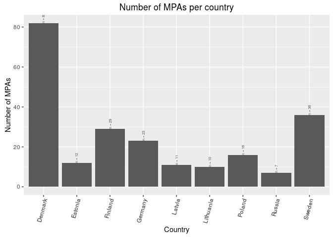
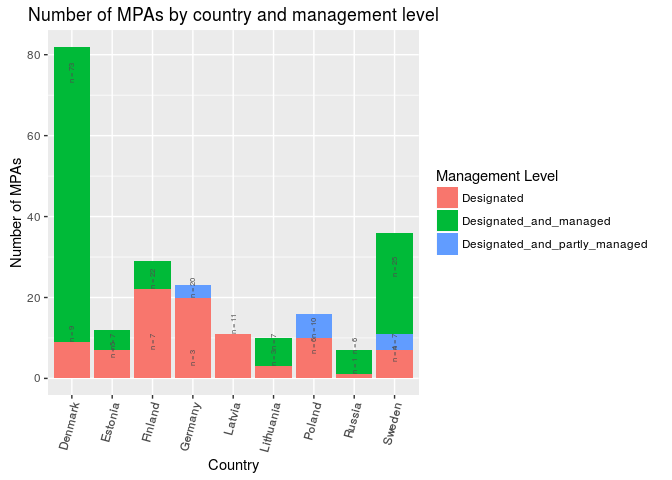

lsp\_prep
================

    ## 
    ## Attaching package: 'dplyr'

    ## The following objects are masked from 'package:stats':
    ## 
    ##     filter, lag

    ## The following objects are masked from 'package:base':
    ## 
    ##     intersect, setdiff, setequal, union

    ## Loading required package: DBI

1. Background on MPA data
-------------------------

### 1.1 Why MPAs?

2. MPA data
-----------

### 2.1 Data source

#### 2.1.1 Shapefiles of MPA area

Shapefiles of current MPA areas were downloaded from [HELCOM MPAs Map Service](http://mpas.helcom.fi/apex/f?p=103:17::::::).
 - Need to confirm date downloaded and date these data were last updated.

#### 2.1.2 Management plan status csv

The status of the management plans associated with each MPA were downloaded from HELCOM's \[MPA database\] (<http://mpas.helcom.fi/apex/f?p=103:40>::::::) under the *Management Plans* tab. Data were downloaded on 15 April 2016.
 - Key columns in this csv file are "Site name" (MPA name) and "Management Plan status"

There are three levels of management plan status that can be assigned to each MPA: *No plan*, *In development*, *Implemented*.

A challenge is that each MPA can have multiple management plans associated with it. There is no limit to the number of plans not an ability to assess their relative importance. Different management plans for the same MPA can have different levels of implementation.

\*\*How to use this information*?*

3. LSP goal model overview
--------------------------

### 3.1 Status

Xlsp\_country = sum(w\_i \* MPA area)\_m / Reference\_pt\_country
 - Numerator is the sum over all MPAs within a country's EEZ of the MPA area weighted by the management status.
 - w\_i = value between 0 -1
 - Need to assign weights to levels of management status.
 - **One option**: *No plan* = 0.3, *In development* = .6, *Implemented* = 1.0. **NEED FEEDBACK** - Each country's status is applied to all BHI regions associated with that country.

Reference\_pt\_country = 10% of the area in a country's EEZ is designated as an MPA and is 100% managed = 10% area country's EEZ
 - This is based on the Convention on Biodiversity [target](https://www.cbd.int/sp/targets/rationale/target-11/)

### 3.2 Trend

##### 3.2.1 Alternative 1

MPA dbf contains the date the MPA was established. Therefore, we can calculate the cumulative area over time that are MPAs. We can fit a cum. area ~ year. Calculate cumulative area from ealiest year of MPA established (1976) but for trend use the most recent 10 year period (2004 - 2013)? It appears that countries mostly designate MPAs in chunks.

Only allow a positive slope since countries are not removing mpas? This would be automatic since regressing cumulative area on year (and have no info on areas removed). Also, if country reaches 10% goal, then the rate at which new area is added should go to zero. Then it is okay to have zero slope because the status will not decline in future - the required area has been allocated and status can only improve if all areas are managed. Then score of 100 is achieved.

Cum\_area\_y = sum of all MPA areas established from year 1 to year y

Cum\_area\_y = m\*year\_y + b; m = slope

Trend = Future\_year \* m ; future\_year = 5

How to rescale trend? If all values are between 0-1, do we need to rescale?

#### 3.2.2 Alterative 2

There is limited information on MPA area from previous assessments. Need to read historic overview provided in [Baltic Sea Environment Proceedings NO. 124B Towards an ecologically coherent network of well-managed Marine Protected Areas](http://www.helcom.fi/lists/publications/bsep124b.pdf). Use this for the trend? If area increasing, get positive trend?

4. MPA data prep
----------------

Prep data layer

Read in MPA and BHI regions shapefiles
--------------------------------------

Also, get them in the same coordinate reference system for the Baltic.

The MPA file is in the [LAEA coordinate reference system](http://spatialreference.org/ref/epsg/etrs89-etrs-laea/).

    ## OGR data source with driver: ESRI Shapefile 
    ## Source: "/home/shares/ohi/git-annex/Baltic/BHI_MCG_shapefile", layer: "BHI_MCG_11052016"
    ## with 42 features
    ## It has 6 fields

    ## OGR data source with driver: ESRI Shapefile 
    ## Source: "/home/shares/ohi/git-annex/Baltic/bhi_MPA", layer: "HELCOM_MPAs"
    ## with 163 features
    ## It has 14 fields

Intersect BHI and HELCOM\_MPA polygons
--------------------------------------

MPA regions were divided by with BHI region shape file, and thus we were able to calculate the total MPA area within each BHI region. MPA area per region is saved in the prep folder (\`mpa\_area\_per\_rgn.csv).

The csv. file includes information: Area per MPA, Date established, MPA status, total MPA area per region.


Status Calculation
------------------

There are three types of management status (and their corresponding weight): Designated (0.3), Designated and Partially Managed (0.6), and Designated and Managed (1).

MPS management status data comes from ( ...?...). While combining MPA management data with MPA area data from the shapefile, 7 MPAs from the shapefile did not have a match from the management dataset. For those MPAs, status from the shapefile, which were not as detailed and updated as the status data, were used:

<table style="width:40%;">
<colgroup>
<col width="6%" />
<col width="8%" />
<col width="8%" />
<col width="8%" />
<col width="8%" />
</colgroup>
<thead>
<tr class="header">
<th align="left">MPA</th>
<th align="left">BSPA_ID</th>
<th align="left">BHI_ID</th>
<th align="left">Country</th>
<th align="left">Status</th>
</tr>
</thead>
<tbody>
<tr class="odd">
<td align="left">Torhamns Archipelago</td>
<td align="left">110</td>
<td align="left">14</td>
<td align="left">Sweden</td>
<td align="left">Designated</td>
</tr>
<tr class="even">
<td align="left">Walkyriengrund</td>
<td align="left">171</td>
<td align="left">10</td>
<td align="left">Germany</td>
<td align="left">Designated</td>
</tr>
<tr class="odd">
<td align="left">Ostseeküste am Brodtener Ufer</td>
<td align="left">178</td>
<td align="left">10</td>
<td align="left">Germany</td>
<td align="left">Designated</td>
</tr>
<tr class="even">
<td align="left">Fehmarnbelt</td>
<td align="left">180</td>
<td align="left">7</td>
<td align="left">Germany</td>
<td align="left">Designated</td>
</tr>
<tr class="odd">
<td align="left">Kadetrinne</td>
<td align="left">181</td>
<td align="left">12</td>
<td align="left">Germany</td>
<td align="left">Designated</td>
</tr>
<tr class="even">
<td align="left">Jasmund National Park</td>
<td align="left">2</td>
<td align="left">13</td>
<td align="left">Germany</td>
<td align="left">Managed</td>
</tr>
<tr class="odd">
<td align="left">Vorpommersche Boddenlandshaft National Park (West-Pommeranian Lagoon National Park)</td>
<td align="left">3</td>
<td align="left">13</td>
<td align="left">Germany</td>
<td align="left">Managed</td>
</tr>
</tbody>
</table>

*The last two MPAs in Germany were assigned the weight of 0.6, the same as "Designated and Partially Managed".*

``` r
mgmt_weight = data.frame( mgmt_status = c("Designated", "Designated_and_partly_managed", "Designated_and_managed", "Managed"),
                          weight = c(0.3, 0.6, 1, 0.6) )

mpa_mgmt_with_wt = full_join( mgmt_weight, mpa_mgmt, 
                              by = 'mgmt_status') 
```

    ## Warning in outer_join_impl(x, y, by$x, by$y): joining character vector and
    ## factor, coercing into character vector

``` r
status_by_country = mpa_mgmt_with_wt %>%
                 dplyr::select(BSPA_ID, country, eez_area_km2, mpa_area_km2, weight) %>%
                 filter(!duplicated(BSPA_ID)) %>% #remove duplicated rows of the same MPA 
                 group_by(country) %>%
                 summarize(total_eez_km2 = sum(eez_area_km2), 
                           sum_wt_mpa_area = sum(mpa_area_km2 * weight)) %>%
                 ungroup %>%
                 mutate(ref = 0.1 * total_eez_km2, 
                        status = round(sum_wt_mpa_area / ref *100, 1)) %>%
                 dplyr::select(country, 
                        status)

# status by BHI_ID to be uploaded to layers folder

r.status = mpa_mgmt_with_wt %>%
           filter(!duplicated(BHI_ID)) %>%
           dplyr::select(rgn_id = BHI_ID, 
                  country) %>%
           full_join(status_by_country, 
                     by = 'country') %>% 
           dplyr::select(rgn_id, 
                         score = status) %>%
           mutate(dimension = 'status') 
                  
write_csv(r.status, file.path(dir_prep, 'lsp_status_by_rgn.csv'))

# # to save a cleaned version of mpa_mgmt_with_wt as a separate csv file? 
# mpa_mgmt_with_wt_cleaned = mpa_mgmt_with_wt %>%
#                            select(name = name_shape, 
#                                   BHI_ID, 
#                                   BSPA_ID, 
#                                   country, 
#                                   mpa_area_km2, 
#                                   eez_area_km2, 
#                                   mgmt_status, 
#                                   weight, 
#                                   date_est)
```

The following graphs show LSP status by country and by BHI ID, as well as the distribution of MPAs by country and by country and management levels.

``` r
## plot status by country

status_by_country_plot <- ggplot(status_by_country, aes(x = country, y = status)) +
 geom_bar(stat = 'identity') +
 theme(axis.text.x = element_text(angle = 75, hjust = 1)) + 
 labs(title = 'LSP status by country',
      x = 'Country', 
      y = 'LSP status')

print(status_by_country_plot)
```


``` r
## plot status by BHI_ID

status_by_BHI_ID_plot <- ggplot(r.status, aes(x = rgn_id, y = score)) +
 geom_bar(stat = 'identity') +
 theme(axis.text.x = element_text(angle = 75, hjust = 1)) + 
 labs(title = 'LSP status by BHI ID',
      x = 'BHI ID', 
      y = 'LSP status')

print(status_by_BHI_ID_plot)
```

    ## Warning: Removed 1 rows containing missing values (position_stack).


``` r
## plot the number of MPAs per country

num_mpa_per_country = mpa_mgmt %>%
                      group_by(country) %>%
                      summarize(count = length(!duplicated(name_shape))) %>%
                      ungroup 

mpa_per_country_plot <- ggplot(num_mpa_per_country, aes(x = country, y = count)) +
 geom_bar(stat = 'identity') +
 geom_text(aes(label = sprintf('n = %s', count), y = count), 
           size = 2, 
           angle = 90, hjust = 0, color = 'grey30') +
 theme(axis.text.x = element_text(angle = 75, hjust = 1)) + 
 labs(title = 'Number of MPAs per country',
      x = 'Country', 
      y = 'Number of MPAs')

print(mpa_per_country_plot)
```



``` r
## plot number of MPAs per country by mgmt levels 

mgmt_weight_alt = data.frame( mgmt_status = c("Designated", "Designated_and_partly_managed",           "Designated_and_managed"),
                          weight = c(0.3, 0.6, 1) ) # ignore "managed" category 

num_mpa_per_country_mgmt = mpa_mgmt_with_wt %>%
                           group_by(country, weight) %>%
                           summarize(count = length(!duplicated(name_shape))) %>%
                           ungroup %>%
                           full_join(mgmt_weight_alt, by = "weight")

num_country_mgmt_plot <- ggplot(num_mpa_per_country_mgmt, aes(x = country, y = count, fill = mgmt_status)) +
 geom_bar(stat = 'identity') +
 geom_text(aes(label = sprintf('n = %s', count), y = count), 
           size = 2, 
           angle = 90, hjust = 0, color = 'grey30') +
 theme(axis.text.x = element_text(angle = 75, hjust = 1)) + 
 labs(title = 'Number of MPAs by country and management level',
      x = 'Country', 
      y = 'Number of MPAs',
      fill = 'Management Level')

print(num_country_mgmt_plot)
```



Trend calculation
-----------------

Cum\_area\_y = sum of all MPA areas established from year 1 to year y

Cum\_area\_y = m\*year\_y + b; m = slope

Trend = Future\_year \* m ; future\_year = 5

TODO: see the three trials of trend calculation...

``` r
# load trend data: For most countries, there were 1-3 years of data in random years. linear model doesn't work on the original data.  Use complete and fill to fill in the blank years. 

trend_data = mpa_mgmt %>%
  dplyr::select(name = name_shape, BSPA_ID, BHI_ID, country, date_est, mpa_area_km2) %>%
  filter(!date_est == 'NA') %>% # remove one Russian MPA that has no date of establishment
  filter(!duplicated(BSPA_ID)) %>% # remove duplicated rows of the same MPA area data
  mutate(year = ifelse(date_est <2004, 2004, date_est)) %>% # select the most recent 10 years of data (2004 - 2013). any year prior to 2004 is treated as 2004. 
  group_by(country, year) %>%
  summarize(area_total = sum(mpa_area_km2)) %>%
  mutate(area_cumulative = cumsum(area_total)) %>%
  ungroup 

write_csv(trend_data, file.path(dir_lsp, 'cumulative_mpa_area_trend_data.csv'))
          
## plot: didn't work. 
# mpa_area_by_year <- ggplot(trend_data, aes(x = country, y = area_cumulative, fill = year)) +
#  geom_bar(stat = 'identity') +
#  geom_text(aes(label = sprintf('n = %s', area), y = area_cumulative), 
#            size = 2, 
#            angle = 90, hjust = 0, color = 'grey30') +
#  theme(axis.text.x = element_text(angle = 75, hjust = 1)) + 
#  labs(title = '',
#       x = 'Country', 
#       y = 'Number of MPAs',
#       fill = 'Management Level')
# 
# print(mpa_area_by_year)

## TRY 1: fill in missing data from 2004-2013. Many countries started with 0 km2 MPA or very low in 2004, and all trends are therefore 1. I don't think this is a good approach for trend... 

trend_data_1 = trend_data %>%
  mutate(year = as.integer(year)) %>%
  tidyr::complete(year = full_seq(year, 1), nesting(country)) %>%
  group_by(country) %>%
  fill(area_cumulative) %>%
  mutate(area_cumulative = ifelse(is.na(area_cumulative), 0, area_cumulative))

  
r.trend.1 = trend_data_1 %>%
  group_by(country) %>%
  filter(!length(year) == 1) %>%
  do(dlm = lm(area_cumulative ~ year, data = .)) %>%
  mutate(score = pmax(-1, pmin(1, coef(dlm)[['year']]*5))) %>% 
  ungroup %>%
  dplyr::select(country, score); #head(r.trend.1)

#     country score

# 1   Denmark     1
# 2   Estonia     1
# 3   Finland     1
# 4   Germany     1
# 5    Latvia     1
# 6 Lithuania     1
# 7    Poland     1
# 8    Russia     1
# 9    Sweden     1


## TRY 2: use the most recent 5 years of cumulative area data to draw a trend. Trend is either 1 or 0. 

r.trend.2 = trend_data_1 %>%
  filter(year > (max(year) - 5)) %>% # most recent 5 years of data (2009- 2013)
  group_by(country) %>%
  do(dlm = lm(area_cumulative ~ year, data = .)) %>%
  mutate(score = round(pmax(-1, pmin(1, coef(dlm)[['year']]*5))), 1) %>% 
  ungroup %>%
  dplyr::select(country, score); #head(r.trend.2)

#     country score
# 1   Denmark     0
# 2   Estonia     0
# 3   Finland     0
# 4   Germany     0
# 5    Latvia     1
# 6 Lithuania     1
# 7    Poland     0
# 8    Russia     0
# 9    Sweden     1

## TRY 3:calculate the status of the past five years and draw a trend for those years. 

# status_per_year_by_country = mpa_mgmt_with_wt %>%
#                  dplyr::select(BSPA_ID, country, eez_area_km2, mpa_area_km2, weight, year = date_est) %>%
#                  filter(!duplicated(BSPA_ID)) %>% #remove duplicated rows of the same MPA 
#                  group_by(country) %>%
#                  mutate(total_eez_km2 = sum(eez_area_km2), 
#                         cum_wt_mpa_are = cumsum(mpa_area_km2)) %>%
#                  ungroup %>%
#                  group_by(country, year) %>%
#                  mutate(sum_wt_mpa_area = sum(mpa_area_km2 * weight),
#                         ref = 0.1 * total_eez_km2, 
#                         status = round(sum_wt_mpa_area / ref *100, 1)) %>%
#                  filter(!duplicated(year)) %>%
#                  dplyr::select(country, 
#                                year,
#                                status) %>%
#                  ungroup 
# 
# trend_data_3 = status_per_year_by_country %>%
#   filter(!is.na(year)) %>% # one russian MPA didn't have info on established year
#   mutate(year = as.integer(year)) %>%
#   tidyr::complete(year = full_seq(year, 1), nesting(country)) %>%
#   group_by(country) %>%
#   fill(status) %>%
#   mutate(status = ifelse(is.na(status), 0, status)) 
# 
# r.trend.3 = trend_data_3 %>%
#   filter(year > (max(year) - 5)) %>% # most recent 5 years of data (2009- 2013)
#   group_by(country) %>%
#   do(dlm = lm(status ~ year, data = .)) %>%
#   # mutate(score = coef(dlm[['year']]))
#   mutate(score = pmax(-1, pmin(1, coef(dlm[['year']])*5))) 
```
