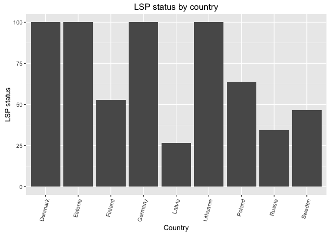
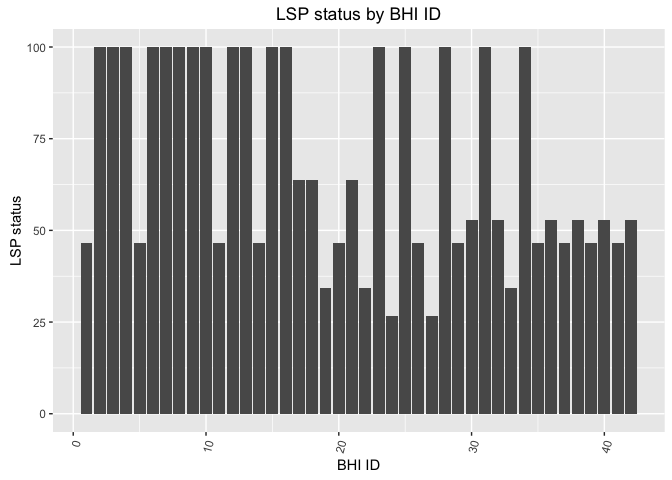

lsp\_prep
================

-   [Preparation of Data Layers for Lasting Special Places (LSP)](#preparation-of-data-layers-for-lasting-special-places-lsp)
    -   [1. Background](#background)
        -   [1.1 Why use MPAs?](#why-use-mpas)
    -   [2. MPA data](#mpa-data)
        -   [2.1 Data source](#data-source)
    -   [3. LSP goal model overview](#lsp-goal-model-overview)
        -   [3.1 Status](#status)
        -   [3.2 Trend calculation](#trend-calculation)
    -   [4. MPA data prep](#mpa-data-prep)
        -   [4.1 Set-up directories](#set-up-directories)
        -   [4.2 Read in MPA and BHI regions shapefiles](#read-in-mpa-and-bhi-regions-shapefiles)
        -   [4.3 Intersect BHI and HELCOM\_MPA polygons](#intersect-bhi-and-helcom_mpa-polygons)
        -   [4.3 MPA management status](#mpa-management-status)
        -   [4.4 Status Calculation](#status-calculation)
        -   [4.1 Status Calculation Alternative 1 and data exploration](#status-calculation-alternative-1-and-data-exploration)
        -   [4.2 Status Calculation Alternative 2](#status-calculation-alternative-2)
        -   [4.3 Status Calculation Alternative 3](#status-calculation-alternative-3)
        -   [4.4 Comparative plot of Status Calculation Alternatives](#comparative-plot-of-status-calculation-alternatives)
    -   [5. Trend calculation](#trend-calculation-1)
        -   [5.1 Alternative 1: Linear trend of cumulative MPA area](#alternative-1-linear-trend-of-cumulative-mpa-area)
        -   [5.2 Alternative 2: Linear trend of status scores](#alternative-2-linear-trend-of-status-scores)
        -   [5.3 Alternative 3: Difference between management status](#alternative-3-difference-between-management-status)
    -   [6. Prepate and write csv to layers](#prepate-and-write-csv-to-layers)

Preparation of Data Layers for Lasting Special Places (LSP)
===========================================================

**Lasting Special Places is a subgoal of Sense of Place (SP)**

1. Background
-------------

"This sub-goal focuses on those geographic locations that hold particular value for aesthetic, spiritual, cultural, recreational or existence reasons, and assesses how well they are protected. Ideally, you would be able to survey everyone in your region and produce a list of all the places they consider special, and then assess how well they are protected relative to a desired state. How well they are protected could be the percentage of area protected, and you could also find how well they are protected using other data. This sub-goal could also be based on the extent to which people participate in spiritual or religious activities in an area" [Reference](http://ohi-science.org/goals/#sense-of-place)

### 1.1 Why use MPAs?

The designation and management of marine protected areas (MPAs) captures the commitment of a country to preserving areas of biological, aesthetic or ecosystem service value. The designation of MPAs is also included in international agreements, such as the [Convention on Biodiversity's target](https://www.cbd.int/sp/targets/rationale/target-11/) for the designation of 10% of EEZs to be in MPAs.

2. MPA data
-----------

### 2.1 Data source

#### 2.1.1 Shapefiles of MPA areas

Shapefiles of current MPA areas were downloaded from [HELCOM MPAs Map Service](http://mpas.helcom.fi/apex/f?p=103:17::::::).

Downloaded 2 November 2015 last updated by HELCOM on the 27 August 2014 (according to file)

Shapefiles also provide an MPA status (e.g. designated or managed)

#### 2.1.2 Updated MPA management status

Data were downloaded from the [MPAs tab](http://mpas.helcom.fi/apex/f?p=103:5::::::) on the HELCOM MPA website.
Downloaded on Downloaded 9 June 2016. Status updates on the website are given for 2016.
There are three categories of MPA status: (1) designated
(2) designated and partly managed
(3) designated and managed

These MPA status levels depend upon the existence of implemented management plans for the MPA areas (see 2.1.3 below for more information).

This status is based upon self-reporting to HELCOM by each country.

#### 2.1.3 Additional data not currently used.

**Management plan status csv** The status of the management plans associated with each MPA were downloaded from HELCOM's \[MPA database\] (<http://mpas.helcom.fi/apex/f?p=103:40>::::::) under the *Management Plans* tab. Data were downloaded on 15 April 2016.
 - Key columns in this csv file are "Site name" (MPA name) and "Management Plan status"

There are three levels of management plan status that can be assigned to each MPA: *No plan*, *In development*, *Implemented*.

A challenge is that each MPA can have multiple management plans associated with it. There is no limit to the number of plans not an ability to assess their relative importance. Different management plans for the same MPA can have different levels of implementation.

#### 2.1.4 Other resources

[Baltic Sea Environment Proceedings NO. 124B Towards an ecologically coherent network of well-managed Marine Protected Areas](http://www.helcom.fi/lists/publications/bsep124b.pdf).

3. LSP goal model overview
--------------------------

### 3.1 Status

Status is calculated by country and a country's status is applied to all BHI regions associated with that country.

#### 3.1.1 Alternative 1

Xlsp\_country = sum(w\_i \* MPA area)\_m / Reference\_pt\_country
 - Numerator is the sum over all MPAs within a country's EEZ of the MPA area weighted by the management status.
 - w\_i = value between 0 -1

w\_i are based upon management status. 0.3 = designated 0.6 = designated and partly managed
1.0 designated and managed

Reference\_pt\_country = 10% of the area in a country's EEZ is designated as an MPA and is 100% managed = 10% area country's EEZ
 - This is based on the Convention on Biodiversity [target](https://www.cbd.int/sp/targets/rationale/target-11/)

**Problem with this approach, if a country designates more than 10% area but does not fully managed the MPA, can still achieve a score of 100**

#### 3.1.2 Alternative 2

Xlsp\_country = sum(w\_i \* MPA area)\_m / Reference\_pt\_country
 - Numerator is the sum over all MPAs within a country's EEZ of the MPA area weighted by the management status.
 - w\_i = value between 0 -1

w\_i are based upon management status. 0.1 = designated 0.6 = designated and partly managed
1.0 designated and managed

Reference\_pt\_country = 10% of the area in a country's EEZ is designated as an MPA and is 100% managed = 10% area country's EEZ
 - This is based on the Convention on Biodiversity [target](https://www.cbd.int/sp/targets/rationale/target-11/)

**Problem with this approach, if a country designates more than 10% area but does not fully managed the MPA, can still achieve a score of 100. However, because the weight for "designated"" is lower than in Alternative 1, it is more difficult to acheive a score of 100 without also have managed MPAs**

#### 3.1.3 Alternative 3

Xlsp\_country = geometric\_mean(Xlsp\_country\_mpa\_area\_score + Xlsp\_country\_mpa\_management\_score)

Xlsp\_country\_mpa\_area\_score = pmin(1,MPA\_area\_country / area\_10percent\_eez\_country) MPA\_area\_country = total MPA area in each country area\_10percent\_eez\_country = area that is 10% of a country's EEZ
*score cannot excede 1.0*

Xlsp\_country\_mpa\_management\_score =sum(w\_i \* MPA area)\_m / Reference\_pt\_country

w\_i are based upon management status, must be managed to count
0 = designated
0.6 = designated and partly managed
1.0 designated and managed

Reference\_pt\_country = 10% of the area in a country's EEZ is designated as an MPA and is 100% managed = 10% area country's EEZ
 - This is based on the Convention on Biodiversity [target](https://www.cbd.int/sp/targets/rationale/target-11/)

#### 3.1.4 Status and self-reporting

MPA status is based on self-reporting. If country's differ in their definitions of "managed" or inflate their MPA status, we cannot account for those biases in the data.

### 3.2 Trend calculation

##### 3.2.1 Alternative 1 - Linear trend of cumulative area

MPA dbf contains the date the MPA was established. Therefore, we can calculate the cumulative area over time that are MPAs. We can fit a cum. area ~ year. Calculate cumulative area from ealiest year of MPA established (1976) but for trend use the most recent 10 year period (2004 - 2013)? It appears that countries mostly designate MPAs in chunks.

Only allow a positive slope since countries are not removing mpas? This would be automatic since regressing cumulative area on year (and have no info on areas removed). Also, if country reaches 10% goal, then the rate at which new area is added should go to zero. Then it is okay to have zero slope because the status will not decline in future - the required area has been allocated and status can only improve if all areas are managed. Then score of 100 is achieved.

Cum\_area\_y = sum of all MPA areas established from year 1 to year y

Cum\_area\_y = m\*year\_y + b; m = slope

Trend = Future\_year \* m ; future\_year = 5

##### 3.2.3 Alternative 2 - Linear trend of status scores

Following the general definition of OHI trend (ie. percent change of status scores over the next five years), we calculated a linear trend of the status of the past five years and multiplied that by 5.

Percent\_status\_score\_change = m \* year\_y + b; m = slope

Trend = Future\_year \* m; Future\_ear = 5

##### 3.2.4 Alternative 3 - Difference between old and updated management status

MPA status data file from 06 June 2016 ontains more recent management status data than that from the MPA dbf file. The difference between management status weight between these two files can be used to represent trend.

-   if mgmt\_csv &gt; mgmt\_shape, trend = 0.2
-   if mgmt\_csv = mgmt\_shape, trend = 0
-   if mgmt\_csv &lt; mgmt\_shape, trend = -0.2

mgmt\_csv: MPA status from data file; mgmt\_shape: MPA status from dbf file

The logic here is straightforward, however, the criteria for management status in those two data sets were unclear. It would be hard to justify using two data sets that don't have the same grading criteria.

4. MPA data prep
----------------

Prep data layer

### 4.1 Set-up directories

### 4.2 Read in MPA and BHI regions shapefiles

Also, get them in the same coordinate reference system for the Baltic.

The MPA file is in the [LAEA coordinate reference system](http://spatialreference.org/ref/epsg/etrs89-etrs-laea/).

    ## OGR data source with driver: ESRI Shapefile 
    ## Source: "/home/shares/ohi/git-annex/Baltic/BHI_MCG_shapefile", layer: "BHI_MCG_11052016"
    ## with 42 features
    ## It has 6 fields

    ## OGR data source with driver: ESRI Shapefile 
    ## Source: "/home/shares/ohi/git-annex/Baltic/bhi_MPA", layer: "HELCOM_MPAs"
    ## with 163 features
    ## It has 14 fields

### 4.3 Intersect BHI and HELCOM\_MPA polygons

MPA regions were divided by with BHI region shape file, and thus we were able to calculate the total MPA area within each BHI region. MPA area per region is saved in the prep folder (\`mpa\_area\_per\_rgn.csv).

The csv. file includes information: Area per MPA, Date established, MPA status, total MPA area per region.


### 4.3 MPA management status

Joining information from the csv file (see Section 2.1.2) to the shapefile data.

While combining MPA management data with MPA area data from the shapefile, 7 MPAs from the shapefile did not have a match from the management dataset. For those MPAs, status from the shapefile, which were not as detailed and updated as the status data, were used:

<table style="width:40%;">
<colgroup>
<col width="6%" />
<col width="8%" />
<col width="8%" />
<col width="8%" />
<col width="8%" />
</colgroup>
<thead>
<tr class="header">
<th align="left">MPA</th>
<th align="left">BSPA_ID</th>
<th align="left">BHI_ID</th>
<th align="left">Country</th>
<th align="left">Status</th>
</tr>
</thead>
<tbody>
<tr class="odd">
<td align="left">Torhamns Archipelago</td>
<td align="left">110</td>
<td align="left">14</td>
<td align="left">Sweden</td>
<td align="left">Designated</td>
</tr>
<tr class="even">
<td align="left">Walkyriengrund</td>
<td align="left">171</td>
<td align="left">10</td>
<td align="left">Germany</td>
<td align="left">Designated</td>
</tr>
<tr class="odd">
<td align="left">Ostseeküste am Brodtener Ufer</td>
<td align="left">178</td>
<td align="left">10</td>
<td align="left">Germany</td>
<td align="left">Designated</td>
</tr>
<tr class="even">
<td align="left">Fehmarnbelt</td>
<td align="left">180</td>
<td align="left">7</td>
<td align="left">Germany</td>
<td align="left">Designated</td>
</tr>
<tr class="odd">
<td align="left">Kadetrinne</td>
<td align="left">181</td>
<td align="left">12</td>
<td align="left">Germany</td>
<td align="left">Designated</td>
</tr>
<tr class="even">
<td align="left">Jasmund National Park</td>
<td align="left">2</td>
<td align="left">13</td>
<td align="left">Germany</td>
<td align="left">Managed</td>
</tr>
<tr class="odd">
<td align="left">Vorpommersche Boddenlandshaft National Park (West-Pommeranian Lagoon National Park)</td>
<td align="left">3</td>
<td align="left">13</td>
<td align="left">Germany</td>
<td align="left">Managed</td>
</tr>
</tbody>
</table>

*The last two MPAs in Germany were assigned the weight of 0.6, the same as "Designated and Partially Managed".*

### 4.4 Status Calculation

### 4.1 Status Calculation Alternative 1 and data exploration

There are three types of management status (and their corresponding weight): Designated (0.3), Designated and Partially Managed (0.6), and Designated and Managed (1).

#### 4.1.1 Calulate the status

``` r
mgmt_weight = data.frame( mgmt_status = c("Designated", "Designated_and_partly_managed", "Designated_and_managed", "Managed"),
                          weight = c(0.3, 0.6, 1, 1) )

mpa_mgmt_with_wt = full_join( mgmt_weight, mpa_mgmt, 
                              by = 'mgmt_status') 
```

    ## Warning in full_join_impl(x, y, by$x, by$y, suffix$x, suffix$y): joining
    ## character vector and factor, coercing into character vector

``` r
### calculating the reference point: 10% total eez per country

eez_data = mpa_mgmt_with_wt %>%
                 dplyr::select(BSPA_ID, BHI_ID, country, eez_area_km2) %>%
                 filter(!duplicated(BSPA_ID)) %>% #remove duplicated rows of the same MPA
                 filter(!duplicated(BHI_ID)) %>%
                 group_by(country) %>%
                 summarize(total_eez_km2 = sum(eez_area_km2)) %>%
                 ungroup() %>%
                 mutate(ref_eez_km2 = 0.1*total_eez_km2) %>%
                 dplyr::select( -total_eez_km2)
  

### calculating cumulative mpa_area*weight, per country per year:
### cumulative_sum (weight * mpa_area_km2)

cum_mpa_area_wt = mpa_mgmt_with_wt %>%
                 dplyr::select(BSPA_ID, BHI_ID, weight, country, mpa_area_km2, year = date_est) %>%
                 filter(!is.na(year), 
                        !duplicated(BSPA_ID)) %>% # the same MPA could exist in different BHI_IDs 
                 group_by(country, year) %>%
                 dplyr::summarize(sum_mpa_wt = sum(mpa_area_km2*weight)) %>%
                 arrange(year) %>%
                 mutate(cum_mpa_wt = cumsum(sum_mpa_wt)) %>%
                 ungroup()

### caculating status per country per year: 
### cumulative_sum (weight * mpa_area_km2) / ref_point

status_per_year_by_country = full_join(cum_mpa_area_wt, eez_data, by = 'country') %>% 
  group_by(country, year) %>%
  summarize(status = round(max( -1, min(1, cum_mpa_wt/ref_eez_km2)) * 100, 1)) %>%
  ungroup() %>%
  arrange(country, year)

write_csv(status_per_year_by_country, file.path(dir_lsp, 'lsp_status_by_country_year.csv'))


# status by BHI_ID to be uploaded to layers folder
status_by_country = status_per_year_by_country %>%
  group_by(country) %>%
  filter(year == max(year)) %>%
  dplyr::select( -year) 

r.status = mpa_mgmt_with_wt %>%
           filter(!duplicated(BHI_ID)) %>%
           dplyr::select(rgn_id = BHI_ID, 
                  country) %>%
           full_join(status_by_country, 
                     by = 'country') %>% 
           dplyr::select(rgn_id, 
                         score = status) %>%
           mutate(dimension = 'status') 
                  
write_csv(r.status, file.path(dir_lsp, 'lsp_status_by_rgn.csv'))
```

#### 4.1.1 Area of each country with MPAs relative to 10% of the EEZ

Status was calculated as described in Section 3.1.1. In the plot, the red line reprsents where total MPA area equals that of the reference point (ie. 10% EEZ). Any ponit above that line mean that the country has exceeded the reference point of designated MPA area and therefore will receive a status score of 100, and any point below a lower score.

``` r
mpa_vs_eez = mpa_mgmt_with_wt %>%
  dplyr::select(BSPA_ID, country, mpa_area_km2, year = date_est) %>%
  filter(!is.na(year), 
         !duplicated(BSPA_ID)) %>%  # the same MPA could exist in different BHI_IDs 
  group_by(country, year)  %>%
  summarize(total_mpa_per_year = sum(mpa_area_km2)) %>%
  ungroup() %>%
  group_by(country) %>%
  mutate(total_mpa = cumsum(total_mpa_per_year)) %>%
  filter(year == max(year)) %>%
  full_join(dplyr::select(eez_data, country, ref_eez_km2), 
            by = 'country') %>%
  dplyr::select( -total_mpa_per_year, -year)
  
 mpa_vs_eez_plot <- ggplot(mpa_vs_eez, aes(x = ref_eez_km2, y = total_mpa)) +
 geom_point(aes(color = country), size = 3) +
 geom_abline(slope = 1, intercept = 0, color = 'red') +
 geom_text(aes(label = country), nudge_y = -300) +
 theme(legend.position = 'none') +
 coord_cartesian(xlim = c(0, 15000), ylim = c(0, 15000)) +
 labs(title = 'Total MPA vs. Reference EEZ area by country',
      x = '10% EEZ (km2)', 
      y = 'Total MPA (km2)')

print( mpa_vs_eez_plot)
```


#### 4.1.2 Plot Status Calculation Alternative 1

The following graphs show LSP status by country and by BHI ID, as well as the distribution of MPAs by country and by country and management levels.

``` r
## plot status by country

status_by_country_plot <- ggplot(status_by_country, aes(x = country, y = status)) +
 geom_bar(stat = 'identity') +
 theme(axis.text.x = element_text(angle = 75, hjust = 1)) + 
 labs(title = 'LSP status by country',
      x = 'Country', 
      y = 'LSP status')

print(status_by_country_plot)
```



``` r
## plot status by BHI_ID

status_by_BHI_ID_plot <- ggplot(r.status, aes(x = rgn_id, y = score)) +
 geom_bar(stat = 'identity') +
 theme(axis.text.x = element_text(angle = 75, hjust = 1)) + 
 labs(title = 'LSP status by BHI ID',
      x = 'BHI ID', 
      y = 'LSP status')

print(status_by_BHI_ID_plot)
```

    ## Warning: Removed 1 rows containing missing values (position_stack).



#### 4.1.3 Plot number of MPAs per country

``` r
## plot the number of MPAs per country

num_mpa_per_country = mpa_mgmt %>%
                      group_by(country) %>%
                      summarize(count = length(!duplicated(name_shape))) %>%
                      ungroup 

mpa_per_country_plot <- ggplot(num_mpa_per_country, aes(x = country, y = count)) +
 geom_bar(stat = 'identity') +
 geom_text(aes(label = sprintf('n = %s', count), y = count), 
           size = 2, 
           angle = 90, hjust = 0, color = 'grey30') +
 theme(axis.text.x = element_text(angle = 75, hjust = 1)) + 
 labs(title = 'Number of MPAs per country',
      x = 'Country', 
      y = 'Number of MPAs')

print(mpa_per_country_plot)
```


#### 4.1.4 Plot the number of MPAs per country by management level

``` r
## plot number of MPAs per country by mgmt levels 

mgmt_weight_alt = data.frame( mgmt_status = c("Designated", "Designated_and_partly_managed", "Designated_and_managed"),
                          weight = c(0.3, 0.6, 1) ) # ignore "managed" category 

num_mpa_per_country_mgmt = mpa_mgmt_with_wt %>%
                           group_by(country, weight) %>%
                           summarize(count = length(!duplicated(name_shape))) %>%
                           ungroup %>%
                           full_join(mgmt_weight_alt, by = "weight")

num_country_mgmt_plot <- ggplot(num_mpa_per_country_mgmt, aes(x = country, y = count, fill = mgmt_status)) +
 geom_bar(stat = 'identity') +
 geom_text(aes(label = sprintf('n = %s', count), y = count), 
           size = 2, 
           angle = 90, hjust = 0, color = 'grey30') +
 theme(axis.text.x = element_text(angle = 75, hjust = 1)) + 
 labs(title = 'Number of MPAs by country and management level',
      x = 'Country', 
      y = 'Number of MPAs',
      fill = 'Management Level')

print(num_country_mgmt_plot)
```


### 4.2 Status Calculation Alternative 2

Status was calculated as described in Section 3.1.2

#### 4.2.1 Calculate the status

``` r
mgmt_weight_2 = data.frame( mgmt_status = c("Designated", "Designated_and_partly_managed", "Designated_and_managed", "Managed"),
                          weight = c(0.1, 0.6, 1, 1) )
                          
mpa_mgmt_with_wt_2 = full_join( mgmt_weight, mpa_mgmt, 
                              by = 'mgmt_status') 
```

    ## Warning in full_join_impl(x, y, by$x, by$y, suffix$x, suffix$y): joining
    ## character vector and factor, coercing into character vector

``` r
### the reference point: 10% total eez per country - the same eez_data as in alternative 1 (4.1)
  
### calculating cumulative mpa_area*weight, per country per year:
### cumulative_sum (weight * mpa_area_km2)

cum_mpa_area_wt_2 = mpa_mgmt_with_wt_2 %>%
                 dplyr::select(BSPA_ID, BHI_ID, weight, country, mpa_area_km2, year = date_est) %>%
                 filter(!is.na(year), 
                        !duplicated(BSPA_ID)) %>% # the same MPA could exist in different BHI_IDs 
                 group_by(country, year) %>%
                 dplyr::summarize(sum_mpa_wt = sum(mpa_area_km2*weight)) %>%
                 arrange(year) %>%
                 mutate(cum_mpa_wt = cumsum(sum_mpa_wt)) %>%
                 ungroup()

### caculating status per country per year: 
### cumulative_sum (weight * mpa_area_km2) / ref_point

status_per_year_by_country_2 = full_join(cum_mpa_area_wt_2, eez_data, by = 'country') %>% 
  group_by(country, year) %>%
  summarize(status = round(max( -1, min(1, cum_mpa_wt/ref_eez_km2)) * 100, 1)) %>%
  ungroup() %>%
  arrange(country, year)

write_csv(status_per_year_by_country_2, file.path(dir_lsp, 'lsp_status_by_country_year_alt_2.csv'))


# status by BHI_ID to be uploaded to layers folder
status_by_country_2 = status_per_year_by_country_2 %>%
  group_by(country) %>%
  filter(year == max(year)) %>%
  dplyr::select( -year) 

r.status_2 = mpa_mgmt_with_wt_2 %>%
           filter(!duplicated(BHI_ID)) %>%
           dplyr::select(rgn_id = BHI_ID, 
                  country) %>%
           full_join(status_by_country, 
                     by = 'country') %>% 
           dplyr::select(rgn_id, 
                         score = status) %>%
           mutate(dimension = 'status') 
                  
write_csv(r.status_2, file.path(dir_lsp, 'lsp_status_by_rgn_alt_2.csv'))
```

#### 4.2.2 Plot status by country

``` r
## plot status by country

status_by_country_plot_2 <- ggplot(status_by_country_2, aes(x = country, y = status)) +
 geom_bar(stat = 'identity') +
 theme(axis.text.x = element_text(angle = 75, hjust = 1)) + 
 labs(title = 'LSP status by country - Alternative 2',
      x = 'Country', 
      y = 'LSP status')

print(status_by_country_plot_2)
```


``` r
## plot status by BHI_ID

status_by_BHI_ID_plot_2 <- ggplot(r.status_2, aes(x = rgn_id, y = score)) +
 geom_bar(stat = 'identity') +
 theme(axis.text.x = element_text(angle = 75, hjust = 1)) + 
 labs(title = 'LSP status by BHI ID',
      x = 'BHI ID', 
      y = 'LSP status')

print(status_by_BHI_ID_plot_2)
```

    ## Warning: Removed 1 rows containing missing values (position_stack).


### 4.3 Status Calculation Alternative 3

Status was calculated as described in Section 3.1.3. Status by country, and component scores are plotted separately.

``` r
### assign weight to management status

mgmt_weight_3 = data.frame( mgmt_status = c("Designated", "Designated_and_partly_managed", "Designated_and_managed", "Managed"),
                          weight = c(0, 0.6, 1, 1) )
                          
mpa_mgmt_with_wt_3 = full_join( mgmt_weight, mpa_mgmt, 
                              by = 'mgmt_status') 
```

    ## Warning in full_join_impl(x, y, by$x, by$y, suffix$x, suffix$y): joining
    ## character vector and factor, coercing into character vector

``` r
### Xlsp_country_mpa_management_score = sum(w_i * MPA area)_m / Reference_pt_country

#### calculating cumulative mpa_area*weight, per country per year:

cum_mpa_area_wt_3 = mpa_mgmt_with_wt_3 %>%
                 dplyr::select(BSPA_ID, BHI_ID, weight, country, mpa_area_km2, year = date_est) %>%
                 filter(!is.na(year), 
                        !duplicated(BSPA_ID)) %>% # the same MPA could exist in different BHI_IDs 
                 group_by(country, year) %>%
                 dplyr::summarize(sum_mpa_wt = sum(mpa_area_km2*weight)) %>%
                 arrange(year) %>%
                 mutate(cum_mpa_wt = cumsum(sum_mpa_wt)) %>%
                 ungroup()

#### calcualting status per year:

mpa_management_score = full_join(cum_mpa_area_wt_3, eez_data, by = 'country') %>% 
  group_by(country, year) %>%
  summarize(status = round(max( -1, min(1, cum_mpa_wt/ref_eez_km2)), 1)) %>%
  ungroup() %>%
  arrange(country, year)

### Xlsp_country_mpa_area_score = pmin(1,MPA_area_country / area_10percent_eez_country)
 
mpa_area_score = mpa_mgmt_with_wt %>%
   dplyr::select(BSPA_ID, BHI_ID, country, mpa_area_km2, year = date_est) %>%
   filter(!is.na(year), 
          !duplicated(BSPA_ID)) %>% 
   group_by(country, year) %>%
   dplyr::summarize(sum_mpa = sum(mpa_area_km2)) %>%
   arrange(year) %>%
   mutate(cum_mpa = cumsum(sum_mpa)) %>%  # calculate cumulative mpa area per year in each country
   ungroup() %>% 
   full_join(eez_data, # join with eez area data
            by = 'country') %>%
   mutate(country_mpa_area_score = pmin(1, cum_mpa/ref_eez_km2 ))

# Calculate: Xlsp_country_status = geometric_mean (Xlsp_country_mpa_area_score + Xlsp_country_mpa_management_score)
# Xlsp_country_mpa_management_score -> the same as status in status_per_year_by_country in alternative 1 (4.1)

##install.packages('psych')
library(psych)
```

    ## 
    ## Attaching package: 'psych'

    ## The following objects are masked from 'package:ggplot2':
    ## 
    ##     %+%, alpha

``` r
Xlsp_country_status = mpa_area_score %>%
  dplyr::select(country, 
                year,
                country_mpa_area_score) %>%
  full_join(mpa_management_score, 
            by = c('country', 'year')) %>%
  rename(mpa_mgmt_score = status) %>%
  mutate(status = round((country_mpa_area_score * (mpa_mgmt_score))^(1/2) * 100, 1)) %>%
  group_by(country) %>%
  filter(year == max(year)) %>%
  dplyr::select(-year)

write_csv(Xlsp_country_status, file.path(dir_lsp, 'lsp_status_by_country_year_alt_3.csv'))
```

#### 4.3.2 Plot status by country

``` r
status_by_country_plot_3 <- ggplot(Xlsp_country_status , aes(x = country, y = status)) +
 geom_bar(stat = 'identity') +
 theme(axis.text.x = element_text(angle = 75, hjust = 1)) + 
 labs(title = 'LSP status by country - Alternative 3',
      x = 'Country', 
      y = 'LSP status')

print(status_by_country_plot_3)
```


#### 4.3.3 Plot components separately by country

``` r
Xlsp_components_country = Xlsp_country_status %>%
  dplyr::select(-status) %>%
  gather(key = components, value = score, 2:3)

Xlsp_components_plot <- ggplot(Xlsp_components_country , aes(x = country, y = score, fill = components)) +
 geom_bar(position="dodge", stat = 'identity') +
 theme(axis.text.x = element_text(angle = 75, hjust = 1)) + 
 labs(title = 'LSP component score - Alternative 3',
      x = 'Country', 
      y = 'Score')

print(Xlsp_components_plot)
```


### 4.4 Comparative plot of Status Calculation Alternatives

Plot the three alternative status scores together for each country.

``` r
comparative_status = rename(status_by_country, 
                            status.1 = status) %>%
                     full_join(rename(status_by_country_2, 
                                      status.2 = status),
                                      by = 'country') %>% 
                    full_join(dplyr::select(Xlsp_country_status,
                                            country,
                                            status.3 = status), 
                              by = 'country') %>%
                    gather(key = approaches, value = status, 2:4)
  
comparative_status_plot <- ggplot(comparative_status, aes(x = country, y = status, fill = approaches)) +
 geom_bar(position="dodge", stat = "identity") +
 theme(axis.text.x = element_text(angle = 75, hjust = 1)) + 
 labs(title = 'LSP status by country - Comparison of 3 approaches',
      x = 'Country', 
      y = 'LSP status')

print(comparative_status_plot)
```


5. Trend calculation
--------------------

### 5.1 Alternative 1: Linear trend of cumulative MPA area

Linear model was used on total MPA area of 2004-2013. Area data was obtained from MPA dbf. Since countries started with 0 km2, or a small area of MPA in 2004, by 2013 all countries have reached 100% or higher increase in MPA areas (ie. trend score = 1).

``` r
area_trend_data = mpa_mgmt %>%
  dplyr::select(name = name_shape, BSPA_ID, BHI_ID, country, date_est, mpa_area_km2) %>%
  filter(!date_est == 'NA') %>% # remove one Russian MPA that has no date of establishment
  filter(!duplicated(BSPA_ID)) %>% # remove duplicated rows of the same MPA area data
  mutate(year = ifelse(date_est <2004, 2004, date_est)) %>% # select the most recent 10 years of data (2004 - 2013). any year prior to 2004 is treated as 2004. 
  group_by(country, year) %>%
  summarize(area_total = sum(mpa_area_km2)) %>%
  mutate(area_cumulative = cumsum(area_total)) %>%
  ungroup()

# write_csv(area_trend_data, file.path(dir_lsp, 'cumulative_mpa_area_trend_data.csv')) 

trend_data_1 = area_trend_data %>%
  mutate(year = as.integer(year)) %>%
  tidyr::complete(year = full_seq(year, 1), nesting(country)) %>%
  group_by(country) %>%
  fill(area_cumulative) %>%
  mutate(area_cumulative = ifelse(is.na(area_cumulative), 0, area_cumulative))

r.trend.1 = trend_data_1 %>%
  group_by(country) %>%
  filter(!length(year) == 1) %>%
  do(dlm = lm(area_cumulative ~ year, data = .)) %>%
  mutate(score = pmax(-1, pmin(1, coef(dlm)[['year']]))) %>% 
  ungroup %>%
  dplyr::select(country, score); #head(r.trend.1)

### plot r.trend.1
trend_1_plot <- ggplot(r.trend.1, aes(x = country, y = score)) +
 geom_bar(stat = 'identity') +
 theme(axis.text.x = element_text(angle = 75, hjust = 1)) + 
 labs(title = 'Trend score by country based on mpa area',
      x = 'Country', 
      y = 'Trend score')

print(trend_1_plot)
```


### 5.2 Alternative 2: Linear trend of status scores

Linear trend was drawn on the status scores of the past five years.

``` r
trend_data_2 = status_per_year_by_country %>%
  filter(!is.na(year)) %>% # one russian MPA didn't have info on established year
  mutate(year = as.integer(year)) %>%
  tidyr::complete(year = full_seq(year, 1), nesting(country)) %>%
  group_by(country) %>%
  fill(status) %>%
  mutate(status = ifelse(is.na(status), 0, status)) %>%
  ungroup()

r.trend.2 = trend_data_2 %>%
  filter(year > (max(year) - 5)) %>% # most recent 5 years of data (2009- 2013)
  group_by(country) %>%
  do(dlm = lm(status ~ year, data = .)) %>%
  mutate(score = round(pmax(-1, pmin(1, coef(dlm)[['year']]*5/100)), 1)) %>%
  dplyr::select(country, score) 

write_csv(r.trend.2,  file.path(dir_prep, 'lsp_trend_2.csv'))

### plot r.status.2
trend_2_plot <- ggplot(r.trend.2, aes(x = country, y = score)) +
 geom_bar(stat = 'identity') +
 theme(axis.text.x = element_text(angle = 75, hjust = 1)) + 
 labs(title = 'Trend score by country based on status scores',
      x = 'Country', 
      y = 'Trend score')

print(trend_2_plot)
```


### 5.3 Alternative 3: Difference between management status

The weight of management status from the shape file (mgmt\_shape; older) and that from the status data file (mgmt\_csv, newer) were compared, and the relative difference of the two was used to represent change:

``` r
mgmt_wt_csv = data.frame( status_csv = c("Designated", "Designated_and_partly_managed", "Designated_and_managed"),
                          weight_csv = c(0.3, 0.6, 1) )

mgmt_wt_shape = data.frame( status_shape = c("Designated", "Managed"), 
                            weight_shape = c(0.3, 1))
                              
trend_data_3 = mpa_mgmt %>%
  dplyr::select(BSPA_ID, status_csv, status_shape, BHI_ID, country) %>%
  full_join(mgmt_wt_csv) %>%
  full_join(mgmt_wt_shape) %>% 
  mutate(weight_csv = ifelse(is.na(weight_csv), weight_shape, weight_csv), 
         wt_combined = 0, 
         wt_combined = ifelse(weight_csv > weight_shape, 0.2, wt_combined),
         wt_combined = ifelse(weight_csv < weight_shape, -0.2, wt_combined)) %>%
  group_by(country) %>%
  filter(!duplicated(BSPA_ID)) %>%
  summarize(score = round(mean(wt_combined), 1)) %>%
  ungroup
```

    ## Joining, by = "status_csv"

    ## Warning in full_join_impl(x, y, by$x, by$y, suffix$x, suffix$y): joining
    ## factor and character vector, coercing into character vector

    ## Joining, by = "status_shape"

``` r
### plot trend_3 by country
trend_3_plot <- ggplot(trend_data_3, aes(x = country, y = score)) +
 geom_bar(stat = 'identity') +
 theme(axis.text.x = element_text(angle = 75, hjust = 1)) + 
 labs(title = 'Trend score by country based on comparison of managment status changes',
      x = 'Country', 
      y = 'Trend score')

print(trend_3_plot)
```

    ## Warning: Stacking not well defined when ymin != 0


``` r
### distribute trend scores to BHI_ID's 
r.trend.3 = mpa_mgmt %>%
  dplyr::select(rgn_id = BHI_ID, country) %>%
  full_join(trend_data_3)
```

    ## Joining, by = "country"

``` r
         # OR:
         # score = ifelse(weight_csv > weight_shape, 0.2, -0.2), 
         # score = ifelse(weight_csv = weight_shape, 0, score))

# write_csv(trend_data_4, file.path(dir_lsp, "trend_lsp_4.csv"))
```

6. Prepate and write csv to layers
----------------------------------
