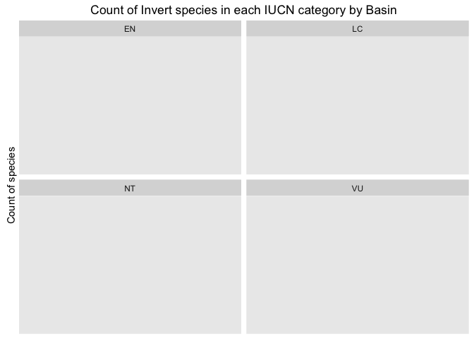
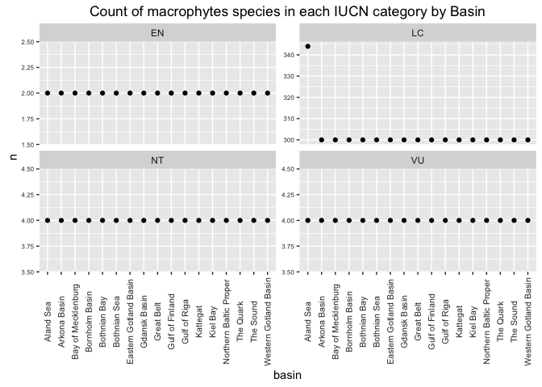
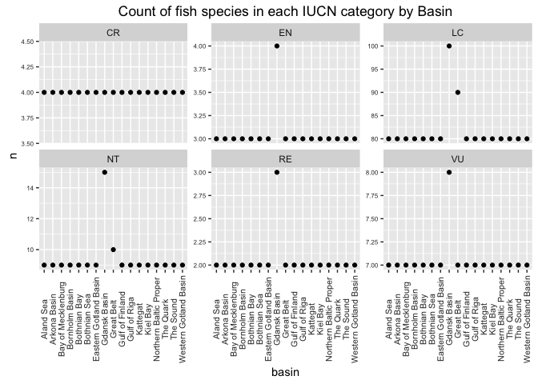

spp\_prep
================

-   [Preparation of SPP data layers](#preparation-of-spp-data-layers)
    -   [1. Background and Overview](#background-and-overview)
        -   [1.1 Species biodiversity](#species-biodiversity)
        -   [1.2 References](#references)
    -   [2. Data](#data)
        -   [2.1 Data sources and information for checklist data](#data-sources-and-information-for-checklist-data)
        -   [2.2 Data sources and information for HELCOM spatial data](#data-sources-and-information-for-helcom-spatial-data)
    -   [3. Goal model](#goal-model)
        -   [3.1 Goal status](#goal-status)
        -   [3.2 Goal trend](#goal-trend)
-   [Two alternative data sources and status calculations follow. Need to assess which is best.](#two-alternative-data-sources-and-status-calculations-follow.-need-to-assess-which-is-best.)
    -   [4. Data layer preparation with checklist distribution data](#data-layer-preparation-with-checklist-distribution-data)
        -   [4.1 Data organization](#data-organization)
        -   [4.2 Data attributes](#data-attributes)
    -   [only species from the checklist not on the redlist *Tribelos intextus* there is *Tribelos intextum* in redlist, not sure if this is a typo? Not including now](#only-species-from-the-checklist-not-on-the-redlist-tribelos-intextus-there-is-tribelos-intextum-in-redlist-not-sure-if-this-is-a-typo-not-including-now)
        -   [4.2.5.3 Select insecta species to include](#select-insecta-species-to-include)
        -   [4.2.5.4 Summarize to a family level](#summarize-to-a-family-level)
        -   [4.2.5.5 Plot Insecta family assigned threat](#plot-insecta-family-assigned-threat)
        -   [4.2.5.6 Join Insecta families to shared\_species list](#join-insecta-families-to-shared_species-list)
        -   [4.2.6 Plot the shared\_species list by threat category](#plot-the-shared_species-list-by-threat-category)
        -   [4.3 Select data for analysis](#select-data-for-analysis)
        -   [4.4 Score threat level](#score-threat-level)
        -   [4.5 Species distributions](#species-distributions)
        -   [4.6 Species distributions + Threat score](#species-distributions-threat-score)
        -   [4.6.1 Plot IUCN category by taxa and basin](#plot-iucn-category-by-taxa-and-basin)
        -   [4.6.2 Export shared\_species\_dist object](#export-shared_species_dist-object)
        -   [4.7 Status calculation by basin](#status-calculation-by-basin)
        -   [4.7.1 Calulate SPP status using checklist and redlist data with all species weighted equally](#calulate-spp-status-using-checklist-and-redlist-data-with-all-species-weighted-equally)
        -   [4.7.2 Calulate SPP status using checklist and redlist data by taxa group and geometric mean](#calulate-spp-status-using-checklist-and-redlist-data-by-taxa-group-and-geometric-mean)
        -   [4.8 Apply basin status to BHI regions](#apply-basin-status-to-bhi-regions)
    -   [5. Spatial data data layer preparation](#spatial-data-data-layer-preparation)
        -   [5.1 Data organization](#data-organization-1)
        -   [5.2 Data layer for functions.r](#data-layer-for-functions.r)
        -   [5.3 Status calcalculation](#status-calcalculation)
        -   [6. Send data layer to layers](#send-data-layer-to-layers)
    -   [7. Data layer considerations / concerns](#data-layer-considerations-concerns)
        -   [7.1 Aquatic insects](#aquatic-insects)
    -   [TO DO](#to-do)

Preparation of SPP data layers
==============================

**For Biodiverity goal**

1. Background and Overview
--------------------------

In the OHI framework, the Biodiversity goal (BD) has two subgoals- species (SPP) and habitats (HAB). In BHI, we use only SPP to represent BD.

### 1.1 Species biodiversity

"People value biodiversity in particular for its existence value. The risk of species extinction generates great emotional and moral concern for many people."

### 1.2 References

[Halpern et al. 2012. An index to assess the health and benefits of the global ocean. Nature 488: 615-620](http://www.nature.com/nature/journal/v488/n7413/full/nature11397.html)

[HELCOM Red List](http://www.helcom.fi/baltic-sea-trends/biodiversity/red-list-of-species) based on [IUCN criteria.](http://www.iucnredlist.org/technical-documents/categories-and-criteria).

**Threat categories** *Evaluated species* Extinct (EX)
Regionally Extinct (RE)
Extinct in the Wild (EW)
Critically Endangered (CR) Endangered (EN)
Vulnerable (VU)
Near Threatened (NT)
Least Concern (LC) Data Deficient (DD) Not Applicable (NA)
*Not-evaluated species* Not Evaluated (NE)

2. Data
-------

Two different data sources and goal calculation approaches are explored.

**Option 1** *See preparation in Section 4*
HELCOM provides species checklists for the Baltic that include distribution and a complete list of all species assessed with IUCN criteria.
*Pros for using these <data:*>
Much more representative set of species included for Baltic Sea biodiversity.
*Cons for using these <data:*>
Distribution is provided for most taxa groups at the basin scale - coaser resolution for calculation. Bird distribution is only by country (Germany has a couple of regions), therefore, will need additional expert information to allocate to basin or all bird species associated with a country will be allocated to all a country's BHI regions.

**Option 2** *See preparation in Section 5* HELCOM has spatial occurrence data layers for species and species are given an IUCN threat category.
*Pros for using these <data:*>
Data are spatially explicit, can score presence absence for each BHI region.
*Cons for using these <data:*>
These represent a very limited number of species in the Baltic (125 total) with the selection criteria being those with a spatial data layer in HELCOM. Many more species have been assessed using the IUCN criteria by HELCOM.

### 2.1 Data sources and information for checklist data

#### 2.1.1 Data sources

[HELCOM species checklists](http://helcom.fi/baltic-sea-trends/biodiversity/red-list-of-species) (see bottom right of page for links to excel sheets) were downloaded on 14 June 2016

Joni Kaitaranta (HELCOM) emailed the complete list of species assessed using IUCN red list criteria on 14 June 2016.

#### 2.1.2 Data folder

These data are in the folder 'SPP/data\_checklist\_redlist'

#### 2.1.3 Data treatment for presence/absence

Difference taxa groups had different levels and categorization of presence/absence. This is what is included as presence for BHI from the checklist.
*Breeding birds* presence = 'breeding' *Fish* presence = 'regular reproduction' or 'regular occurence, no reproduction'
*Macrophyte* presence = 'X'
*Mammal* presence = 'X'
*Invert* presence = 'X'

#### 2.1.4 Other notes

1.  Breeding birds list noted species that used to be present but are extinct in a separate category - identified as 0
2.  Fish are all occurrences since 1800 - so could have many temporary or extinct sp, Extinction not noted, exclude those labeled temporary.
3.  Macrophytes, Mammals, Inverts only have either X or blank.
4.  Macrophytes spp have many synonym names, manually combined so only the main latin name has all presence/absence occurences for all synonyms.

### 2.2 Data sources and information for HELCOM spatial data

Data extraction and prep was done by Melanie Frazer

#### 2.2.1 Data Sources

Species coverage and threat level data were obtained from the [HELCOM Biodiversity Map Service](http://maps.helcom.fi/website/Biodiversity/index.html) under 'Biodiversity' and then under 'Red List'.

Data were download in March 2016.

#### 2.2.2 Data extraction

Different taxa groups have different file types (grid files, polygons). Each species has a threat level assigned. Melanie worked to align taxa and species to BHI regions and assign the vulnerability code.

Folders associated with these data are:
- data
- intermediate
\_ raw

Scripts associated with these data are: - benthic\_extract.R
- bird\_data\_extract.R
- fish\_extract.R
- macrophyte\_extract.R
- mammal\_extract.R
- taxa\_combine.R

Melanie's notes on the data extraction process are below.

#### 2.2.3 Notes

##### 2.2.3.1 General Notes

**SPP data** For groups on the HELCOM grid (benthos): there is a key (prep/spatial/helcom\_to\_rgn\_bhi\_sea.csv) that translates the grid cells into baltic regions. The key was created using this script: prep/spatial/HELCOM\_2\_baltic.R.

For groups associated to HELCOM subbasin: this key was used to translate subbasins into baltic regions: prep/baltic\_rgns\_to\_bhi\_rgns\_lookup\_holas.csv

**If these data are used, need to translate to subbasins with the new shapefile matches, should be very similar**

Helcom species data downloaded from here: <http://maps.helcom.fi/website/Biodiversity/index.html> I added some subbasins to these data based on emails from Mar 21 email from Marc and Lena The data I added is incomplete.

The taxa\_combine.R combines the 5 taxonomic groups: benthos, birds, fish, mammals, macrophytes into a single data frame.

To calculate the SPP score, the IUCN codes will be converted to numeric scores and then averaged within each region.

To calculate the ICO score, the species will be subset based on what is considered an iconic species and then the IUCN codes will be converted to numeric scores, and than averaged within each region.

##### 2.2.3.2 Benthic data

Weird thing: you can download a map for each species, but all the species are included in each file. The only difference is that there is a unique html downloaded from IUCN for the species in question.

These data are in the format of polygons that are functionally rasters.

The corresponding benthic dbf file is saved as csv: benthos\_spatial\_data.csv

Painstakingly made a file to match the names in .shp file with the species names and vulnerability: benthic\_species.csv

##### 2.1.3.3 Bird data

There was no combined Helcom spatial file for birds (like there was for the benthic data).

One complication was that some species had data in the format of the "raster-style" polygons. While others were actual range polygons.

Given this, each bird spatial file was opened and then the range polygons were overlapped with the bhi regions.

NOTE: one bird species fell out of the bhi polygon areas and was excluded. I would probably ignore....but it might be worth figuring out.

The spatial files downloaded from Helcom are located here: /var/data/ohi/git-annex/Baltic/spp/Birds

The script used to open each bird file and associate the polygons with BHI regions is: bird\_data\_extract.R

The extracted bird data is here: intermediate/birds.csv

##### 2.2.3.4 Mammal data

There is a combined file for mammals. The ranges are described using polygons that relate to subbasins.

Some species have multiple IUCN categories (probably due to subspecies) It would be ideal if we know which categories correspond to which regions, but these data are not available. two possible options are: 1. average them 2. use the most conservative option I am going with \#2 for now, but this would be easy to change (code in mammal\_extract.R).

The script used to extract the data was: mammal\_extract.R The extracted mammal data are here: intermediate/mammals.R

##### 2.2.3.5 Fish data

There is a combined file for fish. The range data are polygons that correspond to subbasins.

##### 2.2.3.6 Macrophyte data

N=17 datapoints fell outside the water. This could probably be corrected by extracting the CELLCODES that land inland with some buffer.
Don't know if this is worth the effort...

3. Goal model
-------------

BD goal will only be based on the SPP sub-component

### 3.1 Goal status

#### 3.1.1 Checklist/redlist data goal model

Xspp\_b = geometric\_mean (Xspp\_b,t)

Xpp\_b,t = 1- (sum\[wi\_t,b\]/R\_t,b)

*b* = basin *t* = taxa group
*wi\_t,b* = threat weights for each species *i* in taxa group *t* in basin *b*
R\_t,b = Ref point = Total number of species in basin *b* for taxa group *t* (eg. score equals 1 when all species i have wi of LC)

Scale min value = score is 0 when 75% of species are extinct.\*
\*From Halpern et al 2012, SI. "We scaled the lower end of the biodiversity goal to be 0 when 75% species are extinct, a level comparable to the five documented mass extinctions"

wi from Halpern et al 2012, SI EX = 1.0
CR = 0.8
EN = 0.6
VU = 0.4
NT = 0.2
LC = 0 DD = not included, "We did not include the Data Deficient classification as assessed species following previously published guidelines for a mid-point approach"

#### 3.1.2 Spatial data goal model

Xspp\_r = 1- sum\[wi\]/R

wi = threat weights for each species i, R = total number of species in BHI region r
R = Ref point = Total number of species in region r (eg. score equals 1 when all species i have wi of LC)

Scale min value = score is 0 when 75% of species are extinct.\*
\*From Halpern et al 2012, SI. "We scaled the lower end of the biodiversity goal to be 0 when 75% species are extinct, a level comparable to the five documented mass extinctions"

wi from Halpern et al 2012, SI EX = 1.0
CR = 0.8
EN = 0.6
VU = 0.4
NT = 0.2
LC = 0 DD = not included, "We did not include the Data Deficient classification as assessed species following previously published guidelines for a mid-point approach"

**Will do above calculation for basin, not BHI region if use checklist distributions**

### 3.2 Goal trend

TBD

Two alternative data sources and status calculations follow. Need to assess which is best.
==========================================================================================

``` r
## Libraries
library(readr)
```

    ## Warning: package 'readr' was built under R version 3.2.4

``` r
library(dplyr)
```

    ## Warning: package 'dplyr' was built under R version 3.2.5

    ## 
    ## Attaching package: 'dplyr'

    ## The following objects are masked from 'package:stats':
    ## 
    ##     filter, lag

    ## The following objects are masked from 'package:base':
    ## 
    ##     intersect, setdiff, setequal, union

``` r
library(tidyr)
```

    ## Warning: package 'tidyr' was built under R version 3.2.5

``` r
library(ggplot2)
```

    ## Warning: package 'ggplot2' was built under R version 3.2.4

``` r
library(RMySQL)
```

    ## Warning: package 'RMySQL' was built under R version 3.2.5

    ## Loading required package: DBI

    ## Warning: package 'DBI' was built under R version 3.2.5

``` r
library(stringr)
library(tools)
library(rprojroot) # install.packages('rprojroot')
```

    ## Warning: package 'rprojroot' was built under R version 3.2.4

``` r
## source common libraries, directories, functions, etc
source('~/github/bhi/baltic2015/prep/common.r')

## rprojroot
root <- rprojroot::is_rstudio_project


## make_path() function to 
make_path <- function(...) rprojroot::find_root_file(..., criterion = is_rstudio_project)

dir_layers = make_path('baltic2015/layers') # replaces  file.path(dir_baltic, 'layers')


# root$find_file("README.md")
# 
# root$find_file("ao_need_gl2014.csv")
# 
# root <- find_root_file("install_ohicore.r", 
# 
# withr::with_dir(
#   root_file("DESCRIPTION"))


dir_spp    = file.path(dir_prep, 'SPP')

## add a README.md to the prep directory with the rawgit.com url for viewing on GitHub
create_readme(dir_spp, 'spp_prep.rmd')
```

4. Data layer preparation with checklist distribution data
----------------------------------------------------------

### 4.1 Data organization

#### 4.1.1 Read in data

``` r
bbirds = read.csv(file.path(dir_spp,'data_checklist_redlist/breedingbirds_dist_checklist.csv'), sep= ";", stringsAsFactors = FALSE)

fish = read.csv(file.path(dir_spp,'data_checklist_redlist/fish_dist_checklist.csv'), sep= ";", stringsAsFactors = FALSE)

invert = read.csv(file.path(dir_spp,'data_checklist_redlist/invert_dist_checklist.csv'), sep= ";", stringsAsFactors = FALSE)

invert_taxa_all = read.csv(file.path(dir_spp,'data_checklist_redlist/invert_dist_checklist_alltaxalevels.csv'), sep= ";", stringsAsFactors = FALSE) ## this is the same distribution data as in the "invert" object but all taxa levels are included in the csv so can be modified for insects

macrophytes = read.csv(file.path(dir_spp,'data_checklist_redlist/macrophytes_dist_checklist.csv'), sep= ";", stringsAsFactors = FALSE)

mammals = read.csv(file.path(dir_spp,'data_checklist_redlist/mammals_dist_checklist.csv'), sep= ";", stringsAsFactors = FALSE)


redlist = read.csv(file.path(dir_spp,'data_checklist_redlist/helcom_redlist_allspecies.csv'), sep= ";", stringsAsFactors = FALSE)
```

#### 4.1.2 Data structure

``` r
str(bbirds)
```

    ## 'data.frame':    57 obs. of  13 variables:
    ##  $ latin_name                           : chr  "Actitis hypoleucos" "Alca torda" "Anas clypeata" "Anas platyrhynchos" ...
    ##  $ Sweden                               : chr  "X" "X" "X" "X" ...
    ##  $ Finland                              : chr  "X" "X" "X" "X" ...
    ##  $ Russia.St..Petersburg                : chr  "X" "X" "X" "X" ...
    ##  $ Russia.Kaliningrad                   : chr  "X" "-" "X" "X" ...
    ##  $ Estonia                              : chr  "X" "X" "X" "X" ...
    ##  $ Latvia                               : chr  "X" "-" "X" "X" ...
    ##  $ Lithuania                            : chr  "X" "-" "X" "X" ...
    ##  $ Poland                               : chr  "X" "-" "X" "X" ...
    ##  $ Germany.Mecklenburg.Western.Pomerania: chr  "X" "-" "X" "X" ...
    ##  $ Germany.Schleswig.Holstein           : chr  "(X)" "-" "X" "X" ...
    ##  $ Denmark                              : chr  "X" "X" "X" "X" ...
    ##  $ common_name                          : chr  "Common sandpiper" "Razorbill" "Northern shoveler" "Mallard" ...

``` r
str(fish)
```

    ## 'data.frame':    240 obs. of  23 variables:
    ##  $ latin_name            : chr  "Myxine glutinosa" "Lampetra fluviatilis" "Petromyzon marinus" "Lamna nasus" ...
    ##  $ Kattegat              : chr  "R" "X" "X" "T" ...
    ##  $ Great.Belt            : chr  "" "T" "T" "T" ...
    ##  $ Little.Belt           : chr  "" "T" "T" "T" ...
    ##  $ Kiel.Bay              : chr  "" "X" "T" "T" ...
    ##  $ Bay.of.Mecklenburg    : chr  "" "X" "T" "" ...
    ##  $ The.Sound             : chr  "" "X" "X" "T" ...
    ##  $ Arkona.Basin          : chr  "" "X" "T" "" ...
    ##  $ Bornholm.Basin        : chr  "" "X" "X" "" ...
    ##  $ Western.Gotland.Basin : chr  "" "X" "T" "" ...
    ##  $ Eastern.Gotland.Basin : chr  "" "X" "T" "" ...
    ##  $ Gulf.of.Gdansk        : chr  "" "X" "T" "" ...
    ##  $ Vistula.Lagoon        : chr  "" "X" "T" "" ...
    ##  $ Curonian.Lagoon       : chr  "" "X" "T" "" ...
    ##  $ Gulf.of.Riga          : chr  "" "X" "T" "" ...
    ##  $ Northern.Baltic.Proper: chr  "" "X" "" "" ...
    ##  $ Gulf.of.Finland       : chr  "" "X" "T" "" ...
    ##  $ Aland.Sea             : chr  "" "X" "T" "" ...
    ##  $ Archipelago.Sea       : chr  "" "X" "T" "T" ...
    ##  $ Bothnian.Sea          : chr  "" "X" "T" "" ...
    ##  $ The.Quark             : chr  "" "X" "T" "" ...
    ##  $ Bothnian.Bay          : chr  "" "X" "" "" ...
    ##  $ common_name           : chr  "Hagfish" "River lamprey" "Sea lamprey" "Porbeagle" ...

``` r
str(invert)
```

    ## 'data.frame':    1898 obs. of  34 variables:
    ##  $ latin_name            : chr  "Abietinaria abietina" "Ablabesmyia longistyla" "Ablabesmyia monilis" "Ablabesmyia phatta" ...
    ##  $ Kattegat              : chr  "X" "" "" "" ...
    ##  $ The.Sound             : chr  "X" "" "" "" ...
    ##  $ Little.Belt           : chr  "" "" "" "" ...
    ##  $ Great.Belt            : chr  "" "" "" "" ...
    ##  $ Kiel.Bay              : chr  "" "" "" "" ...
    ##  $ Bay.of.Mecklenburg    : chr  "X" "" "" "" ...
    ##  $ Arkona.Basin          : chr  "X" "" "" "" ...
    ##  $ Bornholm.Basin        : chr  "" "" "" "" ...
    ##  $ Eastern.Gotland.Basin : chr  "" "" "" "" ...
    ##  $ Western.Gotland.Basin : chr  "" "" "" "" ...
    ##  $ Northern.Baltic.Proper: chr  "" "" "" "" ...
    ##  $ Aland.Sea             : chr  "" "" "" "" ...
    ##  $ Archipelago.Sea       : chr  "" "" "" "" ...
    ##  $ Bothnian.Sea          : chr  "" "" "" "" ...
    ##  $ The.Quark             : chr  "" "" "X" "" ...
    ##  $ Bothnian.Bay          : chr  "" "" "" "" ...
    ##  $ Gulf.of.Finland       : chr  "" "X" "X" "X" ...
    ##  $ Gulf.of.Gdansk        : chr  "" "" "" "" ...
    ##  $ Gulf.of.Riga          : chr  "" "" "" "" ...
    ##  $ Warnow.Estuary        : chr  "" "" "" "" ...
    ##  $ Wismar.Bay            : chr  "" "" "" "" ...
    ##  $ Trave.Estuary         : chr  "" "" "" "" ...
    ##  $ Kiel.Fjord            : chr  "" "" "" "" ...
    ##  $ Eckernförde.Bay       : chr  "" "" "" "" ...
    ##  $ Schlei.Estuary        : chr  "" "" "" "" ...
    ##  $ Flensburg.Fjord       : chr  "" "" "" "" ...
    ##  $ Vistula.Lagoon        : chr  "" "" "" "" ...
    ##  $ Szczecin.Lagoon       : chr  "" "X" "" "" ...
    ##  $ Greifswald.Lagoon     : chr  "" "" "" "" ...
    ##  $ Rugia.Lagoons         : chr  "" "" "" "" ...
    ##  $ Darss.Zingst.Lagoon   : chr  "" "" "" "" ...
    ##  $ Curonian.Lagoon       : chr  "" "" "X" "" ...
    ##  $ common_name           : logi  NA NA NA NA NA NA ...

``` r
str(invert_taxa_all)
```

    ## 'data.frame':    1898 obs. of  44 variables:
    ##  $ group                 : chr  "Hydrozoa" "Diptera" "Diptera" "Diptera" ...
    ##  $ kingdom               : chr  "Animalia" "Animalia" "Animalia" "Animalia" ...
    ##  $ phylum                : chr  "Cnidaria" "Arthropoda" "Arthropoda" "Arthropoda" ...
    ##  $ class                 : chr  "Hydrozoa" "Insecta" "Insecta" "Insecta" ...
    ##  $ order                 : chr  "Leptothecata" "Diptera" "Diptera" "Diptera" ...
    ##  $ family                : chr  "Sertulariidae" "Chironomidae" "Chironomidae" "Chironomidae" ...
    ##  $ genus                 : chr  "Abietinaria" "Ablabesmyia" "Ablabesmyia" "Ablabesmyia" ...
    ##  $ subgenus              : chr  "" "" "" "" ...
    ##  $ species               : chr  "abietina" "longistyla" "monilis" " phatta" ...
    ##  $ subspecies            : chr  "" "" "" "" ...
    ##  $ latin_name            : chr  "Abietinaria abietina" "Ablabesmyia longistyla" "Ablabesmyia monilis" "Ablabesmyia phatta" ...
    ##  $ common_name           : logi  NA NA NA NA NA NA ...
    ##  $ Kattegat              : chr  "X" "" "" "" ...
    ##  $ The.Sound             : chr  "X" "" "" "" ...
    ##  $ Little.Belt           : chr  "" "" "" "" ...
    ##  $ Great.Belt            : chr  "" "" "" "" ...
    ##  $ Kiel.Bay              : chr  "" "" "" "" ...
    ##  $ Bay.of.Mecklenburg    : chr  "X" "" "" "" ...
    ##  $ Arkona.Basin          : chr  "X" "" "" "" ...
    ##  $ Bornholm.Basin        : chr  "" "" "" "" ...
    ##  $ Eastern.Gotland.Basin : chr  "" "" "" "" ...
    ##  $ Western.Gotland.Basin : chr  "" "" "" "" ...
    ##  $ Northern.Baltic.Proper: chr  "" "" "" "" ...
    ##  $ Aland.Sea             : chr  "" "" "" "" ...
    ##  $ Archipelago.Sea       : chr  "" "" "" "" ...
    ##  $ Bothnian.Sea          : chr  "" "" "" "" ...
    ##  $ The.Quark             : chr  "" "" "X" "" ...
    ##  $ Bothnian.Bay          : chr  "" "" "" "" ...
    ##  $ Gulf.of.Finland       : chr  "" "X" "X" "X" ...
    ##  $ Gulf.of.Gdansk        : chr  "" "" "" "" ...
    ##  $ Gulf.of.Riga          : chr  "" "" "" "" ...
    ##  $ Warnow.Estuary        : chr  "" "" "" "" ...
    ##  $ Wismar.Bay            : chr  "" "" "" "" ...
    ##  $ Trave.Estuary         : chr  "" "" "" "" ...
    ##  $ Kiel.Fjord            : chr  "" "" "" "" ...
    ##  $ Eckernförde.Bay       : chr  "" "" "" "" ...
    ##  $ Schlei.Estuary        : chr  "" "" "" "" ...
    ##  $ Flensburg.Fjord       : chr  "" "" "" "" ...
    ##  $ Vistula.Lagoon        : chr  "" "" "" "" ...
    ##  $ Szczecin.Lagoon       : chr  "" "X" "" "" ...
    ##  $ Greifswald.Lagoon     : chr  "" "" "" "" ...
    ##  $ Rugia.Lagoons         : chr  "" "" "" "" ...
    ##  $ Darss.Zingst.Lagoon   : chr  "" "" "" "" ...
    ##  $ Curonian.Lagoon       : chr  "" "" "X" "" ...

``` r
str(macrophytes)
```

    ## 'data.frame':    532 obs. of  19 variables:
    ##  $ latin_name              : chr  "Ranunculus trichophyllus subsp. Eradicatus" "Porphyridium aerugineum 3" "Rhynchostegium riparioides" "Potamogeton pectinatus agg." ...
    ##  $ Kattegat                : int  0 0 0 0 1 1 1 0 1 1 ...
    ##  $ Great.Belt...Little.Belt: int  0 0 0 0 1 1 1 0 1 0 ...
    ##  $ Kiel.Bay                : int  0 0 0 0 0 1 1 0 0 0 ...
    ##  $ Bay.of.Mecklenburg      : int  0 0 0 0 0 0 0 0 0 0 ...
    ##  $ The.Sound               : int  0 0 0 0 1 1 1 0 1 0 ...
    ##  $ Arkona.Basin            : int  0 1 0 0 0 0 1 0 1 0 ...
    ##  $ Bornholm.Basin          : chr  "0" "0" "0" "0" ...
    ##  $ Western.Gotland.Basin   : int  0 0 0 0 0 0 1 0 0 0 ...
    ##  $ Eastern.Gotland.Basin   : int  0 0 0 0 0 0 0 0 0 0 ...
    ##  $ Gulf.of.Gdansk          : int  0 0 0 0 0 0 0 0 0 0 ...
    ##  $ Gulf.of.Riga            : int  0 0 0 0 0 0 0 0 0 0 ...
    ##  $ Nothern.Baltic.Proper   : chr  "0" "0" "0" "0" ...
    ##  $ Gulf.of.Finland         : int  1 0 0 0 0 0 1 1 0 0 ...
    ##  $ Aland.Sea               : int  0 0 0 0 0 0 1 0 0 0 ...
    ##  $ Archipelago.Sea         : int  1 0 0 0 0 0 0 0 0 0 ...
    ##  $ Bothnian.Sea...The.Quark: int  1 0 0 1 0 1 1 0 0 0 ...
    ##  $ Bothnian.Bay            : int  1 0 1 1 0 0 0 0 0 0 ...
    ##  $ common_name             : logi  NA NA NA NA NA NA ...

``` r
str(mammals)
```

    ## 'data.frame':    5 obs. of  21 variables:
    ##  $ latin_name                : chr  "Halichoerus grypus" "Phoca vitulina vitulina" "Pusa hispida" "Phocoena phocoena" ...
    ##  $ Kattegatt                 : chr  "x" "x" "" "x" ...
    ##  $ Great.Belt                : chr  "" "x" "" "x" ...
    ##  $ Little.Belt               : chr  "" "x" "" "x" ...
    ##  $ Kiel.Bay                  : chr  "x" "x" "" "x" ...
    ##  $ The.Bay.of.Mecklenburg    : chr  "x" "x" "" "x" ...
    ##  $ The.Sound                 : chr  "x" "x" "" "x" ...
    ##  $ Arkona.Basin              : chr  "x" "x" "" "x" ...
    ##  $ Bornholm.Basin            : chr  "x" "x" "" "x" ...
    ##  $ The.Eastern.Gotland.Basin : chr  "x" "" "" "x" ...
    ##  $ The.Western.Gotland.Basin : chr  "x" "" "" "x" ...
    ##  $ The.Northern.Baltic.Proper: chr  "x" "" "x" "x" ...
    ##  $ The.Gulf.of.Gda.sk        : chr  "x" "x" "" "x" ...
    ##  $ Gulf.of.Riga              : chr  "x" "" "x" "x" ...
    ##  $ Gulf.of.Finland           : chr  "x" "" "x" "x" ...
    ##  $ Archipelago.Sea           : chr  "x" "" "x" "x" ...
    ##  $ Aland.Sea                 : chr  "x" "" "x" "x" ...
    ##  $ The.Bothnian.Sea          : chr  "x" "" "x" "x" ...
    ##  $ The.Quark                 : chr  "x" "" "x" "" ...
    ##  $ Bothnian.Bay              : chr  "x" "" "x" "" ...
    ##  $ common_name               : chr  "grey seal / gray seal" "harbour seal / common seal" "ringed seal" "harbour porpoise" ...

``` r
str(redlist)
```

    ## 'data.frame':    2809 obs. of  5 variables:
    ##  $ latin_name     : chr  "Aglaothamnion bipinnatum Feldmann-Mazoyer 1941" "Actitis hypoleucos (Linnaeus, 1758)" "Nephasoma (Nephasoma) abyssorum abyssorum" "Ranunculus trichophyllus subsp. eradicatus" ...
    ##  $ assessment_unit: chr  "Species" "Breeding" "Species" "Species" ...
    ##  $ helcom_category: chr  "LC" "NT" "LC" "LC" ...
    ##  $ iucn_criteria  : chr  "" "A2ab" "" "" ...
    ##  $ taxa_group     : chr  "macrophytes" "breeding birds" "invert" "macrophytes" ...

#### 4.1.3 Translate code to presence/absence

Objective is to get a data layer of current species occurence.

Each taxa group has a different code for noting distribution in different regions. Translate to a 1 or 0 for presence absence then gather to long format

##### 4.1.3.1 Breeding birds

X = breeding
(X) = sporadic breeding (only occasional breeding records)
0 = extinct (breeding in the past, but no actual breeding records)
0 = sporadic breeder in the past, no breeding records during the last 3 generations or 10 years
0(X) = extinct as a regular breeder, but sporadic breeding records during the last 3 generations or 10 years
- = no breeding birds

**For BHI:** *X = 1* and *all others = 0*

``` r
## gather birds to long format
bbirds_long = bbirds %>%
              gather(location,presence,-latin_name,-common_name)%>%
              mutate(presence = ifelse(presence == "X", 1, 0))%>% ##change X to present (1) all else absent (0)
              mutate(taxa_group = "breeding birds")
```

##### 4.1.3.2 Fish and Lamprey

R = regular reproduction
X = regular occurrrence, no reproduction
T = temporary occurrence
? = occurrance uncertain

**For BHI:** *R or X = 1* and *T or ? = 0*

``` r
## clean up fish data (had ? not removed), gather to long format
fish_long = fish %>%
            mutate(latin_name =str_replace(latin_name,"\\*",""))%>% ## remove * at end of latin name
            gather(location,presence,-latin_name,-common_name)%>%
            mutate(presence = ifelse(presence == "R", 1, 
                              ifelse(presence == "X", 1, 0)))%>%
            mutate(taxa_group = "fish")
```

##### 4.1.3.3 Invertebrates

X = ocurrance
'blank' = no occurance

**For BHI:** *X = 1* and *blank = 0*

Invertebrates pose a problem that some Insecta are indentified to *Genus species* in some regions (eg Gulf of Finland) but likely not assessed by monitoring programs everywhere with such high spatial resolution.

Originally, we coded the status to use all species level data (eg. use the invert\_long object below). Now the code will be updated. Insecta will only be considered at the Family level. Because the redlist is only assessed at the species level, we will extract information for all Insecta species. The species with a the highest threat (most vulnerable species) in a family will be used as the threat level for the entire family.

``` r
## gather invert  to long format
invert_long = invert %>%
              gather(location,presence,-latin_name,-common_name)%>%
              mutate(presence = ifelse(presence == "X", 1, 0))%>% 
              mutate(taxa_group = "invert")


## clean invert taxa all
invert_taxa_all_long = invert_taxa_all %>%
                       select(-group,-kingdom,-phylum,-subgenus,-species,-subspecies)%>%
                       gather(location, presence, -class, -order,-family,-genus,-latin_name,-common_name)%>%
                       mutate(presence = ifelse(presence == "X", 1, 0))%>% 
                       mutate(taxa_group = "invert")

invert_taxa_all_long_noinsect = invert_taxa_all_long %>%
                                filter(class != "Insecta")%>%
                                select(latin_name,common_name,location,presence, taxa_group)
                        
dim(invert_taxa_all_long_noinsect);dim(invert_taxa_all_long)
```

    ## [1] 48960     5

    ## [1] 60736     9

``` r
invert_taxa_all_long_insect = invert_taxa_all_long %>%
                                filter(class == "Insecta")%>%
                                select(family,latin_name,common_name,location,presence, taxa_group)
```

##### 4.1.3.4 Macrophytes

1 = occurance 0 = no occurance uncertain = had a note in checklist about checking the distribution
**For BHI:** *X = 1* and *0 and uncertain = 0*

``` r
##gather macrophytes to long format
macrophytes_long = macrophytes %>%
                    gather(location,presence,-latin_name,-common_name)%>%
                    mutate(presence = ifelse(presence == "uncertain", 0, presence),
                           presence = as.numeric(presence))%>% 
                    mutate(taxa_group = "macrophytes")
```

##### 4.1.3.5 Mammals

X = ocurrance
'blank' = no occurance

**For BHI:** *X = 1* and *blank = 0*

``` r
##gather mammals to long format
mammals_long = mammals %>%
               gather(location,presence,-latin_name,-common_name)%>%
               mutate(presence = ifelse(presence == "x", 1, 0))%>% 
               mutate(taxa_group = "mammals")
```

### 4.2 Data attributes

#### 4.2.1 Get number of species by taxa group

2731 total unique latin names
Join the inverts excluding the class insecta

``` r
species_checklist = bind_rows(select(bbirds_long,latin_name,taxa_group),
                         select(fish_long,latin_name,taxa_group),
                         select(invert_taxa_all_long_noinsect,latin_name,taxa_group),
                         select(macrophytes_long,latin_name,taxa_group),
                         select(mammals_long,latin_name,taxa_group))%>%
                         distinct()

species_checklist_n = species_checklist %>%
                      count(taxa_group)

ggplot(species_checklist, aes(x=taxa_group))+
   geom_bar(stat="count")+
  theme(axis.text.x = element_text(colour="grey20",size=8,angle=90,hjust=.5,vjust=.5,face="plain"),axis.text.y = element_text(colour="grey20",size=6))+
  ggtitle("Number of species in the checklist (excludes Insecta)")
```


``` r
## plot number of insect species and insect families
insecta_checklist_n = invert_taxa_all_long_insect %>%
                      select(family,latin_name)%>%
                      distinct()%>%
                      count(family)
ggplot(insecta_checklist_n, aes(family,n))+
  geom_bar(stat="identity")+
  theme(axis.text.x = element_text(colour="grey20",size=8,angle=90,hjust=.5,vjust=.5,face="plain"),axis.text.y = element_text(colour="grey20",size=6))+
  ggtitle("Number of species per family in the checklist Insecta")
```


``` r
## number of unique latin names (does not include insect)
species_checklist %>% select(latin_name)%>%distinct()%>%nrow() #2363
```

    ## [1] 2363

``` r
##add list_type
species_checklist = species_checklist%>%
                    mutate(list_type = "checklist")
```

#### 4.2.2 Get number of species by taxa group on the red list

2772 on redlist
Need to see how many are assessed.

``` r
str(redlist)
```

    ## 'data.frame':    2809 obs. of  5 variables:
    ##  $ latin_name     : chr  "Aglaothamnion bipinnatum Feldmann-Mazoyer 1941" "Actitis hypoleucos (Linnaeus, 1758)" "Nephasoma (Nephasoma) abyssorum abyssorum" "Ranunculus trichophyllus subsp. eradicatus" ...
    ##  $ assessment_unit: chr  "Species" "Breeding" "Species" "Species" ...
    ##  $ helcom_category: chr  "LC" "NT" "LC" "LC" ...
    ##  $ iucn_criteria  : chr  "" "A2ab" "" "" ...
    ##  $ taxa_group     : chr  "macrophytes" "breeding birds" "invert" "macrophytes" ...

``` r
ggplot(redlist, aes(x=taxa_group))+
   geom_bar(stat="count")+
   theme(axis.text.x = element_text(colour="grey20",size=8,angle=90,hjust=.5,vjust=.5,face="plain"),axis.text.y = element_text(colour="grey20",size=6))+
  ggtitle("Number of species in the redlist")
```


``` r
## number of unique latin names
redlist %>% select(latin_name)%>%distinct()%>%nrow() #2772
```

    ## [1] 2772

``` r
## add list_type column

redlist = redlist %>%
          mutate(list_type = "redlist")
```

#### 4.2.3 Get a species list that is all those present on the red list and check list

1.  First join and retain all species to see if spelling causes any mismatches.
2.  Retain only species on both lists, join by taxa group and latin name.
3.  Do this for Insecta separately

**What is not present** *Not on Redlist* 343 species on checklist not on redlist.
1. No wintering birds in the checklist.

##### 4.2.3.1 Full species list

``` r
full_species = full_join(species_checklist,redlist, by=c("latin_name","taxa_group"))%>%
                  select(-iucn_criteria)%>%
                  mutate(helcom_category = as.character(helcom_category))
dim(full_species) #2818   6
```

    ## [1] 2818    6

``` r
##which species are not on both lists?

  #          
```

##### 4.2.3.2 on checklist not redlist

9 species not on redlist Ringed seal latin name differs - correct in redlist to *Pusa hispida*
4 breeding birds not on redlist --spelling differences, correct on redlist
3 macrophytes not on redlist (2 are spelling error, corrected) 1 invertebreate not on redlist (insecta not assessed here)

``` r
# which are in checklist but not redlist
      full_species %>% filter(is.na(list_type.y)) %>%nrow()  ##9
```

    ## [1] 9

``` r
      full_species %>% filter(is.na(list_type.y)) %>%select(taxa_group)%>%distinct()  ## breeding birds, invert, macrophytes mammals
```

    ##       taxa_group
    ## 1 breeding birds
    ## 2         invert
    ## 3    macrophytes
    ## 4        mammals

``` r
## check mammals
   full_species %>% filter(is.na(list_type.y)) %>% filter(taxa_group =="mammals") #Pusa hispida  
```

    ##     latin_name taxa_group list_type.x assessment_unit helcom_category
    ## 1 Pusa hispida    mammals   checklist            <NA>            <NA>
    ##   list_type.y
    ## 1        <NA>

``` r
   redlist %>% filter(taxa_group == "mammals") ##Phoca hispida botnica 
```

    ##                latin_name                  assessment_unit helcom_category
    ## 1   Phoca hispida botnica                          Species              VU
    ## 2 Phoca vitulina vitulina    Southern Baltic subpopulation              LC
    ## 3 Phoca vitulina vitulina          Kalmarsun subpopulation              VU
    ## 4      Halichoerus grypus                          Species              LC
    ## 5             Lutra lutra                          Species              NT
    ## 6       Phocoena phocoena        Baltic Sea Sub-population              CR
    ## 7       Phocoena phocoena Western Baltic Sea subpopulation              VU
    ##   iucn_criteria taxa_group list_type
    ## 1           A3c    mammals   redlist
    ## 2                  mammals   redlist
    ## 3            D1    mammals   redlist
    ## 4                  mammals   redlist
    ## 5            D1    mammals   redlist
    ## 6     C1,2a(ii)    mammals   redlist
    ## 7           A2a    mammals   redlist

``` r
   mammals %>% select(latin_name,common_name)
```

    ##                latin_name                     common_name
    ## 1      Halichoerus grypus           grey seal / gray seal
    ## 2 Phoca vitulina vitulina      harbour seal / common seal
    ## 3            Pusa hispida                     ringed seal
    ## 4       Phocoena phocoena                harbour porpoise
    ## 5             Lutra lutra European otter / Euraisan otter

``` r
## check breeding birds
   full_species %>% filter(is.na(list_type.y)) %>% filter(taxa_group =="breeding birds")
```

    ##                                      latin_name     taxa_group list_type.x
    ## 1                            Actitis hypoleucos breeding birds   checklist
    ## 2          Larus minutus (Hydrocoloeus minutus) breeding birds   checklist
    ## 3 Larus ridibundus (Chroicocephalus ridibundus) breeding birds   checklist
    ## 4          Mergus albellus (Mergellus albellus) breeding birds   checklist
    ##   assessment_unit helcom_category list_type.y
    ## 1            <NA>            <NA>        <NA>
    ## 2            <NA>            <NA>        <NA>
    ## 3            <NA>            <NA>        <NA>
    ## 4            <NA>            <NA>        <NA>

``` r
    redlist %>% filter(grepl("Actitis", latin_name)) ## look for Actitis hypoleucos 
```

    ##                            latin_name assessment_unit helcom_category
    ## 1 Actitis hypoleucos (Linnaeus, 1758)        Breeding              NT
    ##   iucn_criteria     taxa_group list_type
    ## 1          A2ab breeding birds   redlist

``` r
    redlist %>% filter(grepl("Larus",latin_name))#Larus minutus (Hydrocoloeus minutus) ##Larus ridibundus (Chroicocephalus ridibundus) 
```

    ##                  latin_name assessment_unit helcom_category iucn_criteria
    ## 1       Larus fuscus fuscus        Breeding              VU        A2abce
    ## 2  Larus fuscus intermedius        Breeding              LC              
    ## 3          Larus argentatus        Breeding              LC              
    ## 4          Larus argentatus       Wintering              LC              
    ## 5          Larus cachinnans       Wintering            <NA>              
    ## 6               Larus canus        Breeding              LC              
    ## 7               Larus canus       Wintering              LC              
    ## 8             Larus marinus        Breeding              LC              
    ## 9             Larus marinus       Wintering              LC              
    ## 10     Larus melanocephalus        Breeding              EN            D1
    ## 11            Larus minutus        Breeding              LC              
    ## 12         Larus ridibundus        Breeding              LC              
    ## 13         Larus ridibundus       Wintering              LC              
    ##         taxa_group list_type
    ## 1   breeding birds   redlist
    ## 2   breeding birds   redlist
    ## 3   breeding birds   redlist
    ## 4  wintering birds   redlist
    ## 5  wintering birds   redlist
    ## 6   breeding birds   redlist
    ## 7  wintering birds   redlist
    ## 8   breeding birds   redlist
    ## 9  wintering birds   redlist
    ## 10  breeding birds   redlist
    ## 11  breeding birds   redlist
    ## 12  breeding birds   redlist
    ## 13 wintering birds   redlist

``` r
    redlist %>% filter(grepl("Mergus",latin_name)) ##Mergus albellus (Mergellus albellus) 
```

    ##         latin_name assessment_unit helcom_category iucn_criteria
    ## 1 Mergus merganser        Breeding              LC              
    ## 2 Mergus merganser       Wintering              LC              
    ## 3  Mergus serrator        Breeding              LC              
    ## 4  Mergus serrator       Wintering              VU           A2b
    ##        taxa_group list_type
    ## 1  breeding birds   redlist
    ## 2 wintering birds   redlist
    ## 3  breeding birds   redlist
    ## 4 wintering birds   redlist

``` r
## Check macrophytes
           full_species %>% filter(is.na(list_type.y)) %>% filter(taxa_group =="macrophytes") ##3 species
```

    ##                                   latin_name  taxa_group list_type.x
    ## 1 Ranunculus trichophyllus subsp. Eradicatus macrophytes   checklist
    ## 2                  Porphyridium aerugineum 3 macrophytes   checklist
    ## 3                         Polygonum foliosum macrophytes   checklist
    ##   assessment_unit helcom_category list_type.y
    ## 1            <NA>            <NA>        <NA>
    ## 2            <NA>            <NA>        <NA>
    ## 3            <NA>            <NA>        <NA>

``` r
           #Ranunculus trichophyllus subsp. Eradicatus 
           redlist %>% filter(grepl("Ranunculus",latin_name)) #Ranunculus trichophyllus subsp. eradicatus
```

    ##                                   latin_name assessment_unit
    ## 1 Ranunculus trichophyllus subsp. eradicatus         Species
    ## 2                      Ranunculus circinatus         Species
    ## 3                        Ranunculus peltatus         Species
    ## 4                         Ranunculus reptans         Species
    ## 5                   Ranunculus trichophyllus         Species
    ##   helcom_category iucn_criteria  taxa_group list_type
    ## 1              LC               macrophytes   redlist
    ## 2              LC               macrophytes   redlist
    ## 3              LC               macrophytes   redlist
    ## 4              LC               macrophytes   redlist
    ## 5              NE               macrophytes   redlist

``` r
           #Porphyridium aerugineum 3
           redlist %>% filter(grepl("Porphyridium",latin_name))  #Porphyridium aerugineum
```

    ##                latin_name assessment_unit helcom_category iucn_criteria
    ## 1 Porphyridium aerugineum         Species              NE              
    ## 2  Porphyridium purpureum         Species              NE              
    ##    taxa_group list_type
    ## 1 macrophytes   redlist
    ## 2 macrophytes   redlist

``` r
           #Polygonum foliosum
            redlist %>% filter(grepl("Polygonum",latin_name))  ## not on list
```

    ## [1] latin_name      assessment_unit helcom_category iucn_criteria  
    ## [5] taxa_group      list_type      
    ## <0 rows> (or 0-length row.names)

``` r
## check inverts
            full_species %>% filter(is.na(list_type.y)) %>% filter(taxa_group =="invert") ##1 species (excludes insects)
```

    ##        latin_name taxa_group list_type.x assessment_unit helcom_category
    ## 1 Euspira pallida     invert   checklist            <NA>            <NA>
    ##   list_type.y
    ## 1        <NA>

``` r
            redlist %>% filter(grepl("Euspira",latin_name)) # not there
```

    ##          latin_name assessment_unit helcom_category iucn_criteria
    ## 1    Euspira catena         Species              LC              
    ## 2  Euspira montagui         Species              LC              
    ## 3 Euspira pulchella         Species              LC              
    ##   taxa_group list_type
    ## 1     invert   redlist
    ## 2     invert   redlist
    ## 3     invert   redlist

``` r
#### UPDATE NAMES ON REDLIST
redlist = redlist %>%
      mutate(latin_name = ifelse(latin_name=="Phoca hispida botnica","Pusa hispida",latin_name),
             latin_name = ifelse(latin_name== "Actitis hypoleucos (Linnaeus, 1758)",
                                 "Actitis hypoleucos",latin_name),
             latin_name = ifelse(latin_name == "Larus minutus",
                                 "Larus minutus (Hydrocoloeus minutus)", latin_name),
             latin_name = ifelse(latin_name == "Larus ridibundus",
                                 "Larus ridibundus (Chroicocephalus ridibundus)",latin_name),
             latin_name = ifelse(latin_name =="Mergellus albellus" ,
                                 "Mergus albellus (Mergellus albellus)",latin_name),
             latin_name = ifelse(latin_name == "Ranunculus trichophyllus subsp. eradicatus",
                                 "Ranunculus trichophyllus subsp. Eradicatus",latin_name),
             latin_name = ifelse(latin_name == "Porphyridium aerugineum",
                                 "Porphyridium aerugineum 3",latin_name))


  
### REJOIN objects
            
full_species = full_join(species_checklist,redlist, by=c("latin_name","taxa_group"))%>%
                  select(-iucn_criteria)%>%
                  mutate(helcom_category = as.character(helcom_category))
dim(full_species) #2811   6
```

    ## [1] 2811    6

##### 4.2.3.3 on redlist not on checklist

**442 species on redlist not on checklist ** 1. 63 species of wintering birds. There is no wintering birds checklist so just use breeding birds and the threat level assigned to species in breeding birds (even if a species is listed on redlist in both breeding and wintering)
2. 9 species of fish. Not found - but perhaps smelt is simply incorrect on redlist (*Osmerus eperlanomarinus*) and should be changed to *Osmerus eperlanus* which is on the checklist?
3. 1 macrophyte not found
4. 369 are invertebrate species, but 367 are insecta and have not integrated insecta into the list yet. The two others were not found under genus on the species\_checklist

``` r
## Species on redlist not on checklist
         full_species %>% filter(is.na(list_type.x)) %>%nrow()  ##442
```

    ## [1] 442

``` r
         full_species %>% filter(is.na(list_type.x)) %>%select(taxa_group)%>%distinct()  ## invert, macrophytes, wintering birds, fish
```

    ##        taxa_group
    ## 1          invert
    ## 2 wintering birds
    ## 3            fish
    ## 4     macrophytes

``` r
## check wintering birds - 63 wintering birds.  There is no checklist for wintering birs. Will use the breeding birds and their associated threat level.
   full_species %>% filter(is.na(list_type.x)) %>% filter(taxa_group =="wintering birds")
```

    ##                                       latin_name      taxa_group
    ## 1                          Branta bernicla hrota wintering birds
    ## 2                                     Uria aalge wintering birds
    ## 3                                     Uria aalge wintering birds
    ## 4                                     Anas acuta wintering birds
    ## 5                                  Gavia adamsii wintering birds
    ## 6           Mergus albellus (Mergellus albellus) wintering birds
    ## 7                           Haliaeetus albicilla wintering birds
    ## 8                                Anser albifrons wintering birds
    ## 9                                      Alle alle wintering birds
    ## 10                          Eremophila alpestris wintering birds
    ## 11                                   Anser anser wintering birds
    ## 12                                 Gavia arctica wintering birds
    ## 13                              Larus argentatus wintering birds
    ## 14                                   Fulica atra wintering birds
    ## 15                              Podiceps auritus wintering birds
    ## 16                          Anser brachyrhynchus wintering birds
    ## 17                              Larus cachinnans wintering birds
    ## 18                             Branta canadensis wintering birds
    ## 19                                   Larus canus wintering birds
    ## 20                           Phalacrocorax carbo wintering birds
    ## 21                           Phalacrocorax carbo wintering birds
    ## 22                            Bucephala clangula wintering birds
    ## 23                                 Anas clypeata wintering birds
    ## 24                            Cygnus columbianus wintering birds
    ## 25                                   Anas crecca wintering birds
    ## 26                            Podiceps cristatus wintering birds
    ## 27                                 Cygnus cygnus wintering birds
    ## 28                              Anser erythropus wintering birds
    ## 29                                 Anser fabalis wintering birds
    ## 30                                 Anser fabalis wintering birds
    ## 31                                 Aythya ferina wintering birds
    ## 32                        Carduelis flavirostris wintering birds
    ## 33                               Aythya fuligula wintering birds
    ## 34                               Melanitta fusca wintering birds
    ## 35                            Fulmarus glacialis wintering birds
    ## 36                            Podiceps grisegena wintering birds
    ## 37                                Cepphus grylle wintering birds
    ## 38                                Cepphus grylle wintering birds
    ## 39                             Clangula hyemalis wintering birds
    ## 40                                   Gavia immer wintering birds
    ## 41                              Branta leucopsis wintering birds
    ## 42                                 Aythya marila wintering birds
    ## 43                                 Larus marinus wintering birds
    ## 44                             Calidris maritima wintering birds
    ## 45                              Mergus merganser wintering birds
    ## 46                          Hydrocoloeus minutus wintering birds
    ## 47                          Somateria mollissima wintering birds
    ## 48                               Melanitta nigra wintering birds
    ## 49                             Calcarius nivalis wintering birds
    ## 50                                   Cygnus olor wintering birds
    ## 51                                 Anas penelope wintering birds
    ## 52                               Anthus petrosus wintering birds
    ## 53                            Anas platyrhynchos wintering birds
    ## 54 Larus ridibundus (Chroicocephalus ridibundus) wintering birds
    ## 55                        Tachybaptus ruficollis wintering birds
    ## 56                               Mergus serrator wintering birds
    ## 57                         Somateria spectabilis wintering birds
    ## 58                                Gavia stellata wintering birds
    ## 59                           Polysticta stelleri wintering birds
    ## 60                                 Anas strepera wintering birds
    ## 61                                    Alca torda wintering birds
    ## 62                                    Alca torda wintering birds
    ## 63                              Rissa tridactyla wintering birds
    ##    list_type.x
    ## 1         <NA>
    ## 2         <NA>
    ## 3         <NA>
    ## 4         <NA>
    ## 5         <NA>
    ## 6         <NA>
    ## 7         <NA>
    ## 8         <NA>
    ## 9         <NA>
    ## 10        <NA>
    ## 11        <NA>
    ## 12        <NA>
    ## 13        <NA>
    ## 14        <NA>
    ## 15        <NA>
    ## 16        <NA>
    ## 17        <NA>
    ## 18        <NA>
    ## 19        <NA>
    ## 20        <NA>
    ## 21        <NA>
    ## 22        <NA>
    ## 23        <NA>
    ## 24        <NA>
    ## 25        <NA>
    ## 26        <NA>
    ## 27        <NA>
    ## 28        <NA>
    ## 29        <NA>
    ## 30        <NA>
    ## 31        <NA>
    ## 32        <NA>
    ## 33        <NA>
    ## 34        <NA>
    ## 35        <NA>
    ## 36        <NA>
    ## 37        <NA>
    ## 38        <NA>
    ## 39        <NA>
    ## 40        <NA>
    ## 41        <NA>
    ## 42        <NA>
    ## 43        <NA>
    ## 44        <NA>
    ## 45        <NA>
    ## 46        <NA>
    ## 47        <NA>
    ## 48        <NA>
    ## 49        <NA>
    ## 50        <NA>
    ## 51        <NA>
    ## 52        <NA>
    ## 53        <NA>
    ## 54        <NA>
    ## 55        <NA>
    ## 56        <NA>
    ## 57        <NA>
    ## 58        <NA>
    ## 59        <NA>
    ## 60        <NA>
    ## 61        <NA>
    ## 62        <NA>
    ## 63        <NA>
    ##                                                           assessment_unit
    ## 1                                                               Wintering
    ## 2                                         Wintering/Baltic sub-population
    ## 3                                    Wintering/ N Atlantic sub-population
    ## 4                                                               Wintering
    ## 5                                                               Wintering
    ## 6                                                               Wintering
    ## 7                                                               Wintering
    ## 8                                                               Wintering
    ## 9                                                               Wintering
    ## 10                                                              Wintering
    ## 11                                                              Wintering
    ## 12                                                              Wintering
    ## 13                                                              Wintering
    ## 14                                                              Wintering
    ## 15                                                              Wintering
    ## 16                                                              Wintering
    ## 17                                                              Wintering
    ## 18                                                              Wintering
    ## 19                                                              Wintering
    ## 20                     Wintering/N & C European sub-population (sinensis)
    ## 21                           Wintering/NW European sub-population (carbo)
    ## 22                                                              Wintering
    ## 23                                                              Wintering
    ## 24                                                              Wintering
    ## 25                                                              Wintering
    ## 26                                                              Wintering
    ## 27                                                              Wintering
    ## 28                                                              Wintering
    ## 29                   Wintering/ NE & NW European sub-population (fabalis)
    ## 30 Wintering/ W & C Siberiaan, NE & NW European sub-population (rossicus)
    ## 31                                                              Wintering
    ## 32                                                              Wintering
    ## 33                                                              Wintering
    ## 34                                                              Wintering
    ## 35                                                              Wintering
    ## 36                                                              Wintering
    ## 37                               Wintering/ Baltic subpopulation (grylle)
    ## 38   Wintering/ Kattegat & West coast of Sweden sub-population (arcticus)
    ## 39                                                              Wintering
    ## 40                                                              Wintering
    ## 41                                                              Wintering
    ## 42                                                              Wintering
    ## 43                                                              Wintering
    ## 44                                                              Wintering
    ## 45                                                              Wintering
    ## 46                                                              Wintering
    ## 47                                                              Wintering
    ## 48                                                              Wintering
    ## 49                                                              Wintering
    ## 50                                                              Wintering
    ## 51                                                              Wintering
    ## 52                                                              Wintering
    ## 53                                                              Wintering
    ## 54                                                              Wintering
    ## 55                                                              Wintering
    ## 56                                                              Wintering
    ## 57                                                              Wintering
    ## 58                                                              Wintering
    ## 59                                                              Wintering
    ## 60                                                              Wintering
    ## 61                               Wintering/ Baltic sub-population (torda)
    ## 62                      Wintering/ NW European sub-population (islandica)
    ## 63                                                              Wintering
    ##    helcom_category list_type.y
    ## 1               NT     redlist
    ## 2               LC     redlist
    ## 3               NE     redlist
    ## 4               LC     redlist
    ## 5             <NA>     redlist
    ## 6               LC     redlist
    ## 7               LC     redlist
    ## 8               LC     redlist
    ## 9             <NA>     redlist
    ## 10              NE     redlist
    ## 11              LC     redlist
    ## 12              CR     redlist
    ## 13              LC     redlist
    ## 14              LC     redlist
    ## 15              NT     redlist
    ## 16            <NA>     redlist
    ## 17            <NA>     redlist
    ## 18            <NA>     redlist
    ## 19              LC     redlist
    ## 20              LC     redlist
    ## 21              LC     redlist
    ## 22              LC     redlist
    ## 23            <NA>     redlist
    ## 24            <NA>     redlist
    ## 25              LC     redlist
    ## 26              LC     redlist
    ## 27              LC     redlist
    ## 28            <NA>     redlist
    ## 29              EN     redlist
    ## 30              LC     redlist
    ## 31              LC     redlist
    ## 32              NE     redlist
    ## 33              LC     redlist
    ## 34              EN     redlist
    ## 35            <NA>     redlist
    ## 36              EN     redlist
    ## 37              NT     redlist
    ## 38              VU     redlist
    ## 39              EN     redlist
    ## 40            <NA>     redlist
    ## 41              LC     redlist
    ## 42              LC     redlist
    ## 43              LC     redlist
    ## 44              LC     redlist
    ## 45              LC     redlist
    ## 46              NT     redlist
    ## 47              EN     redlist
    ## 48              EN     redlist
    ## 49              LC     redlist
    ## 50              LC     redlist
    ## 51              LC     redlist
    ## 52              LC     redlist
    ## 53              LC     redlist
    ## 54              LC     redlist
    ## 55            <NA>     redlist
    ## 56              VU     redlist
    ## 57            <NA>     redlist
    ## 58              CR     redlist
    ## 59              EN     redlist
    ## 60              LC     redlist
    ## 61              LC     redlist
    ## 62              NE     redlist
    ## 63              VU     redlist

``` r
##check fish 
    full_species %>% filter(is.na(list_type.x)) %>% filter(taxa_group =="fish") ## 9 spp
```

    ##                latin_name taxa_group list_type.x assessment_unit
    ## 1      Coregonus balticus       fish        <NA>         Species
    ## 2       Lophius budegassa       fish        <NA>         Species
    ## 3 Osmerus eperlanomarinus       fish        <NA>         Species
    ## 4       Hexanchus griseus       fish        <NA>         Species
    ## 5           Raja montagui       fish        <NA>         Species
    ## 6      Coregonus pallasii       fish        <NA>         Species
    ## 7        Acipenser sturio       fish        <NA>         Species
    ## 8     Orcynopsis unicolor       fish        <NA>         Species
    ## 9         Sphyrna zygaena       fish        <NA>         Species
    ##   helcom_category list_type.y
    ## 1              NE     redlist
    ## 2            <NA>     redlist
    ## 3            <NA>     redlist
    ## 4            <NA>     redlist
    ## 5            <NA>     redlist
    ## 6              NE     redlist
    ## 7              NE     redlist
    ## 8            <NA>     redlist
    ## 9            <NA>     redlist

``` r
    ##search checklist
    species_checklist %>% filter(grepl("Coregonus", latin_name)) ##look for  Coregonus balticus & Coregonus pallasii 
```

    ##               latin_name taxa_group list_type
    ## 1       Coregonus albula       fish checklist
    ## 2 Coregonus maraena s.l.       fish checklist
    ## 3        Coregonus peled       fish checklist

``` r
            ##fishbase.org say C. pallasii is found in large lakes
   species_checklist %>% filter(grepl("Lophius", latin_name)) ## Lophius budegassa
```

    ##            latin_name taxa_group list_type
    ## 1 Lophius piscatorius       fish checklist

``` r
   species_checklist %>% filter(grepl("Osmerus", latin_name)) ## Osmerus eperlanomarinus
```

    ##          latin_name taxa_group list_type
    ## 1 Osmerus eperlanus       fish checklist

``` r
              ##equivalent (smelt)? - search fishbase.org for Osmerus eperlanomarinus and returns Osmerus eperlanus
   species_checklist %>% filter(grepl("Hexanchus", latin_name)) ## Hexanchus griseus  
```

    ## [1] latin_name taxa_group list_type 
    ## <0 rows> (or 0-length row.names)

``` r
   species_checklist %>% filter(grepl("Raja", latin_name)) ## Raja montagui (Spotted ray )
```

    ##     latin_name taxa_group list_type
    ## 1 Raja clavata       fish checklist

``` r
   species_checklist %>% filter(grepl("Acipenser", latin_name)) ## Acipenser sturio
```

    ##                  latin_name taxa_group list_type
    ## 1           Acipenser baeri       fish checklist
    ## 2 Acipenser gueldenstaedtii       fish checklist
    ## 3      Acipenser oxyrinchus       fish checklist
    ## 4        Acipenser ruthenus       fish checklist
    ## 5       Acipenser stellatus       fish checklist

``` r
   species_checklist %>% filter(grepl("Orcynopsis", latin_name)) ## Orcynopsis unicolor
```

    ## [1] latin_name taxa_group list_type 
    ## <0 rows> (or 0-length row.names)

``` r
   species_checklist %>% filter(grepl("Sphyrna", latin_name)) ## Sphyrna zygaena 
```

    ## [1] latin_name taxa_group list_type 
    ## <0 rows> (or 0-length row.names)

``` r
   ## check macrophytes
   full_species %>% filter(is.na(list_type.x)) %>% filter(taxa_group =="macrophytes") ## 1 species
```

    ##           latin_name  taxa_group list_type.x assessment_unit
    ## 1 Persicaria foliosa macrophytes        <NA>         Species
    ##   helcom_category list_type.y
    ## 1              EN     redlist

``` r
      ##Persicaria foliosa macrophytes
      species_checklist %>% filter(grepl("Persicaria", latin_name)) ## not on list
```

    ## [1] latin_name taxa_group list_type 
    ## <0 rows> (or 0-length row.names)

``` r
   ## check invertebrates
   full_species %>% filter(is.na(list_type.x)) %>% filter(taxa_group =="invert") #369
```

    ##                                latin_name taxa_group list_type.x
    ## 1    Procladius (Holotanypus) ferrugineus     invert        <NA>
    ## 2       Procladius (Psilotanypus) imicola     invert        <NA>
    ## 3                 Tanytarsus gr. lestagei     invert        <NA>
    ## 4   Polypedilum (Polypedilum) nubeculosum     invert        <NA>
    ## 5   Chironomus (Camptochironomus) tentans     invert        <NA>
    ## 6                          Cordulia aenea     invert        <NA>
    ## 7                       Ilybius aenescens     invert        <NA>
    ## 8                Aphelocheirus aestivalis     invert        <NA>
    ## 9                     Limnephilus affinis     invert        <NA>
    ## 10                      Chironomus agilis     invert        <NA>
    ## 11                       Molanna albicans     invert        <NA>
    ## 12                 Cricotopus albiforceps     invert        <NA>
    ## 13                 Paratendipes albimanus     invert        <NA>
    ## 14              Endochironomus albipennis     invert        <NA>
    ## 15                     Cricotopus algarum     invert        <NA>
    ## 16                    Hydroptila angulata     invert        <NA>
    ## 17                      Molanna angustata     invert        <NA>
    ## 18                  Chironomus annularius     invert        <NA>
    ## 19                  Ceraclea annulicornis     invert        <NA>
    ## 20                 Chironomus anthracinus     invert        <NA>
    ## 21                   Chironomus aprilinus     invert        <NA>
    ## 22                Parachironomus arcuatus     invert        <NA>
    ## 23                      Gerris argentatus     invert        <NA>
    ## 24                     Coenagrion armatum     invert        <NA>
    ## 25                           Ilybius ater     invert        <NA>
    ## 26             Cladotanytarsus atridorsum     invert        <NA>
    ## 27                   Limnephilus auricula     invert        <NA>
    ## 28              Paratanytarsus austriacus     invert        <NA>
    ## 29                      Mystacides azurea     invert        <NA>
    ## 30                 Chironomus balatonicus     invert        <NA>
    ## 31                       Erotesis baltica     invert        <NA>
    ## 32                        Clunio balticus     invert        <NA>
    ## 33                   Nanocladius balticus     invert        <NA>
    ## 34              Psectrocladius barbimanus     invert        <NA>
    ## 35                Glyptotendipes barbipes     invert        <NA>
    ## 36            Parakiefferiella bathophila     invert        <NA>
    ## 37                 Monodiamesa bathyphila     invert        <NA>
    ## 38             Parachironomus biannulatus     invert        <NA>
    ## 39                   Cricotopus bicinctus     invert        <NA>
    ## 40                 Polypedilum bicrenatum     invert        <NA>
    ## 41                      Procloeon bifidum     invert        <NA>
    ## 42                    Epitheca bimaculata     invert        <NA>
    ## 43                Neureclipsis bimaculata     invert        <NA>
    ## 44                   Phryganea bipunctata     invert        <NA>
    ## 45                  Laccobius bipunctatus     invert        <NA>
    ## 46                    Agabus bipustulatus     invert        <NA>
    ## 47                 Psectrocladius bisetus     invert        <NA>
    ## 48                   Limnephilus borealis     invert        <NA>
    ## 49          Parametriocnemus boreoalpinus     invert        <NA>
    ## 50                    Halocladius braunsi     invert        <NA>
    ## 51              Trissocladius brevipalpis     invert        <NA>
    ## 52                    Tanytarsus brundini     invert        <NA>
    ## 53                      Peltodytes caesus     invert        <NA>
    ## 54                     Omisus caledonicus     invert        <NA>
    ## 55           Cryptochironomus camptolabis     invert        <NA>
    ## 56             Paracladopelma camptolabis     invert        <NA>
    ## 57                  Acilius canaliculatus     invert        <NA>
    ## 58                  Orthetrum cancellatum     invert        <NA>
    ## 59                  Hydrochara caraboides     invert        <NA>
    ## 60                   Einfeldia carbonaria     invert        <NA>
    ## 61                   Corynoneura carriana     invert        <NA>
    ## 62                  Corynoneura celeripes     invert        <NA>
    ## 63                  Tanytarsus chinyensis     invert        <NA>
    ## 64                  Microtendipes chloris     invert        <NA>
    ## 65                     Procladius choreus     invert        <NA>
    ## 66                   Ilyocoris cimicoides     invert        <NA>
    ## 67              Cheilotrichia cinerascens     invert        <NA>
    ## 68                           Nepa cinerea     invert        <NA>
    ## 69                   Athripsodes cinereus     invert        <NA>
    ## 70                  Chironomus cingulatus     invert        <NA>
    ## 71                 Dytiscus circumcinctus     invert        <NA>
    ## 72                    Noterus clavicornis     invert        <NA>
    ## 73                    Cymatia coleoptrata     invert        <NA>
    ## 74                    Paracorixa concinna     invert        <NA>
    ## 75                      Haliplus confinis     invert        <NA>
    ## 76              Microchironomus conjugens     invert        <NA>
    ## 77               Orthocladius consobrinus     invert        <NA>
    ## 78                Plectrocnemia conspersa     invert        <NA>
    ## 79              Hydropsyche contubernalis     invert        <NA>
    ## 80                  Polypedilum convictum     invert        <NA>
    ## 81                  Orthotrichia costalis     invert        <NA>
    ## 82                Agrypnetes crassicornis     invert        <NA>
    ## 83                   Noterus crassicornis     invert        <NA>
    ## 84              Metacnephia crassifistula     invert        <NA>
    ## 85         Stictochironomus crassiforceps     invert        <NA>
    ## 86                   Cyrnus crenaticornis     invert        <NA>
    ## 87                Polypedilum cultellatum     invert        <NA>
    ## 88              Harnischia curtilamellata     invert        <NA>
    ## 89             Rheotanytarsus curtistylus     invert        <NA>
    ## 90               Micropsectra curvicornis     invert        <NA>
    ## 91                  Enallagma cyathigerum     invert        <NA>
    ## 92                        Sympetrum danae     invert        <NA>
    ## 93                        Ephemera danica     invert        <NA>
    ## 94                  Limnephilus decipiens     invert        <NA>
    ## 95                      Laccobius decorus     invert        <NA>
    ## 96              Cryptochironomus defectus     invert        <NA>
    ## 97                  Orthocladius dentifer     invert        <NA>
    ## 98                        Cloeon dipterum     invert        <NA>
    ## 99                  Endochironomus dispar     invert        <NA>
    ## 100             Paratanytarsus dissimilis     invert        <NA>
    ## 101                      Sigara distincta     invert        <NA>
    ## 102                    Gyrinus distinctus     invert        <NA>
    ## 103                   Chironomus dorsalis     invert        <NA>
    ## 104                          Lestes dryas     invert        <NA>
    ## 105                   Cladopelma edwardsi     invert        <NA>
    ## 106                      Ischnura elegans     invert        <NA>
    ## 107                   Tanytarsus eminulus     invert        <NA>
    ## 108                  Acentria ephemerella     invert        <NA>
    ## 109            Hydroporus erythrocephalus     invert        <NA>
    ## 110                Orthocladius excavatus     invert        <NA>
    ## 111                  Tanytarsus excavatus     invert        <NA>
    ## 112                  Pentapedilum exectum     invert        <NA>
    ## 113                Rheotanytarsus exiguus     invert        <NA>
    ## 114                     Rhantus exsoletus     invert        <NA>
    ## 115                Limnephilus extricatus     invert        <NA>
    ## 116                        Sigara falleni     invert        <NA>
    ## 117                   Arenocoris fallenii     invert        <NA>
    ## 118                   Ilybius fenestratus     invert        <NA>
    ## 119                Cricotopus festivellus     invert        <NA>
    ## 120                   Sympetrum flaveolum     invert        <NA>
    ## 121                 Nephrotoma flavescens     invert        <NA>
    ## 122                   Chaoborus flavicans     invert        <NA>
    ## 123                  Haliplus flavicollis     invert        <NA>
    ## 124               Limnephilus flavicornis     invert        <NA>
    ## 125                       Cyrnus flavidus     invert        <NA>
    ## 126                Phaenopsectra flavipes     invert        <NA>
    ## 127                     Stylurus flavipes     invert        <NA>
    ## 128               Cricotopus flavocinctus     invert        <NA>
    ## 129            Somatochlora flavomaculata     invert        <NA>
    ## 130          Polycentropus flavomaculatus     invert        <NA>
    ## 131                       Sigara fossarum     invert        <NA>
    ## 132                        Ceraclea fulva     invert        <NA>
    ## 133                         Oecetis furva     invert        <NA>
    ## 134                     Mesovelia fuscata     invert        <NA>
    ## 135                  Harnischia fuscimana     invert        <NA>
    ## 136                  Enochrus fuscipennis     invert        <NA>
    ## 137                     Cricotopus fuscus     invert        <NA>
    ## 138                      Notonecta glauca     invert        <NA>
    ## 139                Glyptotendipes glaucus     invert        <NA>
    ## 140              Parachironomus gracilior     invert        <NA>
    ## 141                        Aeshna grandis     invert        <NA>
    ## 142                     Phryganea grandis     invert        <NA>
    ## 143                  Tanytarsus gregarius     invert        <NA>
    ## 144                Paratanytarsus grimmii     invert        <NA>
    ## 145            Glyptotendipes gripekoveni     invert        <NA>
    ## 146                   Micronecta griseola     invert        <NA>
    ## 147                   Limnephilus griseus     invert        <NA>
    ## 148                      Ilybius guttiger     invert        <NA>
    ## 149                 Chironomus halophilus     invert        <NA>
    ## 150                 Coenagrion hastulatum     invert        <NA>
    ## 151                     Hygrobia hermanni     invert        <NA>
    ## 152                    Lepidostoma hirtum     invert        <NA>
    ## 153                        Caenis horaria     invert        <NA>
    ## 154                  Laccophilus hyalinus     invert        <NA>
    ## 155                     Bezzia hydrophila     invert        <NA>
    ## 156                Limnophyes hydrophilus     invert        <NA>
    ## 157                     Serratella ignita     invert        <NA>
    ## 158                  Haliplus immaculatus     invert        <NA>
    ## 159                 Synendotendipes impar     invert        <NA>
    ## 160            Hygrotus impressopunctatus     invert        <NA>
    ## 161                   Hygrotus inaequalis     invert        <NA>
    ## 162                 Tanytarsus inaequalis     invert        <NA>
    ## 163              Trichocladius inaequalis     invert        <NA>
    ## 164                 Hydroporus incognitus     invert        <NA>
    ## 165              Paratanytarsus inopertus     invert        <NA>
    ## 166                Cricotopus intersectus     invert        <NA>
    ## 167                     Tribelos intextum     invert        <NA>
    ## 168                Telmatogeton japonicus     invert        <NA>
    ## 169                         Aeshna juncea     invert        <NA>
    ## 170                       Tanypus kraatzi     invert        <NA>
    ## 171                         Caenis lactea     invert        <NA>
    ## 172                      Gerris lacustris     invert        <NA>
    ## 173                     Oecetis lacustris     invert        <NA>
    ## 174                       Anabolia laevis     invert        <NA>
    ## 175                  Cladopelma lateralis     invert        <NA>
    ## 176            Paratanytarsus lauterborni     invert        <NA>
    ## 177                           Plea leachi     invert        <NA>
    ## 178            Psectrocladius limbatellus     invert        <NA>
    ## 179                      Ranatra linearis     invert        <NA>
    ## 180                 Hesperocorixa linnaei     invert        <NA>
    ## 181                 Dicrotendipes lobiger     invert        <NA>
    ## 182                Mystacides longicornis     invert        <NA>
    ## 183                 Potthastia longimanus     invert        <NA>
    ## 184                Ablabesmyia longistyla     invert        <NA>
    ## 185                    Acricotopus lucens     invert        <NA>
    ## 186                   Limnephilus lunatus     invert        <NA>
    ## 187                  Coenagrion lunulatum     invert        <NA>
    ## 188                   Limnephilus luridus     invert        <NA>
    ## 189                        Sialis lutaria     invert        <NA>
    ## 190                 Centroptilum luteolum     invert        <NA>
    ## 191                    Potamanthus luteus     invert        <NA>
    ## 192                        Caenis macrura     invert        <NA>
    ## 193                   Platambus maculatus     invert        <NA>
    ## 194                Cladotanytarsus mancus     invert        <NA>
    ## 195                     Tanytarsus mancus     invert        <NA>
    ## 196                   Dytiscus marginalis     invert        <NA>
    ## 197                        Clunio marinus     invert        <NA>
    ## 198                Limnephilus marmoratus     invert        <NA>
    ## 199                     Tanytarsus medius     invert        <NA>
    ## 200               Enochrus melanicephalus     invert        <NA>
    ## 201                     Tanytarsus mendax     invert        <NA>
    ## 202                Somatochlora metallica     invert        <NA>
    ## 203                    Limnophyes minimus     invert        <NA>
    ## 204                  Stempellinella minor     invert        <NA>
    ## 205                    Trichostegia minor     invert        <NA>
    ## 206                Micronecta minutissima     invert        <NA>
    ## 207                      Plea minutissima     invert        <NA>
    ## 208                       Gyrinus minutus     invert        <NA>
    ## 209                          Aeshna mixta     invert        <NA>
    ## 210                   Ablabesmyia monilis     invert        <NA>
    ## 211           Cryptochironomus monstrosus     invert        <NA>
    ## 212                 Ephemerella mucronata     invert        <NA>
    ## 213                  Zalutschia mucronata     invert        <NA>
    ## 214                Agraylea multipunctata     invert        <NA>
    ## 215                      Macroplea mutica     invert        <NA>
    ## 216                      Erythromma najas     invert        <NA>
    ## 217                       Gyrinus natator     invert        <NA>
    ## 218                Paratanytarsus natvigi     invert        <NA>
    ## 219                 Macropelopia nebulosa     invert        <NA>
    ## 220                   Chironomus neocorax     invert        <NA>
    ## 221                 Clinotanypus nervosus     invert        <NA>
    ## 222                Dicrotendipes nervosus     invert        <NA>
    ## 223                      Mystacides niger     invert        <NA>
    ## 224                     Nigrobaetis niger     invert        <NA>
    ## 225                    Hydroporus nigrita     invert        <NA>
    ## 226              Paracladopelma nigritula     invert        <NA>
    ## 227    Paralauterborniella nigrohalterale     invert        <NA>
    ## 228                 Ceraclea nigronervosa     invert        <NA>
    ## 229          Grammotaulius nigropunctatus     invert        <NA>
    ## 230            Parorthocladius nudipennis     invert        <NA>
    ## 231                   Elophila nymphaeata     invert        <NA>
    ## 232                 Orthocladius oblidens     invert        <NA>
    ## 233            Cryptochironomus obreptans     invert        <NA>
    ## 234                     Agrypnia obsoleta     invert        <NA>
    ## 235               Orthocladius obumbratus     invert        <NA>
    ## 236                 Psectrocladius obvius     invert        <NA>
    ## 237                   Tanytarsus occultus     invert        <NA>
    ## 238                      Oecetis ochracea     invert        <NA>
    ## 239                   Gerris odontogaster     invert        <NA>
    ## 240                   Prodiamesa olivacea     invert        <NA>
    ## 241                Orthocladius olivaceus     invert        <NA>
    ## 242                    Cricotopus ornatus     invert        <NA>
    ## 243                  Pagastiella orophila     invert        <NA>
    ## 244                     Sympecma paedisca     invert        <NA>
    ## 245                     Agrypnia pagetana     invert        <NA>
    ## 246                Glyptotendipes pallens     invert        <NA>
    ## 247                  Agraylea pallicornis     invert        <NA>
    ## 248                       Lunatia pallida     invert        <NA>
    ## 249              Tanytarsus pallidicornis     invert        <NA>
    ## 250            Chironomus pallidivittatus     invert        <NA>
    ## 251          Parachironomus pararostratus     invert        <NA>
    ## 252                Glyptotendipes paripes     invert        <NA>
    ## 253               Leucorrhinia pectoralis     invert        <NA>
    ## 254                Microtendipes pedellus     invert        <NA>
    ## 255                   Heptatoma pellucens     invert        <NA>
    ## 256              Glyphotaelius pellucidus     invert        <NA>
    ## 257                  Platycnemis pennipes     invert        <NA>
    ## 258                          Lype phaeopa     invert        <NA>
    ## 259                    Ablabesmyia phatta     invert        <NA>
    ## 260              Holocentropus picicornis     invert        <NA>
    ## 261                   Hydrobaenus pilipes     invert        <NA>
    ## 262                          Goera pilosa     invert        <NA>
    ## 263                 Cricotopus pilosellus     invert        <NA>
    ## 264                   Chironomus plumosus     invert        <NA>
    ## 265                   Limnephilus politus     invert        <NA>
    ## 266                  Micropsectra praecox     invert        <NA>
    ## 267                  Callicorixa praeusta     invert        <NA>
    ## 268           Pseudochironomus prasinatus     invert        <NA>
    ## 269                   Brachytron pratense     invert        <NA>
    ## 270         Stictochironomus psammophilus     invert        <NA>
    ## 271          Thienemannimyia pseudocarnea     invert        <NA>
    ## 272            Psectrocladius psilopterus     invert        <NA>
    ## 273                  Macroplea pubipennis     invert        <NA>
    ## 274                     Coenagrion puella     invert        <NA>
    ## 275                 Coenagrion pulchellum     invert        <NA>
    ## 276              Hydroptila pulchricornis     invert        <NA>
    ## 277                    Polypedilum pullum     invert        <NA>
    ## 278                  Dicrotendipes pulsus     invert        <NA>
    ## 279          Nemotaulius punctatolineatus     invert        <NA>
    ## 280                  Pelopia punctipennis     invert        <NA>
    ## 281                    Psychomyia pusilla     invert        <NA>
    ## 282                       Hebrus pusillus     invert        <NA>
    ## 283                   Ochthebius pusillus     invert        <NA>
    ## 284              Libellula quadrimaculata     invert        <NA>
    ## 285             Paratanytarsus quintuplex     invert        <NA>
    ## 286              Cryptochironomus redekei     invert        <NA>
    ## 287                   Chironomus reductus     invert        <NA>
    ## 288                        Ylodes reuteri     invert        <NA>
    ## 289                        Baetis rhodani     invert        <NA>
    ## 290                 Limnephilus rhombicus     invert        <NA>
    ## 291               Orthocladius rhyacobius     invert        <NA>
    ## 292                       Ephydra riparia     invert        <NA>
    ## 293                        Caenis robusta     invert        <NA>
    ## 294                Cryptochironomus rolli     invert        <NA>
    ## 295        Stictochironomus rosenschoeldi     invert        <NA>
    ## 296                    Demeijerea rufipes     invert        <NA>
    ## 297            Limnoporus rufoscutellatus     invert        <NA>
    ## 298                 Chironomus salinarius     invert        <NA>
    ## 299                 Orthocladius saxicola     invert        <NA>
    ## 300                 Polypedilum scalaenum     invert        <NA>
    ## 301                Corynoneura scutellata     invert        <NA>
    ## 302               Chironomus semireductus     invert        <NA>
    ## 303                    Sigara semistriata     invert        <NA>
    ## 304            Synorthocladius semivirens     invert        <NA>
    ## 305                      Ceraclea senilis     invert        <NA>
    ## 306                        Aeshna serrata     invert        <NA>
    ## 307                  Agraylea sexmaculata     invert        <NA>
    ## 308                         Cloeon simile     invert        <NA>
    ## 309                   Hydroptila simulans     invert        <NA>
    ## 310               Psectrocladius simulans     invert        <NA>
    ## 311                Tanytarsus smolandicus     invert        <NA>
    ## 312                   Polypedilum sordens     invert        <NA>
    ## 313            Psectrocladius sordidellus     invert        <NA>
    ## 314                   Limnephilus sparsus     invert        <NA>
    ## 315                         Lestes sponsa     invert        <NA>
    ## 316           Endochironomus stackelbergi     invert        <NA>
    ## 317               Holocentropus stagnalis     invert        <NA>
    ## 318            Stictochironomus sticticus     invert        <NA>
    ## 319                    Limnephilus stigma     invert        <NA>
    ## 320                  Apatania stigmatella     invert        <NA>
    ## 321                 Parapoynx stratiotata     invert        <NA>
    ## 322                        Sigara striata     invert        <NA>
    ## 323                  Sympetrum striolatum     invert        <NA>
    ## 324                        Agabus sturmii     invert        <NA>
    ## 325                     Ilybius subaeneus     invert        <NA>
    ## 326              Limnephilus subcentralis     invert        <NA>
    ## 327                    Wormaldia subnigra     invert        <NA>
    ## 328                  Heptagenia sulphurea     invert        <NA>
    ## 329           Cryptochironomus supplicans     invert        <NA>
    ## 330                    Rhantus suturellus     invert        <NA>
    ## 331                 Cricotopus sylvestris     invert        <NA>
    ## 332                Endochironomus tendens     invert        <NA>
    ## 333                      Ecnomus tenellus     invert        <NA>
    ## 334                 Microchironomus tener     invert        <NA>
    ## 335                     Gerris thoracicus     invert        <NA>
    ## 336                     Chironomus thummi     invert        <NA>
    ## 337                Leptocerus tineiformis     invert        <NA>
    ## 338                  Hydroptila tineoides     invert        <NA>
    ## 339                  Cricotopus trifascia     invert        <NA>
    ## 340                   Cyrnus trimaculatus     invert        <NA>
    ## 341                    Hydroporus tristis     invert        <NA>
    ## 342                Dicrotendipes tritomus     invert        <NA>
    ## 343         Cryptochironomus tshernovskii     invert        <NA>
    ## 344                Oulimnius tuberculatus     invert        <NA>
    ## 345                   Hydroporus umbrosus     invert        <NA>
    ## 346                  Bidessus unistriatus     invert        <NA>
    ## 347                  Tanytarsus usmaensis     invert        <NA>
    ## 348         Cryptochironomus ussouriensis     invert        <NA>
    ## 349                       Tinodes waeneri     invert        <NA>
    ## 350                      Drunella walkeri     invert        <NA>
    ## 351                  Apatania wallengreni     invert        <NA>
    ## 352                        Agrypnia varia     invert        <NA>
    ## 353                Halocladius variabilis     invert        <NA>
    ## 354                   Halocladius varians     invert        <NA>
    ## 355                 Psectrotanypus varius     invert        <NA>
    ## 356                     Hydroptila vectis     invert        <NA>
    ## 357                    Eubrychius velutus     invert        <NA>
    ## 358                   Tanytarsus verralli     invert        <NA>
    ## 359                    Tanypus vilipennis     invert        <NA>
    ## 360                  Cladopelma virescens     invert        <NA>
    ## 361                         Ephoron virgo     invert        <NA>
    ## 362                   Cladopelma viridula     invert        <NA>
    ## 363               Parachironomus vitiosus     invert        <NA>
    ## 364               Halocladius vitripennis     invert        <NA>
    ## 365                      Ephemera vulgata     invert        <NA>
    ## 366                 Gomphus vulgatissimus     invert        <NA>
    ## 367                    Sympetrum vulgatum     invert        <NA>
    ## 368       Demicryptochironomus vulneratus     invert        <NA>
    ## 369              Xenochironomus xenolabis     invert        <NA>
    ##     assessment_unit helcom_category list_type.y
    ## 1           Species              NE     redlist
    ## 2           Species              NE     redlist
    ## 3           Species              NE     redlist
    ## 4           Species              LC     redlist
    ## 5           Species              LC     redlist
    ## 6           Species              LC     redlist
    ## 7           Species              LC     redlist
    ## 8           Species              NE     redlist
    ## 9           Species              LC     redlist
    ## 10          Species              LC     redlist
    ## 11          Species              LC     redlist
    ## 12          Species              LC     redlist
    ## 13          Species              LC     redlist
    ## 14          Species              LC     redlist
    ## 15          Species              NE     redlist
    ## 16          Species              LC     redlist
    ## 17          Species              LC     redlist
    ## 18          Species              LC     redlist
    ## 19          Species              LC     redlist
    ## 20          Species              LC     redlist
    ## 21          Species              LC     redlist
    ## 22          Species              LC     redlist
    ## 23          Species              LC     redlist
    ## 24          Species              LC     redlist
    ## 25          Species              LC     redlist
    ## 26          Species              LC     redlist
    ## 27          Species              LC     redlist
    ## 28          Species              NE     redlist
    ## 29          Species              LC     redlist
    ## 30          Species              NE     redlist
    ## 31          Species              LC     redlist
    ## 32          Species              NE     redlist
    ## 33          Species              LC     redlist
    ## 34          Species              NE     redlist
    ## 35          Species              NE     redlist
    ## 36          Species              LC     redlist
    ## 37          Species              LC     redlist
    ## 38          Species              NE     redlist
    ## 39          Species              NE     redlist
    ## 40          Species              LC     redlist
    ## 41          Species              LC     redlist
    ## 42          Species              LC     redlist
    ## 43          Species              LC     redlist
    ## 44          Species              LC     redlist
    ## 45          Species              LC     redlist
    ## 46          Species              LC     redlist
    ## 47          Species              NE     redlist
    ## 48          Species              LC     redlist
    ## 49          Species              NE     redlist
    ## 50          Species              NE     redlist
    ## 51          Species              NE     redlist
    ## 52          Species              LC     redlist
    ## 53          Species              LC     redlist
    ## 54          Species              NE     redlist
    ## 55          Species              LC     redlist
    ## 56          Species              NE     redlist
    ## 57          Species              LC     redlist
    ## 58          Species              LC     redlist
    ## 59          Species            <NA>     redlist
    ## 60          Species              LC     redlist
    ## 61          Species              LC     redlist
    ## 62          Species              NE     redlist
    ## 63          Species              LC     redlist
    ## 64          Species              LC     redlist
    ## 65          Species              NE     redlist
    ## 66          Species              NE     redlist
    ## 67          Species              NE     redlist
    ## 68          Species              LC     redlist
    ## 69          Species              LC     redlist
    ## 70          Species              LC     redlist
    ## 71          Species              LC     redlist
    ## 72          Species              LC     redlist
    ## 73          Species              LC     redlist
    ## 74          Species              LC     redlist
    ## 75          Species              LC     redlist
    ## 76          Species              LC     redlist
    ## 77          Species              LC     redlist
    ## 78          Species              LC     redlist
    ## 79          Species              NE     redlist
    ## 80          Species              NE     redlist
    ## 81          Species              LC     redlist
    ## 82          Species              DD     redlist
    ## 83          Species              LC     redlist
    ## 84          Species              NE     redlist
    ## 85          Species              NE     redlist
    ## 86          Species              LC     redlist
    ## 87          Species              NE     redlist
    ## 88          Species              LC     redlist
    ## 89          Species              NE     redlist
    ## 90          Species              NE     redlist
    ## 91          Species              LC     redlist
    ## 92          Species              LC     redlist
    ## 93          Species              NE     redlist
    ## 94          Species              LC     redlist
    ## 95          Species              LC     redlist
    ## 96          Species              NE     redlist
    ## 97          Species              LC     redlist
    ## 98          Species              LC     redlist
    ## 99          Species              NE     redlist
    ## 100         Species              LC     redlist
    ## 101         Species              LC     redlist
    ## 102         Species              LC     redlist
    ## 103         Species              LC     redlist
    ## 104         Species              LC     redlist
    ## 105         Species              LC     redlist
    ## 106         Species              LC     redlist
    ## 107         Species              LC     redlist
    ## 108         Species              LC     redlist
    ## 109         Species              LC     redlist
    ## 110         Species              LC     redlist
    ## 111         Species              NE     redlist
    ## 112         Species              NE     redlist
    ## 113         Species              NE     redlist
    ## 114         Species              LC     redlist
    ## 115         Species              LC     redlist
    ## 116         Species              LC     redlist
    ## 117         Species              NE     redlist
    ## 118         Species              LC     redlist
    ## 119         Species              LC     redlist
    ## 120         Species              LC     redlist
    ## 121         Species              NE     redlist
    ## 122         Species              NE     redlist
    ## 123         Species              LC     redlist
    ## 124         Species              LC     redlist
    ## 125         Species              LC     redlist
    ## 126         Species              LC     redlist
    ## 127         Species              NE     redlist
    ## 128         Species              LC     redlist
    ## 129         Species              LC     redlist
    ## 130         Species              LC     redlist
    ## 131         Species              LC     redlist
    ## 132         Species              LC     redlist
    ## 133         Species              LC     redlist
    ## 134         Species              NE     redlist
    ## 135         Species              NE     redlist
    ## 136         Species              NE     redlist
    ## 137         Species              NE     redlist
    ## 138         Species              LC     redlist
    ## 139         Species              NE     redlist
    ## 140         Species              NE     redlist
    ## 141         Species              LC     redlist
    ## 142         Species              LC     redlist
    ## 143         Species              NE     redlist
    ## 144         Species              NE     redlist
    ## 145         Species              NE     redlist
    ## 146         Species              NE     redlist
    ## 147         Species              LC     redlist
    ## 148         Species              LC     redlist
    ## 149         Species              NE     redlist
    ## 150         Species              LC     redlist
    ## 151         Species            <NA>     redlist
    ## 152         Species              LC     redlist
    ## 153         Species              LC     redlist
    ## 154         Species              LC     redlist
    ## 155         Species              NE     redlist
    ## 156         Species              NE     redlist
    ## 157         Species              NE     redlist
    ## 158         Species              LC     redlist
    ## 159         Species              NE     redlist
    ## 160         Species              LC     redlist
    ## 161         Species              LC     redlist
    ## 162         Species              LC     redlist
    ## 163         Species              NE     redlist
    ## 164         Species              LC     redlist
    ## 165         Species              NE     redlist
    ## 166         Species              NE     redlist
    ## 167         Species              LC     redlist
    ## 168         Species              NE     redlist
    ## 169         Species              LC     redlist
    ## 170         Species              NE     redlist
    ## 171         Species              LC     redlist
    ## 172         Species              NE     redlist
    ## 173         Species              LC     redlist
    ## 174         Species              NE     redlist
    ## 175         Species              NE     redlist
    ## 176         Species              NE     redlist
    ## 177         Species              LC     redlist
    ## 178         Species              LC     redlist
    ## 179         Species              LC     redlist
    ## 180         Species              LC     redlist
    ## 181         Species              LC     redlist
    ## 182         Species              LC     redlist
    ## 183         Species              LC     redlist
    ## 184         Species              LC     redlist
    ## 185         Species              LC     redlist
    ## 186         Species              LC     redlist
    ## 187         Species              LC     redlist
    ## 188         Species              LC     redlist
    ## 189         Species              LC     redlist
    ## 190         Species              LC     redlist
    ## 191         Species              NE     redlist
    ## 192         Species              NE     redlist
    ## 193         Species              LC     redlist
    ## 194         Species              LC     redlist
    ## 195         Species              LC     redlist
    ## 196         Species              LC     redlist
    ## 197         Species              NE     redlist
    ## 198         Species              LC     redlist
    ## 199         Species              NE     redlist
    ## 200         Species              LC     redlist
    ## 201         Species              LC     redlist
    ## 202         Species              LC     redlist
    ## 203         Species              NE     redlist
    ## 204         Species              LC     redlist
    ## 205         Species              LC     redlist
    ## 206         Species              NE     redlist
    ## 207         Species              LC     redlist
    ## 208         Species              LC     redlist
    ## 209         Species              LC     redlist
    ## 210         Species              LC     redlist
    ## 211         Species              NE     redlist
    ## 212         Species              NE     redlist
    ## 213         Species              LC     redlist
    ## 214         Species              LC     redlist
    ## 215         Species              LC     redlist
    ## 216         Species              LC     redlist
    ## 217         Species              LC     redlist
    ## 218         Species              LC     redlist
    ## 219         Species              NE     redlist
    ## 220         Species              LC     redlist
    ## 221         Species              LC     redlist
    ## 222         Species              LC     redlist
    ## 223         Species              NE     redlist
    ## 224         Species              LC     redlist
    ## 225         Species              LC     redlist
    ## 226         Species              LC     redlist
    ## 227         Species              LC     redlist
    ## 228         Species              LC     redlist
    ## 229         Species              LC     redlist
    ## 230         Species              NE     redlist
    ## 231         Species              LC     redlist
    ## 232         Species              LC     redlist
    ## 233         Species              NE     redlist
    ## 234         Species              LC     redlist
    ## 235         Species              NE     redlist
    ## 236         Species              LC     redlist
    ## 237         Species              LC     redlist
    ## 238         Species              LC     redlist
    ## 239         Species              LC     redlist
    ## 240         Species              NE     redlist
    ## 241         Species              LC     redlist
    ## 242         Species              NE     redlist
    ## 243         Species              LC     redlist
    ## 244         Species              LC     redlist
    ## 245         Species              LC     redlist
    ## 246         Species              LC     redlist
    ## 247         Species              LC     redlist
    ## 248         Species              VU     redlist
    ## 249         Species              NE     redlist
    ## 250         Species              NE     redlist
    ## 251         Species              NE     redlist
    ## 252         Species              NE     redlist
    ## 253         Species              LC     redlist
    ## 254         Species              NE     redlist
    ## 255         Species              NE     redlist
    ## 256         Species              LC     redlist
    ## 257         Species              LC     redlist
    ## 258         Species              LC     redlist
    ## 259         Species              LC     redlist
    ## 260         Species              LC     redlist
    ## 261         Species              LC     redlist
    ## 262         Species              LC     redlist
    ## 263         Species              LC     redlist
    ## 264         Species              LC     redlist
    ## 265         Species              LC     redlist
    ## 266         Species              NE     redlist
    ## 267         Species              NE     redlist
    ## 268         Species              LC     redlist
    ## 269         Species              LC     redlist
    ## 270         Species              NE     redlist
    ## 271         Species              LC     redlist
    ## 272         Species              LC     redlist
    ## 273         Species              DD     redlist
    ## 274         Species              LC     redlist
    ## 275         Species              LC     redlist
    ## 276         Species              LC     redlist
    ## 277         Species              LC     redlist
    ## 278         Species              LC     redlist
    ## 279         Species              NE     redlist
    ## 280         Species              LC     redlist
    ## 281         Species              LC     redlist
    ## 282         Species              LC     redlist
    ## 283         Species              LC     redlist
    ## 284         Species              LC     redlist
    ## 285         Species              NE     redlist
    ## 286         Species              LC     redlist
    ## 287         Species              NE     redlist
    ## 288         Species              LC     redlist
    ## 289         Species              LC     redlist
    ## 290         Species              LC     redlist
    ## 291         Species              LC     redlist
    ## 292         Species              LC     redlist
    ## 293         Species              NE     redlist
    ## 294         Species              NE     redlist
    ## 295         Species              LC     redlist
    ## 296         Species              LC     redlist
    ## 297         Species              NE     redlist
    ## 298         Species              NE     redlist
    ## 299         Species              NE     redlist
    ## 300         Species              LC     redlist
    ## 301         Species              NE     redlist
    ## 302         Species              NE     redlist
    ## 303         Species              LC     redlist
    ## 304         Species              NE     redlist
    ## 305         Species              LC     redlist
    ## 306         Species              LC     redlist
    ## 307         Species              NE     redlist
    ## 308         Species              LC     redlist
    ## 309         Species              LC     redlist
    ## 310         Species              NE     redlist
    ## 311         Species              LC     redlist
    ## 312         Species              LC     redlist
    ## 313         Species              NE     redlist
    ## 314         Species              LC     redlist
    ## 315         Species              LC     redlist
    ## 316         Species              NE     redlist
    ## 317         Species              NE     redlist
    ## 318         Species              LC     redlist
    ## 319         Species              LC     redlist
    ## 320         Species              LC     redlist
    ## 321         Species              NE     redlist
    ## 322         Species              LC     redlist
    ## 323         Species              LC     redlist
    ## 324         Species              LC     redlist
    ## 325         Species              LC     redlist
    ## 326         Species              LC     redlist
    ## 327         Species              LC     redlist
    ## 328         Species              LC     redlist
    ## 329         Species              LC     redlist
    ## 330         Species              LC     redlist
    ## 331         Species              LC     redlist
    ## 332         Species              LC     redlist
    ## 333         Species              NE     redlist
    ## 334         Species              LC     redlist
    ## 335         Species              LC     redlist
    ## 336         Species              LC     redlist
    ## 337         Species              LC     redlist
    ## 338         Species              LC     redlist
    ## 339         Species              LC     redlist
    ## 340         Species              LC     redlist
    ## 341         Species              LC     redlist
    ## 342         Species              LC     redlist
    ## 343         Species              NE     redlist
    ## 344         Species              LC     redlist
    ## 345         Species              LC     redlist
    ## 346         Species              LC     redlist
    ## 347         Species              LC     redlist
    ## 348         Species              LC     redlist
    ## 349         Species              NE     redlist
    ## 350         Species              NE     redlist
    ## 351         Species              LC     redlist
    ## 352         Species              LC     redlist
    ## 353         Species              LC     redlist
    ## 354         Species              NE     redlist
    ## 355         Species              LC     redlist
    ## 356         Species              LC     redlist
    ## 357         Species              NE     redlist
    ## 358         Species              NE     redlist
    ## 359         Species              LC     redlist
    ## 360         Species              LC     redlist
    ## 361         Species              NE     redlist
    ## 362         Species              LC     redlist
    ## 363         Species              LC     redlist
    ## 364         Species              NE     redlist
    ## 365         Species              NE     redlist
    ## 366         Species              LC     redlist
    ## 367         Species              LC     redlist
    ## 368         Species              LC     redlist
    ## 369         Species              LC     redlist

``` r
    ## how many are from Insecta
    invert_not_checklist = full_species %>% filter(is.na(list_type.x)) %>% filter(taxa_group =="invert") 
   
   check_insect = invert_taxa_all_long_insect %>%
                  select(family,latin_name)%>%
                  distinct()%>%
                  inner_join(., invert_not_checklist,
                             by="latin_name") ## do inner join to see which are there
    
    dim(check_insect)   ## 367 of 369 found in insecta
```

    ## [1] 367   7

``` r
    ## which are not in insect
    check_insect_spp = check_insect %>% select(latin_name)
    check_insect_spp = check_insect_spp[,1]
    invert_not_checklist %>% filter(!latin_name %in% check_insect_spp)
```

    ##          latin_name taxa_group list_type.x assessment_unit helcom_category
    ## 1 Tribelos intextum     invert        <NA>         Species              LC
    ## 2   Lunatia pallida     invert        <NA>         Species              VU
    ##   list_type.y
    ## 1     redlist
    ## 2     redlist

``` r
    # Tribelos intextum     invert        <NA>         Species              LC     redlist
     species_checklist %>% filter(grepl("Tribelos", latin_name)) ##not found
```

    ## [1] latin_name taxa_group list_type 
    ## <0 rows> (or 0-length row.names)

``` r
     # Lunatia pallida     invert        <NA>         Species              VU     redlist
    species_checklist %>% filter(grepl("Lunatia", latin_name)) #not found
```

    ## [1] latin_name taxa_group list_type 
    ## <0 rows> (or 0-length row.names)

#### 4.2.4 shared species object

2367 unique species shared between the species checklist and the red list Does not include insecta

``` r
#
## object of only species shared betweent the lists  
shared_species = full_species %>%
                  filter(!is.na(list_type.x) & !is.na(list_type.y))
dim(shared_species)
```

    ## [1] 2367    6

``` r
shared_species %>% select(latin_name)%>%distinct() %>% nrow()##2361
```

    ## [1] 2361

##### 4.2.4.1 Duplicates in shared\_species

Cod are assessed at the species level, and by subpopulation. Harbor porpoise and Harbor seal also have assessments by subpopulation. Invert Malacoceros fuliginosus has 2 threat assessments at the species level.

\*\* For Cod - there is a species level assessment and so use this - VU** **For *Malacoceros fuliginosus* there are two species level assessments, one LC, one NE - select LC** **For *Phoca vitulina vitulina* and *Phocoena phocoena* select highest threat for each, VU and CR respectively\*\*

``` r
## are there species with more than one helcom_cateogry threat?
shared_species %>% select(latin_name,helcom_category)%>%distinct()%>%nrow()
```

    ## [1] 2366

``` r
##[1] 2366
shared_species %>% select(latin_name)%>%distinct()%>%nrow()
```

    ## [1] 2361

``` r
##2361

##YES

##which are duplicated
shared_species %>% select(latin_name)%>% filter(duplicated(.)==TRUE)
```

    ##                latin_name
    ## 1            Gadus morhua
    ## 2            Gadus morhua
    ## 3            Gadus morhua
    ## 4 Malacoceros fuliginosus
    ## 5 Phoca vitulina vitulina
    ## 6       Phocoena phocoena

``` r
shared_species %>% filter(latin_name== "Gadus morhua" | latin_name== "Malacoceros fuliginosus" | latin_name=="Phoca vitulina vitulina" | latin_name=="Phocoena phocoena") 
```

    ##                 latin_name taxa_group list_type.x
    ## 1             Gadus morhua       fish   checklist
    ## 2             Gadus morhua       fish   checklist
    ## 3             Gadus morhua       fish   checklist
    ## 4             Gadus morhua       fish   checklist
    ## 5  Malacoceros fuliginosus     invert   checklist
    ## 6  Malacoceros fuliginosus     invert   checklist
    ## 7  Phoca vitulina vitulina    mammals   checklist
    ## 8  Phoca vitulina vitulina    mammals   checklist
    ## 9        Phocoena phocoena    mammals   checklist
    ## 10       Phocoena phocoena    mammals   checklist
    ##                     assessment_unit helcom_category list_type.y
    ## 1                           Species              VU     redlist
    ## 2            Kattegat subpopulation              CR     redlist
    ## 3      Western Baltic subpopulation              NT     redlist
    ## 4      Eastern Baltic subpopulation              VU     redlist
    ## 5                           Species              LC     redlist
    ## 6                           Species              NE     redlist
    ## 7     Southern Baltic subpopulation              LC     redlist
    ## 8           Kalmarsun subpopulation              VU     redlist
    ## 9         Baltic Sea Sub-population              CR     redlist
    ## 10 Western Baltic Sea subpopulation              VU     redlist

``` r
## select the species assessment

shared_species = shared_species%>%
                 mutate(helcom_category = ifelse(latin_name == "Gadus morhua", "VU",
                                           ifelse(latin_name == "Malacoceros fuliginosus", "LC",
                                           ifelse(latin_name == "Phoca vitulina vitulina" ,"VU",
                                           ifelse(latin_name == "Phocoena phocoena","CR",helcom_category)))))%>%
                 select(-assessment_unit)%>%
                 distinct()
## check for duplicates
shared_species %>% select(latin_name,helcom_category)%>%distinct()%>%nrow();shared_species %>% select(latin_name)%>%distinct()%>%nrow()
```

    ## [1] 2361

    ## [1] 2361

#### 4.2.5 Assess insecta by species and class, add into shared list

##### 4.2.5.1 Join Insecta checklist species to redlist

``` r
full_species_insects = invert_taxa_all_long_insect %>%
                  select(family,latin_name,taxa_group)%>%
                  distinct()%>%
                  mutate(list_type = "checklist") %>%
                  left_join(.,redlist,
                            by=c("latin_name","taxa_group")) ## do not do full join because don't want all redlist inverts

invert_taxa_all_long_insect %>% select(family,latin_name,taxa_group)%>% distinct()%>% dim() #368
```

    ## [1] 368   3

``` r
dim(full_species_insects)   ## 368
```

    ## [1] 368   8

##### 4.2.5.2 Which insect species not on redlist

only species from the checklist not on the redlist *Tribelos intextus* there is *Tribelos intextum* in redlist, not sure if this is a typo? Not including now
-------------------------------------------------------------------------------------------------------------------------------------------------------------

``` r
full_species_insects %>% filter(is.na(list_type.y)) ## 1
```

    ##         family        latin_name taxa_group list_type.x assessment_unit
    ## 1 Chironomidae Tribelos intextus     invert   checklist            <NA>
    ##   helcom_category iucn_criteria list_type.y
    ## 1            <NA>          <NA>        <NA>

``` r
redlist %>% filter(grepl("Tribelos",latin_name))
```

    ##          latin_name assessment_unit helcom_category iucn_criteria
    ## 1 Tribelos intextum         Species              LC              
    ##   taxa_group list_type
    ## 1     invert   redlist

##### 4.2.5.3 Select insecta species to include

``` r
shared_species_insects = full_species_insects %>%
                         filter(!is.na(list_type.x) & !is.na(list_type.y))
```

##### 4.2.5.4 Summarize to a family level

``` r
## unqiue threat levels 
shared_species_insects %>% select(helcom_category) %>% distinct()
```

    ##   helcom_category
    ## 1              LC
    ## 2              NE
    ## 3              DD
    ## 4            <NA>

``` r
##LC, NE, DD


shared_family_insects = shared_species_insects %>%
                        mutate(helcom_cat_fam_score = ifelse(is.na(helcom_category),0,
                                                   ifelse(helcom_category== "LC",3,
                                                   ifelse(helcom_category == "DD",2,
                                                   ifelse(helcom_category == "NE",1,NA)))))%>%
                        select(family,helcom_cat_fam_score)%>%
                        group_by(family) %>%
                        summarise(helcom_cat_fam_score = max(helcom_cat_fam_score)) %>%
                        ungroup()%>%
                        mutate(helcom_cat_fam = ifelse(helcom_cat_fam_score == 3, "LC",
                                                ifelse(helcom_cat_fam_score == 2, "DD",
                                                ifelse(helcom_cat_fam_score == 1, "NE",
                                                ifelse(helcom_cat_fam_score == 0, NA,"")))))
```

##### 4.2.5.5 Plot Insecta family assigned threat

``` r
shared_family_insects_n = shared_family_insects %>%
                         count(helcom_cat_fam)
          

ggplot(shared_family_insects_n, aes(x=as.factor(helcom_cat_fam), y=n))+
   geom_bar(stat="identity")+
   xlab("HELCOM threat level assigned to Family")+
  ylab("Count")+
  ggtitle("Insecta Families assigned to most vulnerable species category")
```


##### 4.2.5.6 Join Insecta families to shared\_species list

2421 unique species/families in shared species list

``` r
shared_family_insects1 = shared_family_insects  %>%
                         select(-helcom_cat_fam_score)%>%
                         dplyr::rename(latin_name = family,
                                        helcom_category = helcom_cat_fam) %>%
                         mutate(taxa_group = "invert",
                                list_type.x = "checklist",
                                list_type.y = "redlist")%>%
                         select(latin_name,taxa_group,list_type.x,helcom_category,list_type.y)

dim(shared_family_insects1) ## 60  5
```

    ## [1] 60  5

``` r
dim(shared_species) #2361
```

    ## [1] 2361    5

``` r
## bind rows
shared_species = bind_rows(shared_species,
                           shared_family_insects1)

dim(shared_species) #2421
```

    ## [1] 2421    5

#### 4.2.6 Plot the shared\_species list by threat category

``` r
shared_species_threat_n = shared_species %>%
                       count(taxa_group,helcom_category)

ggplot(shared_species_threat_n, aes(x=taxa_group, y=n, fill=helcom_category))+
  geom_bar(stat="identity")+
  theme(axis.text.x = element_text(colour="grey20",size=8,angle=90,hjust=.5,vjust=.5,face="plain"),axis.text.y = element_text(colour="grey20",size=6))+
  ggtitle("Count of species in each IUCN category")
```


### 4.3 Select data for analysis

#### 4.3.1 Exclude taxa that are:

1.  Data decificient (DD)
2.  Not Evaluated (NE)

``` r
## save excluded species in separate object
shared_species_dd_ne = bind_rows(filter(shared_species,helcom_category == 'DD'),
                                 filter(shared_species,helcom_category == 'NE'))
str(shared_species_dd_ne)
```

    ## 'data.frame':    757 obs. of  5 variables:
    ##  $ latin_name     : chr  "Lycodes gracilis" "Lebetus guilleti" "Lebetus scorpioides" "Lesueurigobius friesii" ...
    ##  $ taxa_group     : chr  "fish" "fish" "fish" "fish" ...
    ##  $ list_type.x    : chr  "checklist" "checklist" "checklist" "checklist" ...
    ##  $ helcom_category: chr  "DD" "DD" "DD" "DD" ...
    ##  $ list_type.y    : chr  "redlist" "redlist" "redlist" "redlist" ...

``` r
dim(shared_species_dd_ne)# 757 5
```

    ## [1] 757   5

``` r
## plot excluded
shared_species_dd_ne_threat_n = shared_species_dd_ne %>%
                       count(taxa_group,helcom_category)

ggplot(shared_species_dd_ne_threat_n, aes(x=taxa_group, y=n, fill=helcom_category))+
  geom_bar(stat="identity")+
  ggtitle("Count of excluded species ")
```


``` r
##object excluding DD and NE
shared_species2 = bind_rows(filter(shared_species,helcom_category == 'NT'),
                            filter(shared_species,helcom_category == 'LC'),
                            filter(shared_species,helcom_category == 'VU'),
                            filter(shared_species,helcom_category == 'EN'),
                            filter(shared_species,helcom_category == 'CR'),
                            filter(shared_species,helcom_category == 'RE'),
                            filter(shared_species,helcom_category == 'NA'))
                            
                                 
dim(shared_species2); dim(shared_species) # 1456,2421 
```

    ## [1] 1456    5

    ## [1] 2421    5

``` r
## recreate object without DD and NE
shared_species_threat_n = shared_species2 %>%
                       count(taxa_group,helcom_category)

ggplot(shared_species_threat_n, aes(x=taxa_group, y=n, fill=helcom_category))+
  geom_bar(stat="identity")+
   theme(axis.text.x = element_text(colour="grey20",size=8,angle=90,hjust=.5,vjust=.5,face="plain"),axis.text.y = element_text(colour="grey20",size=6))+
  ggtitle("Count of species in each IUCN category")
```


### 4.4 Score threat level

#### 4.4.1 Repeat making the vuln\_lookup

Add category Regionally Extinct, and score same as Extinct

``` r
## repeat code from section 4, vulnerability lookup table


vuln_lookup = shared_species2 %>%
              select(helcom_category)%>%
              distinct(.) %>% ## unique vulnerability codes
              mutate(helcom_category_numeric = ifelse(helcom_category == 'EX',1,
                                    ifelse(helcom_category == 'RE',1,
                                    ifelse(helcom_category == 'CR',0.8,
                                    ifelse(helcom_category == 'EN', 0.6,
                                    ifelse(helcom_category == 'VU', 0.4,
                                    ifelse(helcom_category == 'NT', 0.2,
                                    ifelse(helcom_category == 'LC',0,NA)))))))) ## 


vuln_lookup ## note, no species with EX
```

    ##   helcom_category helcom_category_numeric
    ## 1              NT                     0.2
    ## 2              LC                     0.0
    ## 3              VU                     0.4
    ## 4              EN                     0.6
    ## 5              CR                     0.8
    ## 6              RE                     1.0

#### 4.4.2 Join the vulnerability score to the shared species list

``` r
shared_species3 = shared_species2 %>%
                  left_join(., vuln_lookup, by="helcom_category")
```

### 4.5 Species distributions

#### 4.5.1 Basin names used for distribution

Major basin are the same but smaller regions also included, these differ in number

``` r
fish_loc = fish_long %>% select(location)%>%arrange()%>%distinct() %>%
  mutate(location = ifelse(location == "Åland.Sea", "Aland.Sea",location))##21
invert_loc = invert_taxa_all_long %>% select(location)%>%arrange()%>%distinct() ##32
macrophytes_loc = macrophytes_long %>% select(location)%>%arrange()%>%distinct() ##17
mammals_loc = mammals_long %>% select(location)%>%arrange()%>%distinct()%>%
              mutate(location = ifelse(location == "Åland.Sea", "Aland.Sea",location))##19
```

#### 4.5.2 Location name object

``` r
dist_loc = bind_rows(fish_loc,invert_loc,macrophytes_loc,mammals_loc)%>%
            arrange()%>%
            distinct()
## Export location object, clean in excel and reimport
#write.csv(dist_loc, file.path(dir_spp,'distribution_locations.csv'), row.names=FALSE)

## Read in csv with HOLAS basin names added to the distribution locations
dist_loc = read.csv(file.path(dir_spp,'distribution_locations.csv'),sep=";", stringsAsFactors = FALSE)

##number of basin
dist_loc %>% select(basin)%>%distinct()%>%nrow() #17 ## These match HOLAS basins
```

    ## [1] 17

#### 4.5.3 Join dist\_loct to taxa checklists

This excludes birds because distribution given by country.
Do insecta separately

``` r
### species (not insected)
species_dist = bind_rows(fish_long,
                         invert_taxa_all_long_noinsect,
                         macrophytes_long,
                         mammals_long)
species_dist = species_dist%>%
              full_join(., dist_loc, by="location")

str(species_dist)
```

    ## 'data.frame':    63672 obs. of  6 variables:
    ##  $ latin_name : chr  "Myxine glutinosa" "Lampetra fluviatilis" "Petromyzon marinus" "Lamna nasus" ...
    ##  $ common_name: chr  "Hagfish" "River lamprey" "Sea lamprey" "Porbeagle" ...
    ##  $ location   : chr  "Kattegat" "Kattegat" "Kattegat" "Kattegat" ...
    ##  $ presence   : num  1 1 1 0 0 0 0 1 0 1 ...
    ##  $ taxa_group : chr  "fish" "fish" "fish" "fish" ...
    ##  $ basin      : chr  "Kattegat" "Kattegat" "Kattegat" "Kattegat" ...

``` r
### species insecta to families

insect_sp_dist = invert_taxa_all_long_insect %>%
                 full_join(.,dist_loc, by="location")
        str(insect_sp_dist)
```

    ## 'data.frame':    11788 obs. of  7 variables:
    ##  $ family     : chr  "Chironomidae" "Chironomidae" "Chironomidae" "Pyralidae" ...
    ##  $ latin_name : chr  "Ablabesmyia longistyla" "Ablabesmyia monilis" "Ablabesmyia phatta" "Acentria ephemerella" ...
    ##  $ common_name: logi  NA NA NA NA NA NA ...
    ##  $ location   : chr  "Kattegat" "Kattegat" "Kattegat" "Kattegat" ...
    ##  $ presence   : num  0 0 0 0 0 0 0 0 0 0 ...
    ##  $ taxa_group : chr  "invert" "invert" "invert" "invert" ...
    ##  $ basin      : chr  "Kattegat" "Kattegat" "Kattegat" "Kattegat" ...

``` r
##inner join insect_sp_dit to shared_family_insects
insect_fam_dist = insect_sp_dist %>%
                  inner_join(., select(shared_family_insects1,latin_name),
                             by=c("family"="latin_name"))
  
dim(insect_fam_dist);dim(insect_sp_dist)    
```

    ## [1] 11776     7

    ## [1] 11788     7

``` r
insect_fam_dist %>% select(family) %>% distinct()
```

    ##               family
    ## 1       Chironomidae
    ## 2          Pyralidae
    ## 3         Dytiscidae
    ## 4          Aeshnidae
    ## 5      Hydroptilidae
    ## 6       Phryganeidae
    ## 7      Limnephilidae
    ## 8        Apataniidae
    ## 9    Aphelocheiridae
    ## 10          Coreidae
    ## 11      Leptoceridae
    ## 12          Baetidae
    ## 13   Ceratopogonidae
    ## 14          Caenidae
    ## 15         Corixidae
    ## 16       Chaoboridae
    ## 17        Limoniidae
    ## 18    Coenagrionidae
    ## 19       Corduliidae
    ## 20   Polycentropidae
    ## 21 Polycentropodidae
    ## 22         Ecnomidae
    ## 23     Hydrophilidae
    ## 24       Ephemeridae
    ## 25   Ephemerellidae 
    ## 26   Polymitarcyidae
    ## 27        Ephydridae
    ## 28     Curculionidae
    ## 29          Gerridae
    ## 30          Goeridae
    ## 31         Gomphidae
    ## 32         Gyrinidae
    ## 33        Haliplidae
    ## 34          Hebridae
    ## 35     Heptageniidae
    ## 36         Tabanidae
    ## 37    Hydropsychidae
    ## 38       Hygrobiidae
    ## 39        Naucoridae
    ## 40  Lepidostomatidae
    ## 41          Lestidae
    ## 42      Libellulidae
    ## 43     Psychomyiidae
    ## 44     Chrysomelidae
    ## 45      Mesoveliidae
    ## 46         Simulidae
    ## 47        Molannidae
    ## 48           Nepidae
    ## 49         Noteridae
    ## 50      Notonectidae
    ## 51       Hydraenidae
    ## 52         Limniidae
    ## 53       Haliplidae 
    ## 54   Platycnemididae
    ## 55           Pleidae
    ## 56          Pleaidae
    ## 57     Potamanthidae
    ## 58    Ephemerellidae
    ## 59          Sialidae
    ## 60    Philopotamidae

``` r
##prepare insect_fam_dist to join with species dies
insect_fam_dist = insect_fam_dist %>%
                  select(family,common_name,location,presence,taxa_group,basin)%>%
                  dplyr::rename(latin_name = family)


## JOIN the species dist with the insecta family dist
dim(species_dist) #63672     6
```

    ## [1] 63672     6

``` r
species_dist = bind_rows(species_dist,
                         insect_fam_dist)

dim(species_dist) #75448     6
```

    ## [1] 75448     6

``` r
## basins NA ?
species_dist %>% filter(is.na(basin)) %>% select(taxa_group,basin,location)%>% distinct() #  invert  <NA> Eckernförde.Bay
```

    ##   taxa_group basin        location
    ## 1     invert  <NA> Eckernförde.Bay

``` r
species_dist = species_dist %>%
               mutate(basin = ifelse(is.na(basin) & location == "Eckernförde.Bay", "Kiel Bay", basin))


species_dist %>% filter(is.na(basin)) 
```

    ## [1] latin_name  common_name location    presence    taxa_group  basin      
    ## <0 rows> (or 0-length row.names)

### 4.6 Species distributions + Threat score

``` r
## number of species that should be on final list is
shared_species3 %>% nrow() ## 1456 species should be on the final list
```

    ## [1] 1456

``` r
## join shared_species3 to species_dist
shared_species_dist = left_join(shared_species3, species_dist, 
                                by=c("latin_name","taxa_group")) %>%
                      select(-list_type.x, -list_type.y,-location)%>%  ## exclude location because may have more than one location per basin
                      select(taxa_group,latin_name,common_name,helcom_category,helcom_category_numeric,basin,presence) %>%
                      distinct()%>%
                      arrange(taxa_group, latin_name)


dim(shared_species_dist) ##25467
```

    ## [1] 25467     7

``` r
shared_species_dist %>% select(latin_name)%>% distinct() %>% nrow() #1456
```

    ## [1] 1456

### 4.6.1 Plot IUCN category by taxa and basin

Breeding birds were distributed by country so no basin assignment currently.

``` r
## recreate object without DD and NE
shared_species_dist_n = shared_species_dist %>%
                       count(basin,taxa_group,helcom_category)

ggplot(shared_species_dist_n, aes(x=taxa_group, y=n, fill=helcom_category))+
  geom_bar(stat="identity")+
  facet_wrap(~basin, scales="free_y")+
   theme(axis.text.x = element_text(colour="grey20",size=8,angle=90,hjust=.5,vjust=.5,face="plain"),axis.text.y = element_text(colour="grey20",size=6))+
  ggtitle("Count of species in each IUCN category")
```


``` r
## Count of species not by category
shared_species_dist_n_no_category = shared_species_dist %>%
                       count(basin,taxa_group)

ggplot(shared_species_dist_n_no_category, aes(x=taxa_group, y=n))+
  geom_bar(stat="identity")+
  facet_wrap(~basin)+
  #facet_wrap(~basin, scales="free_y")+
   theme(axis.text.x = element_text(colour="grey20",size=8,angle=90,hjust=.5,vjust=.5,face="plain"),axis.text.y = element_text(colour="grey20",size=6))+
  ggtitle("Count of species by taxa group in each basin")
```


``` r
## distribution without DD with each taxa group separately by basin & threat
#invert
##color to highlight Gulf of Finland
col_gof =rep(c(rep("black",9),"red",rep("black",7)),4)
ggplot(filter(shared_species_dist_n, taxa_group=="invert"))+
    geom_point(aes(basin,n), size=2.5, colour=col_gof)+
  facet_wrap(~helcom_category, scales="free_y")+
  ylab("Count of species")+
   theme(axis.text.x = element_text(colour="grey20",size=8,angle=90,hjust=.5,vjust=.5,face="plain"),axis.text.y = element_text(colour="grey20",size=6))+
  ggtitle("Count of Invert species in each IUCN category by Basin")
```



``` r
## limit the number of invert basins
data_filtered_plot = shared_species_dist_n %>% filter(taxa_group=="invert")%>% filter(basin %in% c("Bothnian Bay", "Bothnian Sea","Aland Sea","The Quark","Gulf of Finland"))
ggplot(data_filtered_plot)+
    geom_point(aes(basin,n), size=2.5)+
  facet_wrap(~helcom_category, scales="free_y")+
  ylab("Count of species")+
   theme(axis.text.x = element_text(colour="grey20",size=8,angle=90,hjust=.5,vjust=.5,face="plain"),axis.text.y = element_text(colour="grey20",size=6))+
  ggtitle("Count of Invert species in each IUCN category Northern basins")
```


``` r
#macrophytes
ggplot(filter(shared_species_dist_n, taxa_group=="macrophytes"))+
    geom_point(aes(basin,n))+
  facet_wrap(~helcom_category, scales="free_y")+
   theme(axis.text.x = element_text(colour="grey20",size=8,angle=90,hjust=.5,vjust=.5,face="plain"),axis.text.y = element_text(colour="grey20",size=6))+
  ggtitle("Count of macrophytes species in each IUCN category by Basin")
```



``` r
#fish
ggplot(filter(shared_species_dist_n, taxa_group=="fish"))+
    geom_point(aes(basin,n))+
  facet_wrap(~helcom_category, scales="free_y")+
   theme(axis.text.x = element_text(colour="grey20",size=8,angle=90,hjust=.5,vjust=.5,face="plain"),axis.text.y = element_text(colour="grey20",size=6))+
  ggtitle("Count of fish species in each IUCN category by Basin")
```



``` r
#mammals
ggplot(filter(shared_species_dist_n, taxa_group=="mammals"))+
    geom_point(aes(basin,n))+
  facet_wrap(~helcom_category, scales="free_y")+
   theme(axis.text.x = element_text(colour="grey20",size=8,angle=90,hjust=.5,vjust=.5,face="plain"),axis.text.y = element_text(colour="grey20",size=6))+
  ggtitle("Count of mammals species in each IUCN category by Basin")
```


### 4.6.2 Export shared\_species\_dist object

For use in ICO status calculation

``` r
## write to two location - SPP folder and ICO folder
write.csv(shared_species_dist, file.path(dir_spp,'checklist_redlist_data_for_status.csv'),row.names=FALSE)  


write.csv(shared_species_dist, file.path(dir_prep,'ICO/data_database/checklist_redlist_data_for_status.csv'),row.names=FALSE)
```

### 4.7 Status calculation by basin

Data are on the HOLAS basin scale. Calculate biodiversity status by basin and then apply to BHI regions.
*Note, this will mean that the data layer sent to layers and what is registered in layers.csv is very different than what is done if use the spatial data layers from HELCOM where status is directly calculated for BHI regions and this is done formally in functions.r*

### 4.7.1 Calulate SPP status using checklist and redlist data with all species weighted equally

**Exclude birds for now**
Do a single calculation including all species. Will compare this result to doing this calculation first for each taxa group and then taking the geometric mean (See Section 5.7.2)

##### 4.7.1.1 Calculate status

``` r
##sum the threat weights for each basin
sum_wi_basin =shared_species_dist %>%
              filter(taxa_group != "breeding birds")%>% ## remove birds
              select(basin,helcom_category_numeric)%>%
              dplyr::rename(weights=helcom_category_numeric)%>%
              group_by(basin)%>%
              summarise(sum_wi =sum(weights))%>%
              ungroup()
dim(sum_wi_basin) #17 2
```

    ## [1] 17  2

``` r
## count the number of species in each BHI region
sum_spp_basin = shared_species_dist %>%
                filter(taxa_group != "breeding birds")%>% ## remove birds
                filter(presence != 0) %>% # select only present taxa
                select(basin, latin_name)%>%
                dplyr::count(basin)
dim(sum_spp_basin) #17 2
```

    ## [1] 17  2

``` r
shared_species_dist%>% filter(basin== "Aland Sea") %>% nrow() ## check to make sure works
```

    ## [1] 1485

``` r
head(sum_spp_basin)
```

    ## Source: local data frame [6 x 2]
    ## 
    ##                basin     n
    ##                <chr> <int>
    ## 1          Aland Sea   235
    ## 2       Arkona Basin   455
    ## 3 Bay of Mecklenburg   563
    ## 4     Bornholm Basin   386
    ## 5       Bothnian Bay   207
    ## 6       Bothnian Sea   264

``` r
spp_status_basin = full_join(sum_wi_basin,sum_spp_basin, by="basin") %>%
             mutate(wi_spp = sum_wi/n,
                    status = 1 - wi_spp)
```

##### 4.7.1.2 Scale lower end to zero if 75% extinct

Currently, species are labled regionally extinct

``` r
## calculate percent extinct in each region
spp_ex_basin = shared_species_dist %>%
              filter(taxa_group != "breeding birds")%>% 
              filter(presence != 0) %>% # select only present taxa
              dplyr::rename(weights=helcom_category_numeric)%>%## remove birds
              filter(weights == 1)
spp_ex_basin
```

    ##   taxa_group           latin_name                common_name
    ## 1       fish Acipenser oxyrinchus American atlantic sturgeon
    ## 2       fish Acipenser oxyrinchus American atlantic sturgeon
    ##   helcom_category weights          basin presence
    ## 1              RE       1 Bornholm Basin        1
    ## 2              RE       1   Gdansk Basin        1

``` r
## which are RE (regionally extinct)
spp_ex_basin %>% select(latin_name,common_name)%>%distinct() ##2 
```

    ##             latin_name                common_name
    ## 1 Acipenser oxyrinchus American atlantic sturgeon

``` r
##total extinct per basin

spp_ex_basin_n = spp_ex_basin %>%
                  select(basin,latin_name)%>%
                  dplyr::count(basin)%>%
                  dplyr::rename(n_extinct = n)


## join to basin status
spp_status_basin = spp_status_basin %>%
                   full_join(.,spp_ex_basin_n, by="basin") %>%
                   mutate(n_extinct = ifelse(is.na(n_extinct),0,n_extinct))

## calculated the % extinct in each basin. if >75% then status score is 0
spp_status_basin = spp_status_basin %>%
                  mutate(prop_extinct = n_extinct / n,
                         status = ifelse(prop_extinct>=0.75, 0, status))
```

##### 4.7.1.3 Plot status by basin

``` r
## Plot status
ggplot(spp_status_basin)+
  geom_point(aes(basin,round(status*100)),size=3)+
  ylim(0,100)+
  ylab("Status") + 
  xlab("Basin")+
  theme(axis.text.x = element_text(colour="grey20",size=8,angle=90,hjust=.5,vjust=.5,face="plain"),axis.text.y = element_text(colour="grey20",size=6))+
  ggtitle("SPP status by Basin")
```


``` r
## Size points to number of species in a region
ggplot(spp_status_basin)+
  geom_point(aes(basin,round(status*100), size=n))+
  ylim(0,100)+
  ylab("Status") + 
  xlab("Basin")+
  scale_size(breaks =c(1200,1400,1600,1800), labels=c("1200","1400","1600","1800"))+
  theme(axis.text.x = element_text(colour="grey20",size=8,angle=90,hjust=.5,vjust=.5,face="plain"),axis.text.y =  element_text(colour="grey20",size=6))+
  ggtitle("SPP status by Basin, n= species richness")
```


### 4.7.2 Calulate SPP status using checklist and redlist data by taxa group and geometric mean

**Exclude birds for now**
Calculation status by taxa group by basin and then taking the geometric mean for each basin.

##### 4.7.2.1 Calculate status by taxa group

``` r
##sum the threat weights for each basin by taxa group
sum_wi_basin_taxa_group =shared_species_dist %>%
              filter(taxa_group != "breeding birds")%>% ## remove birds
              select(basin,taxa_group,helcom_category_numeric)%>%
              dplyr::rename(weights=helcom_category_numeric)%>%
              group_by(basin, taxa_group)%>%
              summarise(sum_wi =sum(weights))%>%
              ungroup()
dim(sum_wi_basin_taxa_group) #68  3
```

    ## [1] 68  3

``` r
## count the number of species in each BHI region by taxa group
sum_spp_basin_taxa_group = shared_species_dist %>%
                filter(taxa_group != "breeding birds")%>% ## remove birds
                filter(presence !=0) %>% ## filter out species not present
                select(basin, taxa_group,latin_name)%>%
                dplyr::count(basin, taxa_group)
dim(sum_spp_basin_taxa_group) #68 3
```

    ## [1] 68  3

``` r
spp_status_basin_taxa_group = full_join(sum_wi_basin_taxa_group,
                                        sum_spp_basin_taxa_group, by=c("basin","taxa_group")) %>%
             mutate(wi_spp_taxa = sum_wi/n,
                    status_taxa = 1 - wi_spp_taxa)
```

##### 4.7.2.2 Plot status by taxa group

``` r
ggplot(spp_status_basin_taxa_group)+
  geom_point(aes(taxa_group,status_taxa,size=n))+
  facet_wrap(~basin) +
  ylim(0,1.5)+
  theme(axis.text.x = element_text(colour="grey20",size=8,angle=90,hjust=.5,vjust=.5,face="plain"),axis.text.y =  element_text(colour="grey20",size=6))+
  ggtitle("Taxa group Status by Basin, n= species richness")
```


##### 4.7.2.3 For each taxa group - Scale lower end to zero if 75% extinct

Currently, species are labled regionally extinct

``` r
## calculate percent extinct in each region
spp_ex_basin_taxa_group = shared_species_dist %>%
              filter(taxa_group != "breeding birds")%>% 
              filter(presence != 0) %>% # select only present taxa
              dplyr::rename(weights=helcom_category_numeric)%>%## remove birds
              group_by(taxa_group)%>%
              filter(weights == 1)%>%
              ungroup()
spp_ex_basin_taxa_group
```

    ## Source: local data frame [2 x 7]
    ## 
    ##   taxa_group           latin_name                common_name
    ##        <chr>                <chr>                      <chr>
    ## 1       fish Acipenser oxyrinchus American atlantic sturgeon
    ## 2       fish Acipenser oxyrinchus American atlantic sturgeon
    ## Variables not shown: helcom_category <chr>, weights <dbl>, basin <chr>,
    ##   presence <dbl>.

``` r
## which are RE (regionally extinct)
spp_ex_basin_taxa_group %>% select(latin_name,common_name)%>%distinct() ##2 
```

    ## Source: local data frame [1 x 2]
    ## 
    ##             latin_name                common_name
    ##                  <chr>                      <chr>
    ## 1 Acipenser oxyrinchus American atlantic sturgeon

``` r
##total extinct per basin

spp_ex_basin_n_taxa_group = spp_ex_basin_taxa_group %>%
                  select(basin, taxa_group,latin_name)%>%
                  dplyr::count(basin,taxa_group)%>%
                  dplyr::rename(n_extinct = n)


## join to basin status
spp_status_basin_taxa_group = spp_status_basin_taxa_group %>%
                   full_join(.,spp_ex_basin_n_taxa_group, by=c("basin", "taxa_group")) %>%
                   mutate(n_extinct = ifelse(is.na(n_extinct),0,n_extinct))

## calculated the % extinct in each basin. if >75% then status score is 0
spp_status_basin_taxa_group  = spp_status_basin_taxa_group  %>%
                  mutate(prop_extinct = n_extinct / n,
                         status_taxa = ifelse(prop_extinct>=0.75, 0, status_taxa))
```

##### 4.7.2.4 Plot again status by taxa group

``` r
ggplot(spp_status_basin_taxa_group)+
  geom_point(aes(taxa_group,status_taxa,size=n))+
  facet_wrap(~basin) +
  ylim(0,1.5)+
  theme(axis.text.x = element_text(colour="grey20",size=8,angle=90,hjust=.5,vjust=.5,face="plain"),axis.text.y =  element_text(colour="grey20",size=6))+
  ggtitle("Taxa group Status by Basin, n= species richness")
```


##### 4.7.2.5 Calculate Geometric Mean for Basin status

``` r
spp_status_basin_geo = spp_status_basin_taxa_group %>%
                        select(basin, status_taxa) %>%
                       group_by(basin)%>%
                       summarise(status_basin =exp(mean(log(status_taxa))))%>%
                        ungroup()
```

##### 4.7.2.4 Plot Geometric Mean for Basin status

``` r
ggplot(spp_status_basin_geo)+
  geom_point(aes(basin, status_basin),size=2)+
  ylim(0,1)+
  theme(axis.text.x = element_text(colour="grey20",size=8,angle=90,hjust=.5,vjust=.5,face="plain"),axis.text.y =  element_text(colour="grey20",size=6))+
  ggtitle("SPP Basin status from geometric mean of taxa group status")
```


#### 4.7.3 Compare alternative approaches to Basin level SPP status calculation

``` r
spp_status_basin = spp_status_basin %>%
                    select(basin,status)%>%
                    mutate(status_type = "all species")
spp_status_basin_geo = spp_status_basin_geo %>%
                        dplyr::rename(status=status_basin)%>%
                        mutate(status_type = "taxa group geometric mean")

basin_status_compare = bind_rows(spp_status_basin,spp_status_basin_geo)


ggplot(basin_status_compare)+
  geom_point(aes(basin, status, colour=status_type,shape=status_type),size=2)+
  ylim(0,1)+
  theme(axis.text.x = element_text(colour="grey20",size=8,angle=90,hjust=.5,vjust=.5,face="plain"),axis.text.y =  element_text(colour="grey20",size=6))+
  ggtitle("SPP Basin status method comparision")
```


### 4.8 Apply basin status to BHI regions

#### 4.8.1 Read in basin to BHI ID lookup

``` r
basin_lookup = read.csv(
              file.path(dir_spp,'bhi_basin_country_lookup.csv'), sep=";", stringsAsFactors = FALSE) 
basin_lookup = basin_lookup %>%
               select(Subbasin, BHI_ID)%>%
               dplyr::rename(basin = Subbasin,
                             rgn_id = BHI_ID)
              
str(basin_lookup)
```

    ## 'data.frame':    42 obs. of  2 variables:
    ##  $ basin : chr  "Kattegat" "Kattegat" "Great Belt" "Great Belt" ...
    ##  $ rgn_id: int  1 2 3 4 5 6 7 8 9 10 ...

#### 4.8.2 Join basin lookup to spp\_status\_basin\_geo

``` r
spp_status_rgn_geo = full_join(spp_status_basin_geo, basin_lookup, by="basin") %>%
                      arrange(rgn_id)

str(spp_status_rgn_geo)
```

    ## Classes 'tbl_df', 'tbl' and 'data.frame':    42 obs. of  4 variables:
    ##  $ basin      : chr  "Kattegat" "Kattegat" "Great Belt" "Great Belt" ...
    ##  $ status     : num  0.82 0.82 0.74 0.74 0.754 ...
    ##  $ status_type: chr  "taxa group geometric mean" "taxa group geometric mean" "taxa group geometric mean" "taxa group geometric mean" ...
    ##  $ rgn_id     : int  1 2 3 4 5 6 7 8 9 10 ...

#### 4.8.3 Plot status (geometric taxa group mean) by BHI region

``` r
ggplot(spp_status_rgn_geo)+
  geom_point(aes(rgn_id, status),size=2.5)+
  ylim(0,1)+
  ggtitle("SPP status by BHI region (calculated from taxa group geometric mean)")
```


#### 4.8.4 Prepare data for layers

Saved as csv in Section 6

``` r
spp_status_rgn_geo = spp_status_rgn_geo %>%
                     select(rgn_id,status) %>%
                     dplyr::rename(score=status)%>%
                     mutate(dimension = 'status')
head(spp_status_rgn_geo)
```

    ## Source: local data frame [6 x 3]
    ## 
    ##   rgn_id     score dimension
    ##    <int>     <dbl>     <chr>
    ## 1      1 0.8201957    status
    ## 2      2 0.8201957    status
    ## 3      3 0.7398577    status
    ## 4      4 0.7398577    status
    ## 5      5 0.7537911    status
    ## 6      6 0.7537911    status

5. Spatial data data layer preparation
--------------------------------------

This is to show the outcome of using these data. These data are currently not saved as a layer and used for status calculations. The data prepared in section 4 is used.

### 5.1 Data organization

#### 5.1.1 Read in species data

``` r
## read in data...
data = read.csv(file.path(dir_spp, 'spatial_data_prep/data/species_IUCN.csv'))
dim(data)
```

    ## [1] 2340    4

``` r
str(data)
```

    ## 'data.frame':    2340 obs. of  4 variables:
    ##  $ rgn_id      : int  2 1 5 6 32 40 38 36 42 3 ...
    ##  $ species_name: Factor w/ 154 levels "Abra prismatica",..: 1 1 1 1 2 2 2 2 2 4 ...
    ##  $ IUCN        : Factor w/ 6 levels "CR","DD","EN",..: 6 6 6 6 2 2 2 2 2 5 ...
    ##  $ taxa        : Factor w/ 5 levels "benthos","birds",..: 1 1 1 1 1 1 1 1 1 1 ...

#### 5.1.2 Set up vulnerability code

``` r
vuln_lookup = data %>%
              select(IUCN)%>%
              distinct(.) %>% ## unique vulnerability codes
              mutate(IUCN_numeric = ifelse(IUCN == 'EX',1,
                                    ifelse(IUCN == 'CR',0.8,
                                    ifelse(IUCN == 'EN', 0.6,
                                    ifelse(IUCN == 'VU', 0.4,
                                    ifelse(IUCN == 'NT', 0.2,
                                    ifelse(IUCN == 'LC',0,NA))))))) ## DD will receive NA
vuln_lookup ## note, no species with EX
```

    ##   IUCN IUCN_numeric
    ## 1   VU          0.4
    ## 2   DD           NA
    ## 3   NT          0.2
    ## 4   EN          0.6
    ## 5   LC          0.0
    ## 6   CR          0.8

#### 5.1.3 Join numeric vulnerability code to species

``` r
data2 = data %>%
        left_join(.,vuln_lookup, by= "IUCN")
head(data2)
```

    ##   rgn_id            species_name IUCN    taxa IUCN_numeric
    ## 1      2         Abra prismatica   VU benthos          0.4
    ## 2      1         Abra prismatica   VU benthos          0.4
    ## 3      5         Abra prismatica   VU benthos          0.4
    ## 4      6         Abra prismatica   VU benthos          0.4
    ## 5     32 Agrypnetes crassicornis   DD benthos           NA
    ## 6     40 Agrypnetes crassicornis   DD benthos           NA

#### 5.1.4 Plot by region

``` r
ggplot(data2)+
  geom_point(aes(rgn_id, species_name),size=1)+
  facet_wrap(~IUCN)+
  theme(axis.text.y = element_text(colour="grey20", size=2, angle=0, 
                                    hjust=.5, vjust=.5, face = "plain"))+
  ggtitle ("Species presence and vulnerability by region")
```


``` r
ggplot(data2)+
  geom_point(aes(rgn_id, species_name, colour=taxa),size=1)+
  facet_wrap(~IUCN)+
  theme(axis.text.y = element_text(colour="grey20", size=2, angle=0, 
                                    hjust=.5, vjust=.5, face = "plain"))+
  ggtitle ("Species presence and vulnerability by region")
```


#### 5.1.5 Distribution in IUCN categories

Benthos & macrophytes have many more DD

``` r
## how many in each category from each taxa group?
percent_vuln = data2 %>% 
  select(-rgn_id)%>%
  distinct()%>%
  select(IUCN,taxa) %>% 
  count(taxa,IUCN) %>%
  group_by(taxa)%>%
  mutate(n_tot = sum(n))%>%
  ungroup()%>%
  mutate(percent = round(n/n_tot,2)*100)%>%
  print(n=24)
```

    ## Source: local data frame [24 x 5]
    ## 
    ##           taxa   IUCN     n n_tot percent
    ##         <fctr> <fctr> <int> <int>   <dbl>
    ## 1      benthos     DD    23    54      43
    ## 2      benthos     EN     1    54       2
    ## 3      benthos     LC     4    54       7
    ## 4      benthos     NT     8    54      15
    ## 5      benthos     VU    18    54      33
    ## 6        birds     CR     1    22       5
    ## 7        birds     EN     5    22      23
    ## 8        birds     LC     1    22       5
    ## 9        birds     NT     8    22      36
    ## 10       birds     VU     7    22      32
    ## 11        fish     CR     4    50       8
    ## 12        fish     EN     3    50       6
    ## 13        fish     LC    27    50      54
    ## 14        fish     NT     9    50      18
    ## 15        fish     VU     7    50      14
    ## 16 macrophytes     DD     6    23      26
    ## 17 macrophytes     EN     3    23      13
    ## 18 macrophytes     LC     6    23      26
    ## 19 macrophytes     NT     4    23      17
    ## 20 macrophytes     VU     4    23      17
    ## 21     mammals     CR     1     5      20
    ## 22     mammals     LC     1     5      20
    ## 23     mammals     NT     1     5      20
    ## 24     mammals     VU     2     5      40

``` r
ggplot(percent_vuln, aes(x=taxa, y=percent, fill=IUCN))+
  geom_bar(stat="identity")+
  ggtitle("Percent of species in each IUCN category")
```


#### 5.1.6 Total number of species in each taxa group by IUCN categroy

``` r
ggplot(percent_vuln, aes(x=taxa, y=n, fill=IUCN))+
  geom_bar(stat="identity")+
  ggtitle("Number of species in each IUCN category")
```


``` r
ggplot(filter(percent_vuln, IUCN != "DD"), aes(x=taxa, y=n, fill=IUCN))+
  geom_bar(stat="identity")+
  ggtitle("Number of species in each IUCN category without DD")
```


#### 5.1.7 Remove DD species

Species given DD are not included. See methods above and in Halpern et al. 2012

Benthos has a much larger number of species in DD category

``` r
data3 = data2 %>%
        filter(IUCN != "DD")
dim(data3);dim(data2)
```

    ## [1] 2205    5

    ## [1] 2340    5

#### 5.1.8 Check for duplicates

``` r
data3 %>% nrow() #2205
```

    ## [1] 2205

``` r
data3 %>% distinct() %>% nrow() #2096
```

    ## [1] 2096

``` r
## appears to be duplicates

##remove duplicates by selecting the distinct columns
data3 = data3 %>% 
        arrange(rgn_id,species_name) %>%
        distinct()
        
dim(data3) #2096
```

    ## [1] 2096    5

#### 5.1.7 Export Species list

Export species list to be check to see if sufficient coverage

``` r
species_list = data3 %>%
              select(species_name,taxa)%>%
              distinct(.)
dim(species_list) #125  1
```

    ## [1] 125   2

``` r
write.csv(species_list, file.path(dir_spp,'species_list_included.csv'), row.names=FALSE)
```

### 5.2 Data layer for functions.r

If this data set is used, the data layer can be exported here.

``` r
data3 = data3 %>%
        select(rgn_id, species_name, IUCN_numeric) %>%
        dplyr::rename(weights = IUCN_numeric)
##write.csv(data3, file.path(dir_layers, 'spp_div_vuln_bhi2015.csv'), row.names=FALSE)
```

### 5.3 Status calcalculation

#### 5.3.1 Calculate status

``` r
##sum the weights for each BHI region
sum_wi = data3 %>%
         group_by(rgn_id)%>%
         summarise(sum_wi =sum(weights))%>%
         ungroup()
dim(sum_wi)
```

    ## [1] 42  2

``` r
## count the number of species in each BHI region
sum_spp = data3 %>%
          select(rgn_id, species_name)%>%
          dplyr::count(rgn_id)
dim(sum_spp)
```

    ## [1] 42  2

``` r
data3%>% filter(rgn_id== 1) %>% nrow() ## check to make sure works
```

    ## [1] 83

``` r
head(sum_spp)
```

    ## Source: local data frame [6 x 2]
    ## 
    ##   rgn_id     n
    ##    <int> <int>
    ## 1      1    83
    ## 2      2    87
    ## 3      3    60
    ## 4      4    45
    ## 5      5    72
    ## 6      6    71

``` r
spp_status = full_join(sum_wi,sum_spp, by="rgn_id") %>%
             mutate(wi_spp = sum_wi/n,
                    status = 1 - wi_spp)
```

#### 5.3.2 Scale lower end to zero if 75% extinct

Currently, no species labeled extinct but will set up code in case used in the future

``` r
## calculate percent extinct in each region
spp_ex = data3 %>% 
         filter(weights == 1)
spp_ex
```

    ## [1] rgn_id       species_name weights     
    ## <0 rows> (or 0-length row.names)

``` r
## No species extinct
## IF spp are extinct, find % extinct out of total number of species for each region; join to the status calculation; set regions with 75% or more extinct to a score of 0
```

#### 5.3.3 Plot status

``` r
## Plot status
ggplot(spp_status)+
  geom_point(aes(rgn_id,round(status*100)),size=3)+
  ylim(0,100)+
  ylab("Status") + 
  xlab("BHI region")+
  ggtitle("SPP status by BHI region")
```


``` r
## Size points to number of species in a region
ggplot(spp_status)+
  geom_point(aes(rgn_id,round(status*100), size=n))+
  ylim(0,100)+
  ylab("Status") + 
  xlab("BHI region")+
  ggtitle("SPP status by BHI region, n= species richness")
```


### 6. Send data layer to layers

Using calculations done in Section 4 (data from Checklists and Redlist). Status is the geometric mean of the taxa group status calculations.

#### 6.1 Write status layers

``` r
write.csv(spp_status_rgn_geo, file.path(dir_layers,'bd_spp_status_bhi2015.csv'), row.names = FALSE)
```

7. Data layer considerations / concerns
---------------------------------------

### 7.1 Aquatic insects

Aquatic insects included by species which results in a very high species richnessness in the Bothnian Bay, Sea, and Gulf of Finland. Jonne says that in some parts of the Baltic Sea insect larvae only indentified to family while others to species (we only have those identified to species in the checklist species distribtuion). **We have modified the approach so that the Class Insecta is only now identified to Family level. The family HELCOM Redlist category is assigned by the species in that category with the highest level of concern**

TO DO
-----

1.  Decide how to deal with birds that have spatial dist by country (not basin)
2.  Decide if it is a problem that status is dominated by inverts with LC
3.  check to see if any invasives included in the species list
4.  How to calculate a trend?
