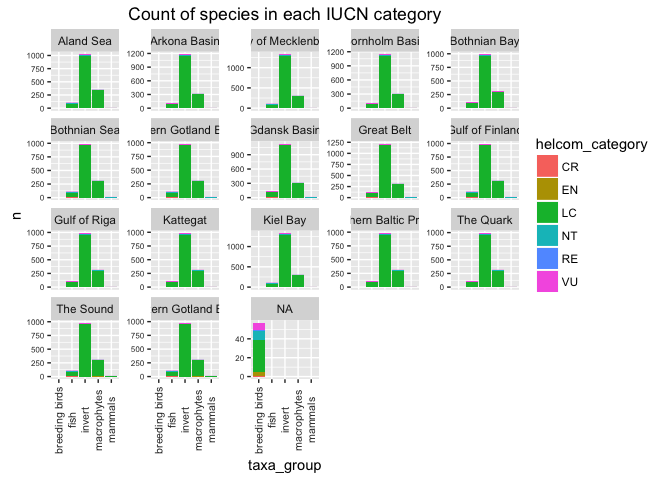
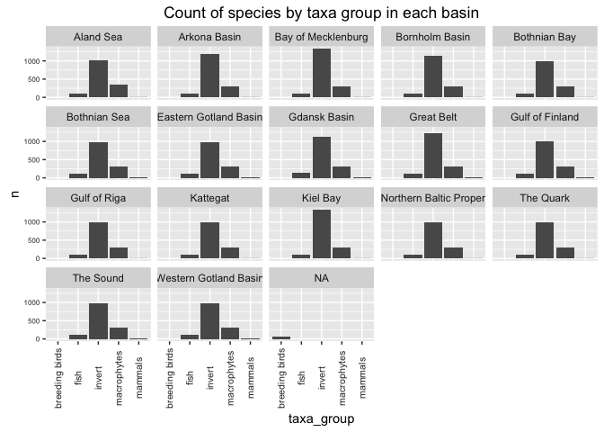

spp\_prep
================

Preparation of SPP data layers
==============================

**For Biodiverity goal**

TABLE OF CONTENTS
-----------------

### Background and Overview.........................Section 1

### Data............................................Section 2

### Goal model......................................Section 3

### Data prep (alternative 1, not preferred)........Section 4

### Data prep (alternative 2, preferred)............Section 5

### Data layer saved to layers......................Section 6

### Data layer issues / concerns....................Section 7

1. Background and Overview
--------------------------

In the OHI framework, the Biodiversity goal (BD) has two subgoals- species (SPP) and habitats (HAB). In BHI, we use only SPP to represent BD.

### 1.1 Species biodiversity

"People value biodiversity in particular for its existence value. The risk of species extinction generates great emotional and moral concern for many people."

### 1.2 References

[Halpern et al. 2012. An index to assess the health and benefits of the global ocean. Nature 488: 615-620](http://www.nature.com/nature/journal/v488/n7413/full/nature11397.html)

[HELCOM Red List](http://www.helcom.fi/baltic-sea-trends/biodiversity/red-list-of-species) based on [IUCN criteria.](http://www.iucnredlist.org/technical-documents/categories-and-criteria).

**Threat categories** *Evaluated species* Extinct (EX)
Regionally Extinct (RE)
Extinct in the Wild (EW)
Critically Endangered (CR) Endangered (EN)
Vulnerable (VU)
Near Threatened (NT)
Least Concern (LC) Data Deficient (DD) Not Applicable (NA)
*Not-evaluated species* Not Evaluated (NE)

2. Data
-------

Two different data sources and goal calculation approaches are explored. **Option 1**
HELCOM has spatial occurrence data layers for species and species are given an IUCN threat category.
*Pros for using these <data:*>
Data are spatially explicit, can score presence absence for each BHI region.
*Cons for using these <data:*>
These represent a very limited number of species in the Baltic (125 total) with the selection criteria being those with a spatial data layer in HELCOM. Many more species have been assessed using the IUCN criteria by HELCOM.

**Option 2** HELCOM provides species checklists for the Baltic that include distribution and a complete list of all species assessed with IUCN criteria.
*Pros for using these <data:*>
Much more representative set of species included for Baltic Sea biodiversity.
*Cons for using these <data:*>
Distribution is provided for most taxa groups at the basin scale - coaser resolution for calculation. Bird distribution is only by country (Germany has a couple of regions), therefore, will need additional expert information to allocate to basin or all bird species associated with a country will be allocated to all a country's BHI regions.

### 2.1 Data sources and information for HELCOM spatial data

Data extraction and prep was done by Melanie Frazer

#### 2.1.1 Data Sources

Species coverage and threat level data were obtained from the [HELCOM Biodiversity Map Service](http://maps.helcom.fi/website/Biodiversity/index.html) under 'Biodiversity' and then under 'Red List'.

Data were download in March 2016.

#### 2.1.2 Data extraction

Different taxa groups have different file types (grid files, polygons). Each species has a threat level assigned. Melanie worked to align taxa and species to BHI regions and assign the vulnerability code.

Folders associated with these data are:
- data
- intermediate
\_ raw

Scripts associated with these data are: - benthic\_extract.R
- bird\_data\_extract.R
- fish\_extract.R
- macrophyte\_extract.R
- mammal\_extract.R
- taxa\_combine.R

Melanie's notes on the data extraction process are below.

#### 2.1.3 Notes

##### 2.1.3.1 General Notes

**SPP data** For groups on the HELCOM grid (benthos): there is a key (prep/spatial/helcom\_to\_rgn\_bhi\_sea.csv) that translates the grid cells into baltic regions. The key was created using this script: prep/spatial/HELCOM\_2\_baltic.R.

For groups associated to HELCOM subbasin: this key was used to translate subbasins into baltic regions: prep/baltic\_rgns\_to\_bhi\_rgns\_lookup\_holas.csv

**If these data are used, need to translate to subbasins with the new shapefile matches, should be very similar**

Helcom species data downloaded from here: <http://maps.helcom.fi/website/Biodiversity/index.html> I added some subbasins to these data based on emails from Mar 21 email from Marc and Lena The data I added is incomplete.

The taxa\_combine.R combines the 5 taxonomic groups: benthos, birds, fish, mammals, macrophytes into a single data frame.

To calculate the SPP score, the IUCN codes will be converted to numeric scores and then averaged within each region.

To calculate the ICO score, the species will be subset based on what is considered an iconic species and then the IUCN codes will be converted to numeric scores, and than averaged within each region.

##### 2.1.3.2 Benthic data

Weird thing: you can download a map for each species, but all the species are included in each file. The only difference is that there is a unique html downloaded from IUCN for the species in question.

These data are in the format of polygons that are functionally rasters.

The corresponding benthic dbf file is saved as csv: benthos\_spatial\_data.csv

Painstakingly made a file to match the names in .shp file with the species names and vulnerability: benthic\_species.csv

##### 2.1.3.3 Bird data

There was no combined Helcom spatial file for birds (like there was for the benthic data).

One complication was that some species had data in the format of the "raster-style" polygons. While others were actual range polygons.

Given this, each bird spatial file was opened and then the range polygons were overlapped with the bhi regions.

NOTE: one bird species fell out of the bhi polygon areas and was excluded. I would probably ignore....but it might be worth figuring out.

The spatial files downloaded from Helcom are located here: /var/data/ohi/git-annex/Baltic/spp/Birds

The script used to open each bird file and associate the polygons with BHI regions is: bird\_data\_extract.R

The extracted bird data is here: intermediate/birds.csv

##### 2.1.3.4 Mammal data

There is a combined file for mammals. The ranges are described using polygons that relate to subbasins.

Some species have multiple IUCN categories (probably due to subspecies) It would be ideal if we know which categories correspond to which regions, but these data are not available. two possible options are: 1. average them 2. use the most conservative option I am going with \#2 for now, but this would be easy to change (code in mammal\_extract.R).

The script used to extract the data was: mammal\_extract.R The extracted mammal data are here: intermediate/mammals.R

##### 2.1.3.5 Fish data

There is a combined file for fish. The range data are polygons that correspond to subbasins.

##### 2.1.3.6 Macrophyte data

N=17 datapoints fell outside the water. This could probably be corrected by extracting the CELLCODES that land inland with some buffer.
Don't know if this is worth the effort...

### 2.2 Data sources and information for checklist data

#### 2.2.1 Data sources

[HELCOM species checklists](http://helcom.fi/baltic-sea-trends/biodiversity/red-list-of-species) (see bottom right of page for links to excel sheets) were downloaded on 14 June 2016

Joni Kaitaranta (HELCOM) emailed the complete list of species assessed using IUCN red list criteria on 14 June 2016.

#### 2.2.2 Data folder

These data are in the folder 'SPP/data\_checklist\_redlist'

#### 2.2.3 Data treatment for presence/absence

Difference taxa groups had different levels and categorization of presence/absence. This is what is included as presence for BHI from the checklist.
*Breeding birds* presence = 'breeding' *Fish* presence = 'regular reproduction' or 'regular occurence, no reproduction'
*Macrophyte* presence = 'X'
*Mammal* presence = 'X'
*Invert* presence = 'X'

#### 2.2.4 Other notes

1.  Breeding birds list noted species that used to be present but are extinct in a separate category - identified as 0
2.  Fish are all occurrences since 1800 - so could have many temporary or extinct sp, Extinction not noted, exclude those labeled temporary.
3.  Macrophytes, Mammals, Inverts only have either X or blank.
4.  Macrophytes spp have many synonym names, manually combined so only the main latin name has all presence/absence occurences for all synonyms.

3. Goal model
-------------

BD goal will only be based on the SPP sub-component

### 3.1 Goal status

Xspp\_r = 1- sum\[wi\]/R

wi = threat weights for each species i, R = total number of species in BHI region r
R = Ref point = Total number of species in region r (eg. score equals 1 when all species i have wi of LC)

Scale min value = score is 0 when 75% of species are extinct.\*
\*From Halpern et al 2012, SI. "We scaled the lower end of the biodiversity goal to be 0 when 75% species are extinct, a level comparable to the five documented mass extinctions"

wi from Halpern et al 2012, SI EX = 1.0
CR = 0.8
EN = 0.6
VU = 0.4
NT = 0.2
LC = 0 DD = not included, "We did not include the Data Deficient classification as assessed species following previously published guidelines for a mid-point approach"

**Will do above calculation for basin, not BHI region if use checklist distributions**

### 3.2 Goal trend

TBD

Two alternative data sources and status calculations follow. Need to assess which is best.
==========================================================================================

``` r
## Libraries
library(readr)
```

    ## Warning: package 'readr' was built under R version 3.2.4

``` r
library(dplyr)
```

    ## Warning: package 'dplyr' was built under R version 3.2.5

    ## 
    ## Attaching package: 'dplyr'

    ## The following objects are masked from 'package:stats':
    ## 
    ##     filter, lag

    ## The following objects are masked from 'package:base':
    ## 
    ##     intersect, setdiff, setequal, union

``` r
library(tidyr)
```

    ## Warning: package 'tidyr' was built under R version 3.2.5

``` r
library(ggplot2)
```

    ## Warning: package 'ggplot2' was built under R version 3.2.4

``` r
library(RMySQL)
```

    ## Warning: package 'RMySQL' was built under R version 3.2.5

    ## Loading required package: DBI

    ## Warning: package 'DBI' was built under R version 3.2.5

``` r
library(stringr)
library(tools)
library(rprojroot) # install.packages('rprojroot')
```

    ## Warning: package 'rprojroot' was built under R version 3.2.4

``` r
## source common libraries, directories, functions, etc
source('~/github/bhi/baltic2015/prep/common.r')

## rprojroot
root <- rprojroot::is_rstudio_project


## make_path() function to 
make_path <- function(...) rprojroot::find_root_file(..., criterion = is_rstudio_project)

dir_layers = make_path('baltic2015/layers') # replaces  file.path(dir_baltic, 'layers')


# root$find_file("README.md")
# 
# root$find_file("ao_need_gl2014.csv")
# 
# root <- find_root_file("install_ohicore.r", 
# 
# withr::with_dir(
#   root_file("DESCRIPTION"))


dir_spp    = file.path(dir_prep, 'SPP')

## add a README.md to the prep directory with the rawgit.com url for viewing on GitHub
create_readme(dir_spp, 'spp_prep.rmd')
```

4. Spatial data data layer preparation
--------------------------------------

### 4.1 Data organization

#### 4.1.1 Read in species data

``` r
## read in data...
data = read.csv(file.path(dir_spp, 'data/species_IUCN.csv'))
dim(data)
```

    ## [1] 2340    4

``` r
str(data)
```

    ## 'data.frame':    2340 obs. of  4 variables:
    ##  $ rgn_id      : int  2 1 5 6 32 40 38 36 42 3 ...
    ##  $ species_name: Factor w/ 154 levels "Abra prismatica",..: 1 1 1 1 2 2 2 2 2 4 ...
    ##  $ IUCN        : Factor w/ 6 levels "CR","DD","EN",..: 6 6 6 6 2 2 2 2 2 5 ...
    ##  $ taxa        : Factor w/ 5 levels "benthos","birds",..: 1 1 1 1 1 1 1 1 1 1 ...

#### 4.1.2 Set up vulnerability code

``` r
vuln_lookup = data %>%
              select(IUCN)%>%
              distinct(.) %>% ## unique vulnerability codes
              mutate(IUCN_numeric = ifelse(IUCN == 'EX',1,
                                    ifelse(IUCN == 'CR',0.8,
                                    ifelse(IUCN == 'EN', 0.6,
                                    ifelse(IUCN == 'VU', 0.4,
                                    ifelse(IUCN == 'NT', 0.2,
                                    ifelse(IUCN == 'LC',0,NA))))))) ## DD will receive NA
vuln_lookup ## note, no species with EX
```

    ##   IUCN IUCN_numeric
    ## 1   VU          0.4
    ## 2   DD           NA
    ## 3   NT          0.2
    ## 4   EN          0.6
    ## 5   LC          0.0
    ## 6   CR          0.8

#### 4.1.3 Join numeric vulnerability code to species

``` r
data2 = data %>%
        left_join(.,vuln_lookup, by= "IUCN")
head(data2)
```

    ##   rgn_id            species_name IUCN    taxa IUCN_numeric
    ## 1      2         Abra prismatica   VU benthos          0.4
    ## 2      1         Abra prismatica   VU benthos          0.4
    ## 3      5         Abra prismatica   VU benthos          0.4
    ## 4      6         Abra prismatica   VU benthos          0.4
    ## 5     32 Agrypnetes crassicornis   DD benthos           NA
    ## 6     40 Agrypnetes crassicornis   DD benthos           NA

#### 4.1.4 Plot by region

``` r
ggplot(data2)+
  geom_point(aes(rgn_id, species_name),size=1)+
  facet_wrap(~IUCN)+
  theme(axis.text.y = element_text(colour="grey20", size=2, angle=0, 
                                    hjust=.5, vjust=.5, face = "plain"))+
  ggtitle ("Species presence and vulnerability by region")
```


``` r
ggplot(data2)+
  geom_point(aes(rgn_id, species_name, colour=taxa),size=1)+
  facet_wrap(~IUCN)+
  theme(axis.text.y = element_text(colour="grey20", size=2, angle=0, 
                                    hjust=.5, vjust=.5, face = "plain"))+
  ggtitle ("Species presence and vulnerability by region")
```


#### 4.1.5 Distribution in IUCN categories

Benthos & macrophytes have many more DD

``` r
## how many in each category from each taxa group?
percent_vuln = data2 %>% 
  select(-rgn_id)%>%
  distinct()%>%
  select(IUCN,taxa) %>% 
  count(taxa,IUCN) %>%
  group_by(taxa)%>%
  mutate(n_tot = sum(n))%>%
  ungroup()%>%
  mutate(percent = round(n/n_tot,2)*100)%>%
  print(n=24)
```

    ## Source: local data frame [24 x 5]
    ## 
    ##           taxa   IUCN     n n_tot percent
    ##         <fctr> <fctr> <int> <int>   <dbl>
    ## 1      benthos     DD    23    54      43
    ## 2      benthos     EN     1    54       2
    ## 3      benthos     LC     4    54       7
    ## 4      benthos     NT     8    54      15
    ## 5      benthos     VU    18    54      33
    ## 6        birds     CR     1    22       5
    ## 7        birds     EN     5    22      23
    ## 8        birds     LC     1    22       5
    ## 9        birds     NT     8    22      36
    ## 10       birds     VU     7    22      32
    ## 11        fish     CR     4    50       8
    ## 12        fish     EN     3    50       6
    ## 13        fish     LC    27    50      54
    ## 14        fish     NT     9    50      18
    ## 15        fish     VU     7    50      14
    ## 16 macrophytes     DD     6    23      26
    ## 17 macrophytes     EN     3    23      13
    ## 18 macrophytes     LC     6    23      26
    ## 19 macrophytes     NT     4    23      17
    ## 20 macrophytes     VU     4    23      17
    ## 21     mammals     CR     1     5      20
    ## 22     mammals     LC     1     5      20
    ## 23     mammals     NT     1     5      20
    ## 24     mammals     VU     2     5      40

``` r
ggplot(percent_vuln, aes(x=taxa, y=percent, fill=IUCN))+
  geom_bar(stat="identity")+
  ggtitle("Percent of species in each IUCN category")
```


#### 4.1.6 Total number of species in each taxa group by IUCN categroy

``` r
ggplot(percent_vuln, aes(x=taxa, y=n, fill=IUCN))+
  geom_bar(stat="identity")+
  ggtitle("Number of species in each IUCN category")
```


``` r
ggplot(filter(percent_vuln, IUCN != "DD"), aes(x=taxa, y=n, fill=IUCN))+
  geom_bar(stat="identity")+
  ggtitle("Number of species in each IUCN category without DD")
```


#### 4.1.7 Remove DD species

Species given DD are not included. See methods above and in Halpern et al. 2012

Benthos has a much larger number of species in DD category

``` r
data3 = data2 %>%
        filter(IUCN != "DD")
dim(data3);dim(data2)
```

    ## [1] 2205    5

    ## [1] 2340    5

#### 4.1.8 Check for duplicates

``` r
data3 %>% nrow() #2205
```

    ## [1] 2205

``` r
data3 %>% distinct() %>% nrow() #2096
```

    ## [1] 2096

``` r
## appears to be duplicates

##remove duplicates by selecting the distinct columns
data3 = data3 %>% 
        arrange(rgn_id,species_name) %>%
        distinct()
        
dim(data3) #2096
```

    ## [1] 2096    5

#### 4.1.7 Export Species list

Export species list to be check to see if sufficient coverage

``` r
species_list = data3 %>%
              select(species_name,taxa)%>%
              distinct(.)
dim(species_list) #125  1
```

    ## [1] 125   2

``` r
write.csv(species_list, file.path(dir_spp,'species_list_included.csv'), row.names=FALSE)
```

### 4.2 Data layer for functions.r

If this data set is used, the data layer can be exported here.

``` r
data3 = data3 %>%
        select(rgn_id, species_name, IUCN_numeric) %>%
        dplyr::rename(weights = IUCN_numeric)
##write.csv(data3, file.path(dir_layers, 'spp_div_vuln_bhi2015.csv'), row.names=FALSE)
```

### 4.3 Status calcalculation

#### 4.3.1 Calculate status

``` r
##sum the weights for each BHI region
sum_wi = data3 %>%
         group_by(rgn_id)%>%
         summarise(sum_wi =sum(weights))%>%
         ungroup()
dim(sum_wi)
```

    ## [1] 42  2

``` r
## count the number of species in each BHI region
sum_spp = data3 %>%
          select(rgn_id, species_name)%>%
          dplyr::count(rgn_id)
dim(sum_spp)
```

    ## [1] 42  2

``` r
data3%>% filter(rgn_id== 1) %>% nrow() ## check to make sure works
```

    ## [1] 83

``` r
head(sum_spp)
```

    ## Source: local data frame [6 x 2]
    ## 
    ##   rgn_id     n
    ##    <int> <int>
    ## 1      1    83
    ## 2      2    87
    ## 3      3    60
    ## 4      4    45
    ## 5      5    72
    ## 6      6    71

``` r
spp_status = full_join(sum_wi,sum_spp, by="rgn_id") %>%
             mutate(wi_spp = sum_wi/n,
                    status = 1 - wi_spp)
```

#### 4.3.2 Scale lower end to zero if 75% extinct

Currently, no species labeled extinct but will set up code in case used in the future

``` r
## calculate percent extinct in each region
spp_ex = data3 %>% 
         filter(weights == 1)
spp_ex
```

    ## [1] rgn_id       species_name weights     
    ## <0 rows> (or 0-length row.names)

``` r
## No species extinct
## IF spp are extinct, find % extinct out of total number of species for each region; join to the status calculation; set regions with 75% or more extinct to a score of 0
```

#### 4.3.3 Plot status

``` r
## Plot status
ggplot(spp_status)+
  geom_point(aes(rgn_id,round(status*100)),size=3)+
  ylim(0,100)+
  ylab("Status") + 
  xlab("BHI region")+
  ggtitle("SPP status by BHI region")
```


``` r
## Size points to number of species in a region
ggplot(spp_status)+
  geom_point(aes(rgn_id,round(status*100), size=n))+
  ylim(0,100)+
  ylab("Status") + 
  xlab("BHI region")+
  ggtitle("SPP status by BHI region, n= species richness")
```


5. Data layer preparation with checklist distribution data
----------------------------------------------------------

### 5.1 Data organization

#### 5.1.1 Read in data

``` r
bbirds = read.csv(file.path(dir_spp,'data_checklist_redlist/breedingbirds_dist_checklist.csv'), sep= ";", stringsAsFactors = FALSE)

fish = read.csv(file.path(dir_spp,'data_checklist_redlist/fish_dist_checklist.csv'), sep= ";", stringsAsFactors = FALSE)

invert = read.csv(file.path(dir_spp,'data_checklist_redlist/invert_dist_checklist.csv'), sep= ";", stringsAsFactors = FALSE)

macrophytes = read.csv(file.path(dir_spp,'data_checklist_redlist/macrophytes_dist_checklist.csv'), sep= ";", stringsAsFactors = FALSE)

mammals = read.csv(file.path(dir_spp,'data_checklist_redlist/mammals_dist_checklist.csv'), sep= ";", stringsAsFactors = FALSE)


redlist = read.csv(file.path(dir_spp,'data_checklist_redlist/helcom_redlist_allspecies.csv'), sep= ";", stringsAsFactors = FALSE)
```

#### 5.1.2 Data structure

``` r
str(bbirds)
```

    ## 'data.frame':    57 obs. of  13 variables:
    ##  $ latin_name                           : chr  "Actitis hypoleucos" "Alca torda" "Anas clypeata" "Anas platyrhynchos" ...
    ##  $ Sweden                               : chr  "X" "X" "X" "X" ...
    ##  $ Finland                              : chr  "X" "X" "X" "X" ...
    ##  $ Russia.St..Petersburg                : chr  "X" "X" "X" "X" ...
    ##  $ Russia.Kaliningrad                   : chr  "X" "-" "X" "X" ...
    ##  $ Estonia                              : chr  "X" "X" "X" "X" ...
    ##  $ Latvia                               : chr  "X" "-" "X" "X" ...
    ##  $ Lithuania                            : chr  "X" "-" "X" "X" ...
    ##  $ Poland                               : chr  "X" "-" "X" "X" ...
    ##  $ Germany.Mecklenburg.Western.Pomerania: chr  "X" "-" "X" "X" ...
    ##  $ Germany.Schleswig.Holstein           : chr  "(X)" "-" "X" "X" ...
    ##  $ Denmark                              : chr  "X" "X" "X" "X" ...
    ##  $ common_name                          : chr  "Common sandpiper" "Razorbill" "Northern shoveler" "Mallard" ...

``` r
str(fish)
```

    ## 'data.frame':    240 obs. of  23 variables:
    ##  $ latin_name            : chr  "Myxine glutinosa" "Lampetra fluviatilis" "Petromyzon marinus" "Lamna nasus" ...
    ##  $ Kattegat              : chr  "R" "X" "X" "T" ...
    ##  $ Great.Belt            : chr  "" "T" "T" "T" ...
    ##  $ Little.Belt           : chr  "" "T" "T" "T" ...
    ##  $ Kiel.Bay              : chr  "" "X" "T" "T" ...
    ##  $ Bay.of.Mecklenburg    : chr  "" "X" "T" "" ...
    ##  $ The.Sound             : chr  "" "X" "X" "T" ...
    ##  $ Arkona.Basin          : chr  "" "X" "T" "" ...
    ##  $ Bornholm.Basin        : chr  "" "X" "X" "" ...
    ##  $ Western.Gotland.Basin : chr  "" "X" "T" "" ...
    ##  $ Eastern.Gotland.Basin : chr  "" "X" "T" "" ...
    ##  $ Gulf.of.Gdansk        : chr  "" "X" "T" "" ...
    ##  $ Vistula.Lagoon        : chr  "" "X" "T" "" ...
    ##  $ Curonian.Lagoon       : chr  "" "X" "T" "" ...
    ##  $ Gulf.of.Riga          : chr  "" "X" "T" "" ...
    ##  $ Northern.Baltic.Proper: chr  "" "X" "" "" ...
    ##  $ Gulf.of.Finland       : chr  "" "X" "T" "" ...
    ##  $ Aland.Sea             : chr  "" "X" "T" "" ...
    ##  $ Archipelago.Sea       : chr  "" "X" "T" "T" ...
    ##  $ Bothnian.Sea          : chr  "" "X" "T" "" ...
    ##  $ The.Quark             : chr  "" "X" "T" "" ...
    ##  $ Bothnian.Bay          : chr  "" "X" "" "" ...
    ##  $ common_name           : chr  "Hagfish" "River lamprey" "Sea lamprey" "Porbeagle" ...

``` r
str(invert)
```

    ## 'data.frame':    1898 obs. of  34 variables:
    ##  $ latin_name            : chr  "Abietinaria abietina" "Ablabesmyia longistyla" "Ablabesmyia monilis" "Ablabesmyia phatta" ...
    ##  $ Kattegat              : chr  "X" "" "" "" ...
    ##  $ The.Sound             : chr  "X" "" "" "" ...
    ##  $ Little.Belt           : chr  "" "" "" "" ...
    ##  $ Great.Belt            : chr  "" "" "" "" ...
    ##  $ Kiel.Bay              : chr  "" "" "" "" ...
    ##  $ Bay.of.Mecklenburg    : chr  "X" "" "" "" ...
    ##  $ Arkona.Basin          : chr  "X" "" "" "" ...
    ##  $ Bornholm.Basin        : chr  "" "" "" "" ...
    ##  $ Eastern.Gotland.Basin : chr  "" "" "" "" ...
    ##  $ Western.Gotland.Basin : chr  "" "" "" "" ...
    ##  $ Northern.Baltic.Proper: chr  "" "" "" "" ...
    ##  $ Aland.Sea             : chr  "" "" "" "" ...
    ##  $ Archipelago.Sea       : chr  "" "" "" "" ...
    ##  $ Bothnian.Sea          : chr  "" "" "" "" ...
    ##  $ The.Quark             : chr  "" "" "X" "" ...
    ##  $ Bothnian.Bay          : chr  "" "" "" "" ...
    ##  $ Gulf.of.Finland       : chr  "" "X" "X" "X" ...
    ##  $ Gulf.of.Gdansk        : chr  "" "" "" "" ...
    ##  $ Gulf.of.Riga          : chr  "" "" "" "" ...
    ##  $ Warnow.Estuary        : chr  "" "" "" "" ...
    ##  $ Wismar.Bay            : chr  "" "" "" "" ...
    ##  $ Trave.Estuary         : chr  "" "" "" "" ...
    ##  $ Kiel.Fjord            : chr  "" "" "" "" ...
    ##  $ Eckernförde.Bay       : chr  "" "" "" "" ...
    ##  $ Schlei.Estuary        : chr  "" "" "" "" ...
    ##  $ Flensburg.Fjord       : chr  "" "" "" "" ...
    ##  $ Vistula.Lagoon        : chr  "" "" "" "" ...
    ##  $ Szczecin.Lagoon       : chr  "" "X" "" "" ...
    ##  $ Greifswald.Lagoon     : chr  "" "" "" "" ...
    ##  $ Rugia.Lagoons         : chr  "" "" "" "" ...
    ##  $ Darss.Zingst.Lagoon   : chr  "" "" "" "" ...
    ##  $ Curonian.Lagoon       : chr  "" "" "X" "" ...
    ##  $ common_name           : logi  NA NA NA NA NA NA ...

``` r
str(macrophytes)
```

    ## 'data.frame':    532 obs. of  19 variables:
    ##  $ latin_name              : chr  "Ranunculus trichophyllus subsp. Eradicatus" "Porphyridium aerugineum 3" "Rhynchostegium riparioides" "Potamogeton pectinatus agg." ...
    ##  $ Kattegat                : int  0 0 0 0 1 1 1 0 1 1 ...
    ##  $ Great.Belt...Little.Belt: int  0 0 0 0 1 1 1 0 1 0 ...
    ##  $ Kiel.Bay                : int  0 0 0 0 0 1 1 0 0 0 ...
    ##  $ Bay.of.Mecklenburg      : int  0 0 0 0 0 0 0 0 0 0 ...
    ##  $ The.Sound               : int  0 0 0 0 1 1 1 0 1 0 ...
    ##  $ Arkona.Basin            : int  0 1 0 0 0 0 1 0 1 0 ...
    ##  $ Bornholm.Basin          : chr  "0" "0" "0" "0" ...
    ##  $ Western.Gotland.Basin   : int  0 0 0 0 0 0 1 0 0 0 ...
    ##  $ Eastern.Gotland.Basin   : int  0 0 0 0 0 0 0 0 0 0 ...
    ##  $ Gulf.of.Gdansk          : int  0 0 0 0 0 0 0 0 0 0 ...
    ##  $ Gulf.of.Riga            : int  0 0 0 0 0 0 0 0 0 0 ...
    ##  $ Nothern.Baltic.Proper   : chr  "0" "0" "0" "0" ...
    ##  $ Gulf.of.Finland         : int  1 0 0 0 0 0 1 1 0 0 ...
    ##  $ Aland.Sea               : int  0 0 0 0 0 0 1 0 0 0 ...
    ##  $ Archipelago.Sea         : int  1 0 0 0 0 0 0 0 0 0 ...
    ##  $ Bothnian.Sea...The.Quark: int  1 0 0 1 0 1 1 0 0 0 ...
    ##  $ Bothnian.Bay            : int  1 0 1 1 0 0 0 0 0 0 ...
    ##  $ common_name             : logi  NA NA NA NA NA NA ...

``` r
str(mammals)
```

    ## 'data.frame':    5 obs. of  21 variables:
    ##  $ latin_name                : chr  "Halichoerus grypus" "Phoca vitulina vitulina" "Pusa hispida" "Phocoena phocoena" ...
    ##  $ Kattegatt                 : chr  "x" "x" "" "x" ...
    ##  $ Great.Belt                : chr  "" "x" "" "x" ...
    ##  $ Little.Belt               : chr  "" "x" "" "x" ...
    ##  $ Kiel.Bay                  : chr  "x" "x" "" "x" ...
    ##  $ The.Bay.of.Mecklenburg    : chr  "x" "x" "" "x" ...
    ##  $ The.Sound                 : chr  "x" "x" "" "x" ...
    ##  $ Arkona.Basin              : chr  "x" "x" "" "x" ...
    ##  $ Bornholm.Basin            : chr  "x" "x" "" "x" ...
    ##  $ The.Eastern.Gotland.Basin : chr  "x" "" "" "x" ...
    ##  $ The.Western.Gotland.Basin : chr  "x" "" "" "x" ...
    ##  $ The.Northern.Baltic.Proper: chr  "x" "" "x" "x" ...
    ##  $ The.Gulf.of.Gda.sk        : chr  "x" "x" "" "x" ...
    ##  $ Gulf.of.Riga              : chr  "x" "" "x" "x" ...
    ##  $ Gulf.of.Finland           : chr  "x" "" "x" "x" ...
    ##  $ Archipelago.Sea           : chr  "x" "" "x" "x" ...
    ##  $ Aland.Sea                 : chr  "x" "" "x" "x" ...
    ##  $ The.Bothnian.Sea          : chr  "x" "" "x" "x" ...
    ##  $ The.Quark                 : chr  "x" "" "x" "" ...
    ##  $ Bothnian.Bay              : chr  "x" "" "x" "" ...
    ##  $ common_name               : chr  "grey seal / gray seal" "harbour seal / common seal" "ringed seal" "harbour porpoise" ...

``` r
str(redlist)
```

    ## 'data.frame':    2809 obs. of  5 variables:
    ##  $ latin_name     : chr  "Aglaothamnion bipinnatum Feldmann-Mazoyer 1941" "Actitis hypoleucos (Linnaeus, 1758)" "Nephasoma (Nephasoma) abyssorum abyssorum" "Ranunculus trichophyllus subsp. eradicatus" ...
    ##  $ assessment_unit: chr  "Species" "Breeding" "Species" "Species" ...
    ##  $ helcom_category: chr  "LC" "NT" "LC" "LC" ...
    ##  $ iucn_criteria  : chr  "" "A2ab" "" "" ...
    ##  $ taxa_group     : chr  "macrophytes" "breeding birds" "invert" "macrophytes" ...

#### 5.1.3 Translate code to presence/absence

Objective is to get a data layer of current species occurence.

Each taxa group has a different code for noting distribution in different regions. Translate to a 1 or 0 for presence absence then gather to long format

##### 5.1.3.1 Breeding birds

X = breeding
(X) = sporadic breeding (only occasional breeding records)
0 = extinct (breeding in the past, but no actual breeding records)
0 = sporadic breeder in the past, no breeding records during the last 3 generations or 10 years
0(X) = extinct as a regular breeder, but sporadic breeding records during the last 3 generations or 10 years
- = no breeding birds

**For BHI:** *X = 1* and *all others = 0*

``` r
## gather birds to long format
bbirds_long = bbirds %>%
              gather(location,presence,-latin_name,-common_name)%>%
              mutate(presence = ifelse(presence == "X", 1, 0))%>% ##change X to present (1) all else absent (0)
              mutate(taxa_group = "breeding birds")
```

##### 5.1.3.2 Fish and Lamprey

R = regular reproduction
X = regular occurrrence, no reproduction
T = temporary occurrence
? = occurrance uncertain

**For BHI:** *R or X = 1* and *T or ? = 0*

``` r
## clean up fish data (had ? not removed), gather to long format
fish_long = fish %>%
            mutate(latin_name =str_replace(latin_name,"\\*",""))%>% ## remove * at end of latin name
            gather(location,presence,-latin_name,-common_name)%>%
            mutate(presence = ifelse(presence == "R", 1, 
                              ifelse(presence == "X", 1, 0)))%>%
            mutate(taxa_group = "fish")
```

##### 5.1.3.3 Invertebrates

X = ocurrance
'blank' = no occurance

**For BHI:** *X = 1* and *blank = 0*

``` r
## gather invert  to long format
invert_long = invert %>%
              gather(location,presence,-latin_name,-common_name)%>%
              mutate(presence = ifelse(presence == "X", 1, 0))%>% 
              mutate(taxa_group = "invert")
```

##### 5.1.3.4 Macrophytes

1 = occurance 0 = no occurance uncertain = had a note in checklist about checking the distribution
**For BHI:** *X = 1* and *0 and uncertain = 0*

``` r
##gather macrophytes to long format
macrophytes_long = macrophytes %>%
                    gather(location,presence,-latin_name,-common_name)%>%
                    mutate(presence = ifelse(presence == "uncertain", 0, presence),
                           presence = as.numeric(presence))%>% 
                    mutate(taxa_group = "macrophytes")
```

##### 5.1.3.5 Mammals

X = ocurrance
'blank' = no occurance

**For BHI:** *X = 1* and *blank = 0*

``` r
##gather mammals to long format
mammals_long = mammals %>%
               gather(location,presence,-latin_name,-common_name)%>%
               mutate(presence = ifelse(presence == "x", 1, 0))%>% 
               mutate(taxa_group = "mammals")
```

### 5.2 Data attributes

#### 5.2.1 Get number of species by taxa group

2731 total unique latin names

``` r
species_checklist = bind_rows(select(bbirds_long,latin_name,taxa_group),
                         select(fish_long,latin_name,taxa_group),
                         select(invert_long,latin_name,taxa_group),
                         select(macrophytes_long,latin_name,taxa_group),
                         select(mammals_long,latin_name,taxa_group))%>%
                         distinct()

species_checklist_n = species_checklist %>%
                      count(taxa_group)

ggplot(species_checklist, aes(x=taxa_group))+
   geom_bar(stat="count")+
  theme(axis.text.x = element_text(colour="grey20",size=8,angle=90,hjust=.5,vjust=.5,face="plain"),axis.text.y = element_text(colour="grey20",size=6))+
  ggtitle("Number of species in the checklist")
```


``` r
## number of unique latin names
species_checklist %>% select(latin_name)%>%distinct()%>%nrow() #2731
```

    ## [1] 2731

``` r
##add list_type
species_checklist = species_checklist%>%
                    mutate(list_type = "checklist")
```

#### 5.2.2 Get number of species by taxa group on the red list

2772 on redlist
Need to see how many are assessed.

``` r
str(redlist)
```

    ## 'data.frame':    2809 obs. of  5 variables:
    ##  $ latin_name     : chr  "Aglaothamnion bipinnatum Feldmann-Mazoyer 1941" "Actitis hypoleucos (Linnaeus, 1758)" "Nephasoma (Nephasoma) abyssorum abyssorum" "Ranunculus trichophyllus subsp. eradicatus" ...
    ##  $ assessment_unit: chr  "Species" "Breeding" "Species" "Species" ...
    ##  $ helcom_category: chr  "LC" "NT" "LC" "LC" ...
    ##  $ iucn_criteria  : chr  "" "A2ab" "" "" ...
    ##  $ taxa_group     : chr  "macrophytes" "breeding birds" "invert" "macrophytes" ...

``` r
ggplot(redlist, aes(x=taxa_group))+
   geom_bar(stat="count")+
   theme(axis.text.x = element_text(colour="grey20",size=8,angle=90,hjust=.5,vjust=.5,face="plain"),axis.text.y = element_text(colour="grey20",size=6))+
  ggtitle("Number of species in the redlist")
```


``` r
## number of unique latin names
redlist %>% select(latin_name)%>%distinct()%>%nrow() #2772
```

    ## [1] 2772

``` r
## add list_type column

redlist = redlist %>%
          mutate(list_type = "redlist")
```

#### 5.2.3 Get a species list that is all those present on the red list and check list

1.  First join and retain all species to see if spelling causes any mismatches.
2.  Retain only species on both lists, join by taxa group and latin name.

**What is not present** *Not on Redlist* 343 species on checklist not on redlist.
1. No wintering birds in the checklist.

##### 5.2.3.1 Full species list

``` r
full_species = full_join(species_checklist,redlist, by=c("latin_name","taxa_group"))%>%
                  select(-iucn_criteria)%>%
                  mutate(helcom_category = as.character(helcom_category))
dim(full_species) #3152   6
```

    ## [1] 3152    6

``` r
##which species are not on both lists?

  #          
```

##### 5.2.3.2 on checklist not redlist

Ringed seal latin name differs - correct in redlist to *Pusa hispida*
4 breeding birds not on redlist --spelling differences, correct on redlist
310 macrophytes not on redlist
28 invertebreates not on redlist

``` r
# which are in checklist but not redlist
      full_species %>% filter(is.na(list_type.y)) %>%nrow()  ##343
```

    ## [1] 343

``` r
      full_species %>% filter(is.na(list_type.y)) %>%select(taxa_group)%>%distinct()  ## breeding birds, invert, macrophytes mammals
```

    ##       taxa_group
    ## 1 breeding birds
    ## 2         invert
    ## 3    macrophytes
    ## 4        mammals

``` r
## check mammals
   full_species %>% filter(is.na(list_type.y)) %>% filter(taxa_group =="mammals") #Pusa hispida  
```

    ##     latin_name taxa_group list_type.x assessment_unit helcom_category
    ## 1 Pusa hispida    mammals   checklist            <NA>            <NA>
    ##   list_type.y
    ## 1        <NA>

``` r
   redlist %>% filter(taxa_group == "mammals") ##Phoca hispida botnica 
```

    ##                latin_name                  assessment_unit helcom_category
    ## 1   Phoca hispida botnica                          Species              VU
    ## 2 Phoca vitulina vitulina    Southern Baltic subpopulation              LC
    ## 3 Phoca vitulina vitulina          Kalmarsun subpopulation              VU
    ## 4      Halichoerus grypus                          Species              LC
    ## 5             Lutra lutra                          Species              NT
    ## 6       Phocoena phocoena        Baltic Sea Sub-population              CR
    ## 7       Phocoena phocoena Western Baltic Sea subpopulation              VU
    ##   iucn_criteria taxa_group list_type
    ## 1           A3c    mammals   redlist
    ## 2                  mammals   redlist
    ## 3            D1    mammals   redlist
    ## 4                  mammals   redlist
    ## 5            D1    mammals   redlist
    ## 6     C1,2a(ii)    mammals   redlist
    ## 7           A2a    mammals   redlist

``` r
   mammals %>% select(latin_name,common_name)
```

    ##                latin_name                     common_name
    ## 1      Halichoerus grypus           grey seal / gray seal
    ## 2 Phoca vitulina vitulina      harbour seal / common seal
    ## 3            Pusa hispida                     ringed seal
    ## 4       Phocoena phocoena                harbour porpoise
    ## 5             Lutra lutra European otter / Euraisan otter

``` r
## check breeding birds
   full_species %>% filter(is.na(list_type.y)) %>% filter(taxa_group =="breeding birds")
```

    ##                                      latin_name     taxa_group list_type.x
    ## 1                            Actitis hypoleucos breeding birds   checklist
    ## 2          Larus minutus (Hydrocoloeus minutus) breeding birds   checklist
    ## 3 Larus ridibundus (Chroicocephalus ridibundus) breeding birds   checklist
    ## 4          Mergus albellus (Mergellus albellus) breeding birds   checklist
    ##   assessment_unit helcom_category list_type.y
    ## 1            <NA>            <NA>        <NA>
    ## 2            <NA>            <NA>        <NA>
    ## 3            <NA>            <NA>        <NA>
    ## 4            <NA>            <NA>        <NA>

``` r
    redlist %>% filter(grepl("Actitis", latin_name)) ## look for Actitis hypoleucos 
```

    ##                            latin_name assessment_unit helcom_category
    ## 1 Actitis hypoleucos (Linnaeus, 1758)        Breeding              NT
    ##   iucn_criteria     taxa_group list_type
    ## 1          A2ab breeding birds   redlist

``` r
    redlist %>% filter(grepl("Larus",latin_name))#Larus minutus (Hydrocoloeus minutus) ##Larus ridibundus (Chroicocephalus ridibundus) 
```

    ##                  latin_name assessment_unit helcom_category iucn_criteria
    ## 1       Larus fuscus fuscus        Breeding              VU        A2abce
    ## 2  Larus fuscus intermedius        Breeding              LC              
    ## 3          Larus argentatus        Breeding              LC              
    ## 4          Larus argentatus       Wintering              LC              
    ## 5          Larus cachinnans       Wintering            <NA>              
    ## 6               Larus canus        Breeding              LC              
    ## 7               Larus canus       Wintering              LC              
    ## 8             Larus marinus        Breeding              LC              
    ## 9             Larus marinus       Wintering              LC              
    ## 10     Larus melanocephalus        Breeding              EN            D1
    ## 11            Larus minutus        Breeding              LC              
    ## 12         Larus ridibundus        Breeding              LC              
    ## 13         Larus ridibundus       Wintering              LC              
    ##         taxa_group list_type
    ## 1   breeding birds   redlist
    ## 2   breeding birds   redlist
    ## 3   breeding birds   redlist
    ## 4  wintering birds   redlist
    ## 5  wintering birds   redlist
    ## 6   breeding birds   redlist
    ## 7  wintering birds   redlist
    ## 8   breeding birds   redlist
    ## 9  wintering birds   redlist
    ## 10  breeding birds   redlist
    ## 11  breeding birds   redlist
    ## 12  breeding birds   redlist
    ## 13 wintering birds   redlist

``` r
    redlist %>% filter(grepl("Mergus",latin_name)) ##Mergus albellus (Mergellus albellus) 
```

    ##         latin_name assessment_unit helcom_category iucn_criteria
    ## 1 Mergus merganser        Breeding              LC              
    ## 2 Mergus merganser       Wintering              LC              
    ## 3  Mergus serrator        Breeding              LC              
    ## 4  Mergus serrator       Wintering              VU           A2b
    ##        taxa_group list_type
    ## 1  breeding birds   redlist
    ## 2 wintering birds   redlist
    ## 3  breeding birds   redlist
    ## 4 wintering birds   redlist

``` r
## Check macrophytes
           full_species %>% filter(is.na(list_type.y)) %>% filter(taxa_group =="macrophytes") ##310 species
```

    ##                                          latin_name  taxa_group
    ## 1        Ranunculus trichophyllus subsp. Eradicatus macrophytes
    ## 2                         Porphyridium aerugineum 3 macrophytes
    ## 3                                Polygonum foliosum macrophytes
    ## 4                            Acinetospora crinita   macrophytes
    ## 5                          Acrochaete cladophorae   macrophytes
    ## 6                             Acrochaete flustrae   macrophytes
    ## 7                          Acrochaete heteroclada   macrophytes
    ## 8                              Acrochaete inflata   macrophytes
    ## 9                          Acrochaete leptochaete   macrophytes
    ## 10                          Acrochaete operculata   macrophytes
    ## 11                              Acrochaete repens   macrophytes
    ## 12                             Acrochaete viridis   macrophytes
    ## 13                          Acrochaete wittrockii   macrophytes
    ## 14                        Acrochaetium attenuatum   macrophytes
    ## 15                          Acrochaetium balticum   macrophytes
    ## 16                       Acrochaetium catenulatum   macrophytes
    ## 17                        Acrochaetium cytophagum   macrophytes
    ## 18                         Acrochaetium dumontiae   macrophytes
    ## 19                          Acrochaetium emergens   macrophytes
    ## 20                        Acrochaetium endozoicum   macrophytes
    ## 21                         Acrochaetium gynandrum   macrophytes
    ## 22                       Acrochaetium hallandicum   macrophytes
    ## 23                            Acrochaetium humile   macrophytes
    ## 24                          Acrochaetium immersum   macrophytes
    ## 25                            Acrochaetium kylini   macrophytes
    ## 26                         Acrochaetium leptonema   macrophytes
    ## 27                            Acrochaetium macula   macrophytes
    ## 28                     Acrochaetium microscopicum   macrophytes
    ## 29                           Acrochaetium minimum   macrophytes
    ## 30                       Acrochaetium moniliforme   macrophytes
    ## 31                            Acrochaetium nemalii  macrophytes
    ## 32                          Acrochaetium parvulum   macrophytes
    ## 33                          Acrochaetium reductum   macrophytes
    ## 34                      Acrochaetium rhipidandrum   macrophytes
    ## 35                         Acrochaetium rosulatum   macrophytes
    ## 36                          Acrochaetium savianum   macrophytes
    ## 37                        Acrochaetium secundatum   macrophytes
    ## 38                       Acrochaetium stilophorae   macrophytes
    ## 39                        Acrochaetium virgatulum   macrophytes
    ## 40                             Acrosiphonia arcta   macrophytes
    ## 41                           Acrosiphonia sonderi   macrophytes
    ## 42                             Acrothrix gracilis   macrophytes
    ## 43                            Aegagropila linnaei   macrophytes
    ## 44  Aglaothamnion bipinnatum Feldmann-Mazoyer 1941  macrophytes
    ## 45                          Aglaothamnion hookeri   macrophytes
    ## 46                           Aglaothamnion roseum   macrophytes
    ## 47                      Aglaothamnion tenuissimum   macrophytes
    ## 48                              Ahnfeltia plicata   macrophytes
    ## 49                               Alaria esculenta   macrophytes
    ## 50                               Alisma gramineum   macrophytes
    ## 51                       Alisma plantago-aquatica   macrophytes
    ## 52                            Alisma wahlenbergii   macrophytes
    ## 53                         Antithamnion cruciatum   macrophytes
    ## 54                          Antithamnion villosum   macrophytes
    ## 55                      Antithamnionella floccosa   macrophytes
    ## 56                            Aphanochaete repens   macrophytes
    ## 57                         Apoglossum ruscifolium   macrophytes
    ## 58                           Arthrocladia villosa   macrophytes
    ## 59                            Ascophyllum nodosum   macrophytes
    ## 60                          Asperococcus bullosus   macrophytes
    ## 61                        Asperococcus ensiformis   macrophytes
    ## 62                        Asperococcus fistulosus   macrophytes
    ## 63                         Atractophora hypnoides   macrophytes
    ## 64                      Bangiadulcis atropurpurea   macrophytes
    ## 65                          Batrachospermum atrum   macrophytes
    ## 66                             Batrachospermum sp.  macrophytes
    ## 67                           Blastophysa rhizopus   macrophytes
    ## 68                            Blidingia marginata   macrophytes
    ## 69                               Blidingia minima   macrophytes
    ## 70                          Bolbocoleon piliferum   macrophytes
    ## 71                         Bolboschoenus maritimus  macrophytes
    ## 72                     Bonnemaisonia asparagoides   macrophytes
    ## 73                         Bonnemaisonia hamifera   macrophytes
    ## 74                           Botrytella micromora   macrophytes
    ## 75                          Botrytella reinboldii   macrophytes
    ## 76                       Brongniartella byssoides   macrophytes
    ## 77                             Bryopsis hypnoides   macrophytes
    ## 78                               Bryopsis plumosa   macrophytes
    ## 79                           Butomus umbellatus L.  macrophytes
    ## 80                       Callithamnion corymbosum   macrophytes
    ## 81                       Callithamnion tetragonum   macrophytes
    ## 82                         Callitriche cophocarpa   macrophytes
    ## 83                    Callitriche hermaphroditica   macrophytes
    ## 84                           Callitriche palustris  macrophytes
    ## 85                          Callophyllis cristata   macrophytes
    ## 86                               Caltha palustris   macrophytes
    ## 87                         Capsosiphon fulvescens   macrophytes
    ## 88                             Ceramium cimbricum   macrophytes
    ## 89                             Ceramium diaphanum   macrophytes
    ## 90                            Ceramium echionotum   macrophytes
    ## 91                              Ceramium pallidum   macrophytes
    ## 92                            Ceramium siliquosum   macrophytes
    ## 93                            Ceramium tenuicorne   macrophytes
    ## 94                              Ceramium virgatum   macrophytes
    ## 95                            Ceratocolax hartzii   macrophytes
    ## 96                         Ceratophyllum demersum   macrophytes
    ## 97                             Chaetomorpha aerea   macrophytes
    ## 98                         Chaetomorpha ligustica   macrophytes
    ## 99                             Chaetomorpha linum   macrophytes
    ## 100                       Chaetomorpha melagonium   macrophytes
    ## 101                        Chaetophora incrassata   macrophytes
    ## 102                                  Chara aspera   macrophytes
    ## 103                                 Chara baltica   macrophytes
    ## 104                                 Chara braunii   macrophytes
    ## 105                               Chara canescens   macrophytes
    ## 106                               Chara connivens   macrophytes
    ## 107                              Chara globularis   macrophytes
    ## 108                                 Chara hispida   macrophytes
    ## 109                                 Chara horrida   macrophytes
    ## 110                             Chara polyacantha   macrophytes
    ## 111                               Chara tomentosa   macrophytes
    ## 112                                 Chara virgata   macrophytes
    ## 113                                Chara vulgaris   macrophytes
    ## 114                          Chilionema ocellatum   macrophytes
    ## 115                         Chlorochytrium cohnii   macrophytes
    ## 116                   Chlorochytrium dermatocolax   macrophytes
    ## 117                           Chondria dasyphylla   macrophytes
    ## 118                              Chondrus crispus   macrophytes
    ## 119                                  Chorda filum   macrophytes
    ## 120                      Chordaria flagelliformis   macrophytes
    ## 121                           Choreonema thuretii   macrophytes
    ## 122                         Chroodactylon ornatum   macrophytes
    ## 123                      Chylocladia verticillata   macrophytes
    ## 124                              Cladophora albida  macrophytes
    ## 125                          Cladophora dalmatica   macrophytes
    ## 126                           Cladophora flexuosa   macrophytes
    ## 127                             Cladophora fracta   macrophytes
    ## 128                          Cladophora glomerata   macrophytes
    ## 129                        Cladophora hutchinsiae   macrophytes
    ## 130                        Cladophora laetevirens   macrophytes
    ## 131                        Cladophora lehmanniana   macrophytes
    ## 132                         Cladophora pachyderma   macrophytes
    ## 133                            Cladophora pygmaea   macrophytes
    ## 134                          Cladophora rupestris   macrophytes
    ## 135                            Cladophora sericea   macrophytes
    ## 136                            Cladophora vadorum   macrophytes
    ## 137                          Cladophora vagabunda   macrophytes
    ## 138                         Cladosiphon contortus   macrophytes
    ## 139                           Cladosiphon zosterae  macrophytes
    ## 140                       Cladostephus spongiosus   macrophytes
    ## 141                           Coccomyxa parasitica  macrophytes
    ## 142                          Coccotylus truncatus   macrophytes
    ## 143                                Codium fragile   macrophytes
    ## 144                           Colaconema daviesii   macrophytes
    ## 145                       Colaconema membranaceum   macrophytes
    ## 146                         Colaconema nemalionis   macrophytes
    ## 147                         Colaconema pectinatum   macrophytes
    ## 148                           Colaconema strictum   macrophytes
    ## 149                          Colpomenia peregrina   macrophytes
    ## 150                           Compsonema saxicola   macrophytes
    ## 151                    Compsothamnion gracillimum   macrophytes
    ## 152                      Compsothamnion thuyoides   macrophytes
    ## 153                         Corallina officinalis   macrophytes
    ## 154                             Crassula aquatica   macrophytes
    ## 155                               Cruoria pellita   macrophytes
    ## 156                            Cruoriopsis danica   macrophytes
    ## 157                            Cutleria multifida   macrophytes
    ## 158                        Cystoclonium purpureum   macrophytes
    ## 159                            Cystoseira baccata   macrophytes
    ## 160                      Dangemannia microcystris   macrophytes
    ## 161                            Dasya baillouviana   macrophytes
    ## 162                           Delamarea attenuata   macrophytes
    ## 163                          Delesseria sanguinea   macrophytes
    ## 164                               Derbesia marina   macrophytes
    ## 165                          Desmarestia aculeata   macrophytes
    ## 166                           Desmarestia viridis   macrophytes
    ## 167                        Dictyosiphon chordaria   macrophytes
    ## 168                    Dictyosiphon foeniculaceus   macrophytes
    ## 169                            Dictyota dichotoma   macrophytes
    ## 170                                Dilsea carnosa   macrophytes
    ## 171                         Drepanocladus aduncus   macrophytes
    ## 172                       Dudresnaya verticillata   macrophytes
    ## 173                             Dumontia contorta   macrophytes
    ## 174                       Ectocarpus fasciculatus   macrophytes
    ## 175                        Ectocarpus siliculosus   macrophytes
    ## 176                            Elachista fucicola   macrophytes
    ## 177                           Elachista stellaris   macrophytes
    ## 178                             Elatine hydropiper  macrophytes
    ## 179                              Elatine triandra   macrophytes
    ## 180                         Eleocharis acicularis   macrophytes
    ## 181                          Eleocharis palustris   macrophytes
    ## 182                            Eleocharis parvula   macrophytes
    ## 183                          Eleocharis uniglumis   macrophytes
    ## 184                             Elodea canadensis   macrophytes
    ## 185                              Elodea nuttallii   macrophytes
    ## 186                      Enteromorpha jugoslavica   macrophytes
    ## 187                          Epicladia cyclostoma   macrophytes
    ## 188                            Epicladia flustrae   macrophytes
    ## 189                        Epicladia heterotricha   macrophytes
    ## 190                           Epicladia perforans   macrophytes
    ## 191                          Epicladia phillipsii   macrophytes
    ## 192                            Epicladia testarum   macrophytes
    ## 193                           Equisetum fluviatile  macrophytes
    ## 194                     Erythrocladia irregularis   macrophytes
    ## 195                        Erythrodermis traillii   macrophytes
    ## 196                         Erythrotrichia carnea   macrophytes
    ## 197                    Erythrotrichia investiens    macrophytes
    ## 198                        Erythrotrichia reflexa   macrophytes
    ## 199                             Eudesme virescens   macrophytes
    ## 200                          Eugomontia sacculata   macrophytes
    ## 201                              Euthora cristata   macrophytes
    ## 202                        Feldmannia irregularis   macrophytes
    ## 203                         Feldmannia kjellmanii   macrophytes
    ## 204                             Fissidens fontanus  macrophytes
    ## 205                       Fontinalis antipyretica   macrophytes
    ## 206                        Fontinalis dalecarlica   macrophytes
    ## 207                           Fontinalis hypnoides  macrophytes
    ## 208                              Fucus evanescens   macrophytes
    ## 209                                 Fucus radicans  macrophytes
    ## 210                                Fucus serratus   macrophytes
    ## 211                                Fucus spiralis   macrophytes
    ## 212                             Fucus vesiculosus   macrophytes
    ## 213                       Furcellaria lumbricalis   macrophytes
    ## 214                            Gayralia oxysperma   macrophytes
    ## 215                      Giraudia sphacelarioides   macrophytes
    ## 216                      Gloiosiphonia capillaris   macrophytes
    ## 217                               Glyceria maxima   macrophytes
    ## 218                            Gomontia polyrhiza   macrophytes
    ## 219                           Gracilaria gracilis   macrophytes
    ## 220                    Gracilaria vermiculophylla   macrophytes
    ## 221                           Grania efflorescens   macrophytes
    ## 222                     Griffithsia corallinoides   macrophytes
    ## 223                       Griffithsia devoniensis   macrophytes
    ## 224                              Gymnogongrus sp.   macrophytes
    ## 225                         Haemescharia hennedyi   macrophytes
    ## 226                        Halarachnion ligulatum   macrophytes
    ## 227                            Halidrys siliquosa   macrophytes
    ## 228                           Halonema subsimplex   macrophytes
    ## 229                                Halorhiza vaga   macrophytes
    ## 230                         Halosiphon tomentosus   macrophytes
    ## 231                         Halothrix lumbricalis   macrophytes
    ## 232                            Haplospora globosa   macrophytes
    ## 233                          Harveyella mirabilis   macrophytes
    ## 234                          Hecatonema terminale   macrophytes
    ## 235                        Helminthora divaricata   macrophytes
    ## 236                        Herponema desmarestiae   macrophytes
    ## 237                        Heterosiphonia japonica  macrophytes
    ## 238                        Heterosiphonia plumosa   macrophytes
    ## 239                        Hildenbrandia crouanii   macrophytes
    ## 240                       Hildenbrandia rivularis   macrophytes
    ## 241                           Hildenbrandia rubra   macrophytes
    ## 242                          Himanthalia elongata   macrophytes
    ## 243                            Hincksia granulosa   macrophytes
    ## 244                            Hincksia hincksiae   macrophytes
    ## 245                                Hincksia ovata   macrophytes
    ## 246                            Hincksia sandriana   macrophytes
    ## 247                           Hippuris tetraphylla  macrophytes
    ## 248                           Hippuris vulgaris L.  macrophytes
    ## 249                    Hydrocharis morsus-ranae L.  macrophytes
    ## 250                         Hydrolithon farinosum   macrophytes
    ## 251                           Isoëtes echinospora   macrophytes
    ## 252                           Isoëtes lacustris L.  macrophytes
    ## 253                       Isthmoplea sphaerophora   macrophytes
    ## 254                            Laminaria digitata   macrophytes
    ## 255                          Laminaria hyperborea   macrophytes
    ## 256                    Laminariocolax aecidioides   macrophytes
    ## 257                  Laminariocolax tomentosoides   macrophytes
    ## 258                       Lamprothamnium papulosum  macrophytes
    ## 259                              Leathesia marina   macrophytes
    ## 260                                   Lemna gibba   macrophytes
    ## 261                                   Lemna minor   macrophytes
    ## 262                                 Lemna trisulca  macrophytes
    ## 263                          Leptodictyum riparium  macrophytes
    ## 264                    Leptonematella fasciculata   macrophytes
    ## 265                             Leptophytum laeve   macrophytes
    ## 266                             Limosella aquatica  macrophytes
    ## 267                      Lithophyllum crouaniorum   macrophytes
    ## 268                       Lithophyllum pustulatum   macrophytes
    ## 269                        Titanoderma pustulatum   macrophytes
    ## 270                        Lithothamnion glaciale   macrophytes
    ## 271                         Lithothamnion sonderi   macrophytes
    ## 272                         Litosiphon laminariae   macrophytes
    ## 273                         Lomentaria articulata   macrophytes
    ## 274                         Lomentaria clavellosa   macrophytes
    ## 275                         Lomentaria orcadensis   macrophytes
    ## 276                         Mastocarpus stellatus   macrophytes
    ## 277                     Meiodiscus spetsbergensis   macrophytes
    ## 278                         Melobesia membranacea   macrophytes
    ## 279                           Membranoptera alata   macrophytes
    ## 280                              Mesogloia lanosa   macrophytes
    ## 281                         Mesogloia vermiculata   macrophytes
    ## 282                          Microcoryne ocellata   macrophytes
    ## 283                        Microspongium globosum   macrophytes
    ## 284                     Microspongium tenuissimum   macrophytes
    ## 285                     Mikrosyphar polysiphoniae   macrophytes
    ## 286                         Mikrosyphar porphyrae   macrophytes
    ## 287                          Mikrosyphar zosterae   macrophytes
    ## 288                           Monostroma balticum   macrophytes
    ## 289                          Monostroma grevillei   macrophytes
    ## 290                            Myriactula chordae   macrophytes
    ## 291                            Myriactula fucorum   macrophytes
    ## 292                           Myriactula haydenii   macrophytes
    ## 293                         Myriactula rivulariae   macrophytes
    ## 294                           Myriocladia lovenii   macrophytes
    ## 295                            Myrionema balticum   macrophytes
    ## 296                            Myrionema magnusii   macrophytes
    ## 297                            Myrionema seriatum   macrophytes
    ## 298                         Myrionema strangulans   macrophytes
    ## 299                    Myriophyllum alterniflorum   macrophytes
    ## 300                        Myriophyllum sibiricum   macrophytes
    ## 301                       Myriophyllum spicatum L.  macrophytes
    ## 302                    Myriophyllum verticillatum   macrophytes
    ## 303                     Myriotrichia clavaeformis   macrophytes
    ## 304                                  Najas marina   macrophytes
    ## 305                        Nemalion helminthoides   macrophytes
    ## 306                         Neosiphonia elongella   macrophytes
    ## 307                           Neosiphonia harveyi   macrophytes
    ## 308                           Nitella confervacea   macrophytes
    ## 309                              Nitella flexilis   macrophytes
    ## 310                        Nitella gracilis (Sm.)   macrophytes
    ##     list_type.x assessment_unit helcom_category list_type.y
    ## 1     checklist            <NA>            <NA>        <NA>
    ## 2     checklist            <NA>            <NA>        <NA>
    ## 3     checklist            <NA>            <NA>        <NA>
    ## 4     checklist            <NA>            <NA>        <NA>
    ## 5     checklist            <NA>            <NA>        <NA>
    ## 6     checklist            <NA>            <NA>        <NA>
    ## 7     checklist            <NA>            <NA>        <NA>
    ## 8     checklist            <NA>            <NA>        <NA>
    ## 9     checklist            <NA>            <NA>        <NA>
    ## 10    checklist            <NA>            <NA>        <NA>
    ## 11    checklist            <NA>            <NA>        <NA>
    ## 12    checklist            <NA>            <NA>        <NA>
    ## 13    checklist            <NA>            <NA>        <NA>
    ## 14    checklist            <NA>            <NA>        <NA>
    ## 15    checklist            <NA>            <NA>        <NA>
    ## 16    checklist            <NA>            <NA>        <NA>
    ## 17    checklist            <NA>            <NA>        <NA>
    ## 18    checklist            <NA>            <NA>        <NA>
    ## 19    checklist            <NA>            <NA>        <NA>
    ## 20    checklist            <NA>            <NA>        <NA>
    ## 21    checklist            <NA>            <NA>        <NA>
    ## 22    checklist            <NA>            <NA>        <NA>
    ## 23    checklist            <NA>            <NA>        <NA>
    ## 24    checklist            <NA>            <NA>        <NA>
    ## 25    checklist            <NA>            <NA>        <NA>
    ## 26    checklist            <NA>            <NA>        <NA>
    ## 27    checklist            <NA>            <NA>        <NA>
    ## 28    checklist            <NA>            <NA>        <NA>
    ## 29    checklist            <NA>            <NA>        <NA>
    ## 30    checklist            <NA>            <NA>        <NA>
    ## 31    checklist            <NA>            <NA>        <NA>
    ## 32    checklist            <NA>            <NA>        <NA>
    ## 33    checklist            <NA>            <NA>        <NA>
    ## 34    checklist            <NA>            <NA>        <NA>
    ## 35    checklist            <NA>            <NA>        <NA>
    ## 36    checklist            <NA>            <NA>        <NA>
    ## 37    checklist            <NA>            <NA>        <NA>
    ## 38    checklist            <NA>            <NA>        <NA>
    ## 39    checklist            <NA>            <NA>        <NA>
    ## 40    checklist            <NA>            <NA>        <NA>
    ## 41    checklist            <NA>            <NA>        <NA>
    ## 42    checklist            <NA>            <NA>        <NA>
    ## 43    checklist            <NA>            <NA>        <NA>
    ## 44    checklist            <NA>            <NA>        <NA>
    ## 45    checklist            <NA>            <NA>        <NA>
    ## 46    checklist            <NA>            <NA>        <NA>
    ## 47    checklist            <NA>            <NA>        <NA>
    ## 48    checklist            <NA>            <NA>        <NA>
    ## 49    checklist            <NA>            <NA>        <NA>
    ## 50    checklist            <NA>            <NA>        <NA>
    ## 51    checklist            <NA>            <NA>        <NA>
    ## 52    checklist            <NA>            <NA>        <NA>
    ## 53    checklist            <NA>            <NA>        <NA>
    ## 54    checklist            <NA>            <NA>        <NA>
    ## 55    checklist            <NA>            <NA>        <NA>
    ## 56    checklist            <NA>            <NA>        <NA>
    ## 57    checklist            <NA>            <NA>        <NA>
    ## 58    checklist            <NA>            <NA>        <NA>
    ## 59    checklist            <NA>            <NA>        <NA>
    ## 60    checklist            <NA>            <NA>        <NA>
    ## 61    checklist            <NA>            <NA>        <NA>
    ## 62    checklist            <NA>            <NA>        <NA>
    ## 63    checklist            <NA>            <NA>        <NA>
    ## 64    checklist            <NA>            <NA>        <NA>
    ## 65    checklist            <NA>            <NA>        <NA>
    ## 66    checklist            <NA>            <NA>        <NA>
    ## 67    checklist            <NA>            <NA>        <NA>
    ## 68    checklist            <NA>            <NA>        <NA>
    ## 69    checklist            <NA>            <NA>        <NA>
    ## 70    checklist            <NA>            <NA>        <NA>
    ## 71    checklist            <NA>            <NA>        <NA>
    ## 72    checklist            <NA>            <NA>        <NA>
    ## 73    checklist            <NA>            <NA>        <NA>
    ## 74    checklist            <NA>            <NA>        <NA>
    ## 75    checklist            <NA>            <NA>        <NA>
    ## 76    checklist            <NA>            <NA>        <NA>
    ## 77    checklist            <NA>            <NA>        <NA>
    ## 78    checklist            <NA>            <NA>        <NA>
    ## 79    checklist            <NA>            <NA>        <NA>
    ## 80    checklist            <NA>            <NA>        <NA>
    ## 81    checklist            <NA>            <NA>        <NA>
    ## 82    checklist            <NA>            <NA>        <NA>
    ## 83    checklist            <NA>            <NA>        <NA>
    ## 84    checklist            <NA>            <NA>        <NA>
    ## 85    checklist            <NA>            <NA>        <NA>
    ## 86    checklist            <NA>            <NA>        <NA>
    ## 87    checklist            <NA>            <NA>        <NA>
    ## 88    checklist            <NA>            <NA>        <NA>
    ## 89    checklist            <NA>            <NA>        <NA>
    ## 90    checklist            <NA>            <NA>        <NA>
    ## 91    checklist            <NA>            <NA>        <NA>
    ## 92    checklist            <NA>            <NA>        <NA>
    ## 93    checklist            <NA>            <NA>        <NA>
    ## 94    checklist            <NA>            <NA>        <NA>
    ## 95    checklist            <NA>            <NA>        <NA>
    ## 96    checklist            <NA>            <NA>        <NA>
    ## 97    checklist            <NA>            <NA>        <NA>
    ## 98    checklist            <NA>            <NA>        <NA>
    ## 99    checklist            <NA>            <NA>        <NA>
    ## 100   checklist            <NA>            <NA>        <NA>
    ## 101   checklist            <NA>            <NA>        <NA>
    ## 102   checklist            <NA>            <NA>        <NA>
    ## 103   checklist            <NA>            <NA>        <NA>
    ## 104   checklist            <NA>            <NA>        <NA>
    ## 105   checklist            <NA>            <NA>        <NA>
    ## 106   checklist            <NA>            <NA>        <NA>
    ## 107   checklist            <NA>            <NA>        <NA>
    ## 108   checklist            <NA>            <NA>        <NA>
    ## 109   checklist            <NA>            <NA>        <NA>
    ## 110   checklist            <NA>            <NA>        <NA>
    ## 111   checklist            <NA>            <NA>        <NA>
    ## 112   checklist            <NA>            <NA>        <NA>
    ## 113   checklist            <NA>            <NA>        <NA>
    ## 114   checklist            <NA>            <NA>        <NA>
    ## 115   checklist            <NA>            <NA>        <NA>
    ## 116   checklist            <NA>            <NA>        <NA>
    ## 117   checklist            <NA>            <NA>        <NA>
    ## 118   checklist            <NA>            <NA>        <NA>
    ## 119   checklist            <NA>            <NA>        <NA>
    ## 120   checklist            <NA>            <NA>        <NA>
    ## 121   checklist            <NA>            <NA>        <NA>
    ## 122   checklist            <NA>            <NA>        <NA>
    ## 123   checklist            <NA>            <NA>        <NA>
    ## 124   checklist            <NA>            <NA>        <NA>
    ## 125   checklist            <NA>            <NA>        <NA>
    ## 126   checklist            <NA>            <NA>        <NA>
    ## 127   checklist            <NA>            <NA>        <NA>
    ## 128   checklist            <NA>            <NA>        <NA>
    ## 129   checklist            <NA>            <NA>        <NA>
    ## 130   checklist            <NA>            <NA>        <NA>
    ## 131   checklist            <NA>            <NA>        <NA>
    ## 132   checklist            <NA>            <NA>        <NA>
    ## 133   checklist            <NA>            <NA>        <NA>
    ## 134   checklist            <NA>            <NA>        <NA>
    ## 135   checklist            <NA>            <NA>        <NA>
    ## 136   checklist            <NA>            <NA>        <NA>
    ## 137   checklist            <NA>            <NA>        <NA>
    ## 138   checklist            <NA>            <NA>        <NA>
    ## 139   checklist            <NA>            <NA>        <NA>
    ## 140   checklist            <NA>            <NA>        <NA>
    ## 141   checklist            <NA>            <NA>        <NA>
    ## 142   checklist            <NA>            <NA>        <NA>
    ## 143   checklist            <NA>            <NA>        <NA>
    ## 144   checklist            <NA>            <NA>        <NA>
    ## 145   checklist            <NA>            <NA>        <NA>
    ## 146   checklist            <NA>            <NA>        <NA>
    ## 147   checklist            <NA>            <NA>        <NA>
    ## 148   checklist            <NA>            <NA>        <NA>
    ## 149   checklist            <NA>            <NA>        <NA>
    ## 150   checklist            <NA>            <NA>        <NA>
    ## 151   checklist            <NA>            <NA>        <NA>
    ## 152   checklist            <NA>            <NA>        <NA>
    ## 153   checklist            <NA>            <NA>        <NA>
    ## 154   checklist            <NA>            <NA>        <NA>
    ## 155   checklist            <NA>            <NA>        <NA>
    ## 156   checklist            <NA>            <NA>        <NA>
    ## 157   checklist            <NA>            <NA>        <NA>
    ## 158   checklist            <NA>            <NA>        <NA>
    ## 159   checklist            <NA>            <NA>        <NA>
    ## 160   checklist            <NA>            <NA>        <NA>
    ## 161   checklist            <NA>            <NA>        <NA>
    ## 162   checklist            <NA>            <NA>        <NA>
    ## 163   checklist            <NA>            <NA>        <NA>
    ## 164   checklist            <NA>            <NA>        <NA>
    ## 165   checklist            <NA>            <NA>        <NA>
    ## 166   checklist            <NA>            <NA>        <NA>
    ## 167   checklist            <NA>            <NA>        <NA>
    ## 168   checklist            <NA>            <NA>        <NA>
    ## 169   checklist            <NA>            <NA>        <NA>
    ## 170   checklist            <NA>            <NA>        <NA>
    ## 171   checklist            <NA>            <NA>        <NA>
    ## 172   checklist            <NA>            <NA>        <NA>
    ## 173   checklist            <NA>            <NA>        <NA>
    ## 174   checklist            <NA>            <NA>        <NA>
    ## 175   checklist            <NA>            <NA>        <NA>
    ## 176   checklist            <NA>            <NA>        <NA>
    ## 177   checklist            <NA>            <NA>        <NA>
    ## 178   checklist            <NA>            <NA>        <NA>
    ## 179   checklist            <NA>            <NA>        <NA>
    ## 180   checklist            <NA>            <NA>        <NA>
    ## 181   checklist            <NA>            <NA>        <NA>
    ## 182   checklist            <NA>            <NA>        <NA>
    ## 183   checklist            <NA>            <NA>        <NA>
    ## 184   checklist            <NA>            <NA>        <NA>
    ## 185   checklist            <NA>            <NA>        <NA>
    ## 186   checklist            <NA>            <NA>        <NA>
    ## 187   checklist            <NA>            <NA>        <NA>
    ## 188   checklist            <NA>            <NA>        <NA>
    ## 189   checklist            <NA>            <NA>        <NA>
    ## 190   checklist            <NA>            <NA>        <NA>
    ## 191   checklist            <NA>            <NA>        <NA>
    ## 192   checklist            <NA>            <NA>        <NA>
    ## 193   checklist            <NA>            <NA>        <NA>
    ## 194   checklist            <NA>            <NA>        <NA>
    ## 195   checklist            <NA>            <NA>        <NA>
    ## 196   checklist            <NA>            <NA>        <NA>
    ## 197   checklist            <NA>            <NA>        <NA>
    ## 198   checklist            <NA>            <NA>        <NA>
    ## 199   checklist            <NA>            <NA>        <NA>
    ## 200   checklist            <NA>            <NA>        <NA>
    ## 201   checklist            <NA>            <NA>        <NA>
    ## 202   checklist            <NA>            <NA>        <NA>
    ## 203   checklist            <NA>            <NA>        <NA>
    ## 204   checklist            <NA>            <NA>        <NA>
    ## 205   checklist            <NA>            <NA>        <NA>
    ## 206   checklist            <NA>            <NA>        <NA>
    ## 207   checklist            <NA>            <NA>        <NA>
    ## 208   checklist            <NA>            <NA>        <NA>
    ## 209   checklist            <NA>            <NA>        <NA>
    ## 210   checklist            <NA>            <NA>        <NA>
    ## 211   checklist            <NA>            <NA>        <NA>
    ## 212   checklist            <NA>            <NA>        <NA>
    ## 213   checklist            <NA>            <NA>        <NA>
    ## 214   checklist            <NA>            <NA>        <NA>
    ## 215   checklist            <NA>            <NA>        <NA>
    ## 216   checklist            <NA>            <NA>        <NA>
    ## 217   checklist            <NA>            <NA>        <NA>
    ## 218   checklist            <NA>            <NA>        <NA>
    ## 219   checklist            <NA>            <NA>        <NA>
    ## 220   checklist            <NA>            <NA>        <NA>
    ## 221   checklist            <NA>            <NA>        <NA>
    ## 222   checklist            <NA>            <NA>        <NA>
    ## 223   checklist            <NA>            <NA>        <NA>
    ## 224   checklist            <NA>            <NA>        <NA>
    ## 225   checklist            <NA>            <NA>        <NA>
    ## 226   checklist            <NA>            <NA>        <NA>
    ## 227   checklist            <NA>            <NA>        <NA>
    ## 228   checklist            <NA>            <NA>        <NA>
    ## 229   checklist            <NA>            <NA>        <NA>
    ## 230   checklist            <NA>            <NA>        <NA>
    ## 231   checklist            <NA>            <NA>        <NA>
    ## 232   checklist            <NA>            <NA>        <NA>
    ## 233   checklist            <NA>            <NA>        <NA>
    ## 234   checklist            <NA>            <NA>        <NA>
    ## 235   checklist            <NA>            <NA>        <NA>
    ## 236   checklist            <NA>            <NA>        <NA>
    ## 237   checklist            <NA>            <NA>        <NA>
    ## 238   checklist            <NA>            <NA>        <NA>
    ## 239   checklist            <NA>            <NA>        <NA>
    ## 240   checklist            <NA>            <NA>        <NA>
    ## 241   checklist            <NA>            <NA>        <NA>
    ## 242   checklist            <NA>            <NA>        <NA>
    ## 243   checklist            <NA>            <NA>        <NA>
    ## 244   checklist            <NA>            <NA>        <NA>
    ## 245   checklist            <NA>            <NA>        <NA>
    ## 246   checklist            <NA>            <NA>        <NA>
    ## 247   checklist            <NA>            <NA>        <NA>
    ## 248   checklist            <NA>            <NA>        <NA>
    ## 249   checklist            <NA>            <NA>        <NA>
    ## 250   checklist            <NA>            <NA>        <NA>
    ## 251   checklist            <NA>            <NA>        <NA>
    ## 252   checklist            <NA>            <NA>        <NA>
    ## 253   checklist            <NA>            <NA>        <NA>
    ## 254   checklist            <NA>            <NA>        <NA>
    ## 255   checklist            <NA>            <NA>        <NA>
    ## 256   checklist            <NA>            <NA>        <NA>
    ## 257   checklist            <NA>            <NA>        <NA>
    ## 258   checklist            <NA>            <NA>        <NA>
    ## 259   checklist            <NA>            <NA>        <NA>
    ## 260   checklist            <NA>            <NA>        <NA>
    ## 261   checklist            <NA>            <NA>        <NA>
    ## 262   checklist            <NA>            <NA>        <NA>
    ## 263   checklist            <NA>            <NA>        <NA>
    ## 264   checklist            <NA>            <NA>        <NA>
    ## 265   checklist            <NA>            <NA>        <NA>
    ## 266   checklist            <NA>            <NA>        <NA>
    ## 267   checklist            <NA>            <NA>        <NA>
    ## 268   checklist            <NA>            <NA>        <NA>
    ## 269   checklist            <NA>            <NA>        <NA>
    ## 270   checklist            <NA>            <NA>        <NA>
    ## 271   checklist            <NA>            <NA>        <NA>
    ## 272   checklist            <NA>            <NA>        <NA>
    ## 273   checklist            <NA>            <NA>        <NA>
    ## 274   checklist            <NA>            <NA>        <NA>
    ## 275   checklist            <NA>            <NA>        <NA>
    ## 276   checklist            <NA>            <NA>        <NA>
    ## 277   checklist            <NA>            <NA>        <NA>
    ## 278   checklist            <NA>            <NA>        <NA>
    ## 279   checklist            <NA>            <NA>        <NA>
    ## 280   checklist            <NA>            <NA>        <NA>
    ## 281   checklist            <NA>            <NA>        <NA>
    ## 282   checklist            <NA>            <NA>        <NA>
    ## 283   checklist            <NA>            <NA>        <NA>
    ## 284   checklist            <NA>            <NA>        <NA>
    ## 285   checklist            <NA>            <NA>        <NA>
    ## 286   checklist            <NA>            <NA>        <NA>
    ## 287   checklist            <NA>            <NA>        <NA>
    ## 288   checklist            <NA>            <NA>        <NA>
    ## 289   checklist            <NA>            <NA>        <NA>
    ## 290   checklist            <NA>            <NA>        <NA>
    ## 291   checklist            <NA>            <NA>        <NA>
    ## 292   checklist            <NA>            <NA>        <NA>
    ## 293   checklist            <NA>            <NA>        <NA>
    ## 294   checklist            <NA>            <NA>        <NA>
    ## 295   checklist            <NA>            <NA>        <NA>
    ## 296   checklist            <NA>            <NA>        <NA>
    ## 297   checklist            <NA>            <NA>        <NA>
    ## 298   checklist            <NA>            <NA>        <NA>
    ## 299   checklist            <NA>            <NA>        <NA>
    ## 300   checklist            <NA>            <NA>        <NA>
    ## 301   checklist            <NA>            <NA>        <NA>
    ## 302   checklist            <NA>            <NA>        <NA>
    ## 303   checklist            <NA>            <NA>        <NA>
    ## 304   checklist            <NA>            <NA>        <NA>
    ## 305   checklist            <NA>            <NA>        <NA>
    ## 306   checklist            <NA>            <NA>        <NA>
    ## 307   checklist            <NA>            <NA>        <NA>
    ## 308   checklist            <NA>            <NA>        <NA>
    ## 309   checklist            <NA>            <NA>        <NA>
    ## 310   checklist            <NA>            <NA>        <NA>

``` r
## check inverts
            full_species %>% filter(is.na(list_type.y)) %>% filter(taxa_group =="invert") ##28 species
```

    ##                                 latin_name taxa_group list_type.x
    ## 1                    Botrylloides leachii      invert   checklist
    ## 2                    Botryllus schlosseri      invert   checklist
    ## 3                   Corophium acherusicum      invert   checklist
    ## 4                  Cricotopus albiforceps      invert   checklist
    ## 5           Cryptochironomus tshernovskii      invert   checklist
    ## 6                   Ephemerella mucronata      invert   checklist
    ## 7                           Ephoron virgo      invert   checklist
    ## 8                           Eteone lactea      invert   checklist
    ## 9                          Euspira pallida     invert   checklist
    ## 10 Halichondria (Halichondria) bowerbanki      invert   checklist
    ## 11                  Lamprodrilus isoporus      invert   checklist
    ## 12                    Limnephilus politus      invert   checklist
    ## 13                  Macropelopia nebulosa      invert   checklist
    ## 14                Malmgreniella mcintoshi      invert   checklist
    ## 15                 Nipponnemertes pulchra      invert   checklist
    ## 16               Parachironomus gracilior      invert   checklist
    ## 17              Paratanytarsus quintuplex      invert   checklist
    ## 18                   Phryganea bipunctata      invert   checklist
    ## 19                     Piguetiella blanci      invert   checklist
    ## 20                        Pristina foreli      invert   checklist
    ## 21                    Prodiamesa olivacea      invert   checklist
    ## 22                 Psectrocladius bisetus      invert   checklist
    ## 23                         Styela rustica      invert   checklist
    ## 24                Tanytarsus gr. lestagei      invert   checklist
    ## 25               Tanytarsus pallidicornis      invert   checklist
    ## 26                     Thracia phaseolina      invert   checklist
    ## 27                       Tribelos intextus     invert   checklist
    ## 28                   Zalutschia mucronata      invert   checklist
    ##    assessment_unit helcom_category list_type.y
    ## 1             <NA>            <NA>        <NA>
    ## 2             <NA>            <NA>        <NA>
    ## 3             <NA>            <NA>        <NA>
    ## 4             <NA>            <NA>        <NA>
    ## 5             <NA>            <NA>        <NA>
    ## 6             <NA>            <NA>        <NA>
    ## 7             <NA>            <NA>        <NA>
    ## 8             <NA>            <NA>        <NA>
    ## 9             <NA>            <NA>        <NA>
    ## 10            <NA>            <NA>        <NA>
    ## 11            <NA>            <NA>        <NA>
    ## 12            <NA>            <NA>        <NA>
    ## 13            <NA>            <NA>        <NA>
    ## 14            <NA>            <NA>        <NA>
    ## 15            <NA>            <NA>        <NA>
    ## 16            <NA>            <NA>        <NA>
    ## 17            <NA>            <NA>        <NA>
    ## 18            <NA>            <NA>        <NA>
    ## 19            <NA>            <NA>        <NA>
    ## 20            <NA>            <NA>        <NA>
    ## 21            <NA>            <NA>        <NA>
    ## 22            <NA>            <NA>        <NA>
    ## 23            <NA>            <NA>        <NA>
    ## 24            <NA>            <NA>        <NA>
    ## 25            <NA>            <NA>        <NA>
    ## 26            <NA>            <NA>        <NA>
    ## 27            <NA>            <NA>        <NA>
    ## 28            <NA>            <NA>        <NA>

``` r
#### UPDATE NAMES ON REDLIST
redlist = redlist %>%
      mutate(latin_name = ifelse(latin_name=="Phoca hispida botnica","Pusa hispida",latin_name),
      latin_name = ifelse(latin_name== "Actitis hypoleucos (Linnaeus, 1758)","Actitis hypoleucos",latin_name),
       latin_name = ifelse(latin_name == "Larus minutus", "Larus minutus (Hydrocoloeus minutus)", latin_name),
             latin_name = ifelse(latin_name == "Larus ridibundus","Larus ridibundus (Chroicocephalus ridibundus)",latin_name),
             latin_name = ifelse(latin_name =="Mergellus albellus" ,"Mergus albellus (Mergellus albellus)",latin_name))


  
### REJOIN objects
            
full_species = full_join(species_checklist,redlist, by=c("latin_name","taxa_group"))%>%
                  select(-iucn_criteria)%>%
                  mutate(helcom_category = as.character(helcom_category))
dim(full_species) #3147   6
```

    ## [1] 3147    6

##### 5.2.3.3 on redlist not on checklist

**410 species on redlist not on checklist ** 1. 63 species of wintering birds. There is no wintering birds checklist so just use breeding birds and the threat level assigned to species in breeding birds (even if a species is listed on redlist in both breeding and wintering)
2. 9 species of fish. Not found - but perhaps smelt is simply incorrect on redlist (*Osmerus eperlanomarinus*) and should be changed to *Osmerus eperlanus* which is on the checklist?

``` r
## Species on redlist not on checklist
         full_species %>% filter(is.na(list_type.x)) %>%nrow()  ##   410
```

    ## [1] 410

``` r
         full_species %>% filter(is.na(list_type.x)) %>%select(taxa_group)%>%distinct()  ## macrophytes, invert, wintering birds, fish
```

    ##        taxa_group
    ## 1     macrophytes
    ## 2          invert
    ## 3 wintering birds
    ## 4            fish

``` r
## check wintering birds - 63 wintering birds.  There is no checklist for wintering birs. Will use the breeding birds and their associated threat level.
   full_species %>% filter(is.na(list_type.x)) %>% filter(taxa_group =="wintering birds")
```

    ##                                       latin_name      taxa_group
    ## 1                          Branta bernicla hrota wintering birds
    ## 2                                     Uria aalge wintering birds
    ## 3                                     Uria aalge wintering birds
    ## 4                                     Anas acuta wintering birds
    ## 5                                  Gavia adamsii wintering birds
    ## 6           Mergus albellus (Mergellus albellus) wintering birds
    ## 7                           Haliaeetus albicilla wintering birds
    ## 8                                Anser albifrons wintering birds
    ## 9                                      Alle alle wintering birds
    ## 10                          Eremophila alpestris wintering birds
    ## 11                                   Anser anser wintering birds
    ## 12                                 Gavia arctica wintering birds
    ## 13                              Larus argentatus wintering birds
    ## 14                                   Fulica atra wintering birds
    ## 15                              Podiceps auritus wintering birds
    ## 16                          Anser brachyrhynchus wintering birds
    ## 17                              Larus cachinnans wintering birds
    ## 18                             Branta canadensis wintering birds
    ## 19                                   Larus canus wintering birds
    ## 20                           Phalacrocorax carbo wintering birds
    ## 21                           Phalacrocorax carbo wintering birds
    ## 22                            Bucephala clangula wintering birds
    ## 23                                 Anas clypeata wintering birds
    ## 24                            Cygnus columbianus wintering birds
    ## 25                                   Anas crecca wintering birds
    ## 26                            Podiceps cristatus wintering birds
    ## 27                                 Cygnus cygnus wintering birds
    ## 28                              Anser erythropus wintering birds
    ## 29                                 Anser fabalis wintering birds
    ## 30                                 Anser fabalis wintering birds
    ## 31                                 Aythya ferina wintering birds
    ## 32                        Carduelis flavirostris wintering birds
    ## 33                               Aythya fuligula wintering birds
    ## 34                               Melanitta fusca wintering birds
    ## 35                            Fulmarus glacialis wintering birds
    ## 36                            Podiceps grisegena wintering birds
    ## 37                                Cepphus grylle wintering birds
    ## 38                                Cepphus grylle wintering birds
    ## 39                             Clangula hyemalis wintering birds
    ## 40                                   Gavia immer wintering birds
    ## 41                              Branta leucopsis wintering birds
    ## 42                                 Aythya marila wintering birds
    ## 43                                 Larus marinus wintering birds
    ## 44                             Calidris maritima wintering birds
    ## 45                              Mergus merganser wintering birds
    ## 46                          Hydrocoloeus minutus wintering birds
    ## 47                          Somateria mollissima wintering birds
    ## 48                               Melanitta nigra wintering birds
    ## 49                             Calcarius nivalis wintering birds
    ## 50                                   Cygnus olor wintering birds
    ## 51                                 Anas penelope wintering birds
    ## 52                               Anthus petrosus wintering birds
    ## 53                            Anas platyrhynchos wintering birds
    ## 54 Larus ridibundus (Chroicocephalus ridibundus) wintering birds
    ## 55                        Tachybaptus ruficollis wintering birds
    ## 56                               Mergus serrator wintering birds
    ## 57                         Somateria spectabilis wintering birds
    ## 58                                Gavia stellata wintering birds
    ## 59                           Polysticta stelleri wintering birds
    ## 60                                 Anas strepera wintering birds
    ## 61                                    Alca torda wintering birds
    ## 62                                    Alca torda wintering birds
    ## 63                              Rissa tridactyla wintering birds
    ##    list_type.x
    ## 1         <NA>
    ## 2         <NA>
    ## 3         <NA>
    ## 4         <NA>
    ## 5         <NA>
    ## 6         <NA>
    ## 7         <NA>
    ## 8         <NA>
    ## 9         <NA>
    ## 10        <NA>
    ## 11        <NA>
    ## 12        <NA>
    ## 13        <NA>
    ## 14        <NA>
    ## 15        <NA>
    ## 16        <NA>
    ## 17        <NA>
    ## 18        <NA>
    ## 19        <NA>
    ## 20        <NA>
    ## 21        <NA>
    ## 22        <NA>
    ## 23        <NA>
    ## 24        <NA>
    ## 25        <NA>
    ## 26        <NA>
    ## 27        <NA>
    ## 28        <NA>
    ## 29        <NA>
    ## 30        <NA>
    ## 31        <NA>
    ## 32        <NA>
    ## 33        <NA>
    ## 34        <NA>
    ## 35        <NA>
    ## 36        <NA>
    ## 37        <NA>
    ## 38        <NA>
    ## 39        <NA>
    ## 40        <NA>
    ## 41        <NA>
    ## 42        <NA>
    ## 43        <NA>
    ## 44        <NA>
    ## 45        <NA>
    ## 46        <NA>
    ## 47        <NA>
    ## 48        <NA>
    ## 49        <NA>
    ## 50        <NA>
    ## 51        <NA>
    ## 52        <NA>
    ## 53        <NA>
    ## 54        <NA>
    ## 55        <NA>
    ## 56        <NA>
    ## 57        <NA>
    ## 58        <NA>
    ## 59        <NA>
    ## 60        <NA>
    ## 61        <NA>
    ## 62        <NA>
    ## 63        <NA>
    ##                                                           assessment_unit
    ## 1                                                               Wintering
    ## 2                                         Wintering/Baltic sub-population
    ## 3                                    Wintering/ N Atlantic sub-population
    ## 4                                                               Wintering
    ## 5                                                               Wintering
    ## 6                                                               Wintering
    ## 7                                                               Wintering
    ## 8                                                               Wintering
    ## 9                                                               Wintering
    ## 10                                                              Wintering
    ## 11                                                              Wintering
    ## 12                                                              Wintering
    ## 13                                                              Wintering
    ## 14                                                              Wintering
    ## 15                                                              Wintering
    ## 16                                                              Wintering
    ## 17                                                              Wintering
    ## 18                                                              Wintering
    ## 19                                                              Wintering
    ## 20                     Wintering/N & C European sub-population (sinensis)
    ## 21                           Wintering/NW European sub-population (carbo)
    ## 22                                                              Wintering
    ## 23                                                              Wintering
    ## 24                                                              Wintering
    ## 25                                                              Wintering
    ## 26                                                              Wintering
    ## 27                                                              Wintering
    ## 28                                                              Wintering
    ## 29                   Wintering/ NE & NW European sub-population (fabalis)
    ## 30 Wintering/ W & C Siberiaan, NE & NW European sub-population (rossicus)
    ## 31                                                              Wintering
    ## 32                                                              Wintering
    ## 33                                                              Wintering
    ## 34                                                              Wintering
    ## 35                                                              Wintering
    ## 36                                                              Wintering
    ## 37                               Wintering/ Baltic subpopulation (grylle)
    ## 38   Wintering/ Kattegat & West coast of Sweden sub-population (arcticus)
    ## 39                                                              Wintering
    ## 40                                                              Wintering
    ## 41                                                              Wintering
    ## 42                                                              Wintering
    ## 43                                                              Wintering
    ## 44                                                              Wintering
    ## 45                                                              Wintering
    ## 46                                                              Wintering
    ## 47                                                              Wintering
    ## 48                                                              Wintering
    ## 49                                                              Wintering
    ## 50                                                              Wintering
    ## 51                                                              Wintering
    ## 52                                                              Wintering
    ## 53                                                              Wintering
    ## 54                                                              Wintering
    ## 55                                                              Wintering
    ## 56                                                              Wintering
    ## 57                                                              Wintering
    ## 58                                                              Wintering
    ## 59                                                              Wintering
    ## 60                                                              Wintering
    ## 61                               Wintering/ Baltic sub-population (torda)
    ## 62                      Wintering/ NW European sub-population (islandica)
    ## 63                                                              Wintering
    ##    helcom_category list_type.y
    ## 1               NT     redlist
    ## 2               LC     redlist
    ## 3               NE     redlist
    ## 4               LC     redlist
    ## 5             <NA>     redlist
    ## 6               LC     redlist
    ## 7               LC     redlist
    ## 8               LC     redlist
    ## 9             <NA>     redlist
    ## 10              NE     redlist
    ## 11              LC     redlist
    ## 12              CR     redlist
    ## 13              LC     redlist
    ## 14              LC     redlist
    ## 15              NT     redlist
    ## 16            <NA>     redlist
    ## 17            <NA>     redlist
    ## 18            <NA>     redlist
    ## 19              LC     redlist
    ## 20              LC     redlist
    ## 21              LC     redlist
    ## 22              LC     redlist
    ## 23            <NA>     redlist
    ## 24            <NA>     redlist
    ## 25              LC     redlist
    ## 26              LC     redlist
    ## 27              LC     redlist
    ## 28            <NA>     redlist
    ## 29              EN     redlist
    ## 30              LC     redlist
    ## 31              LC     redlist
    ## 32              NE     redlist
    ## 33              LC     redlist
    ## 34              EN     redlist
    ## 35            <NA>     redlist
    ## 36              EN     redlist
    ## 37              NT     redlist
    ## 38              VU     redlist
    ## 39              EN     redlist
    ## 40            <NA>     redlist
    ## 41              LC     redlist
    ## 42              LC     redlist
    ## 43              LC     redlist
    ## 44              LC     redlist
    ## 45              LC     redlist
    ## 46              NT     redlist
    ## 47              EN     redlist
    ## 48              EN     redlist
    ## 49              LC     redlist
    ## 50              LC     redlist
    ## 51              LC     redlist
    ## 52              LC     redlist
    ## 53              LC     redlist
    ## 54              LC     redlist
    ## 55            <NA>     redlist
    ## 56              VU     redlist
    ## 57            <NA>     redlist
    ## 58              CR     redlist
    ## 59              EN     redlist
    ## 60              LC     redlist
    ## 61              LC     redlist
    ## 62              NE     redlist
    ## 63              VU     redlist

``` r
##check fish 
    full_species %>% filter(is.na(list_type.x)) %>% filter(taxa_group =="fish") ## 9 spp
```

    ##                latin_name taxa_group list_type.x assessment_unit
    ## 1      Coregonus balticus       fish        <NA>         Species
    ## 2       Lophius budegassa       fish        <NA>         Species
    ## 3 Osmerus eperlanomarinus       fish        <NA>         Species
    ## 4       Hexanchus griseus       fish        <NA>         Species
    ## 5           Raja montagui       fish        <NA>         Species
    ## 6      Coregonus pallasii       fish        <NA>         Species
    ## 7        Acipenser sturio       fish        <NA>         Species
    ## 8     Orcynopsis unicolor       fish        <NA>         Species
    ## 9         Sphyrna zygaena       fish        <NA>         Species
    ##   helcom_category list_type.y
    ## 1              NE     redlist
    ## 2            <NA>     redlist
    ## 3            <NA>     redlist
    ## 4            <NA>     redlist
    ## 5            <NA>     redlist
    ## 6              NE     redlist
    ## 7              NE     redlist
    ## 8            <NA>     redlist
    ## 9            <NA>     redlist

``` r
    ##search checklist
    species_checklist %>% filter(grepl("Coregonus", latin_name)) ##look for  Coregonus balticus & Coregonus pallasii 
```

    ##               latin_name taxa_group list_type
    ## 1       Coregonus albula       fish checklist
    ## 2 Coregonus maraena s.l.       fish checklist
    ## 3        Coregonus peled       fish checklist

``` r
            ##fishbase.org say C. pallasii is found in large lakes
   species_checklist %>% filter(grepl("Lophius", latin_name)) ## Lophius budegassa
```

    ##            latin_name taxa_group list_type
    ## 1 Lophius piscatorius       fish checklist

``` r
   species_checklist %>% filter(grepl("Osmerus", latin_name)) ## Osmerus eperlanomarinus
```

    ##          latin_name taxa_group list_type
    ## 1 Osmerus eperlanus       fish checklist

``` r
              ##equivalent (smelt)? - search fishbase.org for Osmerus eperlanomarinus and returns Osmerus eperlanus
   species_checklist %>% filter(grepl("Hexanchus", latin_name)) ## Hexanchus griseus  
```

    ## [1] latin_name taxa_group list_type 
    ## <0 rows> (or 0-length row.names)

``` r
   species_checklist %>% filter(grepl("Raja", latin_name)) ## Raja montagui (Spotted ray )
```

    ##     latin_name taxa_group list_type
    ## 1 Raja clavata       fish checklist

``` r
   species_checklist %>% filter(grepl("Acipenser", latin_name)) ## Acipenser sturio
```

    ##                  latin_name taxa_group list_type
    ## 1           Acipenser baeri       fish checklist
    ## 2 Acipenser gueldenstaedtii       fish checklist
    ## 3      Acipenser oxyrinchus       fish checklist
    ## 4        Acipenser ruthenus       fish checklist
    ## 5       Acipenser stellatus       fish checklist

``` r
   species_checklist %>% filter(grepl("Orcynopsis", latin_name)) ## Orcynopsis unicolor
```

    ## [1] latin_name taxa_group list_type 
    ## <0 rows> (or 0-length row.names)

``` r
   species_checklist %>% filter(grepl("Sphyrna", latin_name)) ## Sphyrna zygaena 
```

    ## [1] latin_name taxa_group list_type 
    ## <0 rows> (or 0-length row.names)

#### 5.2.4 shared species object

2393 unique species shared between the species checklist and the red list

``` r
#
## object of only species shared betweent the lists  
shared_species = full_species %>%
                  filter(!is.na(list_type.x) & !is.na(list_type.y))
dim(shared_species)
```

    ## [1] 2399    6

``` r
shared_species %>% select(latin_name)%>%distinct() %>% nrow()##2393
```

    ## [1] 2393

##### 5.2.4.1 Duplicates in shared\_species

Cod are assessed at the species level, and by subpopulation. Harbor porpoise and Harbor seal also have assessments by subpopulation. Invert Malacoceros fuliginosus has 2 threat assessments at the species level.

\*\* For Cod - there is a species level assessment and so use this - VU** **For *Malacoceros fuliginosus* there are two species level assessments, one LC, one NE - select LC** **For *Phoca vitulina vitulina* and *Phocoena phocoena* select highest threat for each, VU and CR respectively\*\*

``` r
## are there species with more than one helcom_cateogry threat?
shared_species %>% select(latin_name,helcom_category)%>%distinct()%>%nrow()
```

    ## [1] 2398

``` r
##[1] 2298
shared_species %>% select(latin_name)%>%distinct()%>%nrow()
```

    ## [1] 2393

``` r
##2393

##YES

##which are duplicated
shared_species %>% select(latin_name)%>% filter(duplicated(.)==TRUE)
```

    ##                latin_name
    ## 1            Gadus morhua
    ## 2            Gadus morhua
    ## 3            Gadus morhua
    ## 4 Malacoceros fuliginosus
    ## 5 Phoca vitulina vitulina
    ## 6       Phocoena phocoena

``` r
shared_species %>% filter(latin_name== "Gadus morhua" | latin_name== "Malacoceros fuliginosus" | latin_name=="Phoca vitulina vitulina" | latin_name=="Phocoena phocoena") 
```

    ##                 latin_name taxa_group list_type.x
    ## 1             Gadus morhua       fish   checklist
    ## 2             Gadus morhua       fish   checklist
    ## 3             Gadus morhua       fish   checklist
    ## 4             Gadus morhua       fish   checklist
    ## 5  Malacoceros fuliginosus     invert   checklist
    ## 6  Malacoceros fuliginosus     invert   checklist
    ## 7  Phoca vitulina vitulina    mammals   checklist
    ## 8  Phoca vitulina vitulina    mammals   checklist
    ## 9        Phocoena phocoena    mammals   checklist
    ## 10       Phocoena phocoena    mammals   checklist
    ##                     assessment_unit helcom_category list_type.y
    ## 1                           Species              VU     redlist
    ## 2            Kattegat subpopulation              CR     redlist
    ## 3      Western Baltic subpopulation              NT     redlist
    ## 4      Eastern Baltic subpopulation              VU     redlist
    ## 5                           Species              LC     redlist
    ## 6                           Species              NE     redlist
    ## 7     Southern Baltic subpopulation              LC     redlist
    ## 8           Kalmarsun subpopulation              VU     redlist
    ## 9         Baltic Sea Sub-population              CR     redlist
    ## 10 Western Baltic Sea subpopulation              VU     redlist

``` r
## select the species assessment

shared_species = shared_species%>%
                 mutate(helcom_category = ifelse(latin_name == "Gadus morhua", "VU",
                                           ifelse(latin_name == "Malacoceros fuliginosus", "LC",
                                           ifelse(latin_name == "Phoca vitulina vitulina" ,"VU",
                                           ifelse(latin_name == "Phocoena phocoena","CR",helcom_category)))))%>%
                 select(-assessment_unit)%>%
                 distinct()
## check for duplicates
shared_species %>% select(latin_name,helcom_category)%>%distinct()%>%nrow();shared_species %>% select(latin_name)%>%distinct()%>%nrow()
```

    ## [1] 2393

    ## [1] 2393

#### 5.2.5 Plot the shared\_species list by threat category

``` r
shared_species_threat_n = shared_species %>%
                       count(taxa_group,helcom_category)

ggplot(shared_species_threat_n, aes(x=taxa_group, y=n, fill=helcom_category))+
  geom_bar(stat="identity")+
  theme(axis.text.x = element_text(colour="grey20",size=8,angle=90,hjust=.5,vjust=.5,face="plain"),axis.text.y = element_text(colour="grey20",size=6))+
  ggtitle("Count of species in each IUCN category")
```


### 5.3 Select data for analysis

#### 5.3.1 Exclude taxa that are:

1.  Data decificient (DD)
2.  Not Evaluated (NE)

``` r
## save excluded species in separate object
shared_species_dd_ne = bind_rows(filter(shared_species,helcom_category == 'DD'),
                                 filter(shared_species,helcom_category == 'NE'))
str(shared_species_dd_ne)
```

    ## 'data.frame':    729 obs. of  5 variables:
    ##  $ latin_name     : chr  "Lycodes gracilis" "Lebetus guilleti" "Lebetus scorpioides" "Lesueurigobius friesii" ...
    ##  $ taxa_group     : chr  "fish" "fish" "fish" "fish" ...
    ##  $ list_type.x    : chr  "checklist" "checklist" "checklist" "checklist" ...
    ##  $ helcom_category: chr  "DD" "DD" "DD" "DD" ...
    ##  $ list_type.y    : chr  "redlist" "redlist" "redlist" "redlist" ...

``` r
dim(shared_species_dd_ne)# 729 5
```

    ## [1] 729   5

``` r
## plot excluded
shared_species_dd_ne_threat_n = shared_species_dd_ne %>%
                       count(taxa_group,helcom_category)

ggplot(shared_species_dd_ne_threat_n, aes(x=taxa_group, y=n, fill=helcom_category))+
  geom_bar(stat="identity")+
  ggtitle("Count of excluded species ")
```


``` r
##object excluding DD and NE
shared_species2 = bind_rows(filter(shared_species,helcom_category == 'NT'),
                            filter(shared_species,helcom_category == 'LC'),
                            filter(shared_species,helcom_category == 'VU'),
                            filter(shared_species,helcom_category == 'EN'),
                            filter(shared_species,helcom_category == 'CR'),
                            filter(shared_species,helcom_category == 'RE'),
                            filter(shared_species,helcom_category == 'NA'))
                            
                                 
dim(shared_species2); dim(shared_species) # 1474,2393 
```

    ## [1] 1474    5

    ## [1] 2393    5

``` r
## recreate object without DD and NE
shared_species_threat_n = shared_species2 %>%
                       count(taxa_group,helcom_category)

ggplot(shared_species_threat_n, aes(x=taxa_group, y=n, fill=helcom_category))+
  geom_bar(stat="identity")+
   theme(axis.text.x = element_text(colour="grey20",size=8,angle=90,hjust=.5,vjust=.5,face="plain"),axis.text.y = element_text(colour="grey20",size=6))+
  ggtitle("Count of species in each IUCN category")
```


### 5.4 Score threat level

#### 5.4.1 Repeat making the vuln\_lookup

Add category Regionally Extinct, and score same as Extinct

``` r
## repeat code from section 4, vulnerability lookup table


vuln_lookup = shared_species2 %>%
              select(helcom_category)%>%
              distinct(.) %>% ## unique vulnerability codes
              mutate(helcom_category_numeric = ifelse(helcom_category == 'EX',1,
                                    ifelse(helcom_category == 'RE',1,
                                    ifelse(helcom_category == 'CR',0.8,
                                    ifelse(helcom_category == 'EN', 0.6,
                                    ifelse(helcom_category == 'VU', 0.4,
                                    ifelse(helcom_category == 'NT', 0.2,
                                    ifelse(helcom_category == 'LC',0,NA)))))))) ## 


vuln_lookup ## note, no species with EX
```

    ##   helcom_category helcom_category_numeric
    ## 1              NT                     0.2
    ## 2              LC                     0.0
    ## 3              VU                     0.4
    ## 4              EN                     0.6
    ## 5              CR                     0.8
    ## 6              RE                     1.0

#### 5.4.2 Join the vulnerability score to the shared species list

``` r
shared_species3 = shared_species2 %>%
                  left_join(., vuln_lookup, by="helcom_category")
```

### 5.5 Species distributions

#### 5.5.1 Basin names used for distribution

Major basin are the same but smaller regions also included, these differ in number

``` r
fish_loc = fish_long %>% select(location)%>%arrange()%>%distinct() %>%
  mutate(location = ifelse(location == "Åland.Sea", "Aland.Sea",location))##21
invert_loc = invert_long %>% select(location)%>%arrange()%>%distinct() ##32
macrophytes_loc = macrophytes_long %>% select(location)%>%arrange()%>%distinct() ##17
mammals_loc = mammals_long %>% select(location)%>%arrange()%>%distinct()%>%
              mutate(location = ifelse(location == "Åland.Sea", "Aland.Sea",location))##19
```

#### 5.5.2 Location name object

``` r
dist_loc = bind_rows(fish_loc,invert_loc,macrophytes_loc,mammals_loc)%>%
            arrange()%>%
            distinct()
## Export location object, clean in excel and reimport
#write.csv(dist_loc, file.path(dir_spp,'distribution_locations.csv'), row.names=FALSE)

## Read in csv with HOLAS basin names added to the distribution locations
dist_loc = read.csv(file.path(dir_spp,'distribution_locations.csv'),sep=";")

##number of basin
dist_loc %>% select(basin)%>%distinct()%>%nrow() #17 ## These match HOLAS basins
```

    ## [1] 17

#### 5.5.3 Join dist\_loct to taxa checklists

This excludes birds because distribution given by country.

``` r
species_dist = bind_rows(fish_long,
                         invert_long,
                         macrophytes_long,
                         mammals_long)%>%
              full_join(., dist_loc, by="location")
```

    ## Warning in full_join_impl(x, y, by$x, by$y, suffix$x, suffix$y): joining
    ## factor and character vector, coercing into character vector

``` r
str(species_dist)
```

    ## 'data.frame':    75447 obs. of  6 variables:
    ##  $ latin_name : chr  "Myxine glutinosa" "Lampetra fluviatilis" "Petromyzon marinus" "Lamna nasus" ...
    ##  $ common_name: chr  "Hagfish" "River lamprey" "Sea lamprey" "Porbeagle" ...
    ##  $ location   : chr  "Kattegat" "Kattegat" "Kattegat" "Kattegat" ...
    ##  $ presence   : num  1 1 1 0 0 0 0 1 0 1 ...
    ##  $ taxa_group : chr  "fish" "fish" "fish" "fish" ...
    ##  $ basin      : Factor w/ 17 levels "Aland Sea","Arkona Basin",..: 12 12 12 12 12 12 12 12 12 12 ...

### 5.6 Species distributions + Threat score

``` r
## number of species that should be on final list is
shared_species3 %>% nrow() ## 1474 species should be on the final list
```

    ## [1] 1474

``` r
## join shared_species3 to species_dist
shared_species_dist = left_join(shared_species3, species_dist, 
                                by=c("latin_name","taxa_group")) %>%
                      select(-list_type.x, -list_type.y,-location)%>%  ## exclude location because may have more than one location per basin
                      select(taxa_group,latin_name,common_name,helcom_category,helcom_category_numeric,basin,presence) %>%
                      distinct()%>%
                      arrange(taxa_group, latin_name)


dim(shared_species_dist)
```

    ## [1] 25771     7

``` r
shared_species_dist %>% select(latin_name)%>% distinct() %>% nrow() #1474
```

    ## [1] 1474

### 5.6.1 Plot IUCN category by taxa and basin

Breeding birds were distributed by country so no basin assignment currently.

``` r
## recreate object without DD and NE
shared_species_dist_n = shared_species_dist %>%
                       count(basin,taxa_group,helcom_category)

ggplot(shared_species_dist_n, aes(x=taxa_group, y=n, fill=helcom_category))+
  geom_bar(stat="identity")+
  facet_wrap(~basin, scales="free_y")+
   theme(axis.text.x = element_text(colour="grey20",size=8,angle=90,hjust=.5,vjust=.5,face="plain"),axis.text.y = element_text(colour="grey20",size=6))+
  ggtitle("Count of species in each IUCN category")
```



``` r
## Count of species not by category
shared_species_dist_n_no_category = shared_species_dist %>%
                       count(basin,taxa_group)

ggplot(shared_species_dist_n_no_category, aes(x=taxa_group, y=n))+
  geom_bar(stat="identity")+
  facet_wrap(~basin)+
  #facet_wrap(~basin, scales="free_y")+
   theme(axis.text.x = element_text(colour="grey20",size=8,angle=90,hjust=.5,vjust=.5,face="plain"),axis.text.y = element_text(colour="grey20",size=6))+
  ggtitle("Count of species by taxa group in each basin")
```



``` r
## distribution without DD with each taxa group separately by basin & threat
#invert
##color to highlight Gulf of Finland
col_gof =rep(c(rep("black",9),"red",rep("black",7)),4)
ggplot(filter(shared_species_dist_n, taxa_group=="invert"))+
    geom_point(aes(basin,n), size=2.5, colour=col_gof)+
  facet_wrap(~helcom_category, scales="free_y")+
  ylab("Count of species")+
   theme(axis.text.x = element_text(colour="grey20",size=8,angle=90,hjust=.5,vjust=.5,face="plain"),axis.text.y = element_text(colour="grey20",size=6))+
  ggtitle("Count of Invert species in each IUCN category by Basin")
```


``` r
## limit the number of invert basins
data_filtered_plot = shared_species_dist_n %>% filter(taxa_group=="invert")%>% filter(basin %in% c("Bothnian Bay", "Bothnian Sea","Aland Sea","The Quark","Gulf of Finland"))
ggplot(data_filtered_plot)+
    geom_point(aes(basin,n), size=2.5)+
  facet_wrap(~helcom_category, scales="free_y")+
  ylab("Count of species")+
   theme(axis.text.x = element_text(colour="grey20",size=8,angle=90,hjust=.5,vjust=.5,face="plain"),axis.text.y = element_text(colour="grey20",size=6))+
  ggtitle("Count of Invert species in each IUCN category Northern basins")
```


``` r
#macrophytes
ggplot(filter(shared_species_dist_n, taxa_group=="macrophytes"))+
    geom_point(aes(basin,n))+
  facet_wrap(~helcom_category, scales="free_y")+
   theme(axis.text.x = element_text(colour="grey20",size=8,angle=90,hjust=.5,vjust=.5,face="plain"),axis.text.y = element_text(colour="grey20",size=6))+
  ggtitle("Count of macrophytes species in each IUCN category by Basin")
```


``` r
#fish
ggplot(filter(shared_species_dist_n, taxa_group=="fish"))+
    geom_point(aes(basin,n))+
  facet_wrap(~helcom_category, scales="free_y")+
   theme(axis.text.x = element_text(colour="grey20",size=8,angle=90,hjust=.5,vjust=.5,face="plain"),axis.text.y = element_text(colour="grey20",size=6))+
  ggtitle("Count of fish species in each IUCN category by Basin")
```


``` r
#mammals
ggplot(filter(shared_species_dist_n, taxa_group=="mammals"))+
    geom_point(aes(basin,n))+
  facet_wrap(~helcom_category, scales="free_y")+
   theme(axis.text.x = element_text(colour="grey20",size=8,angle=90,hjust=.5,vjust=.5,face="plain"),axis.text.y = element_text(colour="grey20",size=6))+
  ggtitle("Count of mammals species in each IUCN category by Basin")
```


### 5.6.2 Export shared\_species\_dist object

For use in ICO status calculation

``` r
## write to two location - SPP folder and ICO folder
write.csv(shared_species_dist, file.path(dir_spp,'checklist_redlist_data_for_status.csv'),row.names=FALSE)  


write.csv(shared_species_dist, file.path(dir_prep,'ICO/data_database/checklist_redlist_data_for_status.csv'),row.names=FALSE)
```

### 5.7 Status calculation by basin

Data are on the HOLAS basin scale. Calculate biodiversity status by basin and then apply to BHI regions.
*Note, this will mean that the data layer sent to layers and what is registered in layers.csv is very different than what is done if use the spatial data layers from HELCOM where status is directly calculated for BHI regions and this is done formally in functions.r*

### 5.7.1 Calulate SPP status using checklist and redlist data with all species weighted equally

**Exclude birds for now**
Do a single calculation including all species. Will compare this result to doing this calculation first for each taxa group and then taking the geometric mean (See Section 5.7.2)

##### 5.7.1.1 Calculate status

``` r
##sum the threat weights for each basin
sum_wi_basin =shared_species_dist %>%
              filter(taxa_group != "breeding birds")%>% ## remove birds
              select(basin,helcom_category_numeric)%>%
              dplyr::rename(weights=helcom_category_numeric)%>%
              group_by(basin)%>%
              summarise(sum_wi =sum(weights))%>%
              ungroup()
dim(sum_wi_basin) #17 2
```

    ## [1] 17  2

``` r
## count the number of species in each BHI region
sum_spp_basin = shared_species_dist %>%
                filter(taxa_group != "breeding birds")%>% ## remove birds
                filter(presence != 0) %>% # select only present taxa
                select(basin, latin_name)%>%
                dplyr::count(basin)
dim(sum_spp_basin) #17 2
```

    ## [1] 17  2

``` r
shared_species_dist%>% filter(basin== "Aland Sea") %>% nrow() ## check to make sure works
```

    ## [1] 1486

``` r
head(sum_spp_basin)
```

    ## Source: local data frame [6 x 2]
    ## 
    ##                basin     n
    ##               <fctr> <int>
    ## 1          Aland Sea   203
    ## 2       Arkona Basin   386
    ## 3 Bay of Mecklenburg   502
    ## 4     Bornholm Basin   345
    ## 5       Bothnian Bay   191
    ## 6       Bothnian Sea   236

``` r
spp_status_basin = full_join(sum_wi_basin,sum_spp_basin, by="basin") %>%
             mutate(wi_spp = sum_wi/n,
                    status = 1 - wi_spp)
```

##### 5.7.1.2 Scale lower end to zero if 75% extinct

Currently, species are labled regionally extinct

``` r
## calculate percent extinct in each region
spp_ex_basin = shared_species_dist %>%
              filter(taxa_group != "breeding birds")%>% 
              filter(presence != 0) %>% # select only present taxa
              dplyr::rename(weights=helcom_category_numeric)%>%## remove birds
              filter(weights == 1)
spp_ex_basin
```

    ##   taxa_group           latin_name                common_name
    ## 1       fish Acipenser oxyrinchus American atlantic sturgeon
    ## 2       fish Acipenser oxyrinchus American atlantic sturgeon
    ##   helcom_category weights          basin presence
    ## 1              RE       1 Bornholm Basin        1
    ## 2              RE       1   Gdansk Basin        1

``` r
## which are RE (regionally extinct)
spp_ex_basin %>% select(latin_name,common_name)%>%distinct() ##2 
```

    ##             latin_name                common_name
    ## 1 Acipenser oxyrinchus American atlantic sturgeon

``` r
##total extinct per basin

spp_ex_basin_n = spp_ex_basin %>%
                  select(basin,latin_name)%>%
                  dplyr::count(basin)%>%
                  dplyr::rename(n_extinct = n)


## join to basin status
spp_status_basin = spp_status_basin %>%
                   full_join(.,spp_ex_basin_n, by="basin") %>%
                   mutate(n_extinct = ifelse(is.na(n_extinct),0,n_extinct))

## calculated the % extinct in each basin. if >75% then status score is 0
spp_status_basin = spp_status_basin %>%
                  mutate(prop_extinct = n_extinct / n,
                         status = ifelse(prop_extinct>=0.75, 0, status))
```

##### 5.7.1.3 Plot status by basin

``` r
## Plot status
ggplot(spp_status_basin)+
  geom_point(aes(basin,round(status*100)),size=3)+
  ylim(0,100)+
  ylab("Status") + 
  xlab("Basin")+
  theme(axis.text.x = element_text(colour="grey20",size=8,angle=90,hjust=.5,vjust=.5,face="plain"),axis.text.y = element_text(colour="grey20",size=6))+
  ggtitle("SPP status by Basin")
```


``` r
## Size points to number of species in a region
ggplot(spp_status_basin)+
  geom_point(aes(basin,round(status*100), size=n))+
  ylim(0,100)+
  ylab("Status") + 
  xlab("Basin")+
  scale_size(breaks =c(1200,1400,1600,1800), labels=c("1200","1400","1600","1800"))+
  theme(axis.text.x = element_text(colour="grey20",size=8,angle=90,hjust=.5,vjust=.5,face="plain"),axis.text.y =  element_text(colour="grey20",size=6))+
  ggtitle("SPP status by Basin, n= species richness")
```


### 5.7.2 Calulate SPP status using checklist and redlist data by taxa group and geometric mean

**Exclude birds for now**
Calculation status by taxa group by basin and then taking the geometric mean for each basin.

##### 5.7.2.1 Calculate status by taxa group

``` r
##sum the threat weights for each basin by taxa group
sum_wi_basin_taxa_group =shared_species_dist %>%
              filter(taxa_group != "breeding birds")%>% ## remove birds
              select(basin,taxa_group,helcom_category_numeric)%>%
              dplyr::rename(weights=helcom_category_numeric)%>%
              group_by(basin, taxa_group)%>%
              summarise(sum_wi =sum(weights))%>%
              ungroup()
dim(sum_wi_basin_taxa_group) #68  3
```

    ## [1] 68  3

``` r
## count the number of species in each BHI region by taxa group
sum_spp_basin_taxa_group = shared_species_dist %>%
                filter(taxa_group != "breeding birds")%>% ## remove birds
                filter(presence !=0) %>% ## filter out species not present
                select(basin, taxa_group,latin_name)%>%
                dplyr::count(basin, taxa_group)
dim(sum_spp_basin_taxa_group) #68 3
```

    ## [1] 68  3

``` r
spp_status_basin_taxa_group = full_join(sum_wi_basin_taxa_group,
                                        sum_spp_basin_taxa_group, by=c("basin","taxa_group")) %>%
             mutate(wi_spp_taxa = sum_wi/n,
                    status_taxa = 1 - wi_spp_taxa)
```

##### 5.7.2.2 Plot status by taxa group

``` r
ggplot(spp_status_basin_taxa_group)+
  geom_point(aes(taxa_group,status_taxa,size=n))+
  facet_wrap(~basin) +
  ylim(0,1.5)+
  theme(axis.text.x = element_text(colour="grey20",size=8,angle=90,hjust=.5,vjust=.5,face="plain"),axis.text.y =  element_text(colour="grey20",size=6))+
  ggtitle("Taxa group Status by Basin, n= species richness")
```


##### 5.7.2.3 For each taxa group - Scale lower end to zero if 75% extinct

Currently, species are labled regionally extinct

``` r
## calculate percent extinct in each region
spp_ex_basin_taxa_group = shared_species_dist %>%
              filter(taxa_group != "breeding birds")%>% 
              filter(presence != 0) %>% # select only present taxa
              dplyr::rename(weights=helcom_category_numeric)%>%## remove birds
              group_by(taxa_group)%>%
              filter(weights == 1)%>%
              ungroup()
spp_ex_basin_taxa_group
```

    ## Source: local data frame [2 x 7]
    ## 
    ##   taxa_group           latin_name                common_name
    ##        <chr>                <chr>                      <chr>
    ## 1       fish Acipenser oxyrinchus American atlantic sturgeon
    ## 2       fish Acipenser oxyrinchus American atlantic sturgeon
    ## Variables not shown: helcom_category <chr>, weights <dbl>, basin <fctr>,
    ##   presence <dbl>.

``` r
## which are RE (regionally extinct)
spp_ex_basin_taxa_group %>% select(latin_name,common_name)%>%distinct() ##2 
```

    ## Source: local data frame [1 x 2]
    ## 
    ##             latin_name                common_name
    ##                  <chr>                      <chr>
    ## 1 Acipenser oxyrinchus American atlantic sturgeon

``` r
##total extinct per basin

spp_ex_basin_n_taxa_group = spp_ex_basin_taxa_group %>%
                  select(basin, taxa_group,latin_name)%>%
                  dplyr::count(basin,taxa_group)%>%
                  dplyr::rename(n_extinct = n)


## join to basin status
spp_status_basin_taxa_group = spp_status_basin_taxa_group %>%
                   full_join(.,spp_ex_basin_n_taxa_group, by=c("basin", "taxa_group")) %>%
                   mutate(n_extinct = ifelse(is.na(n_extinct),0,n_extinct))

## calculated the % extinct in each basin. if >75% then status score is 0
spp_status_basin_taxa_group  = spp_status_basin_taxa_group  %>%
                  mutate(prop_extinct = n_extinct / n,
                         status_taxa = ifelse(prop_extinct>=0.75, 0, status_taxa))
```

##### 5.7.2.4 Plot again status by taxa group

``` r
ggplot(spp_status_basin_taxa_group)+
  geom_point(aes(taxa_group,status_taxa,size=n))+
  facet_wrap(~basin) +
  ylim(0,1.5)+
  theme(axis.text.x = element_text(colour="grey20",size=8,angle=90,hjust=.5,vjust=.5,face="plain"),axis.text.y =  element_text(colour="grey20",size=6))+
  ggtitle("Taxa group Status by Basin, n= species richness")
```


##### 5.7.2.5 Calculate Geometric Mean for Basin status

``` r
spp_status_basin_geo = spp_status_basin_taxa_group %>%
                        select(basin, status_taxa) %>%
                       group_by(basin)%>%
                       summarise(status_basin =exp(mean(log(status_taxa))))%>%
                        ungroup()
```

##### 5.7.2.4 Plot Geometric Mean for Basin status

``` r
ggplot(spp_status_basin_geo)+
  geom_point(aes(basin, status_basin),size=2)+
  ylim(0,1)+
  theme(axis.text.x = element_text(colour="grey20",size=8,angle=90,hjust=.5,vjust=.5,face="plain"),axis.text.y =  element_text(colour="grey20",size=6))+
  ggtitle("SPP Basin status from geometric mean of taxa group status")
```


#### 5.7.3 Compare alternative approaches to Basin level SPP status calculation

``` r
spp_status_basin = spp_status_basin %>%
                    select(basin,status)%>%
                    mutate(status_type = "all species")
spp_status_basin_geo = spp_status_basin_geo %>%
                        dplyr::rename(status=status_basin)%>%
                        mutate(status_type = "taxa group geometric mean")

basin_status_compare = bind_rows(spp_status_basin,spp_status_basin_geo)


ggplot(basin_status_compare)+
  geom_point(aes(basin, status, colour=status_type,shape=status_type),size=2)+
  ylim(0,1)+
  theme(axis.text.x = element_text(colour="grey20",size=8,angle=90,hjust=.5,vjust=.5,face="plain"),axis.text.y =  element_text(colour="grey20",size=6))+
  ggtitle("SPP Basin status method comparision")
```


### 5.8 Apply basin status to BHI regions

#### 5.8.1 Read in basin to BHI ID lookup

``` r
basin_lookup = read.csv(
              file.path(dir_spp,'bhi_basin_country_lookup.csv'), sep=";", stringsAsFactors = FALSE) 
basin_lookup = basin_lookup %>%
               select(Subbasin, BHI_ID)%>%
               dplyr::rename(basin = Subbasin,
                             rgn_id = BHI_ID)
              
str(basin_lookup)
```

    ## 'data.frame':    42 obs. of  2 variables:
    ##  $ basin : chr  "Kattegat" "Kattegat" "Great Belt" "Great Belt" ...
    ##  $ rgn_id: int  1 2 3 4 5 6 7 8 9 10 ...

#### 5.8.2 Join basin lookup to spp\_status\_basin\_geo

``` r
spp_status_rgn_geo = full_join(spp_status_basin_geo, basin_lookup, by="basin") %>%
                      arrange(rgn_id)
```

    ## Warning in full_join_impl(x, y, by$x, by$y, suffix$x, suffix$y): joining
    ## character vector and factor, coercing into character vector

``` r
str(spp_status_rgn_geo)
```

    ## Classes 'tbl_df', 'tbl' and 'data.frame':    42 obs. of  4 variables:
    ##  $ basin      : chr  "Kattegat" "Kattegat" "Great Belt" "Great Belt" ...
    ##  $ status     : num  0.821 0.821 0.741 0.741 0.755 ...
    ##  $ status_type: chr  "taxa group geometric mean" "taxa group geometric mean" "taxa group geometric mean" "taxa group geometric mean" ...
    ##  $ rgn_id     : int  1 2 3 4 5 6 7 8 9 10 ...

#### 5.8.3 Plot status (geometric taxa group mean) by BHI region

``` r
ggplot(spp_status_rgn_geo)+
  geom_point(aes(rgn_id, status),size=2.5)+
  ylim(0,1)+
  ggtitle("SPP status by BHI region (calculated from taxa group geometric mean)")
```


#### 5.8.4 Prepare data for layers

``` r
spp_status_rgn_geo = spp_status_rgn_geo %>%
                     select(rgn_id,status) %>%
                     dplyr::rename(score=status)%>%
                     mutate(dimension = 'status')
head(spp_status_rgn_geo)
```

    ## Source: local data frame [6 x 3]
    ## 
    ##   rgn_id     score dimension
    ##    <int>     <dbl>     <chr>
    ## 1      1 0.8209306    status
    ## 2      2 0.8209306    status
    ## 3      3 0.7406169    status
    ## 4      4 0.7406169    status
    ## 5      5 0.7548106    status
    ## 6      6 0.7548106    status

### 6. Send data layer to layers

Using calculations done in Section 5 (data from Checklists and Redlist). Status is the geometric mean of the taxa group status calculations.

#### 6.1 Write status layers

``` r
write.csv(spp_status_rgn_geo, file.path(dir_layers,'bd_spp_status_bhi2015.csv'), row.names = FALSE)
```

7. Data layer considerations / concerns
---------------------------------------

### 7.1 Aquatic insects

Aquatic insects included by species which results in a very high species richnessness in the Bothnian Bay, Sea, and Gulf of Finland. Jonne says that in some parts of the Baltic Sea insect larvae only indentified to family while others to species (we only have those identified to species in the checklist species distribtuion). Therefore, the species richness gradient we see is not correct (not strong enough differences between saline and not saline). A solution would be to use only orders for insect groups (given highest threat) and use species level for other invertebrate taxa.

TO DO
-----

1.  Decide how to deal with birds that have spatial dist by country (not basin)
2.  Decide if it is a problem that status is dominated by inverts with LC
3.  check to see if any invasives included in the species list
4.  How to calculate a trend?
