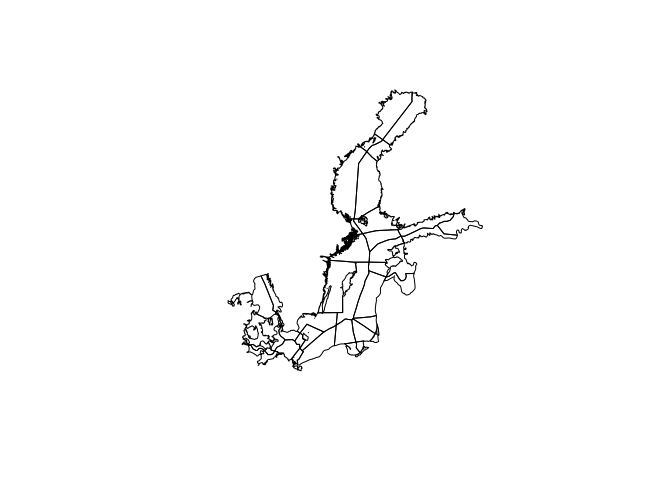
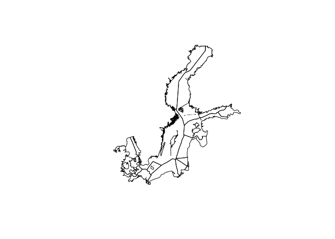
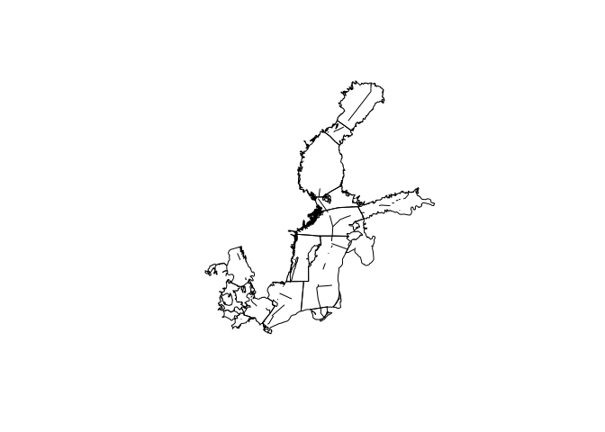

Create EEZ and SUBBASIN maps
================

Create EEZ and SUBBASIN maps
----------------------------

This will be done using `maptools::unionSpatialPolygons` to 'dissolve' the boundaries between BHI regions. This function won't preserve the data frame because there's not the same number of rows.

``` r
## setup ----
library(tidyverse)
library(rgdal)
library(maptools)

dir_spatial <- path.expand('~/github/bhi/baltic2015/spatial')

## prepare rgns data.frame information for EEZ and SUBBASIN
rgns <- read.csv(file.path(dir_spatial, 'regions_lookup_complete_wide.csv'), stringsAsFactors = FALSE) %>%
  mutate(eez_ID      = eez_id      - 300,
         subbasin_ID = subbasin_id - 500)

rgns_eez <- rgns %>%
 group_by(eez_id, eez_name) %>%
  summarize(area_km2_eez = sum(area_km2_rgn)) %>%
  ungroup()

rgns_subbasin <- rgns %>%
  group_by(subbasin_id, subbasin_name) %>%
  summarize(area_km2_subbasin = sum(area_km2_rgn)) %>%
  ungroup()
```

Map of 42 BHI regions
---------------------

``` r
## prepare BHI spatial file ----
bhi  <-  rgdal::readOGR(
  dsn = dir_spatial,
  layer = 'rgn_offshore_gcs', stringsAsFactors = FALSE)
```

    ## OGR data source with driver: ESRI Shapefile 
    ## Source: "/home/jstewart/github/bhi/baltic2015/spatial", layer: "rgn_offshore_gcs"
    ## with 42 features
    ## It has 5 fields

``` r
plot(bhi)
```



``` r
## join bhi@data with rgns information
bhi@data <- bhi@data %>%
  left_join(rgns %>%
              dplyr::rename(rgn_id  = region_id,
                            rgn_name = region_name),
            by = c('rgn_id', 'rgn_name'))
```

Map of 9 BHI EEZs
-----------------

Here we create just the EEZ boundaries by dissolving the subbasin boundaries

``` r
## EEZ: unite spatial polygons ----
bhi_eez <- maptools::unionSpatialPolygons(bhi, ID = bhi@data$eez_ID)
plot(bhi_eez)
```



``` r
## recreate as SpatialPolygonsDataFrame. Note: writeOGR doesn't like tbl_dfs, only data.frames
bhi_eez <- SpatialPolygonsDataFrame(bhi_eez,  as.data.frame(rgns_eez))

## save
# writeOGR(obj    = bhi_eez,
#          dsn    = dir_spatial,
#          layer  = 'BHI_EEZ_regions',
#          driver = 'ESRI Shapefile', overwrite=TRUE)
```

Map of 17 BHI SUBBASINS
-----------------------

Here we create just the SUBBASIN boundaries by dissolving the EEZ boundaries

``` r
## SUBBASIN: unite spatial polygons ----
bhi_subbasin <- unionSpatialPolygons(bhi, ID = bhi@data$subbasin_ID)
plot(bhi_subbasin)
```



``` r
## recreate as SpatialPolygonsDataFrame. Note: writeOGR doesn't like tbl_dfs, only data.frames
bhi_subbasin <- SpatialPolygonsDataFrame(bhi_subbasin,  as.data.frame(rgns_subbasin))

## save
# writeOGR(obj    = bhi_subbasin,
#          dsn    = dir_spatial,
#          layer  = 'BHI_SUBBASIN_regions',
#          driver = 'ESRI Shapefile', overwrite=TRUE)
```

### TECHNICAL NOTE:

This error was because `writeOGR` expects an object with class `data.frame`, not the tidyverse's `tibble`, `tbl`, `tbl_df` classes. Therefore, to use `writeOGR` without error above, I used `as.data.frame`.

    Error in writeOGR(obj = ..., dsn = ..., layer = "...",  : 
      INTEGER() can only be applied to a 'integer', not a 'list'
