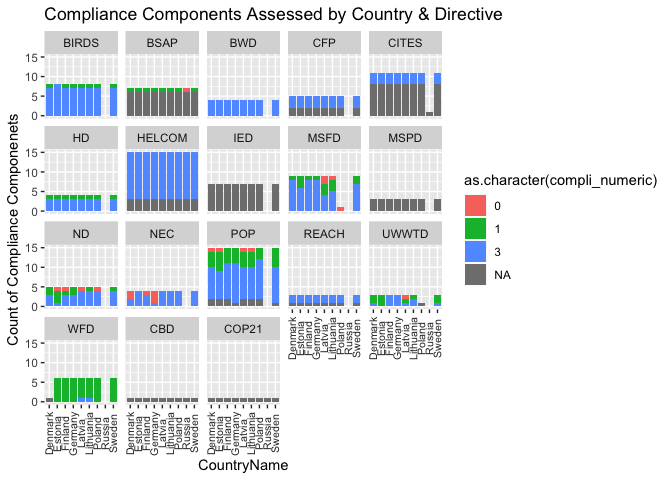

resilience\_prep
================

Preparation of Resilience Data Layers
=====================================

``` r
## Libraries
library(readr)
```

    ## Warning: package 'readr' was built under R version 3.2.4

``` r
library(dplyr)
```

    ## 
    ## Attaching package: 'dplyr'

    ## The following objects are masked from 'package:stats':
    ## 
    ##     filter, lag

    ## The following objects are masked from 'package:base':
    ## 
    ##     intersect, setdiff, setequal, union

``` r
library(tidyr)
library(ggplot2)
```

    ## Warning: package 'ggplot2' was built under R version 3.2.4

``` r
library(RMySQL)
```

    ## Loading required package: DBI

``` r
library(stringr)
library(tools)
library(rprojroot) # install.packages('rprojroot')
```

    ## Warning: package 'rprojroot' was built under R version 3.2.4

``` r
## rprojroot
root <- rprojroot::is_rstudio_project

## make_path() function to 
make_path <- function(...) rprojroot::find_root_file(..., criterion = is_rstudio_project)


dir_layers = make_path('baltic2015/layers') # replaces  file.path(dir_baltic, 'layers')


# root$find_file("README.md")
# 
# root$find_file("ao_need_gl2014.csv")
# 
# root <- find_root_file("install_ohicore.r", 
# 
# withr::with_dir(
#   root_file("DESCRIPTION"))

source('~/github/bhi/baltic2015/prep/common.r')
dir_res    = file.path(dir_prep, 'resilience')

## add a README.md to the prep directory with the rawgit.com url for viewing on GitHub
create_readme(dir_res, 'resilience_prep.rmd') 
```

1. Ecological
-------------

1.1 Biological Integrity
------------------------

The biodiversity data layer will be used to represent biological integrity.

1.2 Goal-specific Regulations
-----------------------------

### 1.2.1 Background

This component of resilience captures the capacity of pressures to be offset by regulations/laws.

There are three components to goal-specific regulation resilience: *(1) existence, (2) compliance, (3) enforcement*

Three international treaties are assessed for all BHI countries for *existence* only.These agreements are:
[Convention on Biodiversity (CBD)](https://www.cbd.int)
[Convention on International Trade in Endangered Species of Wild Fauna and Flora (CITES)](https://www.cites.org)
[Paris Climate Agreement (COP21)](https://treaties.un.org/pages/ViewDetails.aspx?src=TREATY&mtdsg_no=XXVII-7-d&chapter=27&lang=en)

Two Baltic Region agreements will be assessed for *existence* and *compliance* for all countries. These are: Baltic Sea Action Plan (BSAP); Helsinki Convention (HELCOM).

13 EU directives will be assessed for *existence* and *compliance* for BHI countries that are EU member states. These are: Water Framework Directive (WFD), Marine Spatial Planning Directive (MSPD), Marine Strategy Framework Directive (MSFD), Habitat Directive (HD), Common Fisheries Policy (CFP), National Emmissions Ceilings (NEC), Industrial Emissions Directive (IED), Urban Waste Water Treatment Directive (UWWTD), Bathing Water Directive (BWD), Conservation of Wild Birds (BIRDS), Registration, Evaluation, Authorisation and Restriction of Chemicals (REACH), Peristent Organic Pollutants (POP), Nitrates Directive (ND).

### 1.2.2 Scoring

By country for each level assessed for each regulation

#### 1.2.2.1 Existence

Scored as yes (1) or no (0)
Score\_Existence = Score / Max Max = 1

#### 1.2.2.2 Compliance

Fail (0), Partial (1), Full (3)
Not equal increments because Full compliance rewarded more here.

Country\_compliance\_directive = Mean (compliance score)\_all\_compliance\_components

#### 1.2.2.3 Total regulation score

Score\_Existence + Country\_compliance\_directive / (Possible\_Existence + Possible\_Compliance)

Compliance is weighted more heavily than existence when both are scored.

### 1.2.3 Goal Weighting & Mapping

Each regulation will be weighted (1 or 2) for each goal to which is it applied. Regulations are mapped to all the goals to which they directly influence/combat pressures.

### 1.2.4 Resilience Data Layer

Country-specific resilience score (G) for each goal is assigned to each BHI region associated with that country.

G = sum(w\_i \* G\_i) / sum(wi\_i) ; G\_i = specific regulatory dataset total regulation score, w\_i = weight for each i dataset used to assess G

### 1.2.5 Goal-specific data layer preparation

#### 1.2.5.1 Read in data

``` r
## read in data

eu_baltic_scores = read.csv(file.path(dir_res, 'eu_regs_resilience_data.csv'), sep=";")

international_scores = read.csv(file.path(dir_res, 'InternationalAgreements_resilience_data.csv'), sep=";")


## 
str(eu_baltic_scores)
```

    ## 'data.frame':    791 obs. of  13 variables:
    ##  $ DirectiveName                     : Factor w/ 15 levels "Convention on the Protection of the Marine Environment of the Baltic Sea Area 1992",..: 6 6 6 6 6 6 6 6 6 6 ...
    ##  $ DirectiveAbbreviation             : Factor w/ 15 levels "BIRDS","BSAP",..: 15 15 15 15 15 15 15 15 15 15 ...
    ##  $ ReportYear                        : int  NA 2015 2015 2015 2015 2015 2015 2015 2015 2015 ...
    ##  $ CountryName                       : Factor w/ 9 levels "Denmark","Estonia",..: 1 2 2 2 2 2 2 3 3 3 ...
    ##  $ IsCountryAssessed                 : Factor w/ 3 levels "","No","Yes": 2 3 3 3 3 3 3 3 3 3 ...
    ##  $ ComplianceComponent               : Factor w/ 98 levels ""," Combat marine pollution",..: 1 7 16 41 94 97 67 7 16 41 ...
    ##  $ ComplianceComponentScore          : Factor w/ 5 levels "","fail","full",..: 1 5 5 5 5 5 5 5 5 5 ...
    ##  $ NAexplanation                     : Factor w/ 5 levels "","No information provided by Member States",..: 1 1 1 1 1 1 1 1 1 1 ...
    ##  $ ComplianceText                    : Factor w/ 77 levels "","\" As the balance is done in accordance with WFD requirements, it is clear how much less water needs to be abstracted.\"",..: 1 65 48 42 64 64 49 1 4 6 ...
    ##  $ ComplianceTextReference           : Factor w/ 163 levels "","Art. 10","Art. 11 (Annexes IV and VII)",..: 1 109 112 117 122 124 127 109 111 114 ...
    ##  $ Notes_UncertainitiesInECreport    : Factor w/ 10 levels ""," ","German plans to reduce this pressure showed a list of links to legislation and did not introduced the measures (unknown).",..: 1 1 1 1 1 1 7 1 1 1 ...
    ##  $ Notes_AreasForFurtherInvestigation: Factor w/ 28 levels "","\"Finland has an extensive hydrological monitoring network in place, providing daily information about the water levels and rat"| __truncated__,..: 1 1 1 1 1 1 9 1 1 2 ...
    ##  $ Comments                          : Factor w/ 72 levels "","11 threats or pressures were considered: i) Agriculture, ii) Sylviculture, foresty, iii) Mining, extraction of materials and en"| __truncated__,..: 1 1 1 1 1 1 1 1 1 1 ...

``` r
dim(eu_baltic_scores)
```

    ## [1] 791  13

``` r
str(international_scores)
```

    ## 'data.frame':    27 obs. of  14 variables:
    ##  $ DirectiveName                     : Factor w/ 3 levels "Convention on Biodiversity",..: 1 1 1 1 1 1 1 1 1 2 ...
    ##  $ DirectiveAbbreviation             : Factor w/ 3 levels "CBD","CITES",..: 1 1 1 1 1 1 1 1 1 2 ...
    ##  $ DataLink                          : Factor w/ 3 levels "https://treaties.un.org/pages/ViewDetails.aspx?src=TREATY&mtdsg_no=XXVII-7-d&chapter=27&lang=en",..: 2 2 2 2 2 2 2 2 2 3 ...
    ##  $ ReportYear                        : logi  NA NA NA NA NA NA ...
    ##  $ CountryName                       : Factor w/ 9 levels "Denmark","Estonia",..: 1 2 3 4 5 6 7 9 8 1 ...
    ##  $ Existence                         : Factor w/ 1 level "Yes": 1 1 1 1 1 1 1 1 1 1 ...
    ##  $ ExistenceLevel                    : Factor w/ 5 levels "Acceptance","Accession",..: 4 4 1 4 4 4 4 4 4 4 ...
    ##  $ ExistenceNotes                    : Factor w/ 2 levels "All terms, \"ratification\" (rtf), \"accession\" (acs), \"approval\" (apv) and \"acceptance\" (acp), signify the consent of a S"| __truncated__,..: 1 1 1 1 1 1 1 1 1 1 ...
    ##  $ ComplianceComponent               : logi  NA NA NA NA NA NA ...
    ##  $ ComplianceComponentScore          : logi  NA NA NA NA NA NA ...
    ##  $ NAexplanation                     : Factor w/ 1 level "Currently will not assess for compliance": 1 1 1 1 1 1 1 1 1 1 ...
    ##  $ Notes_UncertainitiesInECreport    : logi  NA NA NA NA NA NA ...
    ##  $ Notes_AreasForFurtherInvestigation: logi  NA NA NA NA NA NA ...
    ##  $ Comments                          : logi  NA NA NA NA NA NA ...

``` r
dim(international_scores)
```

    ## [1] 27 14

#### 1.2.5.2 simply data objectives, combine into single object

``` r
eu_baltic_lookup = eu_baltic_scores ## keep the info of text references in case needed
internat_lookup = international_scores


eu_baltic_scores = eu_baltic_scores %>%
                  mutate(Existence = "Yes",
                         ExistenceLevel = "EU_Law",
                         ExistenceNotes = "")%>% ## add existence so that compatible with international ## all EU and Baltic directives / agreements exist (if at EU level are at country level)
                  select(-DirectiveName,-ComplianceText,-ComplianceTextReference,-Notes_UncertainitiesInECreport,-Notes_AreasForFurtherInvestigation)%>%
                  select(DirectiveAbbreviation,ReportYear,CountryName,Existence,ExistenceLevel,ExistenceNotes,IsCountryAssessed,ComplianceComponent, ComplianceComponentScore,NAexplanation,Comments) %>% ## reorder
                      dplyr::rename(NAexplanationCompliance = NAexplanation,
                                    IsCountryComplianceAssessed = IsCountryAssessed)

colnames(eu_baltic_scores)
```

    ##  [1] "DirectiveAbbreviation"       "ReportYear"                 
    ##  [3] "CountryName"                 "Existence"                  
    ##  [5] "ExistenceLevel"              "ExistenceNotes"             
    ##  [7] "IsCountryComplianceAssessed" "ComplianceComponent"        
    ##  [9] "ComplianceComponentScore"    "NAexplanationCompliance"    
    ## [11] "Comments"

``` r
international_scores = international_scores %>%
                      mutate(IsCountryAssessed = "No")  %>% ## this is for compliance
                        select(-DirectiveName,-DataLink,-Notes_UncertainitiesInECreport,-Notes_AreasForFurtherInvestigation) %>%
                  select(DirectiveAbbreviation,ReportYear,CountryName,Existence,ExistenceLevel,ExistenceNotes,IsCountryAssessed,ComplianceComponent, ComplianceComponentScore,NAexplanation,Comments) %>%## reorder
                      dplyr::rename(NAexplanationCompliance = NAexplanation,
                                    IsCountryComplianceAssessed = IsCountryAssessed)

colnames(international_scores)
```

    ##  [1] "DirectiveAbbreviation"       "ReportYear"                 
    ##  [3] "CountryName"                 "Existence"                  
    ##  [5] "ExistenceLevel"              "ExistenceNotes"             
    ##  [7] "IsCountryComplianceAssessed" "ComplianceComponent"        
    ##  [9] "ComplianceComponentScore"    "NAexplanationCompliance"    
    ## [11] "Comments"

``` r
goal_spec = rbind(eu_baltic_scores, international_scores)
```

#### 1.2.5.3 assign numeric score

``` r
goal_spec = goal_spec %>% 
            mutate(exist_numeric = ifelse(Existence == "Yes",1,0),
                   compli_numeric = ifelse(is.na(ComplianceComponentScore),NA,
                                    ifelse(ComplianceComponentScore == "Not applicable", NA,
                                    ifelse(ComplianceComponentScore == "fail",0,
                                    ifelse(ComplianceComponentScore == "partial",1,
                                    ifelse(ComplianceComponentScore == "full",3,NA))))))
```

#### 1.2.5.4 Plot numeric score

With the numeric score for Compliance Components, can not see overlapping scores for different components

``` r
ggplot(goal_spec) + 
  geom_point(aes(CountryName,exist_numeric))+
  facet_wrap(~DirectiveAbbreviation)+
  ylim(0,1)+
   theme(axis.text.x = element_text(colour="grey20", size=8, angle=90, 
                                    hjust=.5, vjust=.5, face = "plain"))+
  ggtitle("Existence Score")
```

<!-- -->

``` r
ggplot(goal_spec) + 
  geom_point(aes(CountryName,compli_numeric))+
  facet_wrap(~DirectiveAbbreviation)+
  ylim(0,1)+
   theme(axis.text.x = element_text(colour="grey20", size=8, angle=90, 
                                    hjust=.5, vjust=.5, face = "plain"))+
  ggtitle("Compliance Score")
```

    ## Warning: Removed 669 rows containing missing values (geom_point).

<!-- -->

#### 1.2.5.5 Separate Existance and Compliance

``` r
goal_spec_exist = goal_spec %>%
                  select(DirectiveAbbreviation:ExistenceNotes, exist_numeric)

goal_spec_compli = goal_spec %>%
                  select(DirectiveAbbreviation:CountryName, IsCountryComplianceAssessed:Comments, compli_numeric)
```

#### 1.2.5.6 How many compliance components assessed?

Some directives have no components assessed. Others have a subset that could not be assessed - these might differ by country. Minimal differences by country. WDF not assessed for Denmark. Germany assessed for one more POP component. Poland asssesse for one fewer UWWTD component.
**Gray bars are components not assessed**

``` r
goal_spec_compli_n1 = goal_spec_compli %>%
                      count(DirectiveAbbreviation, CountryName,compli_numeric)

ggplot(goal_spec_compli, aes(CountryName,fill=as.character(compli_numeric)))+ 
  geom_bar(position="stack")+
  facet_wrap(~DirectiveAbbreviation)+
  ylab("Count of Compliance Componenets")+
  theme(axis.text.x = element_text(colour="grey20", size=8, angle=90, 
                                    hjust=.5, vjust=.5, face = "plain"))+
  ggtitle("Compliance Components Assessed by Country & Directive")
```

<!-- -->

#### 1.2.5.7 Mean Compliance score

``` r
## calculate the mean value for all scored compliance by directive and country
goal_spec_compli_mean = goal_spec_compli%>%
            select(DirectiveAbbreviation,CountryName,compli_numeric) %>%
            group_by(DirectiveAbbreviation,CountryName)%>%          
            summarise(compli_mean = mean(compli_numeric, na.rm=TRUE)) %>%
            ungroup()

                      
## get the number of components assessed
goal_spec_compli_n2 = goal_spec_compli%>%
                      select(DirectiveAbbreviation,CountryName,compli_numeric) %>%
                      filter(!is.na(compli_numeric))%>%
                      count(DirectiveAbbreviation,CountryName)

## merge the mean score and the count of components
goal_spec_compli_mean = goal_spec_compli_mean %>%
                        left_join(., goal_spec_compli_n2, 
                                  by= c("DirectiveAbbreviation","CountryName"))
               

dim(goal_spec_compli_mean)
```

    ## [1] 149   4

#### 1.2.5.8 Plot Mean Compliance score

**Max compliance score can be 3**

``` r
ggplot(goal_spec_compli_mean)+
  geom_point(aes(CountryName,compli_mean,size=n))+
  facet_wrap(~DirectiveAbbreviation)+
  ylim(0,4)+
  ylab("Mean compliance score")+
  theme(axis.text.x = element_text(colour="grey20", size=8, angle=90, 
                                    hjust=.5, vjust=.5, face = "plain"))+
  ggtitle("Mean Compliance Score")
```

    ## Warning: Removed 45 rows containing missing values (geom_point).

<!-- -->

#### 1.2.5.9 Existence score

``` r
dim(goal_spec_exist)#818   7
```

    ## [1] 818   7

``` r
goal_spec_exist = goal_spec_exist %>%
                  select(DirectiveAbbreviation,CountryName,exist_numeric,ExistenceLevel) %>%
                  distinct(.)
                  
dim(goal_spec_exist)#149   4
```

    ## [1] 149   4

``` r
head(goal_spec_exist)
```

    ##   DirectiveAbbreviation CountryName exist_numeric ExistenceLevel
    ## 1                   WFD     Denmark             1         EU_Law
    ## 2                   WFD     Estonia             1         EU_Law
    ## 3                   WFD     Finland             1         EU_Law
    ## 4                   WFD     Germany             1         EU_Law
    ## 5                   WFD      Latvia             1         EU_Law
    ## 6                   WFD   Lithuania             1         EU_Law

#### 1.2.5.10 Overall score

Max score is 4 (1 for existence, 3 for compliance).

All directives are evaluated based on a maximum score of 4. Therefore, for directives where only existence can be measured (no compliance metrics), the maximum score possible is 1/4. These directives are: *IED, MSPD, CBD, CITES, COP21*. Directives that are scored on both existence and compliance are: *BIRDS, BSAP, BWD, CFP, HD, HELCOM, MSFD, ND, NEC, POP, REACH, UWWTD, WFD*.

In two directives scored for compliance, there was a country where compliance could not be scored. For UWWTD, no compliance report was available for Poland. For WFD, no compliance report was available for Denmark. However, these two countries are still evaluated on both existence and compliance so that their score is comparable to other countries for these directives.

``` r
## merge existence and compliance
goal_spec_overall = full_join(goal_spec_exist, goal_spec_compli_mean,
                              by=c("DirectiveAbbreviation","CountryName")) %>%
                    mutate(compli_mean2 = ifelse(is.na(compli_mean),0,compli_mean)) %>% ## make a column where NA are zero so that it does not screw up the total score
                    mutate(total = exist_numeric + compli_mean2, 
                           max_score =4)

## This code not necessary if all directives get a max score of 4. 
# ## for UWWTD, Poland and WFD, Denmark, change max score to 4 so that are comparable
# goal_spec_overall = goal_spec_overall %>%
#                     mutate(max_score = ifelse(CountryName=="Poland" & DirectiveAbbreviation =="UWWTD",4,max_score),
#                            max_score = ifelse(CountryName=="Denmark" & DirectiveAbbreviation =="WFD",4,max_score))
# 


## calculate overall score
goal_spec_overall = goal_spec_overall %>%
                    mutate(overall_score = total/max_score) %>% ## if compli_mean is not NA, the max total score is 4; if it is NA, then only existence assessend and max is 1
                    mutate(score_level = ifelse(max_score == 1, "existence", "existence and compliance")) %>%
  select(DirectiveAbbreviation, CountryName,overall_score, score_level)

## change Helcom to HELCOM

goal_spec_overall = goal_spec_overall %>%
                    mutate(DirectiveAbbreviation = as.character(DirectiveAbbreviation))%>%
                    mutate(DirectiveAbbreviation = ifelse(DirectiveAbbreviation == "Helcom", "HELCOM", DirectiveAbbreviation))
```

#### 1.2.5.11 Plot Overall score

``` r
ggplot(goal_spec_overall)+
  geom_point(aes(CountryName,overall_score, colour=score_level))+
  facet_wrap(~DirectiveAbbreviation)+
  ylim(0,1)+
   theme(axis.text.x = element_text(colour="grey20", size=8, angle=90, 
                                    hjust=.5, vjust=.5, face = "plain"))+
  ggtitle("Overall Score per Regulation")
```

<!-- -->

#### 1.2.5.12 Plot Overall score by country across all directives

``` r
ggplot(goal_spec_overall)+
  geom_point(aes(DirectiveAbbreviation,overall_score, colour=score_level))+
  facet_wrap(~CountryName)+
  ylim(0,1)+
   theme(axis.text.x = element_text(colour="grey20", size=6, angle=90, 
                                    hjust=.5, vjust=.5, face = "plain"))+
  ggtitle("Overall Score per Regulation")
```

<!-- -->

### 1.2.6 Exploring alternative mapping and weighting outcomes

**Mapping**
Mapping the directives to goals can be done with different criteria. We explore 2 alternative mapping critera.
(1) Direct effect of directive on goal status - expert opinion
(2) Direct or indirect effect directive on goal status - expert opinion and key word search of the directives

*Note* for this exploration this is done at the subgoal level. NUT, CON, TRA are treated as subgoals (not subcomponents) here.

**Weights**
Weights among different directives can be set using different criteria. We calculate *G* in the resilience equation for two different mapping criteria.

G = sum(w\_i \* G\_i) / sum(wi\_i) ; G\_i = specific regulatory dataset, w\_i = weight for each i dataset used to assess G

In OHI, weights are based on "quality of information contained in the dataset with regard to estimates of regulation effectiveness." In BHI, we are modifying this approach. Instead w\_i are based on the overall importance and policy focus among the different directives.

#### 1.2.6.1 Load mapping and weighting layers

``` r
map_direct = read.csv(file.path(dir_res, 'resilience_matrix_direct.csv'), stringsAsFactors = FALSE)

map_indirect_direct = read.csv(file.path(dir_res, 'resilience_matrix_indirect_direct.csv'), stringsAsFactors = FALSE)


weights_importance = read.csv(file.path(dir_res, 'resilience_weights_directive_importance.csv'))
```

#### 1.2.6.2 Calculate *G* for each country for direct mapping

``` r
## vector of unique regulations
unique_regs = map_direct %>%
              select(WFD:IED)%>%
              colnames()
unique_regs
```

    ##  [1] "WFD"    "HD"     "MSFD"   "HELCOM" "BSAP"   "REACH"  "POP"   
    ##  [8] "CBD"    "CITES"  "CFP"    "COP21"  "MSPD"   "BWD"    "BIRDS" 
    ## [15] "ND"     "UWWTD"  "NEC"    "IED"

``` r
## long data format for mapping with columns goal, regulation, map
map_direct_long = map_direct %>%
                  select(-component,-spp_status,-wgi_all)%>% ## remove component column, remove environment and social resilience
                  gather(regulation,map, -goal) %>%
                  filter(map %in% unique_regs) %>%
                  arrange(goal)
  
                  
head(map_direct_long)
```

    ##   goal regulation    map
    ## 1   AO       MSFD   MSFD
    ## 2   AO        CFP    CFP
    ## 3  CON       MSFD   MSFD
    ## 4  CON     HELCOM HELCOM
    ## 5  CON       BSAP   BSAP
    ## 6  CON      REACH  REACH

``` r
## clean weights_importance object
weights_importance = weights_importance %>%
                      filter(layer != 'spp_status')%>%
                      filter(layer != 'wgi_all' )


## join mapping to weights
map_direct_weights = left_join(map_direct_long, weights_importance,
                        by=c("regulation"="layer"))
```

    ## Warning in left_join_impl(x, y, by$x, by$y): joining factor and character
    ## vector, coercing into character vector

``` r
## join country scoring to mapping and weights
map_direct_weights_score = inner_join(goal_spec_overall, map_direct_weights,
                                     by=c("DirectiveAbbreviation"="regulation"))%>%
                           dplyr::rename(regulation = DirectiveAbbreviation,
                                         country= CountryName)%>%
                           select(-score_level) %>%
                           arrange(country,goal)
## calculate country G

country_G_direct = map_direct_weights_score %>%
                   select(-map,-type)%>%
                   mutate(wi_Gi = weight*overall_score)%>%
                   group_by(country,goal)%>%
                   summarise(G = sum(wi_Gi)/sum(weight))%>%
                   ungroup()
              
## plot country G direct 
ggplot(country_G_direct)+
  geom_point(aes(goal,G))+
  facet_wrap(~country)+
  ylim(0,1)+
  theme(axis.text.x = element_text(colour="grey20", size=6, angle=90, 
                                    hjust=.5, vjust=.5, face = "plain"))+
  ggtitle("Country G value (overall resilience) per Goal with direct mapping")
```

<!-- -->

``` r
ggplot(country_G_direct)+
  geom_point(aes(country,G))+
  facet_wrap(~goal)+
  ylim(0,1)+
  theme(axis.text.x = element_text(colour="grey20", size=6, angle=90, 
                                    hjust=.5, vjust=.5, face = "plain"))+
  ggtitle("Country G value (overall resilience) per Goal with direct mapping")
```

<!-- -->

#### 1.2.6.3 Calculate *G* for each country for direct and indirect mapping

``` r
## vector of unique regulations
unique_regs = map_indirect_direct %>%
              select(WFD:IED)%>%
              colnames()
unique_regs
```

    ##  [1] "WFD"    "HD"     "MSFD"   "HELCOM" "BSAP"   "REACH"  "POP"   
    ##  [8] "CBD"    "CITES"  "CFP"    "COP21"  "MSPD"   "BWD"    "BIRDS" 
    ## [15] "ND"     "UWWTD"  "NEC"    "IED"

``` r
## long data format for mapping with columns goal, regulation, map
map_indirect_direct_long = map_indirect_direct %>%
                  select(-component,-spp_status,-wgi_all)%>% ## remove component column, remove environment and social resilience
                  gather(regulation,map, -goal) %>%
                  filter(map %in% unique_regs) %>%
                  arrange(goal)
  
                  
head(map_indirect_direct_long)
```

    ##   goal regulation  map
    ## 1   AO        WFD  WFD
    ## 2   AO       MSFD MSFD
    ## 3   AO       BSAP BSAP
    ## 4   AO        CFP  CFP
    ## 5  CON        WFD  WFD
    ## 6  CON       MSFD MSFD

``` r
## clean weights_importance object
weights_importance = weights_importance %>%
                      filter(layer != 'spp_status')%>%
                      filter(layer != 'wgi_all' )


## join mapping to weights
map_indirect_direct_weights = left_join(map_indirect_direct_long, weights_importance,
                        by=c("regulation"="layer"))
```

    ## Warning in left_join_impl(x, y, by$x, by$y): joining factor and character
    ## vector, coercing into character vector

``` r
## join country scoring to mapping and weights
map_indirect_direct_weights_score = inner_join(goal_spec_overall, map_indirect_direct_weights,
                                     by=c("DirectiveAbbreviation"="regulation"))%>%
                           dplyr::rename(regulation = DirectiveAbbreviation,
                                         country= CountryName)%>%
                           select(-score_level) %>%
                           arrange(country,goal)
## calculate country G

country_G_indirect_direct = map_indirect_direct_weights_score %>%
                   select(-map,-type)%>%
                   mutate(wi_Gi = weight*overall_score)%>%
                   group_by(country,goal)%>%
                   summarise(G = sum(wi_Gi)/sum(weight))%>%
                   ungroup()
              
## plot country G direct 
ggplot(country_G_indirect_direct)+
  geom_point(aes(goal,G))+
  facet_wrap(~country)+
  ylim(0,1)+
  theme(axis.text.x = element_text(colour="grey20", size=6, angle=90, 
                                    hjust=.5, vjust=.5, face = "plain"))+
  ggtitle("Country G value (overall resilience) per Goal w/ indirect + direct mapping")
```

<!-- -->

``` r
ggplot(country_G_direct)+
  geom_point(aes(country,G))+
  facet_wrap(~goal)+
  ylim(0,1)+
  theme(axis.text.x = element_text(colour="grey20", size=6, angle=90, 
                                    hjust=.5, vjust=.5, face = "plain"))+
  ggtitle("Country G value (overall resilience) per Goal w/ indirect +direct mapping")
```

<!-- -->

#### 1.2.6.4 Plot comparison of *G* by mapping approach

``` r
country_G_compare = bind_rows(
                          mutate(country_G_direct,mapping="direct"),
                          mutate(country_G_indirect_direct,mapping= "indirect and direct"))

## plot country G comparison 
ggplot(country_G_compare)+
  geom_point(aes(goal,G, color=mapping, shape=mapping))+
  facet_wrap(~country)+
  ylim(0,1)+
  scale_shape_manual(values=c(16,6))+
  theme(axis.text.x = element_text(colour="grey20", size=6, angle=90, 
                                    hjust=.5, vjust=.5, face = "plain"))+
  ggtitle("Country G Mapping Comparison")
```

<!-- -->

``` r
## plot country G direct 
ggplot(country_G_compare)+
  geom_point(aes(country,G, colour=mapping,shape=mapping))+
  facet_wrap(~goal)+
  ylim(0,1)+
   scale_shape_manual(values=c(16,6))+
  theme(axis.text.x = element_text(colour="grey20", size=6, angle=90, 
                                    hjust=.5, vjust=.5, face = "plain"))+
  ggtitle("Country G Mapping Comparison")
```

<!-- -->

TO DO
-----

1.  Decide on weight and mapping
2.  Prepare final data layers (scores for country applied to BHI regions)

2. Social
---------
